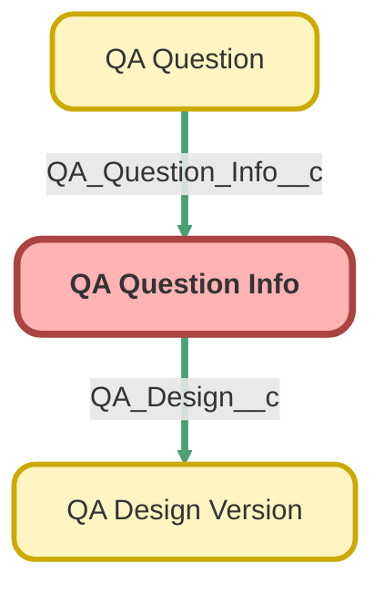

---
hide:
  - path
---

<!-- This file is auto-generated. if you do not want it to be overwritten, set TRUE in the line below -->
<!-- DO_NOT_OVERWRITE_DOC=FALSE -->

## Schema

<!-- Object description -->

## Fields

| Name      | Label | Type | Description |
| :-------- | :---- | :--: | :---------- | 
| Help_Text__c | Help Text | Text | The question's help text, when rendered within a component. |
| Order__c | Order | Number | Controls the order that the questions will appear on the dynamic form |
| Pass_Fail__c | Pass/Fail | Checkbox | Score value should be 0.  Questions generated using this will have their score set to -100 to fail the form. |
| QA_Design__c | QA Design | MasterDetail | undefined |
| Question_Prompt__c | Question Prompt | Text | The label of the question "field" as displayed in a component |
| Require_Comment__c | Require Comment | Picklist | Questions generated using this info will require data in the "Comments" field if they use the selected response. |
| Response_1__c | Response 1 | Text | undefined |
| Response_1_Score__c | Response 1 Score | Number | undefined |
| Response_2__c | Response 2 | Text | undefined |
| Response_2_Score__c | Response 2 Score | Number | undefined |
| Response_3__c | Response 3 | Text | undefined |
| Response_3_Score__c | Response 3 Score | Number | undefined |
| Response_4__c | Response 4 | Text | undefined |
| Response_4_Score__c | Response 4 Score | Number | undefined |
| Score_Value__c | Score Value | Percent | The value of this question as a part of the form.  Value of individual questions cannot exceed 100 on a design |
| Type__c | Type | Picklist | Controls appearance and behavior of questions |

## Validation Rules

| Rule      | Active | Description | Formula |
| :-------- | :---- | :---------- | :------ |
| A_Response_Score_Must_Match_Value | Yes | At least one of the responses must match the total score value | ISPICKVAL(Type__c, "Standard") && NOT(Response_1_Score__c/100 =  Score_Value__c  Response_2_Score__c/100 =  Score_Value__c  Response_3_Score__c/100 =  Score_Value__c  Response_4_Score__c/100 =  Score_Value__c) |
| Block_Checkbox_Options_For_Standard | Yes | Checkbox options / modifiers should only be used for the checkbox question type | Pass_Fail__c && NOT(ISPICKVAL(Type__c,"Checkbox")) |
| Block_Response_For_Checkbox | Yes | If the question info's type is checkbox, it shouldn't have any responses.  Wouldn't break anything, this is just to avoid confusion. | ISPICKVAL(Type__c, "Checkbox") && NOT( ISBLANK(Response_1__c) && ISBLANK(Response_2__c) && ISBLANK(Response_3__c) && ISBLANK(Response_4__c) && ISBLANK(Response_1_Score__c) && ISBLANK(Response_2_Score__c) && ISBLANK(Response_3_Score__c) && ISBLANK(Response_4_Score__c) ) |
| Block_Score_From_PassFail | Yes | Pass/Fail checkbox questions should have a score of 0 | Score_Value__c != 0 &&  ISPICKVAL(Type__c , "Checkbox") &&  Pass_Fail__c |
| Lock_Activated_Design | Yes | Prevent any and all edits of question info for designs that have been activated | NOT(ISBLANK(QA_Design__r.Activation_Date__c)) |
| Requiring_Comment_Needs_Response | Yes | If requiring notes for a response, that response cannot be null | (ISPICKVAL( Require_Comment__c , "Response 1" ) && ISBLANK(Response_1__c))  (ISPICKVAL( Require_Comment__c , "Response 2" ) && ISBLANK(Response_2__c))  (ISPICKVAL( Require_Comment__c , "Response 3" ) && ISBLANK(Response_3__c))  (ISPICKVAL( Require_Comment__c , "Response 4" ) && ISBLANK(Response_4__c)) |
| Response_1_Response_Score_Pair | Yes | If response 1 exists, it needs a score value | ISPICKVAL(Type__c, "Standard") &&  ((ISBLANK(Response_1__c) && NOT(ISBLANK(Response_1_Score__c)))  (NOT(ISBLANK(Response_1__c)) && ISBLANK(Response_1_Score__c))) |
| Response_2_Response_Score_Pair | Yes | If response 2 exists, it needs a score value | ISPICKVAL(Type__c, "Standard") &&  ((ISBLANK(Response_2__c) && NOT(ISBLANK(Response_2_Score__c)))  (NOT(ISBLANK(Response_2__c)) && ISBLANK(Response_2_Score__c))) |
| Response_3_Response_Score_Pair | Yes | If response 3 exists, it needs a score value | ISPICKVAL(Type__c, "Standard") &&  ((ISBLANK(Response_3__c) && NOT(ISBLANK(Response_3_Score__c)))  (NOT(ISBLANK(Response_3__c)) && ISBLANK(Response_3_Score__c))) |
| Response_4_Response_Score_Pair | Yes | If response 4 exists, it needs a score value | ISPICKVAL(Type__c, "Standard") &&  ((ISBLANK(Response_4__c) && NOT(ISBLANK(Response_4_Score__c)))  (NOT(ISBLANK(Response_4__c)) && ISBLANK(Response_4_Score__c))) |
| Response_Score_Exceeds_Value | Yes | A response's score cannot exceed the question's value | Response_1_Score__c/100 > Score_Value__c  Response_2_Score__c/100 > Score_Value__c  Response_3_Score__c/100 > Score_Value__c  Response_4_Score__c/100 > Score_Value__c |

## Related Flows

| Object | Name      | Type | Description |
| :----  | :-------- | :--: | :---------- | 
| 💻 | [QA_Autolaunched_Check_If_Notes_Required](../flows/QA_Autolaunched_Check_If_Notes_Required.md) [🕒](../flows/QA_Autolaunched_Check_If_Notes_Required-history.md) |  Auto Launched Flow | Autolaunched flow that checks a QA's questions to see if any require a comment on the QA form.  Returns a message indicating the first question found that requires notes |
| 💻 | [QA_Design_Screen_New_Version](../flows/QA_Design_Screen_New_Version.md) [🕒](../flows/QA_Design_Screen_New_Version-history.md) |  Screen Flow | Added new fields (pass/fail, require comment) to question copy  Creates a new version of a QA design.  Either from existing version or from scratch. |
| QA_Design_Version__c | [QA_Design_After_Save_Validation](../flows/QA_Design_After_Save_Validation.md) [🕒](../flows/QA_Design_After_Save_Validation-history.md) |  Record After Save | <!-- --> |
| QA_Question_Info__c | [QA_Question_Info_After_Delete_Prevent_Deletion](../flows/QA_Question_Info_After_Delete_Prevent_Deletion.md) [🕒](../flows/QA_Question_Info_After_Delete_Prevent_Deletion-history.md) |  Record Before Delete | Stops deletion of info that is or once was part of active design. |
| Quality_Assurance_QA__c | [QA_After_Save_Create_and_Delete_Questions](../flows/QA_After_Save_Create_and_Delete_Questions.md) [🕒](../flows/QA_After_Save_Create_and_Delete_Questions-history.md) |  Record After Save | Creates questions for QA form when a new design is selected, and deletes questions when a design is deselected. |

## Related Apex Classes

| Apex Class | Type |
| :----      | :--: | 
| [QaFormController](../apex/QaFormController.md) | Lightning Controller |
| [QaFormController_TEST](../apex/QaFormController_TEST.md) | Test |

## Related Profiles

| Profile | User License |
| :----      | :--: | 
| [Admin](../profiles/Admin.md) |  Salesforce |
| [Analytics Cloud Integration User](../profiles/Analytics%20Cloud%20Integration%20User.md) |  Analytics  Cloud  Integration  User |
| [Analytics Cloud Security User](../profiles/Analytics%20Cloud%20Security%20User.md) |  Analytics  Cloud  Integration  User |
| [Anypoint Integration](../profiles/Anypoint%20Integration.md) |  Identity |
| [B2BMA Integration User](../profiles/B2BMA%20Integration%20User.md) |  B2 B M A  Integration  User |
| [Billing User](../profiles/Billing%20User.md) |  Salesforce |
| [Bot Profile](../profiles/Bot%20Profile.md) |  Salesforce |
| [Business Development](../profiles/Business%20Development.md) |  Salesforce |
| [Call Center](../profiles/Call%20Center.md) |  Salesforce |
| [Chatter External User](../profiles/Chatter%20External%20User.md) |  Chatter  External |
| [Chatter Free User](../profiles/Chatter%20Free%20User.md) |  Chatter  Free |
| [Chatter Moderator User](../profiles/Chatter%20Moderator%20User.md) |  Chatter  Free |
| [Client Onboarding - Admin](../profiles/Client%20Onboarding%20-%20Admin.md) |  Salesforce |
| [Client Onboarding - RM](../profiles/Client%20Onboarding%20-%20RM.md) |  Salesforce |
| [Client Servicing Team](../profiles/Client%20Servicing%20Team.md) |  Salesforce |
| [Compliance Manager](../profiles/Compliance%20Manager.md) |  Salesforce |
| [ContractManager](../profiles/ContractManager.md) |  Salesforce |
| [Director of Operations](../profiles/Director%20of%20Operations.md) |  Salesforce |
| [Director of Sales](../profiles/Director%20of%20Sales.md) |  Salesforce |
| [Distributions](../profiles/Distributions.md) |  Salesforce |
| [Einstein Agent User](../profiles/Einstein%20Agent%20User.md) |  Einstein  Agent |
| [ESW_Agentforce_MIAW_1748035300267 Profile](../profiles/ESW_Agentforce_MIAW_1748035300267%20Profile.md) |  Guest  User  License |
| [ESW_Agentforce_MIAW_1748385215843 Profile](../profiles/ESW_Agentforce_MIAW_1748385215843%20Profile.md) |  Guest  User  License |
| [ESW_CE_Chat_1692890394498 Profile](../profiles/ESW_CE_Chat_1692890394498%20Profile.md) |  Guest  User  License |
| [ESW_CE_Chat_Moe_1693182845676 Profile](../profiles/ESW_CE_Chat_Moe_1693182845676%20Profile.md) |  Guest  User  License |
| [ESW_Login_Help_1697133738638 Profile](../profiles/ESW_Login_Help_1697133738638%20Profile.md) |  Guest  User  License |
| [ESW_Login_Help_Simply_1700075140889 Profile](../profiles/ESW_Login_Help_Simply_1700075140889%20Profile.md) |  Guest  User  License |
| [ESW_Omni_Messaging_1694183770479 Profile](../profiles/ESW_Omni_Messaging_1694183770479%20Profile.md) |  Guest  User  License |
| [ESW_Omni_Messaging_CO_1696448547822 Profile](../profiles/ESW_Omni_Messaging_CO_1696448547822%20Profile.md) |  Guest  User  License |
| [ESW_Omni_Messaging_Sallus_1700075448386 Profile](../profiles/ESW_Omni_Messaging_Sallus_1700075448386%20Profile.md) |  Guest  User  License |
| [ESW_Omni_Messaging_Simply_1700076370188 Profile](../profiles/ESW_Omni_Messaging_Simply_1700076370188%20Profile.md) |  Guest  User  License |
| [ESW_QA_Login_1699666348585 Profile](../profiles/ESW_QA_Login_1699666348585%20Profile.md) |  Guest  User  License |
| [ESW_QA_Messaging_1699974036493 Profile](../profiles/ESW_QA_Messaging_1699974036493%20Profile.md) |  Guest  User  License |
| [ESW_Sales_Chat_1697460991337 Profile](../profiles/ESW_Sales_Chat_1697460991337%20Profile.md) |  Guest  User  License |
| [ESW_Sallus_Login_Chat_1700072925200 Profile](../profiles/ESW_Sallus_Login_Chat_1700072925200%20Profile.md) |  Guest  User  License |
| [External Apps Login User](../profiles/External%20Apps%20Login%20User.md) |  External  Apps  Login |
| [Finance Manager Lightning](../profiles/Finance%20Manager%20Lightning.md) |  Salesforce |
| [Guest License User](../profiles/Guest%20License%20User.md) |  Guest  User  License |
| [Help Center Profile](../profiles/Help%20Center%20Profile.md) |  Guest  User  License |
| [Identity User](../profiles/Identity%20User.md) |  Identity |
| [Incoming_SMS Profile](../profiles/Incoming_SMS%20Profile.md) |  Guest  User  License |
| [IT](../profiles/IT.md) |  Salesforce |
| [Leadership Lightning](../profiles/Leadership%20Lightning.md) |  Salesforce |
| [Leadership](../profiles/Leadership.md) |  Salesforce |
| [Learning %26 Development](../profiles/Learning%20%2526%20Development.md) |  Salesforce |
| [Lightning Client Onboarding](../profiles/Lightning%20Client%20Onboarding.md) |  Salesforce |
| [Lightning Compliance](../profiles/Lightning%20Compliance.md) |  Salesforce |
| [Lightning Saver User](../profiles/Lightning%20Saver%20User.md) |  Salesforce |
| [Lightning Service Manager](../profiles/Lightning%20Service%20Manager.md) |  Salesforce |
| [Lightning Service User](../profiles/Lightning%20Service%20User.md) |  Salesforce |
| [Marketing Team](../profiles/Marketing%20Team.md) |  Salesforce |
| [MarketingProfile](../profiles/MarketingProfile.md) |  Salesforce |
| [Master Administrator](../profiles/Master%20Administrator.md) |  Salesforce |
| [Minimum Access - API Only Integrations](../profiles/Minimum%20Access%20-%20API%20Only%20Integrations.md) |  Salesforce  Integration |
| [Minimum Access - Salesforce](../profiles/Minimum%20Access%20-%20Salesforce.md) |  Salesforce |
| [myubiquity Profile](../profiles/myubiquity%20Profile.md) |  Guest  User  License |
| [Operations VP](../profiles/Operations%20VP.md) |  Salesforce |
| [Operations](../profiles/Operations.md) |  Salesforce |
| [Paradigm Help Center Profile](../profiles/Paradigm%20Help%20Center%20Profile.md) |  Guest  User  License |
| [Payroll Koncierge](../profiles/Payroll%20Koncierge.md) |  Salesforce |
| [Payroll Team](../profiles/Payroll%20Team.md) |  Salesforce |
| [People %26 Culture](../profiles/People%20%2526%20Culture.md) |  Salesforce |
| [Pre-chat Site Profile](../profiles/Pre-chat%20Site%20Profile.md) |  Guest  User  License |
| [Product Innovation Leadership](../profiles/Product%20Innovation%20Leadership.md) |  Salesforce |
| [Product Innovation User](../profiles/Product%20Innovation%20User.md) |  Salesforce |
| [PSM Team](../profiles/PSM%20Team.md) |  Salesforce |
| [R%26W](../profiles/R%2526W.md) |  Salesforce |
| [Read Only](../profiles/Read%20Only.md) |  Salesforce |
| [Sales Administrator](../profiles/Sales%20Administrator.md) |  Salesforce |
| [Sales Coordinator](../profiles/Sales%20Coordinator.md) |  Salesforce |
| [Sales Insights Integration User](../profiles/Sales%20Insights%20Integration%20User.md) |  Sales  Insights  Integration  User |
| [Sales Team - Limited](../profiles/Sales%20Team%20-%20Limited.md) |  Salesforce |
| [Sales Team](../profiles/Sales%20Team.md) |  Salesforce |
| [Salesforce API Only System Integrations](../profiles/Salesforce%20API%20Only%20System%20Integrations.md) |  Salesforce  Integration |
| [SalesforceIQ Integration User](../profiles/SalesforceIQ%20Integration%20User.md) |  Salesforce I Q  Integration  User |
| [Saver Manager](../profiles/Saver%20Manager.md) |  Salesforce |
| [Simple Survey Profile](../profiles/Simple%20Survey%20Profile.md) |  Guest  User  License |
| [Simply Help Center Profile](../profiles/Simply%20Help%20Center%20Profile.md) |  Guest  User  License |
| [SolutionManager](../profiles/SolutionManager.md) |  Salesforce |
| [Standard](../profiles/Standard.md) |  Salesforce |
| [StandardAul](../profiles/StandardAul.md) |  Salesforce  Platform |
| [Super System Administrator](../profiles/Super%20System%20Administrator.md) |  Salesforce |
| [Sys Dev Admin](../profiles/Sys%20Dev%20Admin.md) |  Salesforce |
| [Transitions Team](../profiles/Transitions%20Team.md) |  Salesforce |
| [Ubiquity Help Center Profile](../profiles/Ubiquity%20Help%20Center%20Profile.md) |  Guest  User  License |
| [Zoom Webhooks Profile](../profiles/Zoom%20Webhooks%20Profile.md) |  Guest  User  License |

## Related Permission Sets

| Permission Set | User License |
| :----      | :--: | 
| [Attachments_and_Notes_Migrator](../permissionsets/Attachments_and_Notes_Migrator.md) | None |
| [Data_Loader](../permissionsets/Data_Loader.md) | None |
| [Developer](../permissionsets/Developer.md) | None |
| [MagicMover](../permissionsets/MagicMover.md) | None |
| [Manager](../permissionsets/Manager.md) | None |
| [Master](../permissionsets/Master.md) | None |
| [Modify_All](../permissionsets/Modify_All.md) | None |
| [QA_Access_Dynamic](../permissionsets/QA_Access_Dynamic.md) | None |
| [QA_Manage_Designs](../permissionsets/QA_Manage_Designs.md) | None |
| [sfdcInternalInt__sfdc_a360_sfcrm_data_extract](../permissionsets/sfdcInternalInt__sfdc_a360_sfcrm_data_extract.md) | None |
| [sfdcInternalInt__sfdc_slack](../permissionsets/sfdcInternalInt__sfdc_slack.md) | None |
| [View_All](../permissionsets/View_All.md) | None |
| [View_QA_Records](../permissionsets/View_QA_Records.md) | None |

_Documentation generated with [sfdx-hardis](https://sfdx-hardis.cloudity.com), by [Cloudity](https://www.cloudity.com/) & [friends](https://github.com/hardisgroupcom/sfdx-hardis/graphs/contributors)_
