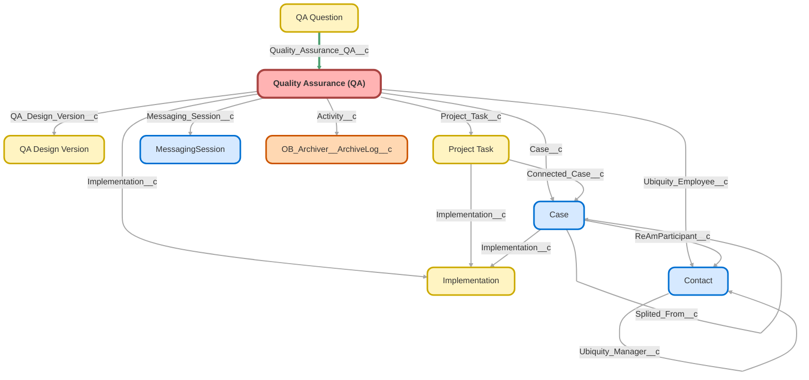

---
hide:
  - path
---

<!-- This file is auto-generated. if you do not want it to be overwritten, set TRUE in the line below -->
<!-- DO_NOT_OVERWRITE_DOC=FALSE -->

## Schema

<!-- Object description -->

## Fields

| Name      | Label | Type | Description |
| :-------- | :---- | :--: | :---------- | 
| Activity__c | Activity | Lookup | undefined |
| Additional_Assistance__c | Additional Assistance | Picklist | Was additional assistance offered? |
| Additional_Assistance_Score__c | Additional Assistance Score | Number | 5 Points if additional assistance is offered, 0 points if not. |
| Alternative_End_Stages_Used_Accurately__c | Alternative End Stages Used Accurately? | Picklist | undefined |
| Alternative_End_Stages_Used_Score__c | Alternative End Stages Used Score | Number | undefined |
| Asked_for_Review__c | Asked for Review | Picklist | undefined |
| Background_Noise_Present__c | Background Noise Present | Picklist | undefined |
| Box_folders_subfolders_created__c | Box folders/subfolders created? | Picklist | undefined |
| Box_folders_subfolders_created_Score__c | Box folders/subfolders created Score | Number | undefined |
| Calculated_Score__c | Calculated Score | Summary | undefined |
| Call_Checklist_Completed__c | Call Checklist Completed | Picklist | undefined |
| Call_QA_Score__c | Call QA Score | Percent | undefined |
| Call_Task__c | Call Reason | TextArea | undefined |
| Case__c | Case | Lookup | Case used for QA |
| Case_Owner_Role__c | Case Owner Role | Text | undefined |
| CE_Case_QA_Score__c | CE Case QA Score | Percent | undefined |
| Client_Greeting__c | Client Greeting | Picklist | Employee states their name and ask how we can help the caller, lead call. |
| Client_Greeting_Score__c | Client Greeting Score | Number | undefined |
| Closure_SLA__c | Closure SLA | Picklist | Was Closure SLA met for Case? |
| Comments__c | Comments | LongTextArea | Manager comments on QA |
| Completed_Each_Owned_Step_w_in_SLA_Score__c | Completed Each Owned Step w/in SLA Score | Number | undefined |
| Completed_Each_Owned_Step_within_SLA__c | Completed Each Owned Step within SLA? | Picklist | undefined |
| Completed_Within_SLA__c | Completed Within SLA | Checkbox | undefined |
| Comprehensive_Notes_Included__c | Comprehensive Notes Included | Picklist | undefined |
| Comprehensive_Notes_Included_Score__c | Comprehensive Notes Included Score | Number | undefined |
| Contact_Handling__c | Contact Handling | Picklist | Verifying Caller's Full Name, Confirm Company name, Confirm identity |
| Contact_Handling_Score__c | Contact Handling Score | Number | undefined |
| Controlled_Affiliated_Groups_Addressed__c | Controlled/Affiliated Groups Addressed? | Picklist | undefined |
| Controlled_Affiliated_Groups_Score__c | Controlled/Affiliated Groups Score | Number | undefined |
| Conversion_5500_Info_Completed__c | Conversion 5500 Info Completed? | Picklist | undefined |
| Conversion_5500_Info_Completed_Score__c | Conversion 5500 Info Completed Score | Number | undefined |
| Conversion_Assets_Completed__c | Conversion Assets Completed? | Picklist | undefined |
| Conversion_Assets_Completed_Score__c | Conversion Assets Completed Score | Number | undefined |
| Correct_Answer__c | Correct Answer | Picklist | Was the question answered correctly? |
| Correct_Answer_Score__c | Correct Answer Score | Number | 10 Points for correct answer given, 0 points if not. |
| Customer_Authentication__c | Customer Authentication | Picklist | undefined |
| Customer_Mistreat_Auto_Fail__c | Customer Mistreat/Auto-Fail | Checkbox | These are examples of behaviors that are not aligned with our values and may harm the business. If a specialist chooses to engage in these types of behaviors, they may forfeit their good standing or potentially cause their own dismissal. |
| Date__c | Date | Date | Date QA Conducted. |
| Date_Fields_Complete_Match_Score__c | Date Fields Complete, Match Score | Number | undefined |
| Date_Fields_Complete_Match_w_Paradigm__c | Date Fields Complete, Match w/ Paradigm? | Picklist | undefined |
| Date_Ticket_Resolved__c | Date Ticket Resolved | DateTime | Date the case being QA'd was closed |
| Department__c | Department | Text | Department of User |
| Department_Dyn__c | Department | Picklist | New department field for dynamic QA form.  Shares global value set with design and is editable. |
| Docs_Complete_in_Box__c | Docs Complete in Box? | Picklist | undefined |
| Docs_Complete_in_Box_Score__c | Docs Complete in Box Score | Number | undefined |
| Docs_Complete_in_Paradigm__c | Docs Complete in Paradigm? | Picklist | undefined |
| Docs_Complete_in_Paradigm_Score__c | Docs Complete in Paradigm Score | Number | undefined |
| Documents_Received_and_Completed__c | Documents Received and Completed? | Picklist | undefined |
| Documents_Received_and_Completed_Score__c | Documents Received and Completed Score | Number | undefined |
| Email_Template_Score__c | Email Template Score | Number | 10 Points for correct email template(s) being used, 0 points if not. |
| Email_Templates__c | Email/Chat Templates | Picklist | Were appropriate email/chat template(s) used? |
| First_Touch_SLA__c | First Touch SLA | Picklist | Was First Touch SLA met for Case? |
| Follow_Up_Provided__c | Follow Up Provided | Picklist | undefined |
| Follow_Up_Provided_Score__c | Follow Up Provided Score | Number | undefined |
| Grammar__c | Grammar | Picklist | Was correct spelling and grammar used? |
| Grammar_Score__c | Grammar Score | Number | 10 Points for use of correct spelling and grammar, 0 points if not. |
| Imp_QA_Score__c | Imp QA Score | Percent | undefined |
| Implementation__c | Implementation | Lookup | Implementation being QA'ed |
| Implementation_Call_Notes__c | Implementation Call Notes | Picklist | undefined |
| Implementation_Notes_Added__c | Implementation Notes Added | Checkbox | undefined |
| Implementation_Role__c | Implementation Role | Text | undefined |
| Issue_Resolved__c | Issue Resolved | Picklist | undefined |
| Jargon__c | Jargon | Picklist | Did user refrain from using company or industry jargon & did user refrain from referencing internal departments? |
| Jargon_Score__c | Jargon Score | Number | 10 Points for for refraining from using company/industry jargon or referencing internal departments, 0 points if not. |
| Knowledge__c | Knowledge | Picklist | Gathered all appropriate information for the stated reason the customer called and any subsequent issues that may have arisen during the call. Asked probing questions. By using appropriate tools, resources and general awareness, resolved the client’s issue or provided specific and relevant information on when a resolution or an answer can be expected. |
| Language__c | Language | Picklist | Was professional and polite language used? |
| Language_Score__c | Language Score | Number | 10 points for using professional and polite language, 0 points if not. |
| Messaging_Session__c | Messaging Session | Lookup | undefined |
| Operations_QA_Score__c | Operations QA Score | Percent | undefined |
| Outside_Item__c | Outside Item | Text | undefined |
| Outstanding_Items__c | Outstanding Items | Picklist | undefined |
| Ownership__c | Ownership | Picklist | Took ownership of the client’s issue. Did not “pass the buck” or state “that’s not my job/department.” We are one Ubiquity. Transferred call when appropriate. Followed up and tracked the issue to ensure resolution. |
| Phone__c | Phone | TextArea | undefined |
| Plan_Provisions__c | Plan Provisions | Picklist | undefined |
| Project_Task__c | Project Task | Lookup | Identifies the imps project task being QA'd |
| Provided_Accurate_Guidance__c | Provided Accurate Guidance | Picklist | undefined |
| Provided_Accurate_Guidance_Score__c | Provided Accurate Guidance Score | Number | undefined |
| QA_Completion__c | QA Completion | Text | Notates whether reviewer has completed the QA. |
| QA_Design_Version__c | QA Design | Lookup | undefined |
| QA_Score__c | QA Score | Percent | % Score for QA |
| QA_Type__c | QA Type | Picklist | Type of QA being conducted. |
| QA_Type_Dyn__c | QA Type | Picklist | New version of field to support dynamic QA forms |
| Questioning_Skills__c | Questioning Skills | Picklist | Were effective questioning skills used? |
| Questioning_Skills_Score__c | Questioning Skills Score | Number | 10 Points for effective questioning skills were used, 0 points if not. |
| Refrained_From_Internal_Team_References__c | Refrained From Internal Team References | Picklist | undefined |
| Refrained_From_Using_Jargon__c | Refrained From Using Jargon | Picklist | undefined |
| Regularly_Followed_up_with_client__c | Regularly Followed up with client? | Picklist | Did user follow up with client as needed per guidelines? |
| Regularly_Followed_up_with_client_Score__c | Regularly Followed up with client Score | Number | undefined |
| Related_Records_Linked__c | Related Records Linked | Picklist | Did the representative link the relevant category and sub-category, account name, plan name, and contact name in the case? |
| Related_Records_Linked_Score__c | Related Records Linked Score | Number | undefined |
| Request_Completed__c | Request Completed | Picklist | Was request accurately completed? |
| Request_Completed_Score__c | Request Completed Score | Number | 10 Points if request completed, 0 points if not. |
| Request_Reason__c | Request Reason | TextArea | undefined |
| Reviewer_Score__c | Reviewer Score | Percent | Score of 0 - 100 given by Reviewer. Should match calculated score unless Manager is overriding score. |
| Scheduling_Next_Stage_Calls__c | Scheduling Next Stage Calls | Picklist | undefined |
| SLA_Score__c | SLA Score | Number | If both SLA's present both = 5 points each. If only first touch needed on case then it = 10 points. |
| SOP_Followed__c | SOP Followed | Checkbox | undefined |
| SOP_Score__c | SOP Score | Number | 20 Points for SOP(s) followed, 0 points if not. |
| SOPs__c | SOP(s) | Picklist | Have appropriate SOP's been followed? |
| Successful_Send_Off__c | Successful Send-Off | Picklist | Did the representative use a proper closing, i.e., offered additional assistance, thanked them for calling (where applicable)? |
| Successful_Send_Off_Score__c | Successful Send-Off Score | Number | undefined |
| Successful_Transfer_to_CST_Payroll__c | Successful Transfer to CST/Payroll? | Picklist | undefined |
| Successful_Transfer_to_CST_Payroll_Score__c | Successful Transfer to CST/Payroll Score | Number | undefined |
| Team__c | Team | Text | undefined |
| Timely_Resolution__c | Timely Resolution | Picklist | Proactively and efficiently controlled the flow of the call to get to the quickest resolution. |
| Ubiquity_Employee__c | Ubiquity Employee | Lookup | Ubiquity Employee that QA is being conducted for. |
| Value_Added__c | Value Added | Picklist | Did user proactively add value to the reply? |
| Value_Added_Score__c | Value Added Score | Number | 5 Points if value added in reply, 0 points if not. |
| X1_Courtesy_Concern__c | Courtesy & Concern | Picklist | Built a relationship with the client, maintained a positive tone and was polite. Showed compassion and empathy for the client’s situation. Acknowledged the client’s issue and treated it with importance. |

## Validation Rules

| Rule      | Active | Description | Formula |
| :-------- | :---- | :---------- | :------ |
| QA_Explain_Reviewer_Score_Diff | Yes |  | QA_Score__c <> Reviewer_Score__c  && NOT(ISBLANK(Reviewer_Score__c)) && ISBLANK(Comments__c) && QA_Score__c > 0 |

## Related Flows

| Object | Name      | Type | Description |
| :----  | :-------- | :--: | :---------- | 
| 💻 | [QA_Autolaunched_Check_If_Notes_Required](../flows/QA_Autolaunched_Check_If_Notes_Required.md) [🕒](../flows/QA_Autolaunched_Check_If_Notes_Required-history.md) |  Auto Launched Flow | Autolaunched flow that checks a QA's questions to see if any require a comment on the QA form.  Returns a message indicating the first question found that requires notes |
| 💻 | [QA_Button_Create_QA](../flows/QA_Button_Create_QA.md) [🕒](../flows/QA_Button_Create_QA-history.md) |  Auto Launched Flow | Switched "Floating QA" check from "recordId is null" to being the default outcome Used from multiple objects of origin to create a QA record |
| 💻 | [QA_Process_Update_Case_Milestone_Fields](../flows/QA_Process_Update_Case_Milestone_Fields.md) [🕒](../flows/QA_Process_Update_Case_Milestone_Fields-history.md) |  Auto Launched Flow | <!-- --> |
| 💻 | [QA_Screen_Better_Create_QA](../flows/QA_Screen_Better_Create_QA.md) [🕒](../flows/QA_Screen_Better_Create_QA-history.md) |  Screen Flow | <!-- --> |
| Case | [Case_After_Trigger_Create_Complaint_Form](../flows/Case_After_Trigger_Create_Complaint_Form.md) [🕒](../flows/Case_After_Trigger_Create_Complaint_Form-history.md) |  Record After Save | Added step to auto create QA |
| QA_Design_Version__c | [QA_Design_After_Save_Validation](../flows/QA_Design_After_Save_Validation.md) [🕒](../flows/QA_Design_After_Save_Validation-history.md) |  Record After Save | <!-- --> |
| Quality_Assurance_QA__c | [QA_After_Save_Create_and_Delete_Questions](../flows/QA_After_Save_Create_and_Delete_Questions.md) [🕒](../flows/QA_After_Save_Create_and_Delete_Questions-history.md) |  Record After Save | Creates questions for QA form when a new design is selected, and deletes questions when a design is deselected. |
| Quality_Assurance_QA__c | [QA_After_Save_Pre_Completion_Checks](../flows/QA_After_Save_Pre_Completion_Checks.md) [🕒](../flows/QA_After_Save_Pre_Completion_Checks-history.md) |  Record After Save | For dynamic QA forms.  Complex validation rules that run when a reviewer score is added. |
| Quality_Assurance_QA__c | [QA_Before_Save_Set_Design](../flows/QA_Before_Save_Set_Design.md) [🕒](../flows/QA_Before_Save_Set_Design-history.md) |  Record Before Save | Assigns QA Design to QA form if it finds ONE (no more no less) that matches its QA Type and Department.  Otherwise, will wipe existing design if it doesn't match type and department. |
| Quality_Assurance_QA__c | [QA_Before_Save_Set_Name](../flows/QA_Before_Save_Set_Name.md) [🕒](../flows/QA_Before_Save_Set_Name-history.md) |  Record Before Save | Added CE naming convention.  Put things into a loop to account for different standards and when parts are missing. |
| Quality_Assurance_QA__c | [Sync_QA_Status](../flows/Sync_QA_Status.md) [🕒](../flows/Sync_QA_Status-history.md) |  Record After Save | Removed renaming and migrated it to before save  Syncs a QA's completion status with record being reviewed |

## Related Apex Classes

| Apex Class | Type |
| :----      | :--: | 
| [QaFormController](../apex/QaFormController.md) | Lightning Controller |
| [QaFormController_TEST](../apex/QaFormController_TEST.md) | Test |

## Related Lightning Pages

| Lightning Page | Type |
| :----      | :--: | 
| [Approver_Home](../pages/Approver_Home.md) |  Home Page |
| [Call_QA](../pages/Call_QA.md) |  Record Page |
| [Case_QA](../pages/Case_QA.md) |  Record Page |
| [Dynamic_QA](../pages/Dynamic_QA.md) |  Record Page |
| [Imps_QA](../pages/Imps_QA.md) |  Record Page |
| [New_Distributions_Homepage](../pages/New_Distributions_Homepage.md) |  Home Page |
| [New_FinOps_Home_Page](../pages/New_FinOps_Home_Page.md) |  Home Page |
| [New_Payroll_Homepage](../pages/New_Payroll_Homepage.md) |  Home Page |
| [New_RW_Home_Page1](../pages/New_RW_Home_Page1.md) |  Home Page |
| [New_Transitions_Homepage](../pages/New_Transitions_Homepage.md) |  Home Page |
| [Ops_Director_Home_Page](../pages/Ops_Director_Home_Page.md) |  Home Page |
| [Quality_Assurance_QA_Record_Page](../pages/Quality_Assurance_QA_Record_Page.md) |  Record Page |
| [Sales_Approver_Home](../pages/Sales_Approver_Home.md) |  Home Page |

## Related Profiles

| Profile | User License |
| :----      | :--: | 
| [Admin](../profiles/Admin.md) |  Salesforce |
| [Analytics Cloud Integration User](../profiles/Analytics%20Cloud%20Integration%20User.md) |  Analytics  Cloud  Integration  User |
| [Analytics Cloud Security User](../profiles/Analytics%20Cloud%20Security%20User.md) |  Analytics  Cloud  Integration  User |
| [Anypoint Integration](../profiles/Anypoint%20Integration.md) |  Identity |
| [B2BMA Integration User](../profiles/B2BMA%20Integration%20User.md) |  B2 B M A  Integration  User |
| [Billing User](../profiles/Billing%20User.md) |  Salesforce |
| [Bot Profile](../profiles/Bot%20Profile.md) |  Salesforce |
| [Business Development](../profiles/Business%20Development.md) |  Salesforce |
| [Call Center](../profiles/Call%20Center.md) |  Salesforce |
| [Chatter External User](../profiles/Chatter%20External%20User.md) |  Chatter  External |
| [Chatter Free User](../profiles/Chatter%20Free%20User.md) |  Chatter  Free |
| [Chatter Moderator User](../profiles/Chatter%20Moderator%20User.md) |  Chatter  Free |
| [Client Onboarding - Admin](../profiles/Client%20Onboarding%20-%20Admin.md) |  Salesforce |
| [Client Onboarding - RM](../profiles/Client%20Onboarding%20-%20RM.md) |  Salesforce |
| [Client Servicing Team](../profiles/Client%20Servicing%20Team.md) |  Salesforce |
| [Compliance Manager](../profiles/Compliance%20Manager.md) |  Salesforce |
| [ContractManager](../profiles/ContractManager.md) |  Salesforce |
| [Director of Operations](../profiles/Director%20of%20Operations.md) |  Salesforce |
| [Director of Sales](../profiles/Director%20of%20Sales.md) |  Salesforce |
| [Distributions](../profiles/Distributions.md) |  Salesforce |
| [Einstein Agent User](../profiles/Einstein%20Agent%20User.md) |  Einstein  Agent |
| [ESW_Agentforce_MIAW_1748035300267 Profile](../profiles/ESW_Agentforce_MIAW_1748035300267%20Profile.md) |  Guest  User  License |
| [ESW_Agentforce_MIAW_1748385215843 Profile](../profiles/ESW_Agentforce_MIAW_1748385215843%20Profile.md) |  Guest  User  License |
| [ESW_CE_Chat_1692890394498 Profile](../profiles/ESW_CE_Chat_1692890394498%20Profile.md) |  Guest  User  License |
| [ESW_CE_Chat_Moe_1693182845676 Profile](../profiles/ESW_CE_Chat_Moe_1693182845676%20Profile.md) |  Guest  User  License |
| [ESW_Login_Help_1697133738638 Profile](../profiles/ESW_Login_Help_1697133738638%20Profile.md) |  Guest  User  License |
| [ESW_Login_Help_Simply_1700075140889 Profile](../profiles/ESW_Login_Help_Simply_1700075140889%20Profile.md) |  Guest  User  License |
| [ESW_Omni_Messaging_1694183770479 Profile](../profiles/ESW_Omni_Messaging_1694183770479%20Profile.md) |  Guest  User  License |
| [ESW_Omni_Messaging_CO_1696448547822 Profile](../profiles/ESW_Omni_Messaging_CO_1696448547822%20Profile.md) |  Guest  User  License |
| [ESW_Omni_Messaging_Sallus_1700075448386 Profile](../profiles/ESW_Omni_Messaging_Sallus_1700075448386%20Profile.md) |  Guest  User  License |
| [ESW_Omni_Messaging_Simply_1700076370188 Profile](../profiles/ESW_Omni_Messaging_Simply_1700076370188%20Profile.md) |  Guest  User  License |
| [ESW_QA_Login_1699666348585 Profile](../profiles/ESW_QA_Login_1699666348585%20Profile.md) |  Guest  User  License |
| [ESW_QA_Messaging_1699974036493 Profile](../profiles/ESW_QA_Messaging_1699974036493%20Profile.md) |  Guest  User  License |
| [ESW_Sales_Chat_1697460991337 Profile](../profiles/ESW_Sales_Chat_1697460991337%20Profile.md) |  Guest  User  License |
| [ESW_Sallus_Login_Chat_1700072925200 Profile](../profiles/ESW_Sallus_Login_Chat_1700072925200%20Profile.md) |  Guest  User  License |
| [External Apps Login User](../profiles/External%20Apps%20Login%20User.md) |  External  Apps  Login |
| [Finance Manager Lightning](../profiles/Finance%20Manager%20Lightning.md) |  Salesforce |
| [Guest License User](../profiles/Guest%20License%20User.md) |  Guest  User  License |
| [Help Center Profile](../profiles/Help%20Center%20Profile.md) |  Guest  User  License |
| [Identity User](../profiles/Identity%20User.md) |  Identity |
| [Incoming_SMS Profile](../profiles/Incoming_SMS%20Profile.md) |  Guest  User  License |
| [IT](../profiles/IT.md) |  Salesforce |
| [Leadership Lightning](../profiles/Leadership%20Lightning.md) |  Salesforce |
| [Leadership](../profiles/Leadership.md) |  Salesforce |
| [Learning %26 Development](../profiles/Learning%20%2526%20Development.md) |  Salesforce |
| [Lightning Client Onboarding](../profiles/Lightning%20Client%20Onboarding.md) |  Salesforce |
| [Lightning Compliance](../profiles/Lightning%20Compliance.md) |  Salesforce |
| [Lightning Saver User](../profiles/Lightning%20Saver%20User.md) |  Salesforce |
| [Lightning Service Manager](../profiles/Lightning%20Service%20Manager.md) |  Salesforce |
| [Lightning Service User](../profiles/Lightning%20Service%20User.md) |  Salesforce |
| [Marketing Team](../profiles/Marketing%20Team.md) |  Salesforce |
| [MarketingProfile](../profiles/MarketingProfile.md) |  Salesforce |
| [Master Administrator](../profiles/Master%20Administrator.md) |  Salesforce |
| [Minimum Access - API Only Integrations](../profiles/Minimum%20Access%20-%20API%20Only%20Integrations.md) |  Salesforce  Integration |
| [Minimum Access - Salesforce](../profiles/Minimum%20Access%20-%20Salesforce.md) |  Salesforce |
| [myubiquity Profile](../profiles/myubiquity%20Profile.md) |  Guest  User  License |
| [Operations VP](../profiles/Operations%20VP.md) |  Salesforce |
| [Operations](../profiles/Operations.md) |  Salesforce |
| [Paradigm Help Center Profile](../profiles/Paradigm%20Help%20Center%20Profile.md) |  Guest  User  License |
| [Payroll Koncierge](../profiles/Payroll%20Koncierge.md) |  Salesforce |
| [Payroll Team](../profiles/Payroll%20Team.md) |  Salesforce |
| [People %26 Culture](../profiles/People%20%2526%20Culture.md) |  Salesforce |
| [Pre-chat Site Profile](../profiles/Pre-chat%20Site%20Profile.md) |  Guest  User  License |
| [Product Innovation Leadership](../profiles/Product%20Innovation%20Leadership.md) |  Salesforce |
| [Product Innovation User](../profiles/Product%20Innovation%20User.md) |  Salesforce |
| [PSM Team](../profiles/PSM%20Team.md) |  Salesforce |
| [R%26W](../profiles/R%2526W.md) |  Salesforce |
| [Read Only](../profiles/Read%20Only.md) |  Salesforce |
| [Sales Administrator](../profiles/Sales%20Administrator.md) |  Salesforce |
| [Sales Coordinator](../profiles/Sales%20Coordinator.md) |  Salesforce |
| [Sales Insights Integration User](../profiles/Sales%20Insights%20Integration%20User.md) |  Sales  Insights  Integration  User |
| [Sales Team - Limited](../profiles/Sales%20Team%20-%20Limited.md) |  Salesforce |
| [Sales Team](../profiles/Sales%20Team.md) |  Salesforce |
| [Salesforce API Only System Integrations](../profiles/Salesforce%20API%20Only%20System%20Integrations.md) |  Salesforce  Integration |
| [SalesforceIQ Integration User](../profiles/SalesforceIQ%20Integration%20User.md) |  Salesforce I Q  Integration  User |
| [Saver Manager](../profiles/Saver%20Manager.md) |  Salesforce |
| [Simple Survey Profile](../profiles/Simple%20Survey%20Profile.md) |  Guest  User  License |
| [Simply Help Center Profile](../profiles/Simply%20Help%20Center%20Profile.md) |  Guest  User  License |
| [SolutionManager](../profiles/SolutionManager.md) |  Salesforce |
| [Standard](../profiles/Standard.md) |  Salesforce |
| [StandardAul](../profiles/StandardAul.md) |  Salesforce  Platform |
| [Super System Administrator](../profiles/Super%20System%20Administrator.md) |  Salesforce |
| [Sys Dev Admin](../profiles/Sys%20Dev%20Admin.md) |  Salesforce |
| [Transitions Team](../profiles/Transitions%20Team.md) |  Salesforce |
| [Ubiquity Help Center Profile](../profiles/Ubiquity%20Help%20Center%20Profile.md) |  Guest  User  License |
| [Zoom Webhooks Profile](../profiles/Zoom%20Webhooks%20Profile.md) |  Guest  User  License |

## Related Permission Sets

| Permission Set | User License |
| :----      | :--: | 
| [Attachments_and_Notes_Migrator](../permissionsets/Attachments_and_Notes_Migrator.md) | None |
| [Data_Loader](../permissionsets/Data_Loader.md) | None |
| [Developer](../permissionsets/Developer.md) | None |
| [MagicMover](../permissionsets/MagicMover.md) | None |
| [Manager](../permissionsets/Manager.md) | None |
| [Master](../permissionsets/Master.md) | None |
| [Modify_All](../permissionsets/Modify_All.md) | None |
| [QA_Access_Dynamic](../permissionsets/QA_Access_Dynamic.md) | None |
| [QA_Access](../permissionsets/QA_Access.md) | None |
| [QA_Manage_Designs](../permissionsets/QA_Manage_Designs.md) | None |
| [QA_Manager](../permissionsets/QA_Manager.md) | None |
| [sfdcInternalInt__sfdc_a360_sfcrm_data_extract](../permissionsets/sfdcInternalInt__sfdc_a360_sfcrm_data_extract.md) | None |
| [sfdcInternalInt__sfdc_articlerecommendations](../permissionsets/sfdcInternalInt__sfdc_articlerecommendations.md) | None |
| [sfdcInternalInt__sfdc_einsteinagent](../permissionsets/sfdcInternalInt__sfdc_einsteinagent.md) | None |
| [sfdcInternalInt__sfdc_replyrecommendations](../permissionsets/sfdcInternalInt__sfdc_replyrecommendations.md) | None |
| [sfdcInternalInt__sfdc_slack](../permissionsets/sfdcInternalInt__sfdc_slack.md) | None |
| [View_All](../permissionsets/View_All.md) | None |
| [View_QA_Records](../permissionsets/View_QA_Records.md) | None |

_Documentation generated with [sfdx-hardis](https://sfdx-hardis.cloudity.com), by [Cloudity](https://www.cloudity.com/) & [friends](https://github.com/hardisgroupcom/sfdx-hardis/graphs/contributors)_
