---
hide:
  - path
---

<!-- This file is auto-generated. if you do not want it to be overwritten, set TRUE in the line below -->
<!-- DO_NOT_OVERWRITE_DOC=FALSE -->

## Schema

```mermaid
graph TD
Task["Task"]:::mainObject
click Task "/objects/Task/"


classDef object fill:#D6E9FF,stroke:#0070D2,stroke-width:3px,rx:12px,ry:12px,shadow:drop,color:#333;
classDef customObject fill:#FFF4C2,stroke:#CCAA00,stroke-width:3px,rx:12px,ry:12px,shadow:drop,color:#333;
classDef customObjectManaged fill:#FFD8B2,stroke:#CC5500,stroke-width:3px,rx:12px,ry:12px,shadow:drop,color:#333;
classDef mainObject fill:#FFB3B3,stroke:#A94442,stroke-width:4px,rx:14px,ry:14px,shadow:drop,color:#333,font-weight:bold;

```

<!-- Object description -->

## Validation Rules

| Rule      | Active | Description | Formula |
| :-------- | :---- | :---------- | :------ |
| Completed_Task_Validation | No ⚠️ | Completed task must not be logged for a future date. | AND( ISPICKVAL( Status , "Completed" ),   ActivityDate   >   TODAY() ) |
| LID__cannot_edit_assigned_on_Linkedin_Tasks | Yes |  | OR(RecordType.Name = "inMail", RecordType.Name = "Messages", RecordType.Name = "PointDrive Presentation Created", RecordType.Name = "PointDrive Presentation Viewed" ) && (ISCHANGED( OwnerId )) |
| LID__cannot_edit_Priority_on_Linkedin_Tasks | No ⚠️ | Validation Rule not in use | <!-- --> |
| LID__cannot_edit_status_on_Linkedin_Tasks | No ⚠️ |  | OR(RecordType.Name = "inMail", RecordType.Name = "Messages", RecordType.Name = "PointDrive Presentation Created", RecordType.Name = "PointDrive Presentation Viewed" ) && (ISCHANGED( Status )) |
| Mitel_Call_Requires_Related_Case | No ⚠️ | Require Case linking on Mitel Call Related to Field | ( BEGINS( Subject, 'Call Inbound')   BEGINS( Subject, 'Call Outbound') ) &&  (   CONTAINS(Owner:User.UserRole.Name, 'Saver')    CONTAINS(Owner:User.UserRole.Name, 'Service') ) &&  NOT(BEGINS( WhatId , "005")) |

## Related Flows

| Object | Name      | Type | Description |
| :----  | :-------- | :--: | :---------- | 
| 💻 | [Close_Create_Follow_Up_Event](../flows/Close_Create_Follow_Up_Event.md) [🕒](../flows/Close_Create_Follow_Up_Event-history.md) |  Screen Flow | Closes event while cloning details for follow-up |
| 💻 | [Close_Create_Follow_Up_Task](../flows/Close_Create_Follow_Up_Task.md) [🕒](../flows/Close_Create_Follow_Up_Task-history.md) |  Screen Flow | Closes current task, and clones details when creating a follow-up |
| 💻 | [Contact_Button_Create_Advisor_Sourced_Lead_Activity](../flows/Contact_Button_Create_Advisor_Sourced_Lead_Activity.md) [🕒](../flows/Contact_Button_Create_Advisor_Sourced_Lead_Activity-history.md) |  Auto Launched Flow | <!-- --> |
| 💻 | [Contact_Button_Create_Advisor_Sourced_Lead_Activity_FIX](../flows/Contact_Button_Create_Advisor_Sourced_Lead_Activity_FIX.md) [🕒](../flows/Contact_Button_Create_Advisor_Sourced_Lead_Activity_FIX-history.md) |  Auto Launched Flow | <!-- --> |
| 💻 | [Create_Follow_Up_Task_from_Event](../flows/Create_Follow_Up_Task_from_Event.md) [🕒](../flows/Create_Follow_Up_Task_from_Event-history.md) |  Screen Flow | Create follow up Task from Event record |
| 💻 | [Create_Follow_Up_Task_if_Opp_is_not_Closed](../flows/Create_Follow_Up_Task_if_Opp_is_not_Closed.md) [🕒](../flows/Create_Follow_Up_Task_if_Opp_is_not_Closed-history.md) |  Auto Launched Flow | Create Follow-Up Task if Opp is not Closed |
| 💻 | [Map_Advisor_Based_on_NPN](../flows/Map_Advisor_Based_on_NPN.md) [🕒](../flows/Map_Advisor_Based_on_NPN-history.md) |  Auto Launched Flow | When a new Simply Lead is created, assess whether to Convert Advisor, or Link Advisor to Employer Lead. Removed NPN Without Advisor email alert from Employer Lead path. |
| 💻 | [Project_Task_Process_Send_Email_Alert](../flows/Project_Task_Process_Send_Email_Alert.md) [🕒](../flows/Project_Task_Process_Send_Email_Alert-history.md) |  Auto Launched Flow | Flow built to trigger auto email when Project Task is created or updated. |
| 💻 | [Proposal_Delayed_Assignment](../flows/Proposal_Delayed_Assignment.md) [🕒](../flows/Proposal_Delayed_Assignment-history.md) |  Auto Launched Flow | Originally designed to account for when Sallus proposals come in with an advisor lead.  Waits 5 minutes for the lead to auto convert, matches it to proposal. |
| 💻 | [QA_Button_Create_QA](../flows/QA_Button_Create_QA.md) [🕒](../flows/QA_Button_Create_QA-history.md) |  Auto Launched Flow | Switched "Floating QA" check from "recordId is null" to being the default outcome Used from multiple objects of origin to create a QA record |
| 💻 | [QA_Screen_Better_Create_QA](../flows/QA_Screen_Better_Create_QA.md) [🕒](../flows/QA_Screen_Better_Create_QA-history.md) |  Screen Flow | <!-- --> |
| 💻 | [Support_First_Milestone_Completed](../flows/Support_First_Milestone_Completed.md) [🕒](../flows/Support_First_Milestone_Completed-history.md) |  Auto Launched Flow | When an email or task related to a case is marked sent or completed, close the first response milestone. |
| 💻 | [Update_Email_Phone](../flows/Update_Email_Phone.md) [🕒](../flows/Update_Email_Phone-history.md) |  Auto Launched Flow | Updates Email & Phone on Task depending on the record type of the associated client. |
| Associated_Contact__c | [Implementations_Welcome_Email](../flows/Implementations_Welcome_Email.md) [🕒](../flows/Implementations_Welcome_Email-history.md) |  Workflow | Send welcome email when opportunity is marked closed won |
| Compliance__c | [Compliance_Scheduled_Top_Heavy_Emails](../flows/Compliance_Scheduled_Top_Heavy_Emails.md) [🕒](../flows/Compliance_Scheduled_Top_Heavy_Emails-history.md) |  Scheduled | Updating Sender Email Address from donotrespond --> dontrespond - MC 04.04.25 For scheduled sends to support compliance - updated to add proper one time send support |
| Contact | [Contact_After_Update_Temp_List_Send](../flows/Contact_After_Update_Temp_List_Send.md) [🕒](../flows/Contact_After_Update_Temp_List_Send-history.md) |  Record After Save | <!-- --> |
| EmailMessage | [Email_After_Trigger_Create_Task_for_Diana](../flows/Email_After_Trigger_Create_Task_for_Diana.md) [🕒](../flows/Email_After_Trigger_Create_Task_for_Diana-history.md) |  Record After Save | <!-- --> |
| Lead | [Lead_After_Trigger_Email_Paycor_Referrer](../flows/Lead_After_Trigger_Email_Paycor_Referrer.md) [🕒](../flows/Lead_After_Trigger_Email_Paycor_Referrer-history.md) |  Record After Save | Changed start conditions to be CONTAINS mylo or paycor - not equal |
| Lead | [Lead_Creation_1st_Response](../flows/Lead_Creation_1st_Response.md) [🕒](../flows/Lead_Creation_1st_Response-history.md) |  Workflow | Used to auto reply to leads when created - Excluding SingleK which is through Pardot/Marketing |
| Lead | [Lead_Simply_Lead_Created_1](../flows/Lead_Simply_Lead_Created_1.md) [🕒](../flows/Lead_Simply_Lead_Created_1-history.md) |  Record After Save | Adjusted to compensate for if the new lead has been deleted/converted by DE |
| Opportunity | [Opportunity_After_Trigger_Create_Task_for_Upgrade_and_Add_On_Product](../flows/Opportunity_After_Trigger_Create_Task_for_Upgrade_and_Add_On_Product.md) [🕒](../flows/Opportunity_After_Trigger_Create_Task_for_Upgrade_and_Add_On_Product-history.md) |  Record After Save | Added SVP - Strategy as notif recipient  Creates tasks for Upgrade and Add-On Products. |
| Opportunity | [Sales_Assign_Upgrade_Owner](../flows/Sales_Assign_Upgrade_Owner.md) [🕒](../flows/Sales_Assign_Upgrade_Owner-history.md) |  Workflow | Update Upgrade Opportunity Owner Upon Creation |
| Proposal__c | [Proposal_After_Save_Assignment_Task_Alert](../flows/Proposal_After_Save_Assignment_Task_Alert.md) [🕒](../flows/Proposal_After_Save_Assignment_Task_Alert-history.md) |  Record After Save | <!-- --> |
| Proposal__c | [Proposal_After_Save_Related_People](../flows/Proposal_After_Save_Related_People.md) [🕒](../flows/Proposal_After_Save_Related_People-history.md) |  Record After Save | Updated to fix ubiquity employer subflow call |
| Proposal__c | [Proposal_After_Trigger](../flows/Proposal_After_Trigger.md) [🕒](../flows/Proposal_After_Trigger-history.md) |  Record After Save | Removed advisor lead creation for Sallus (covered by their api connection, leads created directly), adjusted formatted state formula to return null instead of 'Other' when it can't find a match.  Handles proposals before distribution via DE.  Creates partner lead(s), connects contacts to proposal, assigns it to staging user/queue.  After assignment from DE this also sends alert and creates reach out task |
| Proposal__c | [Proposal_Trigger_Connect_to_Referrer](../flows/Proposal_Trigger_Connect_to_Referrer.md) [🕒](../flows/Proposal_Trigger_Connect_to_Referrer-history.md) |  Record After Save | Excluded expired proposals |
| Proposal__c | [Proposal_Trigger_Quick_Quote_Handler](../flows/Proposal_Trigger_Quick_Quote_Handler.md) [🕒](../flows/Proposal_Trigger_Quick_Quote_Handler-history.md) |  Record After Save | Added DC |
| Task | [Sales_Email_RPC_when_Upgrade_is_Created_from_Plan](../flows/Sales_Email_RPC_when_Upgrade_is_Created_from_Plan.md) [🕒](../flows/Sales_Email_RPC_when_Upgrade_is_Created_from_Plan-history.md) |  Workflow | Email Upgrade Opportunity Owner Upon Creation |
| Task | [Sales_Update_Lead_Status_when_Activity_is_Created](../flows/Sales_Update_Lead_Status_when_Activity_is_Created.md) [🕒](../flows/Sales_Update_Lead_Status_when_Activity_is_Created-history.md) |  Workflow | When Task is created, Mark Lead as "Working" if in an earlier stage. |
| Task | [Support_Activity_Call_Update](../flows/Support_Activity_Call_Update.md) [🕒](../flows/Support_Activity_Call_Update-history.md) |  Workflow | Updates "Activity" checkbox if a call is the first activity on a case |
| Task | [Support_Case_Last_Activity_Task](../flows/Support_Case_Last_Activity_Task.md) [🕒](../flows/Support_Case_Last_Activity_Task-history.md) |  Workflow | When a task is closed on a case, stamp the Last Activity Date on the Case or Implementation |
| Task | [Task_Before_Save_Add_Phone_Email](../flows/Task_Before_Save_Add_Phone_Email.md) [🕒](../flows/Task_Before_Save_Add_Phone_Email-history.md) |  Record Before Save | <!-- --> |
| Task | [Task_Before_Save_Five9_Task_Subtype](../flows/Task_Before_Save_Five9_Task_Subtype.md) [🕒](../flows/Task_Before_Save_Five9_Task_Subtype-history.md) |  Record Before Save | Updates five9 originated call logs to the "call" task subtype.  Improved UI experience and reporting |
| Task | [Task_Before_Save_Stamp_Completion_Date](../flows/Task_Before_Save_Stamp_Completion_Date.md) [🕒](../flows/Task_Before_Save_Stamp_Completion_Date-history.md) |  Record Before Save | Used to record when a task is first marked as completed |
| Task | [Task_Before_Update_Account_Link](../flows/Task_Before_Update_Account_Link.md) [🕒](../flows/Task_Before_Update_Account_Link-history.md) |  Record Before Save | Updated to mirror standard field first, and removed unnecessary decision conditions |
| Task | [Task_Before_Update_Activity_Type_Email](../flows/Task_Before_Update_Activity_Type_Email.md) [🕒](../flows/Task_Before_Update_Activity_Type_Email-history.md) |  Record After Save | If Task includes Email in the subject, change the activity type to Email. |
| Task | [Task_Trigger_Lead_Status_to_Working](../flows/Task_Trigger_Lead_Status_to_Working.md) [🕒](../flows/Task_Trigger_Lead_Status_to_Working-history.md) |  Record After Save | When Task is Completed, update Lead Status to Working |
| Task | [Task_Trigger_Update_Imp_Outbound_Activity](../flows/Task_Trigger_Update_Imp_Outbound_Activity.md) [🕒](../flows/Task_Trigger_Update_Imp_Outbound_Activity-history.md) |  Record After Save | <!-- --> |

## Related Apex Classes

| Apex Class | Type |
| :----      | :--: | 
| [InvoiceLineItemsTriggerTest](../apex/InvoiceLineItemsTriggerTest.md) | Test |
| [LCC_JSMQueryResultServiceTest](../apex/LCC_JSMQueryResultServiceTest.md) | Test |
| [SendBetterEmail](../apex/SendBetterEmail.md) | Invocable |
| [SendBetterEmailAddTasksToEmail](../apex/SendBetterEmailAddTasksToEmail.md) | Class |
| [SendBetterEmailRequest](../apex/SendBetterEmailRequest.md) | Lightning Controller |
| [SendBetterEmailTest](../apex/SendBetterEmailTest.md) | Test |
| [StampDateTest](../apex/StampDateTest.md) | Test |
| [StampImpTest](../apex/StampImpTest.md) | Test |
| [StampDate](../apex/StampDate.md) | Class |
| [StampImp](../apex/StampImp.md) | Class |

## Related Lightning Pages

| Lightning Page | Type |
| :----      | :--: | 
| [Add_On_Product_Record_Page1](../pages/Add_On_Product_Record_Page1.md) |  Record Page |
| [Approver_Home](../pages/Approver_Home.md) |  Home Page |
| [CE_Page_2025](../pages/CE_Page_2025.md) |  Record Page |
| [COO_Homepage](../pages/COO_Homepage.md) |  Home Page |
| [Call_Center_Page](../pages/Call_Center_Page.md) |  Record Page |
| [Call_QA](../pages/Call_QA.md) |  Record Page |
| [Console_Case_Layout](../pages/Console_Case_Layout.md) |  Record Page |
| [Default_Account_Layout](../pages/Default_Account_Layout.md) |  Record Page |
| [Default_Contact_Layout](../pages/Default_Contact_Layout.md) |  Record Page |
| [Dynamic_Account_Page](../pages/Dynamic_Account_Page.md) |  Record Page |
| [Dynamic_Imp_Record_Page](../pages/Dynamic_Imp_Record_Page.md) |  Record Page |
| [Dynamic_Opp_Page](../pages/Dynamic_Opp_Page.md) |  Record Page |
| [Dynamic_Plan_Page](../pages/Dynamic_Plan_Page.md) |  Record Page |
| [Dynamic_QA](../pages/Dynamic_QA.md) |  Record Page |
| [Dynamic_Transitions_Lighting_Page](../pages/Dynamic_Transitions_Lighting_Page.md) |  Record Page |
| [Home_Page_Default](../pages/Home_Page_Default.md) |  Home Page |
| [Implementation_Conversion](../pages/Implementation_Conversion.md) |  Record Page |
| [Implementation_Default_Record_Layout](../pages/Implementation_Default_Record_Layout.md) |  Record Page |
| [Implementation_Record_Page](../pages/Implementation_Record_Page.md) |  Record Page |
| [Implementation_Record_Page1](../pages/Implementation_Record_Page1.md) |  Record Page |
| [Implementations](../pages/Implementations.md) |  Home Page |
| [Imps_QA](../pages/Imps_QA.md) |  Record Page |
| [JIRA_Case_Layout](../pages/JIRA_Case_Layout.md) |  Record Page |
| [New_3_Region_CE_Case_Page](../pages/New_3_Region_CE_Case_Page.md) |  Record Page |
| [New_Imp_Home_Page](../pages/New_Imp_Home_Page.md) |  Home Page |
| [New_L_D_Home_Page](../pages/New_L_D_Home_Page.md) |  Home Page |
| [Operations_Metrics_Record_Page](../pages/Operations_Metrics_Record_Page.md) |  Record Page |
| [Partner_Account_Layout](../pages/Partner_Account_Layout.md) |  Record Page |
| [Payroll_Integration](../pages/Payroll_Integration.md) |  Record Page |
| [Plan_Record_Page](../pages/Plan_Record_Page.md) |  Record Page |
| [Project_Task_Layout](../pages/Project_Task_Layout.md) |  Record Page |
| [Sales_Approver_Home](../pages/Sales_Approver_Home.md) |  Home Page |
| [Sales_Coordinator_Home_Page](../pages/Sales_Coordinator_Home_Page.md) |  Home Page |
| [Sales_Home](../pages/Sales_Home.md) |  Home Page |
| [Sales_Lightning_Account_Record](../pages/Sales_Lightning_Account_Record.md) |  Record Page |
| [Task_Lightning_Page](../pages/Task_Lightning_Page.md) |  Record Page |

## Related Profiles

| Profile | User License |
| :----      | :--: | 
| [Admin](../profiles/Admin.md) |  Salesforce |
| [Analytics Cloud Integration User](../profiles/Analytics%20Cloud%20Integration%20User.md) |  Analytics  Cloud  Integration  User |
| [Analytics Cloud Security User](../profiles/Analytics%20Cloud%20Security%20User.md) |  Analytics  Cloud  Integration  User |
| [Anypoint Integration](../profiles/Anypoint%20Integration.md) |  Identity |
| [B2BMA Integration User](../profiles/B2BMA%20Integration%20User.md) |  B2 B M A  Integration  User |
| [Billing User](../profiles/Billing%20User.md) |  Salesforce |
| [Bot Profile](../profiles/Bot%20Profile.md) |  Salesforce |
| [Business Development](../profiles/Business%20Development.md) |  Salesforce |
| [Call Center](../profiles/Call%20Center.md) |  Salesforce |
| [Chatter External User](../profiles/Chatter%20External%20User.md) |  Chatter  External |
| [Chatter Free User](../profiles/Chatter%20Free%20User.md) |  Chatter  Free |
| [Chatter Moderator User](../profiles/Chatter%20Moderator%20User.md) |  Chatter  Free |
| [Client Onboarding - Admin](../profiles/Client%20Onboarding%20-%20Admin.md) |  Salesforce |
| [Client Onboarding - RM](../profiles/Client%20Onboarding%20-%20RM.md) |  Salesforce |
| [Client Servicing Team](../profiles/Client%20Servicing%20Team.md) |  Salesforce |
| [Compliance Manager](../profiles/Compliance%20Manager.md) |  Salesforce |
| [ContractManager](../profiles/ContractManager.md) |  Salesforce |
| [Director of Operations](../profiles/Director%20of%20Operations.md) |  Salesforce |
| [Director of Sales](../profiles/Director%20of%20Sales.md) |  Salesforce |
| [Distributions](../profiles/Distributions.md) |  Salesforce |
| [Einstein Agent User](../profiles/Einstein%20Agent%20User.md) |  Einstein  Agent |
| [ESW_Agentforce_MIAW_1748035300267 Profile](../profiles/ESW_Agentforce_MIAW_1748035300267%20Profile.md) |  Guest  User  License |
| [ESW_Agentforce_MIAW_1748385215843 Profile](../profiles/ESW_Agentforce_MIAW_1748385215843%20Profile.md) |  Guest  User  License |
| [ESW_CE_Chat_1692890394498 Profile](../profiles/ESW_CE_Chat_1692890394498%20Profile.md) |  Guest  User  License |
| [ESW_CE_Chat_Moe_1693182845676 Profile](../profiles/ESW_CE_Chat_Moe_1693182845676%20Profile.md) |  Guest  User  License |
| [ESW_Login_Help_1697133738638 Profile](../profiles/ESW_Login_Help_1697133738638%20Profile.md) |  Guest  User  License |
| [ESW_Login_Help_Simply_1700075140889 Profile](../profiles/ESW_Login_Help_Simply_1700075140889%20Profile.md) |  Guest  User  License |
| [ESW_Omni_Messaging_1694183770479 Profile](../profiles/ESW_Omni_Messaging_1694183770479%20Profile.md) |  Guest  User  License |
| [ESW_Omni_Messaging_CO_1696448547822 Profile](../profiles/ESW_Omni_Messaging_CO_1696448547822%20Profile.md) |  Guest  User  License |
| [ESW_Omni_Messaging_Sallus_1700075448386 Profile](../profiles/ESW_Omni_Messaging_Sallus_1700075448386%20Profile.md) |  Guest  User  License |
| [ESW_Omni_Messaging_Simply_1700076370188 Profile](../profiles/ESW_Omni_Messaging_Simply_1700076370188%20Profile.md) |  Guest  User  License |
| [ESW_QA_Login_1699666348585 Profile](../profiles/ESW_QA_Login_1699666348585%20Profile.md) |  Guest  User  License |
| [ESW_QA_Messaging_1699974036493 Profile](../profiles/ESW_QA_Messaging_1699974036493%20Profile.md) |  Guest  User  License |
| [ESW_Sales_Chat_1697460991337 Profile](../profiles/ESW_Sales_Chat_1697460991337%20Profile.md) |  Guest  User  License |
| [ESW_Sallus_Login_Chat_1700072925200 Profile](../profiles/ESW_Sallus_Login_Chat_1700072925200%20Profile.md) |  Guest  User  License |
| [External Apps Login User](../profiles/External%20Apps%20Login%20User.md) |  External  Apps  Login |
| [Finance Manager Lightning](../profiles/Finance%20Manager%20Lightning.md) |  Salesforce |
| [Guest License User](../profiles/Guest%20License%20User.md) |  Guest  User  License |
| [Help Center Profile](../profiles/Help%20Center%20Profile.md) |  Guest  User  License |
| [Identity User](../profiles/Identity%20User.md) |  Identity |
| [Incoming_SMS Profile](../profiles/Incoming_SMS%20Profile.md) |  Guest  User  License |
| [IT](../profiles/IT.md) |  Salesforce |
| [Leadership Lightning](../profiles/Leadership%20Lightning.md) |  Salesforce |
| [Leadership](../profiles/Leadership.md) |  Salesforce |
| [Learning %26 Development](../profiles/Learning%20%2526%20Development.md) |  Salesforce |
| [Lightning Client Onboarding](../profiles/Lightning%20Client%20Onboarding.md) |  Salesforce |
| [Lightning Compliance](../profiles/Lightning%20Compliance.md) |  Salesforce |
| [Lightning Saver User](../profiles/Lightning%20Saver%20User.md) |  Salesforce |
| [Lightning Service Manager](../profiles/Lightning%20Service%20Manager.md) |  Salesforce |
| [Lightning Service User](../profiles/Lightning%20Service%20User.md) |  Salesforce |
| [Marketing Team](../profiles/Marketing%20Team.md) |  Salesforce |
| [MarketingProfile](../profiles/MarketingProfile.md) |  Salesforce |
| [Master Administrator](../profiles/Master%20Administrator.md) |  Salesforce |
| [Minimum Access - API Only Integrations](../profiles/Minimum%20Access%20-%20API%20Only%20Integrations.md) |  Salesforce  Integration |
| [Minimum Access - Salesforce](../profiles/Minimum%20Access%20-%20Salesforce.md) |  Salesforce |
| [myubiquity Profile](../profiles/myubiquity%20Profile.md) |  Guest  User  License |
| [Operations VP](../profiles/Operations%20VP.md) |  Salesforce |
| [Operations](../profiles/Operations.md) |  Salesforce |
| [Paradigm Help Center Profile](../profiles/Paradigm%20Help%20Center%20Profile.md) |  Guest  User  License |
| [Payroll Koncierge](../profiles/Payroll%20Koncierge.md) |  Salesforce |
| [Payroll Team](../profiles/Payroll%20Team.md) |  Salesforce |
| [People %26 Culture](../profiles/People%20%2526%20Culture.md) |  Salesforce |
| [Pre-chat Site Profile](../profiles/Pre-chat%20Site%20Profile.md) |  Guest  User  License |
| [Product Innovation Leadership](../profiles/Product%20Innovation%20Leadership.md) |  Salesforce |
| [Product Innovation User](../profiles/Product%20Innovation%20User.md) |  Salesforce |
| [PSM Team](../profiles/PSM%20Team.md) |  Salesforce |
| [R%26W](../profiles/R%2526W.md) |  Salesforce |
| [Read Only](../profiles/Read%20Only.md) |  Salesforce |
| [Sales Administrator](../profiles/Sales%20Administrator.md) |  Salesforce |
| [Sales Coordinator](../profiles/Sales%20Coordinator.md) |  Salesforce |
| [Sales Insights Integration User](../profiles/Sales%20Insights%20Integration%20User.md) |  Sales  Insights  Integration  User |
| [Sales Team - Limited](../profiles/Sales%20Team%20-%20Limited.md) |  Salesforce |
| [Sales Team](../profiles/Sales%20Team.md) |  Salesforce |
| [Salesforce API Only System Integrations](../profiles/Salesforce%20API%20Only%20System%20Integrations.md) |  Salesforce  Integration |
| [SalesforceIQ Integration User](../profiles/SalesforceIQ%20Integration%20User.md) |  Salesforce I Q  Integration  User |
| [Saver Manager](../profiles/Saver%20Manager.md) |  Salesforce |
| [Simple Survey Profile](../profiles/Simple%20Survey%20Profile.md) |  Guest  User  License |
| [Simply Help Center Profile](../profiles/Simply%20Help%20Center%20Profile.md) |  Guest  User  License |
| [SolutionManager](../profiles/SolutionManager.md) |  Salesforce |
| [Standard](../profiles/Standard.md) |  Salesforce |
| [StandardAul](../profiles/StandardAul.md) |  Salesforce  Platform |
| [Super System Administrator](../profiles/Super%20System%20Administrator.md) |  Salesforce |
| [Sys Dev Admin](../profiles/Sys%20Dev%20Admin.md) |  Salesforce |
| [Transitions Team](../profiles/Transitions%20Team.md) |  Salesforce |
| [Ubiquity Help Center Profile](../profiles/Ubiquity%20Help%20Center%20Profile.md) |  Guest  User  License |
| [Zoom Webhooks Profile](../profiles/Zoom%20Webhooks%20Profile.md) |  Guest  User  License |

## Related Permission Sets

| Permission Set | User License |
| :----      | :--: | 
| [Administrator](../permissionsets/Administrator.md) | None |
| [Attachments_and_Notes_Migrator](../permissionsets/Attachments_and_Notes_Migrator.md) | None |
| [Automation_Team_Imp_Project_Tasks](../permissionsets/Automation_Team_Imp_Project_Tasks.md) | None |
| [Data_Loader](../permissionsets/Data_Loader.md) | None |
| [Developer](../permissionsets/Developer.md) | None |
| [MagicMover](../permissionsets/MagicMover.md) | None |
| [Manager](../permissionsets/Manager.md) | None |
| [Master](../permissionsets/Master.md) | None |
| [Modify_All](../permissionsets/Modify_All.md) | None |
| [Ops_Metrics_User](../permissionsets/Ops_Metrics_User.md) | None |
| [Power_User](../permissionsets/Power_User.md) | None |
| [Project_Task_Manager](../permissionsets/Project_Task_Manager.md) | None |
| [QA_Access_Dynamic](../permissionsets/QA_Access_Dynamic.md) | None |
| [QA_Access](../permissionsets/QA_Access.md) | None |
| [QA_Manage_Designs](../permissionsets/QA_Manage_Designs.md) | None |
| [sfdcInternalInt__sfdc_a360_sfcrm_data_extract](../permissionsets/sfdcInternalInt__sfdc_a360_sfcrm_data_extract.md) | None |
| [sfdcInternalInt__sfdc_articlerecommendations](../permissionsets/sfdcInternalInt__sfdc_articlerecommendations.md) | None |
| [sfdcInternalInt__sfdc_einsteinagent](../permissionsets/sfdcInternalInt__sfdc_einsteinagent.md) | None |
| [sfdcInternalInt__sfdc_replyrecommendations](../permissionsets/sfdcInternalInt__sfdc_replyrecommendations.md) | None |
| [sfdcInternalInt__sfdc_slack](../permissionsets/sfdcInternalInt__sfdc_slack.md) | None |
| [Standard_User](../permissionsets/Standard_User.md) | None |
| [View_All](../permissionsets/View_All.md) | None |
| [View_QA_Records](../permissionsets/View_QA_Records.md) | None |
| [Zoom_Admin_Webinar](../permissionsets/Zoom_Admin_Webinar.md) | None |
| [Zoom_User_Webinar](../permissionsets/Zoom_User_Webinar.md) | None |

_Documentation generated with [sfdx-hardis](https://sfdx-hardis.cloudity.com), by [Cloudity](https://www.cloudity.com/) & [friends](https://github.com/hardisgroupcom/sfdx-hardis/graphs/contributors)_
