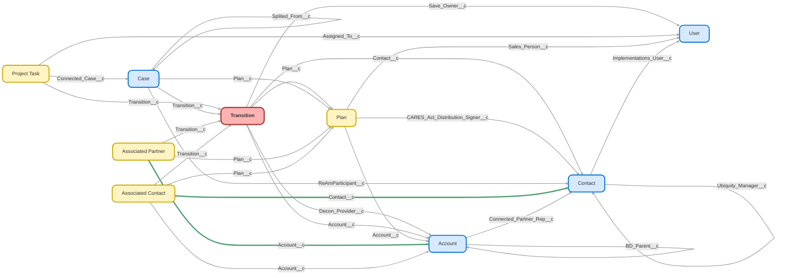

---
hide:
  - path
---

<!-- This file is auto-generated. if you do not want it to be overwritten, set TRUE in the line below -->
<!-- DO_NOT_OVERWRITE_DOC=FALSE -->

## Schema

<!-- Object description -->

## Fields

| Name      | Label | Type | Description |
| :-------- | :---- | :--: | :---------- | 
| Abandoned_Letter_Mailed__c | Abandoned Letter Mailed | Date | Date abandoned letter was mailed |
| Account__c | Account | Lookup | Account that transitioning Plan is attached to |
| Blackout_Date_Today__c | Blackout Date Today | Checkbox | undefined |
| Blackout_Notice_End__c | Blackout Notice End | Date | End of Participant Blackout Notice |
| Blackout_Notice_Start__c | Blackout Notice Start | Date | Date Blackout Notice is sent to Participants |
| Blackout_Start_Date__c | Blackout Start Date | Date | undefined |
| Box_Link__c | Box Link | Url | undefined |
| Cash_Reconciled__c | Cash Reconciled | Picklist | This field is to verify if the cash in the plan is reconciled to ten dollars or less for a plan |
| Client_Support_Team__c | Client Support Team | Text | undefined |
| Completion_Date__c | Completion Date | Date | Date that Transition was marked complete |
| Connected_Partner__c | Connected Partner | Text | Partner with shared SLAs - Set on Account |
| Contact__c | Contact | Lookup | undefined |
| Contributing_Event__c | Contributing Event | Picklist | Used to identify specific events that led to the Termination Reason |
| Custodian__c | Custodian | Picklist | Custodian used by Client |
| Custodian_Account_ID__c | Custodian Account ID | Text | Custodian account number |
| Date_of_Plan_Termination__c | Date of Plan Termination | Date | undefined |
| Decon_Fee_Charged__c | Decon Fee Charged | Picklist | This field is to charge the Deconversion wire fee to the plan prior to the wire being generated |
| Decon_Prep_Notes__c | Decon Prep Notes | LongTextArea | Any notes regarding Deconversion prep |
| Decon_Provider__c | Decon Provider | Lookup | Competitor that plan is deconverting to. |
| Deconversion_Date__c | Deconversion Date | Date | This should be 60 days from receipt of letter unless other arrangements have been made. |
| Deconversion_Email_Sent__c | Deconversion Information Sent | Date | Date Deconversion Email sent to Plan Sponsor |
| Deconversion_Provider__c | Deconversion Provider | Text | undefined |
| Delinquent_Payer_Termination__c | Delinquent Payer Termination | Picklist | The default answer would be 'No' unless 'Yes' is selected by Accounting. If yes is selected, the client did not pay their final termination/deconversion fees and no final filings will be prepared. |
| Description__c | Description | LongTextArea | undefined |
| Distribution_Waiver_Received__c | Distribution Waiver Received | Checkbox | undefined |
| Docusign_Recipient__c | Docusign Recipient | Text | Filled in from Jotform or the Plan Button Transition Plan flow if they don't get Jotform. |
| Docusign_Recipient_Email__c | Docusign Recipient Email | Email | Filled in from Jotform or the Plan Button Transition Plan flow if they don't get Jotform. |
| Does_the_Plan_Have_Forfeitures__c | Does the Plan Have Forfeitures? | Picklist | Confirm if plan has forfeitures |
| Exit_Interview_Notes__c | Exit Interview Notes | LongTextArea | Use to add in exit interview text |
| Fee_Paid__c | Fee Paid | Picklist | Indicates whether Transition Fee has paid or not |
| Fees_Disabled__c | Fees Disabled | Picklist | This field is to verify that we have suspended all fees for a plan.  If any fees are charged while a plan is in blackout it will cause the Deconversion to fail, therefore it is critical that fees be turned off prior to a blackout occurring for a plan. |
| Final_5500_Complete__c | Final 5500 Complete | Checkbox | Has Compliance completed the final 5500 for this plan? |
| Final_5500_PYE__c | Final 5500 PYE | Date | The final year that Ubiquity was responsible for 5500 prep. |
| Final_Census_Payroll_Submitted__c | Final Census & Payroll Submitted | Date | Date final Census & Payroll was submitted |
| Final_Date_for_Distributions_Approval__c | Final Date for Distributions Approval | Date | Last date to approve distributions |
| Final_Docs__c | Final Docs Sent | Date | undefined |
| Final_Fees_Paid_Accounting__c | Final Fees Paid (Accounting) | Date | undefined |
| Final_Form_Complete_Date__c | Final Form Complete Date | Date | undefined |
| Final_Form_Link_Sent_Date__c | Final Form Link Sent Date | Date | undefined |
| Final_Invoice_Sent_Accounting__c | Final Invoice Sent (Accounting) | Date | undefined |
| Final_Payroll_In_Terminated_Year__c | Final Payroll In Terminated Year? | Picklist | Was final payroll in same year as termination? |
| Final_Plan_Balance__c | Final Plan Balance | Currency | Terminations = Plan Case Balance on Date of Termination in RKS Deconversion = SUM of "Disbursements" on the "Plan_Deconversion" Transaction |
| Final_Reporting_Date__c | Final Reporting Date | Date | Date Final Reporting is completed |
| Final_SDBA_Liquidation__c | Final SDBA Liquidation | Date | Date Self Directed Brokerage Account or Personal Choice Retirement Account must by liquidated by |
| Final_Testing_Calculations_Complete__c | Final Testing & Calculations Complete | Date | Date final testing & calculations are complete (Compliance) |
| Final_Valuation_Completed__c | Final Valuation Completed | Date | undefined |
| Final_Valuation_Requested__c | Final Valuation Requested | Date | undefined |
| Force_Out_Required__c | Force Out's Required | Picklist | Are there participants required to be forced out so that this plan is eligible for a Solo(k) account? |
| Forfeiture__c | Forfeiture | Picklist | This field is to record if a plan has forfeiture, and if it has been liquidated |
| Forfeiture_Amount__c | Forfeiture Amount | Currency | Amount of forfeiture, if applicable |
| Form_Payroll_Provider__c | Form Payroll Provider | Text | Payroll Provider enterer on Transition Inquiry Form |
| Has_PCRA__c | PCRA | Picklist | This field is to verify if the plan has PCRA funds included in the account balance.  PCRA accounts require additional work to address. |
| Hold_Distribution_until_Final_Val_Comp__c | Hold Distribution until Final Val Comp. | Checkbox | undefined |
| Initial_Form_Complete_Date__c | Initial Form Complete Date | Date | undefined |
| Initial_Form_Link_Sent_Date__c | Initial Form Link Sent Date | Date | undefined |
| Inquiry_Date__c | Inquiry Date | Date | undefined |
| Investments__c | Investments Reconciled | Picklist | This field is to verify if the investments are reconciled to one share or less for all investments |
| Is_Plan_Vesting_100__c | Is Plan Vesting 100%? | Picklist | Verify if plan vesting is 100% |
| Last_Date_to_Submit_Distrib__c | Final Date for Distributions Submission | Date | Last date to submit distributions |
| Last_Payroll__c | Last Payroll | Date | undefined |
| Liquidation_Date__c | Liquidation Date | Date | undefined |
| Matrix_Current__c | Matrix Current Quarter Fees Amount | Currency | Amount of quarterly fees assessed |
| Matrix_Current_Quarter_Fees__c | Matrix Current Quarter Fees | Picklist | Current Quarter Fees assessed |
| MEP__c | MEP | Checkbox | Term/Merger left for a MEP |
| Monthly_Recurring_Revenue__c | Monthly Recurring Revenue (MRR) | Currency | Manual entry, not used for single(k) |
| Morley_Stable_Value_Fund__c | Morley/Stable Value Fund | Picklist | This field is to verify if the plan has a Morley fund or stable value fund. These funds cannot be liquidated on demand, they require notification to the fund family. |
| Name_Change__c | Name Change | Picklist | We need to update compliance docs to make sure the plan is recorded as Deconverted for future compliance reporting |
| New_Plan_EIN__c | New Plan EIN | Text | Enter the EIN for the new Plan the the existing Ubiquity Plan is merging with. Format=XX-XXXXXXX |
| New_Plan_Name__c | New Plan Name | Text | The name of the new Plan that the existing Plan with Ubiquity is merging with. |
| New_Plan_Number__c | New Plan Number | Text | Plan Number for the new plan the existing Ubiquity Plan is merging with (002,003, etc.). |
| New_Provider_Contact_Name__c | New Provider Contact Name | Text | Filled in from Transition JotForm |
| New_Provider_Email_Address__c | New Provider Email Address | Email | Filled in from Transition JotForm |
| New_Provider_Name__c | New Provider Name | Text | Filled in from Transition JotForm |
| Next_Billing_Date__c | Next Billing Date | Date | Date of next invoice |
| Notes__c | Notes | LongTextArea | undefined |
| Notification_Date__c | Notification Date | Date | undefined |
| Number_of_employees__c | Number of Employees at Date of Term | Number | undefined |
| Offered_Discount__c | Offered Discount | Checkbox | These checkboxes are reasons for saving the Transition, please check this box if it applies. |
| Offered_Other_See_Notes__c | Offered Other (See Notes) | Checkbox | undefined |
| Offered_Payroll_Integration__c | Offered Payroll Integration | Checkbox | undefined |
| Offered_Priority_Service__c | Offered Priority Service | Checkbox | undefined |
| Offered_Upgrade_Downgrade__c | Offered Upgrade/Downgrade | Checkbox | undefined |
| Other_Transition_Reason__c | Other Transition Reason | Text | When client selects "other" for reason on form, they enter the details here. |
| Partner__c | Partner | Text | Clients with shared SLAs will appear here. |
| PCRA__c | PCRA | Picklist | Brokerage accounts allowed. |
| PEP__c | PEP | Checkbox | Term/Merger left for a PEP |
| Plan__c | Plan | Lookup | Plan that is Transitioning |
| Plan_Custodian__c | Plan Custodian | Text | Custodian from the Plan record |
| Plan_Sold_Date_Transition__c | Plan Sold Date | Date | Pulls Plan Sold Date from Plan Object which originated from the Close Date of the Opportunity.  Will be used to help determine time the plan was with Ubiquity. |
| RKO_Plan__c | RKO Plan? | Picklist | Verify if this is an RKO Plan |
| RKS_Mail_Restriction__c | RKS Mail Restriction | Picklist | This field is to verify if a mail restriction exists in RKS. If it does, this will block a Deconversion from occurring. |
| Safe_Harbor_Allocation_Frequency__c | Safe Harbor Allocation Frequency | Picklist | Confirm Safe Harbor allocation frequency |
| Safe_Harbor_Funded_In_Term_Year__c | Safe Harbor Funded In Term Year? | Picklist | Confirm if Safe Harbor contributions were funded in current year |
| Safe_Harbor_Plan__c | Safe Harbor Plan? | Picklist | Confirm if the plan has Safe Harbor |
| Save_Attempts_Exhausted__c | Save Attempts Exhausted | Date | Date at which all save attempts have been exhausted and transition will move forward. |
| Save_Owner__c | Save Owner | Lookup | The user who is in charge of the save attempt. This can be different than the Transition record owner. |
| Saved_Date__c | Saved Date | Date | Date Transition was saved |
| Saved_Notes__c | Saved Notes | LongTextArea | Notes on efforts to save Client |
| Sent_to_Penchecks__c | Sent to Penchecks | Date | Date abandoned plan sent to Penchecks |
| Service_Issue_Details__c | Service Issue Details | LongTextArea | Populated from transition form |
| Service_Option__c | Service Option | Picklist | undefined |
| Status__c | Status | Picklist | What is status of this transition request? |
| TDA_or_Schwab_Trust__c | TDA or Schwab Trust | Picklist | These custodians have separate requirements and fees that must be addressed outside the regular Decon process (for Matrix and Schwab Broker/Dealer) |
| Termination_Complete_Email__c | Termination Complete Email | Date | undefined |
| Termination_Effective_Date__c | Termination Effective Date | Date | Date Termination is effective |
| Termination_Information_Sent__c | Termination Information Sent | Date | Termination Information email sent to Plan Sponsor. |
| TPA_Contact_Email__c | TPA Contact Email | Text | undefined |
| Transition_Cancelled__c | Transition Cancelled | Date | undefined |
| Transition_Complete__c | Transition Complete | Date | undefined |
| Transition_Form_Link__c | Transition Form Link | Text | Link used to send jotform to clients |
| Transition_Id_18_Char__c | Transition Id (18 Char) | Text | undefined |
| Transition_Reason__c | Transition Reason | Picklist | What is the reason for the transition? This is dependent on the transition type. If unable to obtain a reason from client, enter “No reason Given” |
| Transition_Type__c | Transition Type | Picklist | Deconversion: we were under the impression that the plan will be kept intact and continued administration will be assumed by the new TPA. If that’s the case and this is a continuing plan, we would only prepare the 5500 if we had transaction and balance information through 12/31/2016. Since the plan is taken over mid-year, we don’t have this information and cannot prepare a 5500 or Summary Annual Report for the entire 2016 plan year as it stands. Term/Merger: If the plan Ubiquity administered is actually merged with another plan, then we would file a final 5500 for this plan with a $0 ending balance. We need the existing plan’s Name, EIN and Plan Number that the plan is merging to. Term: Plan is fully terminating. All participants are receiving distributions. We will file the Form 5500 as a Final Form 5500 when the balance reaches zero. |
| Transitions__c | Transitions | Number | Used for totaling transitions objects |
| Trustee_Administrator_Email_Address__c | Trustee/Administrator Email Address | Email | Filled in from Transition JotForm. This is the email address where the DocuSign is sent. |
| Trustee_Administrator_Name__c | Trustee/Administrator Name | Text | Filled in from Transition JotForm. This is the recipient of the DocuSign package. |
| Uncontrollable__c | Uncontrollable | Checkbox | Uncontrollable attrition = Term/mergers, and Transitions for reason of company closing or ownership/leadership change. |
| Wire_Amount__c | Wire Amount | Currency | undefined |
| Wire_Date__c | Wire Date | Date | Wire date |

## Validation Rules

| Rule      | Active | Description | Formula |
| :-------- | :---- | :---------- | :------ |
| Final_Testing_Information | Yes | Verifies all final testing information fields are answered before final payroll is input | NOT(ISNULL( Final_Census_Payroll_Submitted__c ))  &&  ISCHANGED ( Final_Census_Payroll_Submitted__c )  &&  (  ISBLANK (TEXT( RKO_Plan__c ))  ISBLANK (TEXT( Final_Payroll_In_Terminated_Year__c ))  ISBLANK (TEXT( Safe_Harbor_Plan__c ))  ISBLANK (TEXT( Does_the_Plan_Have_Forfeitures__c ))  ISBLANK (TEXT( Is_Plan_Vesting_100__c ))  ) |
| Require_MRR_before_complete | Yes | Blocks liquidation date from being entered before monthly recurring revenue on all plans besides single(k). | NOT(ISPICKVAL(Plan__r.Product_Type1__c, "Single(k)")) && NOT(ISBLANK(Liquidation_Date__c)) && ISBLANK(Monthly_Recurring_Revenue__c) && (ISCHANGED(Liquidation_Date__c)  ISCHANGED(Monthly_Recurring_Revenue__c)) |
| Safe_Harbor_Final_Testing | Yes |  | ISPICKVAL ( Safe_Harbor_Plan__c , "Yes") && ( ISBLANK(TEXT( Safe_Harbor_Funded_In_Term_Year__c ))  ISBLANK(TEXT( Safe_Harbor_Allocation_Frequency__c )) ) |

## Related Flows

| Object | Name      | Type | Description |
| :----  | :-------- | :--: | :---------- | 
| 💻 | [Assign_Transition_to_Junction](../flows/Assign_Transition_to_Junction.md) [🕒](../flows/Assign_Transition_to_Junction-history.md) |  Auto Launched Flow | Maps Transition record to any relevant Associated Contact Junction upon creation |
| 💻 | [Assign_Transition_to_Partner](../flows/Assign_Transition_to_Partner.md) [🕒](../flows/Assign_Transition_to_Partner-history.md) |  Auto Launched Flow | Maps Transition record to any relevant Associated Partner Junction upon creation |
| 💻 | [Docusign_Autolaunched_Send_Transition_Docusign](../flows/Docusign_Autolaunched_Send_Transition_Docusign.md) [🕒](../flows/Docusign_Autolaunched_Send_Transition_Docusign-history.md) |  Auto Launched Flow | <!-- --> |
| 💻 | [Monthly_Metrics_Autolaunched_Create_Monthly_Metric_Records](../flows/Monthly_Metrics_Autolaunched_Create_Monthly_Metric_Records.md) [🕒](../flows/Monthly_Metrics_Autolaunched_Create_Monthly_Metric_Records-history.md) |  Auto Launched Flow | <!-- --> |
| 💻 | [Plan_Button_Contract_Termination](../flows/Plan_Button_Contract_Termination.md) [🕒](../flows/Plan_Button_Contract_Termination-history.md) |  Screen Flow | Button on the plan page to terminate a plan when it has $0 in assets |
| 💻 | [Plan_Button_Transition_Plan](../flows/Plan_Button_Transition_Plan.md) [🕒](../flows/Plan_Button_Transition_Plan-history.md) |  Screen Flow | <!-- --> |
| 💻 | [Project_Task_Button_Process_Complete_Tasks](../flows/Project_Task_Button_Process_Complete_Tasks.md) [🕒](../flows/Project_Task_Button_Process_Complete_Tasks-history.md) |  Auto Launched Flow | <!-- --> |
| 💻 | [Project_Task_Edit_Implementations](../flows/Project_Task_Edit_Implementations.md) [🕒](../flows/Project_Task_Edit_Implementations-history.md) |  Auto Launched Flow | Adds update to Implementation Completion Date task #16.   "Owned By Queue" Decision = YES results in task owner/assigned changed to Running User instead of changing to Imp Owner.   Imp Owner remains Client Support and any CST can update tasks.   SF can't change project task owner/assigned (user fields 005) to Queue owner (00G) |
| 💻 | [Project_Task_Process_Complete_Tasks](../flows/Project_Task_Process_Complete_Tasks.md) [🕒](../flows/Project_Task_Process_Complete_Tasks-history.md) |  Auto Launched Flow | <!-- --> |
| 💻 | [Transition_Deconversion_Completed](../flows/Transition_Deconversion_Completed.md) [🕒](../flows/Transition_Deconversion_Completed-history.md) |  Auto Launched Flow | <!-- --> |
| Plan__c | [Plan_After_Save_Master_Flow](../flows/Plan_After_Save_Master_Flow.md) [🕒](../flows/Plan_After_Save_Master_Flow-history.md) |  Record After Save | After save flow that always runs.  What it does: - Updates any and all associated contacts + associated partners with the plan, imp, opp, and transition Ids if applicable.  No overwrites. |
| Project_Task__c | [Project_Task_Process_Move_Project_Forward](../flows/Project_Task_Process_Move_Project_Forward.md) [🕒](../flows/Project_Task_Process_Move_Project_Forward-history.md) |  Record After Save | Added path for imps tasks to not be reassigned to Nasrin on activation |
| Project_Task__c | [Project_Tasks_After_Trigger_Delete_Duplicates](../flows/Project_Tasks_After_Trigger_Delete_Duplicates.md) [🕒](../flows/Project_Tasks_After_Trigger_Delete_Duplicates-history.md) |  Record After Save | <!-- --> |
| Transition__c | [Transition_After_Save_Alert_Save_Owner](../flows/Transition_After_Save_Alert_Save_Owner.md) [🕒](../flows/Transition_After_Save_Alert_Save_Owner-history.md) |  Record After Save | Sends email alert to save owner when newly assigned. |
| Transition__c | [Transition_After_Trigger_Create_Case_for_Payroll](../flows/Transition_After_Trigger_Create_Case_for_Payroll.md) [🕒](../flows/Transition_After_Trigger_Create_Case_for_Payroll-history.md) |  Record After Save | When a Termination or Deconversion Transition record is created, create case for Payroll team if there is an EPS or DI Add-On/Opp. Checks to see if there is an open or closed/won opp, then checks to see if there is an add-on record. If there is no add-on or if the add-on isn't terminated, create the case. |
| Transition__c | [Transition_After_Trigger_Create_Single_k_Case_for_Product_Change](../flows/Transition_After_Trigger_Create_Single_k_Case_for_Product_Change.md) [🕒](../flows/Transition_After_Trigger_Create_Single_k_Case_for_Product_Change-history.md) |  Record After Save | <!-- --> |
| Transition__c | [Transition_After_Trigger_Launch_Junction_To_Contact_Partner_Flows](../flows/Transition_After_Trigger_Launch_Junction_To_Contact_Partner_Flows.md) [🕒](../flows/Transition_After_Trigger_Launch_Junction_To_Contact_Partner_Flows-history.md) |  Record After Save | Flow replaces PB that calls two subflows |
| Transition__c | [Transition_After_Trigger_Remove_Contacts_from_MC](../flows/Transition_After_Trigger_Remove_Contacts_from_MC.md) [🕒](../flows/Transition_After_Trigger_Remove_Contacts_from_MC-history.md) |  Record After Save | When Transition Complete is entered, find contacts on account and set MC Removal to "True" |
| Transition__c | [Transition_After_Trigger_Send_Decon_Notification](../flows/Transition_After_Trigger_Send_Decon_Notification.md) [🕒](../flows/Transition_After_Trigger_Send_Decon_Notification-history.md) |  Record After Save | When a Termination or Deconversion is complete, launch subflow to send decon notice. |
| Transition__c | [Transition_After_Trigger_Update_Plan_w_Transition_Info](../flows/Transition_After_Trigger_Update_Plan_w_Transition_Info.md) [🕒](../flows/Transition_After_Trigger_Update_Plan_w_Transition_Info-history.md) |  Record After Save | Added case creation for billing in the case of one not already existing  When a Transition Status is set to "Complete", update the plan with the Transition Complete Date and set Status to "Inactive". Note: If the formula for Transition Complete Date is null (no value in Liquidation Date or Final Valuation Date), it will be set to null on the Plan. There isn't anything that requires a value in that field on the Transition record. |
| Transition__c | [Transition_After_Update_Create_Project_Tasks](../flows/Transition_After_Update_Create_Project_Tasks.md) [🕒](../flows/Transition_After_Update_Create_Project_Tasks-history.md) |  Record After Save | <!-- --> |
| Transition__c | [Transition_After_Update_Save_Attempts_Exhausted](../flows/Transition_After_Update_Save_Attempts_Exhausted.md) [🕒](../flows/Transition_After_Update_Save_Attempts_Exhausted-history.md) |  Record After Save | <!-- --> |
| Transition__c | [Transition_After_Update_Scheduled_Create_Last_Payroll_Case](../flows/Transition_After_Update_Scheduled_Create_Last_Payroll_Case.md) [🕒](../flows/Transition_After_Update_Scheduled_Create_Last_Payroll_Case-history.md) |  Record After Save | <!-- --> |
| Transition__c | [Transition_Before_Trigger_Auto_Fill_Fields_on_Creation](../flows/Transition_Before_Trigger_Auto_Fill_Fields_on_Creation.md) [🕒](../flows/Transition_Before_Trigger_Auto_Fill_Fields_on_Creation-history.md) |  Record Before Save | When Transition is created, check Custodian and Custodian Account Id/Matrix 07C on Plan, and fill in Transition custodian info. |
| Transition__c | [Transition_Before_Trigger_Master](../flows/Transition_Before_Trigger_Master.md) [🕒](../flows/Transition_Before_Trigger_Master-history.md) |  Record Before Save | <!-- --> |
| Transition__c | [Transition_Scheduled_Update_Statuses_and_Create_Cases](../flows/Transition_Scheduled_Update_Statuses_and_Create_Cases.md) [🕒](../flows/Transition_Scheduled_Update_Statuses_and_Create_Cases-history.md) |  Scheduled | <!-- --> |
| Transition__c | [Transitions_After_Trigger_Automated_Cases_and_Emails](../flows/Transitions_After_Trigger_Automated_Cases_and_Emails.md) [🕒](../flows/Transitions_After_Trigger_Automated_Cases_and_Emails-history.md) |  Record After Save | Replaced compliance shared user with new compliance queue |
| Transition__c | [Transitions_After_Update_Send_Decon_Email](../flows/Transitions_After_Update_Send_Decon_Email.md) [🕒](../flows/Transitions_After_Update_Send_Decon_Email-history.md) |  Record After Save | <!-- --> |
| Transition__c | [Transitions_Final_5500_Termination_Process](../flows/Transitions_Final_5500_Termination_Process.md) [🕒](../flows/Transitions_Final_5500_Termination_Process-history.md) |  Workflow | <!-- --> |
| Transition__c | [Transitions_Final_5500_Termination_Process_1](../flows/Transitions_Final_5500_Termination_Process_1.md) [🕒](../flows/Transitions_Final_5500_Termination_Process_1-history.md) |  Record After Save | Migrated from the Transitions  Final 5500 Termination Process process using Final Census & Last Payroll criteria. |
| Transition__c | [Transitions_Final_5500_Termination_Process_2](../flows/Transitions_Final_5500_Termination_Process_2.md) [🕒](../flows/Transitions_Final_5500_Termination_Process_2-history.md) |  Record After Save | Migrated from the Transitions  Final 5500 Termination Process process using Final 5500 Plan Year End criteria. |
| Transition__c | [Transitions_Master_Workflow](../flows/Transitions_Master_Workflow.md) [🕒](../flows/Transitions_Master_Workflow-history.md) |  Workflow | Steps to take when Transitions are created, saved and completed. Changed Inquiry Date node to Notification Date |

## Related Apex Classes

| Apex Class | Type |
| :----      | :--: | 
| [StampDateTest](../apex/StampDateTest.md) | Test |
| [StampDate](../apex/StampDate.md) | Class |

## Related Lightning Pages

| Lightning Page | Type |
| :----      | :--: | 
| [Dynamic_Transitions_Lighting_Page](../pages/Dynamic_Transitions_Lighting_Page.md) |  Record Page |
| [Transition_Record_Page](../pages/Transition_Record_Page.md) |  Record Page |
| [Transition_Record_Page1](../pages/Transition_Record_Page1.md) |  Record Page |

## Related Profiles

| Profile | User License |
| :----      | :--: | 
| [Admin](../profiles/Admin.md) |  Salesforce |
| [Analytics Cloud Integration User](../profiles/Analytics%20Cloud%20Integration%20User.md) |  Analytics  Cloud  Integration  User |
| [Analytics Cloud Security User](../profiles/Analytics%20Cloud%20Security%20User.md) |  Analytics  Cloud  Integration  User |
| [Anypoint Integration](../profiles/Anypoint%20Integration.md) |  Identity |
| [B2BMA Integration User](../profiles/B2BMA%20Integration%20User.md) |  B2 B M A  Integration  User |
| [Billing User](../profiles/Billing%20User.md) |  Salesforce |
| [Bot Profile](../profiles/Bot%20Profile.md) |  Salesforce |
| [Business Development](../profiles/Business%20Development.md) |  Salesforce |
| [Call Center](../profiles/Call%20Center.md) |  Salesforce |
| [Chatter External User](../profiles/Chatter%20External%20User.md) |  Chatter  External |
| [Chatter Free User](../profiles/Chatter%20Free%20User.md) |  Chatter  Free |
| [Chatter Moderator User](../profiles/Chatter%20Moderator%20User.md) |  Chatter  Free |
| [Client Onboarding - Admin](../profiles/Client%20Onboarding%20-%20Admin.md) |  Salesforce |
| [Client Onboarding - RM](../profiles/Client%20Onboarding%20-%20RM.md) |  Salesforce |
| [Client Servicing Team](../profiles/Client%20Servicing%20Team.md) |  Salesforce |
| [Compliance Manager](../profiles/Compliance%20Manager.md) |  Salesforce |
| [ContractManager](../profiles/ContractManager.md) |  Salesforce |
| [Director of Operations](../profiles/Director%20of%20Operations.md) |  Salesforce |
| [Director of Sales](../profiles/Director%20of%20Sales.md) |  Salesforce |
| [Distributions](../profiles/Distributions.md) |  Salesforce |
| [Einstein Agent User](../profiles/Einstein%20Agent%20User.md) |  Einstein  Agent |
| [ESW_Agentforce_MIAW_1748035300267 Profile](../profiles/ESW_Agentforce_MIAW_1748035300267%20Profile.md) |  Guest  User  License |
| [ESW_Agentforce_MIAW_1748385215843 Profile](../profiles/ESW_Agentforce_MIAW_1748385215843%20Profile.md) |  Guest  User  License |
| [ESW_CE_Chat_1692890394498 Profile](../profiles/ESW_CE_Chat_1692890394498%20Profile.md) |  Guest  User  License |
| [ESW_CE_Chat_Moe_1693182845676 Profile](../profiles/ESW_CE_Chat_Moe_1693182845676%20Profile.md) |  Guest  User  License |
| [ESW_Login_Help_1697133738638 Profile](../profiles/ESW_Login_Help_1697133738638%20Profile.md) |  Guest  User  License |
| [ESW_Login_Help_Simply_1700075140889 Profile](../profiles/ESW_Login_Help_Simply_1700075140889%20Profile.md) |  Guest  User  License |
| [ESW_Omni_Messaging_1694183770479 Profile](../profiles/ESW_Omni_Messaging_1694183770479%20Profile.md) |  Guest  User  License |
| [ESW_Omni_Messaging_CO_1696448547822 Profile](../profiles/ESW_Omni_Messaging_CO_1696448547822%20Profile.md) |  Guest  User  License |
| [ESW_Omni_Messaging_Sallus_1700075448386 Profile](../profiles/ESW_Omni_Messaging_Sallus_1700075448386%20Profile.md) |  Guest  User  License |
| [ESW_Omni_Messaging_Simply_1700076370188 Profile](../profiles/ESW_Omni_Messaging_Simply_1700076370188%20Profile.md) |  Guest  User  License |
| [ESW_QA_Login_1699666348585 Profile](../profiles/ESW_QA_Login_1699666348585%20Profile.md) |  Guest  User  License |
| [ESW_QA_Messaging_1699974036493 Profile](../profiles/ESW_QA_Messaging_1699974036493%20Profile.md) |  Guest  User  License |
| [ESW_Sales_Chat_1697460991337 Profile](../profiles/ESW_Sales_Chat_1697460991337%20Profile.md) |  Guest  User  License |
| [ESW_Sallus_Login_Chat_1700072925200 Profile](../profiles/ESW_Sallus_Login_Chat_1700072925200%20Profile.md) |  Guest  User  License |
| [External Apps Login User](../profiles/External%20Apps%20Login%20User.md) |  External  Apps  Login |
| [Finance Manager Lightning](../profiles/Finance%20Manager%20Lightning.md) |  Salesforce |
| [Guest License User](../profiles/Guest%20License%20User.md) |  Guest  User  License |
| [Help Center Profile](../profiles/Help%20Center%20Profile.md) |  Guest  User  License |
| [Identity User](../profiles/Identity%20User.md) |  Identity |
| [Incoming_SMS Profile](../profiles/Incoming_SMS%20Profile.md) |  Guest  User  License |
| [IT](../profiles/IT.md) |  Salesforce |
| [Leadership Lightning](../profiles/Leadership%20Lightning.md) |  Salesforce |
| [Leadership](../profiles/Leadership.md) |  Salesforce |
| [Learning %26 Development](../profiles/Learning%20%2526%20Development.md) |  Salesforce |
| [Lightning Client Onboarding](../profiles/Lightning%20Client%20Onboarding.md) |  Salesforce |
| [Lightning Compliance](../profiles/Lightning%20Compliance.md) |  Salesforce |
| [Lightning Saver User](../profiles/Lightning%20Saver%20User.md) |  Salesforce |
| [Lightning Service Manager](../profiles/Lightning%20Service%20Manager.md) |  Salesforce |
| [Lightning Service User](../profiles/Lightning%20Service%20User.md) |  Salesforce |
| [Marketing Team](../profiles/Marketing%20Team.md) |  Salesforce |
| [MarketingProfile](../profiles/MarketingProfile.md) |  Salesforce |
| [Master Administrator](../profiles/Master%20Administrator.md) |  Salesforce |
| [Minimum Access - API Only Integrations](../profiles/Minimum%20Access%20-%20API%20Only%20Integrations.md) |  Salesforce  Integration |
| [Minimum Access - Salesforce](../profiles/Minimum%20Access%20-%20Salesforce.md) |  Salesforce |
| [myubiquity Profile](../profiles/myubiquity%20Profile.md) |  Guest  User  License |
| [Operations VP](../profiles/Operations%20VP.md) |  Salesforce |
| [Operations](../profiles/Operations.md) |  Salesforce |
| [Paradigm Help Center Profile](../profiles/Paradigm%20Help%20Center%20Profile.md) |  Guest  User  License |
| [Payroll Koncierge](../profiles/Payroll%20Koncierge.md) |  Salesforce |
| [Payroll Team](../profiles/Payroll%20Team.md) |  Salesforce |
| [People %26 Culture](../profiles/People%20%2526%20Culture.md) |  Salesforce |
| [Pre-chat Site Profile](../profiles/Pre-chat%20Site%20Profile.md) |  Guest  User  License |
| [Product Innovation Leadership](../profiles/Product%20Innovation%20Leadership.md) |  Salesforce |
| [Product Innovation User](../profiles/Product%20Innovation%20User.md) |  Salesforce |
| [PSM Team](../profiles/PSM%20Team.md) |  Salesforce |
| [R%26W](../profiles/R%2526W.md) |  Salesforce |
| [Read Only](../profiles/Read%20Only.md) |  Salesforce |
| [Sales Administrator](../profiles/Sales%20Administrator.md) |  Salesforce |
| [Sales Coordinator](../profiles/Sales%20Coordinator.md) |  Salesforce |
| [Sales Insights Integration User](../profiles/Sales%20Insights%20Integration%20User.md) |  Sales  Insights  Integration  User |
| [Sales Team - Limited](../profiles/Sales%20Team%20-%20Limited.md) |  Salesforce |
| [Sales Team](../profiles/Sales%20Team.md) |  Salesforce |
| [Salesforce API Only System Integrations](../profiles/Salesforce%20API%20Only%20System%20Integrations.md) |  Salesforce  Integration |
| [SalesforceIQ Integration User](../profiles/SalesforceIQ%20Integration%20User.md) |  Salesforce I Q  Integration  User |
| [Saver Manager](../profiles/Saver%20Manager.md) |  Salesforce |
| [Simple Survey Profile](../profiles/Simple%20Survey%20Profile.md) |  Guest  User  License |
| [Simply Help Center Profile](../profiles/Simply%20Help%20Center%20Profile.md) |  Guest  User  License |
| [SolutionManager](../profiles/SolutionManager.md) |  Salesforce |
| [Standard](../profiles/Standard.md) |  Salesforce |
| [StandardAul](../profiles/StandardAul.md) |  Salesforce  Platform |
| [Super System Administrator](../profiles/Super%20System%20Administrator.md) |  Salesforce |
| [Sys Dev Admin](../profiles/Sys%20Dev%20Admin.md) |  Salesforce |
| [Transitions Team](../profiles/Transitions%20Team.md) |  Salesforce |
| [Ubiquity Help Center Profile](../profiles/Ubiquity%20Help%20Center%20Profile.md) |  Guest  User  License |
| [Zoom Webhooks Profile](../profiles/Zoom%20Webhooks%20Profile.md) |  Guest  User  License |

## Related Permission Sets

| Permission Set | User License |
| :----      | :--: | 
| [Attachments_and_Notes_Migrator](../permissionsets/Attachments_and_Notes_Migrator.md) | None |
| [Automation_Team_Imp_Project_Tasks](../permissionsets/Automation_Team_Imp_Project_Tasks.md) | None |
| [Call_Center_Client_Onboarding](../permissionsets/Call_Center_Client_Onboarding.md) | None |
| [Data_Loader](../permissionsets/Data_Loader.md) | None |
| [Developer](../permissionsets/Developer.md) | None |
| [MagicMover](../permissionsets/MagicMover.md) | None |
| [Manager](../permissionsets/Manager.md) | None |
| [Master](../permissionsets/Master.md) | None |
| [Modify_All](../permissionsets/Modify_All.md) | None |
| [Project_Task_Manager](../permissionsets/Project_Task_Manager.md) | None |
| [sfdcInternalInt__sfdc_a360_sfcrm_data_extract](../permissionsets/sfdcInternalInt__sfdc_a360_sfcrm_data_extract.md) | None |
| [sfdcInternalInt__sfdc_articlerecommendations](../permissionsets/sfdcInternalInt__sfdc_articlerecommendations.md) | None |
| [sfdcInternalInt__sfdc_einsteinagent](../permissionsets/sfdcInternalInt__sfdc_einsteinagent.md) | None |
| [sfdcInternalInt__sfdc_replyrecommendations](../permissionsets/sfdcInternalInt__sfdc_replyrecommendations.md) | None |
| [sfdcInternalInt__sfdc_slack](../permissionsets/sfdcInternalInt__sfdc_slack.md) | None |
| [Transitions_Admin_Updated_2024](../permissionsets/Transitions_Admin_Updated_2024.md) | None |
| [View_All](../permissionsets/View_All.md) | None |

_Documentation generated with [sfdx-hardis](https://sfdx-hardis.cloudity.com), by [Cloudity](https://www.cloudity.com/) & [friends](https://github.com/hardisgroupcom/sfdx-hardis/graphs/contributors)_
