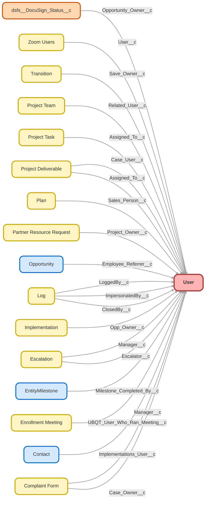

---
hide:
  - path
---

<!-- This file is auto-generated. if you do not want it to be overwritten, set TRUE in the line below -->
<!-- DO_NOT_OVERWRITE_DOC=FALSE -->

## Schema

<!-- Object description -->

## Fields

| Name      | Label | Type | Description |
| :-------- | :---- | :--: | :---------- | 
| AboutMe |  |  | undefined |
| Address |  |  | undefined |
| affectlayer__AffectLayer_Callback_Number__c | AffectLayer Callback Number | Phone | undefined |
| affectlayer__AffectLayer_Callback_Number_Label__c | AffectLayer Callback Number Label | Text | undefined |
| affectlayer__AffectLayer_Caller_Id__c | AffectLayer Caller Id | Phone | undefined |
| affectlayer__AffectLayer_Caller_Id_Label__c | AffectLayer Caller Id Label | Text | undefined |
| Alias |  |  | undefined |
| Calendly_15__c | Calendly 15 | Url | Owners link for a 15 minute Calendly appointment. |
| Calendly_30__c | Calendly 30 | Url | 30 minute Calendly appointment link |
| Calendly_Census_Call__c | Calendly Census Call | Url | Adding census and answering misc questions during Implementation |
| Calendly_Census_Review__c | Calendly Census Review | Url | Link to calendly to schedule census review call for Implementations |
| Calendly_Document_Review__c | Calendly Document Review | Url | Link to calendly to schedule plan document review call for Implementations |
| Calendly_Final_Review_and_Funding_Call__c | Calendly Final Review and Funding Call | Url | First payroll, and handoff to CST (verbally) |
| Calendly_Intro_Plan_Design__c | Calendly Intro/Plan Design | Url | Link to calendly to schedule intro/plan design call for Implementations |
| Calendly_Introductory_Call__c | Calendly Introductory Call | Url | Introductory call w the new client to review the plan, tour the site, and review outstanding items. |
| Calendly_Payroll_Upload__c | Calendly Payroll Upload | Url | Link to calendly to schedule Payroll Upload review call for Implementations |
| Calendly_Training_Call__c | Calendly Training Call | Url | undefined |
| CallCenterId |  | Lookup | undefined |
| Can_Close_Other_Cases__c | Can Close Other Cases | Checkbox | undefined |
| Client_Facing_Email__c | Client Facing Email | Email | Email that gets shared in client communications |
| CommunityNickname |  |  | undefined |
| CompanyName |  |  | undefined |
| compliance_approval__c | Compliance Approval | Hierarchy | undefined |
| ContactId |  | Lookup | undefined |
| Current_Active_Implementations__c | Current Active Implementations | Number | undefined |
| DefaultGroupNotificationFrequency |  |  | undefined |
| DelegatedApproverId |  | Lookup | undefined |
| Department |  |  | undefined |
| dfsle__CanManageAccount__c | Can Manage DocuSign Account | Checkbox | Can Manage DocuSign Account |
| dfsle__Provisioned__c | DocuSign Provisioned Date | Date | Date when the user was added to the account |
| dfsle__Status__c | Docusign Status | Picklist | undefined |
| dfsle__Username__c | DocuSign Username | Text | DocuSign Username |
| DigestFrequency |  |  | undefined |
| Division |  |  | undefined |
| dsfs__DSProSFMembershipStatus__c | DSProSFMembershipStatus | Text | undefined |
| dsfs__DSProSFPassword__c | DSProSFPassword | Text | undefined |
| dsfs__DSProSFUsername__c | DSProSFUsername | Text | DocuSign username |
| Email |  |  | undefined |
| EmailEncodingKey |  |  | undefined |
| EmployeeNumber |  |  | undefined |
| EndDay |  |  | undefined |
| Enroll_Your_Employees__c | Enroll Your Employees | Url | Calendly Link for 401(k) Plan Setup Enroll Your Employees Call |
| et4ae5__Default_ET_Page__c | Default Marketing Cloud Page | Text | undefined |
| et4ae5__Default_MID__c | Default MID | Text | undefined |
| et4ae5__ExactTarget_OAuth_Token__c | @deprecated | EncryptedText | undefined |
| et4ae5__ExactTargetForAppExchangeAdmin__c | Marketing Cloud for AppExchange Admin | Checkbox | undefined |
| et4ae5__ExactTargetForAppExchangeUser__c | Marketing Cloud for AppExchange User | Checkbox | undefined |
| et4ae5__ExactTargetUsername__c | Marketing Cloud Username | Text | undefined |
| et4ae5__ValidExactTargetAdmin__c | Valid Marketing Cloud Admin | Checkbox | undefined |
| et4ae5__ValidExactTargetUser__c | Valid Marketing Cloud User | Checkbox | undefined |
| Extension |  |  | undefined |
| Fax |  |  | undefined |
| FederationIdentifier |  |  | undefined |
| Final_Review_and_Funding__c | Final Review and Funding | Url | Calendly link for 401k Plan Setup Final Call |
| Five9__Five9Agent_Login_TimeStamp__c | Five9Agent Login TimeStamp | Text | undefined |
| Five9__Five9AgentId__c | Five9 Agent Id | Text | undefined |
| ForecastEnabled |  |  | undefined |
| Full_Name__c | Full Name | Text | undefined |
| IndividualId |  | Lookup | undefined |
| Introductory_Call__c | Introductory Call | Url | Calendly Link for 401(k) Plan Setup Introductory Call |
| IsActive |  |  | undefined |
| IsSystemControlled |  |  | undefined |
| LanguageLocaleKey |  |  | undefined |
| lep360learning__creation_date__c | 360Learning creation date | Date | undefined |
| lep360learning__user_deletion_date__c | 360Learning user deletion date | Date | undefined |
| lep360learning__User_id__c | 360Learning User id | Text | undefined |
| lep360learning__X360Learning_user_deletion_date__c | deprecated | Date | undefined |
| License_Team__c | License Team | Picklist | Picklist field to use for grouping on "User Cost Report" |
| LocaleSidKey |  |  | undefined |
| ManagerId |  | Hierarchy | undefined |
| Meeting_Link__c | Meeting Link | Url | undefined |
| MobilePhone |  |  | undefined |
| n2de__Is_logged_out__c | Is logged out | Checkbox | undefined |
| Name |  |  | undefined |
| Phone |  |  | undefined |
| PortalRole |  |  | undefined |
| Profile_ID__c | Profile ID | Text | undefined |
| ProfileId |  | Lookup | undefined |
| ReceivesAdminInfoEmails |  |  | undefined |
| ReceivesInfoEmails |  |  | undefined |
| SenderEmail |  |  | undefined |
| SenderName |  |  | undefined |
| sf_devops__Bitbucket_Primary_Email_Address__c | Bitbucket Primary Email Address | Email | The primary email address used to configure git when we are connecting to a Bitbucket Repository |
| sf_devops__DevOps_Testing_Acknowledged__c | DevOps Testing Acknowledged | Checkbox | Determines whether the User acknowledged the notice about DevOps Testing in the Promote Options Dialog. |
| sf_devops__GitHub_Primary_Email_Address__c | GitHub Primary Email Address | Email | The primary email address used to configure git when we are connecting to a GitHub Repository |
| Shared_User__c | Shared User | Checkbox | Indicates that a username is shared between multiple people |
| Signature |  |  | undefined |
| Signature__c | Signature | Html | Used for individual email signatures. |
| simplesurvey__Survey_Last_Requested_On__c | Survey Last Requested On | DateTime | undefined |
| StartDay |  |  | undefined |
| StayInTouchNote |  |  | undefined |
| StayInTouchSignature |  |  | undefined |
| StayInTouchSubject |  |  | undefined |
| Team__c | Team | Picklist | Used for reporting and flow builds. |
| TimeZoneSidKey |  |  | undefined |
| Title |  |  | undefined |
| User_ID__c | User ID | Text | undefined |
| Username |  |  | undefined |
| UserRoleId |  | Lookup | undefined |
| UserSubtype |  |  | undefined |
| WorkspaceId |  | Lookup | undefined |
| zoom_app__Disable_Invitation_Email__c | Disable Invitation Email | Checkbox | undefined |
| zoom_app__isPMI_Enabled__c | PMI Enabled For Scheduled Meeting | Checkbox | undefined |
| zoom_app__Login_Type__c | Login Type | Picklist | undefined |
| zoom_app__Meeting_Password_Type__c | Non-PMI Meeting Passcode | Number | 1: use PMI password for None PMI meeting;2: set a password for None PMI meeting;3: generate a random password for None PMI meeting |
| zoom_app__Secret_Token__c | Secret Token | Text | undefined |
| zoom_app__Send_Email_to_Attendee__c | Send Email to Attendees at Launch | Checkbox | undefined |
| zoom_app__Send_ICS_in_Invitation_Email__c | Send ICS in Invitation Email | Checkbox | Send ICalendar Attachment File in Meeting Invitation Email |
| zoom_app__Webhook_URL__c | Webhook Notification URL | Text | undefined |
| zoom_app__Zoom_Meeting_Password__c | Zoom Meeting Password | Text | undefined |

## Validation Rules

| Rule      | Active | Description | Formula |
| :-------- | :---- | :---------- | :------ |
| Cannot_Edit_Users | No ⚠️ |  | $User.UserRoleId <> "00E00000006qGD8" && $User.UserRoleId <> "00E00000006pgxa" && $User.UserRoleId <> "00E1G000000p1yx" |

## Related Flows

| Object | Name      | Type | Description |
| :----  | :-------- | :--: | :---------- | 
| 💻 | [Add_On_to_Plan](../flows/Add_On_to_Plan.md) [🕒](../flows/Add_On_to_Plan-history.md) |  Screen Flow | Creates an Add-On Opportunity for an existing plan and assigns to Payroll team |
| 💻 | [Associated_Contact_Process_Update_Pardot_Sender_Info](../flows/Associated_Contact_Process_Update_Pardot_Sender_Info.md) [🕒](../flows/Associated_Contact_Process_Update_Pardot_Sender_Info-history.md) |  Auto Launched Flow | <!-- --> |
| 💻 | [Case_Autolaunched_Need_Approval_For_Jira](../flows/Case_Autolaunched_Need_Approval_For_Jira.md) [🕒](../flows/Case_Autolaunched_Need_Approval_For_Jira-history.md) |  Auto Launched Flow | Checks if a case needs to be "approved" for syncing to Jira |
| 💻 | [Case_Button_Create_Jira_Case](../flows/Case_Button_Create_Jira_Case.md) [🕒](../flows/Case_Button_Create_Jira_Case-history.md) |  Screen Flow | Updated to move "Check Groups" action and approval logic into subflow so it can be called from apex. |
| 💻 | [Case_Split](../flows/Case_Split.md) [🕒](../flows/Case_Split-history.md) |  Screen Flow | Splits selected details and assets of current case into a new case |
| 💻 | [Close_Case](../flows/Close_Case.md) [🕒](../flows/Close_Case-history.md) |  Screen Flow | Modified case close screen to add "subject" as an editable field for CO cases  Surfaces required fields before closing case, depending on case type and user requirements. Added checkbox to allow users to close other peoples' cases. |
| 💻 | [Close_Create_Follow_Up_Event](../flows/Close_Create_Follow_Up_Event.md) [🕒](../flows/Close_Create_Follow_Up_Event-history.md) |  Screen Flow | Closes event while cloning details for follow-up |
| 💻 | [Close_Create_Follow_Up_Task](../flows/Close_Create_Follow_Up_Task.md) [🕒](../flows/Close_Create_Follow_Up_Task-history.md) |  Screen Flow | Closes current task, and clones details when creating a follow-up |
| 💻 | [CreateEvent](../flows/CreateEvent.md) [🕒](../flows/CreateEvent-history.md) |  Auto Launched Flow | Updated to act as a general "catch all" for partners.  If partner utm fields are found on calendlyaction, look for partner with a code that matches utm_source.  Creates event for new "invitee.created" calendlyactions.  Connects to lead or contact if found.  If no person found, creates new lead. |
| 💻 | [Create_Follow_Up_Task_from_Event](../flows/Create_Follow_Up_Task_from_Event.md) [🕒](../flows/Create_Follow_Up_Task_from_Event-history.md) |  Screen Flow | Create follow up Task from Event record |
| 💻 | [Create_Upgrade_from_Plan](../flows/Create_Upgrade_from_Plan.md) [🕒](../flows/Create_Upgrade_from_Plan-history.md) |  Screen Flow | Updated to replace sales director userId fallback w/ search for user with that role, THEN svp strategy.  Finally it will just assign to running user rather than throwing an error.  Creates an Upgrade Opportunity for an existing plan, and assigns to most relevant RPC. |
| 💻 | [Implementation_Update_Task_Ownership](../flows/Implementation_Update_Task_Ownership.md) [🕒](../flows/Implementation_Update_Task_Ownership-history.md) |  Auto Launched Flow | When CST owns Implementation, reassign open tasks when appropriate.   Adds reassignment of "Set Implementation Completion Date" |
| 💻 | [Move_User_to_Person](../flows/Move_User_to_Person.md) [🕒](../flows/Move_User_to_Person-history.md) |  Auto Launched Flow | <!-- --> |
| 💻 | [Nano_Banc_Single_k_Flow](../flows/Nano_Banc_Single_k_Flow.md) [🕒](../flows/Nano_Banc_Single_k_Flow-history.md) |  Auto Launched Flow | <!-- --> |
| 💻 | [Plan_Button_Downgrade_Plan](../flows/Plan_Button_Downgrade_Plan.md) [🕒](../flows/Plan_Button_Downgrade_Plan-history.md) |  Screen Flow | <!-- --> |
| 💻 | [Proposal_Autolaunched_Assign_Lead_Values_From_Proposal](../flows/Proposal_Autolaunched_Assign_Lead_Values_From_Proposal.md) [🕒](../flows/Proposal_Autolaunched_Assign_Lead_Values_From_Proposal-history.md) |  Auto Launched Flow | Added support for principal advisors, TPAs, and employers. |
| 💻 | [Proposal_Delayed_Assignment](../flows/Proposal_Delayed_Assignment.md) [🕒](../flows/Proposal_Delayed_Assignment-history.md) |  Auto Launched Flow | Originally designed to account for when Sallus proposals come in with an advisor lead.  Waits 5 minutes for the lead to auto convert, matches it to proposal. |
| 💻 | [QA_Button_Create_QA](../flows/QA_Button_Create_QA.md) [🕒](../flows/QA_Button_Create_QA-history.md) |  Auto Launched Flow | Switched "Floating QA" check from "recordId is null" to being the default outcome Used from multiple objects of origin to create a QA record |
| 💻 | [QA_Screen_Better_Create_QA](../flows/QA_Screen_Better_Create_QA.md) [🕒](../flows/QA_Screen_Better_Create_QA-history.md) |  Screen Flow | <!-- --> |
| 💻 | [RewardJet_401_k_Flow](../flows/RewardJet_401_k_Flow.md) [🕒](../flows/RewardJet_401_k_Flow-history.md) |  Auto Launched Flow | <!-- --> |
| 💻 | [RewardJet_Single_k_Flow](../flows/RewardJet_Single_k_Flow.md) [🕒](../flows/RewardJet_Single_k_Flow-history.md) |  Auto Launched Flow | <!-- --> |
| 💻 | [Send_Better_Email_Testflow](../flows/Send_Better_Email_Testflow.md) [🕒](../flows/Send_Better_Email_Testflow-history.md) |  Screen Flow | A series of 5 examples for testing and demonstrating Send Better Email Action Component |
| 💻 | [System_Enhancement_Form](../flows/System_Enhancement_Form.md) [🕒](../flows/System_Enhancement_Form-history.md) |  Screen Flow | Updated to run in system context with sharing.  Getting issues with random profiles not having access to this record type.  Making submitter field dynamic, providing redirect to case, and confirmation message that it was submitted |
| 💻 | [Update_Email_Phone](../flows/Update_Email_Phone.md) [🕒](../flows/Update_Email_Phone-history.md) |  Auto Launched Flow | Updates Email & Phone on Task depending on the record type of the associated client. |
| 💻 | [Update_Opportunity_Line_Items](../flows/Update_Opportunity_Line_Items.md) [🕒](../flows/Update_Opportunity_Line_Items-history.md) |  Auto Launched Flow | When Opportunity is created or edited, add or edit the associated products. |
| Associated_Contact__c | [Junction_Update_Lifecycle_Stage](../flows/Junction_Update_Lifecycle_Stage.md) [🕒](../flows/Junction_Update_Lifecycle_Stage-history.md) |  Workflow | <!-- --> |
| Case | [Case_After_Trigger_Associate_related_Messaging_Session](../flows/Case_After_Trigger_Associate_related_Messaging_Session.md) [🕒](../flows/Case_After_Trigger_Associate_related_Messaging_Session-history.md) |  Record After Save | <!-- --> |
| Case | [Case_Before_Update_Master_Flow](../flows/Case_Before_Update_Master_Flow.md) [🕒](../flows/Case_Before_Update_Master_Flow-history.md) |  Record Before Save | Updated to remove case team new check and assignment.  Split into other flow to change run order |
| Case | [Compliance_Auto_Reply_on_Case_Creation](../flows/Compliance_Auto_Reply_on_Case_Creation.md) [🕒](../flows/Compliance_Auto_Reply_on_Case_Creation-history.md) |  Workflow | Auto Reply When Case is Created |
| Case | [Compliance_ForceDist_Status_Changes](../flows/Compliance_ForceDist_Status_Changes.md) [🕒](../flows/Compliance_ForceDist_Status_Changes-history.md) |  Workflow | Updates statuses of ForceDist Cases |
| Case | [Payroll_Default_Team_Member](../flows/Payroll_Default_Team_Member.md) [🕒](../flows/Payroll_Default_Team_Member-history.md) |  Workflow | Default Team Member for Payroll & FinOps value based on certain Subject values |
| Case | [Support_Assign_Department_on_Case_Creation](../flows/Support_Assign_Department_on_Case_Creation.md) [🕒](../flows/Support_Assign_Department_on_Case_Creation-history.md) |  Workflow | Assign department based on owner when case is created |
| Case | [Support_Department_Record_Type_Biz_Hours_on_Edit](../flows/Support_Department_Record_Type_Biz_Hours_on_Edit.md) [🕒](../flows/Support_Department_Record_Type_Biz_Hours_on_Edit-history.md) |  Workflow | Updates Department, Record Type and Business Hours on Edit |
| Case | [Support_Priority_Changes](../flows/Support_Priority_Changes.md) [🕒](../flows/Support_Priority_Changes-history.md) |  Workflow | Makes priority changes to certain cases that meet criteria ( i.e. sets all Schwab cases to High Priority) |
| Case | [Support_Web2Case_Updates](../flows/Support_Web2Case_Updates.md) [🕒](../flows/Support_Web2Case_Updates-history.md) |  Workflow | Makes auto updates to Web2Case Cases on creation |
| Contact | [Contact_Assign_Territory](../flows/Contact_Assign_Territory.md) [🕒](../flows/Contact_Assign_Territory-history.md) |  Workflow | Re-Evaluate Ownership of Advisor Contact based on Mailing State |
| FeedItem | [JIRA_Product_Success_Comment](../flows/JIRA_Product_Success_Comment.md) [🕒](../flows/JIRA_Product_Success_Comment-history.md) |  Workflow | <!-- --> |
| Headcount_Request__c | [Headcount_Request_Scheduled_Create_Employee_Access_on_Start_Date](../flows/Headcount_Request_Scheduled_Create_Employee_Access_on_Start_Date.md) [🕒](../flows/Headcount_Request_Scheduled_Create_Employee_Access_on_Start_Date-history.md) |  Scheduled | <!-- --> |
| Implementation__c | [New_Implementations](../flows/New_Implementations.md) [🕒](../flows/New_Implementations-history.md) |  Workflow | Sets Implementation on the Opportunity and confirms appropriate Record Type |
| Objective__c | [Objectives_After_Save_Auto_Follow_Owned_Objectives](../flows/Objectives_After_Save_Auto_Follow_Owned_Objectives.md) [🕒](../flows/Objectives_After_Save_Auto_Follow_Owned_Objectives-history.md) |  Record After Save | <!-- --> |
| Opportunity | [Opportunity_After_Trigger](../flows/Opportunity_After_Trigger.md) [🕒](../flows/Opportunity_After_Trigger-history.md) |  Record After Save | Submits won plan sales and "Verbal Commitment" upgrades for approval.  Retrieves specific PSM approver for advisor territory if sale is LS "Partner Referral" LSD "Advisor". |
| Opportunity | [Sales_Assign_Upgrade_Owner](../flows/Sales_Assign_Upgrade_Owner.md) [🕒](../flows/Sales_Assign_Upgrade_Owner-history.md) |  Workflow | Update Upgrade Opportunity Owner Upon Creation |
| Proposal__c | [Proposal_After_Update_RPC_OOO](../flows/Proposal_After_Update_RPC_OOO.md) [🕒](../flows/Proposal_After_Update_RPC_OOO-history.md) |  Record After Save | Assigns new partner proposals to backup RPC - updated for Robby summer OOO |
| Proposal__c | [Proposal_Status_Workflow](../flows/Proposal_Status_Workflow.md) [🕒](../flows/Proposal_Status_Workflow-history.md) |  Workflow | added QQ status |
| Proposal__c | [Proposal_Trigger_Connect_to_Referrer](../flows/Proposal_Trigger_Connect_to_Referrer.md) [🕒](../flows/Proposal_Trigger_Connect_to_Referrer-history.md) |  Record After Save | Excluded expired proposals |
| Task | [Sales_Email_RPC_when_Upgrade_is_Created_from_Plan](../flows/Sales_Email_RPC_when_Upgrade_is_Created_from_Plan.md) [🕒](../flows/Sales_Email_RPC_when_Upgrade_is_Created_from_Plan-history.md) |  Workflow | Email Upgrade Opportunity Owner Upon Creation |
| Transition__c | [Transitions_Master_Workflow](../flows/Transitions_Master_Workflow.md) [🕒](../flows/Transitions_Master_Workflow-history.md) |  Workflow | Steps to take when Transitions are created, saved and completed. Changed Inquiry Date node to Notification Date |
| User | [User_After_Trigger_Create_Person_Record](../flows/User_After_Trigger_Create_Person_Record.md) [🕒](../flows/User_After_Trigger_Create_Person_Record-history.md) |  Record After Save | Used for splitting/re-assigning cases and people to queues |

## Related Apex Classes

| Apex Class | Type |
| :----      | :--: | 
| [AnyEventCalCtrl](../apex/AnyEventCalCtrl.md) | Lightning Controller |
| [CallableLogger](../apex/CallableLogger.md) | Class |
| [CallableLogger_Tests](../apex/CallableLogger_Tests.md) | Test |
| [CommunitiesSelfRegController](../apex/CommunitiesSelfRegController.md) | Visualforce Controller |
| [CommunitiesSelfRegControllerTest](../apex/CommunitiesSelfRegControllerTest.md) | Test (See All Data) |
| [ComponentLogger](../apex/ComponentLogger.md) | Lightning Controller |
| [ComponentLogger_Tests](../apex/ComponentLogger_Tests.md) | Test |
| [FlowCollectionLogEntry_Tests](../apex/FlowCollectionLogEntry_Tests.md) | Test |
| [FlowLogEntry_Tests](../apex/FlowLogEntry_Tests.md) | Test |
| [FlowLogger_Tests](../apex/FlowLogger_Tests.md) | Test |
| [FlowRecordLogEntry_Tests](../apex/FlowRecordLogEntry_Tests.md) | Test |
| [GetUserGroups](../apex/GetUserGroups.md) | Invocable |
| [GetUserGroups_TEST](../apex/GetUserGroups_TEST.md) | Test |
| [JiraCaseSync](../apex/JiraCaseSync.md) | Class |
| [LCC_JSMQueryResultService](../apex/LCC_JSMQueryResultService.md) | Lightning Controller |
| [LCC_JSMQueryResultServiceTest](../apex/LCC_JSMQueryResultServiceTest.md) | Test |
| [LCC_JSMUserInfo](../apex/LCC_JSMUserInfo.md) | Lightning Controller |
| [LogBatchPurgeController](../apex/LogBatchPurgeController.md) | Lightning Controller |
| [LogBatchPurgeController_Tests](../apex/LogBatchPurgeController_Tests.md) | Test |
| [LogBatchPurger](../apex/LogBatchPurger.md) | Batch |
| [LogBatchPurger_Tests](../apex/LogBatchPurger_Tests.md) | Test |
| [LogEntryEventBuilder](../apex/LogEntryEventBuilder.md) | Class |
| [LogEntryEventBuilder_Tests](../apex/LogEntryEventBuilder_Tests.md) | Test |
| [LogEntryEventHandler](../apex/LogEntryEventHandler.md) | Class |
| [LogEntryEventHandler_Tests](../apex/LogEntryEventHandler_Tests.md) | Test |
| [LogEntryEventStreamController](../apex/LogEntryEventStreamController.md) | Lightning Controller |
| [LogEntryEventStreamController_Tests](../apex/LogEntryEventStreamController_Tests.md) | Test |
| [LogEntryHandler](../apex/LogEntryHandler.md) | Class |
| [LogEntryHandler_Tests](../apex/LogEntryHandler_Tests.md) | Test |
| [LogHandler](../apex/LogHandler.md) | Class |
| [LogHandler_Tests](../apex/LogHandler_Tests.md) | Test |
| [LogManagementDataSelector](../apex/LogManagementDataSelector.md) | Class |
| [LogManagementDataSelector_Tests](../apex/LogManagementDataSelector_Tests.md) | Test |
| [LogMassDeleteExtension](../apex/LogMassDeleteExtension.md) | Visualforce Controller |
| [LogMassDeleteExtension_Tests](../apex/LogMassDeleteExtension_Tests.md) | Test |
| [LogMessage_Tests](../apex/LogMessage_Tests.md) | Test |
| [Logger](../apex/Logger.md) | Invocable |
| [LoggerCache_Tests](../apex/LoggerCache_Tests.md) | Test |
| [LoggerDataStore_Tests](../apex/LoggerDataStore_Tests.md) | Test |
| [LoggerEmailSender](../apex/LoggerEmailSender.md) | Class |
| [LoggerEmailSender_Tests](../apex/LoggerEmailSender_Tests.md) | Test |
| [LoggerEngineDataSelector](../apex/LoggerEngineDataSelector.md) | Class |
| [LoggerEngineDataSelector_Tests](../apex/LoggerEngineDataSelector_Tests.md) | Test |
| [LoggerHomeHeaderController](../apex/LoggerHomeHeaderController.md) | Lightning Controller |
| [LoggerHomeHeaderController_Tests](../apex/LoggerHomeHeaderController_Tests.md) | Test |
| [LoggerMockDataCreator](../apex/LoggerMockDataCreator.md) | Test |
| [LoggerParameter](../apex/LoggerParameter.md) | Class |
| [LoggerParameter_Tests](../apex/LoggerParameter_Tests.md) | Test |
| [LoggerSObjectHandler_Tests](../apex/LoggerSObjectHandler_Tests.md) | Test |
| [LoggerSObjectMetadata_Tests](../apex/LoggerSObjectMetadata_Tests.md) | Test |
| [LoggerSObjectProxy](../apex/LoggerSObjectProxy.md) | Class |
| [LoggerSObjectProxy_Tests](../apex/LoggerSObjectProxy_Tests.md) | Test |
| [LoggerSettingsController](../apex/LoggerSettingsController.md) | Lightning Controller |
| [LoggerSettingsController_Tests](../apex/LoggerSettingsController_Tests.md) | Test |
| [LoggerTestConfigurator](../apex/LoggerTestConfigurator.md) | Test |
| [LoggerTriggerableContext_Tests](../apex/LoggerTriggerableContext_Tests.md) | Test |
| [Logger_Tests](../apex/Logger_Tests.md) | Test |
| [MicrobatchSelfRegController](../apex/MicrobatchSelfRegController.md) | Visualforce Controller |
| [MicrobatchSelfRegControllerTest](../apex/MicrobatchSelfRegControllerTest.md) | Test (See All Data) |
| [MyProfilePageController](../apex/MyProfilePageController.md) | Visualforce Controller |
| [MyProfilePageControllerTest](../apex/MyProfilePageControllerTest.md) | Test (See All Data) |
| [ParadigmAuthController](../apex/ParadigmAuthController.md) | Lightning Controller |
| [PaycorEmailHandlerNew](../apex/PaycorEmailHandlerNew.md) | Class |
| [PaycorEmailHandlerNewTest](../apex/PaycorEmailHandlerNewTest.md) | Test |
| [ProposalTriggerHandler](../apex/ProposalTriggerHandler.md) | Trigger Handler |
| [PurchaseAPIController](../apex/PurchaseAPIController.md) | Lightning Controller |
| [RelatedLogEntriesController](../apex/RelatedLogEntriesController.md) | Lightning Controller |
| [RelatedLogEntriesController_Tests](../apex/RelatedLogEntriesController_Tests.md) | Test |
| [SendBetterEmail](../apex/SendBetterEmail.md) | Invocable |
| [SendBetterEmailAddTasksToEmail](../apex/SendBetterEmailAddTasksToEmail.md) | Class |
| [SendBetterEmailRequest](../apex/SendBetterEmailRequest.md) | Lightning Controller |
| [SendBetterEmailTest](../apex/SendBetterEmailTest.md) | Test |
| [SendBetterEmailUtil](../apex/SendBetterEmailUtil.md) | Class |
| [SiteRegisterController](../apex/SiteRegisterController.md) | Visualforce Controller |
| [SiteRegisterControllerTest](../apex/SiteRegisterControllerTest.md) | Test (See All Data) |
| [TestAutoConvertLeads](../apex/TestAutoConvertLeads.md) | Test |
| [TestAutoConvertLeadsNoOpp](../apex/TestAutoConvertLeadsNoOpp.md) | Test |
| [ZoomCallCenterService](../apex/ZoomCallCenterService.md) | Callout |
| [ZoomCallCenterServiceMock](../apex/ZoomCallCenterServiceMock.md) | Test |
| [ZoomCallTranscriptionController](../apex/ZoomCallTranscriptionController.md) | Lightning Controller |
| [ZoomTestDataFactory](../apex/ZoomTestDataFactory.md) | Test |
| [ZoomUserInfosRecordCreatorBatch](../apex/ZoomUserInfosRecordCreatorBatch.md) | Batch |
| [ZoomUserInfosRecordCreatorBatchService](../apex/ZoomUserInfosRecordCreatorBatchService.md) | Callout |
| [ZoomUserInfosRecordCreatorBatchTest](../apex/ZoomUserInfosRecordCreatorBatchTest.md) | Test |
| [ZoomUsersInfoTriggerController](../apex/ZoomUsersInfoTriggerController.md) | Class |
| [ZoomUsersInfoTriggerControllerTest](../apex/ZoomUsersInfoTriggerControllerTest.md) | Test |
| [ZoomUsersInfoTriggerHandler](../apex/ZoomUsersInfoTriggerHandler.md) | Trigger Handler |
| [ZoomUsersPermissionCheckerBatch](../apex/ZoomUsersPermissionCheckerBatch.md) | Batch |
| [ZoomUsersPermissionCheckerBatchTest](../apex/ZoomUsersPermissionCheckerBatchTest.md) | Test |
| [ZoomUsersPhoneEntity](../apex/ZoomUsersPhoneEntity.md) | Class |
| [ZoomUsersPhoneInfosBatch](../apex/ZoomUsersPhoneInfosBatch.md) | Batch |
| [ZoomUsersPhoneInfosBatchHttpCalloutMock](../apex/ZoomUsersPhoneInfosBatchHttpCalloutMock.md) | Test |
| [ZoomUsersPhoneService](../apex/ZoomUsersPhoneService.md) | Callout |
| [ZoomWebhookController](../apex/ZoomWebhookController.md) | Class |
| [ZoomWebhookControllerTest](../apex/ZoomWebhookControllerTest.md) | Test |
| [ZoomWebhookHelper](../apex/ZoomWebhookHelper.md) | Class |
| [ZooomUserResponseWrapper](../apex/ZooomUserResponseWrapper.md) | Class |
| [CompleteClosureMilestone](../apex/CompleteClosureMilestone.md) | Class |
| [ZoomUsersInfoTrigger](../apex/ZoomUsersInfoTrigger.md) | Trigger Handler |

## Related Lightning Pages

| Lightning Page | Type |
| :----      | :--: | 
| [BI_Test_Layout](../pages/BI_Test_Layout.md) |  Record Page |
| [CE_Page_2025](../pages/CE_Page_2025.md) |  Record Page |
| [CO_Messaging_Session1](../pages/CO_Messaging_Session1.md) |  Record Page |
| [Call_Center_Page](../pages/Call_Center_Page.md) |  Record Page |
| [Compliance_Case_Page](../pages/Compliance_Case_Page.md) |  Record Page |
| [Compliance_Home_Page](../pages/Compliance_Home_Page.md) |  Home Page |
| [Console_Case_Layout](../pages/Console_Case_Layout.md) |  Record Page |
| [Console_Case_Layout_Marketing](../pages/Console_Case_Layout_Marketing.md) |  Record Page |
| [Default_Contact_Layout](../pages/Default_Contact_Layout.md) |  Record Page |
| [Dynamic_Account_Page](../pages/Dynamic_Account_Page.md) |  Record Page |
| [Dynamic_Case_Page](../pages/Dynamic_Case_Page.md) |  Record Page |
| [Dynamic_Imp_Record_Page](../pages/Dynamic_Imp_Record_Page.md) |  Record Page |
| [Dynamic_Lead_Page](../pages/Dynamic_Lead_Page.md) |  Record Page |
| [Employee_Technology_Access_Record_Page1](../pages/Employee_Technology_Access_Record_Page1.md) |  Record Page |
| [Imp_Case_Layout](../pages/Imp_Case_Layout.md) |  Record Page |
| [LogEntryRecordPage](../pages/LogEntryRecordPage.md) |  Record Page |
| [LogRecordPage](../pages/LogRecordPage.md) |  Record Page |
| [LoggerScenarioRecordPage](../pages/LoggerScenarioRecordPage.md) |  Record Page |
| [Messaging_Session](../pages/Messaging_Session.md) |  Record Page |
| [Messaging_Session_Record_Page](../pages/Messaging_Session_Record_Page.md) |  Record Page |
| [Messaging_User_Record_Page](../pages/Messaging_User_Record_Page.md) |  Record Page |
| [New_3_Region_CE_Case_Page](../pages/New_3_Region_CE_Case_Page.md) |  Record Page |
| [New_CST_Home_Page](../pages/New_CST_Home_Page.md) |  Home Page |
| [New_Distributions_Homepage](../pages/New_Distributions_Homepage.md) |  Home Page |
| [New_FinOps_Home_Page](../pages/New_FinOps_Home_Page.md) |  Home Page |
| [New_Payroll_Homepage](../pages/New_Payroll_Homepage.md) |  Home Page |
| [New_RW_Home_Page1](../pages/New_RW_Home_Page1.md) |  Home Page |
| [New_Transitions_Homepage](../pages/New_Transitions_Homepage.md) |  Home Page |
| [Payroll_Integration](../pages/Payroll_Integration.md) |  Record Page |
| [Payroll_Team_Page](../pages/Payroll_Team_Page.md) |  Record Page |
| [Plan_Record_Page](../pages/Plan_Record_Page.md) |  Record Page |
| [Project_Task_Layout](../pages/Project_Task_Layout.md) |  Record Page |
| [RM_Home_Page](../pages/RM_Home_Page.md) |  Home Page |
| [Sales_Home](../pages/Sales_Home.md) |  Home Page |

## Related Profiles

| Profile | User License |
| :----      | :--: | 
| [Admin](../profiles/Admin.md) |  Salesforce |
| [Analytics Cloud Integration User](../profiles/Analytics%20Cloud%20Integration%20User.md) |  Analytics  Cloud  Integration  User |
| [Analytics Cloud Security User](../profiles/Analytics%20Cloud%20Security%20User.md) |  Analytics  Cloud  Integration  User |
| [Anypoint Integration](../profiles/Anypoint%20Integration.md) |  Identity |
| [B2BMA Integration User](../profiles/B2BMA%20Integration%20User.md) |  B2 B M A  Integration  User |
| [Billing User](../profiles/Billing%20User.md) |  Salesforce |
| [Bot Profile](../profiles/Bot%20Profile.md) |  Salesforce |
| [Business Development](../profiles/Business%20Development.md) |  Salesforce |
| [Call Center](../profiles/Call%20Center.md) |  Salesforce |
| [Chatter External User](../profiles/Chatter%20External%20User.md) |  Chatter  External |
| [Chatter Free User](../profiles/Chatter%20Free%20User.md) |  Chatter  Free |
| [Chatter Moderator User](../profiles/Chatter%20Moderator%20User.md) |  Chatter  Free |
| [Client Onboarding - Admin](../profiles/Client%20Onboarding%20-%20Admin.md) |  Salesforce |
| [Client Onboarding - RM](../profiles/Client%20Onboarding%20-%20RM.md) |  Salesforce |
| [Client Servicing Team](../profiles/Client%20Servicing%20Team.md) |  Salesforce |
| [Compliance Manager](../profiles/Compliance%20Manager.md) |  Salesforce |
| [ContractManager](../profiles/ContractManager.md) |  Salesforce |
| [Director of Operations](../profiles/Director%20of%20Operations.md) |  Salesforce |
| [Director of Sales](../profiles/Director%20of%20Sales.md) |  Salesforce |
| [Distributions](../profiles/Distributions.md) |  Salesforce |
| [Einstein Agent User](../profiles/Einstein%20Agent%20User.md) |  Einstein  Agent |
| [ESW_Agentforce_MIAW_1748035300267 Profile](../profiles/ESW_Agentforce_MIAW_1748035300267%20Profile.md) |  Guest  User  License |
| [ESW_Agentforce_MIAW_1748385215843 Profile](../profiles/ESW_Agentforce_MIAW_1748385215843%20Profile.md) |  Guest  User  License |
| [ESW_CE_Chat_1692890394498 Profile](../profiles/ESW_CE_Chat_1692890394498%20Profile.md) |  Guest  User  License |
| [ESW_CE_Chat_Moe_1693182845676 Profile](../profiles/ESW_CE_Chat_Moe_1693182845676%20Profile.md) |  Guest  User  License |
| [ESW_Login_Help_1697133738638 Profile](../profiles/ESW_Login_Help_1697133738638%20Profile.md) |  Guest  User  License |
| [ESW_Login_Help_Simply_1700075140889 Profile](../profiles/ESW_Login_Help_Simply_1700075140889%20Profile.md) |  Guest  User  License |
| [ESW_Omni_Messaging_1694183770479 Profile](../profiles/ESW_Omni_Messaging_1694183770479%20Profile.md) |  Guest  User  License |
| [ESW_Omni_Messaging_CO_1696448547822 Profile](../profiles/ESW_Omni_Messaging_CO_1696448547822%20Profile.md) |  Guest  User  License |
| [ESW_Omni_Messaging_Sallus_1700075448386 Profile](../profiles/ESW_Omni_Messaging_Sallus_1700075448386%20Profile.md) |  Guest  User  License |
| [ESW_Omni_Messaging_Simply_1700076370188 Profile](../profiles/ESW_Omni_Messaging_Simply_1700076370188%20Profile.md) |  Guest  User  License |
| [ESW_QA_Login_1699666348585 Profile](../profiles/ESW_QA_Login_1699666348585%20Profile.md) |  Guest  User  License |
| [ESW_QA_Messaging_1699974036493 Profile](../profiles/ESW_QA_Messaging_1699974036493%20Profile.md) |  Guest  User  License |
| [ESW_Sales_Chat_1697460991337 Profile](../profiles/ESW_Sales_Chat_1697460991337%20Profile.md) |  Guest  User  License |
| [ESW_Sallus_Login_Chat_1700072925200 Profile](../profiles/ESW_Sallus_Login_Chat_1700072925200%20Profile.md) |  Guest  User  License |
| [External Apps Login User](../profiles/External%20Apps%20Login%20User.md) |  External  Apps  Login |
| [Finance Manager Lightning](../profiles/Finance%20Manager%20Lightning.md) |  Salesforce |
| [Guest License User](../profiles/Guest%20License%20User.md) |  Guest  User  License |
| [Help Center Profile](../profiles/Help%20Center%20Profile.md) |  Guest  User  License |
| [Identity User](../profiles/Identity%20User.md) |  Identity |
| [Incoming_SMS Profile](../profiles/Incoming_SMS%20Profile.md) |  Guest  User  License |
| [IT](../profiles/IT.md) |  Salesforce |
| [Leadership Lightning](../profiles/Leadership%20Lightning.md) |  Salesforce |
| [Leadership](../profiles/Leadership.md) |  Salesforce |
| [Learning %26 Development](../profiles/Learning%20%2526%20Development.md) |  Salesforce |
| [Lightning Client Onboarding](../profiles/Lightning%20Client%20Onboarding.md) |  Salesforce |
| [Lightning Compliance](../profiles/Lightning%20Compliance.md) |  Salesforce |
| [Lightning Saver User](../profiles/Lightning%20Saver%20User.md) |  Salesforce |
| [Lightning Service Manager](../profiles/Lightning%20Service%20Manager.md) |  Salesforce |
| [Lightning Service User](../profiles/Lightning%20Service%20User.md) |  Salesforce |
| [Marketing Team](../profiles/Marketing%20Team.md) |  Salesforce |
| [MarketingProfile](../profiles/MarketingProfile.md) |  Salesforce |
| [Master Administrator](../profiles/Master%20Administrator.md) |  Salesforce |
| [Minimum Access - API Only Integrations](../profiles/Minimum%20Access%20-%20API%20Only%20Integrations.md) |  Salesforce  Integration |
| [Minimum Access - Salesforce](../profiles/Minimum%20Access%20-%20Salesforce.md) |  Salesforce |
| [myubiquity Profile](../profiles/myubiquity%20Profile.md) |  Guest  User  License |
| [Operations VP](../profiles/Operations%20VP.md) |  Salesforce |
| [Operations](../profiles/Operations.md) |  Salesforce |
| [Paradigm Help Center Profile](../profiles/Paradigm%20Help%20Center%20Profile.md) |  Guest  User  License |
| [Payroll Koncierge](../profiles/Payroll%20Koncierge.md) |  Salesforce |
| [Payroll Team](../profiles/Payroll%20Team.md) |  Salesforce |
| [People %26 Culture](../profiles/People%20%2526%20Culture.md) |  Salesforce |
| [Pre-chat Site Profile](../profiles/Pre-chat%20Site%20Profile.md) |  Guest  User  License |
| [Product Innovation Leadership](../profiles/Product%20Innovation%20Leadership.md) |  Salesforce |
| [Product Innovation User](../profiles/Product%20Innovation%20User.md) |  Salesforce |
| [PSM Team](../profiles/PSM%20Team.md) |  Salesforce |
| [R%26W](../profiles/R%2526W.md) |  Salesforce |
| [Read Only](../profiles/Read%20Only.md) |  Salesforce |
| [Sales Administrator](../profiles/Sales%20Administrator.md) |  Salesforce |
| [Sales Coordinator](../profiles/Sales%20Coordinator.md) |  Salesforce |
| [Sales Insights Integration User](../profiles/Sales%20Insights%20Integration%20User.md) |  Sales  Insights  Integration  User |
| [Sales Team - Limited](../profiles/Sales%20Team%20-%20Limited.md) |  Salesforce |
| [Sales Team](../profiles/Sales%20Team.md) |  Salesforce |
| [Salesforce API Only System Integrations](../profiles/Salesforce%20API%20Only%20System%20Integrations.md) |  Salesforce  Integration |
| [SalesforceIQ Integration User](../profiles/SalesforceIQ%20Integration%20User.md) |  Salesforce I Q  Integration  User |
| [Saver Manager](../profiles/Saver%20Manager.md) |  Salesforce |
| [Simple Survey Profile](../profiles/Simple%20Survey%20Profile.md) |  Guest  User  License |
| [Simply Help Center Profile](../profiles/Simply%20Help%20Center%20Profile.md) |  Guest  User  License |
| [SolutionManager](../profiles/SolutionManager.md) |  Salesforce |
| [Standard](../profiles/Standard.md) |  Salesforce |
| [StandardAul](../profiles/StandardAul.md) |  Salesforce  Platform |
| [Super System Administrator](../profiles/Super%20System%20Administrator.md) |  Salesforce |
| [Sys Dev Admin](../profiles/Sys%20Dev%20Admin.md) |  Salesforce |
| [Transitions Team](../profiles/Transitions%20Team.md) |  Salesforce |
| [Ubiquity Help Center Profile](../profiles/Ubiquity%20Help%20Center%20Profile.md) |  Guest  User  License |
| [Zoom Webhooks Profile](../profiles/Zoom%20Webhooks%20Profile.md) |  Guest  User  License |

## Related Permission Sets

| Permission Set | User License |
| :----      | :--: | 
| [Administrator](../permissionsets/Administrator.md) | None |
| [Agentforce_Custom_PS](../permissionsets/Agentforce_Custom_PS.md) | None |
| [Analytics_App_Create_Apps_and_Dashboards](../permissionsets/Analytics_App_Create_Apps_and_Dashboards.md) | None |
| [Attachments_and_Notes_Migrator](../permissionsets/Attachments_and_Notes_Migrator.md) | None |
| [Automation_Team_Imp_Project_Tasks](../permissionsets/Automation_Team_Imp_Project_Tasks.md) | None |
| [B2B_Marketing_Analytics_Create_Apps_Editable](../permissionsets/B2B_Marketing_Analytics_Create_Apps_Editable.md) | None |
| [B2B_Marketing_Analytics](../permissionsets/B2B_Marketing_Analytics.md) | None |
| [Box_Standard_Editable](../permissionsets/Box_Standard_Editable.md) | None |
| [Campaign_Influence](../permissionsets/Campaign_Influence.md) | None |
| [Chat_Omni_Channel_Supervisor](../permissionsets/Chat_Omni_Channel_Supervisor.md) | None |
| [Configure_Messaging](../permissionsets/Configure_Messaging.md) | None |
| [Create_Edit_Reports_Dashboards](../permissionsets/Create_Edit_Reports_Dashboards.md) | None |
| [Data_Loader](../permissionsets/Data_Loader.md) | None |
| [DataServicesPS_Editable](../permissionsets/DataServicesPS_Editable.md) | None |
| [Developer](../permissionsets/Developer.md) | None |
| [ExactTarget_Integration_Admin](../permissionsets/ExactTarget_Integration_Admin.md) | None |
| [ExactTarget_Integration_Editable](../permissionsets/ExactTarget_Integration_Editable.md) | None |
| [Knowledge_User](../permissionsets/Knowledge_User.md) | None |
| [Lightning_User](../permissionsets/Lightning_User.md) | None |
| [LoggerAdmin](../permissionsets/LoggerAdmin.md) | None |
| [LoggerEndUser](../permissionsets/LoggerEndUser.md) | None |
| [LoggerLogViewer](../permissionsets/LoggerLogViewer.md) | None |
| [MagicMover](../permissionsets/MagicMover.md) | None |
| [Manage_Templated_Analytics_Apps](../permissionsets/Manage_Templated_Analytics_Apps.md) | None |
| [Manager](../permissionsets/Manager.md) | None |
| [Marketing_Cloud_Connected_App](../permissionsets/Marketing_Cloud_Connected_App.md) | None |
| [Marketing_Cloud_System_User](../permissionsets/Marketing_Cloud_System_User.md) | None |
| [Master](../permissionsets/Master.md) | None |
| [Modify_All](../permissionsets/Modify_All.md) | None |
| [Omni_Channel_Case_User](../permissionsets/Omni_Channel_Case_User.md) | None |
| [Omni_Messaging](../permissionsets/Omni_Messaging.md) | None |
| [Ops_Metrics_User](../permissionsets/Ops_Metrics_User.md) | None |
| [Outbound_Messaging](../permissionsets/Outbound_Messaging.md) | None |
| [Power_User](../permissionsets/Power_User.md) | None |
| [Purchase_Api](../permissionsets/Purchase_Api.md) | None |
| [Salesforce_Lead_Capture](../permissionsets/Salesforce_Lead_Capture.md) | None |
| [sfdc_chatbot_service_permset](../permissionsets/sfdc_chatbot_service_permset.md) | None |
| [sfdcInternalInt__sfdc_a360_sfcrm_data_extract](../permissionsets/sfdcInternalInt__sfdc_a360_sfcrm_data_extract.md) | None |
| [sfdcInternalInt__sfdc_a360](../permissionsets/sfdcInternalInt__sfdc_a360.md) | None |
| [sfdcInternalInt__sfdc_activityplatform](../permissionsets/sfdcInternalInt__sfdc_activityplatform.md) | None |
| [sfdcInternalInt__sfdc_articlerecommendations](../permissionsets/sfdcInternalInt__sfdc_articlerecommendations.md) | None |
| [sfdcInternalInt__sfdc_einsteinagent](../permissionsets/sfdcInternalInt__sfdc_einsteinagent.md) | None |
| [sfdcInternalInt__sfdc_replyrecommendations](../permissionsets/sfdcInternalInt__sfdc_replyrecommendations.md) | None |
| [sfdcInternalInt__sfdc_scrt2](../permissionsets/sfdcInternalInt__sfdc_scrt2.md) | None |
| [sfdcInternalInt__sfdc_slack](../permissionsets/sfdcInternalInt__sfdc_slack.md) | None |
| [Standard_User](../permissionsets/Standard_User.md) | None |
| [Ubiquity_Service_Agent_Permissions](../permissionsets/Ubiquity_Service_Agent_Permissions.md) | None |
| [Use_Analytics_Templated_Apps](../permissionsets/Use_Analytics_Templated_Apps.md) | None |
| [Use_Analytics](../permissionsets/Use_Analytics.md) | None |
| [View_All](../permissionsets/View_All.md) | None |
| [Work_Breakdown_Structure_Access](../permissionsets/Work_Breakdown_Structure_Access.md) | None |
| [Zoom_Admin_Webinar](../permissionsets/Zoom_Admin_Webinar.md) | None |
| [Zoom_Integration_Admin_Permission_Set](../permissionsets/Zoom_Integration_Admin_Permission_Set.md) | None |
| [Zoom_Integration_Call_Center_User_Permission_Set](../permissionsets/Zoom_Integration_Call_Center_User_Permission_Set.md) | None |
| [Zoom_Integration_Manager_Permission_Set](../permissionsets/Zoom_Integration_Manager_Permission_Set.md) | None |
| [Zoom_Permissions](../permissionsets/Zoom_Permissions.md) | None |
| [Zoom_User_Webinar](../permissionsets/Zoom_User_Webinar.md) | None |

_Documentation generated with [sfdx-hardis](https://sfdx-hardis.cloudity.com), by [Cloudity](https://www.cloudity.com/) & [friends](https://github.com/hardisgroupcom/sfdx-hardis/graphs/contributors)_
