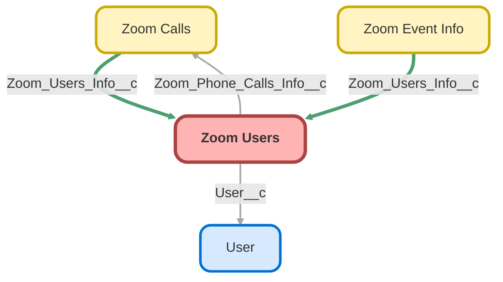

---
hide:
  - path
---

<!-- This file is auto-generated. if you do not want it to be overwritten, set TRUE in the line below -->
<!-- DO_NOT_OVERWRITE_DOC=FALSE -->

## Schema

<!-- Object description -->

## Fields

| Name      | Label | Type | Description |
| :-------- | :---- | :--: | :---------- | 
| AHT__c | AHT | Number | Average handle time of inbound and outbound calls in minutes. |
| AHT_Inbound__c | AHT Inbound CC | Text | Average duration of inbound calls for Contact Center |
| AHT_Inbound_Calls__c | AHT Inbound | Text | Average duration of inbound calls for Phone Users |
| AHT_Outbound__c | AHT Outbound CC | Text | Average duration of outbound calls for Contact Center |
| AHT_Outbound_Call__c | AHT Outbound | Text | Average duration of outbound calls for Phone Users |
| Available__c | Available | Number | undefined |
| Away__c | Away | Number | undefined |
| Call_Center_Member__c | Call Center Member | Text | Call Center member |
| CC_Prev_Status__c | Prev Status CC | Text | undefined |
| CC_Prev_Sub_Status__c | Prev Sub Status CC | Text | undefined |
| CC_Status_Updated__c | Status Updated CC | DateTime | undefined |
| CC_Sub_Status_Updated__c | Sub Status Updated CC | DateTime | undefined |
| Contact_Center_Status__c | Status CC | Text | Contact center user's availability status. |
| Contact_Center_Sub_Status__c | Sub Status CC | Text | Contact Center user status when the user's current status is Not Ready. |
| Custom_CC_Status__c | Custom Status CC | Number | undefined |
| Custom_Status__c | Custom Status | Number | undefined |
| Do_Not_Disturb__c | Do Not Disturb | Number | undefined |
| Email__c | Email | Email | undefined |
| Extension_Id__c | Extension Id | Text | Zoom application extension Id. |
| Extension_Number__c | Extension Number | Number | Zoom application extension number. |
| In_Calendar_Event__c | In Calendar Event | Number | undefined |
| In_Meeting__c | In Meeting | Number | undefined |
| Inbound_Calls__c | Inbound Calls CC | Summary | Total Number inbound Calls for Contact Center Users |
| Inbound_Calls_Duration__c | Inbound Calls Duration | Summary | Total user inbound phone calls duration. |
| LogIn__c | LogIn | DateTime | First User Login inside Zoom App |
| LogOut__c | LogOut | DateTime | undefined |
| Not_Ready__c | Not Ready | Number | undefined |
| Occupied__c | Occupied | Number | undefined |
| Offline__c | Offline | Number | undefined |
| Offline_Status__c | Offline Status | Number | undefined |
| On_Phone_Call__c | On Phone Call | Number | undefined |
| Outbound_Calls__c | Outbound Calls CC | Summary | Total Number of outbound Calls from Contact Center |
| Outbound_Calls_Duration__c | Outbound Calls Duration | Summary | Total user outbound phone calls duration. |
| Presence_Status__c | Status | Text | User status for Zoom App |
| Presenting__c | Presenting | Number | undefined |
| Ready__c | Ready | Number | undefined |
| Status_Updated__c | Status Updated | DateTime | undefined |
| Total_Available__c | Total Available | Text | User available per day. |
| Total_Away__c | Total Away | Text | Total time Away per day. |
| Total_Do_Not_Disturb__c | Total Do Not Disturb | Text | Total time Do Not Disturb per day. |
| Total_In_Calendar_Event__c | Total In Calendar Event | Text | Total time In Calendar Event per day. |
| Total_In_Meeting__c | Total In Meeting | Text | Total In Meeting per day. |
| Total_Inbound_Calls__c | Inbound Calls | Summary | undefined |
| Total_Inbound_Calls_Duration__c | Total Inbound Calls Duration | Summary | Total Inbound Calls Duration per day. |
| Total_Not_Ready__c | Total Not Ready | Text | User not ready per day. |
| Total_Occupied__c | Total Occupied | Text | User occupied per day. |
| Total_Offline__c | Total Offline | Text | Total offline time per day. |
| Total_Offline_Time__c | Total Offline Time | Text | User offline per day. |
| Total_On_Phone_Call__c | Total On Phone Call | Text | Total On Phone Call per day. |
| Total_Outbound_Calls__c | Outbound Calls | Summary | Total Outbound phone calls |
| Total_Outbound_Calls_Duration__c | Total Outbound Calls Duration | Summary | Total Outbound Calls Duration per day. |
| Total_Presenting__c | Total Presenting | Text | Total time In Presenting per day. |
| Total_Ready__c | Total Ready | Text | User available per day. |
| Tracking_Date__c | Tracking Date | Date | undefined |
| User__c | User | Lookup | undefined |
| User_Log_In__c | LogIn CC | DateTime | First user logged inside Contact Center |
| User_Log_Out__c | LogOut CC | DateTime | undefined |
| Zoom_Department__c | Zoom Department | Text | undefined |
| Zoom_Email__c | Zoom Email | Email | Zoom application email address. |
| Zoom_Name__c | Zoom Name | Text | The name that the user uses in Zoom. |
| Zoom_Phone_Calls_Info__c | Zoom Phone Calls Info | Lookup | undefined |
| Zoom_User_Id__c | Zoom User Id | Text | The unique identifier of the user (userId). |

## Related Apex Classes

| Apex Class | Type |
| :----      | :--: | 
| [ZoomCallCenterService](../apex/ZoomCallCenterService.md) | Callout |
| [ZoomCallCenterServiceMock](../apex/ZoomCallCenterServiceMock.md) | Test |
| [ZoomTestDataFactory](../apex/ZoomTestDataFactory.md) | Test |
| [ZoomUserInfosRecordCreatorBatch](../apex/ZoomUserInfosRecordCreatorBatch.md) | Batch |
| [ZoomUserInfosRecordCreatorBatchTest](../apex/ZoomUserInfosRecordCreatorBatchTest.md) | Test |
| [ZoomUsersInfoTriggerController](../apex/ZoomUsersInfoTriggerController.md) | Class |
| [ZoomUsersInfoTriggerControllerTest](../apex/ZoomUsersInfoTriggerControllerTest.md) | Test |
| [ZoomUsersInfoTriggerHandler](../apex/ZoomUsersInfoTriggerHandler.md) | Trigger Handler |
| [ZoomUsersPhoneInfosBatch](../apex/ZoomUsersPhoneInfosBatch.md) | Batch |
| [ZoomUsersPhoneInfosBatchHttpCalloutMock](../apex/ZoomUsersPhoneInfosBatchHttpCalloutMock.md) | Test |
| [ZoomUsersPhoneService](../apex/ZoomUsersPhoneService.md) | Callout |
| [ZoomWebhookControllerTest](../apex/ZoomWebhookControllerTest.md) | Test |
| [ZoomWebhookHelper](../apex/ZoomWebhookHelper.md) | Class |
| [ZoomUsersInfoTrigger](../apex/ZoomUsersInfoTrigger.md) | Trigger Handler |

## Related Profiles

| Profile | User License |
| :----      | :--: | 
| [Admin](../profiles/Admin.md) |  Salesforce |
| [Analytics Cloud Integration User](../profiles/Analytics%20Cloud%20Integration%20User.md) |  Analytics  Cloud  Integration  User |
| [Analytics Cloud Security User](../profiles/Analytics%20Cloud%20Security%20User.md) |  Analytics  Cloud  Integration  User |
| [Anypoint Integration](../profiles/Anypoint%20Integration.md) |  Identity |
| [B2BMA Integration User](../profiles/B2BMA%20Integration%20User.md) |  B2 B M A  Integration  User |
| [Billing User](../profiles/Billing%20User.md) |  Salesforce |
| [Bot Profile](../profiles/Bot%20Profile.md) |  Salesforce |
| [Business Development](../profiles/Business%20Development.md) |  Salesforce |
| [Call Center](../profiles/Call%20Center.md) |  Salesforce |
| [Chatter External User](../profiles/Chatter%20External%20User.md) |  Chatter  External |
| [Chatter Free User](../profiles/Chatter%20Free%20User.md) |  Chatter  Free |
| [Chatter Moderator User](../profiles/Chatter%20Moderator%20User.md) |  Chatter  Free |
| [Client Onboarding - Admin](../profiles/Client%20Onboarding%20-%20Admin.md) |  Salesforce |
| [Client Onboarding - RM](../profiles/Client%20Onboarding%20-%20RM.md) |  Salesforce |
| [Client Servicing Team](../profiles/Client%20Servicing%20Team.md) |  Salesforce |
| [Compliance Manager](../profiles/Compliance%20Manager.md) |  Salesforce |
| [ContractManager](../profiles/ContractManager.md) |  Salesforce |
| [Director of Operations](../profiles/Director%20of%20Operations.md) |  Salesforce |
| [Director of Sales](../profiles/Director%20of%20Sales.md) |  Salesforce |
| [Distributions](../profiles/Distributions.md) |  Salesforce |
| [Einstein Agent User](../profiles/Einstein%20Agent%20User.md) |  Einstein  Agent |
| [ESW_Agentforce_MIAW_1748035300267 Profile](../profiles/ESW_Agentforce_MIAW_1748035300267%20Profile.md) |  Guest  User  License |
| [ESW_Agentforce_MIAW_1748385215843 Profile](../profiles/ESW_Agentforce_MIAW_1748385215843%20Profile.md) |  Guest  User  License |
| [ESW_CE_Chat_1692890394498 Profile](../profiles/ESW_CE_Chat_1692890394498%20Profile.md) |  Guest  User  License |
| [ESW_CE_Chat_Moe_1693182845676 Profile](../profiles/ESW_CE_Chat_Moe_1693182845676%20Profile.md) |  Guest  User  License |
| [ESW_Login_Help_1697133738638 Profile](../profiles/ESW_Login_Help_1697133738638%20Profile.md) |  Guest  User  License |
| [ESW_Login_Help_Simply_1700075140889 Profile](../profiles/ESW_Login_Help_Simply_1700075140889%20Profile.md) |  Guest  User  License |
| [ESW_Omni_Messaging_1694183770479 Profile](../profiles/ESW_Omni_Messaging_1694183770479%20Profile.md) |  Guest  User  License |
| [ESW_Omni_Messaging_CO_1696448547822 Profile](../profiles/ESW_Omni_Messaging_CO_1696448547822%20Profile.md) |  Guest  User  License |
| [ESW_Omni_Messaging_Sallus_1700075448386 Profile](../profiles/ESW_Omni_Messaging_Sallus_1700075448386%20Profile.md) |  Guest  User  License |
| [ESW_Omni_Messaging_Simply_1700076370188 Profile](../profiles/ESW_Omni_Messaging_Simply_1700076370188%20Profile.md) |  Guest  User  License |
| [ESW_QA_Login_1699666348585 Profile](../profiles/ESW_QA_Login_1699666348585%20Profile.md) |  Guest  User  License |
| [ESW_QA_Messaging_1699974036493 Profile](../profiles/ESW_QA_Messaging_1699974036493%20Profile.md) |  Guest  User  License |
| [ESW_Sales_Chat_1697460991337 Profile](../profiles/ESW_Sales_Chat_1697460991337%20Profile.md) |  Guest  User  License |
| [ESW_Sallus_Login_Chat_1700072925200 Profile](../profiles/ESW_Sallus_Login_Chat_1700072925200%20Profile.md) |  Guest  User  License |
| [External Apps Login User](../profiles/External%20Apps%20Login%20User.md) |  External  Apps  Login |
| [Finance Manager Lightning](../profiles/Finance%20Manager%20Lightning.md) |  Salesforce |
| [Guest License User](../profiles/Guest%20License%20User.md) |  Guest  User  License |
| [Help Center Profile](../profiles/Help%20Center%20Profile.md) |  Guest  User  License |
| [Identity User](../profiles/Identity%20User.md) |  Identity |
| [Incoming_SMS Profile](../profiles/Incoming_SMS%20Profile.md) |  Guest  User  License |
| [IT](../profiles/IT.md) |  Salesforce |
| [Leadership Lightning](../profiles/Leadership%20Lightning.md) |  Salesforce |
| [Leadership](../profiles/Leadership.md) |  Salesforce |
| [Learning %26 Development](../profiles/Learning%20%2526%20Development.md) |  Salesforce |
| [Lightning Client Onboarding](../profiles/Lightning%20Client%20Onboarding.md) |  Salesforce |
| [Lightning Compliance](../profiles/Lightning%20Compliance.md) |  Salesforce |
| [Lightning Saver User](../profiles/Lightning%20Saver%20User.md) |  Salesforce |
| [Lightning Service Manager](../profiles/Lightning%20Service%20Manager.md) |  Salesforce |
| [Lightning Service User](../profiles/Lightning%20Service%20User.md) |  Salesforce |
| [Marketing Team](../profiles/Marketing%20Team.md) |  Salesforce |
| [MarketingProfile](../profiles/MarketingProfile.md) |  Salesforce |
| [Master Administrator](../profiles/Master%20Administrator.md) |  Salesforce |
| [Minimum Access - API Only Integrations](../profiles/Minimum%20Access%20-%20API%20Only%20Integrations.md) |  Salesforce  Integration |
| [Minimum Access - Salesforce](../profiles/Minimum%20Access%20-%20Salesforce.md) |  Salesforce |
| [myubiquity Profile](../profiles/myubiquity%20Profile.md) |  Guest  User  License |
| [Operations VP](../profiles/Operations%20VP.md) |  Salesforce |
| [Operations](../profiles/Operations.md) |  Salesforce |
| [Paradigm Help Center Profile](../profiles/Paradigm%20Help%20Center%20Profile.md) |  Guest  User  License |
| [Payroll Koncierge](../profiles/Payroll%20Koncierge.md) |  Salesforce |
| [Payroll Team](../profiles/Payroll%20Team.md) |  Salesforce |
| [People %26 Culture](../profiles/People%20%2526%20Culture.md) |  Salesforce |
| [Pre-chat Site Profile](../profiles/Pre-chat%20Site%20Profile.md) |  Guest  User  License |
| [Product Innovation Leadership](../profiles/Product%20Innovation%20Leadership.md) |  Salesforce |
| [Product Innovation User](../profiles/Product%20Innovation%20User.md) |  Salesforce |
| [PSM Team](../profiles/PSM%20Team.md) |  Salesforce |
| [R%26W](../profiles/R%2526W.md) |  Salesforce |
| [Read Only](../profiles/Read%20Only.md) |  Salesforce |
| [Sales Administrator](../profiles/Sales%20Administrator.md) |  Salesforce |
| [Sales Coordinator](../profiles/Sales%20Coordinator.md) |  Salesforce |
| [Sales Insights Integration User](../profiles/Sales%20Insights%20Integration%20User.md) |  Sales  Insights  Integration  User |
| [Sales Team - Limited](../profiles/Sales%20Team%20-%20Limited.md) |  Salesforce |
| [Sales Team](../profiles/Sales%20Team.md) |  Salesforce |
| [Salesforce API Only System Integrations](../profiles/Salesforce%20API%20Only%20System%20Integrations.md) |  Salesforce  Integration |
| [SalesforceIQ Integration User](../profiles/SalesforceIQ%20Integration%20User.md) |  Salesforce I Q  Integration  User |
| [Saver Manager](../profiles/Saver%20Manager.md) |  Salesforce |
| [Simple Survey Profile](../profiles/Simple%20Survey%20Profile.md) |  Guest  User  License |
| [Simply Help Center Profile](../profiles/Simply%20Help%20Center%20Profile.md) |  Guest  User  License |
| [SolutionManager](../profiles/SolutionManager.md) |  Salesforce |
| [Standard](../profiles/Standard.md) |  Salesforce |
| [StandardAul](../profiles/StandardAul.md) |  Salesforce  Platform |
| [Super System Administrator](../profiles/Super%20System%20Administrator.md) |  Salesforce |
| [Sys Dev Admin](../profiles/Sys%20Dev%20Admin.md) |  Salesforce |
| [Transitions Team](../profiles/Transitions%20Team.md) |  Salesforce |
| [Ubiquity Help Center Profile](../profiles/Ubiquity%20Help%20Center%20Profile.md) |  Guest  User  License |
| [Zoom Webhooks Profile](../profiles/Zoom%20Webhooks%20Profile.md) |  Guest  User  License |

## Related Permission Sets

| Permission Set | User License |
| :----      | :--: | 
| [Attachments_and_Notes_Migrator](../permissionsets/Attachments_and_Notes_Migrator.md) | None |
| [Data_Loader](../permissionsets/Data_Loader.md) | None |
| [Developer](../permissionsets/Developer.md) | None |
| [MagicMover](../permissionsets/MagicMover.md) | None |
| [Manager](../permissionsets/Manager.md) | None |
| [Master](../permissionsets/Master.md) | None |
| [Modify_All](../permissionsets/Modify_All.md) | None |
| [sfdcInternalInt__sfdc_a360_sfcrm_data_extract](../permissionsets/sfdcInternalInt__sfdc_a360_sfcrm_data_extract.md) | None |
| [sfdcInternalInt__sfdc_articlerecommendations](../permissionsets/sfdcInternalInt__sfdc_articlerecommendations.md) | None |
| [sfdcInternalInt__sfdc_einsteinagent](../permissionsets/sfdcInternalInt__sfdc_einsteinagent.md) | None |
| [sfdcInternalInt__sfdc_replyrecommendations](../permissionsets/sfdcInternalInt__sfdc_replyrecommendations.md) | None |
| [sfdcInternalInt__sfdc_slack](../permissionsets/sfdcInternalInt__sfdc_slack.md) | None |
| [View_All](../permissionsets/View_All.md) | None |
| [Zoom_Integration_Admin_Permission_Set](../permissionsets/Zoom_Integration_Admin_Permission_Set.md) | None |
| [Zoom_Integration_Call_Center_User_Permission_Set](../permissionsets/Zoom_Integration_Call_Center_User_Permission_Set.md) | None |
| [Zoom_Integration_Manager_Permission_Set](../permissionsets/Zoom_Integration_Manager_Permission_Set.md) | None |

_Documentation generated with [sfdx-hardis](https://sfdx-hardis.cloudity.com), by [Cloudity](https://www.cloudity.com/) & [friends](https://github.com/hardisgroupcom/sfdx-hardis/graphs/contributors)_
