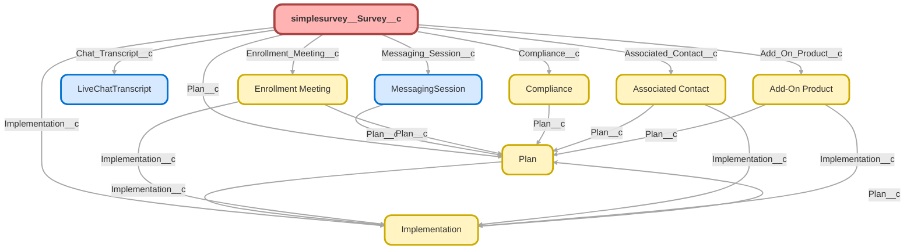

---
hide:
  - path
---

<!-- This file is auto-generated. if you do not want it to be overwritten, set TRUE in the line below -->
<!-- DO_NOT_OVERWRITE_DOC=FALSE -->

## Schema

<!-- Object description -->

## Fields

| Name      | Label | Type | Description |
| :-------- | :---- | :--: | :---------- | 
| Account_Id_18_Char__c | Account Id (18 Char) | Text | undefined |
| Acquired_Business_401k__c | Acquired Business 401k? | Picklist | Question Created by the Survey Builder |
| Acquired_Business_Employees__c | Acquired Business Employees? | Picklist | Question Created by the Survey Builder |
| Acquisition_or_Merger__c | Acquisition or Merger? | Picklist | undefined |
| Add_On_Product__c | Add-On Product | Lookup | undefined |
| AdditionalPayrollFrequency__c | Additional_Payroll_Frequency | MultiselectPicklist | Question Created by the Survey Builder |
| ADPSoftware__c | ADP_Software | Text | Question Created by the Survey Builder |
| Advisor_General_Thoughts__c | Advisor General Thoughts | TextArea | Question Created by the Survey Builder |
| Advisor_Hosting_Interest__c | Advisor Hosting Interest | Picklist | Question Created by the Survey Builder |
| Advisor_NPS__c | Advisor NPS | Picklist | Question Created by the Survey Builder |
| Advisor_Services__c | Advisor Services | TextArea | undefined |
| Advisor_UBQT_Experience__c | Advisor - UBQT Experience | MultiselectPicklist | undefined |
| Age__c | Age | Picklist | Question Created by the Survey Builder |
| Associated_Contact__c | Associated Contact | Lookup | Associated Contact associated with the Survey |
| Availability_to_Set_Up_Plan__c | Availability to Set Up Plan | Picklist | Question Created by the Survey Builder |
| BiggestChallengeToSave__c | BiggestChallengeToSave | MultiselectPicklist | undefined |
| BizIntelSOPSample__c | BizIntel_SOP_Sample | Text | undefined |
| Case_Team__c | Case Team | Text | New field to use on reports to determine case team. We should deprecate this field, it is duplicative and unhelpful |
| CertifiedNotice__c | CertifiedNotice | Picklist | Question Created by the Survey Builder |
| CertNoticeNameList__c | SendNoticeNamesList | LongTextArea | undefined |
| Chat_Transcript__c | Chat Transcript | Lookup | Chat Transcript associated with the Survey |
| City__c | Physical City | Text | undefined |
| Commission_Bonus_Variable_Frequency__c | Commission Bonus Variable Frequency | MultiselectPicklist | undefined |
| Commissions_Bonus_Variable_Pay__c | Commissions Bonus Variable Pay? | Picklist | undefined |
| Company_payroll_contact__c | Company payroll contact | TextArea | undefined |
| Compliance__c | Compliance | Lookup | Compliance associated with the Survey |
| Contact_Email__c | Contact Email | Text | undefined |
| Contact_Id_18_Char__c | Contact Id (18 Char) | Text | undefined |
| Contact_Role__c | Contact Role | Text | Contact Role of Contact related to the survey. |
| Contacttolearnmoreaboutfeedback__c | Contact_to_learn_more_about_feedback | Picklist | Question Created by the Survey Builder |
| Current_EE_500_to_1000_Hrs__c | Current EE 500 to 1,000 Hrs | Picklist | Question Created by the Survey Builder |
| Current_lawsuits__c | Current lawsuits? | Picklist | Question Created by the Survey Builder |
| Current_Payroll_Provider_Software__c | Current Payroll Provider _ Software | Picklist | undefined |
| Date_of_Acquisition__c | Date of Acquisition | Date | undefined |
| Do_you_have_any_additional_questions__c | Do you have any additional questions? | LongTextArea | undefined |
| Duplicate_Survey__c | Duplicate Survey | Checkbox | If you think this survey record is a duplicate, check this box. |
| EE_and_Owner_on_Same_Frequency__c | EE and Owner on Same Frequency? | Picklist | undefined |
| Employee_Compensation__c | Employee Compensation | MultiselectPicklist | undefined |
| Enrollment_Effectiveness__c | Enrollment Effectiveness | Picklist | undefined |
| Enrollment_Effectiveness_Calc__c | Enrollment Effectiveness Calc | Number | undefined |
| Enrollment_Meeting__c | Enrollment Meeting | Lookup | undefined |
| Enrollment_Meeting_Valuable_Info__c | Enrollment Meeting Valuable Info | LongTextArea | undefined |
| Enrollment_Missing_Info__c | Enrollment Missing Info | LongTextArea | undefined |
| EPS_2020_Annual_Contribution__c | EPS 2020 Annual Contribution? | Text | Question Created by the Survey Builder |
| EPS_Additional_Headings__c | EPS Additional Headings | Text | Question Created by the Survey Builder |
| EPS_Additional_QuestionsComments__c | EPS Additional Questions/Comments | Text | Question Created by the Survey Builder |
| EPS_Loan_Heading__c | EPS Loan Heading | Text | Question Created by the Survey Builder |
| EPS_Match_Heading__c | EPS Match Heading | Text | Question Created by the Survey Builder |
| EPS_Multiple_Payroll_Sched__c | EPS Multiple Payroll Sched | Text | Question Created by the Survey Builder |
| EPS_Off_Cycle__c | EPS Off Cycle | Text | Question Created by the Survey Builder |
| EPS_Pay_Detail_File__c | EPS Pay Detail File | Text | Question Created by the Survey Builder |
| EPS_Payroll_Provider__c | EPS Payroll Provider | Text | Question Created by the Survey Builder |
| EPS_Payroll_Schedule__c | EPS Payroll Schedule | Text | Question Created by the Survey Builder |
| EPS_PreTax_Heading__c | EPS PreTax Heading | Text | Question Created by the Survey Builder |
| EPS_Profit_Heading__c | EPS Profit Heading | Text | Question Created by the Survey Builder |
| EPS_ROTH_Heading__c | EPS ROTH Heading | Text | Question Created by the Survey Builder |
| EPS_Safe_Harbor_Heading__c | EPS Safe Harbor Heading | Text | Question Created by the Survey Builder |
| EPS_Salary_Header__c | EPS Salary Header | Text | Question Created by the Survey Builder |
| EPS_Service_Hour_Heading__c | EPS Service Hour Heading | Text | Question Created by the Survey Builder |
| EPSO_2nd_payroll_next_check_date__c | 2nd payroll next check date | Date | undefined |
| EPSO_2nd_Payroll_Schedule__c | 2nd Payroll Schedule | Picklist | undefined |
| EPSO_3rd_payroll_next_check_date__c | 3rd payroll next check date | Date | undefined |
| EPSO_3rd_payroll_schedule__c | 3rd payroll schedule | Picklist | undefined |
| EPSO_Discretionary_funding_frequency__c | Discretionary funding frequency | Picklist | Question Created by the Survey Builder |
| EPSO_Discretionary_Match_deductions__c | Discretionary Match deductions | Text | undefined |
| EPSO_Employee_detail_report__c | Employee detail report | Text | Question Created by the Survey Builder |
| EPSO_Employee_Hours__c | Employee Hours | Text | Question Created by the Survey Builder |
| EPSO_Field_naming_convention_integrity__c | Field naming convention integrity | Picklist | Question Created by the Survey Builder |
| EPSO_Gross_Earnings__c | Gross Earnings | Text | Question Created by the Survey Builder |
| EPSO_Loan_deductions__c | Loan deductions | Text | Question Created by the Survey Builder |
| EPSO_Next_payroll_check_date__c | Next payroll check date | Date | Question Created by the Survey Builder |
| EPSO_OffCycle_payroll__c | Off-Cycle payroll | Picklist | undefined |
| EPSO_OffCycle_payroll_notification__c | Off-Cycle payroll notification | Picklist | undefined |
| EPSO_Payroll_report_name__c | Payroll report name | Text | Question Created by the Survey Builder |
| EPSO_Pretax_catch_up_deductions__c | Pretax catch up deductions | Text | Question Created by the Survey Builder |
| EPSO_Pretax_deductions__c | Pretax deductions | Text | Question Created by the Survey Builder |
| EPSO_Profit_Sharing_deductions__c | Profit Sharing deductions | Text | undefined |
| EPSO_Profit_Sharing_in_payroll__c | Profit Sharing in payroll | Picklist | Question Created by the Survey Builder |
| EPSO_ROTH_catch_up_deductions__c | ROTH catch up deductions | Text | Question Created by the Survey Builder |
| EPSO_ROTH_deductions__c | ROTH deductions | Text | Question Created by the Survey Builder |
| EPSO_Safe_Harbor_deductions__c | Safe Harbor deductions | Text | undefined |
| EPSO_Safe_Harbor_funding_frequency__c | Safe Harbor funding frequency | Picklist | Question Created by the Survey Builder |
| Fee_Structures_Preference__c | Fee Structures Preference | Picklist | undefined |
| FindEmployees__c | FindEmployeesCertifiedNotices | Picklist | undefined |
| ForceOutThresholdChange__c | ForceOutThresholdChange | Picklist | undefined |
| FreeFormFeedback__c | FreeFormFeedback | LongTextArea | Question Created by the Survey Builder |
| Government_Agency__c | Government Agency? | Picklist | Question Created by the Survey Builder |
| Helpful_Chat__c | Helpful Chat | Number | undefined |
| How_to_Improve_Chat__c | How to Improve Chat | LongTextArea | undefined |
| How_to_improve_experience__c | How to improve experience | TextArea | undefined |
| How_to_Improve_to_5_Stars__c | How to Improve to 5 Stars? | MultiselectPicklist | For Verbal CSAT scores of 1, 2, or 3, please ask how we can improve and indicate closes/most applicable answer here |
| Implementation__c | Implementation | Lookup | Implementation associated with the Survey |
| Internal_Payroll_Contact__c | Internal Payroll Contact | TextArea | undefined |
| Knowledge_Rating__c | Knowledge Rating | Number | undefined |
| Kotapay_Bank_outside_US__c | Kotapay - Bank outside US? | Picklist | Question Created by the Survey Builder |
| Kotapay_CBD_Hemp_THC__c | Kotapay - CBD, Hemp, THC? | Picklist | Question Created by the Survey Builder |
| Kotapay_Company_Name__c | Kotapay - Company Name | Text | undefined |
| Kotapay_Company_name_at_bank__c | Kotapay - Company name at bank | Text | Question Created by the Survey Builder |
| Kotapay_ControlAffiliated_Group__c | Kotapay - Control/Affiliated Group? | Picklist | Question Created by the Survey Builder |
| Kotapay_Describe_CBDHempTHC__c | Kotapay - Describe CBD,Hemp,THC | Text | undefined |
| Kotapay_Funding_and_Payroll_info__c | Kotapay - Funding and Payroll info | Picklist | Question Created by the Survey Builder |
| Kotapay_Last_Distribution_Date__c | Kotapay - Last Distribution Date | Date | undefined |
| Kotapay_Other_Plan_Type__c | Kotapay - Other Plan Type | Text | undefined |
| Kotapay_Other_Sponsored_Plan__c | Kotapay - Other Sponsored Plan | Text | Question Created by the Survey Builder |
| Kotapay_Owner_Names__c | Kotapay - Owner Names | TextArea | undefined |
| Kotapay_Previous_plan_close_last_year__c | Kotapay - Previous plan close last year? | Picklist | undefined |
| Kotapay_Prior_Retirement_Plan__c | Kotapay - Prior Retirement Plan | Picklist | Question Created by the Survey Builder |
| Kotapay_Products_Services_Offered__c | Kotapay - Products Services Offered | Text | Question Created by the Survey Builder |
| Kotapay_Sponsoring_Other_Plan__c | Kotapay - Sponsoring Other Plan | Picklist | Question Created by the Survey Builder |
| Kotapay_Years_in_business__c | Kotapay - Years in business | Number | undefined |
| Legal_Proceeding_Detail__c | Legal Proceeding Detail | Picklist | undefined |
| Less_than_1000_hrs_on_census__c | Less than 1000 hrs on census | Picklist | undefined |
| Log_In_Frequency__c | Log In Frequency | Picklist | Question Created by the Survey Builder |
| LookupNamesList__c | LookupNamesList | LongTextArea | undefined |
| LookUpNumberofEmployees__c | LookUpCount | Number | undefined |
| Messaging_Session__c | Messaging Session | Lookup | Messaging Session associated with the Survey. |
| Mobile_for_Text_Msg__c | Mobile for Text Msg | Phone | undefined |
| Navigation_Ease__c | Navigation Ease | Number | undefined |
| NewQuestion__c | New_Question | Picklist | Question Created by the Survey Builder |
| Newsletter_improving__c | Newsletter improving | TextArea | Question Created by the Survey Builder |
| Newsletter_Satisfaction__c | Newsletter Satisfaction | Picklist | Question Created by the Survey Builder |
| Newsletter_Topics__c | Newsletter Topics | MultiselectPicklist | Question Created by the Survey Builder |
| Not_at_all_prepared_details__c | Not at all prepared details | LongTextArea | undefined |
| Not_Prepared_Detail__c | Not Prepared Detail | LongTextArea | undefined |
| NPS__c | NPS | Picklist | undefined |
| NPS_Detractor__c | NPS Detractor | Number | Flags NPS Survey as Detractor for use with overall NPS Calc - https://www.getfeedback.com/resources/salesforce/measure-nps-salesforce/ |
| NPS_Number__c | NPS Number | Number | Formula to convert NPS Picklist values of 1-10 to numeric value 1-10 for reporting functions/formulas |
| NPS_Passive__c | NPS Passive | Number | Flags NPS Survey as Passive for use with overall NPS Calc - https://www.getfeedback.com/resources/salesforce/measure-nps-salesforce/ |
| NPS_Promoter__c | NPS Promoter | Number | Flags NPS Survey as Promoter for use with overall NPS Calc - https://www.getfeedback.com/resources/salesforce/measure-nps-salesforce/ |
| NPS_Reason__c | NPS Reason | TextArea | undefined |
| NPS_Score__c | NPS Score | Number | undefined |
| Online_Portal_Effort_Score__c | Online Portal Effort Score | Number | undefined |
| Other__c | Other | LongTextArea | undefined |
| Other_payroll_provider__c | "Other" payroll provider | Text | undefined |
| Other_Payroll_ProviderSoftware__c | "Other" Payroll Provider/Software | Text | undefined |
| Overall_Satisfaction__c | Overall Satisfaction | Picklist | Question Created by the Survey Builder |
| Owner_Role__c | Survey Owner Role | Text | undefined |
| Ownership_Information__c | Ownership Information | TextArea | Question Created by the Survey Builder |
| Part_Time_EE_on_Census__c | Part Time EE on Census | Picklist | Question Created by the Survey Builder |
| PartTime_between_500_and_1000__c | Part-Time between 500 and 1000 | Picklist | Question Created by the Survey Builder |
| Past_Due_Payroll_COVID_Other__c | Past Due Payroll COVID "Other" | TextArea | undefined |
| Past_Due_Payroll_Reason_COVID__c | Past Due Payroll Reason COVID | Picklist | undefined |
| Payroll_Frequencies__c | Payroll Frequencies | MultiselectPicklist | undefined |
| Payroll_Provider_Contact__c | Payroll Provider Contact | Text | Question Created by the Survey Builder |
| PayrollFrequencyCount__c | Payroll_Frequency_Count | Number | Question Created by the Survey Builder |
| Physical_Street__c | Physical Street | Text | Question Created by the Survey Builder |
| Plan__c | Plan | Lookup | The Plan the CSAT is linked to |
| Plan_Id_18_Char__c | Plan Id (18 Char) | Text | undefined |
| Plan_Sponsor_or_Employee__c | Plan Sponsor or Employee | Picklist | Question Created by the Survey Builder |
| PrimaryPayrollFrequency__c | Primary_Payroll_Frequency | Picklist | Question Created by the Survey Builder |
| Publicly_Traded__c | Publicly Traded? | Picklist | Question Created by the Survey Builder |
| Remove_Hrs_Requirement__c | Remove Hrs Requirement | Picklist | undefined |
| Replacement_Option__c | Replacement Option | Picklist | Question Created by the Survey Builder |
| Requested_toolsresources__c | Requested tools/resources | MultiselectPicklist | undefined |
| Sales_Advisor_Prep__c | Sales Advisor Prep | Picklist | Question Created by the Survey Builder |
| Satisfaction_with_UBQT_Platform__c | Satisfaction with UBQT Platform | Picklist | Question Created by the Survey Builder |
| Seasonal_EE_5001000_hrs__c | Seasonal EE 500-1,000 hrs | Picklist | Question Created by the Survey Builder |
| SendNoticeCount__c | SendNoticeCount | Number | undefined |
| SingleK_Features__c | SingleK Features | MultiselectPicklist | Question Created by the Survey Builder |
| Somewhat_Prepared_Details__c | Somewhat Prepared Details | LongTextArea | undefined |
| SponsorTrustee__c | Sponsor_Trustee | Picklist | undefined |
| State__c | Physical State | Picklist | undefined |
| Stock_or_Asset_Acquisition__c | Stock or Asset Acquisition? | Picklist | Question Created by the Survey Builder |
| Street_Address__c | Street Address | TextArea | undefined |
| Survey_Score_Reason__c | Survey Score Reason | Picklist | Why did they give us the score they did? |
| Survey_Type__c | Survey Type | Picklist | This describes the type of survey completed |
| Surveys__c | Surveys | Number | Power of One Formula |
| Team__c | Team | Text | undefined |
| test__c | test | Number | undefined |
| Test2__c | Test2 | Picklist | undefined |
| Text_Notification_Interest__c | Text Notification Interest | Picklist | Question Created by the Survey Builder |
| Text_opt_in__c | Text opt in | Picklist | undefined |
| Ticker_Symbol__c | Ticker Symbol | Text | undefined |
| Training_contact_email__c | Payroll contact email | Email | Question Created by the Survey Builder |
| Training_contact_experience__c | Payroll contact experience | Picklist | Question Created by the Survey Builder |
| Training_contact_name__c | Payroll contact name | Text | undefined |
| Training_contact_phone__c | Payroll contact phone | Phone | Question Created by the Survey Builder |
| Ubiquity_Experience__c | Ubiquity Experience | MultiselectPicklist | undefined |
| Ubiquity_Experience_Other__c | Ubiquity Experience "Other" | TextArea | undefined |
| UBQTFindSendNotices__c | UBQTFindSendNotices | Picklist | undefined |
| Unsubscribe_mobile_number__c | Unsubscribe mobile number | Phone | Question Created by the Survey Builder |
| VBALX_Replacement_Name__c | VBALX Replacement Name | Text | undefined |
| VBALX_Replacement_Ticker__c | VBALX Replacement Ticker | Text | undefined |
| Verbal_CSAT__c | Verbal CSAT | Picklist | 1. Very Unsatisfied 2. Unsatisfied 3. Neutral 4. Satisfied 5. Very Satisfied Declined = We asked but client didn't want to say |
| Was_Your_Item_Addressed__c | Was Your Item Addressed? | Picklist | Question Created by the Survey Builder |
| What_Would_I_Change__c | What Would I Change | TextArea | undefined |
| When_will_saving_start__c | When will saving start? | Picklist | Question Created by the Survey Builder |
| Why_5_Stars__c | Why 5 Stars? | MultiselectPicklist | Select the reason(s) why the client gave us a 5 star CSAT |
| Why5CSAT__c | Why5CSAT | LongTextArea | undefined |
| Would_you_use_chat_again__c | Would you use chat again? | Picklist | Question Created by the Survey Builder |
| Written_CSAT__c | Written CSAT | Picklist | undefined |
| X14CSAT_Improve__c | 1-4CSAT Improve | LongTextArea | undefined |
| X1kto5kincrease__c | 1kto5kincrease | Picklist | undefined |
| X401k_Experience__c | 401k Experience | Picklist | undefined |
| X500_hours_but_less_than_100__c | 500 hours but less than 100 | Picklist | Question Created by the Survey Builder |
| Zip__c | Physical Zip | Text | undefined |

## Validation Rules

| Rule      | Active | Description | Formula |
| :-------- | :---- | :---------- | :------ |
| How_to_Improve_to_5_Stars | Yes | Requires "How to Improve" value if VerbalCSAT is 1, 2, 3 or 4 | ISBLANK(How_to_Improve_to_5_Stars__c) && ( ISPICKVAL( Verbal_CSAT__c , "1")      ISPICKVAL( Verbal_CSAT__c , "2")     ISPICKVAL( Verbal_CSAT__c , "3")     ISPICKVAL( Verbal_CSAT__c , "4")) |
| Verbal_CSAT_Survey_Comments | Yes | Required Survey Comments unless the Survey is "Declined" | ISBLANK( simplesurvey__Survey_Comments__c ) && ( ISPICKVAL( Verbal_CSAT__c , "1")      ISPICKVAL( Verbal_CSAT__c , "2")     ISPICKVAL( Verbal_CSAT__c , "3")     ISPICKVAL( Verbal_CSAT__c , "4")     ISPICKVAL( Verbal_CSAT__c , "5")) |
| Why_5_Stars | Yes | Requires "Why 5 Stars" value if VerbalCSAT is 5 | ISBLANK( Why_5_Stars__c ) && ISPICKVAL( Verbal_CSAT__c , "5") |

## Related Flows

| Object | Name      | Type | Description |
| :----  | :-------- | :--: | :---------- | 
| 💻 | [Monthly_Metrics_Autolaunched_Create_Monthly_Metric_Records](../flows/Monthly_Metrics_Autolaunched_Create_Monthly_Metric_Records.md) [🕒](../flows/Monthly_Metrics_Autolaunched_Create_Monthly_Metric_Records-history.md) |  Auto Launched Flow | <!-- --> |
| simplesurvey__Survey__c | [Compliance_ForceDist_Case_Subcat_Set](../flows/Compliance_ForceDist_Case_Subcat_Set.md) [🕒](../flows/Compliance_ForceDist_Case_Subcat_Set-history.md) |  Workflow | Sets Subcategory of Force Out Distribution Cases When A Survey Is Received |
| simplesurvey__Survey__c | [Implementations_Kotapay_Survey](../flows/Implementations_Kotapay_Survey.md) [🕒](../flows/Implementations_Kotapay_Survey-history.md) |  Workflow | Updates Implementation Date Field "Kotapay Survey Complete" |
| simplesurvey__Survey__c | [Most_Recent_CSAT_Population](../flows/Most_Recent_CSAT_Population.md) [🕒](../flows/Most_Recent_CSAT_Population-history.md) |  Workflow | Used to Populate most recent Survey Score Score on Plan |
| simplesurvey__Survey__c | [Payroll_EPS_Survey](../flows/Payroll_EPS_Survey.md) [🕒](../flows/Payroll_EPS_Survey-history.md) |  Workflow | Updates EPS Object with Survey Answers |
| simplesurvey__Survey__c | [Simple_Survey_After_Save_Low_CSAT_Auto_Reply](../flows/Simple_Survey_After_Save_Low_CSAT_Auto_Reply.md) [🕒](../flows/Simple_Survey_After_Save_Low_CSAT_Auto_Reply-history.md) |  Record After Save | Updated email template used for 5 star reply |
| simplesurvey__Survey__c | [Support_Case_Resolution_CSAT](../flows/Support_Case_Resolution_CSAT.md) [🕒](../flows/Support_Case_Resolution_CSAT-history.md) |  Workflow | Populate CSAT Score from Survey Object to Case Object when survey is complete |
| simplesurvey__Survey__c | [Survey](../flows/Survey.md) [🕒](../flows/Survey-history.md) |  Workflow | Moves picklist of verbal CSAT to Survey Score Number |
| simplesurvey__Survey__c | [Survey_After_Save_Push_Score_to_Plan](../flows/Survey_After_Save_Push_Score_to_Plan.md) [🕒](../flows/Survey_After_Save_Push_Score_to_Plan-history.md) |  Record After Save | Pushes CSAT and NPS scores to plan if they're more recent than what's currently on plan. |
| simplesurvey__Survey__c | [Survey_Before_Save_Master_Flow](../flows/Survey_Before_Save_Master_Flow.md) [🕒](../flows/Survey_Before_Save_Master_Flow-history.md) |  Record Before Save | Performs updates / checks that can't be filtered w/ entry criteria  - Sets survey type - Sets nps field |
| simplesurvey__Survey__c | [Survey_Case_Plan_into_Survey](../flows/Survey_Case_Plan_into_Survey.md) [🕒](../flows/Survey_Case_Plan_into_Survey-history.md) |  Workflow | For Surveys from Cases, copy Plan linked to Case into Survey |
| simplesurvey__Survey__c | [Survey_Force_Dist_Request](../flows/Survey_Force_Dist_Request.md) [🕒](../flows/Survey_Force_Dist_Request-history.md) |  Workflow | Creates Case for Distribution team when new Force Dist Survey is completed |
| simplesurvey__Survey__c | [Survey_Last_Created_Survey_Date](../flows/Survey_Last_Created_Survey_Date.md) [🕒](../flows/Survey_Last_Created_Survey_Date-history.md) |  Workflow | 1) Last Survey Date 2) Fatigue Warning ON 3) Fatigue Warning Off in 60 Days |
| simplesurvey__Survey__c | [Survey_Most_Recent_Surveyy_Score_Population_Creation](../flows/Survey_Most_Recent_Surveyy_Score_Population_Creation.md) [🕒](../flows/Survey_Most_Recent_Surveyy_Score_Population_Creation-history.md) |  Workflow | Populates Survey Scores on Plan on Creation |
| simplesurvey__Survey__c | [Survey_Past_Due_Payroll](../flows/Survey_Past_Due_Payroll.md) [🕒](../flows/Survey_Past_Due_Payroll-history.md) |  Workflow | Updates Past Due Payroll cases when survey response is received |
| simplesurvey__Survey__c | [Survey_Physical_Address_Update](../flows/Survey_Physical_Address_Update.md) [🕒](../flows/Survey_Physical_Address_Update-history.md) |  Workflow | Update physical address from survey to account |
| simplesurvey__Survey__c | [Survey_Survey_Type](../flows/Survey_Survey_Type.md) [🕒](../flows/Survey_Survey_Type-history.md) |  Workflow | Define "Survey Type" based on Survey Record Type |
| simplesurvey__Survey__c | [Survey_VBALX_Update](../flows/Survey_VBALX_Update.md) [🕒](../flows/Survey_VBALX_Update-history.md) |  Workflow | VBALX Fund update request sent via survey |

## Related Apex Classes

| Apex Class | Type |
| :----      | :--: | 
| [AccountClientSentimentBatch](../apex/AccountClientSentimentBatch.md) | Batch |
| [AccountClientSentimentBatch_TEST](../apex/AccountClientSentimentBatch_TEST.md) | Test |

## Related Lightning Pages

| Lightning Page | Type |
| :----      | :--: | 
| [Survey_Record_Page](../pages/Survey_Record_Page.md) |  Record Page |

## Related Profiles

| Profile | User License |
| :----      | :--: | 
| [Admin](../profiles/Admin.md) |  Salesforce |
| [Analytics Cloud Integration User](../profiles/Analytics%20Cloud%20Integration%20User.md) |  Analytics  Cloud  Integration  User |
| [Analytics Cloud Security User](../profiles/Analytics%20Cloud%20Security%20User.md) |  Analytics  Cloud  Integration  User |
| [Anypoint Integration](../profiles/Anypoint%20Integration.md) |  Identity |
| [B2BMA Integration User](../profiles/B2BMA%20Integration%20User.md) |  B2 B M A  Integration  User |
| [Billing User](../profiles/Billing%20User.md) |  Salesforce |
| [Bot Profile](../profiles/Bot%20Profile.md) |  Salesforce |
| [Business Development](../profiles/Business%20Development.md) |  Salesforce |
| [Call Center](../profiles/Call%20Center.md) |  Salesforce |
| [Chatter External User](../profiles/Chatter%20External%20User.md) |  Chatter  External |
| [Chatter Free User](../profiles/Chatter%20Free%20User.md) |  Chatter  Free |
| [Chatter Moderator User](../profiles/Chatter%20Moderator%20User.md) |  Chatter  Free |
| [Client Onboarding - Admin](../profiles/Client%20Onboarding%20-%20Admin.md) |  Salesforce |
| [Client Onboarding - RM](../profiles/Client%20Onboarding%20-%20RM.md) |  Salesforce |
| [Client Servicing Team](../profiles/Client%20Servicing%20Team.md) |  Salesforce |
| [Compliance Manager](../profiles/Compliance%20Manager.md) |  Salesforce |
| [ContractManager](../profiles/ContractManager.md) |  Salesforce |
| [Director of Operations](../profiles/Director%20of%20Operations.md) |  Salesforce |
| [Director of Sales](../profiles/Director%20of%20Sales.md) |  Salesforce |
| [Distributions](../profiles/Distributions.md) |  Salesforce |
| [Einstein Agent User](../profiles/Einstein%20Agent%20User.md) |  Einstein  Agent |
| [ESW_Agentforce_MIAW_1748035300267 Profile](../profiles/ESW_Agentforce_MIAW_1748035300267%20Profile.md) |  Guest  User  License |
| [ESW_Agentforce_MIAW_1748385215843 Profile](../profiles/ESW_Agentforce_MIAW_1748385215843%20Profile.md) |  Guest  User  License |
| [ESW_CE_Chat_1692890394498 Profile](../profiles/ESW_CE_Chat_1692890394498%20Profile.md) |  Guest  User  License |
| [ESW_CE_Chat_Moe_1693182845676 Profile](../profiles/ESW_CE_Chat_Moe_1693182845676%20Profile.md) |  Guest  User  License |
| [ESW_Login_Help_1697133738638 Profile](../profiles/ESW_Login_Help_1697133738638%20Profile.md) |  Guest  User  License |
| [ESW_Login_Help_Simply_1700075140889 Profile](../profiles/ESW_Login_Help_Simply_1700075140889%20Profile.md) |  Guest  User  License |
| [ESW_Omni_Messaging_1694183770479 Profile](../profiles/ESW_Omni_Messaging_1694183770479%20Profile.md) |  Guest  User  License |
| [ESW_Omni_Messaging_CO_1696448547822 Profile](../profiles/ESW_Omni_Messaging_CO_1696448547822%20Profile.md) |  Guest  User  License |
| [ESW_Omni_Messaging_Sallus_1700075448386 Profile](../profiles/ESW_Omni_Messaging_Sallus_1700075448386%20Profile.md) |  Guest  User  License |
| [ESW_Omni_Messaging_Simply_1700076370188 Profile](../profiles/ESW_Omni_Messaging_Simply_1700076370188%20Profile.md) |  Guest  User  License |
| [ESW_QA_Login_1699666348585 Profile](../profiles/ESW_QA_Login_1699666348585%20Profile.md) |  Guest  User  License |
| [ESW_QA_Messaging_1699974036493 Profile](../profiles/ESW_QA_Messaging_1699974036493%20Profile.md) |  Guest  User  License |
| [ESW_Sales_Chat_1697460991337 Profile](../profiles/ESW_Sales_Chat_1697460991337%20Profile.md) |  Guest  User  License |
| [ESW_Sallus_Login_Chat_1700072925200 Profile](../profiles/ESW_Sallus_Login_Chat_1700072925200%20Profile.md) |  Guest  User  License |
| [External Apps Login User](../profiles/External%20Apps%20Login%20User.md) |  External  Apps  Login |
| [Finance Manager Lightning](../profiles/Finance%20Manager%20Lightning.md) |  Salesforce |
| [Guest License User](../profiles/Guest%20License%20User.md) |  Guest  User  License |
| [Help Center Profile](../profiles/Help%20Center%20Profile.md) |  Guest  User  License |
| [Identity User](../profiles/Identity%20User.md) |  Identity |
| [Incoming_SMS Profile](../profiles/Incoming_SMS%20Profile.md) |  Guest  User  License |
| [IT](../profiles/IT.md) |  Salesforce |
| [Leadership Lightning](../profiles/Leadership%20Lightning.md) |  Salesforce |
| [Leadership](../profiles/Leadership.md) |  Salesforce |
| [Learning %26 Development](../profiles/Learning%20%2526%20Development.md) |  Salesforce |
| [Lightning Client Onboarding](../profiles/Lightning%20Client%20Onboarding.md) |  Salesforce |
| [Lightning Compliance](../profiles/Lightning%20Compliance.md) |  Salesforce |
| [Lightning Saver User](../profiles/Lightning%20Saver%20User.md) |  Salesforce |
| [Lightning Service Manager](../profiles/Lightning%20Service%20Manager.md) |  Salesforce |
| [Lightning Service User](../profiles/Lightning%20Service%20User.md) |  Salesforce |
| [Marketing Team](../profiles/Marketing%20Team.md) |  Salesforce |
| [MarketingProfile](../profiles/MarketingProfile.md) |  Salesforce |
| [Master Administrator](../profiles/Master%20Administrator.md) |  Salesforce |
| [Minimum Access - API Only Integrations](../profiles/Minimum%20Access%20-%20API%20Only%20Integrations.md) |  Salesforce  Integration |
| [Minimum Access - Salesforce](../profiles/Minimum%20Access%20-%20Salesforce.md) |  Salesforce |
| [myubiquity Profile](../profiles/myubiquity%20Profile.md) |  Guest  User  License |
| [Operations VP](../profiles/Operations%20VP.md) |  Salesforce |
| [Operations](../profiles/Operations.md) |  Salesforce |
| [Paradigm Help Center Profile](../profiles/Paradigm%20Help%20Center%20Profile.md) |  Guest  User  License |
| [Payroll Koncierge](../profiles/Payroll%20Koncierge.md) |  Salesforce |
| [Payroll Team](../profiles/Payroll%20Team.md) |  Salesforce |
| [People %26 Culture](../profiles/People%20%2526%20Culture.md) |  Salesforce |
| [Pre-chat Site Profile](../profiles/Pre-chat%20Site%20Profile.md) |  Guest  User  License |
| [Product Innovation Leadership](../profiles/Product%20Innovation%20Leadership.md) |  Salesforce |
| [Product Innovation User](../profiles/Product%20Innovation%20User.md) |  Salesforce |
| [PSM Team](../profiles/PSM%20Team.md) |  Salesforce |
| [R%26W](../profiles/R%2526W.md) |  Salesforce |
| [Read Only](../profiles/Read%20Only.md) |  Salesforce |
| [Sales Administrator](../profiles/Sales%20Administrator.md) |  Salesforce |
| [Sales Coordinator](../profiles/Sales%20Coordinator.md) |  Salesforce |
| [Sales Insights Integration User](../profiles/Sales%20Insights%20Integration%20User.md) |  Sales  Insights  Integration  User |
| [Sales Team - Limited](../profiles/Sales%20Team%20-%20Limited.md) |  Salesforce |
| [Sales Team](../profiles/Sales%20Team.md) |  Salesforce |
| [Salesforce API Only System Integrations](../profiles/Salesforce%20API%20Only%20System%20Integrations.md) |  Salesforce  Integration |
| [SalesforceIQ Integration User](../profiles/SalesforceIQ%20Integration%20User.md) |  Salesforce I Q  Integration  User |
| [Saver Manager](../profiles/Saver%20Manager.md) |  Salesforce |
| [Simple Survey Profile](../profiles/Simple%20Survey%20Profile.md) |  Guest  User  License |
| [Simply Help Center Profile](../profiles/Simply%20Help%20Center%20Profile.md) |  Guest  User  License |
| [SolutionManager](../profiles/SolutionManager.md) |  Salesforce |
| [Standard](../profiles/Standard.md) |  Salesforce |
| [StandardAul](../profiles/StandardAul.md) |  Salesforce  Platform |
| [Super System Administrator](../profiles/Super%20System%20Administrator.md) |  Salesforce |
| [Sys Dev Admin](../profiles/Sys%20Dev%20Admin.md) |  Salesforce |
| [Transitions Team](../profiles/Transitions%20Team.md) |  Salesforce |
| [Ubiquity Help Center Profile](../profiles/Ubiquity%20Help%20Center%20Profile.md) |  Guest  User  License |
| [Zoom Webhooks Profile](../profiles/Zoom%20Webhooks%20Profile.md) |  Guest  User  License |

## Related Permission Sets

| Permission Set | User License |
| :----      | :--: | 
| [Attachments_and_Notes_Migrator](../permissionsets/Attachments_and_Notes_Migrator.md) | None |
| [Data_Loader](../permissionsets/Data_Loader.md) | None |
| [Developer](../permissionsets/Developer.md) | None |
| [MagicMover](../permissionsets/MagicMover.md) | None |
| [Manager](../permissionsets/Manager.md) | None |
| [Master](../permissionsets/Master.md) | None |
| [Modify_All](../permissionsets/Modify_All.md) | None |
| [sfdcInternalInt__sfdc_a360_sfcrm_data_extract](../permissionsets/sfdcInternalInt__sfdc_a360_sfcrm_data_extract.md) | None |
| [sfdcInternalInt__sfdc_articlerecommendations](../permissionsets/sfdcInternalInt__sfdc_articlerecommendations.md) | None |
| [sfdcInternalInt__sfdc_einsteinagent](../permissionsets/sfdcInternalInt__sfdc_einsteinagent.md) | None |
| [sfdcInternalInt__sfdc_replyrecommendations](../permissionsets/sfdcInternalInt__sfdc_replyrecommendations.md) | None |
| [sfdcInternalInt__sfdc_slack](../permissionsets/sfdcInternalInt__sfdc_slack.md) | None |
| [View_All](../permissionsets/View_All.md) | None |

_Documentation generated with [sfdx-hardis](https://sfdx-hardis.cloudity.com), by [Cloudity](https://www.cloudity.com/) & [friends](https://github.com/hardisgroupcom/sfdx-hardis/graphs/contributors)_
