# Account | Process | Anniversary Date Stamp

## Flow Diagram [(_View History_)](Account_Anniversary_Validation_Flow-history.md)

```mermaid
%% If you read this, your Markdown visualizer does not handle MermaidJS syntax.
%% - If you are in VS Code, install extension `Markdown Preview Mermaid Support` at https://marketplace.visualstudio.com/items?itemName=bierner.markdown-mermaid
%% - If you are using sfdx-hardis, try to define env variable `MERMAID_MODES=cli,docker` ,then run again the command to regenerate markdown with SVG images.
%% - If you are within mkdocs-material, define mermaid plugin in `mkdocs.yml` as described in https://squidfunk.github.io/mkdocs-material/extensions/mermaid/
%% - As a last resort, you can copy-paste this MermaidJS code into https://mermaid.live/ to see the flow diagram

flowchart TB
START(["START<br/><b>AutoLaunched Flow</b></br>"]):::startClass
click START "#general-information" "2497186619"

Assign_Sold_Date[\"🟰 <em></em><br/>Assign Sold Date"/]:::assignments
click Assign_Sold_Date "#assign_sold_date" "746488987"

Wipe_Sold_Date[\"🟰 <em></em><br/>Wipe Sold Date"/]:::assignments
click Wipe_Sold_Date "#wipe_sold_date" "1497730436"

Status_Active{"🔀 <em></em><br/>Status = Active"}:::decisions
click Status_Active "#status_active" "557980838"

Check_Status{{"🔁 <em></em><br/>Check Status"}}:::loops
click Check_Status "#check_status" "1189901301"

Get_Account[("🔍 <em></em><br/>Get Account")]:::recordLookups
click Get_Account "#get_account" "3268633547"

Get_Plans[("🔍 <em></em><br/>Get Plans")]:::recordLookups
click Get_Plans "#get_plans" "2286687751"

Update_Account[("🛠️ <em></em><br/>Update Account")]:::recordUpdates
click Update_Account "#update_account" "3012080416"

Update_Account_0[("🛠️ <em></em><br/>Update Account")]:::recordUpdates
click Update_Account_0 "#update_account_0" "731796146"

Assign_Sold_Date --> Update_Account
Wipe_Sold_Date --> Update_Account_0
Status_Active --> |"True"| Assign_Sold_Date
Status_Active --> |"False"| Check_Status
Check_Status --> |"For Each"|Status_Active
Check_Status ---> |"After Last"|Wipe_Sold_Date
Get_Account --> Get_Plans
Get_Plans --> Check_Status
Update_Account --> END_Update_Account
Update_Account_0 --> END_Update_Account_0
START -->  Get_Account
END_Update_Account(( END )):::endClass
END_Update_Account_0(( END )):::endClass


classDef actionCalls fill:#D4E4FC,color:black,text-decoration:none,max-height:100px
classDef assignments fill:#FBEED7,color:black,text-decoration:none,max-height:100px
classDef collectionProcessors fill:#F0E3FA,color:black,text-decoration:none,max-height:100px
classDef customErrors fill:#FFE9E9,color:black,text-decoration:none,max-height:100px
classDef decisions fill:#FDEAF6,color:black,text-decoration:none,max-height:100px
classDef loops fill:#FDEAF6,color:black,text-decoration:none,max-height:100px
classDef recordCreates fill:#FFF8C9,color:black,text-decoration:none,max-height:100px
classDef recordDeletes fill:#FFF8C9,color:black,text-decoration:none,max-height:100px
classDef recordLookups fill:#EDEAFF,color:black,text-decoration:none,max-height:100px
classDef recordUpdates fill:#FFF8C9,color:black,text-decoration:none,max-height:100px
classDef screens fill:#DFF6FF,color:black,text-decoration:none,max-height:100px
classDef subflows fill:#D4E4FC,color:black,text-decoration:none,max-height:100px
classDef startClass fill:#D9F2E6,color:black,text-decoration:none,max-height:100px
classDef endClass fill:#F9BABA,color:black,text-decoration:none,max-height:100px
classDef transforms fill:#FDEAF6,color:black,text-decoration:none,max-height:100px


```

<!-- Flow description -->

## General Information

|<!-- -->|<!-- -->|
|:---|:---|
|Process Type| Auto Launched Flow|
|Label|Account | Process | Anniversary Date Stamp|
|Status|Active|
|Description|Stamps Plan Sold Date onto Account to calculate Anniversary formulas|
|Interview Label|Account Anniversary Validation Flow {!$Flow.CurrentDateTime}|
| Builder Type (PM)|LightningFlowBuilder|
| Origin Builder Type (PM)|LightningFlowBuilder|
|Connector|[Get_Account](#get_account)|
|Next Node|[Get_Account](#get_account)|

## Variables

|Name|Data Type|Is Collection|Is Input|Is Output|Object Type|Description|
|:-- |:--:|:--:|:--:|:--:|:--:|:--  |
|recordId|String|⬜|✅|✅|<!-- -->|<!-- -->|

## Flow Nodes Details

### Assign_Sold_Date

|<!-- -->|<!-- -->|
|:---|:---|
|Type|Assignment|
|Label|Assign Sold Date|
|Connector|[Update_Account](#update_account)|

#### Assignments

|Assign To Reference|Operator|Value|
|:-- |:--:|:--: |
|Get_Account.Plan_Sold_Date__c| Assign|Check_Status.Plan_Sold_Date__c|

### Wipe_Sold_Date

|<!-- -->|<!-- -->|
|:---|:---|
|Type|Assignment|
|Label|Wipe Sold Date|
|Connector|[Update_Account_0](#update_account_0)|

#### Assignments

|Assign To Reference|Operator|Value|
|:-- |:--:|:--: |
|Get_Account.Plan_Sold_Date__c| Assign|<!-- -->|

### Status_Active

|<!-- -->|<!-- -->|
|:---|:---|
|Type|Decision|
|Label|Status = Active|
|Default Connector|[Check_Status](#check_status)|
|Default Connector Label|False|

#### Rule True (True)

|<!-- -->|<!-- -->|
|:---|:---|
|Connector|[Assign_Sold_Date](#assign_sold_date)|
|Condition Logic|and|

|Condition Id|Left Value Reference|Operator|Right Value|
|:-- |:-- |:--:|:--: |
|1|Check_Status.Status__c| Equal To|Active|

### Check_Status

|<!-- -->|<!-- -->|
|:---|:---|
|Type|Loop|
|Label|Check Status|
|Collection Reference|[Get_Plans](#get_plans)|
|Iteration Order|Asc|
|Next Value Connector|[Status_Active](#status_active)|
|No More Values Connector|[Wipe_Sold_Date](#wipe_sold_date)|

### Get_Account

|<!-- -->|<!-- -->|
|:---|:---|
|Type|Record Lookup|
|Object|Account|
|Label|Get Account|
|Assign Null Values If No Records Found|⬜|
|Get First Record Only|✅|
|Store Output Automatically|✅|
|Connector|[Get_Plans](#get_plans)|

#### Filters (logic: **and**)

|Filter Id|Field|Operator|Value|
|:-- |:-- |:--:|:--: |
|1|Id| Equal To|recordId|

### Get_Plans

|<!-- -->|<!-- -->|
|:---|:---|
|Type|Record Lookup|
|Object|Plan__c|
|Label|Get Plans|
|Assign Null Values If No Records Found|⬜|
|Get First Record Only|⬜|
|Store Output Automatically|✅|
|Connector|[Check_Status](#check_status)|

#### Filters (logic: **and**)

|Filter Id|Field|Operator|Value|
|:-- |:-- |:--:|:--: |
|1|Account__c| Equal To|Get_Account.Id|

### Update_Account

|<!-- -->|<!-- -->|
|:---|:---|
|Type|Record Update|
|Label|Update Account|
|Input Reference|[Get_Account](#get_account)|

### Update_Account_0

|<!-- -->|<!-- -->|
|:---|:---|
|Type|Record Update|
|Label|Update Account|
|Input Reference|[Get_Account](#get_account)|

___

_Documentation generated from branch monitoring_myubiquity by [sfdx-hardis](https://sfdx-hardis.cloudity.com), featuring [salesforce-flow-visualiser](https://github.com/toddhalfpenny/salesforce-flow-visualiser)_