# Account | Before Trigger | Update Brand

## Flow Diagram [(_View History_)](Account_Before_Trigger_Update_Brand-history.md)

```mermaid
%% If you read this, your Markdown visualizer does not handle MermaidJS syntax.
%% - If you are in VS Code, install extension `Markdown Preview Mermaid Support` at https://marketplace.visualstudio.com/items?itemName=bierner.markdown-mermaid
%% - If you are using sfdx-hardis, try to define env variable `MERMAID_MODES=cli,docker` ,then run again the command to regenerate markdown with SVG images.
%% - If you are within mkdocs-material, define mermaid plugin in `mkdocs.yml` as described in https://squidfunk.github.io/mkdocs-material/extensions/mermaid/
%% - As a last resort, you can copy-paste this MermaidJS code into https://mermaid.live/ to see the flow diagram

flowchart TB
START(["START<br/><b>AutoLaunched Flow</b></br>Type: <b> Record Before Save</b>"]):::startClass
click START "#general-information" "3309887874"

Brand_Selection{"🔀 <em></em><br/>Brand Selection"}:::decisions
click Brand_Selection "#brand_selection" "3815531461"

Update_Brand_to_Sallus[("🛠️ <em></em><br/>Update Brand to Sallus")]:::recordUpdates
click Update_Brand_to_Sallus "#update_brand_to_sallus" "1702177771"

Update_Brand_to_Simply[("🛠️ <em></em><br/>Update Brand to Simply")]:::recordUpdates
click Update_Brand_to_Simply "#update_brand_to_simply" "854097603"

Update_Brand_to_UBQT[("🛠️ <em></em><br/>Update Brand to UBQT")]:::recordUpdates
click Update_Brand_to_UBQT "#update_brand_to_ubqt" "955047747"

Update_Brand_to_UBQT_0_0_0[("🛠️ <em></em><br/>Update Brand to UBQT")]:::recordUpdates
click Update_Brand_to_UBQT_0_0_0 "#update_brand_to_ubqt_0_0_0" "130197179"

Brand_Selection --> |"UBQT"| Update_Brand_to_UBQT
Brand_Selection --> |"Sallus"| Update_Brand_to_Sallus
Brand_Selection --> |"Simply"| Update_Brand_to_Simply
Brand_Selection --> |"Default Outcome"| Update_Brand_to_UBQT_0_0_0
Update_Brand_to_Sallus --> END_Update_Brand_to_Sallus
Update_Brand_to_Simply --> END_Update_Brand_to_Simply
Update_Brand_to_UBQT --> END_Update_Brand_to_UBQT
Update_Brand_to_UBQT_0_0_0 --> END_Update_Brand_to_UBQT_0_0_0
START -->  Brand_Selection
END_Update_Brand_to_Sallus(( END )):::endClass
END_Update_Brand_to_Simply(( END )):::endClass
END_Update_Brand_to_UBQT(( END )):::endClass
END_Update_Brand_to_UBQT_0_0_0(( END )):::endClass


classDef actionCalls fill:#D4E4FC,color:black,text-decoration:none,max-height:100px
classDef assignments fill:#FBEED7,color:black,text-decoration:none,max-height:100px
classDef collectionProcessors fill:#F0E3FA,color:black,text-decoration:none,max-height:100px
classDef customErrors fill:#FFE9E9,color:black,text-decoration:none,max-height:100px
classDef decisions fill:#FDEAF6,color:black,text-decoration:none,max-height:100px
classDef loops fill:#FDEAF6,color:black,text-decoration:none,max-height:100px
classDef recordCreates fill:#FFF8C9,color:black,text-decoration:none,max-height:100px
classDef recordDeletes fill:#FFF8C9,color:black,text-decoration:none,max-height:100px
classDef recordLookups fill:#EDEAFF,color:black,text-decoration:none,max-height:100px
classDef recordUpdates fill:#FFF8C9,color:black,text-decoration:none,max-height:100px
classDef screens fill:#DFF6FF,color:black,text-decoration:none,max-height:100px
classDef subflows fill:#D4E4FC,color:black,text-decoration:none,max-height:100px
classDef startClass fill:#D9F2E6,color:black,text-decoration:none,max-height:100px
classDef endClass fill:#F9BABA,color:black,text-decoration:none,max-height:100px
classDef transforms fill:#FDEAF6,color:black,text-decoration:none,max-height:100px


```

<!-- Flow description -->

## General Information

|<!-- -->|<!-- -->|
|:---|:---|
|Object|Implementation__c|
|Process Type| Auto Launched Flow|
|Trigger Type| Record Before Save|
|Record Trigger Type| Create And Update|
|Label|Account | Before Trigger | Update Brand|
|Status|⚠️ Draft|
|Interview Label|Account | Before Trigger | Update Brand {!$Flow.CurrentDateTime}|
| Builder Type (PM)|LightningFlowBuilder|
| Canvas Mode (PM)|AUTO_LAYOUT_CANVAS|
| Origin Builder Type (PM)|LightningFlowBuilder|
|Connector|[Brand_Selection](#brand_selection)|
|Next Node|[Brand_Selection](#brand_selection)|

#### Filters (logic: **or**)

|Filter Id|Field|Operator|Value|
|:-- |:-- |:--:|:--: |
|1|Business_Unit__c| Is Null|<!-- -->|
|2|Business_Unit__c| Is Changed|✅|

## Flow Nodes Details

### Brand_Selection

|<!-- -->|<!-- -->|
|:---|:---|
|Type|Decision|
|Label|Brand Selection|
|Default Connector|[Update_Brand_to_UBQT_0_0_0](#update_brand_to_ubqt_0_0_0)|
|Default Connector Label|Default Outcome|

#### Rule UBQT (UBQT)

|<!-- -->|<!-- -->|
|:---|:---|
|Connector|[Update_Brand_to_UBQT](#update_brand_to_ubqt)|
|Condition Logic|and|

|Condition Id|Left Value Reference|Operator|Right Value|
|:-- |:-- |:--:|:--: |
|1|$Record.Business_Unit__c| Equal To|Ubiquity|
|2|$Record.Service_Option__c| Not Equal To|Starter|
|3|$Record.Service_Option__c| Not Equal To|Partner|
|4|$Record.Service_Option__c| Not Equal To|Builder|
|5|$Record.Service_Option__c| Not Equal To|Franchise|

#### Rule Sallus (Sallus)

|<!-- -->|<!-- -->|
|:---|:---|
|Connector|[Update_Brand_to_Sallus](#update_brand_to_sallus)|
|Condition Logic|1 AND (2 OR 3 OR 4 OR 5)|

|Condition Id|Left Value Reference|Operator|Right Value|
|:-- |:-- |:--:|:--: |
|1|$Record.Business_Unit__c| Equal To|Ubiquity|
|2|$Record.Service_Option__c| Equal To|Starter|
|3|$Record.Service_Option__c| Equal To|Partner|
|4|$Record.Service_Option__c| Equal To|Builder|
|5|$Record.Service_Option__c| Equal To|Franchise|

#### Rule Simply (Simply)

|<!-- -->|<!-- -->|
|:---|:---|
|Connector|[Update_Brand_to_Simply](#update_brand_to_simply)|
|Condition Logic|and|

|Condition Id|Left Value Reference|Operator|Right Value|
|:-- |:-- |:--:|:--: |
|1|$Record.Business_Unit__c| Equal To|Simply Retirement|

### Update_Brand_to_Sallus

|<!-- -->|<!-- -->|
|:---|:---|
|Type|Record Update|
|Label|Update Brand to Sallus|
|Input Reference|$Record|

#### Input Assignments

|Field|Value|
|:-- |:--: |
|Brand__c|Sallus Retirement|

### Update_Brand_to_Simply

|<!-- -->|<!-- -->|
|:---|:---|
|Type|Record Update|
|Label|Update Brand to Simply|
|Input Reference|$Record|

#### Input Assignments

|Field|Value|
|:-- |:--: |
|Brand__c|Simply Retirement|

### Update_Brand_to_UBQT

|<!-- -->|<!-- -->|
|:---|:---|
|Type|Record Update|
|Label|Update Brand to UBQT|
|Input Reference|$Record|

#### Input Assignments

|Field|Value|
|:-- |:--: |
|Brand__c|Ubiquity Retirement + Savings|

### Update_Brand_to_UBQT_0_0_0

|<!-- -->|<!-- -->|
|:---|:---|
|Type|Record Update|
|Label|Update Brand to UBQT|
|Input Reference|$Record|

#### Input Assignments

|Field|Value|
|:-- |:--: |
|Brand__c|stringValue: '' |

___

_Documentation generated from branch monitoring_myubiquity by [sfdx-hardis](https://sfdx-hardis.cloudity.com), featuring [salesforce-flow-visualiser](https://github.com/toddhalfpenny/salesforce-flow-visualiser)_