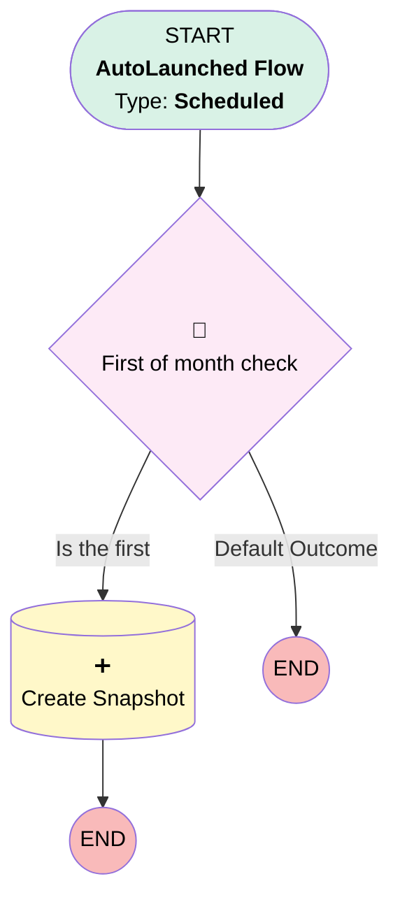

# Account Snapshot | Scheduled | Monthly Insert

## Flow Diagram [(_View History_)](Account_Snapshot_Scheduled_Monthly_Insert-history.md)

<!-- Flow description -->

## General Information

|<!-- -->|<!-- -->|
|:---|:---|
|Object|Account|
|Process Type| Auto Launched Flow|
|Trigger Type| Scheduled|
|Label|Account Snapshot | Scheduled | Monthly Insert|
|Status|Active|
|Description|Monthly creation of account snapshot records for all non inactive clients|
|Environments|Default|
|Interview Label|Account Snapshot | Scheduled | Monthly Insert {!$Flow.CurrentDateTime}|
| Builder Type (PM)|LightningFlowBuilder|
| Canvas Mode (PM)|AUTO_LAYOUT_CANVAS|
| Origin Builder Type (PM)|LightningFlowBuilder|
|Connector|[First_of_month_check](#first_of_month_check)|
|Next Node|[First_of_month_check](#first_of_month_check)|

#### Schedules

|Frequency|Start Date|Start Time|
|:-- |:--:|:--: |
|Daily|Jun 24, 2025|01:00|

#### Filters (logic: **and**)

|Filter Id|Field|Operator|Value|
|:-- |:-- |:--:|:--: |
|1|Plan_Status__c| Is Null|<!-- -->|
|2|Plan_Status__c| Not Equal To|Inactive|

## Formulas

|Name|Data Type|Expression|Description|
|:-- |:--:|:-- |:--  |
|dayOfMonth|Number|DAY({!$Flow.CurrentDate})|<!-- -->|
|hasCSAT|Boolean|NOT(ISBLANK({!$Record.CSAT_Average__c}))|<!-- -->|
|hasNPS|Boolean|NOT(ISBLANK({!$Record.NPS_Average__c}))|<!-- -->|
|hasReview|Boolean|NOT(ISBLANK({!$Record.Review_Average__c}))|<!-- -->|

## Flow Nodes Details

### First_of_month_check

|<!-- -->|<!-- -->|
|:---|:---|
|Type|Decision|
|Label|First of month check|
|Default Connector Label|Default Outcome|

#### Rule Is_the_first (Is the first)

|<!-- -->|<!-- -->|
|:---|:---|
|Connector|[Create_Snapshot](#create_snapshot)|
|Condition Logic|and|

|Condition Id|Left Value Reference|Operator|Right Value|
|:-- |:-- |:--:|:--: |
|1|dayOfMonth| Equal To|1|

### Create_Snapshot

|<!-- -->|<!-- -->|
|:---|:---|
|Type|Record Create|
|Object|Account_Snapshot__c|
|Label|Create Snapshot|
|Store Output Automatically|✅|

#### Input Assignments

|Field|Value|
|:-- |:--: |
|Account__c|$Record.Id|
|CSAT_Average__c|$Record.CSAT_Average__c|
|Client_Sentiment__c|$Record.Client_Sentiment__c|
|Has_CSAT__c|hasCSAT|
|Has_NPS__c|hasNPS|
|Has_Review__c|hasReview|
|NPS_Average__c|$Record.NPS_Average__c|
|Review_Average__c|$Record.Review_Average__c|

___

_Documentation generated from branch monitoring_myubiquity by [sfdx-hardis](https://sfdx-hardis.cloudity.com), featuring [salesforce-flow-visualiser](https://github.com/toddhalfpenny/salesforce-flow-visualiser)_