# Add-On Product | After Update | Creation Point Project Tasks

## Flow Diagram [(_View History_)](Add_On_Product_After_Update_Creation_Point_Project_Tasks-history.md)

```mermaid
%% If you read this, your Markdown visualizer does not handle MermaidJS syntax.
%% - If you are in VS Code, install extension `Markdown Preview Mermaid Support` at https://marketplace.visualstudio.com/items?itemName=bierner.markdown-mermaid
%% - If you are using sfdx-hardis, try to define env variable `MERMAID_MODES=cli,docker` ,then run again the command to regenerate markdown with SVG images.
%% - If you are within mkdocs-material, define mermaid plugin in `mkdocs.yml` as described in https://squidfunk.github.io/mkdocs-material/extensions/mermaid/
%% - As a last resort, you can copy-paste this MermaidJS code into https://mermaid.live/ to see the flow diagram

flowchart TB
START(["START<br/><b>AutoLaunched Flow</b></br>Type: <b> Record After Save</b>"]):::startClass
click START "#general-information" "3607278033"

Add_Start_Date[\"🟰 <em></em><br/>Add Start Date"/]:::assignments
click Add_Start_Date "#add_start_date" "2820063917"

Assign_to_Collection[\"🟰 <em></em><br/>Assign to Collection"/]:::assignments
click Assign_to_Collection "#assign_to_collection" "3634633528"

Assign_to_Task[\"🟰 <em></em><br/>Assign to Task"/]:::assignments
click Assign_to_Task "#assign_to_task" "1021760370"

Assign_to_Task_Current_Record_Owner_0[\"🟰 <em></em><br/>Assign to Task (Current Record Owner)"/]:::assignments
click Assign_to_Task_Current_Record_Owner_0 "#assign_to_task_current_record_owner_0" "1663313521"

Assign_to_Task_Current_Record_Owner_0_0[\"🟰 <em></em><br/>Assign to Task (Current Record Owner)"/]:::assignments
click Assign_to_Task_Current_Record_Owner_0_0 "#assign_to_task_current_record_owner_0_0" "3643657892"

Remove_Start_Date[\"🟰 <em></em><br/>Remove Start Date"/]:::assignments
click Remove_Start_Date "#remove_start_date" "1998018532"

Assign_to_Current_Record_Owner{"🔀 <em></em><br/>Assign to Current Record Owner?"}:::decisions
click Assign_to_Current_Record_Owner "#assign_to_current_record_owner" "4174810214"

Does_a_task_already_exist_0{"🔀 <em></em><br/>Does a task already exist?"}:::decisions
click Does_a_task_already_exist_0 "#does_a_task_already_exist_0" "412882297"

Does_a_task_already_exist_0_0{"🔀 <em></em><br/>Does a task already exist?"}:::decisions
click Does_a_task_already_exist_0_0 "#does_a_task_already_exist_0_0" "1145447120"

Is_Owner_a_Queue{"🔀 <em></em><br/>Is Owner a Queue?"}:::decisions
click Is_Owner_a_Queue "#is_owner_a_queue" "221232204"

Status_Upon_Creation_In_Progress{"🔀 <em></em><br/>Status Upon Creation = In Progress?"}:::decisions
click Status_Upon_Creation_In_Progress "#status_upon_creation_in_progress" "2529610023"

WBS_Exists{"🔀 <em></em><br/>WBS Exists?"}:::decisions
click WBS_Exists "#wbs_exists" "1877198031"

PD_Loop{{"🔁 <em></em><br/>PD Loop"}}:::loops
click PD_Loop "#pd_loop" "4065644321"

Create_Tasks[("➕ <em></em><br/>Create Tasks")]:::recordCreates
click Create_Tasks "#create_tasks" "3210225957"

Delete_Existing_Tasks_0[("🗑️ <em></em><br/>Delete Existing Tasks")]:::recordDeletes
click Delete_Existing_Tasks_0 "#delete_existing_tasks_0" "3762874603"

Delete_Existing_Tasks_0_0[("🗑️ <em></em><br/>Delete Existing Tasks")]:::recordDeletes
click Delete_Existing_Tasks_0_0 "#delete_existing_tasks_0_0" "1902330136"

Get_AOP_WBS[("🔍 <em></em><br/>Get AOP WBS")]:::recordLookups
click Get_AOP_WBS "#get_aop_wbs" "3499039891"

Get_Existing_Tasks_0[("🔍 <em></em><br/>Get Existing Tasks")]:::recordLookups
click Get_Existing_Tasks_0 "#get_existing_tasks_0" "1633432393"

Get_Existing_Tasks_0_0[("🔍 <em></em><br/>Get Existing Tasks")]:::recordLookups
click Get_Existing_Tasks_0_0 "#get_existing_tasks_0_0" "1373869799"

Get_Project_Deliverables[("🔍 <em></em><br/>Get Project Deliverables")]:::recordLookups
click Get_Project_Deliverables "#get_project_deliverables" "2964637491"

Add_Start_Date --> Assign_to_Collection
Assign_to_Collection --> PD_Loop
Assign_to_Task --> Status_Upon_Creation_In_Progress
Assign_to_Task_Current_Record_Owner_0 --> Status_Upon_Creation_In_Progress
Assign_to_Task_Current_Record_Owner_0_0 --> Status_Upon_Creation_In_Progress
Remove_Start_Date --> Assign_to_Collection
Assign_to_Current_Record_Owner --> |"Yes"| Is_Owner_a_Queue
Assign_to_Current_Record_Owner --> |"No"| Assign_to_Task
Does_a_task_already_exist_0 --> |"Yes, Incorrect WBS"| Delete_Existing_Tasks_0
Does_a_task_already_exist_0 --> |"No"| PD_Loop
Does_a_task_already_exist_0_0 --> |"Yes"| Delete_Existing_Tasks_0_0
Does_a_task_already_exist_0_0 --> |"No"| END_Does_a_task_already_exist_0_0
Is_Owner_a_Queue --> |"Yes"| Assign_to_Task_Current_Record_Owner_0_0
Is_Owner_a_Queue --> |"No"| Assign_to_Task_Current_Record_Owner_0
Status_Upon_Creation_In_Progress --> |"Yes"| Add_Start_Date
Status_Upon_Creation_In_Progress --> |"No"| Remove_Start_Date
WBS_Exists --> |"Yes"| Get_Project_Deliverables
WBS_Exists --> |"No"| Get_Existing_Tasks_0_0
PD_Loop --> |"For Each"|Assign_to_Current_Record_Owner
PD_Loop ---> |"After Last"|Create_Tasks
Create_Tasks --> END_Create_Tasks
Delete_Existing_Tasks_0 --> PD_Loop
Delete_Existing_Tasks_0_0 --> END_Delete_Existing_Tasks_0_0
Get_AOP_WBS --> WBS_Exists
Get_Existing_Tasks_0 --> Does_a_task_already_exist_0
Get_Existing_Tasks_0_0 --> Does_a_task_already_exist_0_0
Get_Project_Deliverables --> Get_Existing_Tasks_0
START -->  Get_AOP_WBS
END_Does_a_task_already_exist_0_0(( END )):::endClass
END_Create_Tasks(( END )):::endClass
END_Delete_Existing_Tasks_0_0(( END )):::endClass


classDef actionCalls fill:#D4E4FC,color:black,text-decoration:none,max-height:100px
classDef assignments fill:#FBEED7,color:black,text-decoration:none,max-height:100px
classDef collectionProcessors fill:#F0E3FA,color:black,text-decoration:none,max-height:100px
classDef customErrors fill:#FFE9E9,color:black,text-decoration:none,max-height:100px
classDef decisions fill:#FDEAF6,color:black,text-decoration:none,max-height:100px
classDef loops fill:#FDEAF6,color:black,text-decoration:none,max-height:100px
classDef recordCreates fill:#FFF8C9,color:black,text-decoration:none,max-height:100px
classDef recordDeletes fill:#FFF8C9,color:black,text-decoration:none,max-height:100px
classDef recordLookups fill:#EDEAFF,color:black,text-decoration:none,max-height:100px
classDef recordUpdates fill:#FFF8C9,color:black,text-decoration:none,max-height:100px
classDef screens fill:#DFF6FF,color:black,text-decoration:none,max-height:100px
classDef subflows fill:#D4E4FC,color:black,text-decoration:none,max-height:100px
classDef startClass fill:#D9F2E6,color:black,text-decoration:none,max-height:100px
classDef endClass fill:#F9BABA,color:black,text-decoration:none,max-height:100px
classDef transforms fill:#FDEAF6,color:black,text-decoration:none,max-height:100px


```

<!-- Flow description -->

## General Information

|<!-- -->|<!-- -->|
|:---|:---|
|Object|Add_On_Products__c|
|Process Type| Auto Launched Flow|
|Trigger Type| Record After Save|
|Record Trigger Type| Create And Update|
|Label|Add-On Product | After Update | Creation Point Project Tasks|
|Status|Active|
|Does Require Record Changed To Meet Criteria|✅|
|Description|Used to build Source Mapping Task when Survey is Received. Removed check for duplicate emails because it wasn't preventing other duplications. 10/7/22- Removed lookup to Opportunity.|
|Environments|Default|
|Interview Label|Add-On Product | After Update | Creation Point Project Tasks {!$Flow.CurrentDateTime}|
| Builder Type (PM)|LightningFlowBuilder|
| Canvas Mode (PM)|FREE_FORM_CANVAS|
| Origin Builder Type (PM)|LightningFlowBuilder|
|Connector|[Get_AOP_WBS](#get_aop_wbs)|
|Next Node|[Get_AOP_WBS](#get_aop_wbs)|

#### Filters (logic: **and**)

|Filter Id|Field|Operator|Value|
|:-- |:-- |:--:|:--: |
|1|Source_Mapping_Received__c| Is Null|<!-- -->|
|2|Product_Status__c| Not Equal To|Terminated Integration|
|3|Product_Status__c| Not Equal To|Stalled Setup|
|4|Product_Status__c| Not Equal To|Completed Setup|
|5|Product_Status__c| Not Equal To|On Hold|
|6|Product_Status__c| Not Equal To|Cancelled Setup|
|7|Product_Status__c| Not Equal To|Transferred to Finch|

## Variables

|Name|Data Type|Is Collection|Is Input|Is Output|Object Type|Description|
|:-- |:--:|:--:|:--:|:--:|:--:|:--  |
|End|Number|⬜|✅|✅|<!-- -->|<!-- -->|
|existingTask|SObject|⬜|✅|✅|Project_Task__c|<!-- -->|
|Milestone|String|⬜|✅|✅|<!-- -->|<!-- -->|
|Name|String|⬜|✅|✅|<!-- -->|<!-- -->|
|Order|Number|⬜|✅|✅|<!-- -->|<!-- -->|
|recordId|String|⬜|✅|✅|<!-- -->|<!-- -->|
|ResponsibleParty|String|⬜|✅|✅|<!-- -->|<!-- -->|
|SendEmailId|SObject|⬜|✅|✅|Project_Task__c|<!-- -->|
|SendEmailTask|SObject|⬜|✅|⬜|Project_Task__c|<!-- -->|
|Start|Number|⬜|✅|✅|<!-- -->|<!-- -->|
|Status|String|⬜|✅|✅|<!-- -->|<!-- -->|
|taskCollection|SObject|✅|✅|✅|Project_Task__c|<!-- -->|
|taskLoop|SObject|⬜|✅|✅|Project_Task__c|<!-- -->|
|wbs|SObject|⬜|✅|✅|Work_Breakdown_Structure__c|<!-- -->|

## Formulas

|Name|Data Type|Expression|Description|
|:-- |:--:|:-- |:--  |
|EndDate|Date|NOW()+{!End}|<!-- -->|
|ExpectedCompletion|Date|{!ExpectedStart}+{!PD_Loop.Days_to_Complete__c}|<!-- -->|
|ExpectedStart|Date|{!$Record.CreatedDate}+{!PD_Loop.Expected_Start_Days_from_Creation__c}|<!-- -->|
|StartDate|Date|NOW()+{!Start}|<!-- -->|

## Flow Nodes Details

### Add_Start_Date

|<!-- -->|<!-- -->|
|:---|:---|
|Type|Assignment|
|Label|Add Start Date|
|Connector|[Assign_to_Collection](#assign_to_collection)|

#### Assignments

|Assign To Reference|Operator|Value|
|:-- |:--:|:--: |
|taskLoop.Actual_Start_Date__c| Assign|StartDate|

### Assign_to_Collection

|<!-- -->|<!-- -->|
|:---|:---|
|Type|Assignment|
|Label|Assign to Collection|
|Connector|[PD_Loop](#pd_loop)|

#### Assignments

|Assign To Reference|Operator|Value|
|:-- |:--:|:--: |
|taskCollection| Add|taskLoop|

### Assign_to_Task

|<!-- -->|<!-- -->|
|:---|:---|
|Type|Assignment|
|Label|Assign to Task|
|Connector|[Status_Upon_Creation_In_Progress](#status_upon_creation_in_progress)|

#### Assignments

|Assign To Reference|Operator|Value|
|:-- |:--:|:--: |
|taskLoop.Name| Assign|PD_Loop.Name|
|taskLoop.Add_On_Product__c| Assign|$Record.Id|
|taskLoop.Assigned_To__c| Assign|PD_Loop.Assigned_To__c|
|taskLoop.KPI_Milestone__c| Assign|PD_Loop.KPI_Milestone__c|
|taskLoop.Responsible_Party__c| Assign|PD_Loop.Responsible_Party__c|
|taskLoop.Status__c| Assign|PD_Loop.Status_Upon_Creation__c|
|taskLoop.Order_Number__c| Assign|PD_Loop.Order_Number__c|
|taskLoop.Expected_Start_Date__c| Assign|ExpectedStart|
|taskLoop.Expected_Completion_Date__c| Assign|ExpectedCompletion|
|taskLoop.Project_Deliverable__c| Assign|PD_Loop.Id|
|taskLoop.OwnerId| Assign|PD_Loop.Assigned_To__c|
|taskLoop.RecordTypeId| Assign|0121G000000RlRgQAK|
|taskLoop.Team_Member__c| Assign|PD_Loop.Team_Member__c|

### Assign_to_Task_Current_Record_Owner_0

|<!-- -->|<!-- -->|
|:---|:---|
|Type|Assignment|
|Label|Assign to Task (Current Record Owner)|
|Connector|[Status_Upon_Creation_In_Progress](#status_upon_creation_in_progress)|

#### Assignments

|Assign To Reference|Operator|Value|
|:-- |:--:|:--: |
|taskLoop.Name| Assign|PD_Loop.Name|
|taskLoop.Add_On_Product__c| Assign|$Record.Id|
|taskLoop.Assigned_To__c| Assign|$Record.OwnerId|
|taskLoop.KPI_Milestone__c| Assign|PD_Loop.KPI_Milestone__c|
|taskLoop.Responsible_Party__c| Assign|PD_Loop.Responsible_Party__c|
|taskLoop.Status__c| Assign|PD_Loop.Status_Upon_Creation__c|
|taskLoop.Order_Number__c| Assign|PD_Loop.Order_Number__c|
|taskLoop.Expected_Start_Date__c| Assign|ExpectedStart|
|taskLoop.Expected_Completion_Date__c| Assign|ExpectedCompletion|
|taskLoop.Project_Deliverable__c| Assign|PD_Loop.Id|
|taskLoop.OwnerId| Assign|$Record.OwnerId|
|taskLoop.RecordTypeId| Assign|0121G000000RlRgQAK|
|taskLoop.Team_Member__c| Assign|PD_Loop.Team_Member__c|

### Assign_to_Task_Current_Record_Owner_0_0

|<!-- -->|<!-- -->|
|:---|:---|
|Type|Assignment|
|Label|Assign to Task (Current Record Owner)|
|Connector|[Status_Upon_Creation_In_Progress](#status_upon_creation_in_progress)|

#### Assignments

|Assign To Reference|Operator|Value|
|:-- |:--:|:--: |
|taskLoop.Name| Assign|PD_Loop.Name|
|taskLoop.Add_On_Product__c| Assign|$Record.Id|
|taskLoop.Assigned_To__c| Assign|$User.Id|
|taskLoop.KPI_Milestone__c| Assign|PD_Loop.KPI_Milestone__c|
|taskLoop.Responsible_Party__c| Assign|PD_Loop.Responsible_Party__c|
|taskLoop.Status__c| Assign|PD_Loop.Status_Upon_Creation__c|
|taskLoop.Order_Number__c| Assign|PD_Loop.Order_Number__c|
|taskLoop.Expected_Start_Date__c| Assign|ExpectedStart|
|taskLoop.Expected_Completion_Date__c| Assign|ExpectedCompletion|
|taskLoop.Project_Deliverable__c| Assign|PD_Loop.Id|
|taskLoop.OwnerId| Assign|$User.Id|
|taskLoop.RecordTypeId| Assign|0121G000000RlRgQAK|
|taskLoop.Team_Member__c| Assign|PD_Loop.Team_Member__c|

### Remove_Start_Date

|<!-- -->|<!-- -->|
|:---|:---|
|Type|Assignment|
|Label|Remove Start Date|
|Connector|[Assign_to_Collection](#assign_to_collection)|

#### Assignments

|Assign To Reference|Operator|Value|
|:-- |:--:|:--: |
|taskLoop.Actual_Start_Date__c| Assign|<!-- -->|

### Assign_to_Current_Record_Owner

|<!-- -->|<!-- -->|
|:---|:---|
|Type|Decision|
|Label|Assign to Current Record Owner?|
|Default Connector|[Assign_to_Task](#assign_to_task)|
|Default Connector Label|No|

#### Rule YesAssign (Yes)

|<!-- -->|<!-- -->|
|:---|:---|
|Connector|[Is_Owner_a_Queue](#is_owner_a_queue)|
|Condition Logic|and|

|Condition Id|Left Value Reference|Operator|Right Value|
|:-- |:-- |:--:|:--: |
|1|PD_Loop.Assign_to_Current_Owner__c| Equal To|✅|

### Does_a_task_already_exist_0

|<!-- -->|<!-- -->|
|:---|:---|
|Type|Decision|
|Label|Does a task already exist?|
|Default Connector|[PD_Loop](#pd_loop)|
|Default Connector Label|No|

#### Rule Yes_Incorrect_WBS_0 (Yes, Incorrect WBS)

|<!-- -->|<!-- -->|
|:---|:---|
|Connector|[Delete_Existing_Tasks_0](#delete_existing_tasks_0)|
|Condition Logic|and|

|Condition Id|Left Value Reference|Operator|Right Value|
|:-- |:-- |:--:|:--: |
|1|existingTask.Id| Is Null|⬜|
|2|existingTask.Work_Breakdown_Structure__c| Not Equal To|wbs.Name|

#### Rule YesExists_0 (Yes)

|<!-- -->|<!-- -->|
|:---|:---|
|Condition Logic|and|

|Condition Id|Left Value Reference|Operator|Right Value|
|:-- |:-- |:--:|:--: |
|1|existingTask.Id| Is Null|⬜|

### Does_a_task_already_exist_0_0

|<!-- -->|<!-- -->|
|:---|:---|
|Type|Decision|
|Label|Does a task already exist?|
|Default Connector Label|No|

#### Rule YesExists_0_0 (Yes)

|<!-- -->|<!-- -->|
|:---|:---|
|Connector|[Delete_Existing_Tasks_0_0](#delete_existing_tasks_0_0)|
|Condition Logic|and|

|Condition Id|Left Value Reference|Operator|Right Value|
|:-- |:-- |:--:|:--: |
|1|existingTask.Id| Is Null|⬜|

### Is_Owner_a_Queue

|<!-- -->|<!-- -->|
|:---|:---|
|Type|Decision|
|Label|Is Owner a Queue?|
|Default Connector|[Assign_to_Task_Current_Record_Owner_0](#assign_to_task_current_record_owner_0)|
|Default Connector Label|No|

#### Rule YesQueue (Yes)

|<!-- -->|<!-- -->|
|:---|:---|
|Connector|[Assign_to_Task_Current_Record_Owner_0_0](#assign_to_task_current_record_owner_0_0)|
|Condition Logic|and|

|Condition Id|Left Value Reference|Operator|Right Value|
|:-- |:-- |:--:|:--: |
|1|$Record.OwnerId| Starts With|00G|

### Status_Upon_Creation_In_Progress

|<!-- -->|<!-- -->|
|:---|:---|
|Type|Decision|
|Label|Status Upon Creation = In Progress?|
|Default Connector|[Remove_Start_Date](#remove_start_date)|
|Default Connector Label|No|

#### Rule YesInProgress (Yes)

|<!-- -->|<!-- -->|
|:---|:---|
|Connector|[Add_Start_Date](#add_start_date)|
|Condition Logic|and|

|Condition Id|Left Value Reference|Operator|Right Value|
|:-- |:-- |:--:|:--: |
|1|PD_Loop.Status_Upon_Creation__c| Equal To|In Progress|

### WBS_Exists

|<!-- -->|<!-- -->|
|:---|:---|
|Type|Decision|
|Label|WBS Exists?|
|Default Connector|[Get_Existing_Tasks_0_0](#get_existing_tasks_0_0)|
|Default Connector Label|No|

#### Rule Yes (Yes)

|<!-- -->|<!-- -->|
|:---|:---|
|Connector|[Get_Project_Deliverables](#get_project_deliverables)|
|Condition Logic|and|

|Condition Id|Left Value Reference|Operator|Right Value|
|:-- |:-- |:--:|:--: |
|1|wbs.Id| Is Null|⬜|
|2|$Record.Service_Option__c| Is Null|⬜|

### PD_Loop

|<!-- -->|<!-- -->|
|:---|:---|
|Type|Loop|
|Label|PD Loop|
|Collection Reference|[Get_Project_Deliverables](#get_project_deliverables)|
|Iteration Order|Asc|
|Next Value Connector|[Assign_to_Current_Record_Owner](#assign_to_current_record_owner)|
|No More Values Connector|[Create_Tasks](#create_tasks)|

### Create_Tasks

|<!-- -->|<!-- -->|
|:---|:---|
|Type|Record Create|
|Label|Create Tasks|
|Input Reference|taskCollection|

### Delete_Existing_Tasks_0

|<!-- -->|<!-- -->|
|:---|:---|
|Type|Record Delete|
|Object|Project_Task__c|
|Label|Delete Existing Tasks|
|Connector|[PD_Loop](#pd_loop)|

#### Filters (logic: **and**)

|Filter Id|Field|Operator|Value|
|:-- |:-- |:--:|:--: |
|1|Add_On_Product__c| Equal To|$Record.Id|

### Delete_Existing_Tasks_0_0

|<!-- -->|<!-- -->|
|:---|:---|
|Type|Record Delete|
|Object|Project_Task__c|
|Label|Delete Existing Tasks|

#### Filters (logic: **and**)

|Filter Id|Field|Operator|Value|
|:-- |:-- |:--:|:--: |
|1|Add_On_Product__c| Equal To|$Record.Id|

### Get_AOP_WBS

|<!-- -->|<!-- -->|
|:---|:---|
|Type|Record Lookup|
|Object|Work_Breakdown_Structure__c|
|Label|Get AOP WBS|
|Assign Null Values If No Records Found|✅|
|Output Assignments|- assignToReference: wbs.Id &nbsp;&nbsp;field: Id - assignToReference: wbs.Name &nbsp;&nbsp;field: Name |
|Connector|[WBS_Exists](#wbs_exists)|

#### Filters (logic: **and**)

|Filter Id|Field|Operator|Value|
|:-- |:-- |:--:|:--: |
|1|Active__c| Equal To|✅|
|2|Object_Managed__c| Equal To|Add-On Product|
|3|Service_Option__c| Contains|$Record.Service_Option__c|

### Get_Existing_Tasks_0

|<!-- -->|<!-- -->|
|:---|:---|
|Type|Record Lookup|
|Object|Project_Task__c|
|Label|Get Existing Tasks|
|Assign Null Values If No Records Found|✅|
|Output Assignments|- assignToReference: existingTask.Id &nbsp;&nbsp;field: Id - assignToReference: existingTask.Work_Breakdown_Structure__c &nbsp;&nbsp;field: Work_Breakdown_Structure__c |
|Connector|[Does_a_task_already_exist_0](#does_a_task_already_exist_0)|

#### Filters (logic: **and**)

|Filter Id|Field|Operator|Value|
|:-- |:-- |:--:|:--: |
|1|Add_On_Product__c| Equal To|$Record.Id|
|2|Project_Deliverable__c| Equal To|PD_Loop.Id|
|3|Creation_Point__c| Equal To|Source Mapping Received|

### Get_Existing_Tasks_0_0

|<!-- -->|<!-- -->|
|:---|:---|
|Type|Record Lookup|
|Object|Project_Task__c|
|Label|Get Existing Tasks|
|Assign Null Values If No Records Found|✅|
|Output Assignments|- assignToReference: existingTask.Id &nbsp;&nbsp;field: Id - assignToReference: existingTask.Work_Breakdown_Structure__c &nbsp;&nbsp;field: Work_Breakdown_Structure__c |
|Connector|[Does_a_task_already_exist_0_0](#does_a_task_already_exist_0_0)|

#### Filters (logic: **and**)

|Filter Id|Field|Operator|Value|
|:-- |:-- |:--:|:--: |
|1|Add_On_Product__c| Equal To|$Record.Id|

### Get_Project_Deliverables

|<!-- -->|<!-- -->|
|:---|:---|
|Type|Record Lookup|
|Object|Project_Deliverables__c|
|Label|Get Project Deliverables|
|Assign Null Values If No Records Found|⬜|
|Get First Record Only|⬜|
|Store Output Automatically|✅|
|Connector|[Get_Existing_Tasks_0](#get_existing_tasks_0)|

#### Filters (logic: **and**)

|Filter Id|Field|Operator|Value|
|:-- |:-- |:--:|:--: |
|1|Work_Breakdown_Structure__c| Equal To|wbs.Id|
|2|Creation_Point__c| Equal To|Source Mapping Received|

___

_Documentation generated from branch monitoring_myubiquity by [sfdx-hardis](https://sfdx-hardis.cloudity.com), featuring [salesforce-flow-visualiser](https://github.com/toddhalfpenny/salesforce-flow-visualiser)_