# Add-On Product | Before Trigger | Master Flow

## Flow Diagram [(_View History_)](Add_On_Product_Before_Trigger_Master_Flow-history.md)

```mermaid
%% If you read this, your Markdown visualizer does not handle MermaidJS syntax.
%% - If you are in VS Code, install extension `Markdown Preview Mermaid Support` at https://marketplace.visualstudio.com/items?itemName=bierner.markdown-mermaid
%% - If you are using sfdx-hardis, try to define env variable `MERMAID_MODES=cli,docker` ,then run again the command to regenerate markdown with SVG images.
%% - If you are within mkdocs-material, define mermaid plugin in `mkdocs.yml` as described in https://squidfunk.github.io/mkdocs-material/extensions/mermaid/
%% - As a last resort, you can copy-paste this MermaidJS code into https://mermaid.live/ to see the flow diagram

flowchart TB
START(["START<br/><b>AutoLaunched Flow</b></br>Type: <b> Record Before Save</b>"]):::startClass
click START "#general-information" "3429116027"

No_Start_Choice{"🔀 <em></em><br/>No-Start"}:::decisions
click No_Start_Choice "#no_start_choice" "78743836"

Service_Option_Check{"🔀 <em></em><br/>Service Option Check"}:::decisions
click Service_Option_Check "#service_option_check" "313218503"

Stalled_Choice{"🔀 <em></em><br/>Stalled"}:::decisions
click Stalled_Choice "#stalled_choice" "452245021"

Third_Party_Integrator_Choice{"🔀 <em></em><br/>Third Party Integrator"}:::decisions
click Third_Party_Integrator_Choice "#third_party_integrator_choice" "4133037604"

Vendor_Fees{"🔀 <em></em><br/>Vendor Fees"}:::decisions
click Vendor_Fees "#vendor_fees" "2378320251"

Integrator_Fees[("🛠️ <em></em><br/>Integrator Fees")]:::recordUpdates
click Integrator_Fees "#integrator_fees" "1485038514"

Intuit_Fees[("🛠️ <em></em><br/>Intuit Fees")]:::recordUpdates
click Intuit_Fees "#intuit_fees" "2579067972"

Product_Stage_No_Start[("🛠️ <em></em><br/>Product Stage = No-Start")]:::recordUpdates
click Product_Stage_No_Start "#product_stage_no_start" "4097180073"

Product_Stage_Product_Stalled[("🛠️ <em></em><br/>Product Stage = Product Stalled")]:::recordUpdates
click Product_Stage_Product_Stalled "#product_stage_product_stalled" "1690507107"

Service_Option_Direct_Integration[("🛠️ <em></em><br/>Service Option = Direct Integration")]:::recordUpdates
click Service_Option_Direct_Integration "#service_option_direct_integration" "1944880734"

Service_Option_EPS[("🛠️ <em></em><br/>Service Option = EPS")]:::recordUpdates
click Service_Option_EPS "#service_option_eps" "1328145286"

No_Start_Choice --> |"No-Start"| Product_Stage_No_Start
No_Start_Choice --> |"Default Outcome"| Third_Party_Integrator_Choice
Service_Option_Check --> |"Direct Integration"| Service_Option_Direct_Integration
Service_Option_Check --> |"EPS"| Service_Option_EPS
Service_Option_Check --> |"Default Outcome"| Stalled_Choice
Stalled_Choice --> |"Stalled"| Product_Stage_Product_Stalled
Stalled_Choice --> |"Default Outcome"| No_Start_Choice
Third_Party_Integrator_Choice --> |"Third Party Integrator"| Integrator_Fees
Third_Party_Integrator_Choice --> |"Default Outcome"| Vendor_Fees
Vendor_Fees --> |"Intuit Vendor Fees"| Intuit_Fees
Vendor_Fees --> |"Default Outcome"| END_Vendor_Fees
Integrator_Fees --> Vendor_Fees
Intuit_Fees --> END_Intuit_Fees
Product_Stage_No_Start --> Third_Party_Integrator_Choice
Product_Stage_Product_Stalled --> No_Start_Choice
Service_Option_Direct_Integration --> Stalled_Choice
Service_Option_EPS --> Stalled_Choice
START -->  Service_Option_Check
END_Vendor_Fees(( END )):::endClass
END_Intuit_Fees(( END )):::endClass


classDef actionCalls fill:#D4E4FC,color:black,text-decoration:none,max-height:100px
classDef assignments fill:#FBEED7,color:black,text-decoration:none,max-height:100px
classDef collectionProcessors fill:#F0E3FA,color:black,text-decoration:none,max-height:100px
classDef customErrors fill:#FFE9E9,color:black,text-decoration:none,max-height:100px
classDef decisions fill:#FDEAF6,color:black,text-decoration:none,max-height:100px
classDef loops fill:#FDEAF6,color:black,text-decoration:none,max-height:100px
classDef recordCreates fill:#FFF8C9,color:black,text-decoration:none,max-height:100px
classDef recordDeletes fill:#FFF8C9,color:black,text-decoration:none,max-height:100px
classDef recordLookups fill:#EDEAFF,color:black,text-decoration:none,max-height:100px
classDef recordUpdates fill:#FFF8C9,color:black,text-decoration:none,max-height:100px
classDef screens fill:#DFF6FF,color:black,text-decoration:none,max-height:100px
classDef subflows fill:#D4E4FC,color:black,text-decoration:none,max-height:100px
classDef startClass fill:#D9F2E6,color:black,text-decoration:none,max-height:100px
classDef endClass fill:#F9BABA,color:black,text-decoration:none,max-height:100px
classDef transforms fill:#FDEAF6,color:black,text-decoration:none,max-height:100px


```

<!-- Flow description -->

## General Information

|<!-- -->|<!-- -->|
|:---|:---|
|Object|Add_On_Products__c|
|Process Type| Auto Launched Flow|
|Trigger Type| Record Before Save|
|Record Trigger Type| Create And Update|
|Label|Add-On Product | Before Trigger | Master Flow|
|Status|Obsolete|
|Description|Removed the step that adds opportunity notes, that happens when Add-On is created|
|Environments|Default|
|Interview Label|Add-On Product | Before Trigger | Master Flow {!$Flow.CurrentDateTime}|
| Builder Type (PM)|LightningFlowBuilder|
| Canvas Mode (PM)|FREE_FORM_CANVAS|
| Origin Builder Type (PM)|LightningFlowBuilder|
|Connector|[Service_Option_Check](#service_option_check)|
|Next Node|[Service_Option_Check](#service_option_check)|

## Flow Nodes Details

### No_Start_Choice

|<!-- -->|<!-- -->|
|:---|:---|
|Type|Decision|
|Label|No-Start|
|Default Connector|[Third_Party_Integrator_Choice](#third_party_integrator_choice)|
|Default Connector Label|Default Outcome|

#### Rule No_Start (No-Start)

|<!-- -->|<!-- -->|
|:---|:---|
|Connector|[Product_Stage_No_Start](#product_stage_no_start)|
|Condition Logic|and|

|Condition Id|Left Value Reference|Operator|Right Value|
|:-- |:-- |:--:|:--: |
|1|$Record.No_Start_Date__c| Is Changed|✅|
|2|$Record.No_Start_Date__c| Is Null|⬜|
|3|$Record.Product_Type__c| Equal To|Annual Audit|

### Service_Option_Check

|<!-- -->|<!-- -->|
|:---|:---|
|Type|Decision|
|Label|Service Option Check|
|Default Connector|[Stalled_Choice](#stalled_choice)|
|Default Connector Label|Default Outcome|

#### Rule Direct_Integration (Direct Integration)

|<!-- -->|<!-- -->|
|:---|:---|
|Connector|[Service_Option_Direct_Integration](#service_option_direct_integration)|
|Condition Logic|and|

|Condition Id|Left Value Reference|Operator|Right Value|
|:-- |:-- |:--:|:--: |
|1|$Record.Service_Option__c| Is Null|✅|
|2|$Record.RecordType.Name| Equal To|Payroll Integration|

#### Rule EPS (EPS)

|<!-- -->|<!-- -->|
|:---|:---|
|Connector|[Service_Option_EPS](#service_option_eps)|
|Condition Logic|and|

|Condition Id|Left Value Reference|Operator|Right Value|
|:-- |:-- |:--:|:--: |
|1|$Record.Service_Option__c| Is Null|✅|
|2|$Record.RecordType.Name| Equal To|Enhanced Payroll Services|

### Stalled_Choice

|<!-- -->|<!-- -->|
|:---|:---|
|Type|Decision|
|Label|Stalled|
|Default Connector|[No_Start_Choice](#no_start_choice)|
|Default Connector Label|Default Outcome|

#### Rule Stalled (Stalled)

|<!-- -->|<!-- -->|
|:---|:---|
|Connector|[Product_Stage_Product_Stalled](#product_stage_product_stalled)|
|Condition Logic|and|

|Condition Id|Left Value Reference|Operator|Right Value|
|:-- |:-- |:--:|:--: |
|1|$Record.Product_Stall_Date__c| Is Changed|✅|
|2|$Record.Product_Stall_Date__c| Is Null|⬜|
|3|$Record.No_Start_Date__c| Is Null|✅|

### Third_Party_Integrator_Choice

|<!-- -->|<!-- -->|
|:---|:---|
|Type|Decision|
|Label|Third Party Integrator|
|Default Connector|[Vendor_Fees](#vendor_fees)|
|Default Connector Label|Default Outcome|

#### Rule Third_Party_Integrator (Third Party Integrator)

|<!-- -->|<!-- -->|
|:---|:---|
|Connector|[Integrator_Fees](#integrator_fees)|
|Condition Logic|and|

|Condition Id|Left Value Reference|Operator|Right Value|
|:-- |:-- |:--:|:--: |
|1|$Record.Third_Party_Integrator__c| Is Changed|✅|
|2|$Record.Third_Party_Integrator__c| Is Null|⬜|
|3|$Record.Third_Party_Integrator__c| Equal To|PayKonnect|

### Vendor_Fees

|<!-- -->|<!-- -->|
|:---|:---|
|Type|Decision|
|Label|Vendor Fees|
|Default Connector Label|Default Outcome|

#### Rule Intuit_Vendor_Fees (Intuit Vendor Fees)

|<!-- -->|<!-- -->|
|:---|:---|
|Does Require Record Changed To Meet Criteria|✅|
|Connector|[Intuit_Fees](#intuit_fees)|
|Condition Logic|and|

|Condition Id|Left Value Reference|Operator|Right Value|
|:-- |:-- |:--:|:--: |
|1|$Record.Payroll_Vendor__c| Equal To|Intuit/Quickbooks|

### Integrator_Fees

|<!-- -->|<!-- -->|
|:---|:---|
|Type|Record Update|
|Label|Integrator Fees|
|Input Reference|$Record|
|Connector|[Vendor_Fees](#vendor_fees)|

#### Input Assignments

|Field|Value|
|:-- |:--: |
|Third_Party_Integrator_Fees__c|numberValue: 0 |

### Intuit_Fees

|<!-- -->|<!-- -->|
|:---|:---|
|Type|Record Update|
|Label|Intuit Fees|
|Input Reference|$Record|

#### Input Assignments

|Field|Value|
|:-- |:--: |
|Payroll_Vendor_Fees__c|15|

### Product_Stage_No_Start

|<!-- -->|<!-- -->|
|:---|:---|
|Type|Record Update|
|Label|Product Stage = No-Start|
|Input Reference|$Record|
|Connector|[Third_Party_Integrator_Choice](#third_party_integrator_choice)|

#### Input Assignments

|Field|Value|
|:-- |:--: |
|Product_Status__c|No Start|

### Product_Stage_Product_Stalled

|<!-- -->|<!-- -->|
|:---|:---|
|Type|Record Update|
|Label|Product Stage = Product Stalled|
|Input Reference|$Record|
|Connector|[No_Start_Choice](#no_start_choice)|

#### Input Assignments

|Field|Value|
|:-- |:--: |
|Product_Status__c|Stalled Setup|

### Service_Option_Direct_Integration

|<!-- -->|<!-- -->|
|:---|:---|
|Type|Record Update|
|Label|Service Option = Direct Integration|
|Input Reference|$Record|
|Connector|[Stalled_Choice](#stalled_choice)|

#### Input Assignments

|Field|Value|
|:-- |:--: |
|Service_Option__c|Direct Integration|

### Service_Option_EPS

|<!-- -->|<!-- -->|
|:---|:---|
|Type|Record Update|
|Label|Service Option = EPS|
|Input Reference|$Record|
|Connector|[Stalled_Choice](#stalled_choice)|

#### Input Assignments

|Field|Value|
|:-- |:--: |
|Service_Option__c|Enhanced Payroll Service|

___

_Documentation generated from branch monitoring_myubiquity by [sfdx-hardis](https://sfdx-hardis.cloudity.com), featuring [salesforce-flow-visualiser](https://github.com/toddhalfpenny/salesforce-flow-visualiser)_