# Add-On | Scheduled | Send Auto Emails

## Flow Diagram [(_View History_)](Add_On_Scheduled_Send_Auto_Emails-history.md)

```mermaid
%% If you read this, your Markdown visualizer does not handle MermaidJS syntax.
%% - If you are in VS Code, install extension `Markdown Preview Mermaid Support` at https://marketplace.visualstudio.com/items?itemName=bierner.markdown-mermaid
%% - If you are using sfdx-hardis, try to define env variable `MERMAID_MODES=cli,docker` ,then run again the command to regenerate markdown with SVG images.
%% - If you are within mkdocs-material, define mermaid plugin in `mkdocs.yml` as described in https://squidfunk.github.io/mkdocs-material/extensions/mermaid/
%% - As a last resort, you can copy-paste this MermaidJS code into https://mermaid.live/ to see the flow diagram

flowchart TB
START(["START<br/><b>AutoLaunched Flow</b></br>Type: <b> Scheduled</b>"]):::startClass
click START "#general-information" "2560119446"

Send_Final_DI_Reminder("📧 <em></em><br/>Send Final DI Reminder"):::actionCalls
click Send_Final_DI_Reminder "#send_final_di_reminder" "3622263566"

Send_First_DI_Reminder("📧 <em></em><br/>Send First DI Reminder"):::actionCalls
click Send_First_DI_Reminder "#send_first_di_reminder" "910711823"

Add_First_Sponsor_Email_to_Emails_to_Send_To[\"🟰 <em></em><br/>Add First Sponsor Email to Emails to Send To"/]:::assignments
click Add_First_Sponsor_Email_to_Emails_to_Send_To "#add_first_sponsor_email_to_emails_to_send_to" "3357934040"

Assign_Fault_Subject[\"🟰 <em></em><br/>Assign Fault Subject"/]:::assignments
click Assign_Fault_Subject "#assign_fault_subject" "2100042914"

Assign_First_Sponsor_Id_and_Email[\"🟰 <em></em><br/>Assign First Sponsor Id and Email"/]:::assignments
click Assign_First_Sponsor_Id_and_Email "#assign_first_sponsor_id_and_email" "1407443745"

Assign_Other_Payroll_Provider_Template_Id[\"🟰 <em></em><br/>Assign Other Payroll Provider Template Id"/]:::assignments
click Assign_Other_Payroll_Provider_Template_Id "#assign_other_payroll_provider_template_id" "1491052793"

Assign_P_P_Template_Id[\"🟰 <em></em><br/>Assign P-P Template Id"/]:::assignments
click Assign_P_P_Template_Id "#assign_p_p_template_id" "561560787"

Assign_Vendor_as_Recipient[\"🟰 <em></em><br/>Assign Vendor as Recipient"/]:::assignments
click Assign_Vendor_as_Recipient "#assign_vendor_as_recipient" "1020236666"

Copy_1_of_Assign_Other_Payroll_Provider_Template_Id[\"🟰 <em></em><br/>Copy 1 of Assign Other Payroll Provider Template Id"/]:::assignments
click Copy_1_of_Assign_Other_Payroll_Provider_Template_Id "#copy_1_of_assign_other_payroll_provider_template_id" "3045992892"

Copy_1_of_Assign_P_P_Template_Id[\"🟰 <em></em><br/>Copy 1 of Assign P-P Template Id"/]:::assignments
click Copy_1_of_Assign_P_P_Template_Id "#copy_1_of_assign_p_p_template_id" "4056426559"

Copy_1_of_Copy_2_of_Assign_Vendor_as_Recipient[\"🟰 <em></em><br/>Copy 1 of Copy 2 of Assign Vendor as Recipient"/]:::assignments
click Copy_1_of_Copy_2_of_Assign_Vendor_as_Recipient "#copy_1_of_copy_2_of_assign_vendor_as_recipient" "3841756237"

Copy_2_of_Assign_Fault_Subject[\"🟰 <em></em><br/>Copy 2 of Assign Fault Subject"/]:::assignments
click Copy_2_of_Assign_Fault_Subject "#copy_2_of_assign_fault_subject" "925304779"

Copy_2_of_Assign_Vendor_as_Recipient[\"🟰 <em></em><br/>Copy 2 of Assign Vendor as Recipient"/]:::assignments
click Copy_2_of_Assign_Vendor_as_Recipient "#copy_2_of_assign_vendor_as_recipient" "81781563"

Get_Other_Emails[\"🟰 <em></em><br/>Get Other Emails"/]:::assignments
click Get_Other_Emails "#get_other_emails" "2180416826"

Awaiting_Client_Response_Reminders{"🔀 <em></em><br/>Awaiting Client Response Reminders"}:::decisions
click Awaiting_Client_Response_Reminders "#awaiting_client_response_reminders" "3110309788"

Awaiting_Vendor_Response_Reminders{"🔀 <em></em><br/>Awaiting Vendor Response Reminders"}:::decisions
click Awaiting_Vendor_Response_Reminders "#awaiting_vendor_response_reminders" "1807236237"

Copy_2_of_Payroll_Provider{"🔀 <em></em><br/>Copy 2 of Payroll Provider"}:::decisions
click Copy_2_of_Payroll_Provider "#copy_2_of_payroll_provider" "2483791849"

EPS_or_DI{"🔀 <em></em><br/>EPS or DI?"}:::decisions
click EPS_or_DI "#eps_or_di" "2929244559"

Is_it_the_Weekend{"🔀 <em></em><br/>Is it the Weekend?"}:::decisions
click Is_it_the_Weekend "#is_it_the_weekend" "478233219"

Login_Credentials_Reminders{"🔀 <em></em><br/>Login Credentials Reminders"}:::decisions
click Login_Credentials_Reminders "#login_credentials_reminders" "588665561"

Payroll_Provider{"🔀 <em></em><br/>Payroll Provider"}:::decisions
click Payroll_Provider "#payroll_provider" "2706151587"

Sponsor{"🔀 <em></em><br/>Sponsor?"}:::decisions
click Sponsor "#sponsor" "2873945845"

Test_Files_Reminder{"🔀 <em></em><br/>Test Files Reminder"}:::decisions
click Test_Files_Reminder "#test_files_reminder" "2595325940"

Sponsor_and_Emails_Loop{{"🔁 <em></em><br/>Sponsor and Emails Loop"}}:::loops
click Sponsor_and_Emails_Loop "#sponsor_and_emails_loop" "3439710375"

Create_Email_Fault_Case[("➕ <em></em><br/>Create Email Fault Case")]:::recordCreates
click Create_Email_Fault_Case "#create_email_fault_case" "1126910064"

Incorrect_Access_Payroll_Follow_Up_Case[("➕ <em></em><br/>Incorrect Access Payroll Follow Up Case")]:::recordCreates
click Incorrect_Access_Payroll_Follow_Up_Case "#incorrect_access_payroll_follow_up_case" "1650062584"

Payroll_Case_to_Follow_Up[("➕ <em></em><br/>Payroll Case to Follow Up")]:::recordCreates
click Payroll_Case_to_Follow_Up "#payroll_case_to_follow_up" "215025461"

Get_ACs[("🔍 <em></em><br/>Get ACs")]:::recordLookups
click Get_ACs "#get_acs" "3864208780"

Update_Stage_to_Follow_Up_Sent[("🛠️ <em></em><br/>Update Stage to Follow Up Sent")]:::recordUpdates
click Update_Stage_to_Follow_Up_Sent "#update_stage_to_follow_up_sent" "3112894879"

Update_to_Stalled[("🛠️ <em></em><br/>Update to Stalled")]:::recordUpdates
click Update_to_Stalled "#update_to_stalled" "282326586"

Update_to_Stalled_EPS[("🛠️ <em></em><br/>Update to Stalled, EPS")]:::recordUpdates
click Update_to_Stalled_EPS "#update_to_stalled_eps" "3164718868"

Send_Final_DI_Reminder --> END_Send_Final_DI_Reminder
Send_Final_DI_Reminder -. Fault .->Copy_2_of_Assign_Fault_Subject
Send_First_DI_Reminder --> Update_Stage_to_Follow_Up_Sent
Send_First_DI_Reminder -. Fault .->Assign_Fault_Subject
Add_First_Sponsor_Email_to_Emails_to_Send_To --> EPS_or_DI
Assign_Fault_Subject --> Create_Email_Fault_Case
Assign_First_Sponsor_Id_and_Email --> Sponsor_and_Emails_Loop
Assign_Other_Payroll_Provider_Template_Id --> Send_First_DI_Reminder
Assign_P_P_Template_Id --> Send_First_DI_Reminder
Assign_Vendor_as_Recipient --> END_Assign_Vendor_as_Recipient
Copy_1_of_Assign_Other_Payroll_Provider_Template_Id --> Send_Final_DI_Reminder
Copy_1_of_Assign_P_P_Template_Id --> Send_Final_DI_Reminder
Copy_1_of_Copy_2_of_Assign_Vendor_as_Recipient --> END_Copy_1_of_Copy_2_of_Assign_Vendor_as_Recipient
Copy_2_of_Assign_Fault_Subject --> Create_Email_Fault_Case
Copy_2_of_Assign_Vendor_as_Recipient --> END_Copy_2_of_Assign_Vendor_as_Recipient
Get_Other_Emails --> Sponsor_and_Emails_Loop
Awaiting_Client_Response_Reminders --> |"First Reminder"| Payroll_Provider
Awaiting_Client_Response_Reminders --> |"Final Awaiting Client Response Reminder"| Copy_2_of_Payroll_Provider
Awaiting_Client_Response_Reminders --> |"Product Closed Alert"| Update_to_Stalled
Awaiting_Client_Response_Reminders --> |"Default Outcome"| Awaiting_Vendor_Response_Reminders
Awaiting_Vendor_Response_Reminders --> |"Provider Follow Up"| Assign_Vendor_as_Recipient
Awaiting_Vendor_Response_Reminders --> |"Final Vendor Reminder and Reminder to Client"| Copy_2_of_Assign_Vendor_as_Recipient
Awaiting_Vendor_Response_Reminders --> |"Default Outcome"| Test_Files_Reminder
Copy_2_of_Payroll_Provider --> |"Copy 2 of Paylocity or Paycor"| Copy_1_of_Assign_P_P_Template_Id
Copy_2_of_Payroll_Provider --> |"All Others"| Copy_1_of_Assign_Other_Payroll_Provider_Template_Id
EPS_or_DI --> |"EPS Path"| Login_Credentials_Reminders
EPS_or_DI --> |"DI Path"| Awaiting_Client_Response_Reminders
Is_it_the_Weekend --> |"Default Outcome"| Get_ACs
Login_Credentials_Reminders --> |"Integration Stalled Notice"| Update_to_Stalled_EPS
Login_Credentials_Reminders --> |"Incorrect Access First Reminder"| Payroll_Case_to_Follow_Up
Login_Credentials_Reminders --> |"Incorrect Access to Closed"| Incorrect_Access_Payroll_Follow_Up_Case
Login_Credentials_Reminders --> |"Default Outcome"| END_Login_Credentials_Reminders
Payroll_Provider --> |"Paylocity or Paycor"| Assign_P_P_Template_Id
Payroll_Provider --> |"All Others"| Assign_Other_Payroll_Provider_Template_Id
Sponsor --> |"Yes, First Sponsor"| Assign_First_Sponsor_Id_and_Email
Sponsor --> |"Get Other Sponsors and Advisors"| Get_Other_Emails
Test_Files_Reminder --> |"Send Test Files Reminder"| Copy_1_of_Copy_2_of_Assign_Vendor_as_Recipient
Test_Files_Reminder --> |"Default Outcome"| END_Test_Files_Reminder
Sponsor_and_Emails_Loop --> |"For Each"|Sponsor
Sponsor_and_Emails_Loop ---> |"After Last"|Add_First_Sponsor_Email_to_Emails_to_Send_To
Create_Email_Fault_Case --> END_Create_Email_Fault_Case
Incorrect_Access_Payroll_Follow_Up_Case --> END_Incorrect_Access_Payroll_Follow_Up_Case
Payroll_Case_to_Follow_Up --> END_Payroll_Case_to_Follow_Up
Get_ACs --> Sponsor_and_Emails_Loop
Update_Stage_to_Follow_Up_Sent --> END_Update_Stage_to_Follow_Up_Sent
Update_to_Stalled --> END_Update_to_Stalled
Update_to_Stalled_EPS --> END_Update_to_Stalled_EPS
START -->  Is_it_the_Weekend
END_Send_Final_DI_Reminder(( END )):::endClass
END_Assign_Vendor_as_Recipient(( END )):::endClass
END_Copy_1_of_Copy_2_of_Assign_Vendor_as_Recipient(( END )):::endClass
END_Copy_2_of_Assign_Vendor_as_Recipient(( END )):::endClass
END_Login_Credentials_Reminders(( END )):::endClass
END_Test_Files_Reminder(( END )):::endClass
END_Create_Email_Fault_Case(( END )):::endClass
END_Incorrect_Access_Payroll_Follow_Up_Case(( END )):::endClass
END_Payroll_Case_to_Follow_Up(( END )):::endClass
END_Update_Stage_to_Follow_Up_Sent(( END )):::endClass
END_Update_to_Stalled(( END )):::endClass
END_Update_to_Stalled_EPS(( END )):::endClass


classDef actionCalls fill:#D4E4FC,color:black,text-decoration:none,max-height:100px
classDef assignments fill:#FBEED7,color:black,text-decoration:none,max-height:100px
classDef collectionProcessors fill:#F0E3FA,color:black,text-decoration:none,max-height:100px
classDef customErrors fill:#FFE9E9,color:black,text-decoration:none,max-height:100px
classDef decisions fill:#FDEAF6,color:black,text-decoration:none,max-height:100px
classDef loops fill:#FDEAF6,color:black,text-decoration:none,max-height:100px
classDef recordCreates fill:#FFF8C9,color:black,text-decoration:none,max-height:100px
classDef recordDeletes fill:#FFF8C9,color:black,text-decoration:none,max-height:100px
classDef recordLookups fill:#EDEAFF,color:black,text-decoration:none,max-height:100px
classDef recordUpdates fill:#FFF8C9,color:black,text-decoration:none,max-height:100px
classDef screens fill:#DFF6FF,color:black,text-decoration:none,max-height:100px
classDef subflows fill:#D4E4FC,color:black,text-decoration:none,max-height:100px
classDef startClass fill:#D9F2E6,color:black,text-decoration:none,max-height:100px
classDef endClass fill:#F9BABA,color:black,text-decoration:none,max-height:100px
classDef transforms fill:#FDEAF6,color:black,text-decoration:none,max-height:100px


```

<!-- Flow description -->

## General Information

|<!-- -->|<!-- -->|
|:---|:---|
|Object|Add_On_Products__c|
|Process Type| Auto Launched Flow|
|Trigger Type| Scheduled|
|Label|Add-On | Scheduled | Send Auto Emails|
|Status|Active|
|Description|This flow runs daily and checks the difference between the current date and the last time the add-on stage was changed, then sends the corresponding auto-email|
|Environments|Default|
|Interview Label|Add-On | Scheduled | Send Auto Emails {!$Flow.CurrentDateTime}|
| Builder Type (PM)|LightningFlowBuilder|
| Canvas Mode (PM)|AUTO_LAYOUT_CANVAS|
| Origin Builder Type (PM)|LightningFlowBuilder|
|Connector|[Is_it_the_Weekend](#is_it_the_weekend)|
|Next Node|[Is_it_the_Weekend](#is_it_the_weekend)|

#### Schedules

|Frequency|Start Date|Start Time|
|:-- |:--:|:--: |
|Daily|Feb 20, 2025|10:00|

#### Filters (logic: **(1 OR 2) AND 3 AND (4 OR 5)**)

|Filter Id|Field|Operator|Value|
|:-- |:-- |:--:|:--: |
|1|Service_Option__c| Equal To|Enhanced Payroll Service|
|2|Service_Option__c| Equal To|Direct Integration|
|3|Opportunity__c| Is Null|<!-- -->|
|4|Product_Status__c| Equal To|New|
|5|Product_Status__c| Equal To|In Progress|

## Variables

|Name|Data Type|Is Collection|Is Input|Is Output|Object Type|Description|
|:-- |:--:|:--:|:--:|:--:|:--:|:--  |
|acsFromOpp|SObject|✅|✅|⬜|Associated_Contact__c|<!-- -->|
|caseSubj|String|⬜|✅|⬜|<!-- -->|<!-- -->|
|emailsToSendTo|String|✅|✅|⬜|<!-- -->|<!-- -->|
|sponsorEmailForAlert|String|⬜|✅|⬜|<!-- -->|<!-- -->|
|sponsorFound|Boolean|⬜|✅|⬜|<!-- -->|<!-- -->|
|sponsorIdForAlert|String|⬜|✅|⬜|<!-- -->|<!-- -->|
|templateId|String|⬜|✅|⬜|<!-- -->|<!-- -->|

## Formulas

|Name|Data Type|Expression|Description|
|:-- |:--:|:-- |:--  |
|dayOfWeek|Number|WEEKDAY(TODAY())|<!-- -->|
|daysSinceStageChange|Number|TODAY() - {!$Record.Last_Stage_Change__c}|<!-- -->|

## Constants

|Name|Data Type|Value|Description|
|:-- |:--:|:--:|:--  |
|monday|Number|2|<!-- -->|

## Text Templates

|Name|Text|Description|
|:-- |:-- |:--  |
|ceCaseDesc|The Payroll team has not heard back from the client about setting up their EPS payroll integration. Can you please reach out to the sponsor(s) to see if they are still interested in setting up Payroll Integration?|<!-- -->|
|ceCaseSubj|Payroll Integration Follow Up Needed|<!-- -->|
|clientReminderEmailFault|The Client Reminder email failed to send for {!$Record.Name}|<!-- -->|
|firstDIFaultSubj|First DI Reminder Email Failed to Send for {!$Record.Name}|<!-- -->|
|integrationStalledFault|The Integration Stalled email failed to send for {!$Record.Name}|<!-- -->|

## Flow Nodes Details

### Send_Final_DI_Reminder

|<!-- -->|<!-- -->|
|:---|:---|
|Type|Action Call|
|Label|Send Final DI Reminder|
|Action Type|Email Simple|
|Action Name|emailSimple|
|Fault Connector|[Copy_2_of_Assign_Fault_Subject](#copy_2_of_assign_fault_subject)|
|Flow Transaction Model|CurrentTransaction|
|Name Segment|emailSimple|
|Offset|0|
|Email Addresses Array (input)|emailsToSendTo|
|Sender Type (input)|OrgWideEmailAddress|
|Sender Address (input)|ubiquitypayroll@myubiquity.com|
|Related Record Id (input)|$Record.Id|
|Recipient Id (input)|sponsorIdForAlert|
|Log Email On Send (input)|✅|
|Email Template Id (input)|templateId|

### Send_First_DI_Reminder

|<!-- -->|<!-- -->|
|:---|:---|
|Type|Action Call|
|Label|Send First DI Reminder|
|Action Type|Email Simple|
|Action Name|emailSimple|
|Fault Connector|[Assign_Fault_Subject](#assign_fault_subject)|
|Flow Transaction Model|CurrentTransaction|
|Name Segment|emailSimple|
|Offset|0|
|Email Addresses Array (input)|emailsToSendTo|
|Sender Type (input)|OrgWideEmailAddress|
|Sender Address (input)|ubiquitypayroll@myubiquity.com|
|Related Record Id (input)|$Record.Id|
|Recipient Id (input)|sponsorIdForAlert|
|Log Email On Send (input)|✅|
|Email Template Id (input)|templateId|
|Connector|[Update_Stage_to_Follow_Up_Sent](#update_stage_to_follow_up_sent)|

### Add_First_Sponsor_Email_to_Emails_to_Send_To

|<!-- -->|<!-- -->|
|:---|:---|
|Type|Assignment|
|Label|Add First Sponsor Email to Emails to Send To|
|Connector|[EPS_or_DI](#eps_or_di)|

#### Assignments

|Assign To Reference|Operator|Value|
|:-- |:--:|:--: |
|emailsToSendTo| Add|sponsorEmailForAlert|

### Assign_Fault_Subject

|<!-- -->|<!-- -->|
|:---|:---|
|Type|Assignment|
|Label|Assign Fault Subject|
|Connector|[Create_Email_Fault_Case](#create_email_fault_case)|

#### Assignments

|Assign To Reference|Operator|Value|
|:-- |:--:|:--: |
|caseSubj| Assign|firstDIFaultSubj|

### Assign_First_Sponsor_Id_and_Email

|<!-- -->|<!-- -->|
|:---|:---|
|Type|Assignment|
|Label|Assign First Sponsor Id and Email|
|Connector|[Sponsor_and_Emails_Loop](#sponsor_and_emails_loop)|

#### Assignments

|Assign To Reference|Operator|Value|
|:-- |:--:|:--: |
|sponsorIdForAlert| Assign|Sponsor_and_Emails_Loop.Contact__r.Id|
|sponsorEmailForAlert| Assign|Sponsor_and_Emails_Loop.Useable_Email__c|
|sponsorFound| Assign|✅|

### Assign_Other_Payroll_Provider_Template_Id

|<!-- -->|<!-- -->|
|:---|:---|
|Type|Assignment|
|Label|Assign Other Payroll Provider Template Id|
|Connector|[Send_First_DI_Reminder](#send_first_di_reminder)|

#### Assignments

|Assign To Reference|Operator|Value|
|:-- |:--:|:--: |
|templateId| Assign|00XUo000001UnfR|

### Assign_P_P_Template_Id

|<!-- -->|<!-- -->|
|:---|:---|
|Type|Assignment|
|Label|Assign P-P Template Id|
|Description|Template for Paylocity and Paycor|
|Connector|[Send_First_DI_Reminder](#send_first_di_reminder)|

#### Assignments

|Assign To Reference|Operator|Value|
|:-- |:--:|:--: |
|templateId| Assign|00XUo000001Unp7|

### Assign_Vendor_as_Recipient

|<!-- -->|<!-- -->|
|:---|:---|
|Type|Assignment|
|Label|Assign Vendor as Recipient|

#### Assignments

|Assign To Reference|Operator|Value|
|:-- |:--:|:--: |
|emailsToSendTo| Remove All|emailsToSendTo|
|emailsToSendTo| Add|$Record.Payroll_Vendor_Email__c|

### Copy_1_of_Assign_Other_Payroll_Provider_Template_Id

|<!-- -->|<!-- -->|
|:---|:---|
|Type|Assignment|
|Label|Copy 1 of Assign Other Payroll Provider Template Id|
|Connector|[Send_Final_DI_Reminder](#send_final_di_reminder)|

#### Assignments

|Assign To Reference|Operator|Value|
|:-- |:--:|:--: |
|templateId| Assign|00XUo000001UE9p|

### Copy_1_of_Assign_P_P_Template_Id

|<!-- -->|<!-- -->|
|:---|:---|
|Type|Assignment|
|Label|Copy 1 of Assign P-P Template Id|
|Description|Template for Paylocity and Paycor|
|Connector|[Send_Final_DI_Reminder](#send_final_di_reminder)|

#### Assignments

|Assign To Reference|Operator|Value|
|:-- |:--:|:--: |
|templateId| Assign|00XUo000001UE9p|

### Copy_1_of_Copy_2_of_Assign_Vendor_as_Recipient

|<!-- -->|<!-- -->|
|:---|:---|
|Type|Assignment|
|Label|Copy 1 of Copy 2 of Assign Vendor as Recipient|

#### Assignments

|Assign To Reference|Operator|Value|
|:-- |:--:|:--: |
|emailsToSendTo| Remove All|emailsToSendTo|
|emailsToSendTo| Add|$Record.Payroll_Vendor_Email__c|

### Copy_2_of_Assign_Fault_Subject

|<!-- -->|<!-- -->|
|:---|:---|
|Type|Assignment|
|Label|Copy 2 of Assign Fault Subject|
|Connector|isGoTo: true targetReference: Create_Email_Fault_Case |

#### Assignments

|Assign To Reference|Operator|Value|
|:-- |:--:|:--: |
|caseSubj| Assign|clientReminderEmailFault|

### Copy_2_of_Assign_Vendor_as_Recipient

|<!-- -->|<!-- -->|
|:---|:---|
|Type|Assignment|
|Label|Copy 2 of Assign Vendor as Recipient|

#### Assignments

|Assign To Reference|Operator|Value|
|:-- |:--:|:--: |
|emailsToSendTo| Remove All|emailsToSendTo|
|emailsToSendTo| Add|$Record.Payroll_Vendor_Email__c|

### Get_Other_Emails

|<!-- -->|<!-- -->|
|:---|:---|
|Type|Assignment|
|Label|Get Other Emails|
|Connector|[Sponsor_and_Emails_Loop](#sponsor_and_emails_loop)|

#### Assignments

|Assign To Reference|Operator|Value|
|:-- |:--:|:--: |
|emailsToSendTo| Add|Sponsor_and_Emails_Loop.Useable_Email__c|

### Awaiting_Client_Response_Reminders

|<!-- -->|<!-- -->|
|:---|:---|
|Type|Decision|
|Label|Awaiting Client Response Reminders|
|Default Connector|[Awaiting_Vendor_Response_Reminders](#awaiting_vendor_response_reminders)|
|Default Connector Label|Default Outcome|

#### Rule First_Reminder (First Reminder)

|<!-- -->|<!-- -->|
|:---|:---|
|Connector|[Payroll_Provider](#payroll_provider)|
|Condition Logic|(1 AND 2) OR (1 AND 3 AND 4 AND 5)|

|Condition Id|Left Value Reference|Operator|Right Value|
|:-- |:-- |:--:|:--: |
|1|$Record.Product_Stage__c| Equal To|Awaiting Response|
|2|daysSinceStageChange| Equal To|7|
|3|daysSinceStageChange| Greater Than|7|
|4|daysSinceStageChange| Less Than|10|
|5|dayOfWeek| Equal To|monday|

#### Rule Final_Awaiting_Client_Response_Reminder (Final Awaiting Client Response Reminder)

|<!-- -->|<!-- -->|
|:---|:---|
|Connector|[Copy_2_of_Payroll_Provider](#copy_2_of_payroll_provider)|
|Condition Logic|(1 AND 2) OR (1 AND 3 AND 4 AND 5)|

|Condition Id|Left Value Reference|Operator|Right Value|
|:-- |:-- |:--:|:--: |
|1|$Record.Product_Stage__c| Equal To|Follow Up Sent|
|2|daysSinceStageChange| Equal To|10|
|3|daysSinceStageChange| Greater Than|10|
|4|daysSinceStageChange| Less Than|13|
|5|dayOfWeek| Equal To|monday|

#### Rule Product_Closed_Alert (Product Closed Alert)

|<!-- -->|<!-- -->|
|:---|:---|
|Connector|[Update_to_Stalled](#update_to_stalled)|
|Condition Logic|(1 AND 2) OR (1 AND 3 AND 4 AND 5)|

|Condition Id|Left Value Reference|Operator|Right Value|
|:-- |:-- |:--:|:--: |
|1|$Record.Product_Stage__c| Equal To|Follow Up Sent|
|2|daysSinceStageChange| Equal To|20|
|3|daysSinceStageChange| Greater Than|20|
|4|daysSinceStageChange| Less Than|23|
|5|dayOfWeek| Equal To|monday|

### Awaiting_Vendor_Response_Reminders

|<!-- -->|<!-- -->|
|:---|:---|
|Type|Decision|
|Label|Awaiting Vendor Response Reminders|
|Default Connector|[Test_Files_Reminder](#test_files_reminder)|
|Default Connector Label|Default Outcome|

#### Rule Provider_Follow_Up (Provider Follow Up)

|<!-- -->|<!-- -->|
|:---|:---|
|Connector|[Assign_Vendor_as_Recipient](#assign_vendor_as_recipient)|
|Condition Logic|(1 AND 2) OR (1 AND 3 AND 4 AND 5)|

|Condition Id|Left Value Reference|Operator|Right Value|
|:-- |:-- |:--:|:--: |
|1|$Record.Product_Stage__c| Equal To|Awaiting Vendor Response|
|2|daysSinceStageChange| Equal To|7|
|3|daysSinceStageChange| Greater Than|7|
|4|daysSinceStageChange| Less Than|10|
|5|dayOfWeek| Equal To|monday|

#### Rule Final_Vendor_Reminder_and_Reminder_to_Client (Final Vendor Reminder and Reminder to Client)

|<!-- -->|<!-- -->|
|:---|:---|
|Connector|[Copy_2_of_Assign_Vendor_as_Recipient](#copy_2_of_assign_vendor_as_recipient)|
|Condition Logic|(1 AND 2) OR (1 AND 3 AND 4 AND 5)|

|Condition Id|Left Value Reference|Operator|Right Value|
|:-- |:-- |:--:|:--: |
|1|$Record.Product_Stage__c| Equal To|Awaiting Vendor Response|
|2|daysSinceStageChange| Equal To|21|
|3|daysSinceStageChange| Greater Than|21|
|4|daysSinceStageChange| Less Than|24|
|5|dayOfWeek| Equal To|monday|

### Copy_2_of_Payroll_Provider

|<!-- -->|<!-- -->|
|:---|:---|
|Type|Decision|
|Label|Copy 2 of Payroll Provider|
|Default Connector|[Copy_1_of_Assign_Other_Payroll_Provider_Template_Id](#copy_1_of_assign_other_payroll_provider_template_id)|
|Default Connector Label|All Others|

#### Rule Copy_2_of_Paylocity_or_Paycor (Copy 2 of Paylocity or Paycor)

|<!-- -->|<!-- -->|
|:---|:---|
|Connector|[Copy_1_of_Assign_P_P_Template_Id](#copy_1_of_assign_p_p_template_id)|
|Condition Logic|or|

|Condition Id|Left Value Reference|Operator|Right Value|
|:-- |:-- |:--:|:--: |
|1|$Record.Payroll_Provider__c| Contains|Paylocity|
|2|$Record.Payroll_Provider__c| Contains|Paycor|

### EPS_or_DI

|<!-- -->|<!-- -->|
|:---|:---|
|Type|Decision|
|Label|EPS or DI?|
|Default Connector|[Awaiting_Client_Response_Reminders](#awaiting_client_response_reminders)|
|Default Connector Label|DI Path|

#### Rule EPS_Path (EPS Path)

|<!-- -->|<!-- -->|
|:---|:---|
|Connector|[Login_Credentials_Reminders](#login_credentials_reminders)|
|Condition Logic|and|

|Condition Id|Left Value Reference|Operator|Right Value|
|:-- |:-- |:--:|:--: |
|1|$Record.Service_Option__c| Equal To|Enhanced Payroll Service|

### Is_it_the_Weekend

|<!-- -->|<!-- -->|
|:---|:---|
|Type|Decision|
|Label|Is it the Weekend?|
|Default Connector|[Get_ACs](#get_acs)|
|Default Connector Label|Default Outcome|

#### Rule Yes_don_t_run (Yes, don't run)

|<!-- -->|<!-- -->|
|:---|:---|
|Condition Logic|or|

|Condition Id|Left Value Reference|Operator|Right Value|
|:-- |:-- |:--:|:--: |
|1|dayOfWeek| Equal To|1|
|2|dayOfWeek| Equal To|7|

### Login_Credentials_Reminders

|<!-- -->|<!-- -->|
|:---|:---|
|Type|Decision|
|Label|Login Credentials Reminders|
|Default Connector Label|Default Outcome|

#### Rule Login_First_Reminder (Login First Reminder)

|<!-- -->|<!-- -->|
|:---|:---|
|Condition Logic|(1 AND 2) OR (1 AND 3 AND 4 AND 5)|

|Condition Id|Left Value Reference|Operator|Right Value|
|:-- |:-- |:--:|:--: |
|1|$Record.Product_Stage__c| Equal To|Pending Provider Access|
|2|daysSinceStageChange| Equal To|14|
|3|daysSinceStageChange| Greater Than|14|
|4|daysSinceStageChange| Less Than|17|
|5|dayOfWeek| Equal To|monday|

#### Rule Integration_Closed_Notice (Integration Stalled Notice)

|<!-- -->|<!-- -->|
|:---|:---|
|Connector|[Update_to_Stalled_EPS](#update_to_stalled_eps)|
|Condition Logic|(1 AND 2) OR (1 AND 3 AND 4 AND 5)|

|Condition Id|Left Value Reference|Operator|Right Value|
|:-- |:-- |:--:|:--: |
|1|$Record.Product_Stage__c| Equal To|Pending Provider Access|
|2|daysSinceStageChange| Equal To|28|
|3|daysSinceStageChange| Greater Than|28|
|4|daysSinceStageChange| Less Than|31|
|5|dayOfWeek| Equal To|monday|

#### Rule Incorrect_Access_First_Reminder (Incorrect Access First Reminder)

|<!-- -->|<!-- -->|
|:---|:---|
|Connector|[Payroll_Case_to_Follow_Up](#payroll_case_to_follow_up)|
|Condition Logic|(1 AND 2) OR (1 AND 3 AND 4 AND 5)|

|Condition Id|Left Value Reference|Operator|Right Value|
|:-- |:-- |:--:|:--: |
|1|$Record.Product_Stage__c| Equal To|Incorrect Access Level|
|2|daysSinceStageChange| Equal To|14|
|3|daysSinceStageChange| Greater Than|14|
|4|daysSinceStageChange| Less Than|17|
|5|dayOfWeek| Equal To|monday|

#### Rule Incorrect_Access_to_Closed (Incorrect Access to Closed)

|<!-- -->|<!-- -->|
|:---|:---|
|Connector|[Incorrect_Access_Payroll_Follow_Up_Case](#incorrect_access_payroll_follow_up_case)|
|Condition Logic|(1 AND 2) OR (1 AND 3 AND 4 AND 5)|

|Condition Id|Left Value Reference|Operator|Right Value|
|:-- |:-- |:--:|:--: |
|1|$Record.Product_Stage__c| Equal To|Incorrect Access Level|
|2|daysSinceStageChange| Equal To|28|
|3|daysSinceStageChange| Greater Than|28|
|4|daysSinceStageChange| Less Than|31|
|5|dayOfWeek| Equal To|monday|

### Payroll_Provider

|<!-- -->|<!-- -->|
|:---|:---|
|Type|Decision|
|Label|Payroll Provider|
|Default Connector|[Assign_Other_Payroll_Provider_Template_Id](#assign_other_payroll_provider_template_id)|
|Default Connector Label|All Others|

#### Rule Paylocity_or_Paycor (Paylocity or Paycor)

|<!-- -->|<!-- -->|
|:---|:---|
|Connector|[Assign_P_P_Template_Id](#assign_p_p_template_id)|
|Condition Logic|or|

|Condition Id|Left Value Reference|Operator|Right Value|
|:-- |:-- |:--:|:--: |
|1|$Record.Payroll_Provider__c| Contains|Paylocity|
|2|$Record.Payroll_Provider__c| Contains|Paycor|

### Sponsor

|<!-- -->|<!-- -->|
|:---|:---|
|Type|Decision|
|Label|Sponsor?|
|Default Connector|[Get_Other_Emails](#get_other_emails)|
|Default Connector Label|Get Other Sponsors and Advisors|

#### Rule Yes_First_Sponsor (Yes, First Sponsor)

|<!-- -->|<!-- -->|
|:---|:---|
|Connector|[Assign_First_Sponsor_Id_and_Email](#assign_first_sponsor_id_and_email)|
|Condition Logic|(1 OR 2) AND 3|

|Condition Id|Left Value Reference|Operator|Right Value|
|:-- |:-- |:--:|:--: |
|1|Sponsor_and_Emails_Loop.Contact_Role__c| Contains|[Sponsor](#sponsor)|
|2|Sponsor_and_Emails_Loop.Contact_Role__c| Equal To|Authorized Buyer|
|3|sponsorFound| Equal To|⬜|

### Test_Files_Reminder

|<!-- -->|<!-- -->|
|:---|:---|
|Type|Decision|
|Label|Test Files Reminder|
|Default Connector Label|Default Outcome|

#### Rule Send_Test_Files_Reminder (Send Test Files Reminder)

|<!-- -->|<!-- -->|
|:---|:---|
|Connector|[Copy_1_of_Copy_2_of_Assign_Vendor_as_Recipient](#copy_1_of_copy_2_of_assign_vendor_as_recipient)|
|Condition Logic|(1 AND 2) OR (1 AND 3 AND 4 AND 5)|

|Condition Id|Left Value Reference|Operator|Right Value|
|:-- |:-- |:--:|:--: |
|1|$Record.Product_Stage__c| Equal To|Test Files Reviewed - Corrections Needed|
|2|daysSinceStageChange| Equal To|7|
|3|daysSinceStageChange| Greater Than|7|
|4|daysSinceStageChange| Less Than|10|
|5|dayOfWeek| Equal To|monday|

### Sponsor_and_Emails_Loop

|<!-- -->|<!-- -->|
|:---|:---|
|Type|Loop|
|Label|Sponsor and Emails Loop|
|Collection Reference|acsFromOpp|
|Iteration Order|Asc|
|Next Value Connector|[Sponsor](#sponsor)|
|No More Values Connector|[Add_First_Sponsor_Email_to_Emails_to_Send_To](#add_first_sponsor_email_to_emails_to_send_to)|

### Create_Email_Fault_Case

|<!-- -->|<!-- -->|
|:---|:---|
|Type|Record Create|
|Object|Case|
|Label|Create Email Fault Case|
|Store Output Automatically|✅|

#### Input Assignments

|Field|Value|
|:-- |:--: |
|AccountId|$Record.Account__c|
|Department__c|Payroll|
|OwnerId|00537000002STLD|
|Plan__c|$Record.Plan__c|
|Sender_Role__c|[Sponsor](#sponsor)|
|Subject|caseSubj|

### Incorrect_Access_Payroll_Follow_Up_Case

|<!-- -->|<!-- -->|
|:---|:---|
|Type|Record Create|
|Object|Case|
|Label|Incorrect Access Payroll Follow Up Case|
|Store Output Automatically|✅|

#### Input Assignments

|Field|Value|
|:-- |:--: |
|AccountId|$Record.Account__c|
|Department__c|Payroll|
|Description|It has been 4 weeks and this plan still have the incorrect access level for their integration. Please follow up with client.|
|OwnerId|00537000002STLD|
|Plan__c|$Record.Plan__c|
|RecordTypeId|01237000000XwGFAA0|
|Sender_Role__c|[Sponsor](#sponsor)|
|Subject|Follow Up on Additional Access - 2nd Warning|
|Team_Member__c|Aaron Fekete|

### Payroll_Case_to_Follow_Up

|<!-- -->|<!-- -->|
|:---|:---|
|Type|Record Create|
|Object|Case|
|Label|Payroll Case to Follow Up|
|Store Output Automatically|✅|

#### Input Assignments

|Field|Value|
|:-- |:--: |
|AccountId|$Record.Account__c|
|Department__c|Payroll|
|Description|This plan still have the incorrect access level for their integration. Please follow up with client.|
|OwnerId|00537000002STLD|
|Plan__c|$Record.Plan__c|
|RecordTypeId|01237000000XwGFAA0|
|Sender_Role__c|[Sponsor](#sponsor)|
|Subject|Follow Up on Additional Access|
|Team_Member__c|Aaron Fekete|

### Get_ACs

|<!-- -->|<!-- -->|
|:---|:---|
|Type|Record Lookup|
|Object|Associated_Contact__c|
|Label|Get ACs|
|Assign Null Values If No Records Found|✅|
|Output Reference|acsFromOpp|
|Queried Fields|- Id - Full_Name__c - Opportunity__c - Contact_Role__c - Useable_Email__c - Contact__c |
|Connector|[Sponsor_and_Emails_Loop](#sponsor_and_emails_loop)|

#### Filters (logic: **1 AND 5 AND (2 OR 3 OR 4)**)

|Filter Id|Field|Operator|Value|
|:-- |:-- |:--:|:--: |
|1|Opportunity__c| Equal To|$Record.Opportunity__c|
|2|Contact_Role__c| Contains|[Sponsor](#sponsor)|
|3|Contact_Role__c| Contains|Advisor|
|4|Contact_Role__c| Equal To|Authorized Buyer|
|5|Useable_Email__c| Is Null|<!-- -->|

### Update_Stage_to_Follow_Up_Sent

|<!-- -->|<!-- -->|
|:---|:---|
|Type|Record Update|
|Label|Update Stage to Follow Up Sent|
|Input Reference|$Record|

#### Input Assignments

|Field|Value|
|:-- |:--: |
|Product_Stage__c|Follow Up Sent|

### Update_to_Stalled

|<!-- -->|<!-- -->|
|:---|:---|
|Type|Record Update|
|Label|Update to Stalled|
|Input Reference|$Record|

#### Input Assignments

|Field|Value|
|:-- |:--: |
|Product_Stage__c|Integration Stalled - No Response|
|Product_Status__c|Stalled Setup|

### Update_to_Stalled_EPS

|<!-- -->|<!-- -->|
|:---|:---|
|Type|Record Update|
|Label|Update to Stalled, EPS|
|Input Reference|$Record|

#### Input Assignments

|Field|Value|
|:-- |:--: |
|Product_Stage__c|Integration Stalled - No Response|
|Product_Status__c|Stalled Setup|

___

_Documentation generated from branch monitoring_myubiquity by [sfdx-hardis](https://sfdx-hardis.cloudity.com), featuring [salesforce-flow-visualiser](https://github.com/toddhalfpenny/salesforce-flow-visualiser)_