# Associated Contact | After Update | Master Flow

## Flow Diagram [(_View History_)](Associated_Contact_After_Update_Master_Flow-history.md)

```mermaid
%% If you read this, your Markdown visualizer does not handle MermaidJS syntax.
%% - If you are in VS Code, install extension `Markdown Preview Mermaid Support` at https://marketplace.visualstudio.com/items?itemName=bierner.markdown-mermaid
%% - If you are using sfdx-hardis, try to define env variable `MERMAID_MODES=cli,docker` ,then run again the command to regenerate markdown with SVG images.
%% - If you are within mkdocs-material, define mermaid plugin in `mkdocs.yml` as described in https://squidfunk.github.io/mkdocs-material/extensions/mermaid/
%% - As a last resort, you can copy-paste this MermaidJS code into https://mermaid.live/ to see the flow diagram

flowchart TB
START(["START<br/><b>AutoLaunched Flow</b></br>Type: <b> Record After Save</b>"]):::startClass
click START "#general-information" "517160837"

Imp[\"🟰 <em></em><br/>Imp"/]:::assignments
click Imp "#imp" "3651949778"

Opp[\"🟰 <em></em><br/>Opp"/]:::assignments
click Opp "#opp" "2925391468"

Plan[\"🟰 <em></em><br/>Plan"/]:::assignments
click Plan "#plan" "3048951062"

Transition[\"🟰 <em></em><br/>Transition"/]:::assignments
click Transition "#transition" "2145832995"

Advisor_Linked{"🔀 <em></em><br/>Advisor Linked"}:::decisions
click Advisor_Linked "#advisor_linked" "1282102813"

Credentialed_Advisor{"🔀 <em></em><br/>Credentialed Advisor"}:::decisions
click Credentialed_Advisor "#credentialed_advisor" "1732875689"

Simply_TPA{"🔀 <em></em><br/>Simply TPA"}:::decisions
click Simply_TPA "#simply_tpa" "261439162"

Update_Lifecycle_Stage{"🔀 <em></em><br/>Update Lifecycle Stage"}:::decisions
click Update_Lifecycle_Stage "#update_lifecycle_stage" "2912940057"

Update_Associated_Contact[("🛠️ <em></em><br/>Update Associated Contact")]:::recordUpdates
click Update_Associated_Contact "#update_associated_contact" "1467423022"

Update_Contact[("🛠️ <em></em><br/>Update Contact")]:::recordUpdates
click Update_Contact "#update_contact" "902821185"

Update_Contact_0[("🛠️ <em></em><br/>Update Contact")]:::recordUpdates
click Update_Contact_0 "#update_contact_0" "2315127303"

Update_Contact_0_0[("🛠️ <em></em><br/>Update Contact")]:::recordUpdates
click Update_Contact_0_0 "#update_contact_0_0" "3895854202"

Update_Implementation[("🛠️ <em></em><br/>Update Implementation")]:::recordUpdates
click Update_Implementation "#update_implementation" "1638811716"

Update_Opportunity[("🛠️ <em></em><br/>Update Opportunity")]:::recordUpdates
click Update_Opportunity "#update_opportunity" "2376922429"

Imp --> Update_Associated_Contact
Opp --> Update_Associated_Contact
Plan --> Update_Associated_Contact
Transition --> Update_Associated_Contact
Advisor_Linked --> |"Role Contains Advisor"| Update_Opportunity
Advisor_Linked --> |"Default Outcome"| END_Advisor_Linked
Credentialed_Advisor --> |"Advisor Credentialed"| Update_Implementation
Credentialed_Advisor --> |"Default Outcome"| Update_Lifecycle_Stage
Simply_TPA --> |"Business Unit Incorrect"| Update_Contact
Simply_TPA --> |"Records Missing"| Update_Contact_0_0
Simply_TPA --> |"Default Outcome"| Advisor_Linked
Update_Lifecycle_Stage --> |"Opp Stage"| Opp
Update_Lifecycle_Stage --> |"Imp Stage"| Imp
Update_Lifecycle_Stage --> |"Plan Stage"| Plan
Update_Lifecycle_Stage --> |"Transition Stage"| Transition
Update_Lifecycle_Stage --> |"Default Outcome"| Simply_TPA
Update_Associated_Contact --> Simply_TPA
Update_Contact --> Update_Contact_0
Update_Contact_0 --> Advisor_Linked
Update_Contact_0_0 --> Advisor_Linked
Update_Implementation --> Update_Lifecycle_Stage
Update_Opportunity --> END_Update_Opportunity
START -->  Credentialed_Advisor
END_Advisor_Linked(( END )):::endClass
END_Update_Opportunity(( END )):::endClass


classDef actionCalls fill:#D4E4FC,color:black,text-decoration:none,max-height:100px
classDef assignments fill:#FBEED7,color:black,text-decoration:none,max-height:100px
classDef collectionProcessors fill:#F0E3FA,color:black,text-decoration:none,max-height:100px
classDef customErrors fill:#FFE9E9,color:black,text-decoration:none,max-height:100px
classDef decisions fill:#FDEAF6,color:black,text-decoration:none,max-height:100px
classDef loops fill:#FDEAF6,color:black,text-decoration:none,max-height:100px
classDef recordCreates fill:#FFF8C9,color:black,text-decoration:none,max-height:100px
classDef recordDeletes fill:#FFF8C9,color:black,text-decoration:none,max-height:100px
classDef recordLookups fill:#EDEAFF,color:black,text-decoration:none,max-height:100px
classDef recordUpdates fill:#FFF8C9,color:black,text-decoration:none,max-height:100px
classDef screens fill:#DFF6FF,color:black,text-decoration:none,max-height:100px
classDef subflows fill:#D4E4FC,color:black,text-decoration:none,max-height:100px
classDef startClass fill:#D9F2E6,color:black,text-decoration:none,max-height:100px
classDef endClass fill:#F9BABA,color:black,text-decoration:none,max-height:100px
classDef transforms fill:#FDEAF6,color:black,text-decoration:none,max-height:100px


```

<!-- Flow description -->

## General Information

|<!-- -->|<!-- -->|
|:---|:---|
|Object|Associated_Contact__c|
|Process Type| Auto Launched Flow|
|Trigger Type| Record After Save|
|Record Trigger Type| Create And Update|
|Label|Associated Contact | After Update | Master Flow|
|Status|Active|
|Interview Label|Associated Contact | After Update | Master Flow {!$Flow.CurrentDateTime}|
| Builder Type (PM)|LightningFlowBuilder|
| Canvas Mode (PM)|FREE_FORM_CANVAS|
| Origin Builder Type (PM)|LightningFlowBuilder|
|Connector|[Credentialed_Advisor](#credentialed_advisor)|
|Next Node|[Credentialed_Advisor](#credentialed_advisor)|

## Variables

|Name|Data Type|Is Collection|Is Input|Is Output|Object Type|Description|
|:-- |:--:|:--:|:--:|:--:|:--:|:--  |
|currentClientStage|String|⬜|✅|⬜|<!-- -->|<!-- -->|

## Flow Nodes Details

### Imp

|<!-- -->|<!-- -->|
|:---|:---|
|Type|Assignment|
|Label|[Imp](#imp)|
|Connector|[Update_Associated_Contact](#update_associated_contact)|

#### Assignments

|Assign To Reference|Operator|Value|
|:-- |:--:|:--: |
|currentClientStage| Assign|Implementation|

### Opp

|<!-- -->|<!-- -->|
|:---|:---|
|Type|Assignment|
|Label|[Opp](#opp)|
|Connector|[Update_Associated_Contact](#update_associated_contact)|

#### Assignments

|Assign To Reference|Operator|Value|
|:-- |:--:|:--: |
|currentClientStage| Assign|Opportunity|

### Plan

|<!-- -->|<!-- -->|
|:---|:---|
|Type|Assignment|
|Label|[Plan](#plan)|
|Connector|[Update_Associated_Contact](#update_associated_contact)|

#### Assignments

|Assign To Reference|Operator|Value|
|:-- |:--:|:--: |
|currentClientStage| Assign|[Plan](#plan)|

### Transition

|<!-- -->|<!-- -->|
|:---|:---|
|Type|Assignment|
|Label|[Transition](#transition)|
|Connector|[Update_Associated_Contact](#update_associated_contact)|

#### Assignments

|Assign To Reference|Operator|Value|
|:-- |:--:|:--: |
|currentClientStage| Assign|[Transition](#transition)|

### Advisor_Linked

|<!-- -->|<!-- -->|
|:---|:---|
|Type|Decision|
|Label|Advisor Linked|
|Default Connector Label|Default Outcome|

#### Rule Role_Contains_Advisor (Role Contains Advisor)

|<!-- -->|<!-- -->|
|:---|:---|
|Connector|[Update_Opportunity](#update_opportunity)|
|Condition Logic|and|

|Condition Id|Left Value Reference|Operator|Right Value|
|:-- |:-- |:--:|:--: |
|1|$Record.Contact_Role__c| Contains|Advisor|
|2|$Record.Opportunity__c| Is Null|⬜|
|3|$Record.Service_Option__c| Contains|Simply|

### Credentialed_Advisor

|<!-- -->|<!-- -->|
|:---|:---|
|Type|Decision|
|Label|Credentialed Advisor|
|Default Connector|[Update_Lifecycle_Stage](#update_lifecycle_stage)|
|Default Connector Label|Default Outcome|

#### Rule Advisor_Credentialed (Advisor Credentialed)

|<!-- -->|<!-- -->|
|:---|:---|
|Connector|[Update_Implementation](#update_implementation)|
|Condition Logic|and|

|Condition Id|Left Value Reference|Operator|Right Value|
|:-- |:-- |:--:|:--: |
|1|$Record.Implementation__c| Is Null|⬜|
|2|$Record.Contact__r.Credentialed_Advisor__c| Equal To|✅|
|3|$Record.Implementation__r.Credentialed_Advisor__c| Not Equal To|✅|

### Simply_TPA

|<!-- -->|<!-- -->|
|:---|:---|
|Type|Decision|
|Label|Simply TPA|
|Default Connector|[Advisor_Linked](#advisor_linked)|
|Default Connector Label|Default Outcome|

#### Rule Business_Unit_Incorrect (Business Unit Incorrect)

|<!-- -->|<!-- -->|
|:---|:---|
|Connector|[Update_Contact](#update_contact)|
|Condition Logic|and|

|Condition Id|Left Value Reference|Operator|Right Value|
|:-- |:-- |:--:|:--: |
|1|$Record.Contact__r.Business_Unit__c| Not Equal To|Simply Retirement|
|2|$Record.Implementation__r.Business_Unit__c| Equal To|Simply Retirement|
|3|$Record.Implementation__c| Is Null|⬜|

#### Rule Records_Missing (Records Missing)

|<!-- -->|<!-- -->|
|:---|:---|
|Connector|[Update_Contact_0_0](#update_contact_0_0)|
|Condition Logic|1 AND (2 OR 3)|

|Condition Id|Left Value Reference|Operator|Right Value|
|:-- |:-- |:--:|:--: |
|1|$Record.Implementation__c| Is Null|⬜|
|2|$Record.Opportunity__c| Is Null|✅|
|3|$Record.Plan__c| Is Null|✅|

### Update_Lifecycle_Stage

|<!-- -->|<!-- -->|
|:---|:---|
|Type|Decision|
|Label|Update Lifecycle Stage|
|Default Connector|[Simply_TPA](#simply_tpa)|
|Default Connector Label|Default Outcome|

#### Rule Opp_Stage (Opp Stage)

|<!-- -->|<!-- -->|
|:---|:---|
|Does Require Record Changed To Meet Criteria|✅|
|Connector|[Opp](#opp)|
|Condition Logic|and|

|Condition Id|Left Value Reference|Operator|Right Value|
|:-- |:-- |:--:|:--: |
|1|$Record.Opportunity__c| Is Null|⬜|
|2|$Record.Implementation__c| Is Null|✅|
|3|$Record.Plan__c| Is Null|✅|
|4|$Record.Transition__c| Is Null|✅|

#### Rule ImpStage (Imp Stage)

|<!-- -->|<!-- -->|
|:---|:---|
|Does Require Record Changed To Meet Criteria|✅|
|Connector|[Imp](#imp)|
|Condition Logic|and|

|Condition Id|Left Value Reference|Operator|Right Value|
|:-- |:-- |:--:|:--: |
|1|$Record.Implementation__c| Is Null|⬜|
|2|$Record.Implementation__c| Not Equal To|Completed|

#### Rule Plan_Stage (Plan Stage)

|<!-- -->|<!-- -->|
|:---|:---|
|Does Require Record Changed To Meet Criteria|✅|
|Connector|[Plan](#plan)|
|Condition Logic|and|

|Condition Id|Left Value Reference|Operator|Right Value|
|:-- |:-- |:--:|:--: |
|1|$Record.Implementation__c| Is Null|⬜|
|2|$Record.Implementation_Status__c| Equal To|Completed|
|3|$Record.Plan__c| Is Null|⬜|
|4|$Record.Transition__c| Is Null|✅|

#### Rule Transition_Stage (Transition Stage)

|<!-- -->|<!-- -->|
|:---|:---|
|Does Require Record Changed To Meet Criteria|✅|
|Connector|[Transition](#transition)|
|Condition Logic|and|

|Condition Id|Left Value Reference|Operator|Right Value|
|:-- |:-- |:--:|:--: |
|1|$Record.Transition__c| Is Null|⬜|

### Update_Associated_Contact

|<!-- -->|<!-- -->|
|:---|:---|
|Type|Record Update|
|Label|Update Associated Contact|
|Input Reference|$Record|
|Connector|[Simply_TPA](#simply_tpa)|

#### Input Assignments

|Field|Value|
|:-- |:--: |
|Current_Client_Stage__c|currentClientStage|

### Update_Contact

|<!-- -->|<!-- -->|
|:---|:---|
|Type|Record Update|
|Label|Update Contact|
|Input Reference|$Record|
|Connector|[Update_Contact_0](#update_contact_0)|

#### Input Assignments

|Field|Value|
|:-- |:--: |
|Business_Unit__c|Simply Retirement|
|Opportunity__c|$Record.Implementation__r.Opportunity_Name__c|
|Plan__c|$Record.Implementation__r.Plan__c|

### Update_Contact_0

|<!-- -->|<!-- -->|
|:---|:---|
|Type|Record Update|
|Object|Contact|
|Label|Update Contact|
|Connector|[Advisor_Linked](#advisor_linked)|

#### Filters (logic: **and**)

|Filter Id|Field|Operator|Value|
|:-- |:-- |:--:|:--: |
|1|Id| Equal To|$Record.Contact__c|

#### Input Assignments

|Field|Value|
|:-- |:--: |
|Business_Unit__c|Simply Retirement|

### Update_Contact_0_0

|<!-- -->|<!-- -->|
|:---|:---|
|Type|Record Update|
|Label|Update Contact|
|Input Reference|$Record|
|Connector|[Advisor_Linked](#advisor_linked)|

#### Input Assignments

|Field|Value|
|:-- |:--: |
|Business_Unit__c|Simply Retirement|
|Opportunity__c|$Record.Implementation__r.Opportunity_Name__c|
|Plan__c|$Record.Implementation__r.Plan__c|

### Update_Implementation

|<!-- -->|<!-- -->|
|:---|:---|
|Type|Record Update|
|Object|Implementation__c|
|Label|Update Implementation|
|Connector|[Update_Lifecycle_Stage](#update_lifecycle_stage)|

#### Filters (logic: **and**)

|Filter Id|Field|Operator|Value|
|:-- |:-- |:--:|:--: |
|1|Id| Equal To|$Record.Implementation__c|

#### Input Assignments

|Field|Value|
|:-- |:--: |
|Credentialed_Advisor__c|✅|

### Update_Opportunity

|<!-- -->|<!-- -->|
|:---|:---|
|Type|Record Update|
|Object|Opportunity|
|Label|Update Opportunity|

#### Filters (logic: **and**)

|Filter Id|Field|Operator|Value|
|:-- |:-- |:--:|:--: |
|1|Id| Equal To|$Record.Opportunity__c|

#### Input Assignments

|Field|Value|
|:-- |:--: |
|Advisor_Linked__c|✅|

___

_Documentation generated from branch monitoring_myubiquity by [sfdx-hardis](https://sfdx-hardis.cloudity.com), featuring [salesforce-flow-visualiser](https://github.com/toddhalfpenny/salesforce-flow-visualiser)_