# Associated Contact | Before Trigger | Populate Stage on AC

## Flow Diagram [(_View History_)](Associated_Contact_Before_Trigger-history.md)

```mermaid
%% If you read this, your Markdown visualizer does not handle MermaidJS syntax.
%% - If you are in VS Code, install extension `Markdown Preview Mermaid Support` at https://marketplace.visualstudio.com/items?itemName=bierner.markdown-mermaid
%% - If you are using sfdx-hardis, try to define env variable `MERMAID_MODES=cli,docker` ,then run again the command to regenerate markdown with SVG images.
%% - If you are within mkdocs-material, define mermaid plugin in `mkdocs.yml` as described in https://squidfunk.github.io/mkdocs-material/extensions/mermaid/
%% - As a last resort, you can copy-paste this MermaidJS code into https://mermaid.live/ to see the flow diagram

flowchart TB
START(["START<br/><b>AutoLaunched Flow</b></br>Type: <b> Record Before Save</b>"]):::startClass
click START "#general-information" "2051273181"

Set_Imp_Stage_and_Imp_Updated_dates[("🛠️ <em></em><br/>Set Imp Stage and Imp Updated dates")]:::recordUpdates
click Set_Imp_Stage_and_Imp_Updated_dates "#set_imp_stage_and_imp_updated_dates" "2492307632"

Set_Imp_Stage_and_Imp_Updated_dates --> END_Set_Imp_Stage_and_Imp_Updated_dates
START -->  Set_Imp_Stage_and_Imp_Updated_dates
END_Set_Imp_Stage_and_Imp_Updated_dates(( END )):::endClass


classDef actionCalls fill:#D4E4FC,color:black,text-decoration:none,max-height:100px
classDef assignments fill:#FBEED7,color:black,text-decoration:none,max-height:100px
classDef collectionProcessors fill:#F0E3FA,color:black,text-decoration:none,max-height:100px
classDef customErrors fill:#FFE9E9,color:black,text-decoration:none,max-height:100px
classDef decisions fill:#FDEAF6,color:black,text-decoration:none,max-height:100px
classDef loops fill:#FDEAF6,color:black,text-decoration:none,max-height:100px
classDef recordCreates fill:#FFF8C9,color:black,text-decoration:none,max-height:100px
classDef recordDeletes fill:#FFF8C9,color:black,text-decoration:none,max-height:100px
classDef recordLookups fill:#EDEAFF,color:black,text-decoration:none,max-height:100px
classDef recordUpdates fill:#FFF8C9,color:black,text-decoration:none,max-height:100px
classDef screens fill:#DFF6FF,color:black,text-decoration:none,max-height:100px
classDef subflows fill:#D4E4FC,color:black,text-decoration:none,max-height:100px
classDef startClass fill:#D9F2E6,color:black,text-decoration:none,max-height:100px
classDef endClass fill:#F9BABA,color:black,text-decoration:none,max-height:100px
classDef transforms fill:#FDEAF6,color:black,text-decoration:none,max-height:100px


```

<!-- Flow description -->

## General Information

|<!-- -->|<!-- -->|
|:---|:---|
|Object|Associated_Contact__c|
|Process Type| Auto Launched Flow|
|Trigger Type| Record Before Save|
|Record Trigger Type| Create And Update|
|Label|Associated Contact | Before Trigger | Populate Stage on AC|
|Status|Active|
|Description|This flow replaces the first node in the PB "Populate Stage on AC". When the AC is created/updated and the Imp is attached, populate the Imp Stage on the AC record. The second node of the original PB was added to an after save flow.|
|Environments|Default|
|Interview Label|Associated Contact | Before Trigger | {!$Flow.CurrentDateTime}|
| Builder Type (PM)|LightningFlowBuilder|
| Canvas Mode (PM)|AUTO_LAYOUT_CANVAS|
| Origin Builder Type (PM)|LightningFlowBuilder|
|Connector|[Set_Imp_Stage_and_Imp_Updated_dates](#set_imp_stage_and_imp_updated_dates)|
|Next Node|[Set_Imp_Stage_and_Imp_Updated_dates](#set_imp_stage_and_imp_updated_dates)|

#### Filters (logic: **and**)

|Filter Id|Field|Operator|Value|
|:-- |:-- |:--:|:--: |
|1|Implementation__c| Is Null|<!-- -->|

## Formulas

|Name|Data Type|Expression|Description|
|:-- |:--:|:-- |:--  |
|impUpdatedDate|Date|TODAY()|<!-- -->|
|impUpdatedDateTime|DateTime|NOW()|<!-- -->|

## Flow Nodes Details

### Set_Imp_Stage_and_Imp_Updated_dates

|<!-- -->|<!-- -->|
|:---|:---|
|Type|Record Update|
|Label|Set Imp Stage and Imp Updated dates|
|Input Reference|$Record|

#### Input Assignments

|Field|Value|
|:-- |:--: |
|Implementation_Stage__c|$Record.Implementation__r.Implementation_Stage__c|
|Implementation_Updated_Date_Time__c|impUpdatedDateTime|
|Implementation_Updated__c|impUpdatedDate|

___

_Documentation generated from branch monitoring_myubiquity by [sfdx-hardis](https://sfdx-hardis.cloudity.com), featuring [salesforce-flow-visualiser](https://github.com/toddhalfpenny/salesforce-flow-visualiser)_