# Automation Intake Form

## Flow Diagram [(_View History_)](Automation_Intake_Form-history.md)

```mermaid
%% If you read this, your Markdown visualizer does not handle MermaidJS syntax.
%% - If you are in VS Code, install extension `Markdown Preview Mermaid Support` at https://marketplace.visualstudio.com/items?itemName=bierner.markdown-mermaid
%% - If you are using sfdx-hardis, try to define env variable `MERMAID_MODES=cli,docker` ,then run again the command to regenerate markdown with SVG images.
%% - If you are within mkdocs-material, define mermaid plugin in `mkdocs.yml` as described in https://squidfunk.github.io/mkdocs-material/extensions/mermaid/
%% - As a last resort, you can copy-paste this MermaidJS code into https://mermaid.live/ to see the flow diagram

flowchart TB
START(["START<br/><b>Screen Flow</b>"]):::startClass
click START "#general-information" "1812464088"

Add_Line_Break[\"🟰 <em></em><br/>Add Line Break"/]:::assignments
click Add_Line_Break "#add_line_break" "1835714577"

Add_to_File_Collection[\"🟰 <em></em><br/>Add to File Collection"/]:::assignments
click Add_to_File_Collection "#add_to_file_collection" "2954659193"

Add_to_name_list[\"🟰 <em></em><br/>Add to name list"/]:::assignments
click Add_to_name_list "#add_to_name_list" "1235275165"

Assign_File_Count[\"🟰 <em></em><br/>Assign File Count"/]:::assignments
click Assign_File_Count "#assign_file_count" "2344666167"

Define_File[\"🟰 <em></em><br/>Define File"/]:::assignments
click Define_File "#define_file" "2850079249"

Mark_Admin_Valid[\"🟰 <em></em><br/>Mark Admin Valid"/]:::assignments
click Mark_Admin_Valid "#mark_admin_valid" "1875682120"

Compare_Requester_Value_With_Admin_Value{"🔀 <em></em><br/>Compare Requester Value With Admin Value"}:::decisions
click Compare_Requester_Value_With_Admin_Value "#compare_requester_value_with_admin_value" "1270488720"

Copy_1_of_Files_to_Attach_Check{"🔀 <em></em><br/>Copy 1 of Files to Attach Check"}:::decisions
click Copy_1_of_Files_to_Attach_Check "#copy_1_of_files_to_attach_check" "4255808578"

Files_to_Attach_Check{"🔀 <em></em><br/>Files to Attach Check"}:::decisions
click Files_to_Attach_Check "#files_to_attach_check" "1766508757"

Admin_Loop{{"🔁 <em></em><br/>Admin Loop"}}:::loops
click Admin_Loop "#admin_loop" "13452708"

File_Label_Loop{{"🔁 <em></em><br/>File Label Loop"}}:::loops
click File_Label_Loop "#file_label_loop" "3170451517"

File_Loop{{"🔁 <em></em><br/>File Loop"}}:::loops
click File_Loop "#file_loop" "2170231471"

Attach_Files[("➕ <em></em><br/>Attach Files")]:::recordCreates
click Attach_Files "#attach_files" "3311983485"

Create_Jira_Automation_Case[("➕ <em></em><br/>Create Jira Automation Case")]:::recordCreates
click Create_Jira_Automation_Case "#create_jira_automation_case" "3552735374"

Case_Meta_ID_Grab[("🔍 <em></em><br/>Case Meta ID Grab")]:::recordLookups
click Case_Meta_ID_Grab "#case_meta_id_grab" "3947615567"

Find_Case_Number[("🔍 <em></em><br/>Find Case Number")]:::recordLookups
click Find_Case_Number "#find_case_number" "1546392233"

Ubiquity_Admin_Field_Id_Grab[("🔍 <em></em><br/>Ubiquity Admin Field Id Grab")]:::recordLookups
click Ubiquity_Admin_Field_Id_Grab "#ubiquity_admin_field_id_grab" "2497313029"

Ubiquity_Admin_Values_Grab[("🔍 <em></em><br/>Ubiquity Admin Values Grab")]:::recordLookups
click Ubiquity_Admin_Values_Grab "#ubiquity_admin_values_grab" "4269228477"

Copy_1_of_Review_Screen(["💻 <em></em><br/>Copy 1 of Review Screen"]):::screens
click Copy_1_of_Review_Screen "#copy_1_of_review_screen" "2717737129"

screen1(["💻 <em></em><br/>Initial Screen"]):::screens
click screen1 "#screen1" "2613732802"

screen2(["💻 <em></em><br/>Review Screen"]):::screens
click screen2 "#screen2" "2124439753"

screen3(["💻 <em></em><br/>Success Screen"]):::screens
click screen3 "#screen3" "1586125286"

Add_Line_Break --> Add_to_name_list
Add_to_File_Collection --> File_Loop
Add_to_name_list --> File_Label_Loop
Assign_File_Count --> Copy_1_of_Files_to_Attach_Check
Define_File --> Add_to_File_Collection
Mark_Admin_Valid --> Admin_Loop
Compare_Requester_Value_With_Admin_Value --> |"Match Found"| Mark_Admin_Valid
Compare_Requester_Value_With_Admin_Value --> |"Default Outcome"| Admin_Loop
Copy_1_of_Files_to_Attach_Check --> |"Copy 1 of Files Found"| File_Label_Loop
Copy_1_of_Files_to_Attach_Check --> |"Default Outcome"| Copy_1_of_Review_Screen
Files_to_Attach_Check --> |"Files Found"| File_Loop
Files_to_Attach_Check --> |"Default Outcome"| screen3
Admin_Loop --> |"For Each"|Compare_Requester_Value_With_Admin_Value
Admin_Loop ---> |"After Last"|Create_Jira_Automation_Case
File_Label_Loop --> |"For Each"|Add_Line_Break
File_Label_Loop ---> |"After Last"|screen2
File_Loop --> |"For Each"|Define_File
File_Loop ---> |"After Last"|Attach_Files
Attach_Files --> screen3
Create_Jira_Automation_Case --> Find_Case_Number
Case_Meta_ID_Grab --> Ubiquity_Admin_Field_Id_Grab
Find_Case_Number --> Files_to_Attach_Check
Ubiquity_Admin_Field_Id_Grab --> Ubiquity_Admin_Values_Grab
Ubiquity_Admin_Values_Grab --> Admin_Loop
Copy_1_of_Review_Screen --> END_Copy_1_of_Review_Screen
screen1 --> Assign_File_Count
screen2 --> Case_Meta_ID_Grab
screen3 --> END_screen3
START -->  screen1
END_Copy_1_of_Review_Screen(( END )):::endClass
END_screen3(( END )):::endClass


classDef actionCalls fill:#D4E4FC,color:black,text-decoration:none,max-height:100px
classDef assignments fill:#FBEED7,color:black,text-decoration:none,max-height:100px
classDef collectionProcessors fill:#F0E3FA,color:black,text-decoration:none,max-height:100px
classDef customErrors fill:#FFE9E9,color:black,text-decoration:none,max-height:100px
classDef decisions fill:#FDEAF6,color:black,text-decoration:none,max-height:100px
classDef loops fill:#FDEAF6,color:black,text-decoration:none,max-height:100px
classDef recordCreates fill:#FFF8C9,color:black,text-decoration:none,max-height:100px
classDef recordDeletes fill:#FFF8C9,color:black,text-decoration:none,max-height:100px
classDef recordLookups fill:#EDEAFF,color:black,text-decoration:none,max-height:100px
classDef recordUpdates fill:#FFF8C9,color:black,text-decoration:none,max-height:100px
classDef screens fill:#DFF6FF,color:black,text-decoration:none,max-height:100px
classDef subflows fill:#D4E4FC,color:black,text-decoration:none,max-height:100px
classDef startClass fill:#D9F2E6,color:black,text-decoration:none,max-height:100px
classDef endClass fill:#F9BABA,color:black,text-decoration:none,max-height:100px
classDef transforms fill:#FDEAF6,color:black,text-decoration:none,max-height:100px


```

<!-- Flow description -->

## General Information

|<!-- -->|<!-- -->|
|:---|:---|
|Process Type| Flow|
|Label|Automation Intake Form|
|Status|Active|
|Description|Modified link and screen buttons|
|Environments|Default|
|Interview Label|Automation Request Form {!$Flow.CurrentDateTime}|
| Builder Type (PM)|LightningFlowBuilder|
| Canvas Mode (PM)|AUTO_LAYOUT_CANVAS|
| Origin Builder Type (PM)|LightningFlowBuilder|
|Connector|[screen1](#screen1)|
|Next Node|[screen1](#screen1)|

## Variables

|Name|Data Type|Is Collection|Is Input|Is Output|Object Type|Description|
|:-- |:--:|:--:|:--:|:--:|:--:|:--  |
|adminValue|String|⬜|⬜|⬜|<!-- -->|<!-- -->|
|attachmentIds|String|✅|⬜|⬜|<!-- -->|<!-- -->|
|attachmentLabels|String|✅|⬜|⬜|<!-- -->|<!-- -->|
|automationCaseId|String|⬜|⬜|⬜|<!-- -->|<!-- -->|
|automationCaseNumber|String|⬜|⬜|⬜|<!-- -->|<!-- -->|
|fileCount|Number|⬜|⬜|⬜|<!-- -->|<!-- -->|
|fileNameList|String|⬜|⬜|⬜|<!-- -->|<!-- -->|
|fileRecord|SObject|⬜|⬜|⬜|ContentDocumentLink|<!-- -->|
|files2Attach|SObject|✅|⬜|⬜|ContentDocumentLink|<!-- -->|
|requesterContactId|String|⬜|⬜|⬜|<!-- -->|<!-- -->|
|requesterDepartment|String|⬜|⬜|⬜|<!-- -->|<!-- -->|
|requesterEmail|String|⬜|⬜|⬜|<!-- -->|<!-- -->|

## Formulas

|Name|Data Type|Expression|Description|
|:-- |:--:|:-- |:--  |
|autoCaseUrl|String|"https://myubiquity.lightning.force.com/lightning/r/Case/"+{!automationCaseId}+"/view"|<!-- -->|
|calculatedYearlyHours|Number|IF({!How_often_is_this_task_completed}="Yearly" || {!How_often_is_this_task_completed}="Other",{!How_many_hours_year}, IF({!How_often_is_this_task_completed}="Weekly",{!How_many_hours_week}*52, IF({!How_often_is_this_task_completed}="Daily",{!How_many_hours_day}*365, IF({!How_often_is_this_task_completed}="Quarterly",{!How_many_hours_quarter}*4, IF({!How_often_is_this_task_completed}="Monthly",{!How_many_hours_month}*12, 0)))))|<!-- -->|
|frequencySummary|String|IF({!How_often_is_this_task_completed}!="Other",{!How_often_is_this_task_completed},{!Details})|<!-- -->|
|frequencyYRemoval|String|CASE({!How_often_is_this_task_completed}, "Daily","day", "Weekly","week", "Monthly","month", "Quarterly","quarter", "Yearly","year", "Other","year","")|<!-- -->|
|hoursPerBlank|String|"This task is performed " + {!How_often_is_this_task_completed} + " and takes approximately " + "x " + "hours per "+  CASE({!How_often_is_this_task_completed}, "Daily","Day", "Weekly","Week", "Monthly","Month", "Quarterly","Quarter", "Yearly","Year","")|<!-- -->|
|hoursSpentVar|Number|CASE({!How_often_is_this_task_completed}, "Daily",{!How_many_hours_day}, "Weekly",{!How_many_hours_week}, "Monthly",{!How_many_hours_month}, "Quarterly",{!How_many_hours_quarter}, "Other",{!How_many_hours_year}, "Yearly",{!How_many_hours_year},0)|<!-- -->|
|lineBreak|String|BR()|<!-- -->|
|requesterDefault|String|{!$User.FirstName} + " " + {!$User.LastName}|<!-- -->|
|stillCompletedForm|String|SUBSTITUTE({!This_task_is_still_done_when}, ";", ", ")|<!-- -->|
|submissionText|String|"Task description: "+ {!Task_Description} + BR() + BR() + "Frequency: " +  IF({!How_often_is_this_task_completed}!="Other","This task is completed " + {!frequencySummary} +  IF(NOT(ISBLANK({!further_Details})), ", " + {!further_Details} + BR(),""), {!Details} + BR()) + BR() + "Hours spent: " + TEXT({!hoursSpentVar}) + " per " + {!frequencyYRemoval} + BR() + BR() + "Task complexity: " + TEXT({!complexitySlider.value}) + BR() + BR()+  "Who to notify: " + {!who2Notify.selectedChoiceLabels} + BR() + BR() + IF(NOT(ISBLANK({!This_task_is_still_done_when})),"This task is still completed when: " + {!stillCompletedForm} + BR() + BR(),"") + IF(NOT(ISBLANK({!otherPrograms})),"Additional third party programs, websites, and logins: " + {!otherPrograms}+ BR() + BR(), "")  + "SME: " + {!whoIsSME.selectedChoiceLabels} + BR() + BR() + IF({!fileCount}>0,"Attachment(s):" + BR() + {!fileNameList},"NO FILES ATTACHED")|<!-- -->|

## Flow Nodes Details

### Add_Line_Break

|<!-- -->|<!-- -->|
|:---|:---|
|Type|Assignment|
|Label|Add Line Break|
|Connector|[Add_to_name_list](#add_to_name_list)|

#### Assignments

|Assign To Reference|Operator|Value|
|:-- |:--:|:--: |
|[File_Label_Loop](#file_label_loop)| Add|lineBreak|

### Add_to_File_Collection

|<!-- -->|<!-- -->|
|:---|:---|
|Type|Assignment|
|Label|Add to File Collection|
|Connector|[File_Loop](#file_loop)|

#### Assignments

|Assign To Reference|Operator|Value|
|:-- |:--:|:--: |
|files2Attach| Add|fileRecord|

### Add_to_name_list

|<!-- -->|<!-- -->|
|:---|:---|
|Type|Assignment|
|Label|Add to name list|
|Connector|[File_Label_Loop](#file_label_loop)|

#### Assignments

|Assign To Reference|Operator|Value|
|:-- |:--:|:--: |
|fileNameList| Add|[File_Label_Loop](#file_label_loop)|

### Assign_File_Count

|<!-- -->|<!-- -->|
|:---|:---|
|Type|Assignment|
|Label|Assign File Count|
|Connector|[Copy_1_of_Files_to_Attach_Check](#copy_1_of_files_to_attach_check)|

#### Assignments

|Assign To Reference|Operator|Value|
|:-- |:--:|:--: |
|fileCount| Assign Count|attachmentIds|

### Define_File

|<!-- -->|<!-- -->|
|:---|:---|
|Type|Assignment|
|Label|Define File|
|Connector|[Add_to_File_Collection](#add_to_file_collection)|

#### Assignments

|Assign To Reference|Operator|Value|
|:-- |:--:|:--: |
|fileRecord.ContentDocumentId| Assign|[File_Loop](#file_loop)|
|fileRecord.LinkedEntityId| Assign|automationCaseId|

### Mark_Admin_Valid

|<!-- -->|<!-- -->|
|:---|:---|
|Type|Assignment|
|Label|Mark Admin Valid|
|Connector|[Admin_Loop](#admin_loop)|

#### Assignments

|Assign To Reference|Operator|Value|
|:-- |:--:|:--: |
|adminValue| Assign|Admin_Loop.Label|

### Compare_Requester_Value_With_Admin_Value

|<!-- -->|<!-- -->|
|:---|:---|
|Type|Decision|
|Label|Compare Requester Value With Admin Value|
|Default Connector|[Admin_Loop](#admin_loop)|
|Default Connector Label|Default Outcome|

#### Rule Match_Found (Match Found)

|<!-- -->|<!-- -->|
|:---|:---|
|Connector|[Mark_Admin_Valid](#mark_admin_valid)|
|Condition Logic|and|

|Condition Id|Left Value Reference|Operator|Right Value|
|:-- |:-- |:--:|:--: |
|1|Requester.selectedChoiceLabels| Equal To|Admin_Loop.Label|

### Copy_1_of_Files_to_Attach_Check

|<!-- -->|<!-- -->|
|:---|:---|
|Type|Decision|
|Label|Copy 1 of Files to Attach Check|
|Default Connector|[Copy_1_of_Review_Screen](#copy_1_of_review_screen)|
|Default Connector Label|Default Outcome|

#### Rule Copy_1_of_Files_Found (Copy 1 of Files Found)

|<!-- -->|<!-- -->|
|:---|:---|
|Connector|[File_Label_Loop](#file_label_loop)|
|Condition Logic|and|

|Condition Id|Left Value Reference|Operator|Right Value|
|:-- |:-- |:--:|:--: |
|1|fileCount| Greater Than Or Equal To|1|

### Files_to_Attach_Check

|<!-- -->|<!-- -->|
|:---|:---|
|Type|Decision|
|Label|Files to Attach Check|
|Default Connector|[screen3](#screen3)|
|Default Connector Label|Default Outcome|

#### Rule Files_Found (Files Found)

|<!-- -->|<!-- -->|
|:---|:---|
|Connector|[File_Loop](#file_loop)|
|Condition Logic|and|

|Condition Id|Left Value Reference|Operator|Right Value|
|:-- |:-- |:--:|:--: |
|1|fileCount| Greater Than Or Equal To|1|

### Admin_Loop

|<!-- -->|<!-- -->|
|:---|:---|
|Type|Loop|
|Label|Admin Loop|
|Collection Reference|[Ubiquity_Admin_Values_Grab](#ubiquity_admin_values_grab)|
|Iteration Order|Asc|
|Next Value Connector|[Compare_Requester_Value_With_Admin_Value](#compare_requester_value_with_admin_value)|
|No More Values Connector|[Create_Jira_Automation_Case](#create_jira_automation_case)|

### File_Label_Loop

|<!-- -->|<!-- -->|
|:---|:---|
|Type|Loop|
|Label|File Label Loop|
|Collection Reference|attachmentLabels|
|Iteration Order|Asc|
|Next Value Connector|[Add_Line_Break](#add_line_break)|
|No More Values Connector|[screen2](#screen2)|

### File_Loop

|<!-- -->|<!-- -->|
|:---|:---|
|Type|Loop|
|Label|File Loop|
|Collection Reference|attachmentIds|
|Iteration Order|Asc|
|Next Value Connector|[Define_File](#define_file)|
|No More Values Connector|[Attach_Files](#attach_files)|

### Attach_Files

|<!-- -->|<!-- -->|
|:---|:---|
|Type|Record Create|
|Label|Attach Files|
|Input Reference|files2Attach|
|Connector|[screen3](#screen3)|

### Create_Jira_Automation_Case

|<!-- -->|<!-- -->|
|:---|:---|
|Type|Record Create|
|Object|Case|
|Label|Create Jira Automation Case|
|Assign Record Id To Reference|automationCaseId|
|Connector|[Find_Case_Number](#find_case_number)|

#### Input Assignments

|Field|Value|
|:-- |:--: |
|ContactId|requesterContactId|
|Department__c|requesterDepartment|
|JIRA_Priority__c|Trivial|
|Origin|Internal|
|OwnerId|00500000006wpUQ|
|Priority|Low|
|RecordTypeId|01237000000EyimAAC|
|Status|Assigned|
|SuppliedEmail|requesterEmail|
|Type|Stand Alone Case|
|Ubiquity_Admin__c|adminValue|
|Yearly_Hours__c|calculatedYearlyHours|

### Case_Meta_ID_Grab

|<!-- -->|<!-- -->|
|:---|:---|
|Type|Record Lookup|
|Object|EntityDefinition|
|Label|Case Meta ID Grab|
|Assign Null Values If No Records Found|⬜|
|Get First Record Only|✅|
|Queried Fields|- Id - DurableId |
|Store Output Automatically|✅|
|Connector|[Ubiquity_Admin_Field_Id_Grab](#ubiquity_admin_field_id_grab)|

#### Filters (logic: **and**)

|Filter Id|Field|Operator|Value|
|:-- |:-- |:--:|:--: |
|1|DurableId| Equal To|Case|

### Find_Case_Number

|<!-- -->|<!-- -->|
|:---|:---|
|Type|Record Lookup|
|Object|Case|
|Label|Find Case Number|
|Assign Null Values If No Records Found|⬜|
|Output Assignments|assignToReference: automationCaseNumber field: CaseNumber |
|Connector|[Files_to_Attach_Check](#files_to_attach_check)|

#### Filters (logic: **and**)

|Filter Id|Field|Operator|Value|
|:-- |:-- |:--:|:--: |
|1|Id| Equal To|automationCaseId|

### Ubiquity_Admin_Field_Id_Grab

|<!-- -->|<!-- -->|
|:---|:---|
|Type|Record Lookup|
|Object|FieldDefinition|
|Label|Ubiquity Admin Field Id Grab|
|Assign Null Values If No Records Found|⬜|
|Get First Record Only|✅|
|Queried Fields|- Id - DurableId |
|Store Output Automatically|✅|
|Connector|[Ubiquity_Admin_Values_Grab](#ubiquity_admin_values_grab)|

#### Filters (logic: **and**)

|Filter Id|Field|Operator|Value|
|:-- |:-- |:--:|:--: |
|1|QualifiedApiName| Equal To|Ubiquity_Admin__c|
|2|EntityDefinitionId| Equal To|Case_Meta_ID_Grab.DurableId|

### Ubiquity_Admin_Values_Grab

|<!-- -->|<!-- -->|
|:---|:---|
|Type|Record Lookup|
|Object|PicklistValueInfo|
|Label|Ubiquity Admin Values Grab|
|Assign Null Values If No Records Found|⬜|
|Get First Record Only|⬜|
|Queried Fields|- Id - Label |
|Store Output Automatically|✅|
|Connector|[Admin_Loop](#admin_loop)|

#### Filters (logic: **and**)

|Filter Id|Field|Operator|Value|
|:-- |:-- |:--:|:--: |
|1|IsActive| Equal To|✅|
|2|EntityParticleId| Equal To|Ubiquity_Admin_Field_Id_Grab.DurableId|

### Copy_1_of_Review_Screen

|<!-- -->|<!-- -->|
|:---|:---|
|Type|Screen|
|Label|Copy 1 of Review Screen|
|Allow Back|✅|
|Allow Finish|⬜|
|Allow Pause|⬜|
|Show Footer|✅|
|Show Header|✅|

#### Copy_1_of_logo3

|<!-- -->|<!-- -->|
|:---|:---|
|Extension Name|flowruntime:image|
|Field Type| Component Instance|
|Inputs On Next Nav To Assoc Scrn| Use Stored Values|
|Is Required|✅|
|Store Output Automatically|✅|
|Style Properties|verticalAlignment: &nbsp;&nbsp;stringValue: top width: &nbsp;&nbsp;stringValue: 12 |
|Image Name (input)|ubqtLogo|
|Horizontal Alignment (input)|center|

#### fileAlertText

|<!-- -->|<!-- -->|
|:---|:---|
|Field Text|
<strong style="color: rgb(255, 0, 0);">A process flow must be attached</strong>
|
|Field Type| Display Text|
|Style Properties|verticalAlignment: &nbsp;&nbsp;stringValue: top width: &nbsp;&nbsp;stringValue: 12 |

#### Copy_1_of_displaySubmissionText

|<!-- -->|<!-- -->|
|:---|:---|
|Field Text|
{!submissionText}
|
|Field Type| Display Text|
|Style Properties|verticalAlignment: &nbsp;&nbsp;stringValue: top width: &nbsp;&nbsp;stringValue: 12 |

### screen1

|<!-- -->|<!-- -->|
|:---|:---|
|Type|Screen|
|Label|Initial Screen|
|Allow Back|⬜|
|Allow Finish|✅|
|Allow Pause|⬜|
|Show Footer|✅|
|Show Header|✅|
|Connector|[Assign_File_Count](#assign_file_count)|

#### logo1

|<!-- -->|<!-- -->|
|:---|:---|
|Extension Name|flowruntime:image|
|Field Type| Component Instance|
|Inputs On Next Nav To Assoc Scrn| Use Stored Values|
|Is Required|✅|
|Store Output Automatically|✅|
|Style Properties|verticalAlignment: &nbsp;&nbsp;stringValue: top width: &nbsp;&nbsp;stringValue: 12 |
|Image Name (input)|ubqtLogo|
|Horizontal Alignment (input)|Center|

#### Department

|<!-- -->|<!-- -->|
|:---|:---|
|Data Type|String|
|Choice References|caseDepartment|
|Default Value|$User.Department|
|Field Text|Department|
|Field Type| Dropdown Box|
|Inputs On Next Nav To Assoc Scrn| Use Stored Values|
|Is Required|✅|
|Style Properties|verticalAlignment: &nbsp;&nbsp;stringValue: top width: &nbsp;&nbsp;stringValue: 12 |
|Parent Field|[General_Info_Column1](#general_info_column1)|

#### Requester

|<!-- -->|<!-- -->|
|:---|:---|
|Choice References|employeeContacts|
|Default Value|requesterDefault|
|Extension Name|flowruntime:choiceLookup|
|Field Text|Requester|
|Field Type| Component Choice|
|Inputs On Next Nav To Assoc Scrn| Use Stored Values|
|Is Required|✅|
|Store Output Automatically|✅|
|Style Properties|verticalAlignment: &nbsp;&nbsp;stringValue: top width: &nbsp;&nbsp;stringValue: 12 |
|Parent Field|[General_Info_Column1](#general_info_column1)|
|Placeholder (input)|Ubiquity Admin|

#### Task_Description

|<!-- -->|<!-- -->|
|:---|:---|
|Field Text|Task Description|
|Field Type| Large Text Area|
|Inputs On Next Nav To Assoc Scrn| Use Stored Values|
|Is Required|✅|
|Style Properties|verticalAlignment: &nbsp;&nbsp;stringValue: top width: &nbsp;&nbsp;stringValue: 12 |
|Parent Field|[General_Info_Column1](#general_info_column1)|

#### General_Info_Column1

|<!-- -->|<!-- -->|
|:---|:---|
|Field Type| Region|
|Is Required|⬜|
|Parent Field|[General_Info](#general_info)|
|Width (input)|6|

#### How_often_is_this_task_completed

|<!-- -->|<!-- -->|
|:---|:---|
|Data Type|String|
|Choice References|- choiceDaily - choiceWeekly - choiceMonthly - choiceQuarterly - choiceYearly - choiceOther |
|Field Text|How often is this task completed?|
|Field Type| Dropdown Box|
|Inputs On Next Nav To Assoc Scrn| Use Stored Values|
|Is Required|✅|
|Style Properties|verticalAlignment: &nbsp;&nbsp;stringValue: top width: &nbsp;&nbsp;stringValue: 12 |
|Parent Field|[General_Info_Column2](#general_info_column2)|

#### Details

|<!-- -->|<!-- -->|
|:---|:---|
|Data Type|String|
|Field Text|Details|
|Field Type| Input Field|
|Help Text|
Three times a week, twice a month, etc.
|
|Inputs On Next Nav To Assoc Scrn| Use Stored Values|
|Is Required|✅|
|Style Properties|verticalAlignment: &nbsp;&nbsp;stringValue: top width: &nbsp;&nbsp;stringValue: 12 |
|Visibility Rule|conditionLogic: and conditions: &nbsp;&nbsp;leftValueReference: How_often_is_this_task_completed &nbsp;&nbsp;operator: EqualTo &nbsp;&nbsp;rightValue: &nbsp;&nbsp;&nbsp;&nbsp;elementReference: choiceOther |
|Parent Field|[General_Info_Column2](#general_info_column2)|

#### further_Details

|<!-- -->|<!-- -->|
|:---|:---|
|Data Type|String|
|Field Text|(Optional) Further details|
|Field Type| Input Field|
|Help Text|
Day of the week, time of day, start/end of month, etc.
|
|Inputs On Next Nav To Assoc Scrn| Use Stored Values|
|Is Required|⬜|
|Style Properties|verticalAlignment: &nbsp;&nbsp;stringValue: top width: &nbsp;&nbsp;stringValue: 12 |
|Visibility Rule|conditionLogic: and conditions: &nbsp;&nbsp;- leftValueReference: How_often_is_this_task_completed &nbsp;&nbsp;&nbsp;&nbsp;operator: IsNull &nbsp;&nbsp;&nbsp;&nbsp;rightValue: &nbsp;&nbsp;&nbsp;&nbsp;&nbsp;&nbsp;booleanValue: false &nbsp;&nbsp;- leftValueReference: How_often_is_this_task_completed &nbsp;&nbsp;&nbsp;&nbsp;operator: NotEqualTo &nbsp;&nbsp;&nbsp;&nbsp;rightValue: &nbsp;&nbsp;&nbsp;&nbsp;&nbsp;&nbsp;elementReference: choiceOther |
|Parent Field|[General_Info_Column2](#general_info_column2)|

#### How_many_hours_day

|<!-- -->|<!-- -->|
|:---|:---|
|Data Type|Number|
|Field Text|How many hours per day are spent on this task?|
|Field Type| Input Field|
|Inputs On Next Nav To Assoc Scrn| Use Stored Values|
|Is Required|✅|
|Scale|1|
|Style Properties|verticalAlignment: &nbsp;&nbsp;stringValue: top width: &nbsp;&nbsp;stringValue: 12 |
|Visibility Rule|conditionLogic: and conditions: &nbsp;&nbsp;leftValueReference: How_often_is_this_task_completed &nbsp;&nbsp;operator: EqualTo &nbsp;&nbsp;rightValue: &nbsp;&nbsp;&nbsp;&nbsp;elementReference: choiceDaily |
|Parent Field|[General_Info_Column2](#general_info_column2)|

#### How_many_hours_week

|<!-- -->|<!-- -->|
|:---|:---|
|Data Type|Number|
|Field Text|How many hours per week are spent on this task?|
|Field Type| Input Field|
|Inputs On Next Nav To Assoc Scrn| Use Stored Values|
|Is Required|✅|
|Scale|1|
|Style Properties|verticalAlignment: &nbsp;&nbsp;stringValue: top width: &nbsp;&nbsp;stringValue: 12 |
|Visibility Rule|conditionLogic: and conditions: &nbsp;&nbsp;leftValueReference: How_often_is_this_task_completed &nbsp;&nbsp;operator: EqualTo &nbsp;&nbsp;rightValue: &nbsp;&nbsp;&nbsp;&nbsp;elementReference: choiceWeekly |
|Parent Field|[General_Info_Column2](#general_info_column2)|

#### How_many_hours_month

|<!-- -->|<!-- -->|
|:---|:---|
|Data Type|Number|
|Field Text|How many hours per month are spent on this task?|
|Field Type| Input Field|
|Inputs On Next Nav To Assoc Scrn| Use Stored Values|
|Is Required|✅|
|Scale|1|
|Style Properties|verticalAlignment: &nbsp;&nbsp;stringValue: top width: &nbsp;&nbsp;stringValue: 12 |
|Visibility Rule|conditionLogic: and conditions: &nbsp;&nbsp;leftValueReference: How_often_is_this_task_completed &nbsp;&nbsp;operator: EqualTo &nbsp;&nbsp;rightValue: &nbsp;&nbsp;&nbsp;&nbsp;elementReference: choiceMonthly |
|Parent Field|[General_Info_Column2](#general_info_column2)|

#### How_many_hours_year

|<!-- -->|<!-- -->|
|:---|:---|
|Data Type|Number|
|Field Text|How many hours per year are spent on this task?|
|Field Type| Input Field|
|Inputs On Next Nav To Assoc Scrn| Use Stored Values|
|Is Required|✅|
|Scale|1|
|Style Properties|verticalAlignment: &nbsp;&nbsp;stringValue: top width: &nbsp;&nbsp;stringValue: 12 |
|Visibility Rule|conditionLogic: or conditions: &nbsp;&nbsp;- leftValueReference: How_often_is_this_task_completed &nbsp;&nbsp;&nbsp;&nbsp;operator: EqualTo &nbsp;&nbsp;&nbsp;&nbsp;rightValue: &nbsp;&nbsp;&nbsp;&nbsp;&nbsp;&nbsp;elementReference: choiceYearly &nbsp;&nbsp;- leftValueReference: How_often_is_this_task_completed &nbsp;&nbsp;&nbsp;&nbsp;operator: EqualTo &nbsp;&nbsp;&nbsp;&nbsp;rightValue: &nbsp;&nbsp;&nbsp;&nbsp;&nbsp;&nbsp;elementReference: choiceOther |
|Parent Field|[General_Info_Column2](#general_info_column2)|

#### How_many_hours_quarter

|<!-- -->|<!-- -->|
|:---|:---|
|Data Type|Number|
|Field Text|How many hours per quarter are spent on this task?|
|Field Type| Input Field|
|Inputs On Next Nav To Assoc Scrn| Use Stored Values|
|Is Required|✅|
|Scale|1|
|Style Properties|verticalAlignment: &nbsp;&nbsp;stringValue: top width: &nbsp;&nbsp;stringValue: 12 |
|Visibility Rule|conditionLogic: and conditions: &nbsp;&nbsp;leftValueReference: How_often_is_this_task_completed &nbsp;&nbsp;operator: EqualTo &nbsp;&nbsp;rightValue: &nbsp;&nbsp;&nbsp;&nbsp;elementReference: choiceQuarterly |
|Parent Field|[General_Info_Column2](#general_info_column2)|

#### General_Info_Column2

|<!-- -->|<!-- -->|
|:---|:---|
|Field Type| Region|
|Is Required|⬜|
|Parent Field|[General_Info](#general_info)|
|Width (input)|6|

#### General_Info

|<!-- -->|<!-- -->|
|:---|:---|
|Field Text|General Info|
|Field Type| Region Container|
|Is Required|⬜|
|Region Container Type| Section With Header|
|Style Properties|verticalAlignment: &nbsp;&nbsp;stringValue: top width: &nbsp;&nbsp;stringValue: 12 |

#### complexitySlider

|<!-- -->|<!-- -->|
|:---|:---|
|Extension Name|flowruntime:slider|
|Field Type| Component Instance|
|Inputs On Next Nav To Assoc Scrn| Use Stored Values|
|Is Required|✅|
|Store Output Automatically|✅|
|Style Properties|verticalAlignment: &nbsp;&nbsp;stringValue: top width: &nbsp;&nbsp;stringValue: 12 |
|Parent Field|[Details_Files_Column1](#details_files_column1)|
|Max (input)|10|
|Min (input)|1|
|Size (input)|medium|
|Label (input)|Please rate the complexity of the task on a scale of 1 to 10 with 1 being very simple and 10 being very complex.|
|Value (input)|1|

#### who2Notify

|<!-- -->|<!-- -->|
|:---|:---|
|Choice References|employeeContacts|
|Extension Name|flowruntime:choiceLookup|
|Field Text|Who should be notified when the task is successful, fails, or runs into any exceptions?|
|Field Type| Component Choice|
|Inputs On Next Nav To Assoc Scrn| Use Stored Values|
|Is Required|✅|
|Store Output Automatically|✅|
|Style Properties|verticalAlignment: &nbsp;&nbsp;stringValue: top width: &nbsp;&nbsp;stringValue: 12 |
|Parent Field|[Details_Files_Column1](#details_files_column1)|

#### This_task_is_still_done_when

|<!-- -->|<!-- -->|
|:---|:---|
|Data Type|String|
|Choice References|- ubiquityClosedChoice - stockClosedChoice - banksClosedChoice |
|Field Text|This task is still done when:|
|Field Type| Multi Select Checkboxes|
|Inputs On Next Nav To Assoc Scrn| Use Stored Values|
|Is Required|⬜|
|Style Properties|verticalAlignment: &nbsp;&nbsp;stringValue: top width: &nbsp;&nbsp;stringValue: 12 |
|Parent Field|[Details_Files_Column1](#details_files_column1)|

#### Details_Files_Column1

|<!-- -->|<!-- -->|
|:---|:---|
|Field Type| Region|
|Is Required|⬜|
|Parent Field|[Details_Files](#details_files)|
|Width (input)|6|

#### otherPrograms

|<!-- -->|<!-- -->|
|:---|:---|
|Field Text|Other than Paradigm, what other programs or websites are used? Are additional logins required for any 3rd party websites used to complete this task?|
|Field Type| Large Text Area|
|Inputs On Next Nav To Assoc Scrn| Use Stored Values|
|Is Required|⬜|
|Style Properties|verticalAlignment: &nbsp;&nbsp;stringValue: top width: &nbsp;&nbsp;stringValue: 12 |
|Parent Field|[Details_Files_Column2](#details_files_column2)|

#### whoIsSME

|<!-- -->|<!-- -->|
|:---|:---|
|Choice References|employeeContacts|
|Extension Name|flowruntime:choiceLookup|
|Field Text|Who is the SME for this process?|
|Field Type| Component Choice|
|Inputs On Next Nav To Assoc Scrn| Use Stored Values|
|Is Required|✅|
|Store Output Automatically|✅|
|Style Properties|verticalAlignment: &nbsp;&nbsp;stringValue: top width: &nbsp;&nbsp;stringValue: 12 |
|Parent Field|[Details_Files_Column2](#details_files_column2)|

#### fileAttach

|<!-- -->|<!-- -->|
|:---|:---|
|Extension Name|c:Versatile_File_Upload|
|Field Type| Component Instance|
|Inputs On Next Nav To Assoc Scrn| Use Stored Values|
|Is Required|✅|
|Output Parameters|- assignToReference: attachmentIds &nbsp;&nbsp;name: cdIDs - assignToReference: attachmentLabels &nbsp;&nbsp;name: cdLabels |
|Style Properties|verticalAlignment: &nbsp;&nbsp;stringValue: top width: &nbsp;&nbsp;stringValue: 12 |
|Parent Field|[Details_Files_Column2](#details_files_column2)|
|Enable Del Button (input)|⬜|
|Label (input)|Please upload a process flow with all decisions mapped out for this task.|
|Cd I Ds (input)|attachmentIds|
|Cd Labels (input)|attachmentLabels|

#### Details_Files_Column2

|<!-- -->|<!-- -->|
|:---|:---|
|Field Type| Region|
|Is Required|⬜|
|Parent Field|[Details_Files](#details_files)|
|Width (input)|6|

#### Details_Files

|<!-- -->|<!-- -->|
|:---|:---|
|Field Text|Details & Files|
|Field Type| Region Container|
|Is Required|⬜|
|Region Container Type| Section With Header|
|Style Properties|verticalAlignment: &nbsp;&nbsp;stringValue: top width: &nbsp;&nbsp;stringValue: 12 |

### screen2

|<!-- -->|<!-- -->|
|:---|:---|
|Type|Screen|
|Label|Review Screen|
|Allow Back|✅|
|Allow Finish|✅|
|Allow Pause|✅|
|Show Footer|✅|
|Show Header|✅|
|Connector|[Case_Meta_ID_Grab](#case_meta_id_grab)|

#### logo3

|<!-- -->|<!-- -->|
|:---|:---|
|Extension Name|flowruntime:image|
|Field Type| Component Instance|
|Inputs On Next Nav To Assoc Scrn| Use Stored Values|
|Is Required|✅|
|Store Output Automatically|✅|
|Style Properties|verticalAlignment: &nbsp;&nbsp;stringValue: top width: &nbsp;&nbsp;stringValue: 12 |
|Image Name (input)|ubqtLogo|
|Horizontal Alignment (input)|center|

#### textPrompt

|<!-- -->|<!-- -->|
|:---|:---|
|Field Text|
<strong style="font-size: 16px; background-color: rgb(255, 255, 255); color: rgb(68, 68, 68);">ÔªøPlease review the information below before submitting</strong>
|
|Field Type| Display Text|
|Style Properties|verticalAlignment: &nbsp;&nbsp;stringValue: top width: &nbsp;&nbsp;stringValue: 12 |

#### displaySubmissionText

|<!-- -->|<!-- -->|
|:---|:---|
|Field Text|
{!submissionText}
|
|Field Type| Display Text|
|Style Properties|verticalAlignment: &nbsp;&nbsp;stringValue: top width: &nbsp;&nbsp;stringValue: 12 |

### screen3

|<!-- -->|<!-- -->|
|:---|:---|
|Type|Screen|
|Label|Success Screen|
|Allow Back|⬜|
|Allow Finish|✅|
|Allow Pause|⬜|
|Show Footer|✅|
|Show Header|✅|

#### logo2

|<!-- -->|<!-- -->|
|:---|:---|
|Extension Name|flowruntime:image|
|Field Type| Component Instance|
|Inputs On Next Nav To Assoc Scrn| Use Stored Values|
|Is Required|✅|
|Store Output Automatically|✅|
|Style Properties|verticalAlignment: &nbsp;&nbsp;stringValue: top width: &nbsp;&nbsp;stringValue: 12 |
|Image Name (input)|ubqtLogo|
|Horizontal Alignment (input)|Center|

#### displayText1

|<!-- -->|<!-- -->|
|:---|:---|
|Field Text|
<strong style="font-size: 20px;">Success!</strong>

 

New automation case created, #{!automationCaseNumber}.  Click <a href="{!autoCaseUrl}" rel="noopener noreferrer" target="_blank">here</a> to view.
|
|Field Type| Display Text|
|Style Properties|verticalAlignment: &nbsp;&nbsp;stringValue: top width: &nbsp;&nbsp;stringValue: 12 |

___

_Documentation generated from branch monitoring_myubiquity by [sfdx-hardis](https://sfdx-hardis.cloudity.com), featuring [salesforce-flow-visualiser](https://github.com/toddhalfpenny/salesforce-flow-visualiser)_