# Case | After Save | Case Closed Actions

## Flow Diagram [(_View History_)](Case_After_Save_Case_Closed_Actions-history.md)

```mermaid
%% If you read this, your Markdown visualizer does not handle MermaidJS syntax.
%% - If you are in VS Code, install extension `Markdown Preview Mermaid Support` at https://marketplace.visualstudio.com/items?itemName=bierner.markdown-mermaid
%% - If you are using sfdx-hardis, try to define env variable `MERMAID_MODES=cli,docker` ,then run again the command to regenerate markdown with SVG images.
%% - If you are within mkdocs-material, define mermaid plugin in `mkdocs.yml` as described in https://squidfunk.github.io/mkdocs-material/extensions/mermaid/
%% - As a last resort, you can copy-paste this MermaidJS code into https://mermaid.live/ to see the flow diagram

flowchart TB
START(["START<br/><b>AutoLaunched Flow</b></br>Type: <b> Record After Save</b>"]):::startClass
click START "#general-information" "2747338289"

Send_Survey_Email("📧 <em></em><br/>Send Survey Email"):::actionCalls
click Send_Survey_Email "#send_survey_email" "2670165263"

Case_Survey_Eligibility_Check{"🔀 <em></em><br/>Case Survey Eligibility Check"}:::decisions
click Case_Survey_Eligibility_Check "#case_survey_eligibility_check" "626139970"

Check_for_Activity_on_Case{"🔀 <em></em><br/>Check for Activity on Case"}:::decisions
click Check_for_Activity_on_Case "#check_for_activity_on_case" "4142158569"

Contact_Survey_Eligibility_Check{"🔀 <em></em><br/>Contact Survey Eligibility Check"}:::decisions
click Contact_Survey_Eligibility_Check "#contact_survey_eligibility_check" "1557884080"

Stamp_Survey_Sent_Field[("🛠️ <em></em><br/>Stamp Survey Sent Field")]:::recordUpdates
click Stamp_Survey_Sent_Field "#stamp_survey_sent_field" "3650684559"

Send_Survey_Email --> Stamp_Survey_Sent_Field
Case_Survey_Eligibility_Check --> |"Case Eligible"| Check_for_Activity_on_Case
Case_Survey_Eligibility_Check --> |"Default Outcome"| END_Case_Survey_Eligibility_Check
Check_for_Activity_on_Case --> |"Case Has Activity"| Contact_Survey_Eligibility_Check
Check_for_Activity_on_Case --> |"Default Outcome"| END_Check_for_Activity_on_Case
Contact_Survey_Eligibility_Check --> |"Contact Eligible"| Send_Survey_Email
Contact_Survey_Eligibility_Check --> |"Default Outcome"| END_Contact_Survey_Eligibility_Check
Stamp_Survey_Sent_Field --> END_Stamp_Survey_Sent_Field
START --> |"15 Minute Delay"| Case_Survey_Eligibility_Check
END_Case_Survey_Eligibility_Check(( END )):::endClass
END_Check_for_Activity_on_Case(( END )):::endClass
END_Contact_Survey_Eligibility_Check(( END )):::endClass
END_Stamp_Survey_Sent_Field(( END )):::endClass


classDef actionCalls fill:#D4E4FC,color:black,text-decoration:none,max-height:100px
classDef assignments fill:#FBEED7,color:black,text-decoration:none,max-height:100px
classDef collectionProcessors fill:#F0E3FA,color:black,text-decoration:none,max-height:100px
classDef customErrors fill:#FFE9E9,color:black,text-decoration:none,max-height:100px
classDef decisions fill:#FDEAF6,color:black,text-decoration:none,max-height:100px
classDef loops fill:#FDEAF6,color:black,text-decoration:none,max-height:100px
classDef recordCreates fill:#FFF8C9,color:black,text-decoration:none,max-height:100px
classDef recordDeletes fill:#FFF8C9,color:black,text-decoration:none,max-height:100px
classDef recordLookups fill:#EDEAFF,color:black,text-decoration:none,max-height:100px
classDef recordUpdates fill:#FFF8C9,color:black,text-decoration:none,max-height:100px
classDef screens fill:#DFF6FF,color:black,text-decoration:none,max-height:100px
classDef subflows fill:#D4E4FC,color:black,text-decoration:none,max-height:100px
classDef startClass fill:#D9F2E6,color:black,text-decoration:none,max-height:100px
classDef endClass fill:#F9BABA,color:black,text-decoration:none,max-height:100px
classDef transforms fill:#FDEAF6,color:black,text-decoration:none,max-height:100px


```

<!-- Flow description -->

## General Information

|<!-- -->|<!-- -->|
|:---|:---|
|Object|Case|
|Process Type| Auto Launched Flow|
|Trigger Type| Record After Save|
|Record Trigger Type| Create And Update|
|Label|Case | After Save | Case Closed Actions|
|Status|Active|
|Does Require Record Changed To Meet Criteria|✅|
|Description|Created for survey send|
|Environments|Default|
|Interview Label|Case | After Save | Case Closed Actions {!$Flow.CurrentDateTime}|
| Builder Type (PM)|LightningFlowBuilder|
| Canvas Mode (PM)|AUTO_LAYOUT_CANVAS|
| Origin Builder Type (PM)|LightningFlowBuilder|

#### Scheduled Paths

|Label|Name|Offset Number|Offset Unit|Record Field|Time Source|Connector|
|:-- |:-- |:-- |:-- |:-- |:-- |:--  |
|15 Minute Delay|X15_Minute_Delay|15|Minutes|<!-- -->|RecordTriggerEvent|[Case_Survey_Eligibility_Check](#case_survey_eligibility_check)|

#### Filters (logic: **and**)

|Filter Id|Field|Operator|Value|
|:-- |:-- |:--:|:--: |
|1|Status| Equal To|Resolved|
|2|Origin| Not Equal To|Chat|
|3|Origin| Not Equal To|Internal|
|4|Origin| Is Null|<!-- -->|
|5|ContactId| Is Null|<!-- -->|
|6|ParentId| Is Null|<!-- -->|
|7|simplesurvey__Survey_Sent__c| Is Null|<!-- -->|

## Variables

|Name|Data Type|Is Collection|Is Input|Is Output|Object Type|Description|
|:-- |:--:|:--:|:--:|:--:|:--:|:--  |
|relatedMessagingSession|SObject|⬜|✅|⬜|MessagingSession|<!-- -->|

## Formulas

|Name|Data Type|Expression|Description|
|:-- |:--:|:-- |:--  |
|closeDateOnly|Date|DATEVALUE({!$Record.ClosedDate})|<!-- -->|
|sixtyDaysAgo|Date|TODAY()-60|<!-- -->|

## Constants

|Name|Data Type|Value|Description|
|:-- |:--:|:--:|:--  |
|surveyCaseTeams|String|Client Support,Payroll,Billing,Compliance,Advisor Onboarding|<!-- -->|

## Flow Nodes Details

### Send_Survey_Email

|<!-- -->|<!-- -->|
|:---|:---|
|Type|Action Call|
|Label|Send Survey Email|
|Action Type|Email Alert|
|Action Name|Case.Five_Question_CSAT_to_Case_Contact|
|Flow Transaction Model|CurrentTransaction|
|Name Segment|Case.Five_Question_CSAT_to_Case_Contact|
|Offset|0|
| SObject Row Id (input)|$Record.Id|
|Connector|[Stamp_Survey_Sent_Field](#stamp_survey_sent_field)|

### Case_Survey_Eligibility_Check

|<!-- -->|<!-- -->|
|:---|:---|
|Type|Decision|
|Label|Case Survey Eligibility Check|
|Default Connector Label|Default Outcome|

#### Rule Case_Eligible (Case Eligible)

|<!-- -->|<!-- -->|
|:---|:---|
|Connector|[Check_for_Activity_on_Case](#check_for_activity_on_case)|
|Condition Logic|1 AND 2 AND 3 AND (4 OR 5)|

|Condition Id|Left Value Reference|Operator|Right Value|
|:-- |:-- |:--:|:--: |
|1|surveyCaseTeams| Contains|$Record.Case_Team_New__c|
|2|$Record.OwnerId| Starts With|5|
|3|closeDateOnly| Equal To|$Flow.CurrentDate|
|4|$Record.SuppliedEmail| Is Blank|✅|
|5|$Record.SuppliedEmail| Equal To|$Record.ContactEmail|

### Check_for_Activity_on_Case

|<!-- -->|<!-- -->|
|:---|:---|
|Type|Decision|
|Label|Check for Activity on Case|
|Default Connector Label|Default Outcome|

#### Rule Case_Has_Activity (Case Has Activity)

|<!-- -->|<!-- -->|
|:---|:---|
|Connector|[Contact_Survey_Eligibility_Check](#contact_survey_eligibility_check)|
|Condition Logic|(1 AND 2) OR (3 AND 4)|

|Condition Id|Left Value Reference|Operator|Right Value|
|:-- |:-- |:--:|:--: |
|1|$Record.Last_Inbound_Activity__c| Is Blank|⬜|
|2|$Record.Last_Outbound_Activity__c| Is Blank|⬜|
|3|$Record.Last_Activity_Date__c| Is Blank|⬜|
|4|$Record.Origin| Contains|Phone|

### Contact_Survey_Eligibility_Check

|<!-- -->|<!-- -->|
|:---|:---|
|Type|Decision|
|Label|Contact Survey Eligibility Check|
|Default Connector Label|Default Outcome|

#### Rule Contact_Eligible (Contact Eligible)

|<!-- -->|<!-- -->|
|:---|:---|
|Connector|[Send_Survey_Email](#send_survey_email)|
|Condition Logic|1 AND 2 AND 5 AND NOT (3 OR 4)|

|Condition Id|Left Value Reference|Operator|Right Value|
|:-- |:-- |:--:|:--: |
|1|$Record.Contact.Last_Created_Survey_Date__c| Less Than|sixtyDaysAgo|
|2|$Record.Contact.Survey_Opt_Out__c| Equal To|⬜|
|3|$Record.ContactEmail| Contains|@myubiquity|
|4|$Record.ContactEmail| Contains|@principal|
|5|$Record.ContactEmail| Is Blank|⬜|

### Stamp_Survey_Sent_Field

|<!-- -->|<!-- -->|
|:---|:---|
|Type|Record Update|
|Label|Stamp Survey Sent Field|
|Description|Marks "Survey Sent" field on cases.  Will be useful to have visibility on what cases have sent csats|
|Input Reference|$Record|

#### Filters (logic: **and**)

|Filter Id|Field|Operator|Value|
|:-- |:-- |:--:|:--: |
|1|simplesurvey__Survey_Sent__c| Is Null|<!-- -->|

#### Input Assignments

|Field|Value|
|:-- |:--: |
|simplesurvey__Survey_Sent__c|$Flow.CurrentDateTime|

___

_Documentation generated from branch monitoring_myubiquity by [sfdx-hardis](https://sfdx-hardis.cloudity.com), featuring [salesforce-flow-visualiser](https://github.com/toddhalfpenny/salesforce-flow-visualiser)_