# Case | After Save | Invoke Omni Routing

## Flow Diagram [(_View History_)](Case_After_Save_Invoke_Omni_Routing-history.md)

```mermaid
%% If you read this, your Markdown visualizer does not handle MermaidJS syntax.
%% - If you are in VS Code, install extension `Markdown Preview Mermaid Support` at https://marketplace.visualstudio.com/items?itemName=bierner.markdown-mermaid
%% - If you are using sfdx-hardis, try to define env variable `MERMAID_MODES=cli,docker` ,then run again the command to regenerate markdown with SVG images.
%% - If you are within mkdocs-material, define mermaid plugin in `mkdocs.yml` as described in https://squidfunk.github.io/mkdocs-material/extensions/mermaid/
%% - As a last resort, you can copy-paste this MermaidJS code into https://mermaid.live/ to see the flow diagram

flowchart TB
START(["START<br/><b>AutoLaunched Flow</b></br>Type: <b> Record After Save</b>"]):::startClass
click START "#general-information" "1935787575"

Compliance_Check{"🔀 <em></em><br/>Compliance Check"}:::decisions
click Compliance_Check "#compliance_check" "995803924"

Launch_Omni_Routing[["🔗 <em>Subflow</em><br/>Launch Omni Routing"]]:::subflows
click Launch_Omni_Routing "#launch_omni_routing" "1770145576"

Compliance_Check --> |"Is in compliance queue"| Launch_Omni_Routing
Compliance_Check --> |"Default Outcome"| END_Compliance_Check
START -->  Compliance_Check
Launch_Omni_Routing --> END_Launch_Omni_Routing
END_Compliance_Check(( END )):::endClass
END_Launch_Omni_Routing(( END )):::endClass


classDef actionCalls fill:#D4E4FC,color:black,text-decoration:none,max-height:100px
classDef assignments fill:#FBEED7,color:black,text-decoration:none,max-height:100px
classDef collectionProcessors fill:#F0E3FA,color:black,text-decoration:none,max-height:100px
classDef customErrors fill:#FFE9E9,color:black,text-decoration:none,max-height:100px
classDef decisions fill:#FDEAF6,color:black,text-decoration:none,max-height:100px
classDef loops fill:#FDEAF6,color:black,text-decoration:none,max-height:100px
classDef recordCreates fill:#FFF8C9,color:black,text-decoration:none,max-height:100px
classDef recordDeletes fill:#FFF8C9,color:black,text-decoration:none,max-height:100px
classDef recordLookups fill:#EDEAFF,color:black,text-decoration:none,max-height:100px
classDef recordUpdates fill:#FFF8C9,color:black,text-decoration:none,max-height:100px
classDef screens fill:#DFF6FF,color:black,text-decoration:none,max-height:100px
classDef subflows fill:#D4E4FC,color:black,text-decoration:none,max-height:100px
classDef startClass fill:#D9F2E6,color:black,text-decoration:none,max-height:100px
classDef endClass fill:#F9BABA,color:black,text-decoration:none,max-height:100px
classDef transforms fill:#FDEAF6,color:black,text-decoration:none,max-height:100px


```

<!-- Flow description -->

## General Information

|<!-- -->|<!-- -->|
|:---|:---|
|Object|Case|
|Process Type| Auto Launched Flow|
|Trigger Type| Record After Save|
|Record Trigger Type| Create And Update|
|Label|Case | After Save | Invoke Omni Routing|
|Status|Active|
|Does Require Record Changed To Meet Criteria|✅|
|Environments|Default|
|Interview Label|Case | After Save | Invoke Omni Routing {!$Flow.CurrentDateTime}|
| Builder Type (PM)|LightningFlowBuilder|
| Canvas Mode (PM)|AUTO_LAYOUT_CANVAS|
| Origin Builder Type (PM)|LightningFlowBuilder|
|Connector|[Compliance_Check](#compliance_check)|
|Next Node|[Compliance_Check](#compliance_check)|

#### Filters (logic: **and**)

|Filter Id|Field|Operator|Value|
|:-- |:-- |:--:|:--: |
|1|OwnerId| Starts With|00G|
|2|Category__c| Is Null|<!-- -->|
|3|Sub_Category__c| Is Null|<!-- -->|

## Flow Nodes Details

### Compliance_Check

|<!-- -->|<!-- -->|
|:---|:---|
|Type|Decision|
|Label|Compliance Check|
|Default Connector Label|Default Outcome|

#### Rule Is_in_compliance_queue (Is in compliance queue)

|<!-- -->|<!-- -->|
|:---|:---|
|Connector|[Launch_Omni_Routing](#launch_omni_routing)|
|Condition Logic|and|

|Condition Id|Left Value Reference|Operator|Right Value|
|:-- |:-- |:--:|:--: |
|1|$Record.Owner:Group.DeveloperName| Equal To|Compliance|

### Launch_Omni_Routing

|<!-- -->|<!-- -->|
|:---|:---|
|Type|Subflow|
|Label|Launch Omni Routing|
|Flow Name|Case_Autolaunched_Omni_Routing|

#### Input Assignments

|Field|Value|
|:-- |:--: |
|<!-- -->|$Record|
|<!-- -->|$Record.Id|

___

_Documentation generated from branch monitoring_myubiquity by [sfdx-hardis](https://sfdx-hardis.cloudity.com), featuring [salesforce-flow-visualiser](https://github.com/toddhalfpenny/salesforce-flow-visualiser)_