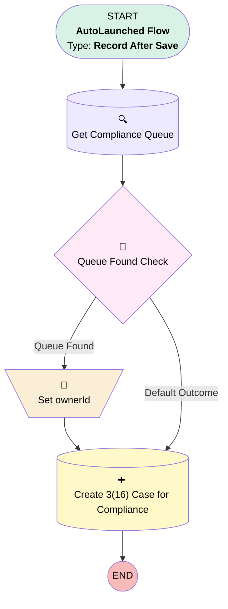

# Implementation | After Trigger | Create 3(16) Case

## Flow Diagram [(_View History_)](Case_After_Trigger_Create_3_16_Case-history.md)

<!-- Flow description -->

## General Information

|<!-- -->|<!-- -->|
|:---|:---|
|Object|Implementation__c|
|Process Type| Auto Launched Flow|
|Trigger Type| Record After Save|
|Record Trigger Type| Update|
|Label|Implementation | After Trigger | Create 3(16) Case|
|Status|Active|
|Description|Updated to add compliance queue  When Census and Eligibility Uploaded date is entered on Reserve(k) or Sallus Imp, create a case for Compliance|
|Environments|Default|
|Interview Label|Case | After Trigger | Create 3(16) Case {!$Flow.CurrentDateTime}|
| Builder Type (PM)|LightningFlowBuilder|
| Canvas Mode (PM)|AUTO_LAYOUT_CANVAS|
| Origin Builder Type (PM)|LightningFlowBuilder|
|Connector|[Get_Compliance_Queue](#get_compliance_queue)|
|Next Node|[Get_Compliance_Queue](#get_compliance_queue)|

#### Filters (logic: **1 AND 2 AND (3 OR 4 OR 5 OR 6 OR 7)**)

|Filter Id|Field|Operator|Value|
|:-- |:-- |:--:|:--: |
|1|Census_and_Eligibility_Uploaded__c| Is Changed|✅|
|2|Census_and_Eligibility_Uploaded__c| Is Null|<!-- -->|
|3|Service_Option__c| Equal To|Reserve(k)|
|4|Service_Option__c| Equal To|Starter|
|5|Service_Option__c| Equal To|Partner|
|6|Service_Option__c| Equal To|Builder|
|7|Service_Option__c| Equal To|Franchise|

## Variables

|Name|Data Type|Is Collection|Is Input|Is Output|Object Type|Description|
|:-- |:--:|:--:|:--:|:--:|:--:|:--  |
|ownerId|String|⬜|⬜|⬜|<!-- -->|Defaults to compliance shared user Id.  Should update to queue Id|

## Flow Nodes Details

### Set_ownerId

|<!-- -->|<!-- -->|
|:---|:---|
|Type|Assignment|
|Label|Set ownerId|
|Connector|[Create_3_16_Case_for_Compliance](#create_3_16_case_for_compliance)|

#### Assignments

|Assign To Reference|Operator|Value|
|:-- |:--:|:--: |
|ownerId| Assign|Get_Compliance_Queue.Id|

### Queue_Found_Check

|<!-- -->|<!-- -->|
|:---|:---|
|Type|Decision|
|Label|Queue Found Check|
|Default Connector|[Create_3_16_Case_for_Compliance](#create_3_16_case_for_compliance)|
|Default Connector Label|Default Outcome|

#### Rule Queue_Found (Queue Found)

|<!-- -->|<!-- -->|
|:---|:---|
|Connector|[Set_ownerId](#set_ownerid)|
|Condition Logic|and|

|Condition Id|Left Value Reference|Operator|Right Value|
|:-- |:-- |:--:|:--: |
|1|[Get_Compliance_Queue](#get_compliance_queue)| Is Null|⬜|

### Create_3_16_Case_for_Compliance

|<!-- -->|<!-- -->|
|:---|:---|
|Type|Record Create|
|Object|Case|
|Label|Create 3(16) Case for Compliance|
|Store Output Automatically|✅|

#### Input Assignments

|Field|Value|
|:-- |:--: |
|AccountId|$Record.Account__c|
|Category__c|3(16)|
|Department__c|Compliance|
|Origin|Compliance|
|OwnerId|ownerId|
|Plan__c|$Record.Plan__c|
|RecordTypeId|01237000000Xs6BAAS|
|Status|New|
|Sub_Category__c|Census Upload|
|Subject|New 3(16) Implementation|

### Get_Compliance_Queue

|<!-- -->|<!-- -->|
|:---|:---|
|Type|Record Lookup|
|Object|Group|
|Label|Get Compliance Queue|
|Assign Null Values If No Records Found|⬜|
|Get First Record Only|✅|
|Queried Fields|Id|
|Store Output Automatically|✅|
|Connector|[Queue_Found_Check](#queue_found_check)|

#### Filters (logic: **and**)

|Filter Id|Field|Operator|Value|
|:-- |:-- |:--:|:--: |
|1|DeveloperName| Equal To|Compliance|
|2|Type| Equal To|Queue|

___

_Documentation generated from branch monitoring_myubiquity by [sfdx-hardis](https://sfdx-hardis.cloudity.com), featuring [salesforce-flow-visualiser](https://github.com/toddhalfpenny/salesforce-flow-visualiser)_