# Case | Autolaunched | Need Approval For Jira

## Flow Diagram [(_View History_)](Case_Autolaunched_Need_Approval_For_Jira-history.md)

```mermaid
%% If you read this, your Markdown visualizer does not handle MermaidJS syntax.
%% - If you are in VS Code, install extension `Markdown Preview Mermaid Support` at https://marketplace.visualstudio.com/items?itemName=bierner.markdown-mermaid
%% - If you are using sfdx-hardis, try to define env variable `MERMAID_MODES=cli,docker` ,then run again the command to regenerate markdown with SVG images.
%% - If you are within mkdocs-material, define mermaid plugin in `mkdocs.yml` as described in https://squidfunk.github.io/mkdocs-material/extensions/mermaid/
%% - As a last resort, you can copy-paste this MermaidJS code into https://mermaid.live/ to see the flow diagram

flowchart TB
START(["START<br/><b>AutoLaunched Flow</b></br>"]):::startClass
click START "#general-information" "3612591345"

Get_User_Groups("⚙️ <em></em><br/>Get User Groups"):::actionCalls
click Get_User_Groups "#get_user_groups" "2002022699"

Set_needsApproval_to_true[\"🟰 <em></em><br/>Set needsApproval to true"/]:::assignments
click Set_needsApproval_to_true "#set_needsapproval_to_true" "2085841488"

Is_user_basic_CE{"🔀 <em></em><br/>Is user basic CE"}:::decisions
click Is_user_basic_CE "#is_user_basic_ce" "1970199441"

Paradigm_bug_or_enhancement{"🔀 <em></em><br/>Paradigm bug or enhancement"}:::decisions
click Paradigm_bug_or_enhancement "#paradigm_bug_or_enhancement" "2677298792"

Get_User_Role[("🔍 <em></em><br/>Get User Role")]:::recordLookups
click Get_User_Role "#get_user_role" "4041170685"

Get_User_Groups --> Is_user_basic_CE
Set_needsApproval_to_true --> END_Set_needsApproval_to_true
Is_user_basic_CE --> |"Basic CE"| Set_needsApproval_to_true
Is_user_basic_CE --> |"Default Outcome"| END_Is_user_basic_CE
Paradigm_bug_or_enhancement --> |"Bug"| Get_User_Groups
Paradigm_bug_or_enhancement --> |"Enhancement"| Set_needsApproval_to_true
Paradigm_bug_or_enhancement --> |"Default Outcome"| END_Paradigm_bug_or_enhancement
Get_User_Role --> Paradigm_bug_or_enhancement
START -->  Get_User_Role
END_Set_needsApproval_to_true(( END )):::endClass
END_Is_user_basic_CE(( END )):::endClass
END_Paradigm_bug_or_enhancement(( END )):::endClass


classDef actionCalls fill:#D4E4FC,color:black,text-decoration:none,max-height:100px
classDef assignments fill:#FBEED7,color:black,text-decoration:none,max-height:100px
classDef collectionProcessors fill:#F0E3FA,color:black,text-decoration:none,max-height:100px
classDef customErrors fill:#FFE9E9,color:black,text-decoration:none,max-height:100px
classDef decisions fill:#FDEAF6,color:black,text-decoration:none,max-height:100px
classDef loops fill:#FDEAF6,color:black,text-decoration:none,max-height:100px
classDef recordCreates fill:#FFF8C9,color:black,text-decoration:none,max-height:100px
classDef recordDeletes fill:#FFF8C9,color:black,text-decoration:none,max-height:100px
classDef recordLookups fill:#EDEAFF,color:black,text-decoration:none,max-height:100px
classDef recordUpdates fill:#FFF8C9,color:black,text-decoration:none,max-height:100px
classDef screens fill:#DFF6FF,color:black,text-decoration:none,max-height:100px
classDef subflows fill:#D4E4FC,color:black,text-decoration:none,max-height:100px
classDef startClass fill:#D9F2E6,color:black,text-decoration:none,max-height:100px
classDef endClass fill:#F9BABA,color:black,text-decoration:none,max-height:100px
classDef transforms fill:#FDEAF6,color:black,text-decoration:none,max-height:100px


```

<!-- Flow description -->

## General Information

|<!-- -->|<!-- -->|
|:---|:---|
|Process Type| Auto Launched Flow|
|Label|Case | Autolaunched | Need Approval For Jira|
|Status|Active|
|Description|Checks if a case needs to be "approved" for syncing to Jira|
|Environments|Default|
|Interview Label|Case | Autolaunched | Need Approval For Jira {!$Flow.CurrentDateTime}|
| Builder Type (PM)|LightningFlowBuilder|
| Canvas Mode (PM)|AUTO_LAYOUT_CANVAS|
| Origin Builder Type (PM)|LightningFlowBuilder|
|Connector|[Get_User_Role](#get_user_role)|
|Next Node|[Get_User_Role](#get_user_role)|

## Variables

|Name|Data Type|Is Collection|Is Input|Is Output|Object Type|Description|
|:-- |:--:|:--:|:--:|:--:|:--:|:--  |
|case|SObject|⬜|✅|⬜|Case|<!-- -->|
|needsApproval|Boolean|⬜|⬜|✅|<!-- -->|<!-- -->|
|userId|String|⬜|✅|⬜|<!-- -->|<!-- -->|
|userRoleId|String|⬜|✅|⬜|<!-- -->|<!-- -->|

## Flow Nodes Details

### Get_User_Groups

|<!-- -->|<!-- -->|
|:---|:---|
|Type|Action Call|
|Label|Get User Groups|
|Action Type|Apex|
|Action Name|[GetUserGroups](../apex/GetUserGroups.md)|
|Flow Transaction Model|CurrentTransaction|
|Name Segment|GetUserGroups|
|Offset|0|
|Store Output Automatically|✅|
|User Id (input)|userId|
|User Role Id (input)|userRoleId|
|Connector|[Is_user_basic_CE](#is_user_basic_ce)|

### Set_needsApproval_to_true

|<!-- -->|<!-- -->|
|:---|:---|
|Type|Assignment|
|Label|Set needsApproval to true|

#### Assignments

|Assign To Reference|Operator|Value|
|:-- |:--:|:--: |
|needsApproval| Assign|✅|

### Is_user_basic_CE

|<!-- -->|<!-- -->|
|:---|:---|
|Type|Decision|
|Label|Is user basic CE|
|Default Connector Label|Default Outcome|

#### Rule Basic_CE (Basic CE)

|<!-- -->|<!-- -->|
|:---|:---|
|Connector|[Set_needsApproval_to_true](#set_needsapproval_to_true)|
|Condition Logic|1 AND NOT 2|

|Condition Id|Left Value Reference|Operator|Right Value|
|:-- |:-- |:--:|:--: |
|1|Get_User_Groups.groupDevNames| Contains|CE_QA_Reviewed|
|2|Get_User_Groups.groupDevNames| Contains|CE_QA_Reviewers|

### Paradigm_bug_or_enhancement

|<!-- -->|<!-- -->|
|:---|:---|
|Type|Decision|
|Label|Paradigm bug or enhancement|
|Default Connector Label|Default Outcome|

#### Rule Bug (Bug)

|<!-- -->|<!-- -->|
|:---|:---|
|Connector|[Get_User_Groups](#get_user_groups)|
|Condition Logic|and|

|Condition Id|Left Value Reference|Operator|Right Value|
|:-- |:-- |:--:|:--: |
|1|case.Reason| Equal To|Paradigm Bug|

#### Rule Enhancement (Enhancement)

|<!-- -->|<!-- -->|
|:---|:---|
|Connector|isGoTo: true targetReference: Set_needsApproval_to_true |
|Condition Logic|and|

|Condition Id|Left Value Reference|Operator|Right Value|
|:-- |:-- |:--:|:--: |
|1|case.Reason| Equal To|Paradigm Enhancement|

### Get_User_Role

|<!-- -->|<!-- -->|
|:---|:---|
|Type|Record Lookup|
|Object|User|
|Label|Get User Role|
|Assign Null Values If No Records Found|⬜|
|Output Assignments|assignToReference: userRoleId field: UserRoleId |
|Connector|[Paradigm_bug_or_enhancement](#paradigm_bug_or_enhancement)|

#### Filters (logic: **and**)

|Filter Id|Field|Operator|Value|
|:-- |:-- |:--:|:--: |
|1|Id| Equal To|userId|

___

_Documentation generated from branch monitoring_myubiquity by [sfdx-hardis](https://sfdx-hardis.cloudity.com), featuring [salesforce-flow-visualiser](https://github.com/toddhalfpenny/salesforce-flow-visualiser)_