# Case | Before Insert | Case Action Default Owners

## Flow Diagram [(_View History_)](Case_Before_Insert_Case_Action_Default_Owners-history.md)

```mermaid
%% If you read this, your Markdown visualizer does not handle MermaidJS syntax.
%% - If you are in VS Code, install extension `Markdown Preview Mermaid Support` at https://marketplace.visualstudio.com/items?itemName=bierner.markdown-mermaid
%% - If you are using sfdx-hardis, try to define env variable `MERMAID_MODES=cli,docker` ,then run again the command to regenerate markdown with SVG images.
%% - If you are within mkdocs-material, define mermaid plugin in `mkdocs.yml` as described in https://squidfunk.github.io/mkdocs-material/extensions/mermaid/
%% - As a last resort, you can copy-paste this MermaidJS code into https://mermaid.live/ to see the flow diagram

flowchart TB
START(["START<br/><b>AutoLaunched Flow</b></br>Type: <b> Record Before Save</b>"]):::startClass
click START "#general-information" "2960347852"

Assign_Ownership_to_R_W[\"🟰 <em></em><br/>Assign Ownership to R&W"/]:::assignments
click Assign_Ownership_to_R_W "#assign_ownership_to_r_w" "3977856819"

Assign_Ownership_to_R_W --> END_Assign_Ownership_to_R_W
START -->  Assign_Ownership_to_R_W
END_Assign_Ownership_to_R_W(( END )):::endClass


classDef actionCalls fill:#D4E4FC,color:black,text-decoration:none,max-height:100px
classDef assignments fill:#FBEED7,color:black,text-decoration:none,max-height:100px
classDef collectionProcessors fill:#F0E3FA,color:black,text-decoration:none,max-height:100px
classDef customErrors fill:#FFE9E9,color:black,text-decoration:none,max-height:100px
classDef decisions fill:#FDEAF6,color:black,text-decoration:none,max-height:100px
classDef loops fill:#FDEAF6,color:black,text-decoration:none,max-height:100px
classDef recordCreates fill:#FFF8C9,color:black,text-decoration:none,max-height:100px
classDef recordDeletes fill:#FFF8C9,color:black,text-decoration:none,max-height:100px
classDef recordLookups fill:#EDEAFF,color:black,text-decoration:none,max-height:100px
classDef recordUpdates fill:#FFF8C9,color:black,text-decoration:none,max-height:100px
classDef screens fill:#DFF6FF,color:black,text-decoration:none,max-height:100px
classDef subflows fill:#D4E4FC,color:black,text-decoration:none,max-height:100px
classDef startClass fill:#D9F2E6,color:black,text-decoration:none,max-height:100px
classDef endClass fill:#F9BABA,color:black,text-decoration:none,max-height:100px
classDef transforms fill:#FDEAF6,color:black,text-decoration:none,max-height:100px


```

<!-- Flow description -->

## General Information

|<!-- -->|<!-- -->|
|:---|:---|
|Object|Case|
|Process Type| Auto Launched Flow|
|Trigger Type| Record Before Save|
|Record Trigger Type| Create|
|Label|Case | Before Insert | Case Action Default Owners|
|Status|Active|
|Description|Replaced PB - Sets owner to R&W for reissue, ream, and adjustment cases|
|Environments|Default|
|Interview Label|Case | Before Insert | Case Action Default Owners {!$Flow.CurrentDateTime}|
| Builder Type (PM)|LightningFlowBuilder|
| Canvas Mode (PM)|AUTO_LAYOUT_CANVAS|
| Origin Builder Type (PM)|LightningFlowBuilder|
|Connector|[Assign_Ownership_to_R_W](#assign_ownership_to_r_w)|
|Next Node|[Assign_Ownership_to_R_W](#assign_ownership_to_r_w)|

#### Filters (logic: **1 AND (2 OR 3 OR 4)**)

|Filter Id|Field|Operator|Value|
|:-- |:-- |:--:|:--: |
|1|Origin| Equal To|Internal|
|2|Subject| Equal To|Distribution Reissue Request|
|3|Subject| Equal To|Loan Amortization Request|
|4|Subject| Equal To|New Adjustment Request|

## Flow Nodes Details

### Assign_Ownership_to_R_W

|<!-- -->|<!-- -->|
|:---|:---|
|Type|Assignment|
|Label|Assign Ownership to R&W|

#### Assignments

|Assign To Reference|Operator|Value|
|:-- |:--:|:--: |
|$Record.OwnerId| Assign|005Ho00000AnvFJ|

___

_Documentation generated from branch monitoring_myubiquity by [sfdx-hardis](https://sfdx-hardis.cloudity.com), featuring [salesforce-flow-visualiser](https://github.com/toddhalfpenny/salesforce-flow-visualiser)_