# Case | Before Trigger | Update Child Department

## Flow Diagram [(_View History_)](Case_Before_Trigger_Update_Child_Department-history.md)

```mermaid
%% If you read this, your Markdown visualizer does not handle MermaidJS syntax.
%% - If you are in VS Code, install extension `Markdown Preview Mermaid Support` at https://marketplace.visualstudio.com/items?itemName=bierner.markdown-mermaid
%% - If you are using sfdx-hardis, try to define env variable `MERMAID_MODES=cli,docker` ,then run again the command to regenerate markdown with SVG images.
%% - If you are within mkdocs-material, define mermaid plugin in `mkdocs.yml` as described in https://squidfunk.github.io/mkdocs-material/extensions/mermaid/
%% - As a last resort, you can copy-paste this MermaidJS code into https://mermaid.live/ to see the flow diagram

flowchart TB
START(["START<br/><b>AutoLaunched Flow</b></br>Type: <b> Record Before Save</b>"]):::startClass
click START "#general-information" "42383541"

User_or_Queue{"🔀 <em></em><br/>User or Queue"}:::decisions
click User_or_Queue "#user_or_queue" "3784957594"

Update_Case[("🛠️ <em></em><br/>Update Case w/ User Info")]:::recordUpdates
click Update_Case "#update_case" "365470587"

User_or_Queue --> |"Owner is User"| Update_Case
User_or_Queue --> |"Owner is Queue"| END_User_or_Queue
Update_Case --> END_Update_Case
START -->  User_or_Queue
END_User_or_Queue(( END )):::endClass
END_Update_Case(( END )):::endClass


classDef actionCalls fill:#D4E4FC,color:black,text-decoration:none,max-height:100px
classDef assignments fill:#FBEED7,color:black,text-decoration:none,max-height:100px
classDef collectionProcessors fill:#F0E3FA,color:black,text-decoration:none,max-height:100px
classDef customErrors fill:#FFE9E9,color:black,text-decoration:none,max-height:100px
classDef decisions fill:#FDEAF6,color:black,text-decoration:none,max-height:100px
classDef loops fill:#FDEAF6,color:black,text-decoration:none,max-height:100px
classDef recordCreates fill:#FFF8C9,color:black,text-decoration:none,max-height:100px
classDef recordDeletes fill:#FFF8C9,color:black,text-decoration:none,max-height:100px
classDef recordLookups fill:#EDEAFF,color:black,text-decoration:none,max-height:100px
classDef recordUpdates fill:#FFF8C9,color:black,text-decoration:none,max-height:100px
classDef screens fill:#DFF6FF,color:black,text-decoration:none,max-height:100px
classDef subflows fill:#D4E4FC,color:black,text-decoration:none,max-height:100px
classDef startClass fill:#D9F2E6,color:black,text-decoration:none,max-height:100px
classDef endClass fill:#F9BABA,color:black,text-decoration:none,max-height:100px
classDef transforms fill:#FDEAF6,color:black,text-decoration:none,max-height:100px


```

<!-- Flow description -->

## General Information

|<!-- -->|<!-- -->|
|:---|:---|
|Object|Case|
|Process Type| Auto Launched Flow|
|Trigger Type| Record Before Save|
|Record Trigger Type| Create|
|Label|Case | Before Trigger | Update Child Department|
|Status|Active|
|Interview Label|Case | Before Trigger | Update Child Department {!$Flow.CurrentDateTime}|
| Builder Type (PM)|LightningFlowBuilder|
| Canvas Mode (PM)|FREE_FORM_CANVAS|
| Origin Builder Type (PM)|LightningFlowBuilder|
|Connector|[User_or_Queue](#user_or_queue)|
|Next Node|[User_or_Queue](#user_or_queue)|

#### Filters (logic: **and**)

|Filter Id|Field|Operator|Value|
|:-- |:-- |:--:|:--: |
|1|ParentId| Is Null|<!-- -->|

## Flow Nodes Details

### User_or_Queue

|<!-- -->|<!-- -->|
|:---|:---|
|Type|Decision|
|Label|User or Queue|
|Default Connector Label|Owner is Queue|

#### Rule Owner_is_User (Owner is User)

|<!-- -->|<!-- -->|
|:---|:---|
|Connector|[Update_Case](#update_case)|
|Condition Logic|and|

|Condition Id|Left Value Reference|Operator|Right Value|
|:-- |:-- |:--:|:--: |
|1|$Record.OwnerId| Starts With|5|

### Update_Case

|<!-- -->|<!-- -->|
|:---|:---|
|Type|Record Update|
|Label|Update Case w/ User Info|
|Input Reference|$Record|

#### Input Assignments

|Field|Value|
|:-- |:--: |
|Department__c|$Record.Owner:User.Department|

___

_Documentation generated from branch monitoring_myubiquity by [sfdx-hardis](https://sfdx-hardis.cloudity.com), featuring [salesforce-flow-visualiser](https://github.com/toddhalfpenny/salesforce-flow-visualiser)_