# Case | Button | Create Fee Waiver

## Flow Diagram [(_View History_)](Case_Button_Create_Fee_Waiver-history.md)

```mermaid
%% If you read this, your Markdown visualizer does not handle MermaidJS syntax.
%% - If you are in VS Code, install extension `Markdown Preview Mermaid Support` at https://marketplace.visualstudio.com/items?itemName=bierner.markdown-mermaid
%% - If you are using sfdx-hardis, try to define env variable `MERMAID_MODES=cli,docker` ,then run again the command to regenerate markdown with SVG images.
%% - If you are within mkdocs-material, define mermaid plugin in `mkdocs.yml` as described in https://squidfunk.github.io/mkdocs-material/extensions/mermaid/
%% - As a last resort, you can copy-paste this MermaidJS code into https://mermaid.live/ to see the flow diagram

flowchart TB
START(["START<br/><b>Screen Flow</b>"]):::startClass
click START "#general-information" "2693989911"

Submit_for_Approval_Action_1("⚡ <em></em><br/>Submit for Approval Action 1"):::actionCalls
click Submit_for_Approval_Action_1 "#submit_for_approval_action_1" "4690646"

Assign_Values[\"🟰 <em></em><br/>Assign Values"/]:::assignments
click Assign_Values "#assign_values" "3251034490"

Create_Fee_Waiver[("➕ <em></em><br/>Create Fee Waiver")]:::recordCreates
click Create_Fee_Waiver "#create_fee_waiver" "463622862"

Get_Case[("🔍 <em></em><br/>Get Case")]:::recordLookups
click Get_Case "#get_case" "964361405"

New_Request(["💻 <em></em><br/>New Request"]):::screens
click New_Request "#new_request" "977977940"

success(["💻 <em></em><br/>success"]):::screens
click success "#success" "896131905"

Submit_for_Approval_Action_1 --> success
Assign_Values --> Create_Fee_Waiver
Create_Fee_Waiver --> Submit_for_Approval_Action_1
Get_Case --> New_Request
New_Request --> Assign_Values
success --> END_success
START -->  Get_Case
END_success(( END )):::endClass


classDef actionCalls fill:#D4E4FC,color:black,text-decoration:none,max-height:100px
classDef assignments fill:#FBEED7,color:black,text-decoration:none,max-height:100px
classDef collectionProcessors fill:#F0E3FA,color:black,text-decoration:none,max-height:100px
classDef customErrors fill:#FFE9E9,color:black,text-decoration:none,max-height:100px
classDef decisions fill:#FDEAF6,color:black,text-decoration:none,max-height:100px
classDef loops fill:#FDEAF6,color:black,text-decoration:none,max-height:100px
classDef recordCreates fill:#FFF8C9,color:black,text-decoration:none,max-height:100px
classDef recordDeletes fill:#FFF8C9,color:black,text-decoration:none,max-height:100px
classDef recordLookups fill:#EDEAFF,color:black,text-decoration:none,max-height:100px
classDef recordUpdates fill:#FFF8C9,color:black,text-decoration:none,max-height:100px
classDef screens fill:#DFF6FF,color:black,text-decoration:none,max-height:100px
classDef subflows fill:#D4E4FC,color:black,text-decoration:none,max-height:100px
classDef startClass fill:#D9F2E6,color:black,text-decoration:none,max-height:100px
classDef endClass fill:#F9BABA,color:black,text-decoration:none,max-height:100px
classDef transforms fill:#FDEAF6,color:black,text-decoration:none,max-height:100px


```

<!-- Flow description -->

## General Information

|<!-- -->|<!-- -->|
|:---|:---|
|Process Type| Flow|
|Label|Case | Button | Create Fee Waiver|
|Status|Active|
|Description|Removed hard coded approval process Ids from flow.  Approval process entry criteria will handle logic|
|Environments|Default|
|Interview Label|Case | Button | Create Fee Waiver {!$Flow.CurrentDateTime}|
| Builder Type (PM)|LightningFlowBuilder|
| Canvas Mode (PM)|AUTO_LAYOUT_CANVAS|
| Origin Builder Type (PM)|LightningFlowBuilder|
|Connector|[Get_Case](#get_case)|
|Next Node|[Get_Case](#get_case)|

## Variables

|Name|Data Type|Is Collection|Is Input|Is Output|Object Type|Description|
|:-- |:--:|:--:|:--:|:--:|:--:|:--  |
|amount|Currency|⬜|✅|⬜|<!-- -->|<!-- -->|
|feeWaiverToCreate|SObject|⬜|✅|⬜|Fee_Waiver__c|<!-- -->|
|recordId|String|⬜|✅|⬜|<!-- -->|<!-- -->|

## Formulas

|Name|Data Type|Expression|Description|
|:-- |:--:|:-- |:--  |
|truncAccountName|String|TRIM( LEFT({!Get_Case.Account.Name} , 50))|<!-- -->|

## Flow Nodes Details

### Submit_for_Approval_Action_1

|<!-- -->|<!-- -->|
|:---|:---|
|Type|Action Call|
|Label|Submit for Approval Action 1|
|Action Type|Submit|
|Action Name|submit|
|Flow Transaction Model|CurrentTransaction|
|Name Segment|submit|
|Offset|0|
|Store Output Automatically|✅|
|Object Id (input)|feeWaiverToCreate.Id|
|Submitter Id (input)|$User.Id|
|Connector|[success](#success)|

### Assign_Values

|<!-- -->|<!-- -->|
|:---|:---|
|Type|Assignment|
|Label|Assign Values|
|Connector|[Create_Fee_Waiver](#create_fee_waiver)|

#### Assignments

|Assign To Reference|Operator|Value|
|:-- |:--:|:--: |
|feeWaiverToCreate.Amount__c| Assign|screenAmount|
|feeWaiverToCreate.Account__c| Assign|Get_Case.AccountId|
|feeWaiverToCreate.Case__c| Assign|Get_Case.Id|
|feeWaiverToCreate.Fee_Waiver_Status__c| Assign|Awaiting Approval|
|feeWaiverToCreate.Name| Assign|waiverName|
|feeWaiverToCreate.Date__c| Assign|$Flow.CurrentDate|
|feeWaiverToCreate.Refund_Type__c| Assign|flatOrQrtly|

### Create_Fee_Waiver

|<!-- -->|<!-- -->|
|:---|:---|
|Type|Record Create|
|Label|Create Fee Waiver|
|Input Reference|feeWaiverToCreate|
|Connector|[Submit_for_Approval_Action_1](#submit_for_approval_action_1)|

### Get_Case

|<!-- -->|<!-- -->|
|:---|:---|
|Type|Record Lookup|
|Object|Case|
|Label|Get Case|
|Assign Null Values If No Records Found|⬜|
|Get First Record Only|✅|
|Store Output Automatically|✅|
|Connector|[New_Request](#new_request)|

#### Filters (logic: **and**)

|Filter Id|Field|Operator|Value|
|:-- |:-- |:--:|:--: |
|1|Id| Equal To|recordId|

### New_Request

|<!-- -->|<!-- -->|
|:---|:---|
|Type|Screen|
|Label|New Request|
|Allow Back|⬜|
|Allow Finish|✅|
|Allow Pause|⬜|
|Next Or Finish Button Label|Submit|
|Show Footer|✅|
|Show Header|⬜|
|Connector|[Assign_Values](#assign_values)|

#### displayMessage

|<!-- -->|<!-- -->|
|:---|:---|
|Field Text|
<strong style="font-size: 18px; color: rgb(7, 86, 67);">Create New Fee Waiver Request</strong>
|
|Field Type| Display Text|
|Style Properties|verticalAlignment: &nbsp;&nbsp;stringValue: top width: &nbsp;&nbsp;stringValue: 12 |

#### feeWaiverToCreate.Department_Responsible__c

|<!-- -->|<!-- -->|
|:---|:---|
|Field Type| Object Provided|
|Inputs On Next Nav To Assoc Scrn| Use Stored Values|
|Is Required|⬜|
|Object Field Reference|feeWaiverToCreate.Department_Responsible__c|
|Style Properties|verticalAlignment: &nbsp;&nbsp;stringValue: top width: &nbsp;&nbsp;stringValue: 12 |
|Parent Field|[New_Request_Section1_Column1](#new_request_section1_column1)|

#### flatOrQrtly

|<!-- -->|<!-- -->|
|:---|:---|
|Data Type|String|
|Choice References|- flat - QuarterlyFee |
|Field Text|Refunding Flat Amount or Waiving Quarterly Fee?|
|Field Type| Dropdown Box|
|Inputs On Next Nav To Assoc Scrn| Use Stored Values|
|Is Required|✅|
|Style Properties|verticalAlignment: &nbsp;&nbsp;stringValue: top width: &nbsp;&nbsp;stringValue: 12 |
|Parent Field|[New_Request_Section1_Column1](#new_request_section1_column1)|

#### qrtlyDesc

|<!-- -->|<!-- -->|
|:---|:---|
|Field Text|
Please check Paradigm for the plan's current quarterly fee amount here: <a href="{!Get_Case.Plan__r.Paradigm_Plan_Link__c}" rel="noopener noreferrer" target="_blank">{!Get_Case.Plan__r.Paradigm_Plan_Link__c}</a>
|
|Field Type| Display Text|
|Style Properties|verticalAlignment: &nbsp;&nbsp;stringValue: top width: &nbsp;&nbsp;stringValue: 12 |
|Visibility Rule|conditionLogic: and conditions: &nbsp;&nbsp;leftValueReference: flatOrQrtly &nbsp;&nbsp;operator: EqualTo &nbsp;&nbsp;rightValue: &nbsp;&nbsp;&nbsp;&nbsp;elementReference: QuarterlyFee |
|Parent Field|[New_Request_Section1_Column1](#new_request_section1_column1)|

#### New_Request_Section1_Column1

|<!-- -->|<!-- -->|
|:---|:---|
|Field Type| Region|
|Is Required|⬜|
|Parent Field|[New_Request_Section1](#new_request_section1)|
|Width (input)|6|

#### feeWaiverToCreate.Reason_for_Fee_Waiver__c

|<!-- -->|<!-- -->|
|:---|:---|
|Field Type| Object Provided|
|Inputs On Next Nav To Assoc Scrn| Use Stored Values|
|Is Required|⬜|
|Object Field Reference|feeWaiverToCreate.Reason_for_Fee_Waiver__c|
|Style Properties|verticalAlignment: &nbsp;&nbsp;stringValue: top width: &nbsp;&nbsp;stringValue: 12 |
|Parent Field|[New_Request_Section1_Column2](#new_request_section1_column2)|

#### screenAmount

|<!-- -->|<!-- -->|
|:---|:---|
|Data Type|Currency|
|Default Value|amount|
|Field Text|Amount|
|Field Type| Input Field|
|Inputs On Next Nav To Assoc Scrn| Use Stored Values|
|Is Required|✅|
|Scale|2|
|Style Properties|verticalAlignment: &nbsp;&nbsp;stringValue: top width: &nbsp;&nbsp;stringValue: 12 |
|Parent Field|[New_Request_Section1_Column2](#new_request_section1_column2)|

#### New_Request_Section1_Column2

|<!-- -->|<!-- -->|
|:---|:---|
|Field Type| Region|
|Is Required|⬜|
|Parent Field|[New_Request_Section1](#new_request_section1)|
|Width (input)|6|

#### New_Request_Section1

|<!-- -->|<!-- -->|
|:---|:---|
|Field Type| Region Container|
|Is Required|⬜|
|Region Container Type| Section Without Header|
|Style Properties|verticalAlignment: &nbsp;&nbsp;stringValue: top width: &nbsp;&nbsp;stringValue: 12 |

#### feeWaiverToCreate.Notes__c

|<!-- -->|<!-- -->|
|:---|:---|
|Field Type| Object Provided|
|Inputs On Next Nav To Assoc Scrn| Use Stored Values|
|Is Required|⬜|
|Object Field Reference|feeWaiverToCreate.Notes__c|
|Style Properties|verticalAlignment: &nbsp;&nbsp;stringValue: top width: &nbsp;&nbsp;stringValue: 12 |
|Parent Field|[New_Request_Section2_Column1](#new_request_section2_column1)|

#### New_Request_Section2_Column1

|<!-- -->|<!-- -->|
|:---|:---|
|Field Type| Region|
|Is Required|⬜|
|Parent Field|[New_Request_Section2](#new_request_section2)|
|Width (input)|12|

#### New_Request_Section2

|<!-- -->|<!-- -->|
|:---|:---|
|Field Type| Region Container|
|Is Required|⬜|
|Region Container Type| Section Without Header|
|Style Properties|verticalAlignment: &nbsp;&nbsp;stringValue: top width: &nbsp;&nbsp;stringValue: 12 |

### success

|<!-- -->|<!-- -->|
|:---|:---|
|Type|Screen|
|Label|[success](#success)|
|Allow Back|⬜|
|Allow Finish|✅|
|Allow Pause|⬜|
|Next Or Finish Button Label|Finish|
|Show Footer|✅|
|Show Header|⬜|

#### displaySuccessMessage

|<!-- -->|<!-- -->|
|:---|:---|
|Field Text|
<strong style="font-size: 18px; color: rgb(7, 86, 67);">Fee Waiver request created and sent for approval.</strong>

 

<strong style="font-size: 14px; color: rgb(7, 86, 67);">Please click "Finish" to exit this screen.</strong>
|
|Field Type| Display Text|
|Style Properties|verticalAlignment: &nbsp;&nbsp;stringValue: top width: &nbsp;&nbsp;stringValue: 12 |

___

_Documentation generated from branch monitoring_myubiquity by [sfdx-hardis](https://sfdx-hardis.cloudity.com), featuring [salesforce-flow-visualiser](https://github.com/toddhalfpenny/salesforce-flow-visualiser)_