# Case | Company Name Address Update

## Flow Diagram [(_View History_)](Case_Company_Name_Address_Update-history.md)

```mermaid
%% If you read this, your Markdown visualizer does not handle MermaidJS syntax.
%% - If you are in VS Code, install extension `Markdown Preview Mermaid Support` at https://marketplace.visualstudio.com/items?itemName=bierner.markdown-mermaid
%% - If you are using sfdx-hardis, try to define env variable `MERMAID_MODES=cli,docker` ,then run again the command to regenerate markdown with SVG images.
%% - If you are within mkdocs-material, define mermaid plugin in `mkdocs.yml` as described in https://squidfunk.github.io/mkdocs-material/extensions/mermaid/
%% - As a last resort, you can copy-paste this MermaidJS code into https://mermaid.live/ to see the flow diagram

flowchart TB
START(["START<br/><b>Case</b></br>Type: <b>On All Changes</b>"]):::startClass
click START "#general-information" "817324539"

START --> myDecision
myDecision{"🔀 <em></em><br/>myDecision"}:::decisions
click myDecision "#mydecision" "172746822"

myRule_1_pmetdec{"🔀 <em></em><br/>Previously Met Decision"}:::decisions
click myRule_1_pmetdec "#myrule_1_pmetdec" "1623629574"

myRule_1_A1[("➕ <em></em><br/>A&F Case")]:::recordCreates
click myRule_1_A1 "#myrule_1_a1" "2432672715"

myRule_1_A2[("➕ <em></em><br/>Ops Case")]:::recordCreates
click myRule_1_A2 "#myrule_1_a2" "2529166515"

myRule_1_A3[("➕ <em></em><br/>Compliance Case")]:::recordCreates
click myRule_1_A3 "#myrule_1_a3" "673940010"

myDecision --> |"Company Name/Address Update"| myRule_1_pmetdec
myDecision --> |"default"| END_myDecision
myRule_1_pmetdec --> |"Previously Met - Null"| myRule_1_A1
myRule_1_pmetdec --> |"Not Previously Met"| myRule_1_A1
myRule_1_A1 --> myRule_1_A2
myRule_1_A2 --> myRule_1_A3
myRule_1_A3 --> END_myRule_1_A3
END_myDecision(( END )):::endClass
END_myRule_1_A3(( END )):::endClass


classDef actionCalls fill:#D4E4FC,color:black,text-decoration:none,max-height:100px
classDef assignments fill:#FBEED7,color:black,text-decoration:none,max-height:100px
classDef collectionProcessors fill:#F0E3FA,color:black,text-decoration:none,max-height:100px
classDef customErrors fill:#FFE9E9,color:black,text-decoration:none,max-height:100px
classDef decisions fill:#FDEAF6,color:black,text-decoration:none,max-height:100px
classDef loops fill:#FDEAF6,color:black,text-decoration:none,max-height:100px
classDef recordCreates fill:#FFF8C9,color:black,text-decoration:none,max-height:100px
classDef recordDeletes fill:#FFF8C9,color:black,text-decoration:none,max-height:100px
classDef recordLookups fill:#EDEAFF,color:black,text-decoration:none,max-height:100px
classDef recordUpdates fill:#FFF8C9,color:black,text-decoration:none,max-height:100px
classDef screens fill:#DFF6FF,color:black,text-decoration:none,max-height:100px
classDef subflows fill:#D4E4FC,color:black,text-decoration:none,max-height:100px
classDef startClass fill:#D9F2E6,color:black,text-decoration:none,max-height:100px
classDef endClass fill:#F9BABA,color:black,text-decoration:none,max-height:100px
classDef transforms fill:#FDEAF6,color:black,text-decoration:none,max-height:100px


```

<!-- Flow description -->

## General Information

|<!-- -->|<!-- -->|
|:---|:---|
|Process Type| Workflow|
|Label|Case | Company Name Address Update|
|Status|Obsolete|
|Description|Creates 3 child cases for Address Update Cases|
|Interview Label|Case_Company_Name_Address_Update-5_InterviewLabel|
|Start Element Reference|[myDecision](#mydecision)|
| Object Type (PM)|Case|
| Object Variable (PM)|myVariable_current|
| Old Object Variable (PM)|myVariable_old|
| Trigger Type (PM)|onAllChanges|

## Variables

|Name|Data Type|Is Collection|Is Input|Is Output|Object Type|Description|
|:-- |:--:|:--:|:--:|:--:|:--:|:--  |
|myVariable_current|SObject|⬜|✅|✅|Case|<!-- -->|
|myVariable_old|SObject|⬜|✅|⬜|Case|<!-- -->|

## Formulas

|Name|Data Type|Expression|Description|
|:-- |:--:|:-- |:--  |
|formula_2_myRule_1_A3_9827361428|String|"Please process the address and/or name change as referenced in the Parent Case - refer to LOI at the following link: " + {!myVariable_current.Box_LOI_Link__c}|<!-- -->|
|formula_3_myRule_1_A2_4605358150|String|"Please process the address and/or name change as referenced in the Parent Case - refer to LOI at the following link: " + {!myVariable_current.Box_LOI_Link__c}|<!-- -->|
|formula_4_myRule_1_A1_7175260331|String|"Please process the address and/or name change as referenced in the Parent Case - refer to LOI at the following link: " + {!myVariable_current.Box_LOI_Link__c}|<!-- -->|

## Flow Nodes Details

### myDecision

|<!-- -->|<!-- -->|
|:---|:---|
|Type|Decision|
|Label|[myDecision](#mydecision)|
|Default Connector Label|default|
|Index (PM)|numberValue: 0 |

#### Rule myRule_1 (Company Name/Address Update)

|<!-- -->|<!-- -->|
|:---|:---|
|Connector|[myRule_1_pmetdec](#myrule_1_pmetdec)|
|Condition Logic|1 AND 2 AND (3 OR 4 OR 5)|

|Condition Id|Left Value Reference|Operator|Right Value|
|:-- |:-- |:--:|:--: |
|1|myVariable_current.Department__c| Equal To|Servicing|
|2|myVariable_current.Address_Name_Change_Child_Cases__c| Is Null|⬜|
|3|myVariable_current.Sub_Category__c| Equal To|Amend Company Address|
|4|myVariable_current.Sub_Category__c| Equal To|Amend Company or Plan Name|
|5|myVariable_current.Sub_Category__c| Equal To|Plan or Company Name Change|

### myRule_1_pmetdec

|<!-- -->|<!-- -->|
|:---|:---|
|Type|Decision|
|Label|Previously Met Decision|
|Default Connector|[myRule_1_A1](#myrule_1_a1)|
|Default Connector Label|Not Previously Met|

#### Rule myRule_1_pmetnullrule (Previously Met - Null)

|<!-- -->|<!-- -->|
|:---|:---|
|Connector|[myRule_1_A1](#myrule_1_a1)|
|Condition Logic|or|

|Condition Id|Left Value Reference|Operator|Right Value|
|:-- |:-- |:--:|:--: |
|1|myVariable_old| Is Null|✅|

#### Rule myRule_1_pmetrule (Previously Met - Prev)

|<!-- -->|<!-- -->|
|:---|:---|
|Condition Logic|1 AND 2 AND (3 OR 4 OR 5)|

|Condition Id|Left Value Reference|Operator|Right Value|
|:-- |:-- |:--:|:--: |
|1|myVariable_old.Department__c| Equal To|Servicing|
|2|myVariable_old.Address_Name_Change_Child_Cases__c| Is Null|⬜|
|3|myVariable_old.Sub_Category__c| Equal To|Amend Company Address|
|4|myVariable_old.Sub_Category__c| Equal To|Amend Company or Plan Name|
|5|myVariable_old.Sub_Category__c| Equal To|Plan or Company Name Change|

### myRule_1_A1

|<!-- -->|<!-- -->|
|:---|:---|
|Type|Record Create|
|Object|Case|
|Label|A&F Case|
|Connector|[myRule_1_A2](#myrule_1_a2)|

#### Input Assignments

|Field|Value|
|:-- |:--: |
|AccountId|myVariable_current.AccountId|
|BusinessHoursId|01m37000000PC36|
|Case_Type__c|Child Case|
|Child_Case_Instructions__c|formula_4_myRule_1_A1_7175260331|
|ContactId|myVariable_current.ContactId|
|Department__c|Billing|
|Description|Please process the address and/or name change as referenced in the Parent Case|
|Origin|Internal|
|OwnerId|00500000006yEak|
|ParentId|myVariable_current.Id|
|Plan__c|myVariable_current.Plan__c|
|Priority|Medium|
|RecordTypeId|01237000000Xu63AAC|
|Status|New|
|Subject|New Company Address|Name Change|

### myRule_1_A2

|<!-- -->|<!-- -->|
|:---|:---|
|Type|Record Create|
|Object|Case|
|Label|Ops Case|
|Connector|[myRule_1_A3](#myrule_1_a3)|

#### Input Assignments

|Field|Value|
|:-- |:--: |
|AccountId|myVariable_current.AccountId|
|BusinessHoursId|01m37000000L07U|
|Case_Type__c|Child Case|
|Child_Case_Instructions__c|formula_3_myRule_1_A2_4605358150|
|ContactId|myVariable_current.ContactId|
|Department__c|Reconciliations & Withdrawals|
|Description|Please process the address and/or name change as referenced in the Parent Case|
|Origin|Internal|
|OwnerId|005Ho00000AnvFJ|
|ParentId|myVariable_current.Id|
|Plan__c|myVariable_current.Plan__c|
|Priority|Medium|
|RecordTypeId|012Ho000000NtUeIAK|
|Status|New|
|Subject|New Company Address|Name Change|

### myRule_1_A3

|<!-- -->|<!-- -->|
|:---|:---|
|Type|Record Create|
|Object|Case|
|Label|Compliance Case|

#### Input Assignments

|Field|Value|
|:-- |:--: |
|AccountId|myVariable_current.AccountId|
|BusinessHoursId|01m37000000L06l|
|Case_Type__c|Child Case|
|Child_Case_Instructions__c|formula_2_myRule_1_A3_9827361428|
|ContactId|myVariable_current.ContactId|
|Department__c|Compliance|
|Description|Please process the address and/or name change as referenced in the Parent Case|
|Origin|Internal|
|OwnerId|00537000001tb5H|
|ParentId|myVariable_current.Id|
|Plan__c|myVariable_current.Plan__c|
|Priority|Medium|
|RecordTypeId|01237000000Xs6BAAS|
|Status|New|
|Subject|New Company Address|Name Change|

___

_Documentation generated from branch monitoring_myubiquity by [sfdx-hardis](https://sfdx-hardis.cloudity.com), featuring [salesforce-flow-visualiser](https://github.com/toddhalfpenny/salesforce-flow-visualiser)_