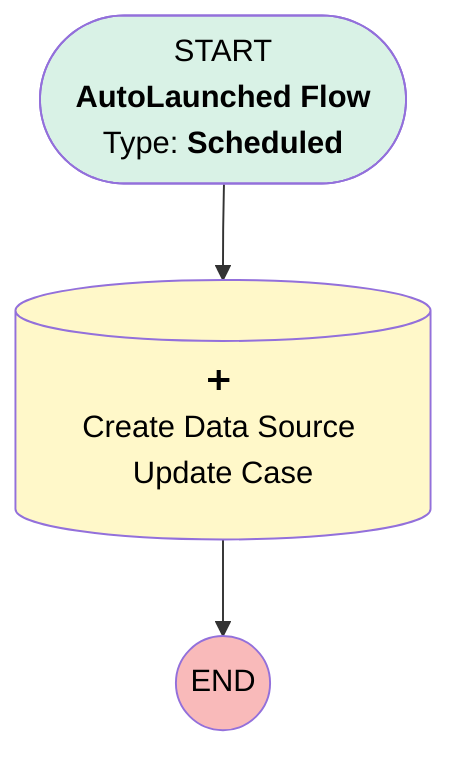

# Case | Scheduled | Create Case for Data Source Doc Update

## Flow Diagram [(_View History_)](Case_Scheduled_Create_Case_for_Data_Source_Doc_Update-history.md)

<!-- Flow description -->

## General Information

|<!-- -->|<!-- -->|
|:---|:---|
|Process Type| Auto Launched Flow|
|Trigger Type| Scheduled|
|Label|Case | Scheduled | Create Case for Data Source Doc Update|
|Status|Obsolete|
|Description|Every monday, create a case for BI to update data source doc.|
|Environments|Default|
|Interview Label|Case | Scheduled | Create Case for Data Source Doc Update {!$Flow.CurrentDateTime}|
| Builder Type (PM)|LightningFlowBuilder|
| Canvas Mode (PM)|AUTO_LAYOUT_CANVAS|
| Origin Builder Type (PM)|LightningFlowBuilder|
|Connector|[Create_Data_Source_Update_Case](#create_data_source_update_case)|
|Next Node|[Create_Data_Source_Update_Case](#create_data_source_update_case)|

#### Schedules

|Frequency|Start Date|Start Time|
|:-- |:--:|:--: |
|Weekly|Jan 30, 2023|04:00|

## Constants

|Name|Data Type|Value|Description|
|:-- |:--:|:--:|:--  |
|DataSourceDoc|String|https://docs.google.com/spreadsheets/d/1JsoW19SktkkSq_jFbvUuKLx1s0t7a3LtDoh2vRaE9Ws/edit#gid=1291184349|<!-- -->|

## Flow Nodes Details

### Create_Data_Source_Update_Case

|<!-- -->|<!-- -->|
|:---|:---|
|Type|Record Create|
|Object|Case|
|Label|Create Data Source Update Case|
|Store Output Automatically|✅|

#### Input Assignments

|Field|Value|
|:-- |:--: |
|AccountId|0013700000JH68lAAD|
|Case_Type__c|Single Case|
|Case_notes_new__c|DataSourceDoc|
|Department__c|Business Intelligence|
|EntitlementId|5501G000001ckB1QAI|
|Origin|Internal|
|OwnerId|00G37000000ztuWEAQ|
|Plan__c|a2o1G000000oQW5QAM|
|Priority|Low|
|Reason|Analytics|
|RecordTypeId|01237000000Ez81AAC|
|Request_Level__c|1 - Existing Process Management|
|Status|New|
|Subject|Update Data Source Doc|

___

_Documentation generated from branch monitoring_myubiquity by [sfdx-hardis](https://sfdx-hardis.cloudity.com), featuring [salesforce-flow-visualiser](https://github.com/toddhalfpenny/salesforce-flow-visualiser)_