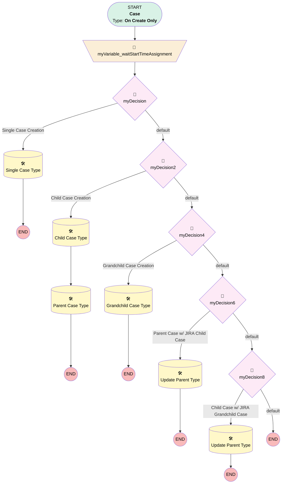

# Support | Case Type Labeling

## Flow Diagram [(_View History_)](Case_Type_Labeling-history.md)

<!-- Flow description -->

## General Information

|<!-- -->|<!-- -->|
|:---|:---|
|Process Type| Workflow|
|Label|Support | Case Type Labeling|
|Status|Active|
|Description|Used to add case type to records.|
|Interview Label|Case_Type_Labeling-6_InterviewLabel|
|Start Element Reference|[myVariable_waitStartTimeAssignment](#myvariable_waitstarttimeassignment)|
| Object Type (PM)|Case|
| Object Variable (PM)|myVariable_current|
| Old Object Variable (PM)|myVariable_old|
| Trigger Type (PM)|onCreateOnly|

## Variables

|Name|Data Type|Is Collection|Is Input|Is Output|Object Type|Description|
|:-- |:--:|:--:|:--:|:--:|:--:|:--  |
|myVariable_current|SObject|⬜|✅|✅|Case|<!-- -->|
|myVariable_old|SObject|⬜|✅|⬜|Case|<!-- -->|
|myVariable_waitStartTimeVariable|DateTime|⬜|⬜|⬜|<!-- -->|<!-- -->|

## Flow Nodes Details

### myVariable_waitStartTimeAssignment

|<!-- -->|<!-- -->|
|:---|:---|
|Type|Assignment|
|Label|[myVariable_waitStartTimeAssignment](#myvariable_waitstarttimeassignment)|
|Connector|[myDecision](#mydecision)|

#### Assignments

|Assign To Reference|Operator|Value|
|:-- |:--:|:--: |
|myVariable_waitStartTimeVariable| Assign|$Flow.CurrentDateTime|

### myDecision

|<!-- -->|<!-- -->|
|:---|:---|
|Type|Decision|
|Label|[myDecision](#mydecision)|
|Default Connector|[myDecision2](#mydecision2)|
|Default Connector Label|default|
|Index (PM)|numberValue: 0 |

#### Rule myRule_1 (Single Case Creation)

|<!-- -->|<!-- -->|
|:---|:---|
|Connector|[myRule_1_A1](#myrule_1_a1)|
|Condition Logic|and|

|Condition Id|Left Value Reference|Operator|Right Value|
|:-- |:-- |:--:|:--: |
|1|myVariable_current.ParentId| Is Null|✅|

### myDecision2

|<!-- -->|<!-- -->|
|:---|:---|
|Type|Decision|
|Label|[myDecision2](#mydecision2)|
|Default Connector|[myDecision4](#mydecision4)|
|Default Connector Label|default|
|Index (PM)|1|

#### Rule myRule_3 (Child Case Creation)

|<!-- -->|<!-- -->|
|:---|:---|
|Connector|[myRule_3_A1](#myrule_3_a1)|
|Condition Logic|and|

|Condition Id|Left Value Reference|Operator|Right Value|
|:-- |:-- |:--:|:--: |
|1|myVariable_current.ParentId| Is Null|⬜|
|2|myVariable_current.JIRA_Priority__c| Is Null|✅|
|3|myVariable_current.Parent.Case_Type__c| Not Equal To|Parent Case w/ Ancillary Billing Opp|
|4|myVariable_current.Parent.Case_Type__c| Not Equal To|Child Case w/ Ancillary Billing Opp|

### myDecision4

|<!-- -->|<!-- -->|
|:---|:---|
|Type|Decision|
|Label|[myDecision4](#mydecision4)|
|Default Connector|[myDecision6](#mydecision6)|
|Default Connector Label|default|
|Index (PM)|2|

#### Rule myRule_5 (Grandchild Case Creation)

|<!-- -->|<!-- -->|
|:---|:---|
|Connector|[myRule_5_A1](#myrule_5_a1)|
|Condition Logic|and|

|Condition Id|Left Value Reference|Operator|Right Value|
|:-- |:-- |:--:|:--: |
|1|myVariable_current.ParentId| Is Null|⬜|
|2|myVariable_current.Parent.ParentId| Is Null|⬜|
|3|myVariable_current.JIRA_Priority__c| Is Null|✅|

### myDecision6

|<!-- -->|<!-- -->|
|:---|:---|
|Type|Decision|
|Label|[myDecision6](#mydecision6)|
|Default Connector|[myDecision8](#mydecision8)|
|Default Connector Label|default|
|Index (PM)|3|

#### Rule myRule_7 (Parent Case w/ JIRA Child Case)

|<!-- -->|<!-- -->|
|:---|:---|
|Connector|[myRule_7_A1](#myrule_7_a1)|
|Condition Logic|and|

|Condition Id|Left Value Reference|Operator|Right Value|
|:-- |:-- |:--:|:--: |
|1|myVariable_current.ParentId| Is Null|⬜|
|2|myVariable_current.JIRA_Priority__c| Is Null|⬜|
|3|myVariable_current.Parent.ParentId| Is Null|✅|

### myDecision8

|<!-- -->|<!-- -->|
|:---|:---|
|Type|Decision|
|Label|[myDecision8](#mydecision8)|
|Default Connector Label|default|
|Index (PM)|4|

#### Rule myRule_9 (Child Case w/ JIRA Grandchild Case)

|<!-- -->|<!-- -->|
|:---|:---|
|Connector|[myRule_9_A1](#myrule_9_a1)|
|Condition Logic|and|

|Condition Id|Left Value Reference|Operator|Right Value|
|:-- |:-- |:--:|:--: |
|1|myVariable_current.ParentId| Is Null|⬜|
|2|myVariable_current.JIRA_Priority__c| Is Null|⬜|
|3|myVariable_current.Parent.ParentId| Is Null|⬜|

### myRule_1_A1

|<!-- -->|<!-- -->|
|:---|:---|
|Type|Record Update|
|Object|Case|
|Label|Single Case Type|
|Evaluation Type (PM)|always|
|Is Child Relationship (PM)|⬜|
|Reference (PM)|[Case]|

#### Filters (logic: **and**)

|Filter Id|Field|Operator|Value|
|:-- |:-- |:--:|:--: |
|1|Id| Equal To|myVariable_current.Id|

#### Input Assignments

|Field|Value|
|:-- |:--: |
|Case_Type__c|Single Case|

### myRule_3_A1

|<!-- -->|<!-- -->|
|:---|:---|
|Type|Record Update|
|Object|Case|
|Label|Child Case Type|
|Evaluation Type (PM)|always|
|Is Child Relationship (PM)|⬜|
|Reference (PM)|[Case]|
|Connector|[myRule_3_A2](#myrule_3_a2)|

#### Filters (logic: **and**)

|Filter Id|Field|Operator|Value|
|:-- |:-- |:--:|:--: |
|1|Id| Equal To|myVariable_current.Id|

#### Input Assignments

|Field|Value|
|:-- |:--: |
|Case_Type__c|Child Case|

### myRule_3_A2

|<!-- -->|<!-- -->|
|:---|:---|
|Type|Record Update|
|Object|Case|
|Label|Parent Case Type|
|Evaluation Type (PM)|always|
|Is Child Relationship (PM)|⬜|
|Reference (PM)|[Case].Parent Case ID|

#### Filters (logic: **and**)

|Filter Id|Field|Operator|Value|
|:-- |:-- |:--:|:--: |
|1|Id| Equal To|myVariable_current.ParentId|

#### Input Assignments

|Field|Value|
|:-- |:--: |
|Case_Type__c|Parent Case|

### myRule_5_A1

|<!-- -->|<!-- -->|
|:---|:---|
|Type|Record Update|
|Object|Case|
|Label|Grandchild Case Type|
|Evaluation Type (PM)|always|
|Is Child Relationship (PM)|⬜|
|Reference (PM)|[Case]|

#### Filters (logic: **and**)

|Filter Id|Field|Operator|Value|
|:-- |:-- |:--:|:--: |
|1|Id| Equal To|myVariable_current.Id|

#### Input Assignments

|Field|Value|
|:-- |:--: |
|Case_Type__c|Grandchild Case|

### myRule_7_A1

|<!-- -->|<!-- -->|
|:---|:---|
|Type|Record Update|
|Object|Case|
|Label|Update Parent Type|
|Evaluation Type (PM)|always|
|Is Child Relationship (PM)|⬜|
|Reference (PM)|[Case].Parent Case ID|

#### Filters (logic: **and**)

|Filter Id|Field|Operator|Value|
|:-- |:-- |:--:|:--: |
|1|Id| Equal To|myVariable_current.ParentId|

#### Input Assignments

|Field|Value|
|:-- |:--: |
|Case_Type__c|Parent Case w/ JIRA Child Case|

### myRule_9_A1

|<!-- -->|<!-- -->|
|:---|:---|
|Type|Record Update|
|Object|Case|
|Label|Update Parent Type|
|Evaluation Type (PM)|always|
|Is Child Relationship (PM)|⬜|
|Reference (PM)|[Case].Parent Case ID|

#### Filters (logic: **and**)

|Filter Id|Field|Operator|Value|
|:-- |:-- |:--:|:--: |
|1|Id| Equal To|myVariable_current.ParentId|

#### Input Assignments

|Field|Value|
|:-- |:--: |
|Case_Type__c|Child Case w/ JIRA Grandchild Case|

___

_Documentation generated from branch monitoring_myubiquity by [sfdx-hardis](https://sfdx-hardis.cloudity.com), featuring [salesforce-flow-visualiser](https://github.com/toddhalfpenny/salesforce-flow-visualiser)_