# Chat | ChatBot Analytics

## Flow Diagram [(_View History_)](Chat_ChatBot_Analytics-history.md)

```mermaid
%% If you read this, your Markdown visualizer does not handle MermaidJS syntax.
%% - If you are in VS Code, install extension `Markdown Preview Mermaid Support` at https://marketplace.visualstudio.com/items?itemName=bierner.markdown-mermaid
%% - If you are using sfdx-hardis, try to define env variable `MERMAID_MODES=cli,docker` ,then run again the command to regenerate markdown with SVG images.
%% - If you are within mkdocs-material, define mermaid plugin in `mkdocs.yml` as described in https://squidfunk.github.io/mkdocs-material/extensions/mermaid/
%% - As a last resort, you can copy-paste this MermaidJS code into https://mermaid.live/ to see the flow diagram

flowchart TB
START(["START<br/><b>LiveChatTranscript</b></br>Type: <b>On All Changes</b>"]):::startClass
click START "#general-information" "1320504008"

START --> myDecision
myDecision{"🔀 <em></em><br/>myDecision"}:::decisions
click myDecision "#mydecision" "2991729216"

myDecision10{"🔀 <em></em><br/>myDecision10"}:::decisions
click myDecision10 "#mydecision10" "769332214"

myDecision12{"🔀 <em></em><br/>myDecision12"}:::decisions
click myDecision12 "#mydecision12" "99429991"

myDecision14{"🔀 <em></em><br/>myDecision14"}:::decisions
click myDecision14 "#mydecision14" "3526788363"

myDecision16{"🔀 <em></em><br/>myDecision16"}:::decisions
click myDecision16 "#mydecision16" "1867527547"

myDecision18{"🔀 <em></em><br/>myDecision18"}:::decisions
click myDecision18 "#mydecision18" "3955625537"

myDecision2{"🔀 <em></em><br/>myDecision2"}:::decisions
click myDecision2 "#mydecision2" "4008608283"

myDecision20{"🔀 <em></em><br/>myDecision20"}:::decisions
click myDecision20 "#mydecision20" "3012736298"

myDecision22{"🔀 <em></em><br/>myDecision22"}:::decisions
click myDecision22 "#mydecision22" "4287765089"

myDecision24{"🔀 <em></em><br/>myDecision24"}:::decisions
click myDecision24 "#mydecision24" "1850697031"

myDecision26{"🔀 <em></em><br/>myDecision26"}:::decisions
click myDecision26 "#mydecision26" "1620154663"

myDecision28{"🔀 <em></em><br/>myDecision28"}:::decisions
click myDecision28 "#mydecision28" "662223658"

myDecision30{"🔀 <em></em><br/>myDecision30"}:::decisions
click myDecision30 "#mydecision30" "2951102292"

myDecision32{"🔀 <em></em><br/>myDecision32"}:::decisions
click myDecision32 "#mydecision32" "1684356946"

myDecision34{"🔀 <em></em><br/>myDecision34"}:::decisions
click myDecision34 "#mydecision34" "2203258678"

myDecision36{"🔀 <em></em><br/>myDecision36"}:::decisions
click myDecision36 "#mydecision36" "1771989598"

myDecision38{"🔀 <em></em><br/>myDecision38"}:::decisions
click myDecision38 "#mydecision38" "2488910572"

myDecision4{"🔀 <em></em><br/>myDecision4"}:::decisions
click myDecision4 "#mydecision4" "488828264"

myDecision40{"🔀 <em></em><br/>myDecision40"}:::decisions
click myDecision40 "#mydecision40" "613442117"

myDecision42{"🔀 <em></em><br/>myDecision42"}:::decisions
click myDecision42 "#mydecision42" "196290009"

myDecision44{"🔀 <em></em><br/>myDecision44"}:::decisions
click myDecision44 "#mydecision44" "4154540862"

myDecision6{"🔀 <em></em><br/>myDecision6"}:::decisions
click myDecision6 "#mydecision6" "2343097123"

myDecision8{"🔀 <em></em><br/>myDecision8"}:::decisions
click myDecision8 "#mydecision8" "1911640490"

myRule_11_A1[("🛠️ <em></em><br/>Unanswered Flag")]:::recordUpdates
click myRule_11_A1 "#myrule_11_a1" "2614681493"

myRule_13_A1[("🛠️ <em></em><br/>Ticket Flag")]:::recordUpdates
click myRule_13_A1 "#myrule_13_a1" "3353694414"

myRule_15_A1[("🛠️ <em></em><br/>After Hours Flag")]:::recordUpdates
click myRule_15_A1 "#myrule_15_a1" "2983750981"

myRule_17_A1[("🛠️ <em></em><br/>No Endpoint Verification")]:::recordUpdates
click myRule_17_A1 "#myrule_17_a1" "1906797018"

myRule_19_A1[("🛠️ <em></em><br/>Contribution Limit Flag")]:::recordUpdates
click myRule_19_A1 "#myrule_19_a1" "1992928273"

myRule_1_A1[("🛠️ <em></em><br/>ChatBot Session Flag")]:::recordUpdates
click myRule_1_A1 "#myrule_1_a1" "1935095472"

myRule_21_A1[("🛠️ <em></em><br/>Over 50 Limit Flag")]:::recordUpdates
click myRule_21_A1 "#myrule_21_a1" "1756992627"

myRule_23_A1[("🛠️ <em></em><br/>Under 50 Limit Flag")]:::recordUpdates
click myRule_23_A1 "#myrule_23_a1" "2272786364"

myRule_25_A1[("🛠️ <em></em><br/>Employer Contribution Flag")]:::recordUpdates
click myRule_25_A1 "#myrule_25_a1" "3884936007"

myRule_27_A1[("🛠️ <em></em><br/>Change Contribution Flag")]:::recordUpdates
click myRule_27_A1 "#myrule_27_a1" "533665112"

myRule_29_A1[("🛠️ <em></em><br/>Change Cont Enroll Flag")]:::recordUpdates
click myRule_29_A1 "#myrule_29_a1" "1076780109"

myRule_31_A1[("🛠️ <em></em><br/>Catch-Up Flag")]:::recordUpdates
click myRule_31_A1 "#myrule_31_a1" "1694911942"

myRule_33_A1[("🛠️ <em></em><br/>ROTH Flag")]:::recordUpdates
click myRule_33_A1 "#myrule_33_a1" "2279936958"

myRule_35_A1[("🛠️ <em></em><br/>ROTH+Pretax Combo")]:::recordUpdates
click myRule_35_A1 "#myrule_35_a1" "2949056535"

myRule_37_A1[("🛠️ <em></em><br/>ROTH PreTax Diff Flag")]:::recordUpdates
click myRule_37_A1 "#myrule_37_a1" "1099772372"

myRule_39_A1[("🛠️ <em></em><br/>Calculate Contribution Flag")]:::recordUpdates
click myRule_39_A1 "#myrule_39_a1" "553539791"

myRule_3_A1[("🛠️ <em></em><br/>Transfer Flag")]:::recordUpdates
click myRule_3_A1 "#myrule_3_a1" "240592773"

myRule_41_A1[("🛠️ <em></em><br/>Recall Payroll flag")]:::recordUpdates
click myRule_41_A1 "#myrule_41_a1" "2441124559"

myRule_43_A1[("🛠️ <em></em><br/>Contribution Timing Flag")]:::recordUpdates
click myRule_43_A1 "#myrule_43_a1" "2218899341"

myRule_45_A1[("🛠️ <em></em><br/>Manage Contribution Flag")]:::recordUpdates
click myRule_45_A1 "#myrule_45_a1" "264114958"

myRule_5_A1[("🛠️ <em></em><br/>Failed Transfer Flag")]:::recordUpdates
click myRule_5_A1 "#myrule_5_a1" "2505430852"

myRule_7_A1[("🛠️ <em></em><br/>Transfer Success Flag")]:::recordUpdates
click myRule_7_A1 "#myrule_7_a1" "225393847"

myRule_9_A1[("🛠️ <em></em><br/>Deflection Flag")]:::recordUpdates
click myRule_9_A1 "#myrule_9_a1" "959115571"

myDecision --> |"ChatBot Session"| myRule_1_A1
myDecision --> |"default"| myDecision2
myDecision10 --> |"Unanswered Flag"| myRule_11_A1
myDecision10 --> |"default"| myDecision12
myDecision12 --> |"Submit a Ticket"| myRule_13_A1
myDecision12 --> |"default"| myDecision14
myDecision14 --> |"After Hours"| myRule_15_A1
myDecision14 --> |"default"| myDecision16
myDecision16 --> |"No Endpoint Verification"| myRule_17_A1
myDecision16 --> |"default"| myDecision18
myDecision18 --> |"Contribution Limit Flag"| myRule_19_A1
myDecision18 --> |"default"| myDecision20
myDecision2 --> |"Transfer to Agent"| myRule_3_A1
myDecision2 --> |"default"| myDecision4
myDecision20 --> |"Over 50 Limits"| myRule_21_A1
myDecision20 --> |"default"| myDecision22
myDecision22 --> |"Under 50 Limit"| myRule_23_A1
myDecision22 --> |"default"| myDecision24
myDecision24 --> |"Employer Contributions"| myRule_25_A1
myDecision24 --> |"default"| myDecision26
myDecision26 --> |"Change Contributions"| myRule_27_A1
myDecision26 --> |"default"| myDecision28
myDecision28 --> |"Change Cont Enroll"| myRule_29_A1
myDecision28 --> |"default"| myDecision30
myDecision30 --> |"Catch Up"| myRule_31_A1
myDecision30 --> |"default"| myDecision32
myDecision32 --> |"ROTH Contributions"| myRule_33_A1
myDecision32 --> |"default"| myDecision34
myDecision34 --> |"ROTH + Pretax"| myRule_35_A1
myDecision34 --> |"default"| myDecision36
myDecision36 --> |"ROTH PreTax Diff"| myRule_37_A1
myDecision36 --> |"default"| myDecision38
myDecision38 --> |"Calc ER Contribution"| myRule_39_A1
myDecision38 --> |"default"| myDecision40
myDecision4 --> |"Transfer Unsuccessful"| myRule_5_A1
myDecision4 --> |"default"| myDecision6
myDecision40 --> |"Recall Payroll"| myRule_41_A1
myDecision40 --> |"default"| myDecision42
myDecision42 --> |"Annual Cont Timing"| myRule_43_A1
myDecision42 --> |"default"| myDecision44
myDecision44 --> |"Manage Contributions"| myRule_45_A1
myDecision44 --> |"default"| END_myDecision44
myDecision6 --> |"Transfer Successful"| myRule_7_A1
myDecision6 --> |"default"| myDecision8
myDecision8 --> |"Full Deflection"| myRule_9_A1
myDecision8 --> |"default"| myDecision10
myRule_11_A1 --> myDecision12
myRule_13_A1 --> myDecision14
myRule_15_A1 --> myDecision16
myRule_17_A1 --> myDecision18
myRule_19_A1 --> myDecision20
myRule_1_A1 --> myDecision2
myRule_21_A1 --> myDecision22
myRule_23_A1 --> myDecision24
myRule_25_A1 --> myDecision26
myRule_27_A1 --> myDecision28
myRule_29_A1 --> myDecision30
myRule_31_A1 --> myDecision32
myRule_33_A1 --> myDecision34
myRule_35_A1 --> myDecision36
myRule_37_A1 --> myDecision38
myRule_39_A1 --> myDecision40
myRule_3_A1 --> myDecision4
myRule_41_A1 --> myDecision42
myRule_43_A1 --> myDecision44
myRule_45_A1 --> END_myRule_45_A1
myRule_5_A1 --> myDecision6
myRule_7_A1 --> myDecision8
myRule_9_A1 --> myDecision10
END_myDecision44(( END )):::endClass
END_myRule_45_A1(( END )):::endClass


classDef actionCalls fill:#D4E4FC,color:black,text-decoration:none,max-height:100px
classDef assignments fill:#FBEED7,color:black,text-decoration:none,max-height:100px
classDef collectionProcessors fill:#F0E3FA,color:black,text-decoration:none,max-height:100px
classDef customErrors fill:#FFE9E9,color:black,text-decoration:none,max-height:100px
classDef decisions fill:#FDEAF6,color:black,text-decoration:none,max-height:100px
classDef loops fill:#FDEAF6,color:black,text-decoration:none,max-height:100px
classDef recordCreates fill:#FFF8C9,color:black,text-decoration:none,max-height:100px
classDef recordDeletes fill:#FFF8C9,color:black,text-decoration:none,max-height:100px
classDef recordLookups fill:#EDEAFF,color:black,text-decoration:none,max-height:100px
classDef recordUpdates fill:#FFF8C9,color:black,text-decoration:none,max-height:100px
classDef screens fill:#DFF6FF,color:black,text-decoration:none,max-height:100px
classDef subflows fill:#D4E4FC,color:black,text-decoration:none,max-height:100px
classDef startClass fill:#D9F2E6,color:black,text-decoration:none,max-height:100px
classDef endClass fill:#F9BABA,color:black,text-decoration:none,max-height:100px
classDef transforms fill:#FDEAF6,color:black,text-decoration:none,max-height:100px


```

<!-- Flow description -->

## General Information

|<!-- -->|<!-- -->|
|:---|:---|
|Process Type| Workflow|
|Label|Chat | ChatBot Analytics|
|Status|Obsolete|
|Description|Flags fields in chat transcript to track chatbot analytics|
|Interview Label|Chat_ChatBot_Analytics-15_InterviewLabel|
|Start Element Reference|[myDecision](#mydecision)|
| Object Type (PM)|LiveChatTranscript|
| Object Variable (PM)|myVariable_current|
| Old Object Variable (PM)|myVariable_old|
| Trigger Type (PM)|onAllChanges|

## Variables

|Name|Data Type|Is Collection|Is Input|Is Output|Object Type|Description|
|:-- |:--:|:--:|:--:|:--:|:--:|:--  |
|myVariable_current|SObject|⬜|✅|✅|LiveChatTranscript|<!-- -->|
|myVariable_old|SObject|⬜|✅|⬜|LiveChatTranscript|<!-- -->|

## Formulas

|Name|Data Type|Expression|Description|
|:-- |:--:|:-- |:--  |
|formula_myRule_1|Boolean|CONTAINS({!myVariable_current.Body}, 'Ubot the virtual assistant')   &&   ISPICKVAL({!myVariable_current.Status} , 'Completed')|<!-- -->|
|formula_myRule_11|Boolean|CONTAINS({!myVariable_current.Body}, 'Visitor: No, I need additional help')   &&   ISPICKVAL({!myVariable_current.Status} , 'Completed')|<!-- -->|
|formula_myRule_13|Boolean|CONTAINS({!myVariable_current.Body}, 'Visitor: Submit a Ticket')   &&   ISPICKVAL({!myVariable_current.Status} , 'Completed')|<!-- -->|
|formula_myRule_17|Boolean|NOT(CONTAINS({!myVariable_current.Body}, 'Visitor: Yes, that is all I need') ) && NOT(CONTAINS({!myVariable_current.Body}, 'Visitor: Submit a Ticket') ) && NOT(CONTAINS({!myVariable_current.Body}, 'Visitor: No, I need additional help') ) && NOT(CONTAINS({!myVariable_current.Body}, 'Visitor: Transfer To Agent') ) && ISPICKVAL({!myVariable_current.Status} , 'Completed')|<!-- -->|
|formula_myRule_19|Boolean|CONTAINS({!myVariable_current.Body}, 'Visitor: How much can I contribute')   &&   ISPICKVAL({!myVariable_current.Status} , 'Completed')|<!-- -->|
|formula_myRule_21|Boolean|CONTAINS({!myVariable_current.Body}, 'Visitor: I am 50 years or older')   &&   ISPICKVAL({!myVariable_current.Status} , 'Completed')|<!-- -->|
|formula_myRule_23|Boolean|CONTAINS({!myVariable_current.Body}, 'Visitor: I am under 50 years')   &&   ISPICKVAL({!myVariable_current.Status} , 'Completed')|<!-- -->|
|formula_myRule_25|Boolean|CONTAINS({!myVariable_current.Body}, 'Visitor: How much does my employer contribute')   &&   ISPICKVAL({!myVariable_current.Status} , 'Completed')|<!-- -->|
|formula_myRule_27|Boolean|CONTAINS({!myVariable_current.Body}, 'Visitor: Change contribution amount')   &&   ISPICKVAL({!myVariable_current.Status} , 'Completed')|<!-- -->|
|formula_myRule_29|Boolean|CONTAINS({!myVariable_current.Body}, 'Visitor: Edit contribution amount during setup')   &&   ISPICKVAL({!myVariable_current.Status} , 'Completed')|<!-- -->|
|formula_myRule_3|Boolean|CONTAINS({!myVariable_current.Body}, 'Visitor: Transfer To Agent')   &&   ISPICKVAL({!myVariable_current.Status} , 'Completed')|<!-- -->|
|formula_myRule_31|Boolean|CONTAINS({!myVariable_current.Body}, 'Visitor: Catch-Up contributions')   &&   ISPICKVAL({!myVariable_current.Status} , 'Completed')|<!-- -->|
|formula_myRule_33|Boolean|CONTAINS({!myVariable_current.Body}, 'Visitor: ROTH contribution options')   &&   ISPICKVAL({!myVariable_current.Status} , 'Completed')|<!-- -->|
|formula_myRule_35|Boolean|CONTAINS({!myVariable_current.Body}, 'Visitor: Combined Pre-tax and ROTH contributions')   &&   ISPICKVAL({!myVariable_current.Status} , 'Completed')|<!-- -->|
|formula_myRule_37|Boolean|CONTAINS({!myVariable_current.Body}, 'Visitor: Difference between Pre-Tax and ROTH')   &&   ISPICKVAL({!myVariable_current.Status} , 'Completed')|<!-- -->|
|formula_myRule_39|Boolean|CONTAINS({!myVariable_current.Body}, 'Visitor: Calculate Employer Contribution')   &&   ISPICKVAL({!myVariable_current.Status} , 'Completed')|<!-- -->|
|formula_myRule_41|Boolean|CONTAINS({!myVariable_current.Body}, 'Visitor: Recall a Payroll')   &&   ISPICKVAL({!myVariable_current.Status} , 'Completed')|<!-- -->|
|formula_myRule_43|Boolean|CONTAINS({!myVariable_current.Body}, 'Visitor: Annual Contribution Timing')   &&   ISPICKVAL({!myVariable_current.Status} , 'Completed')|<!-- -->|
|formula_myRule_45|Boolean|CONTAINS({!myVariable_current.Body}, 'Visitor: Manage Contributions')   &&   ISPICKVAL({!myVariable_current.Status} , 'Completed')|<!-- -->|
|formula_myRule_5|Boolean|CONTAINS({!myVariable_current.Body}, 'Agent Chatbot failed to transfer the chat to button')   &&   ISPICKVAL({!myVariable_current.Status} , 'Completed')|<!-- -->|
|formula_myRule_7|Boolean|CONTAINS({!myVariable_current.Body}, 'Agent Chatbot successfully')   &&   ISPICKVAL({!myVariable_current.Status} , 'Completed')|<!-- -->|
|formula_myRule_9|Boolean|CONTAINS({!myVariable_current.Body}, 'Visitor: Yes, that is all I need')   &&   ISPICKVAL({!myVariable_current.Status} , 'Completed')|<!-- -->|

## Flow Nodes Details

### myDecision

|<!-- -->|<!-- -->|
|:---|:---|
|Type|Decision|
|Label|[myDecision](#mydecision)|
|Default Connector|[myDecision2](#mydecision2)|
|Default Connector Label|default|
|Index (PM)|numberValue: 0 |

#### Rule myRule_1 (ChatBot Session)

|<!-- -->|<!-- -->|
|:---|:---|
|Connector|[myRule_1_A1](#myrule_1_a1)|
|Condition Logic|and|

|Condition Id|Left Value Reference|Operator|Right Value|
|:-- |:-- |:--:|:--: |
|1|formula_myRule_1| Equal To|✅|

### myDecision10

|<!-- -->|<!-- -->|
|:---|:---|
|Type|Decision|
|Label|[myDecision10](#mydecision10)|
|Default Connector|[myDecision12](#mydecision12)|
|Default Connector Label|default|
|Index (PM)|5|

#### Rule myRule_11 (Unanswered Flag)

|<!-- -->|<!-- -->|
|:---|:---|
|Connector|[myRule_11_A1](#myrule_11_a1)|
|Condition Logic|and|

|Condition Id|Left Value Reference|Operator|Right Value|
|:-- |:-- |:--:|:--: |
|1|formula_myRule_11| Equal To|✅|

### myDecision12

|<!-- -->|<!-- -->|
|:---|:---|
|Type|Decision|
|Label|[myDecision12](#mydecision12)|
|Default Connector|[myDecision14](#mydecision14)|
|Default Connector Label|default|
|Index (PM)|6|

#### Rule myRule_13 (Submit a Ticket)

|<!-- -->|<!-- -->|
|:---|:---|
|Connector|[myRule_13_A1](#myrule_13_a1)|
|Condition Logic|and|

|Condition Id|Left Value Reference|Operator|Right Value|
|:-- |:-- |:--:|:--: |
|1|formula_myRule_13| Equal To|✅|

### myDecision14

|<!-- -->|<!-- -->|
|:---|:---|
|Type|Decision|
|Label|[myDecision14](#mydecision14)|
|Default Connector|[myDecision16](#mydecision16)|
|Default Connector Label|default|
|Index (PM)|7|

#### Rule myRule_15 (After Hours)

|<!-- -->|<!-- -->|
|:---|:---|
|Connector|[myRule_15_A1](#myrule_15_a1)|
|Condition Logic|(1 OR 2 OR 3 OR 4 OR 5 OR 6 OR 7 OR 8 OR 9 OR 10 OR 11 OR 12 OR 13 OR 14 OR 15) AND 16|

|Condition Id|Left Value Reference|Operator|Right Value|
|:-- |:-- |:--:|:--: |
|1|myVariable_current.Chat_Request_Time_Text__c| Starts With|stringValue: 0 |
|2|myVariable_current.Chat_Request_Time_Text__c| Starts With|1|
|3|myVariable_current.Chat_Request_Time_Text__c| Starts With|2|
|4|myVariable_current.Chat_Request_Time_Text__c| Starts With|3|
|5|myVariable_current.Chat_Request_Time_Text__c| Starts With|4|
|6|myVariable_current.Chat_Request_Time_Text__c| Starts With|5|
|7|myVariable_current.Chat_Request_Time_Text__c| Starts With|6|
|8|myVariable_current.Chat_Request_Time_Text__c| Starts With|7|
|9|myVariable_current.Chat_Request_Time_Text__c| Starts With|18|
|10|myVariable_current.Chat_Request_Time_Text__c| Starts With|19|
|11|myVariable_current.Chat_Request_Time_Text__c| Starts With|20|
|12|myVariable_current.Chat_Request_Time_Text__c| Starts With|21|
|13|myVariable_current.Chat_Request_Time_Text__c| Starts With|22|
|14|myVariable_current.Chat_Request_Time_Text__c| Starts With|23|
|15|myVariable_current.Chat_Request_Time_Text__c| Starts With|24|
|16|myVariable_current.Status| Equal To|Completed|

### myDecision16

|<!-- -->|<!-- -->|
|:---|:---|
|Type|Decision|
|Label|[myDecision16](#mydecision16)|
|Default Connector|[myDecision18](#mydecision18)|
|Default Connector Label|default|
|Index (PM)|8|

#### Rule myRule_17 (No Endpoint Verification)

|<!-- -->|<!-- -->|
|:---|:---|
|Connector|[myRule_17_A1](#myrule_17_a1)|
|Condition Logic|and|

|Condition Id|Left Value Reference|Operator|Right Value|
|:-- |:-- |:--:|:--: |
|1|formula_myRule_17| Equal To|✅|

### myDecision18

|<!-- -->|<!-- -->|
|:---|:---|
|Type|Decision|
|Label|[myDecision18](#mydecision18)|
|Default Connector|[myDecision20](#mydecision20)|
|Default Connector Label|default|
|Index (PM)|9|

#### Rule myRule_19 (Contribution Limit Flag)

|<!-- -->|<!-- -->|
|:---|:---|
|Connector|[myRule_19_A1](#myrule_19_a1)|
|Condition Logic|and|

|Condition Id|Left Value Reference|Operator|Right Value|
|:-- |:-- |:--:|:--: |
|1|formula_myRule_19| Equal To|✅|

### myDecision2

|<!-- -->|<!-- -->|
|:---|:---|
|Type|Decision|
|Label|[myDecision2](#mydecision2)|
|Default Connector|[myDecision4](#mydecision4)|
|Default Connector Label|default|
|Index (PM)|1|

#### Rule myRule_3 (Transfer to Agent)

|<!-- -->|<!-- -->|
|:---|:---|
|Connector|[myRule_3_A1](#myrule_3_a1)|
|Condition Logic|and|

|Condition Id|Left Value Reference|Operator|Right Value|
|:-- |:-- |:--:|:--: |
|1|formula_myRule_3| Equal To|✅|

### myDecision20

|<!-- -->|<!-- -->|
|:---|:---|
|Type|Decision|
|Label|[myDecision20](#mydecision20)|
|Default Connector|[myDecision22](#mydecision22)|
|Default Connector Label|default|
|Index (PM)|10|

#### Rule myRule_21 (Over 50 Limits)

|<!-- -->|<!-- -->|
|:---|:---|
|Connector|[myRule_21_A1](#myrule_21_a1)|
|Condition Logic|and|

|Condition Id|Left Value Reference|Operator|Right Value|
|:-- |:-- |:--:|:--: |
|1|formula_myRule_21| Equal To|✅|

### myDecision22

|<!-- -->|<!-- -->|
|:---|:---|
|Type|Decision|
|Label|[myDecision22](#mydecision22)|
|Default Connector|[myDecision24](#mydecision24)|
|Default Connector Label|default|
|Index (PM)|11|

#### Rule myRule_23 (Under 50 Limit)

|<!-- -->|<!-- -->|
|:---|:---|
|Connector|[myRule_23_A1](#myrule_23_a1)|
|Condition Logic|and|

|Condition Id|Left Value Reference|Operator|Right Value|
|:-- |:-- |:--:|:--: |
|1|formula_myRule_23| Equal To|✅|

### myDecision24

|<!-- -->|<!-- -->|
|:---|:---|
|Type|Decision|
|Label|[myDecision24](#mydecision24)|
|Default Connector|[myDecision26](#mydecision26)|
|Default Connector Label|default|
|Index (PM)|12|

#### Rule myRule_25 (Employer Contributions)

|<!-- -->|<!-- -->|
|:---|:---|
|Connector|[myRule_25_A1](#myrule_25_a1)|
|Condition Logic|and|

|Condition Id|Left Value Reference|Operator|Right Value|
|:-- |:-- |:--:|:--: |
|1|formula_myRule_25| Equal To|✅|

### myDecision26

|<!-- -->|<!-- -->|
|:---|:---|
|Type|Decision|
|Label|[myDecision26](#mydecision26)|
|Default Connector|[myDecision28](#mydecision28)|
|Default Connector Label|default|
|Index (PM)|13|

#### Rule myRule_27 (Change Contributions)

|<!-- -->|<!-- -->|
|:---|:---|
|Connector|[myRule_27_A1](#myrule_27_a1)|
|Condition Logic|and|

|Condition Id|Left Value Reference|Operator|Right Value|
|:-- |:-- |:--:|:--: |
|1|formula_myRule_27| Equal To|✅|

### myDecision28

|<!-- -->|<!-- -->|
|:---|:---|
|Type|Decision|
|Label|[myDecision28](#mydecision28)|
|Default Connector|[myDecision30](#mydecision30)|
|Default Connector Label|default|
|Index (PM)|14|

#### Rule myRule_29 (Change Cont Enroll)

|<!-- -->|<!-- -->|
|:---|:---|
|Connector|[myRule_29_A1](#myrule_29_a1)|
|Condition Logic|and|

|Condition Id|Left Value Reference|Operator|Right Value|
|:-- |:-- |:--:|:--: |
|1|formula_myRule_29| Equal To|✅|

### myDecision30

|<!-- -->|<!-- -->|
|:---|:---|
|Type|Decision|
|Label|[myDecision30](#mydecision30)|
|Default Connector|[myDecision32](#mydecision32)|
|Default Connector Label|default|
|Index (PM)|15|

#### Rule myRule_31 (Catch Up)

|<!-- -->|<!-- -->|
|:---|:---|
|Connector|[myRule_31_A1](#myrule_31_a1)|
|Condition Logic|and|

|Condition Id|Left Value Reference|Operator|Right Value|
|:-- |:-- |:--:|:--: |
|1|formula_myRule_31| Equal To|✅|

### myDecision32

|<!-- -->|<!-- -->|
|:---|:---|
|Type|Decision|
|Label|[myDecision32](#mydecision32)|
|Default Connector|[myDecision34](#mydecision34)|
|Default Connector Label|default|
|Index (PM)|16|

#### Rule myRule_33 (ROTH Contributions)

|<!-- -->|<!-- -->|
|:---|:---|
|Connector|[myRule_33_A1](#myrule_33_a1)|
|Condition Logic|and|

|Condition Id|Left Value Reference|Operator|Right Value|
|:-- |:-- |:--:|:--: |
|1|formula_myRule_33| Equal To|✅|

### myDecision34

|<!-- -->|<!-- -->|
|:---|:---|
|Type|Decision|
|Label|[myDecision34](#mydecision34)|
|Default Connector|[myDecision36](#mydecision36)|
|Default Connector Label|default|
|Index (PM)|17|

#### Rule myRule_35 (ROTH + Pretax)

|<!-- -->|<!-- -->|
|:---|:---|
|Connector|[myRule_35_A1](#myrule_35_a1)|
|Condition Logic|and|

|Condition Id|Left Value Reference|Operator|Right Value|
|:-- |:-- |:--:|:--: |
|1|formula_myRule_35| Equal To|✅|

### myDecision36

|<!-- -->|<!-- -->|
|:---|:---|
|Type|Decision|
|Label|[myDecision36](#mydecision36)|
|Default Connector|[myDecision38](#mydecision38)|
|Default Connector Label|default|
|Index (PM)|18|

#### Rule myRule_37 (ROTH PreTax Diff)

|<!-- -->|<!-- -->|
|:---|:---|
|Connector|[myRule_37_A1](#myrule_37_a1)|
|Condition Logic|and|

|Condition Id|Left Value Reference|Operator|Right Value|
|:-- |:-- |:--:|:--: |
|1|formula_myRule_37| Equal To|✅|

### myDecision38

|<!-- -->|<!-- -->|
|:---|:---|
|Type|Decision|
|Label|[myDecision38](#mydecision38)|
|Default Connector|[myDecision40](#mydecision40)|
|Default Connector Label|default|
|Index (PM)|19|

#### Rule myRule_39 (Calc ER Contribution)

|<!-- -->|<!-- -->|
|:---|:---|
|Connector|[myRule_39_A1](#myrule_39_a1)|
|Condition Logic|and|

|Condition Id|Left Value Reference|Operator|Right Value|
|:-- |:-- |:--:|:--: |
|1|formula_myRule_39| Equal To|✅|

### myDecision4

|<!-- -->|<!-- -->|
|:---|:---|
|Type|Decision|
|Label|[myDecision4](#mydecision4)|
|Default Connector|[myDecision6](#mydecision6)|
|Default Connector Label|default|
|Index (PM)|2|

#### Rule myRule_5 (Transfer Unsuccessful)

|<!-- -->|<!-- -->|
|:---|:---|
|Connector|[myRule_5_A1](#myrule_5_a1)|
|Condition Logic|and|

|Condition Id|Left Value Reference|Operator|Right Value|
|:-- |:-- |:--:|:--: |
|1|formula_myRule_5| Equal To|✅|

### myDecision40

|<!-- -->|<!-- -->|
|:---|:---|
|Type|Decision|
|Label|[myDecision40](#mydecision40)|
|Default Connector|[myDecision42](#mydecision42)|
|Default Connector Label|default|
|Index (PM)|20|

#### Rule myRule_41 (Recall Payroll)

|<!-- -->|<!-- -->|
|:---|:---|
|Connector|[myRule_41_A1](#myrule_41_a1)|
|Condition Logic|and|

|Condition Id|Left Value Reference|Operator|Right Value|
|:-- |:-- |:--:|:--: |
|1|formula_myRule_41| Equal To|✅|

### myDecision42

|<!-- -->|<!-- -->|
|:---|:---|
|Type|Decision|
|Label|[myDecision42](#mydecision42)|
|Default Connector|[myDecision44](#mydecision44)|
|Default Connector Label|default|
|Index (PM)|21|

#### Rule myRule_43 (Annual Cont Timing)

|<!-- -->|<!-- -->|
|:---|:---|
|Connector|[myRule_43_A1](#myrule_43_a1)|
|Condition Logic|and|

|Condition Id|Left Value Reference|Operator|Right Value|
|:-- |:-- |:--:|:--: |
|1|formula_myRule_43| Equal To|✅|

### myDecision44

|<!-- -->|<!-- -->|
|:---|:---|
|Type|Decision|
|Label|[myDecision44](#mydecision44)|
|Default Connector Label|default|
|Index (PM)|22|

#### Rule myRule_45 (Manage Contributions)

|<!-- -->|<!-- -->|
|:---|:---|
|Connector|[myRule_45_A1](#myrule_45_a1)|
|Condition Logic|and|

|Condition Id|Left Value Reference|Operator|Right Value|
|:-- |:-- |:--:|:--: |
|1|formula_myRule_45| Equal To|✅|

### myDecision6

|<!-- -->|<!-- -->|
|:---|:---|
|Type|Decision|
|Label|[myDecision6](#mydecision6)|
|Default Connector|[myDecision8](#mydecision8)|
|Default Connector Label|default|
|Index (PM)|3|

#### Rule myRule_7 (Transfer Successful)

|<!-- -->|<!-- -->|
|:---|:---|
|Connector|[myRule_7_A1](#myrule_7_a1)|
|Condition Logic|and|

|Condition Id|Left Value Reference|Operator|Right Value|
|:-- |:-- |:--:|:--: |
|1|formula_myRule_7| Equal To|✅|

### myDecision8

|<!-- -->|<!-- -->|
|:---|:---|
|Type|Decision|
|Label|[myDecision8](#mydecision8)|
|Default Connector|[myDecision10](#mydecision10)|
|Default Connector Label|default|
|Index (PM)|4|

#### Rule myRule_9 (Full Deflection)

|<!-- -->|<!-- -->|
|:---|:---|
|Connector|[myRule_9_A1](#myrule_9_a1)|
|Condition Logic|and|

|Condition Id|Left Value Reference|Operator|Right Value|
|:-- |:-- |:--:|:--: |
|1|formula_myRule_9| Equal To|✅|

### myRule_11_A1

|<!-- -->|<!-- -->|
|:---|:---|
|Type|Record Update|
|Object|LiveChatTranscript|
|Label|Unanswered Flag|
|Evaluation Type (PM)|always|
|Extra Type Info (PM)|<!-- -->|
|Is Child Relationship (PM)|⬜|
|Reference (PM)|[LiveChatTranscript]|
|Reference Target Field (PM)|<!-- -->|
|Connector|[myDecision12](#mydecision12)|

#### Filters (logic: **and**)

|Filter Id|Field|Operator|Value|
|:-- |:-- |:--:|:--: |
|1|Id| Equal To|myVariable_current.Id|

#### Input Assignments

|Field|Value|
|:-- |:--: |
|ChatBot_Unanswered__c|1|

### myRule_13_A1

|<!-- -->|<!-- -->|
|:---|:---|
|Type|Record Update|
|Object|LiveChatTranscript|
|Label|Ticket Flag|
|Evaluation Type (PM)|always|
|Extra Type Info (PM)|<!-- -->|
|Is Child Relationship (PM)|⬜|
|Reference (PM)|[LiveChatTranscript]|
|Reference Target Field (PM)|<!-- -->|
|Connector|[myDecision14](#mydecision14)|

#### Filters (logic: **and**)

|Filter Id|Field|Operator|Value|
|:-- |:-- |:--:|:--: |
|1|Id| Equal To|myVariable_current.Id|

#### Input Assignments

|Field|Value|
|:-- |:--: |
|Submit_a_Ticket__c|1|

### myRule_15_A1

|<!-- -->|<!-- -->|
|:---|:---|
|Type|Record Update|
|Object|LiveChatTranscript|
|Label|After Hours Flag|
|Evaluation Type (PM)|always|
|Extra Type Info (PM)|<!-- -->|
|Is Child Relationship (PM)|⬜|
|Reference (PM)|[LiveChatTranscript]|
|Reference Target Field (PM)|<!-- -->|
|Connector|[myDecision16](#mydecision16)|

#### Filters (logic: **and**)

|Filter Id|Field|Operator|Value|
|:-- |:-- |:--:|:--: |
|1|Id| Equal To|myVariable_current.Id|

#### Input Assignments

|Field|Value|
|:-- |:--: |
|Outside_Biz_Hours__c|1|

### myRule_17_A1

|<!-- -->|<!-- -->|
|:---|:---|
|Type|Record Update|
|Object|LiveChatTranscript|
|Label|No Endpoint Verification|
|Evaluation Type (PM)|always|
|Extra Type Info (PM)|<!-- -->|
|Is Child Relationship (PM)|⬜|
|Reference (PM)|[LiveChatTranscript]|
|Reference Target Field (PM)|<!-- -->|
|Connector|[myDecision18](#mydecision18)|

#### Filters (logic: **and**)

|Filter Id|Field|Operator|Value|
|:-- |:-- |:--:|:--: |
|1|Id| Equal To|myVariable_current.Id|

#### Input Assignments

|Field|Value|
|:-- |:--: |
|No_Verified_Endpoint__c|1|

### myRule_19_A1

|<!-- -->|<!-- -->|
|:---|:---|
|Type|Record Update|
|Object|LiveChatTranscript|
|Label|Contribution Limit Flag|
|Evaluation Type (PM)|always|
|Extra Type Info (PM)|<!-- -->|
|Is Child Relationship (PM)|⬜|
|Reference (PM)|[LiveChatTranscript]|
|Reference Target Field (PM)|<!-- -->|
|Connector|[myDecision20](#mydecision20)|

#### Filters (logic: **and**)

|Filter Id|Field|Operator|Value|
|:-- |:-- |:--:|:--: |
|1|Id| Equal To|myVariable_current.Id|

#### Input Assignments

|Field|Value|
|:-- |:--: |
|Contribution_Limit__c|1|

### myRule_1_A1

|<!-- -->|<!-- -->|
|:---|:---|
|Type|Record Update|
|Object|LiveChatTranscript|
|Label|ChatBot Session Flag|
|Evaluation Type (PM)|always|
|Extra Type Info (PM)|<!-- -->|
|Is Child Relationship (PM)|⬜|
|Reference (PM)|[LiveChatTranscript]|
|Reference Target Field (PM)|<!-- -->|
|Connector|[myDecision2](#mydecision2)|

#### Filters (logic: **and**)

|Filter Id|Field|Operator|Value|
|:-- |:-- |:--:|:--: |
|1|Id| Equal To|myVariable_current.Id|

#### Input Assignments

|Field|Value|
|:-- |:--: |
|ChatBot_Session__c|1|

### myRule_21_A1

|<!-- -->|<!-- -->|
|:---|:---|
|Type|Record Update|
|Object|LiveChatTranscript|
|Label|Over 50 Limit Flag|
|Evaluation Type (PM)|always|
|Extra Type Info (PM)|<!-- -->|
|Is Child Relationship (PM)|⬜|
|Reference (PM)|[LiveChatTranscript]|
|Reference Target Field (PM)|<!-- -->|
|Connector|[myDecision22](#mydecision22)|

#### Filters (logic: **and**)

|Filter Id|Field|Operator|Value|
|:-- |:-- |:--:|:--: |
|1|Id| Equal To|myVariable_current.Id|

#### Input Assignments

|Field|Value|
|:-- |:--: |
|X50_and_over_contribution_limit__c|1|

### myRule_23_A1

|<!-- -->|<!-- -->|
|:---|:---|
|Type|Record Update|
|Object|LiveChatTranscript|
|Label|Under 50 Limit Flag|
|Evaluation Type (PM)|always|
|Extra Type Info (PM)|<!-- -->|
|Is Child Relationship (PM)|⬜|
|Reference (PM)|[LiveChatTranscript]|
|Reference Target Field (PM)|<!-- -->|
|Connector|[myDecision24](#mydecision24)|

#### Filters (logic: **and**)

|Filter Id|Field|Operator|Value|
|:-- |:-- |:--:|:--: |
|1|Id| Equal To|myVariable_current.Id|

#### Input Assignments

|Field|Value|
|:-- |:--: |
|Under_50_contribution_limit__c|1|

### myRule_25_A1

|<!-- -->|<!-- -->|
|:---|:---|
|Type|Record Update|
|Object|LiveChatTranscript|
|Label|Employer Contribution Flag|
|Evaluation Type (PM)|always|
|Extra Type Info (PM)|<!-- -->|
|Is Child Relationship (PM)|⬜|
|Reference (PM)|[LiveChatTranscript]|
|Reference Target Field (PM)|<!-- -->|
|Connector|[myDecision26](#mydecision26)|

#### Filters (logic: **and**)

|Filter Id|Field|Operator|Value|
|:-- |:-- |:--:|:--: |
|1|Id| Equal To|myVariable_current.Id|

#### Input Assignments

|Field|Value|
|:-- |:--: |
|Employer_Contribution_Amount__c|1|

### myRule_27_A1

|<!-- -->|<!-- -->|
|:---|:---|
|Type|Record Update|
|Object|LiveChatTranscript|
|Label|Change Contribution Flag|
|Evaluation Type (PM)|always|
|Extra Type Info (PM)|<!-- -->|
|Is Child Relationship (PM)|⬜|
|Reference (PM)|[LiveChatTranscript]|
|Reference Target Field (PM)|<!-- -->|
|Connector|[myDecision28](#mydecision28)|

#### Filters (logic: **and**)

|Filter Id|Field|Operator|Value|
|:-- |:-- |:--:|:--: |
|1|Id| Equal To|myVariable_current.Id|

#### Input Assignments

|Field|Value|
|:-- |:--: |
|Change_Contribution_Amount__c|1|

### myRule_29_A1

|<!-- -->|<!-- -->|
|:---|:---|
|Type|Record Update|
|Object|LiveChatTranscript|
|Label|Change Cont Enroll Flag|
|Evaluation Type (PM)|always|
|Extra Type Info (PM)|<!-- -->|
|Is Child Relationship (PM)|⬜|
|Reference (PM)|[LiveChatTranscript]|
|Reference Target Field (PM)|<!-- -->|
|Connector|[myDecision30](#mydecision30)|

#### Filters (logic: **and**)

|Filter Id|Field|Operator|Value|
|:-- |:-- |:--:|:--: |
|1|Id| Equal To|myVariable_current.Id|

#### Input Assignments

|Field|Value|
|:-- |:--: |
|Change_contribution_during_enrollment__c|1|

### myRule_31_A1

|<!-- -->|<!-- -->|
|:---|:---|
|Type|Record Update|
|Object|LiveChatTranscript|
|Label|Catch-Up Flag|
|Evaluation Type (PM)|always|
|Extra Type Info (PM)|<!-- -->|
|Is Child Relationship (PM)|⬜|
|Reference (PM)|[LiveChatTranscript]|
|Reference Target Field (PM)|<!-- -->|
|Connector|[myDecision32](#mydecision32)|

#### Filters (logic: **and**)

|Filter Id|Field|Operator|Value|
|:-- |:-- |:--:|:--: |
|1|Id| Equal To|myVariable_current.Id|

#### Input Assignments

|Field|Value|
|:-- |:--: |
|Catch_Up_Contributions__c|1|

### myRule_33_A1

|<!-- -->|<!-- -->|
|:---|:---|
|Type|Record Update|
|Object|LiveChatTranscript|
|Label|ROTH Flag|
|Evaluation Type (PM)|always|
|Extra Type Info (PM)|<!-- -->|
|Is Child Relationship (PM)|⬜|
|Reference (PM)|[LiveChatTranscript]|
|Reference Target Field (PM)|<!-- -->|
|Connector|[myDecision34](#mydecision34)|

#### Filters (logic: **and**)

|Filter Id|Field|Operator|Value|
|:-- |:-- |:--:|:--: |
|1|Id| Equal To|myVariable_current.Id|

#### Input Assignments

|Field|Value|
|:-- |:--: |
|ROTH_Contributions__c|1|

### myRule_35_A1

|<!-- -->|<!-- -->|
|:---|:---|
|Type|Record Update|
|Object|LiveChatTranscript|
|Label|ROTH+Pretax Combo|
|Evaluation Type (PM)|always|
|Extra Type Info (PM)|<!-- -->|
|Is Child Relationship (PM)|⬜|
|Reference (PM)|[LiveChatTranscript]|
|Reference Target Field (PM)|<!-- -->|
|Connector|[myDecision36](#mydecision36)|

#### Filters (logic: **and**)

|Filter Id|Field|Operator|Value|
|:-- |:-- |:--:|:--: |
|1|Id| Equal To|myVariable_current.Id|

#### Input Assignments

|Field|Value|
|:-- |:--: |
|Pre_Tax_ROTH_Combo__c|1|

### myRule_37_A1

|<!-- -->|<!-- -->|
|:---|:---|
|Type|Record Update|
|Object|LiveChatTranscript|
|Label|ROTH PreTax Diff Flag|
|Evaluation Type (PM)|always|
|Extra Type Info (PM)|<!-- -->|
|Is Child Relationship (PM)|⬜|
|Reference (PM)|[LiveChatTranscript]|
|Reference Target Field (PM)|<!-- -->|
|Connector|[myDecision38](#mydecision38)|

#### Filters (logic: **and**)

|Filter Id|Field|Operator|Value|
|:-- |:-- |:--:|:--: |
|1|Id| Equal To|myVariable_current.Id|

#### Input Assignments

|Field|Value|
|:-- |:--: |
|ROTH_and_Pre_Tax_difference__c|1|

### myRule_39_A1

|<!-- -->|<!-- -->|
|:---|:---|
|Type|Record Update|
|Object|LiveChatTranscript|
|Label|Calculate Contribution Flag|
|Evaluation Type (PM)|always|
|Extra Type Info (PM)|<!-- -->|
|Is Child Relationship (PM)|⬜|
|Reference (PM)|[LiveChatTranscript]|
|Reference Target Field (PM)|<!-- -->|
|Connector|[myDecision40](#mydecision40)|

#### Filters (logic: **and**)

|Filter Id|Field|Operator|Value|
|:-- |:-- |:--:|:--: |
|1|Id| Equal To|myVariable_current.Id|

#### Input Assignments

|Field|Value|
|:-- |:--: |
|Calculate_Employer_Contribution__c|1|

### myRule_3_A1

|<!-- -->|<!-- -->|
|:---|:---|
|Type|Record Update|
|Object|LiveChatTranscript|
|Label|Transfer Flag|
|Evaluation Type (PM)|always|
|Extra Type Info (PM)|<!-- -->|
|Is Child Relationship (PM)|⬜|
|Reference (PM)|[LiveChatTranscript]|
|Reference Target Field (PM)|<!-- -->|
|Connector|[myDecision4](#mydecision4)|

#### Filters (logic: **and**)

|Filter Id|Field|Operator|Value|
|:-- |:-- |:--:|:--: |
|1|Id| Equal To|myVariable_current.Id|

#### Input Assignments

|Field|Value|
|:-- |:--: |
|Transfer_to_Agent__c|1|

### myRule_41_A1

|<!-- -->|<!-- -->|
|:---|:---|
|Type|Record Update|
|Object|LiveChatTranscript|
|Label|Recall Payroll flag|
|Evaluation Type (PM)|always|
|Extra Type Info (PM)|<!-- -->|
|Is Child Relationship (PM)|⬜|
|Reference (PM)|[LiveChatTranscript]|
|Reference Target Field (PM)|<!-- -->|
|Connector|[myDecision42](#mydecision42)|

#### Filters (logic: **and**)

|Filter Id|Field|Operator|Value|
|:-- |:-- |:--:|:--: |
|1|Id| Equal To|myVariable_current.Id|

#### Input Assignments

|Field|Value|
|:-- |:--: |
|Recall_a_payroll__c|1|

### myRule_43_A1

|<!-- -->|<!-- -->|
|:---|:---|
|Type|Record Update|
|Object|LiveChatTranscript|
|Label|Contribution Timing Flag|
|Evaluation Type (PM)|always|
|Extra Type Info (PM)|<!-- -->|
|Is Child Relationship (PM)|⬜|
|Reference (PM)|[LiveChatTranscript]|
|Reference Target Field (PM)|<!-- -->|
|Connector|[myDecision44](#mydecision44)|

#### Filters (logic: **and**)

|Filter Id|Field|Operator|Value|
|:-- |:-- |:--:|:--: |
|1|Id| Equal To|myVariable_current.Id|

#### Input Assignments

|Field|Value|
|:-- |:--: |
|Annual_contribution_timing__c|1|

### myRule_45_A1

|<!-- -->|<!-- -->|
|:---|:---|
|Type|Record Update|
|Object|LiveChatTranscript|
|Label|Manage Contribution Flag|
|Evaluation Type (PM)|always|
|Extra Type Info (PM)|<!-- -->|
|Is Child Relationship (PM)|⬜|
|Reference (PM)|[LiveChatTranscript]|
|Reference Target Field (PM)|<!-- -->|

#### Filters (logic: **and**)

|Filter Id|Field|Operator|Value|
|:-- |:-- |:--:|:--: |
|1|Id| Equal To|myVariable_current.Id|

#### Input Assignments

|Field|Value|
|:-- |:--: |
|Manage_Contributions__c|1|

### myRule_5_A1

|<!-- -->|<!-- -->|
|:---|:---|
|Type|Record Update|
|Object|LiveChatTranscript|
|Label|Failed Transfer Flag|
|Evaluation Type (PM)|always|
|Extra Type Info (PM)|<!-- -->|
|Is Child Relationship (PM)|⬜|
|Reference (PM)|[LiveChatTranscript]|
|Reference Target Field (PM)|<!-- -->|
|Connector|[myDecision6](#mydecision6)|

#### Filters (logic: **and**)

|Filter Id|Field|Operator|Value|
|:-- |:-- |:--:|:--: |
|1|Id| Equal To|myVariable_current.Id|

#### Input Assignments

|Field|Value|
|:-- |:--: |
|Transfer_Unsuccessful__c|1|

### myRule_7_A1

|<!-- -->|<!-- -->|
|:---|:---|
|Type|Record Update|
|Object|LiveChatTranscript|
|Label|Transfer Success Flag|
|Evaluation Type (PM)|always|
|Extra Type Info (PM)|<!-- -->|
|Is Child Relationship (PM)|⬜|
|Reference (PM)|[LiveChatTranscript]|
|Reference Target Field (PM)|<!-- -->|
|Connector|[myDecision8](#mydecision8)|

#### Filters (logic: **and**)

|Filter Id|Field|Operator|Value|
|:-- |:-- |:--:|:--: |
|1|Id| Equal To|myVariable_current.Id|

#### Input Assignments

|Field|Value|
|:-- |:--: |
|Transfer_Successful__c|1|

### myRule_9_A1

|<!-- -->|<!-- -->|
|:---|:---|
|Type|Record Update|
|Object|LiveChatTranscript|
|Label|Deflection Flag|
|Evaluation Type (PM)|always|
|Extra Type Info (PM)|<!-- -->|
|Is Child Relationship (PM)|⬜|
|Reference (PM)|[LiveChatTranscript]|
|Reference Target Field (PM)|<!-- -->|
|Connector|[myDecision10](#mydecision10)|

#### Filters (logic: **and**)

|Filter Id|Field|Operator|Value|
|:-- |:-- |:--:|:--: |
|1|Id| Equal To|myVariable_current.Id|

#### Input Assignments

|Field|Value|
|:-- |:--: |
|Chatbot_Success__c|1|

___

_Documentation generated from branch monitoring_myubiquity by [sfdx-hardis](https://sfdx-hardis.cloudity.com), featuring [salesforce-flow-visualiser](https://github.com/toddhalfpenny/salesforce-flow-visualiser)_