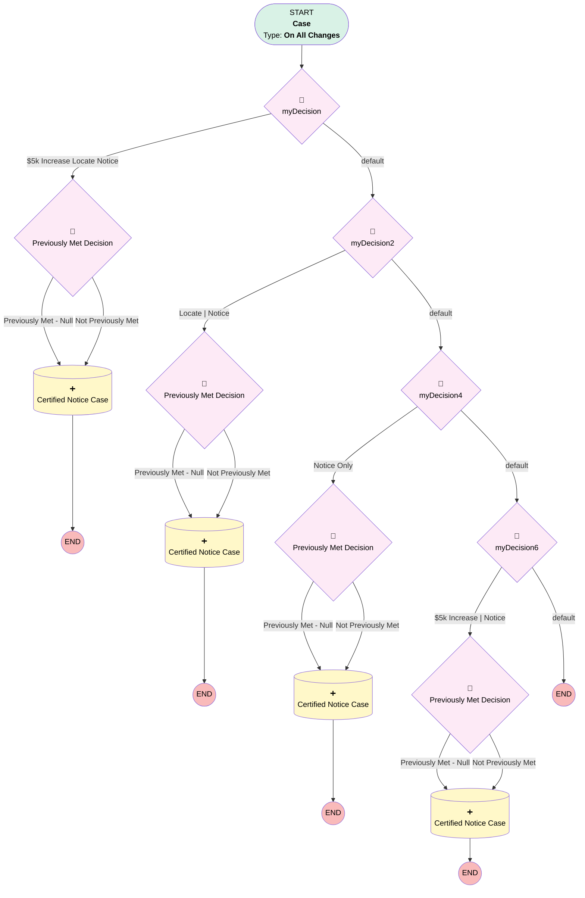

# Compliance | ForceDist Notice Case

## Flow Diagram [(_View History_)](Compliance_ForceDist_Notice_Case-history.md)

<!-- Flow description -->

## General Information

|<!-- -->|<!-- -->|
|:---|:---|
|Process Type| Workflow|
|Label|Compliance | ForceDist Notice Case|
|Status|Active|
|Description|Creates Send Cert Notice Case when Plan Amendment and/or Locate Cases are Done|
|Interview Label|Compliance_ForceDist_Notice_Case-12_InterviewLabel|
|Start Element Reference|[myDecision](#mydecision)|
| Object Type (PM)|Case|
| Object Variable (PM)|myVariable_current|
| Old Object Variable (PM)|myVariable_old|
| Trigger Type (PM)|onAllChanges|

## Variables

|Name|Data Type|Is Collection|Is Input|Is Output|Object Type|Description|
|:-- |:--:|:--:|:--:|:--:|:--:|:--  |
|myVariable_current|SObject|⬜|✅|✅|Case|<!-- -->|
|myVariable_old|SObject|⬜|✅|⬜|Case|<!-- -->|

## Flow Nodes Details

### myDecision

|<!-- -->|<!-- -->|
|:---|:---|
|Type|Decision|
|Label|[myDecision](#mydecision)|
|Default Connector|[myDecision2](#mydecision2)|
|Default Connector Label|default|
|Index (PM)|numberValue: 0 |

#### Rule myRule_1 ($5k Increase Locate Notice)

|<!-- -->|<!-- -->|
|:---|:---|
|Connector|[myRule_1_pmetdec](#myrule_1_pmetdec)|
|Condition Logic|and|

|Condition Id|Left Value Reference|Operator|Right Value|
|:-- |:-- |:--:|:--: |
|1|myVariable_current.Number_of_Child_Cases_Closed__c| Equal To|3|
|2|myVariable_current.Sub_Category__c| Equal To|$5k Increase-Locate-Notice|
|3|myVariable_current.Sub_Category__c| Is Null|⬜|
|4|myVariable_current.Number_of_Child_Cases_Open__c| Equal To|3|

### myDecision2

|<!-- -->|<!-- -->|
|:---|:---|
|Type|Decision|
|Label|[myDecision2](#mydecision2)|
|Default Connector|[myDecision4](#mydecision4)|
|Default Connector Label|default|
|Index (PM)|1|

#### Rule myRule_3 (Locate | Notice)

|<!-- -->|<!-- -->|
|:---|:---|
|Connector|[myRule_3_pmetdec](#myrule_3_pmetdec)|
|Condition Logic|and|

|Condition Id|Left Value Reference|Operator|Right Value|
|:-- |:-- |:--:|:--: |
|1|myVariable_current.Number_of_Child_Cases_Closed__c| Equal To|1|
|2|myVariable_current.Sub_Category__c| Is Null|⬜|
|3|myVariable_current.Sub_Category__c| Equal To|Locate-Notice|
|4|myVariable_current.Number_of_Child_Cases_Open__c| Equal To|1|

### myDecision4

|<!-- -->|<!-- -->|
|:---|:---|
|Type|Decision|
|Label|[myDecision4](#mydecision4)|
|Default Connector|[myDecision6](#mydecision6)|
|Default Connector Label|default|
|Index (PM)|2|

#### Rule myRule_5 (Notice Only)

|<!-- -->|<!-- -->|
|:---|:---|
|Connector|[myRule_5_pmetdec](#myrule_5_pmetdec)|
|Condition Logic|and|

|Condition Id|Left Value Reference|Operator|Right Value|
|:-- |:-- |:--:|:--: |
|1|myVariable_current.Sub_Category__c| Is Null|⬜|
|2|myVariable_current.Sub_Category__c| Equal To|Notice|

### myDecision6

|<!-- -->|<!-- -->|
|:---|:---|
|Type|Decision|
|Label|[myDecision6](#mydecision6)|
|Default Connector Label|default|
|Index (PM)|3|

#### Rule myRule_7 ($5k Increase | Notice)

|<!-- -->|<!-- -->|
|:---|:---|
|Connector|[myRule_7_pmetdec](#myrule_7_pmetdec)|
|Condition Logic|and|

|Condition Id|Left Value Reference|Operator|Right Value|
|:-- |:-- |:--:|:--: |
|1|myVariable_current.Sub_Category__c| Is Null|⬜|
|2|myVariable_current.Number_of_Child_Cases_Closed__c| Equal To|2|
|3|myVariable_current.Number_of_Child_Cases_Open__c| Equal To|2|
|4|myVariable_current.Sub_Category__c| Equal To|$5k Increase-Notice|

### myRule_1_pmetdec

|<!-- -->|<!-- -->|
|:---|:---|
|Type|Decision|
|Label|Previously Met Decision|
|Default Connector|[myRule_1_A1](#myrule_1_a1)|
|Default Connector Label|Not Previously Met|

#### Rule myRule_1_pmetnullrule (Previously Met - Null)

|<!-- -->|<!-- -->|
|:---|:---|
|Connector|[myRule_1_A1](#myrule_1_a1)|
|Condition Logic|or|

|Condition Id|Left Value Reference|Operator|Right Value|
|:-- |:-- |:--:|:--: |
|1|myVariable_old| Is Null|✅|

#### Rule myRule_1_pmetrule (Previously Met - Prev)

|<!-- -->|<!-- -->|
|:---|:---|
|Condition Logic|and|

|Condition Id|Left Value Reference|Operator|Right Value|
|:-- |:-- |:--:|:--: |
|1|myVariable_old.Number_of_Child_Cases_Closed__c| Equal To|3|
|2|myVariable_old.Sub_Category__c| Equal To|$5k Increase-Locate-Notice|
|3|myVariable_old.Sub_Category__c| Is Null|⬜|
|4|myVariable_old.Number_of_Child_Cases_Open__c| Equal To|3|

### myRule_3_pmetdec

|<!-- -->|<!-- -->|
|:---|:---|
|Type|Decision|
|Label|Previously Met Decision|
|Default Connector|[myRule_3_A1](#myrule_3_a1)|
|Default Connector Label|Not Previously Met|

#### Rule myRule_3_pmetnullrule (Previously Met - Null)

|<!-- -->|<!-- -->|
|:---|:---|
|Connector|[myRule_3_A1](#myrule_3_a1)|
|Condition Logic|or|

|Condition Id|Left Value Reference|Operator|Right Value|
|:-- |:-- |:--:|:--: |
|1|myVariable_old| Is Null|✅|

#### Rule myRule_3_pmetrule (Previously Met - Prev)

|<!-- -->|<!-- -->|
|:---|:---|
|Condition Logic|and|

|Condition Id|Left Value Reference|Operator|Right Value|
|:-- |:-- |:--:|:--: |
|1|myVariable_old.Number_of_Child_Cases_Closed__c| Equal To|1|
|2|myVariable_old.Sub_Category__c| Is Null|⬜|
|3|myVariable_old.Sub_Category__c| Equal To|Locate-Notice|
|4|myVariable_old.Number_of_Child_Cases_Open__c| Equal To|1|

### myRule_5_pmetdec

|<!-- -->|<!-- -->|
|:---|:---|
|Type|Decision|
|Label|Previously Met Decision|
|Default Connector|[myRule_5_A1](#myrule_5_a1)|
|Default Connector Label|Not Previously Met|

#### Rule myRule_5_pmetnullrule (Previously Met - Null)

|<!-- -->|<!-- -->|
|:---|:---|
|Connector|[myRule_5_A1](#myrule_5_a1)|
|Condition Logic|or|

|Condition Id|Left Value Reference|Operator|Right Value|
|:-- |:-- |:--:|:--: |
|1|myVariable_old| Is Null|✅|

#### Rule myRule_5_pmetrule (Previously Met - Prev)

|<!-- -->|<!-- -->|
|:---|:---|
|Condition Logic|and|

|Condition Id|Left Value Reference|Operator|Right Value|
|:-- |:-- |:--:|:--: |
|1|myVariable_old.Sub_Category__c| Is Null|⬜|
|2|myVariable_old.Sub_Category__c| Equal To|Notice|

### myRule_7_pmetdec

|<!-- -->|<!-- -->|
|:---|:---|
|Type|Decision|
|Label|Previously Met Decision|
|Default Connector|[myRule_7_A1](#myrule_7_a1)|
|Default Connector Label|Not Previously Met|

#### Rule myRule_7_pmetnullrule (Previously Met - Null)

|<!-- -->|<!-- -->|
|:---|:---|
|Connector|[myRule_7_A1](#myrule_7_a1)|
|Condition Logic|or|

|Condition Id|Left Value Reference|Operator|Right Value|
|:-- |:-- |:--:|:--: |
|1|myVariable_old| Is Null|✅|

#### Rule myRule_7_pmetrule (Previously Met - Prev)

|<!-- -->|<!-- -->|
|:---|:---|
|Condition Logic|and|

|Condition Id|Left Value Reference|Operator|Right Value|
|:-- |:-- |:--:|:--: |
|1|myVariable_old.Sub_Category__c| Is Null|⬜|
|2|myVariable_old.Number_of_Child_Cases_Closed__c| Equal To|2|
|3|myVariable_old.Number_of_Child_Cases_Open__c| Equal To|2|
|4|myVariable_old.Sub_Category__c| Equal To|$5k Increase-Notice|

### myRule_1_A1

|<!-- -->|<!-- -->|
|:---|:---|
|Type|Record Create|
|Object|Case|
|Label|Certified Notice Case|

#### Input Assignments

|Field|Value|
|:-- |:--: |
|AccountId|myVariable_current.AccountId|
|BusinessHoursId|01m37000000L07KAAS|
|Case_Type__c|Child Case|
|Category__c|Distributions / Loans|
|ContactId|myVariable_current.ContactId|
|Department__c|Servicing|
|Description|See Parent Case for list of ex-employees to send certified mailings to prior to force out distribution|
|Inquiry_Source__c|Client|
|Origin|Saver Inbox|
|OwnerId|005370000041V3FAAU|
|ParentId|myVariable_current.Id|
|Plan__c|myVariable_current.Plan__c|
|Priority|Medium|
|RecordTypeId|01237000000AZr4AAG|
|Status|New|
|Sub_Category__c|Force Out|
|Subject|Force Out Distributions - Certified Mailings|

### myRule_3_A1

|<!-- -->|<!-- -->|
|:---|:---|
|Type|Record Create|
|Object|Case|
|Label|Certified Notice Case|

#### Input Assignments

|Field|Value|
|:-- |:--: |
|AccountId|myVariable_current.AccountId|
|BusinessHoursId|01m37000000L07KAAS|
|Category__c|Compliance|
|ContactId|myVariable_current.ContactId|
|Department__c|Servicing|
|Description|See Parent Case for list of ex-employees to send certified mailings to prior to force out distribution|
|Inquiry_Source__c|Client|
|Origin|Saver Inbox|
|OwnerId|005370000041V3FAAU|
|ParentId|myVariable_current.Id|
|Plan__c|myVariable_current.Plan__c|
|Priority|Medium|
|RecordTypeId|01237000000AZr4AAG|
|Status|New|
|Sub_Category__c|Force Out|
|Subject|Force Out Distributions - Certified Mailings|
|Type|Child Case|

### myRule_5_A1

|<!-- -->|<!-- -->|
|:---|:---|
|Type|Record Create|
|Object|Case|
|Label|Certified Notice Case|

#### Input Assignments

|Field|Value|
|:-- |:--: |
|AccountId|myVariable_current.AccountId|
|BusinessHoursId|01m37000000L07KAAS|
|Case_Type__c|Child Case|
|Category__c|Compliance|
|ContactId|myVariable_current.ContactId|
|Department__c|Servicing|
|Description|See Parent Case for list of ex-employees to send certified mailings to prior to force out distribution|
|Inquiry_Source__c|Client|
|Origin|Saver Inbox|
|OwnerId|005370000041V3FAAU|
|ParentId|myVariable_current.Id|
|Plan__c|myVariable_current.Plan__c|
|Priority|Medium|
|RecordTypeId|01237000000AZr4AAG|
|Status|New|
|Sub_Category__c|Force Out|
|Subject|Force Out Distributions - Certified Mailings|

### myRule_7_A1

|<!-- -->|<!-- -->|
|:---|:---|
|Type|Record Create|
|Object|Case|
|Label|Certified Notice Case|

#### Input Assignments

|Field|Value|
|:-- |:--: |
|AccountId|myVariable_current.AccountId|
|BusinessHoursId|01m37000000L07KAAS|
|Case_Type__c|Child Case|
|Category__c|Compliance|
|ContactId|myVariable_current.ContactId|
|Department__c|Servicing|
|Description|See Parent Case for list of ex-employees to send certified mailings to prior to force out distribution|
|Inquiry_Source__c|Client|
|Origin|Saver Inbox|
|OwnerId|005370000041V3FAAU|
|ParentId|myVariable_current.Id|
|Plan__c|myVariable_current.Plan__c|
|Priority|Medium|
|RecordTypeId|01237000000AZr4AAG|
|Status|New|
|Sub_Category__c|Force Out|
|Subject|Force Out Distributions - Certified Mailings|

___

_Documentation generated from branch monitoring_myubiquity by [sfdx-hardis](https://sfdx-hardis.cloudity.com), featuring [salesforce-flow-visualiser](https://github.com/toddhalfpenny/salesforce-flow-visualiser)_