# Compliance | ForceDist Status Changes

## Flow Diagram [(_View History_)](Compliance_ForceDist_Status_Changes-history.md)

```mermaid
%% If you read this, your Markdown visualizer does not handle MermaidJS syntax.
%% - If you are in VS Code, install extension `Markdown Preview Mermaid Support` at https://marketplace.visualstudio.com/items?itemName=bierner.markdown-mermaid
%% - If you are using sfdx-hardis, try to define env variable `MERMAID_MODES=cli,docker` ,then run again the command to regenerate markdown with SVG images.
%% - If you are within mkdocs-material, define mermaid plugin in `mkdocs.yml` as described in https://squidfunk.github.io/mkdocs-material/extensions/mermaid/
%% - As a last resort, you can copy-paste this MermaidJS code into https://mermaid.live/ to see the flow diagram

flowchart TB
START(["START<br/><b>Case</b></br>Type: <b>On All Changes</b>"]):::startClass
click START "#general-information" "755419883"

START --> isChangedDecision2_myRule_1_ForceDist_Email_Date_c
isChangedDecision10_myRule_9_Status{"🔀 <em></em><br/>isChangedDecision10_myRule_9_Status"}:::decisions
click isChangedDecision10_myRule_9_Status "#ischangeddecision10_myrule_9_status" "714472600"

isChangedDecision13_myRule_12_Status{"🔀 <em></em><br/>isChangedDecision13_myRule_12_Status"}:::decisions
click isChangedDecision13_myRule_12_Status "#ischangeddecision13_myrule_12_status" "1643826888"

isChangedDecision2_myRule_1_ForceDist_Email_Date_c{"🔀 <em></em><br/>isChangedDecision2_myRule_1_ForceDist_Email_Date_c"}:::decisions
click isChangedDecision2_myRule_1_ForceDist_Email_Date_c "#ischangeddecision2_myrule_1_forcedist_email_date_c" "758131594"

isChangedDecision5_myRule_4_Sub_Category_c{"🔀 <em></em><br/>isChangedDecision5_myRule_4_Sub_Category_c"}:::decisions
click isChangedDecision5_myRule_4_Sub_Category_c "#ischangeddecision5_myrule_4_sub_category_c" "1743802909"

myDecision{"🔀 <em></em><br/>myDecision"}:::decisions
click myDecision "#mydecision" "1192348319"

myDecision11{"🔀 <em></em><br/>myDecision11"}:::decisions
click myDecision11 "#mydecision11" "3625803002"

myDecision16{"🔀 <em></em><br/>myDecision16"}:::decisions
click myDecision16 "#mydecision16" "1325759039"

myDecision18{"🔀 <em></em><br/>myDecision18"}:::decisions
click myDecision18 "#mydecision18" "3673938877"

myDecision3{"🔀 <em></em><br/>myDecision3"}:::decisions
click myDecision3 "#mydecision3" "1093634824"

myDecision6{"🔀 <em></em><br/>myDecision6"}:::decisions
click myDecision6 "#mydecision6" "2046047421"

myDecision8{"🔀 <em></em><br/>myDecision8"}:::decisions
click myDecision8 "#mydecision8" "722113497"

myRule_17_pmetdec{"🔀 <em></em><br/>Previously Met Decision"}:::decisions
click myRule_17_pmetdec "#myrule_17_pmetdec" "2200848188"

myRule_19_pmetdec{"🔀 <em></em><br/>Previously Met Decision"}:::decisions
click myRule_19_pmetdec "#myrule_19_pmetdec" "2480264245"

myRule_7_pmetdec{"🔀 <em></em><br/>Previously Met Decision"}:::decisions
click myRule_7_pmetdec "#myrule_7_pmetdec" "685416175"

myRule_12_A1[("➕ <em></em><br/>ClosedWon Opportunity")]:::recordCreates
click myRule_12_A1 "#myrule_12_a1" "936199691"

myRule_9_A1[("➕ <em></em><br/>Billing Case")]:::recordCreates
click myRule_9_A1 "#myrule_9_a1" "3186259641"

myRule_17_A1[("🛠️ <em></em><br/>Pending Client Notification Send")]:::recordUpdates
click myRule_17_A1 "#myrule_17_a1" "1889695504"

myRule_19_A1[("🛠️ <em></em><br/>Resolve Main Case")]:::recordUpdates
click myRule_19_A1 "#myrule_19_a1" "3163172766"

myRule_1_A1[("🛠️ <em></em><br/>Email Sent Status")]:::recordUpdates
click myRule_1_A1 "#myrule_1_a1" "477298018"

myRule_4_A1[("🛠️ <em></em><br/>Survey Rcvd Status")]:::recordUpdates
click myRule_4_A1 "#myrule_4_a1" "3021206005"

myRule_7_A1[("🛠️ <em></em><br/>Confirm Billing Status")]:::recordUpdates
click myRule_7_A1 "#myrule_7_a1" "3056038651"

isChangedDecision10_myRule_9_Status --> |"isChangedRule_10_myRule_9_Status"| isChangedDecision13_myRule_12_Status
isChangedDecision10_myRule_9_Status --> |"default"| isChangedDecision13_myRule_12_Status
isChangedDecision13_myRule_12_Status --> |"isChangedRule_13_myRule_12_Status"| myDecision
isChangedDecision13_myRule_12_Status --> |"default"| myDecision
isChangedDecision2_myRule_1_ForceDist_Email_Date_c --> |"isChangedRule_2_myRule_1_ForceDist_Email_Date_c"| isChangedDecision5_myRule_4_Sub_Category_c
isChangedDecision2_myRule_1_ForceDist_Email_Date_c --> |"default"| isChangedDecision5_myRule_4_Sub_Category_c
isChangedDecision5_myRule_4_Sub_Category_c --> |"isChangedRule_5_myRule_4_Sub_Category_c"| isChangedDecision10_myRule_9_Status
isChangedDecision5_myRule_4_Sub_Category_c --> |"default"| isChangedDecision10_myRule_9_Status
myDecision --> |"Survey Email Sent"| myRule_1_A1
myDecision --> |"default"| myDecision3
myDecision11 --> |"Lookup Notice Billing Complete"| myRule_12_A1
myDecision11 --> |"default"| myDecision16
myDecision16 --> |"Pending Client Notification Verification"| myRule_17_pmetdec
myDecision16 --> |"default"| myDecision18
myDecision18 --> |"Resolve After Final Dist"| myRule_19_pmetdec
myDecision18 --> |"default"| END_myDecision18
myDecision3 --> |"Survey Received"| myRule_4_A1
myDecision3 --> |"default"| myDecision6
myDecision6 --> |"Ubiquity Locate Complete"| myRule_7_pmetdec
myDecision6 --> |"default"| myDecision8
myDecision8 --> |"Billing Amount Confirmed"| myRule_9_A1
myDecision8 --> |"default"| myDecision11
myRule_17_pmetdec --> |"Previously Met - Null"| myRule_17_A1
myRule_17_pmetdec --> |"Not Previously Met"| myRule_17_A1
myRule_19_pmetdec --> |"Previously Met - Null"| myRule_19_A1
myRule_19_pmetdec --> |"Not Previously Met"| myRule_19_A1
myRule_7_pmetdec --> |"Previously Met - Null"| myRule_7_A1
myRule_7_pmetdec --> |"Previously Met - Prev"| myDecision8
myRule_7_pmetdec --> |"Not Previously Met"| myRule_7_A1
myRule_12_A1 --> END_myRule_12_A1
myRule_9_A1 --> END_myRule_9_A1
myRule_17_A1 --> END_myRule_17_A1
myRule_19_A1 --> END_myRule_19_A1
myRule_1_A1 --> END_myRule_1_A1
myRule_4_A1 --> END_myRule_4_A1
myRule_7_A1 --> myDecision8
END_myDecision18(( END )):::endClass
END_myRule_12_A1(( END )):::endClass
END_myRule_9_A1(( END )):::endClass
END_myRule_17_A1(( END )):::endClass
END_myRule_19_A1(( END )):::endClass
END_myRule_1_A1(( END )):::endClass
END_myRule_4_A1(( END )):::endClass


classDef actionCalls fill:#D4E4FC,color:black,text-decoration:none,max-height:100px
classDef assignments fill:#FBEED7,color:black,text-decoration:none,max-height:100px
classDef collectionProcessors fill:#F0E3FA,color:black,text-decoration:none,max-height:100px
classDef customErrors fill:#FFE9E9,color:black,text-decoration:none,max-height:100px
classDef decisions fill:#FDEAF6,color:black,text-decoration:none,max-height:100px
classDef loops fill:#FDEAF6,color:black,text-decoration:none,max-height:100px
classDef recordCreates fill:#FFF8C9,color:black,text-decoration:none,max-height:100px
classDef recordDeletes fill:#FFF8C9,color:black,text-decoration:none,max-height:100px
classDef recordLookups fill:#EDEAFF,color:black,text-decoration:none,max-height:100px
classDef recordUpdates fill:#FFF8C9,color:black,text-decoration:none,max-height:100px
classDef screens fill:#DFF6FF,color:black,text-decoration:none,max-height:100px
classDef subflows fill:#D4E4FC,color:black,text-decoration:none,max-height:100px
classDef startClass fill:#D9F2E6,color:black,text-decoration:none,max-height:100px
classDef endClass fill:#F9BABA,color:black,text-decoration:none,max-height:100px
classDef transforms fill:#FDEAF6,color:black,text-decoration:none,max-height:100px


```

<!-- Flow description -->

## General Information

|<!-- -->|<!-- -->|
|:---|:---|
|Process Type| Workflow|
|Label|Compliance | ForceDist Status Changes|
|Status|⚠️ Draft|
|Description|Updates statuses of ForceDist Cases|
|Interview Label|Compliance_ForceDist_Status_Changes-30_InterviewLabel|
|Start Element Reference|[isChangedDecision2_myRule_1_ForceDist_Email_Date_c](#ischangeddecision2_myrule_1_forcedist_email_date_c)|
| Object Type (PM)|Case|
| Object Variable (PM)|myVariable_current|
| Old Object Variable (PM)|myVariable_old|
| Trigger Type (PM)|onAllChanges|

## Variables

|Name|Data Type|Is Collection|Is Input|Is Output|Object Type|Description|
|:-- |:--:|:--:|:--:|:--:|:--:|:--  |
|myVariable_current|SObject|⬜|✅|✅|Case|<!-- -->|
|myVariable_old|SObject|⬜|✅|⬜|Case|<!-- -->|

## Formulas

|Name|Data Type|Expression|Description|
|:-- |:--:|:-- |:--  |
|formula_14_myRule_12_A1_9918816109|Date|TODAY()|<!-- -->|
|formula_15_myRule_12_A1_2206304109|Currency|{!myVariable_current.Parent.Force_Out_Threshold_Increase_Fee__c}  + ({!myVariable_current.Parent.Look_Up_Name_Count__c}  *25 ) +  ({!myVariable_current.Parent.Certified_Notice_Count__c}  * 10)|<!-- -->|

## Flow Nodes Details

### isChangedDecision10_myRule_9_Status

|<!-- -->|<!-- -->|
|:---|:---|
|Type|Decision|
|Label|[isChangedDecision10_myRule_9_Status](#ischangeddecision10_myrule_9_status)|
|Default Connector|[isChangedDecision13_myRule_12_Status](#ischangeddecision13_myrule_12_status)|
|Default Connector Label|default|

#### Rule isChangedRule_10_myRule_9_Status (isChangedRule_10_myRule_9_Status)

|<!-- -->|<!-- -->|
|:---|:---|
|Connector|[isChangedDecision13_myRule_12_Status](#ischangeddecision13_myrule_12_status)|
|Condition Logic|and|

|Condition Id|Left Value Reference|Operator|Right Value|
|:-- |:-- |:--:|:--: |
|1|myVariable_old| Is Null|⬜|
|2|myVariable_old.Status| Not Equal To|myVariable_current.Status|

### isChangedDecision13_myRule_12_Status

|<!-- -->|<!-- -->|
|:---|:---|
|Type|Decision|
|Label|[isChangedDecision13_myRule_12_Status](#ischangeddecision13_myrule_12_status)|
|Default Connector|[myDecision](#mydecision)|
|Default Connector Label|default|

#### Rule isChangedRule_13_myRule_12_Status (isChangedRule_13_myRule_12_Status)

|<!-- -->|<!-- -->|
|:---|:---|
|Connector|[myDecision](#mydecision)|
|Condition Logic|and|

|Condition Id|Left Value Reference|Operator|Right Value|
|:-- |:-- |:--:|:--: |
|1|myVariable_old| Is Null|⬜|
|2|myVariable_old.Status| Not Equal To|myVariable_current.Status|

### isChangedDecision2_myRule_1_ForceDist_Email_Date_c

|<!-- -->|<!-- -->|
|:---|:---|
|Type|Decision|
|Label|[isChangedDecision2_myRule_1_ForceDist_Email_Date_c](#ischangeddecision2_myrule_1_forcedist_email_date_c)|
|Default Connector|[isChangedDecision5_myRule_4_Sub_Category_c](#ischangeddecision5_myrule_4_sub_category_c)|
|Default Connector Label|default|

#### Rule isChangedRule_2_myRule_1_ForceDist_Email_Date_c (isChangedRule_2_myRule_1_ForceDist_Email_Date_c)

|<!-- -->|<!-- -->|
|:---|:---|
|Connector|[isChangedDecision5_myRule_4_Sub_Category_c](#ischangeddecision5_myrule_4_sub_category_c)|
|Condition Logic|and|

|Condition Id|Left Value Reference|Operator|Right Value|
|:-- |:-- |:--:|:--: |
|1|myVariable_old| Is Null|⬜|
|2|myVariable_old.ForceDist_Email_Date__c| Not Equal To|myVariable_current.ForceDist_Email_Date__c|

### isChangedDecision5_myRule_4_Sub_Category_c

|<!-- -->|<!-- -->|
|:---|:---|
|Type|Decision|
|Label|[isChangedDecision5_myRule_4_Sub_Category_c](#ischangeddecision5_myrule_4_sub_category_c)|
|Default Connector|[isChangedDecision10_myRule_9_Status](#ischangeddecision10_myrule_9_status)|
|Default Connector Label|default|

#### Rule isChangedRule_5_myRule_4_Sub_Category_c (isChangedRule_5_myRule_4_Sub_Category_c)

|<!-- -->|<!-- -->|
|:---|:---|
|Connector|[isChangedDecision10_myRule_9_Status](#ischangeddecision10_myrule_9_status)|
|Condition Logic|and|

|Condition Id|Left Value Reference|Operator|Right Value|
|:-- |:-- |:--:|:--: |
|1|myVariable_old| Is Null|⬜|
|2|myVariable_old.Sub_Category__c| Not Equal To|myVariable_current.Sub_Category__c|

### myDecision

|<!-- -->|<!-- -->|
|:---|:---|
|Type|Decision|
|Label|[myDecision](#mydecision)|
|Default Connector|[myDecision3](#mydecision3)|
|Default Connector Label|default|
|Index (PM)|numberValue: 0 |

#### Rule myRule_1 (Survey Email Sent)

|<!-- -->|<!-- -->|
|:---|:---|
|Connector|[myRule_1_A1](#myrule_1_a1)|
|Condition Logic|and|

|Condition Id|Left Value Reference|Operator|Right Value|
|:-- |:-- |:--:|:--: |
|1|myVariable_current.RecordTypeId| Equal To|0121G000000g1ZpQAI|
|2|isChangedRule_2_myRule_1_ForceDist_Email_Date_c| Equal To|✅|
|3|myVariable_current.ForceDist_Email_Date__c| Is Null|⬜|

### myDecision11

|<!-- -->|<!-- -->|
|:---|:---|
|Type|Decision|
|Label|[myDecision11](#mydecision11)|
|Default Connector|[myDecision16](#mydecision16)|
|Default Connector Label|default|
|Index (PM)|4|

#### Rule myRule_12 (Lookup Notice Billing Complete)

|<!-- -->|<!-- -->|
|:---|:---|
|Connector|[myRule_12_A1](#myrule_12_a1)|
|Condition Logic|and|

|Condition Id|Left Value Reference|Operator|Right Value|
|:-- |:-- |:--:|:--: |
|1|myVariable_current.RecordTypeId| Equal To|01237000000Xu63AAC|
|2|myVariable_current.Subject| Equal To|Process Fees for Force Out Distribution Work|
|3|isChangedRule_13_myRule_12_Status| Equal To|✅|
|4|myVariable_current.Status| Equal To|Resolved|

### myDecision16

|<!-- -->|<!-- -->|
|:---|:---|
|Type|Decision|
|Label|[myDecision16](#mydecision16)|
|Default Connector|[myDecision18](#mydecision18)|
|Default Connector Label|default|
|Index (PM)|5|

#### Rule myRule_17 (Pending Client Notification Verification)

|<!-- -->|<!-- -->|
|:---|:---|
|Connector|[myRule_17_pmetdec](#myrule_17_pmetdec)|
|Condition Logic|and|

|Condition Id|Left Value Reference|Operator|Right Value|
|:-- |:-- |:--:|:--: |
|1|myVariable_current.RecordTypeId| Equal To|0121G000000g1ZpQAI|
|2|myVariable_current.Number_of_Child_Cases_Closed__c| Equal To|2|
|3|myVariable_current.Number_of_Child_Cases_Open__c| Equal To|2|

### myDecision18

|<!-- -->|<!-- -->|
|:---|:---|
|Type|Decision|
|Label|[myDecision18](#mydecision18)|
|Default Connector Label|default|
|Index (PM)|6|

#### Rule myRule_19 (Resolve After Final Dist)

|<!-- -->|<!-- -->|
|:---|:---|
|Connector|[myRule_19_pmetdec](#myrule_19_pmetdec)|
|Condition Logic|((2 OR 3) AND 4 AND 5 AND 1) OR ((6 OR 7) AND 8 AND 9 AND 1)|

|Condition Id|Left Value Reference|Operator|Right Value|
|:-- |:-- |:--:|:--: |
|1|myVariable_current.RecordTypeId| Equal To|0121G000000g1ZpQAI|
|2|myVariable_current.Sub_Category__c| Equal To|Client Locates|
|3|myVariable_current.Sub_Category__c| Equal To|Client Locates + FPS|
|4|myVariable_current.Number_of_Child_Cases_Open__c| Equal To|1|
|5|myVariable_current.Number_of_Child_Cases_Closed__c| Equal To|1|
|6|myVariable_current.Sub_Category__c| Equal To|Ubiquity Locates|
|7|myVariable_current.Sub_Category__c| Equal To|Ubiquity Locates + FPS|
|8|myVariable_current.Number_of_Child_Cases_Open__c| Equal To|3|
|9|myVariable_current.Number_of_Child_Cases_Closed__c| Equal To|3|

### myDecision3

|<!-- -->|<!-- -->|
|:---|:---|
|Type|Decision|
|Label|[myDecision3](#mydecision3)|
|Default Connector|[myDecision6](#mydecision6)|
|Default Connector Label|default|
|Index (PM)|1|

#### Rule myRule_4 (Survey Received)

|<!-- -->|<!-- -->|
|:---|:---|
|Connector|[myRule_4_A1](#myrule_4_a1)|
|Condition Logic|and|

|Condition Id|Left Value Reference|Operator|Right Value|
|:-- |:-- |:--:|:--: |
|1|myVariable_current.RecordTypeId| Equal To|0121G000000g1ZpQAI|
|2|isChangedRule_5_myRule_4_Sub_Category_c| Equal To|✅|
|3|myVariable_current.Sub_Category__c| Is Null|⬜|

### myDecision6

|<!-- -->|<!-- -->|
|:---|:---|
|Type|Decision|
|Label|[myDecision6](#mydecision6)|
|Default Connector|[myDecision8](#mydecision8)|
|Default Connector Label|default|
|Index (PM)|2|

#### Rule myRule_7 (Ubiquity Locate Complete)

|<!-- -->|<!-- -->|
|:---|:---|
|Connector|[myRule_7_pmetdec](#myrule_7_pmetdec)|
|Condition Logic|1 AND (2 OR 3) AND 4 AND 5|

|Condition Id|Left Value Reference|Operator|Right Value|
|:-- |:-- |:--:|:--: |
|1|myVariable_current.Sub_Category__c| Is Null|⬜|
|2|myVariable_current.Sub_Category__c| Equal To|Ubiquity Locates|
|3|myVariable_current.Sub_Category__c| Equal To|Ubiquity Locates + FPS|
|4|myVariable_current.Number_of_Child_Cases_Open__c| Equal To|1|
|5|myVariable_current.Number_of_Child_Cases_Closed__c| Equal To|1|

### myDecision8

|<!-- -->|<!-- -->|
|:---|:---|
|Type|Decision|
|Label|[myDecision8](#mydecision8)|
|Default Connector|[myDecision11](#mydecision11)|
|Default Connector Label|default|
|Index (PM)|3|

#### Rule myRule_9 (Billing Amount Confirmed)

|<!-- -->|<!-- -->|
|:---|:---|
|Connector|[myRule_9_A1](#myrule_9_a1)|
|Condition Logic|and|

|Condition Id|Left Value Reference|Operator|Right Value|
|:-- |:-- |:--:|:--: |
|1|myVariable_current.RecordTypeId| Equal To|0121G000000g1ZpQAI|
|2|isChangedRule_10_myRule_9_Status| Equal To|✅|
|3|myVariable_current.Status| Equal To|Billing Amount Confirmed|

### myRule_17_pmetdec

|<!-- -->|<!-- -->|
|:---|:---|
|Type|Decision|
|Label|Previously Met Decision|
|Default Connector|[myRule_17_A1](#myrule_17_a1)|
|Default Connector Label|Not Previously Met|

#### Rule myRule_17_pmetnullrule (Previously Met - Null)

|<!-- -->|<!-- -->|
|:---|:---|
|Connector|[myRule_17_A1](#myrule_17_a1)|
|Condition Logic|or|

|Condition Id|Left Value Reference|Operator|Right Value|
|:-- |:-- |:--:|:--: |
|1|myVariable_old| Is Null|✅|

#### Rule myRule_17_pmetrule (Previously Met - Prev)

|<!-- -->|<!-- -->|
|:---|:---|
|Condition Logic|and|

|Condition Id|Left Value Reference|Operator|Right Value|
|:-- |:-- |:--:|:--: |
|1|myVariable_old.RecordTypeId| Equal To|0121G000000g1ZpQAI|
|2|myVariable_old.Number_of_Child_Cases_Closed__c| Equal To|2|
|3|myVariable_old.Number_of_Child_Cases_Open__c| Equal To|2|

### myRule_19_pmetdec

|<!-- -->|<!-- -->|
|:---|:---|
|Type|Decision|
|Label|Previously Met Decision|
|Default Connector|[myRule_19_A1](#myrule_19_a1)|
|Default Connector Label|Not Previously Met|

#### Rule myRule_19_pmetnullrule (Previously Met - Null)

|<!-- -->|<!-- -->|
|:---|:---|
|Connector|[myRule_19_A1](#myrule_19_a1)|
|Condition Logic|or|

|Condition Id|Left Value Reference|Operator|Right Value|
|:-- |:-- |:--:|:--: |
|1|myVariable_old| Is Null|✅|

#### Rule myRule_19_pmetrule (Previously Met - Prev)

|<!-- -->|<!-- -->|
|:---|:---|
|Condition Logic|((2 OR 3) AND 4 AND 5 AND 1) OR ((6 OR 7) AND 8 AND 9 AND 1)|

|Condition Id|Left Value Reference|Operator|Right Value|
|:-- |:-- |:--:|:--: |
|1|myVariable_old.RecordTypeId| Equal To|0121G000000g1ZpQAI|
|2|myVariable_old.Sub_Category__c| Equal To|Client Locates|
|3|myVariable_old.Sub_Category__c| Equal To|Client Locates + FPS|
|4|myVariable_old.Number_of_Child_Cases_Open__c| Equal To|1|
|5|myVariable_old.Number_of_Child_Cases_Closed__c| Equal To|1|
|6|myVariable_old.Sub_Category__c| Equal To|Ubiquity Locates|
|7|myVariable_old.Sub_Category__c| Equal To|Ubiquity Locates + FPS|
|8|myVariable_old.Number_of_Child_Cases_Open__c| Equal To|3|
|9|myVariable_old.Number_of_Child_Cases_Closed__c| Equal To|3|

### myRule_7_pmetdec

|<!-- -->|<!-- -->|
|:---|:---|
|Type|Decision|
|Label|Previously Met Decision|
|Default Connector|[myRule_7_A1](#myrule_7_a1)|
|Default Connector Label|Not Previously Met|

#### Rule myRule_7_pmetnullrule (Previously Met - Null)

|<!-- -->|<!-- -->|
|:---|:---|
|Connector|[myRule_7_A1](#myrule_7_a1)|
|Condition Logic|or|

|Condition Id|Left Value Reference|Operator|Right Value|
|:-- |:-- |:--:|:--: |
|1|myVariable_old| Is Null|✅|

#### Rule myRule_7_pmetrule (Previously Met - Prev)

|<!-- -->|<!-- -->|
|:---|:---|
|Connector|[myDecision8](#mydecision8)|
|Condition Logic|1 AND (2 OR 3) AND 4 AND 5|

|Condition Id|Left Value Reference|Operator|Right Value|
|:-- |:-- |:--:|:--: |
|1|myVariable_old.Sub_Category__c| Is Null|⬜|
|2|myVariable_old.Sub_Category__c| Equal To|Ubiquity Locates|
|3|myVariable_old.Sub_Category__c| Equal To|Ubiquity Locates + FPS|
|4|myVariable_old.Number_of_Child_Cases_Open__c| Equal To|1|
|5|myVariable_old.Number_of_Child_Cases_Closed__c| Equal To|1|

### myRule_12_A1

|<!-- -->|<!-- -->|
|:---|:---|
|Type|Record Create|
|Object|Opportunity|
|Label|ClosedWon Opportunity|

#### Input Assignments

|Field|Value|
|:-- |:--: |
|AccountId|myVariable_current.AccountId|
|Amount|formula_15_myRule_12_A1_2206304109|
|Case__c|myVariable_current.ParentId|
|CloseDate|formula_14_myRule_12_A1_9918816109|
|Name|Force Out Distribution|
|OwnerId|00537000001tb5H|
|Plan__c|myVariable_current.Plan__c|
|RecordTypeId|0121G000000g1aiQAA|
|Service_Option__c|myVariable_current.Plan__r.Service_Option__c|
|StageName|Closed Won|
|Type|Force Out Distribution|

### myRule_9_A1

|<!-- -->|<!-- -->|
|:---|:---|
|Type|Record Create|
|Object|Case|
|Label|Billing Case|

#### Input Assignments

|Field|Value|
|:-- |:--: |
|Billing_ForceDist_Amount__c|myVariable_current.ForceDist_Billing_Amount__c|
|BusinessHoursId|01m37000000PC36|
|Case_Type__c|Child Case|
|Category__c|Ex-Employee Lookups|Notices|
|ContactId|myVariable_current.ContactId|
|Department__c|Billing|
|Description|Fees are for Ubiquity locating ex employee(s)|
|Inquiry_Source__c|Client|
|Origin|Billing Inbox|
|OwnerId|00500000006yEak|
|ParentId|myVariable_current.Id|
|Plan__c|myVariable_current.Plan__c|
|Priority|Medium|
|RecordTypeId|01237000000Xu63|
|Status|New|
|Subject|Process Fees for Force Out Distribution Work|

### myRule_17_A1

|<!-- -->|<!-- -->|
|:---|:---|
|Type|Record Update|
|Object|Case|
|Label|Pending Client Notification Send|
|Evaluation Type (PM)|always|
|Extra Type Info (PM)|<!-- -->|
|Is Child Relationship (PM)|⬜|
|Reference (PM)|[Case]|
|Reference Target Field (PM)|<!-- -->|

#### Filters (logic: **and**)

|Filter Id|Field|Operator|Value|
|:-- |:-- |:--:|:--: |
|1|Id| Equal To|myVariable_current.Id|

#### Input Assignments

|Field|Value|
|:-- |:--: |
|Status|Pending Client Notice Confirmation|

### myRule_19_A1

|<!-- -->|<!-- -->|
|:---|:---|
|Type|Record Update|
|Object|Case|
|Label|Resolve Main Case|
|Evaluation Type (PM)|always|
|Extra Type Info (PM)|<!-- -->|
|Is Child Relationship (PM)|⬜|
|Reference (PM)|[Case]|
|Reference Target Field (PM)|<!-- -->|

#### Filters (logic: **and**)

|Filter Id|Field|Operator|Value|
|:-- |:-- |:--:|:--: |
|1|Id| Equal To|myVariable_current.Id|

#### Input Assignments

|Field|Value|
|:-- |:--: |
|Status|Resolved|

### myRule_1_A1

|<!-- -->|<!-- -->|
|:---|:---|
|Type|Record Update|
|Object|Case|
|Label|Email Sent Status|
|Evaluation Type (PM)|always|
|Extra Type Info (PM)|<!-- -->|
|Is Child Relationship (PM)|⬜|
|Reference (PM)|[Case]|
|Reference Target Field (PM)|<!-- -->|

#### Filters (logic: **and**)

|Filter Id|Field|Operator|Value|
|:-- |:-- |:--:|:--: |
|1|Id| Equal To|myVariable_current.Id|

#### Input Assignments

|Field|Value|
|:-- |:--: |
|Status|Survey Email Sent|

### myRule_4_A1

|<!-- -->|<!-- -->|
|:---|:---|
|Type|Record Update|
|Object|Case|
|Label|Survey Rcvd Status|
|Evaluation Type (PM)|always|
|Extra Type Info (PM)|<!-- -->|
|Is Child Relationship (PM)|⬜|
|Reference (PM)|[Case]|
|Reference Target Field (PM)|<!-- -->|

#### Filters (logic: **and**)

|Filter Id|Field|Operator|Value|
|:-- |:-- |:--:|:--: |
|1|Id| Equal To|myVariable_current.Id|

#### Input Assignments

|Field|Value|
|:-- |:--: |
|Status|Survey Received|

### myRule_7_A1

|<!-- -->|<!-- -->|
|:---|:---|
|Type|Record Update|
|Object|Case|
|Label|Confirm Billing Status|
|Evaluation Type (PM)|always|
|Extra Type Info (PM)|<!-- -->|
|Is Child Relationship (PM)|⬜|
|Reference (PM)|[Case]|
|Reference Target Field (PM)|<!-- -->|
|Connector|[myDecision8](#mydecision8)|

#### Filters (logic: **and**)

|Filter Id|Field|Operator|Value|
|:-- |:-- |:--:|:--: |
|1|Id| Equal To|myVariable_current.Id|

#### Input Assignments

|Field|Value|
|:-- |:--: |
|Status|Confirm Billing Amount|

___

_Documentation generated from branch monitoring_myubiquity by [sfdx-hardis](https://sfdx-hardis.cloudity.com), featuring [salesforce-flow-visualiser](https://github.com/toddhalfpenny/salesforce-flow-visualiser)_