# Contact | After Trigger | Assign Territory

## Flow Diagram [(_View History_)](Contact_After_Trigger_Assign_Territory-history.md)

```mermaid
%% If you read this, your Markdown visualizer does not handle MermaidJS syntax.
%% - If you are in VS Code, install extension `Markdown Preview Mermaid Support` at https://marketplace.visualstudio.com/items?itemName=bierner.markdown-mermaid
%% - If you are using sfdx-hardis, try to define env variable `MERMAID_MODES=cli,docker` ,then run again the command to regenerate markdown with SVG images.
%% - If you are within mkdocs-material, define mermaid plugin in `mkdocs.yml` as described in https://squidfunk.github.io/mkdocs-material/extensions/mermaid/
%% - As a last resort, you can copy-paste this MermaidJS code into https://mermaid.live/ to see the flow diagram

flowchart TB
START(["START<br/><b>AutoLaunched Flow</b></br>Type: <b> Record After Save</b>"]):::startClass
click START "#general-information" "2645146173"

Major_Partner{"🔀 <em></em><br/>Major Partner?"}:::decisions
click Major_Partner "#major_partner" "3789329076"

Needs_Owner_Reassignment{"🔀 <em></em><br/>Needs Owner Reassignment?"}:::decisions
click Needs_Owner_Reassignment "#needs_owner_reassignment" "1714035884"

Schwab{"🔀 <em></em><br/>Schwab?"}:::decisions
click Schwab "#schwab" "1846563734"

Standard_Territory{"🔀 <em></em><br/>Standard Territory?"}:::decisions
click Standard_Territory "#standard_territory" "3114712522"

Update_DE_Status_and_Owner[("🛠️ <em></em><br/>Update DE Status and Owner")]:::recordUpdates
click Update_DE_Status_and_Owner "#update_de_status_and_owner" "3288129581"

Update_Owner_Territory_DE_Status[("🛠️ <em></em><br/>Update Owner, Territory, & DE Status")]:::recordUpdates
click Update_Owner_Territory_DE_Status "#update_owner_territory_de_status" "1503653701"

Update_Owner_Territory_DE_Status_v1[("🛠️ <em></em><br/>Update Owner, Territory, & DE Status")]:::recordUpdates
click Update_Owner_Territory_DE_Status_v1 "#update_owner_territory_de_status_v1" "2207840638"

Update_Territory_DE_Status[("🛠️ <em></em><br/>Update Territory & DE Status")]:::recordUpdates
click Update_Territory_DE_Status "#update_territory_de_status" "4215611278"

Major_Partner --> |"Yes"| Update_Territory_DE_Status
Major_Partner --> |"Default"| Schwab
Needs_Owner_Reassignment --> |"Yes"| Update_DE_Status_and_Owner
Needs_Owner_Reassignment --> |"Default"| END_Needs_Owner_Reassignment
Schwab --> |"Yes"| Update_Owner_Territory_DE_Status
Schwab --> |"Default"| Standard_Territory
Standard_Territory --> |"Yes"| Update_Owner_Territory_DE_Status_v1
Standard_Territory --> |"Default"| Needs_Owner_Reassignment
Update_DE_Status_and_Owner --> END_Update_DE_Status_and_Owner
Update_Owner_Territory_DE_Status --> Standard_Territory
Update_Owner_Territory_DE_Status_v1 --> Needs_Owner_Reassignment
Update_Territory_DE_Status --> Schwab
START -->  Major_Partner
END_Needs_Owner_Reassignment(( END )):::endClass
END_Update_DE_Status_and_Owner(( END )):::endClass


classDef actionCalls fill:#D4E4FC,color:black,text-decoration:none,max-height:100px
classDef assignments fill:#FBEED7,color:black,text-decoration:none,max-height:100px
classDef collectionProcessors fill:#F0E3FA,color:black,text-decoration:none,max-height:100px
classDef customErrors fill:#FFE9E9,color:black,text-decoration:none,max-height:100px
classDef decisions fill:#FDEAF6,color:black,text-decoration:none,max-height:100px
classDef loops fill:#FDEAF6,color:black,text-decoration:none,max-height:100px
classDef recordCreates fill:#FFF8C9,color:black,text-decoration:none,max-height:100px
classDef recordDeletes fill:#FFF8C9,color:black,text-decoration:none,max-height:100px
classDef recordLookups fill:#EDEAFF,color:black,text-decoration:none,max-height:100px
classDef recordUpdates fill:#FFF8C9,color:black,text-decoration:none,max-height:100px
classDef screens fill:#DFF6FF,color:black,text-decoration:none,max-height:100px
classDef subflows fill:#D4E4FC,color:black,text-decoration:none,max-height:100px
classDef startClass fill:#D9F2E6,color:black,text-decoration:none,max-height:100px
classDef endClass fill:#F9BABA,color:black,text-decoration:none,max-height:100px
classDef transforms fill:#FDEAF6,color:black,text-decoration:none,max-height:100px


```

<!-- Flow description -->

## General Information

|<!-- -->|<!-- -->|
|:---|:---|
|Object|Contact|
|Process Type| Auto Launched Flow|
|Trigger Type| Record After Save|
|Record Trigger Type| Create And Update|
|Label|Contact | After Trigger | Assign Territory|
|Status|Active|
|Environments|Default|
|Interview Label|Contact | After Trigger | Assign Territory {!$Flow.CurrentDateTime}|
| Builder Type (PM)|LightningFlowBuilder|
| Canvas Mode (PM)|AUTO_LAYOUT_CANVAS|
|Connector|[Major_Partner](#major_partner)|
|Next Node|[Major_Partner](#major_partner)|

## Flow Nodes Details

### Major_Partner

|<!-- -->|<!-- -->|
|:---|:---|
|Type|Decision|
|Label|Major Partner?|
|Default Connector|[Schwab](#schwab)|
|Default Connector Label|Default|

#### Rule Yes (Yes)

|<!-- -->|<!-- -->|
|:---|:---|
|Does Require Record Changed To Meet Criteria|✅|
|Connector|[Update_Territory_DE_Status](#update_territory_de_status)|
|Condition Logic|and|

|Condition Id|Left Value Reference|Operator|Right Value|
|:-- |:-- |:--:|:--: |
|1|$Record.Territory__c| Not Equal To|Grandfathered|
|2|$Record.Account.Connected_Partner__c| Is Null|⬜|
|3|$Record.Account.Connected_Partner__c| Not Equal To|[Schwab](#schwab)|
|4|$Record.Business_Unit__c| Not Equal To|Simply Retirement|
|5|$Record.RecordTypeId| Not Equal To|01237000000TgxQAAS|

### Needs_Owner_Reassignment

|<!-- -->|<!-- -->|
|:---|:---|
|Type|Decision|
|Label|Needs Owner Reassignment?|
|Default Connector Label|Default|

#### Rule Yes_Reassign (Yes)

|<!-- -->|<!-- -->|
|:---|:---|
|Connector|[Update_DE_Status_and_Owner](#update_de_status_and_owner)|
|Condition Logic|(1 OR 2) AND 3 AND 4 AND 5 AND 6|

|Condition Id|Left Value Reference|Operator|Right Value|
|:-- |:-- |:--:|:--: |
|1|$Record.MailingState| Is Changed|✅|
|2|$Record.Territory__c| Is Changed|✅|
|3|$Record.RecordTypeId| Equal To|0121G000000bptXQAQ|
|4|$Record.Territory__c| Not Equal To|Grandfathered|
|5|$Record.Business_Unit__c| Not Equal To|Simply Retirement|
|6|$Record.OwnerId| Not Equal To|00500000007VoFjAAK|

### Schwab

|<!-- -->|<!-- -->|
|:---|:---|
|Type|Decision|
|Label|Schwab?|
|Default Connector|[Standard_Territory](#standard_territory)|
|Default Connector Label|Default|

#### Rule Yes_Schwab (Yes)

|<!-- -->|<!-- -->|
|:---|:---|
|Does Require Record Changed To Meet Criteria|✅|
|Connector|[Update_Owner_Territory_DE_Status](#update_owner_territory_de_status)|
|Condition Logic|and|

|Condition Id|Left Value Reference|Operator|Right Value|
|:-- |:-- |:--:|:--: |
|1|$Record.RecordTypeId| Not Equal To|01237000000TgxQAAS|
|2|$Record.Territory__c| Not Equal To|Grandfathered|
|3|$Record.Account.Connected_Partner__c| Contains|[Schwab](#schwab)|
|4|$Record.Account.Connected_Partner__c| Is Null|⬜|
|5|$Record.Business_Unit__c| Not Equal To|Simply Retirement|

### Standard_Territory

|<!-- -->|<!-- -->|
|:---|:---|
|Type|Decision|
|Label|Standard Territory?|
|Default Connector|[Needs_Owner_Reassignment](#needs_owner_reassignment)|
|Default Connector Label|Default|

#### Rule Yes_Standard (Yes)

|<!-- -->|<!-- -->|
|:---|:---|
|Does Require Record Changed To Meet Criteria|✅|
|Connector|[Update_Owner_Territory_DE_Status_v1](#update_owner_territory_de_status_v1)|
|Condition Logic|1 AND 2 AND 3 AND 4 AND (5 OR 6 OR 7 OR 8 OR 9 OR 10 OR 11 OR 12)|

|Condition Id|Left Value Reference|Operator|Right Value|
|:-- |:-- |:--:|:--: |
|1|$Record.Territory__c| Not Equal To|Grandfathered|
|2|$Record.Account.Connected_Partner__c| Is Null|✅|
|3|$Record.Business_Unit__c| Not Equal To|Simply Retirement|
|4|$Record.RecordTypeId| Not Equal To|01237000000TgxQAAS|
|5|$Record.Role__c| Equal To|Advisor|
|6|$Record.Role__c| Equal To|Plan Sponsor & Advisor|
|7|$Record.Role__c| Equal To|Plan Sponsor & Trustee & Advisor|
|8|$Record.Role__c| Equal To|Trustee & Advisor|
|9|$Record.Role__c| Equal To|Saver & Advisor|
|10|$Record.Role__c| Equal To|Saver & Plan Sponsor & Advisor|
|11|$Record.Role__c| Equal To|Saver & Plan Sponsor & Trustee & Advisor|
|12|$Record.Role__c| Equal To|Saver & Trustee & Advisor|

### Update_DE_Status_and_Owner

|<!-- -->|<!-- -->|
|:---|:---|
|Type|Record Update|
|Label|Update DE Status and Owner|
|Input Reference|$Record|

#### Input Assignments

|Field|Value|
|:-- |:--: |
|OwnerId|0051G0000069uOp|
|n2de__DE_Status__c|Waiting|

### Update_Owner_Territory_DE_Status

|<!-- -->|<!-- -->|
|:---|:---|
|Type|Record Update|
|Label|Update Owner, Territory, & DE Status|
|Input Reference|$Record|
|Connector|[Standard_Territory](#standard_territory)|

#### Input Assignments

|Field|Value|
|:-- |:--: |
|OwnerId|0051G0000069uOp|
|Territory__c|[Schwab](#schwab)|
|n2de__DE_Status__c|Waiting|

### Update_Owner_Territory_DE_Status_v1

|<!-- -->|<!-- -->|
|:---|:---|
|Type|Record Update|
|Label|Update Owner, Territory, & DE Status|
|Input Reference|$Record|
|Connector|[Needs_Owner_Reassignment](#needs_owner_reassignment)|

#### Input Assignments

|Field|Value|
|:-- |:--: |
|OwnerId|0051G0000069uOp|
|Territory__c|Standard|
|n2de__DE_Status__c|Waiting|

### Update_Territory_DE_Status

|<!-- -->|<!-- -->|
|:---|:---|
|Type|Record Update|
|Label|Update Territory & DE Status|
|Input Reference|$Record|
|Connector|[Schwab](#schwab)|

#### Input Assignments

|Field|Value|
|:-- |:--: |
|Territory__c|Major Partner|
|n2de__DE_Status__c|Waiting|

___

_Documentation generated from branch monitoring_myubiquity by [sfdx-hardis](https://sfdx-hardis.cloudity.com), featuring [salesforce-flow-visualiser](https://github.com/toddhalfpenny/salesforce-flow-visualiser)_