# Contact | After Trigger | Updated AC Auth Buyer

## Flow Diagram [(_View History_)](Contact_After_Trigger_Updated_AC_Auth_Buyer-history.md)

```mermaid
%% If you read this, your Markdown visualizer does not handle MermaidJS syntax.
%% - If you are in VS Code, install extension `Markdown Preview Mermaid Support` at https://marketplace.visualstudio.com/items?itemName=bierner.markdown-mermaid
%% - If you are using sfdx-hardis, try to define env variable `MERMAID_MODES=cli,docker` ,then run again the command to regenerate markdown with SVG images.
%% - If you are within mkdocs-material, define mermaid plugin in `mkdocs.yml` as described in https://squidfunk.github.io/mkdocs-material/extensions/mermaid/
%% - As a last resort, you can copy-paste this MermaidJS code into https://mermaid.live/ to see the flow diagram

flowchart TB
START(["START<br/><b>AutoLaunched Flow</b></br>Type: <b> Record After Save</b>"]):::startClass
click START "#general-information" "2852649988"

Contact_is_Auth_Buyer{"🔀 <em></em><br/>Contact is Auth Buyer?"}:::decisions
click Contact_is_Auth_Buyer "#contact_is_auth_buyer" "1716806997"

New_Role{"🔀 <em></em><br/>New Role"}:::decisions
click New_Role "#new_role" "458994599"

Get_AC[("🔍 <em></em><br/>Get AC")]:::recordLookups
click Get_AC "#get_ac" "2093796554"

AC_to_Sponsor[("🛠️ <em></em><br/>AC to Sponsor")]:::recordUpdates
click AC_to_Sponsor "#ac_to_sponsor" "1773101632"

AC_to_Sponsor_and_Trustee[("🛠️ <em></em><br/>AC to Sponsor and Trustee")]:::recordUpdates
click AC_to_Sponsor_and_Trustee "#ac_to_sponsor_and_trustee" "3050742164"

AC_to_Trustee[("🛠️ <em></em><br/>AC to Trustee")]:::recordUpdates
click AC_to_Trustee "#ac_to_trustee" "4151916481"

Contact_is_Auth_Buyer --> |"Yes"| New_Role
Contact_is_Auth_Buyer --> |"Default Outcome"| END_Contact_is_Auth_Buyer
New_Role --> |"Sponsor"| AC_to_Sponsor
New_Role --> |"Sponsor and Trustee"| AC_to_Sponsor_and_Trustee
New_Role --> |"Trustee"| AC_to_Trustee
New_Role --> |"Default Outcome"| END_New_Role
Get_AC --> Contact_is_Auth_Buyer
AC_to_Sponsor --> END_AC_to_Sponsor
AC_to_Sponsor_and_Trustee --> END_AC_to_Sponsor_and_Trustee
AC_to_Trustee --> END_AC_to_Trustee
START -->  Get_AC
END_Contact_is_Auth_Buyer(( END )):::endClass
END_New_Role(( END )):::endClass
END_AC_to_Sponsor(( END )):::endClass
END_AC_to_Sponsor_and_Trustee(( END )):::endClass
END_AC_to_Trustee(( END )):::endClass


classDef actionCalls fill:#D4E4FC,color:black,text-decoration:none,max-height:100px
classDef assignments fill:#FBEED7,color:black,text-decoration:none,max-height:100px
classDef collectionProcessors fill:#F0E3FA,color:black,text-decoration:none,max-height:100px
classDef customErrors fill:#FFE9E9,color:black,text-decoration:none,max-height:100px
classDef decisions fill:#FDEAF6,color:black,text-decoration:none,max-height:100px
classDef loops fill:#FDEAF6,color:black,text-decoration:none,max-height:100px
classDef recordCreates fill:#FFF8C9,color:black,text-decoration:none,max-height:100px
classDef recordDeletes fill:#FFF8C9,color:black,text-decoration:none,max-height:100px
classDef recordLookups fill:#EDEAFF,color:black,text-decoration:none,max-height:100px
classDef recordUpdates fill:#FFF8C9,color:black,text-decoration:none,max-height:100px
classDef screens fill:#DFF6FF,color:black,text-decoration:none,max-height:100px
classDef subflows fill:#D4E4FC,color:black,text-decoration:none,max-height:100px
classDef startClass fill:#D9F2E6,color:black,text-decoration:none,max-height:100px
classDef endClass fill:#F9BABA,color:black,text-decoration:none,max-height:100px
classDef transforms fill:#FDEAF6,color:black,text-decoration:none,max-height:100px


```

<!-- Flow description -->

## General Information

|<!-- -->|<!-- -->|
|:---|:---|
|Object|Contact|
|Process Type| Auto Launched Flow|
|Trigger Type| Record After Save|
|Record Trigger Type| Create And Update|
|Label|Contact | After Trigger | Updated AC Auth Buyer|
|Status|Active|
|Description|Changes the Authorized Buyer AC record's Contact Role to match the Contact's Role.|
|Environments|Default|
|Interview Label|Contact | After Trigger | Updated AC Auth Buyer {!$Flow.CurrentDateTime}|
| Builder Type (PM)|LightningFlowBuilder|
| Canvas Mode (PM)|AUTO_LAYOUT_CANVAS|
| Origin Builder Type (PM)|LightningFlowBuilder|
|Connector|[Get_AC](#get_ac)|
|Next Node|[Get_AC](#get_ac)|

#### Filters (logic: **1 AND (2 or 3 or 4 or 5 or 6 or 7 or 8 or 9 or 10 or 11 or 12 or 13)**)

|Filter Id|Field|Operator|Value|
|:-- |:-- |:--:|:--: |
|1|Role__c| Is Changed|✅|
|2|Role__c| Equal To|Plan Sponsor|
|3|Role__c| Equal To|Trustee|
|4|Role__c| Equal To|Plan Sponsor & Trustee|
|5|Role__c| Equal To|Saver & Plan Sponsor|
|6|Role__c| Equal To|Saver & Trustee|
|7|Role__c| Equal To|Saver & Plan Sponsor & Trustee|
|8|Role__c| Equal To|Plan Sponsor & Advisor|
|9|Role__c| Equal To|Trustee & Advisor|
|10|Role__c| Equal To|Saver & Plan Sponsor & Trustee & Advisor|
|11|Role__c| Equal To|Saver & Plan Sponsor & Advisor|
|12|Role__c| Equal To|Saver & Trustee & Advisor|
|13|Role__c| Equal To|Plan Sponsor & Trustee & Advisor|

## Flow Nodes Details

### Contact_is_Auth_Buyer

|<!-- -->|<!-- -->|
|:---|:---|
|Type|Decision|
|Label|Contact is Auth Buyer?|
|Default Connector Label|Default Outcome|

#### Rule Yes (Yes)

|<!-- -->|<!-- -->|
|:---|:---|
|Connector|[New_Role](#new_role)|
|Condition Logic|and|

|Condition Id|Left Value Reference|Operator|Right Value|
|:-- |:-- |:--:|:--: |
|1|Get_AC.Id| Is Null|⬜|

### New_Role

|<!-- -->|<!-- -->|
|:---|:---|
|Type|Decision|
|Label|New Role|
|Default Connector Label|Default Outcome|

#### Rule Sponsor (Sponsor)

|<!-- -->|<!-- -->|
|:---|:---|
|Connector|[AC_to_Sponsor](#ac_to_sponsor)|
|Condition Logic|or|

|Condition Id|Left Value Reference|Operator|Right Value|
|:-- |:-- |:--:|:--: |
|1|$Record.Role__c| Equal To|Plan Sponsor|
|2|$Record.Role__c| Equal To|Saver & Plan Sponsor|
|3|$Record.Role__c| Equal To|Plan Sponsor & Advisor|
|4|$Record.Role__c| Equal To|Saver & Plan Sponsor & Advisor|

#### Rule Sponsor_and_Trustee (Sponsor and Trustee)

|<!-- -->|<!-- -->|
|:---|:---|
|Connector|[AC_to_Sponsor_and_Trustee](#ac_to_sponsor_and_trustee)|
|Condition Logic|or|

|Condition Id|Left Value Reference|Operator|Right Value|
|:-- |:-- |:--:|:--: |
|1|$Record.Role__c| Equal To|Plan Sponsor & Trustee|
|2|$Record.Role__c| Equal To|Saver & Plan Sponsor & Trustee|
|3|$Record.Role__c| Equal To|Plan Sponsor & Trustee & Advisor|
|4|$Record.Role__c| Equal To|Saver & Plan Sponsor & Trustee & Advisor|

#### Rule Trustee (Trustee)

|<!-- -->|<!-- -->|
|:---|:---|
|Connector|[AC_to_Trustee](#ac_to_trustee)|
|Condition Logic|or|

|Condition Id|Left Value Reference|Operator|Right Value|
|:-- |:-- |:--:|:--: |
|1|$Record.Role__c| Equal To|Trustee|
|2|$Record.Role__c| Equal To|Saver & Trustee|
|3|$Record.Role__c| Equal To|Trustee & Advisor|
|4|$Record.Role__c| Equal To|Saver & Trustee & Advisor|

### Get_AC

|<!-- -->|<!-- -->|
|:---|:---|
|Type|Record Lookup|
|Object|Associated_Contact__c|
|Label|Get AC|
|Assign Null Values If No Records Found|⬜|
|Get First Record Only|✅|
|Store Output Automatically|✅|
|Connector|[Contact_is_Auth_Buyer](#contact_is_auth_buyer)|

#### Filters (logic: **and**)

|Filter Id|Field|Operator|Value|
|:-- |:-- |:--:|:--: |
|1|Contact__c| Equal To|$Record.Id|
|2|Contact_Role__c| Equal To|Authorized Buyer|

### AC_to_Sponsor

|<!-- -->|<!-- -->|
|:---|:---|
|Type|Record Update|
|Object|Associated_Contact__c|
|Label|AC to Sponsor|

#### Filters (logic: **and**)

|Filter Id|Field|Operator|Value|
|:-- |:-- |:--:|:--: |
|1|Id| Equal To|Get_AC.Id|

#### Input Assignments

|Field|Value|
|:-- |:--: |
|Contact_Role__c|Plan Sponsor|
|Primary__c|✅|

### AC_to_Sponsor_and_Trustee

|<!-- -->|<!-- -->|
|:---|:---|
|Type|Record Update|
|Object|Associated_Contact__c|
|Label|AC to Sponsor and Trustee|

#### Filters (logic: **and**)

|Filter Id|Field|Operator|Value|
|:-- |:-- |:--:|:--: |
|1|Id| Equal To|Get_AC.Id|

#### Input Assignments

|Field|Value|
|:-- |:--: |
|Contact_Role__c|Plan Sponsor & Trustee|
|Primary__c|✅|

### AC_to_Trustee

|<!-- -->|<!-- -->|
|:---|:---|
|Type|Record Update|
|Object|Associated_Contact__c|
|Label|AC to Trustee|

#### Filters (logic: **and**)

|Filter Id|Field|Operator|Value|
|:-- |:-- |:--:|:--: |
|1|Id| Equal To|Get_AC.Id|

#### Input Assignments

|Field|Value|
|:-- |:--: |
|Contact_Role__c|Trustee|
|Primary__c|✅|

___

_Documentation generated from branch monitoring_myubiquity by [sfdx-hardis](https://sfdx-hardis.cloudity.com), featuring [salesforce-flow-visualiser](https://github.com/toddhalfpenny/salesforce-flow-visualiser)_