# Contact | After Update | Temp List Send

## Flow Diagram [(_View History_)](Contact_After_Update_Temp_List_Send-history.md)

```mermaid
%% If you read this, your Markdown visualizer does not handle MermaidJS syntax.
%% - If you are in VS Code, install extension `Markdown Preview Mermaid Support` at https://marketplace.visualstudio.com/items?itemName=bierner.markdown-mermaid
%% - If you are using sfdx-hardis, try to define env variable `MERMAID_MODES=cli,docker` ,then run again the command to regenerate markdown with SVG images.
%% - If you are within mkdocs-material, define mermaid plugin in `mkdocs.yml` as described in https://squidfunk.github.io/mkdocs-material/extensions/mermaid/
%% - As a last resort, you can copy-paste this MermaidJS code into https://mermaid.live/ to see the flow diagram

flowchart TB
START(["START<br/><b>AutoLaunched Flow</b></br>Type: <b> Record After Save</b>"]):::startClass
click START "#general-information" "374919229"

Email_Sponsor("📧 <em></em><br/>Email Sponsor"):::actionCalls
click Email_Sponsor "#email_sponsor" "1865975175"

Create_Task[("➕ <em></em><br/>Create Task")]:::recordCreates
click Create_Task "#create_task" "274783616"

Email_Sponsor --> Create_Task
Create_Task --> END_Create_Task
START --> |"Run Immediately"| Email_Sponsor
END_Create_Task(( END )):::endClass


classDef actionCalls fill:#D4E4FC,color:black,text-decoration:none,max-height:100px
classDef assignments fill:#FBEED7,color:black,text-decoration:none,max-height:100px
classDef collectionProcessors fill:#F0E3FA,color:black,text-decoration:none,max-height:100px
classDef customErrors fill:#FFE9E9,color:black,text-decoration:none,max-height:100px
classDef decisions fill:#FDEAF6,color:black,text-decoration:none,max-height:100px
classDef loops fill:#FDEAF6,color:black,text-decoration:none,max-height:100px
classDef recordCreates fill:#FFF8C9,color:black,text-decoration:none,max-height:100px
classDef recordDeletes fill:#FFF8C9,color:black,text-decoration:none,max-height:100px
classDef recordLookups fill:#EDEAFF,color:black,text-decoration:none,max-height:100px
classDef recordUpdates fill:#FFF8C9,color:black,text-decoration:none,max-height:100px
classDef screens fill:#DFF6FF,color:black,text-decoration:none,max-height:100px
classDef subflows fill:#D4E4FC,color:black,text-decoration:none,max-height:100px
classDef startClass fill:#D9F2E6,color:black,text-decoration:none,max-height:100px
classDef endClass fill:#F9BABA,color:black,text-decoration:none,max-height:100px
classDef transforms fill:#FDEAF6,color:black,text-decoration:none,max-height:100px


```

<!-- Flow description -->

## General Information

|<!-- -->|<!-- -->|
|:---|:---|
|Object|Contact|
|Process Type| Auto Launched Flow|
|Trigger Type| Record After Save|
|Record Trigger Type| Update|
|Label|Contact | After Update | Temp List Send|
|Status|⚠️ Draft|
|Does Require Record Changed To Meet Criteria|✅|
|Interview Label|Contact | After Update | Temp List Send {!$Flow.CurrentDateTime}|
| Builder Type (PM)|LightningFlowBuilder|
| Canvas Mode (PM)|AUTO_LAYOUT_CANVAS|
| Origin Builder Type (PM)|LightningFlowBuilder|

#### Scheduled Paths

|Label|Name|Offset Number|Offset Unit|Record Field|Time Source|Connector|
|:-- |:-- |:-- |:-- |:-- |:-- |:--  |
|<!-- -->|<!-- -->|<!-- -->|<!-- -->|<!-- -->|<!-- -->|[Email_Sponsor](#email_sponsor)|

#### Filters (logic: **and**)

|Filter Id|Field|Operator|Value|
|:-- |:-- |:--:|:--: |
|1|Temp_List__c| Equal To|✅|

## Formulas

|Name|Data Type|Expression|Description|
|:-- |:--:|:-- |:--  |
|subject|String|"LTPT Survey Sent to " + {!$Record.FirstName} + " " + {!$Record.LastName}|<!-- -->|
|today|Date|TODAY()|<!-- -->|

## Flow Nodes Details

### Email_Sponsor

|<!-- -->|<!-- -->|
|:---|:---|
|Type|Action Call|
|Label|Email Sponsor|
|Action Type|Email Alert|
|Action Name|Contact.Compliance_LTPT_Questionnaire|
|Flow Transaction Model|CurrentTransaction|
|Name Segment|Contact.Compliance_LTPT_Questionnaire|
| SObject Row Id (input)|$Record.Id|
|Connector|[Create_Task](#create_task)|

### Create_Task

|<!-- -->|<!-- -->|
|:---|:---|
|Type|Record Create|
|Object|Task|
|Label|Create Task|
|Store Output Automatically|✅|

#### Input Assignments

|Field|Value|
|:-- |:--: |
|ActivityDate|today|
|Status|Completed|
|Subject|subject|
|WhoId|$Record.Id|

___

_Documentation generated from branch monitoring_myubiquity by [sfdx-hardis](https://sfdx-hardis.cloudity.com), featuring [salesforce-flow-visualiser](https://github.com/toddhalfpenny/salesforce-flow-visualiser)_