# Contact | Assign Territory

## Flow Diagram [(_View History_)](Contact_Assign_Territory-history.md)

```mermaid
%% If you read this, your Markdown visualizer does not handle MermaidJS syntax.
%% - If you are in VS Code, install extension `Markdown Preview Mermaid Support` at https://marketplace.visualstudio.com/items?itemName=bierner.markdown-mermaid
%% - If you are using sfdx-hardis, try to define env variable `MERMAID_MODES=cli,docker` ,then run again the command to regenerate markdown with SVG images.
%% - If you are within mkdocs-material, define mermaid plugin in `mkdocs.yml` as described in https://squidfunk.github.io/mkdocs-material/extensions/mermaid/
%% - As a last resort, you can copy-paste this MermaidJS code into https://mermaid.live/ to see the flow diagram

flowchart TB
START(["START<br/><b>Contact</b></br>Type: <b>On All Changes</b>"]):::startClass
click START "#general-information" "52675685"

START --> isChangedDecision8_myRule_7_MailingState
isChangedDecision8_myRule_7_MailingState{"🔀 <em></em><br/>isChangedDecision8_myRule_7_MailingState"}:::decisions
click isChangedDecision8_myRule_7_MailingState "#ischangeddecision8_myrule_7_mailingstate" "2761681444"

isChangedDecision9_myRule_7_Territory_c{"🔀 <em></em><br/>isChangedDecision9_myRule_7_Territory_c"}:::decisions
click isChangedDecision9_myRule_7_Territory_c "#ischangeddecision9_myrule_7_territory_c" "966466963"

myDecision{"🔀 <em></em><br/>myDecision"}:::decisions
click myDecision "#mydecision" "3762130762"

myDecision2{"🔀 <em></em><br/>myDecision2"}:::decisions
click myDecision2 "#mydecision2" "511193149"

myDecision4{"🔀 <em></em><br/>myDecision4"}:::decisions
click myDecision4 "#mydecision4" "2690280693"

myDecision6{"🔀 <em></em><br/>myDecision6"}:::decisions
click myDecision6 "#mydecision6" "3955414203"

myRule_1_pmetdec{"🔀 <em></em><br/>Previously Met Decision"}:::decisions
click myRule_1_pmetdec "#myrule_1_pmetdec" "112548469"

myRule_3_pmetdec{"🔀 <em></em><br/>Previously Met Decision"}:::decisions
click myRule_3_pmetdec "#myrule_3_pmetdec" "3466411374"

myRule_5_pmetdec{"🔀 <em></em><br/>Previously Met Decision"}:::decisions
click myRule_5_pmetdec "#myrule_5_pmetdec" "397755364"

myRule_1_A1[("🛠️ <em></em><br/>Update Territory")]:::recordUpdates
click myRule_1_A1 "#myrule_1_a1" "1263599174"

myRule_3_A1[("🛠️ <em></em><br/>Update Territory")]:::recordUpdates
click myRule_3_A1 "#myrule_3_a1" "451951302"

myRule_5_A1[("🛠️ <em></em><br/>Update Territory")]:::recordUpdates
click myRule_5_A1 "#myrule_5_a1" "4137267243"

myRule_7_A1[("🛠️ <em></em><br/>Update DE")]:::recordUpdates
click myRule_7_A1 "#myrule_7_a1" "2987201653"

isChangedDecision8_myRule_7_MailingState --> |"isChangedRule_8_myRule_7_MailingState"| isChangedDecision9_myRule_7_Territory_c
isChangedDecision8_myRule_7_MailingState --> |"default"| isChangedDecision9_myRule_7_Territory_c
isChangedDecision9_myRule_7_Territory_c --> |"isChangedRule_9_myRule_7_Territory_c"| myDecision
isChangedDecision9_myRule_7_Territory_c --> |"default"| myDecision
myDecision --> |"Major Partner"| myRule_1_pmetdec
myDecision --> |"default"| myDecision2
myDecision2 --> |"Schwab"| myRule_3_pmetdec
myDecision2 --> |"default"| myDecision4
myDecision4 --> |"Standard Territory"| myRule_5_pmetdec
myDecision4 --> |"default"| myDecision6
myDecision6 --> |"Reassign Owner"| myRule_7_A1
myDecision6 --> |"default"| END_myDecision6
myRule_1_pmetdec --> |"Previously Met - Null"| myRule_1_A1
myRule_1_pmetdec --> |"Previously Met - Prev"| myDecision2
myRule_1_pmetdec --> |"Not Previously Met"| myRule_1_A1
myRule_3_pmetdec --> |"Previously Met - Null"| myRule_3_A1
myRule_3_pmetdec --> |"Previously Met - Prev"| myDecision4
myRule_3_pmetdec --> |"Not Previously Met"| myRule_3_A1
myRule_5_pmetdec --> |"Previously Met - Null"| myRule_5_A1
myRule_5_pmetdec --> |"Previously Met - Prev"| myDecision6
myRule_5_pmetdec --> |"Not Previously Met"| myRule_5_A1
myRule_1_A1 --> myDecision2
myRule_3_A1 --> myDecision4
myRule_5_A1 --> myDecision6
myRule_7_A1 --> END_myRule_7_A1
END_myDecision6(( END )):::endClass
END_myRule_7_A1(( END )):::endClass


classDef actionCalls fill:#D4E4FC,color:black,text-decoration:none,max-height:100px
classDef assignments fill:#FBEED7,color:black,text-decoration:none,max-height:100px
classDef collectionProcessors fill:#F0E3FA,color:black,text-decoration:none,max-height:100px
classDef customErrors fill:#FFE9E9,color:black,text-decoration:none,max-height:100px
classDef decisions fill:#FDEAF6,color:black,text-decoration:none,max-height:100px
classDef loops fill:#FDEAF6,color:black,text-decoration:none,max-height:100px
classDef recordCreates fill:#FFF8C9,color:black,text-decoration:none,max-height:100px
classDef recordDeletes fill:#FFF8C9,color:black,text-decoration:none,max-height:100px
classDef recordLookups fill:#EDEAFF,color:black,text-decoration:none,max-height:100px
classDef recordUpdates fill:#FFF8C9,color:black,text-decoration:none,max-height:100px
classDef screens fill:#DFF6FF,color:black,text-decoration:none,max-height:100px
classDef subflows fill:#D4E4FC,color:black,text-decoration:none,max-height:100px
classDef startClass fill:#D9F2E6,color:black,text-decoration:none,max-height:100px
classDef endClass fill:#F9BABA,color:black,text-decoration:none,max-height:100px
classDef transforms fill:#FDEAF6,color:black,text-decoration:none,max-height:100px


```

<!-- Flow description -->

## General Information

|<!-- -->|<!-- -->|
|:---|:---|
|Process Type| Workflow|
|Label|Contact | Assign Territory|
|Status|Obsolete|
|Description|Re-Evaluate Ownership of Advisor Contact based on Mailing State|
|Interview Label|Contact_Assign_Territory-22_InterviewLabel|
|Start Element Reference|[isChangedDecision8_myRule_7_MailingState](#ischangeddecision8_myrule_7_mailingstate)|
| Object Type (PM)|Contact|
| Object Variable (PM)|myVariable_current|
| Old Object Variable (PM)|myVariable_old|
| Trigger Type (PM)|onAllChanges|

## Variables

|Name|Data Type|Is Collection|Is Input|Is Output|Object Type|Description|
|:-- |:--:|:--:|:--:|:--:|:--:|:--  |
|myVariable_current|SObject|⬜|✅|✅|Contact|<!-- -->|
|myVariable_old|SObject|⬜|✅|⬜|Contact|<!-- -->|

## Flow Nodes Details

### isChangedDecision8_myRule_7_MailingState

|<!-- -->|<!-- -->|
|:---|:---|
|Type|Decision|
|Label|[isChangedDecision8_myRule_7_MailingState](#ischangeddecision8_myrule_7_mailingstate)|
|Default Connector|[isChangedDecision9_myRule_7_Territory_c](#ischangeddecision9_myrule_7_territory_c)|
|Default Connector Label|default|

#### Rule isChangedRule_8_myRule_7_MailingState (isChangedRule_8_myRule_7_MailingState)

|<!-- -->|<!-- -->|
|:---|:---|
|Connector|[isChangedDecision9_myRule_7_Territory_c](#ischangeddecision9_myrule_7_territory_c)|
|Condition Logic|and|

|Condition Id|Left Value Reference|Operator|Right Value|
|:-- |:-- |:--:|:--: |
|1|myVariable_old| Is Null|⬜|
|2|myVariable_old.MailingState| Not Equal To|myVariable_current.MailingState|

### isChangedDecision9_myRule_7_Territory_c

|<!-- -->|<!-- -->|
|:---|:---|
|Type|Decision|
|Label|[isChangedDecision9_myRule_7_Territory_c](#ischangeddecision9_myrule_7_territory_c)|
|Default Connector|[myDecision](#mydecision)|
|Default Connector Label|default|

#### Rule isChangedRule_9_myRule_7_Territory_c (isChangedRule_9_myRule_7_Territory_c)

|<!-- -->|<!-- -->|
|:---|:---|
|Connector|[myDecision](#mydecision)|
|Condition Logic|and|

|Condition Id|Left Value Reference|Operator|Right Value|
|:-- |:-- |:--:|:--: |
|1|myVariable_old| Is Null|⬜|
|2|myVariable_old.Territory__c| Not Equal To|myVariable_current.Territory__c|

### myDecision

|<!-- -->|<!-- -->|
|:---|:---|
|Type|Decision|
|Label|[myDecision](#mydecision)|
|Default Connector|[myDecision2](#mydecision2)|
|Default Connector Label|default|
|Index (PM)|numberValue: 0 |

#### Rule myRule_1 (Major Partner)

|<!-- -->|<!-- -->|
|:---|:---|
|Connector|[myRule_1_pmetdec](#myrule_1_pmetdec)|
|Condition Logic|and|

|Condition Id|Left Value Reference|Operator|Right Value|
|:-- |:-- |:--:|:--: |
|1|myVariable_current.Territory__c| Not Equal To|Grandfathered|
|2|myVariable_current.Account.Connected_Partner__c| Is Null|⬜|
|3|myVariable_current.Account.Connected_Partner__c| Not Equal To|Schwab|
|4|myVariable_current.Business_Unit__c| Not Equal To|Simply Retirement|
|5|myVariable_current.OwnerId| Equal To|00500000007VoFjAAK|
|6|myVariable_current.RecordTypeId| Not Equal To|01237000000TgxQAAS|

### myDecision2

|<!-- -->|<!-- -->|
|:---|:---|
|Type|Decision|
|Label|[myDecision2](#mydecision2)|
|Default Connector|[myDecision4](#mydecision4)|
|Default Connector Label|default|
|Index (PM)|1|

#### Rule myRule_3 (Schwab)

|<!-- -->|<!-- -->|
|:---|:---|
|Connector|[myRule_3_pmetdec](#myrule_3_pmetdec)|
|Condition Logic|and|

|Condition Id|Left Value Reference|Operator|Right Value|
|:-- |:-- |:--:|:--: |
|1|myVariable_current.RecordTypeId| Not Equal To|01237000000TgxQAAS|
|2|myVariable_current.Territory__c| Not Equal To|Grandfathered|
|3|myVariable_current.Account.Connected_Partner__c| Contains|Schwab|
|4|myVariable_current.Account.Connected_Partner__c| Is Null|⬜|
|5|myVariable_current.Business_Unit__c| Not Equal To|Simply Retirement|
|6|myVariable_current.OwnerId| Not Equal To|00500000007VoFjAAK|

### myDecision4

|<!-- -->|<!-- -->|
|:---|:---|
|Type|Decision|
|Label|[myDecision4](#mydecision4)|
|Default Connector|[myDecision6](#mydecision6)|
|Default Connector Label|default|
|Index (PM)|2|

#### Rule myRule_5 (Standard Territory)

|<!-- -->|<!-- -->|
|:---|:---|
|Connector|[myRule_5_pmetdec](#myrule_5_pmetdec)|
|Condition Logic|1 AND 2 AND 3 AND 4 AND 5 AND (6 OR 7 OR 8 OR 9 OR 10 OR 11 OR 12 OR 13)|

|Condition Id|Left Value Reference|Operator|Right Value|
|:-- |:-- |:--:|:--: |
|1|myVariable_current.Territory__c| Not Equal To|Grandfathered|
|2|myVariable_current.Account.Connected_Partner__c| Is Null|✅|
|3|myVariable_current.Business_Unit__c| Not Equal To|Simply Retirement|
|4|myVariable_current.OwnerId| Not Equal To|00500000007VoFjAAK|
|5|myVariable_current.RecordTypeId| Not Equal To|01237000000TgxQAAS|
|6|myVariable_current.Role__c| Equal To|Advisor|
|7|myVariable_current.Role__c| Equal To|Plan Sponsor & Advisor|
|8|myVariable_current.Role__c| Equal To|Plan Sponsor & Trustee & Advisor|
|9|myVariable_current.Role__c| Equal To|Trustee & Advisor|
|10|myVariable_current.Role__c| Equal To|Saver & Advisor|
|11|myVariable_current.Role__c| Equal To|Saver & Plan Sponsor & Advisor|
|12|myVariable_current.Role__c| Equal To|Saver & Plan Sponsor & Trustee & Advisor|
|13|myVariable_current.Role__c| Equal To|Saver & Trustee & Advisor|

### myDecision6

|<!-- -->|<!-- -->|
|:---|:---|
|Type|Decision|
|Label|[myDecision6](#mydecision6)|
|Default Connector Label|default|
|Index (PM)|3|

#### Rule myRule_7 (Reassign Owner)

|<!-- -->|<!-- -->|
|:---|:---|
|Connector|[myRule_7_A1](#myrule_7_a1)|
|Condition Logic|(1 OR 2) AND 3 AND 4 AND 5 AND 6|

|Condition Id|Left Value Reference|Operator|Right Value|
|:-- |:-- |:--:|:--: |
|1|isChangedRule_8_myRule_7_MailingState| Equal To|✅|
|2|isChangedRule_9_myRule_7_Territory_c| Equal To|✅|
|3|myVariable_current.RecordTypeId| Equal To|0121G000000bptXQAQ|
|4|myVariable_current.Territory__c| Not Equal To|Grandfathered|
|5|myVariable_current.Business_Unit__c| Not Equal To|Simply Retirement|
|6|myVariable_current.OwnerId| Not Equal To|00500000007VoFjAAK|

### myRule_1_pmetdec

|<!-- -->|<!-- -->|
|:---|:---|
|Type|Decision|
|Label|Previously Met Decision|
|Default Connector|[myRule_1_A1](#myrule_1_a1)|
|Default Connector Label|Not Previously Met|

#### Rule myRule_1_pmetnullrule (Previously Met - Null)

|<!-- -->|<!-- -->|
|:---|:---|
|Connector|[myRule_1_A1](#myrule_1_a1)|
|Condition Logic|or|

|Condition Id|Left Value Reference|Operator|Right Value|
|:-- |:-- |:--:|:--: |
|1|myVariable_old| Is Null|✅|

#### Rule myRule_1_pmetrule (Previously Met - Prev)

|<!-- -->|<!-- -->|
|:---|:---|
|Connector|[myDecision2](#mydecision2)|
|Condition Logic|and|

|Condition Id|Left Value Reference|Operator|Right Value|
|:-- |:-- |:--:|:--: |
|1|myVariable_old.Territory__c| Not Equal To|Grandfathered|
|2|myVariable_old.Account.Connected_Partner__c| Is Null|⬜|
|3|myVariable_old.Account.Connected_Partner__c| Not Equal To|Schwab|
|4|myVariable_old.Business_Unit__c| Not Equal To|Simply Retirement|
|5|myVariable_old.OwnerId| Equal To|00500000007VoFjAAK|
|6|myVariable_old.RecordTypeId| Not Equal To|01237000000TgxQAAS|

### myRule_3_pmetdec

|<!-- -->|<!-- -->|
|:---|:---|
|Type|Decision|
|Label|Previously Met Decision|
|Default Connector|[myRule_3_A1](#myrule_3_a1)|
|Default Connector Label|Not Previously Met|

#### Rule myRule_3_pmetnullrule (Previously Met - Null)

|<!-- -->|<!-- -->|
|:---|:---|
|Connector|[myRule_3_A1](#myrule_3_a1)|
|Condition Logic|or|

|Condition Id|Left Value Reference|Operator|Right Value|
|:-- |:-- |:--:|:--: |
|1|myVariable_old| Is Null|✅|

#### Rule myRule_3_pmetrule (Previously Met - Prev)

|<!-- -->|<!-- -->|
|:---|:---|
|Connector|[myDecision4](#mydecision4)|
|Condition Logic|and|

|Condition Id|Left Value Reference|Operator|Right Value|
|:-- |:-- |:--:|:--: |
|1|myVariable_old.RecordTypeId| Not Equal To|01237000000TgxQAAS|
|2|myVariable_old.Territory__c| Not Equal To|Grandfathered|
|3|myVariable_old.Account.Connected_Partner__c| Contains|Schwab|
|4|myVariable_old.Account.Connected_Partner__c| Is Null|⬜|
|5|myVariable_old.Business_Unit__c| Not Equal To|Simply Retirement|
|6|myVariable_old.OwnerId| Not Equal To|00500000007VoFjAAK|

### myRule_5_pmetdec

|<!-- -->|<!-- -->|
|:---|:---|
|Type|Decision|
|Label|Previously Met Decision|
|Default Connector|[myRule_5_A1](#myrule_5_a1)|
|Default Connector Label|Not Previously Met|

#### Rule myRule_5_pmetnullrule (Previously Met - Null)

|<!-- -->|<!-- -->|
|:---|:---|
|Connector|[myRule_5_A1](#myrule_5_a1)|
|Condition Logic|or|

|Condition Id|Left Value Reference|Operator|Right Value|
|:-- |:-- |:--:|:--: |
|1|myVariable_old| Is Null|✅|

#### Rule myRule_5_pmetrule (Previously Met - Prev)

|<!-- -->|<!-- -->|
|:---|:---|
|Connector|[myDecision6](#mydecision6)|
|Condition Logic|1 AND 2 AND 3 AND 4 AND 5 AND (6 OR 7 OR 8 OR 9 OR 10 OR 11 OR 12 OR 13)|

|Condition Id|Left Value Reference|Operator|Right Value|
|:-- |:-- |:--:|:--: |
|1|myVariable_old.Territory__c| Not Equal To|Grandfathered|
|2|myVariable_old.Account.Connected_Partner__c| Is Null|✅|
|3|myVariable_old.Business_Unit__c| Not Equal To|Simply Retirement|
|4|myVariable_old.OwnerId| Not Equal To|00500000007VoFjAAK|
|5|myVariable_old.RecordTypeId| Not Equal To|01237000000TgxQAAS|
|6|myVariable_old.Role__c| Equal To|Advisor|
|7|myVariable_old.Role__c| Equal To|Plan Sponsor & Advisor|
|8|myVariable_old.Role__c| Equal To|Plan Sponsor & Trustee & Advisor|
|9|myVariable_old.Role__c| Equal To|Trustee & Advisor|
|10|myVariable_old.Role__c| Equal To|Saver & Advisor|
|11|myVariable_old.Role__c| Equal To|Saver & Plan Sponsor & Advisor|
|12|myVariable_old.Role__c| Equal To|Saver & Plan Sponsor & Trustee & Advisor|
|13|myVariable_old.Role__c| Equal To|Saver & Trustee & Advisor|

### myRule_1_A1

|<!-- -->|<!-- -->|
|:---|:---|
|Type|Record Update|
|Object|Contact|
|Label|Update Territory|
|Evaluation Type (PM)|always|
|Extra Type Info (PM)|<!-- -->|
|Is Child Relationship (PM)|⬜|
|Reference (PM)|[Contact]|
|Reference Target Field (PM)|<!-- -->|
|Connector|[myDecision2](#mydecision2)|

#### Filters (logic: **and**)

|Filter Id|Field|Operator|Value|
|:-- |:-- |:--:|:--: |
|1|Id| Equal To|myVariable_current.Id|

#### Input Assignments

|Field|Value|
|:-- |:--: |
|Territory__c|Major Partner|
|n2de__DE_Status__c|Waiting|

### myRule_3_A1

|<!-- -->|<!-- -->|
|:---|:---|
|Type|Record Update|
|Object|Contact|
|Label|Update Territory|
|Evaluation Type (PM)|always|
|Extra Type Info (PM)|<!-- -->|
|Is Child Relationship (PM)|⬜|
|Reference (PM)|[Contact]|
|Reference Target Field (PM)|<!-- -->|
|Connector|[myDecision4](#mydecision4)|

#### Filters (logic: **and**)

|Filter Id|Field|Operator|Value|
|:-- |:-- |:--:|:--: |
|1|Id| Equal To|myVariable_current.Id|

#### Input Assignments

|Field|Value|
|:-- |:--: |
|OwnerId|0051G0000069uOp|
|Territory__c|Schwab|
|n2de__DE_Status__c|Waiting|

### myRule_5_A1

|<!-- -->|<!-- -->|
|:---|:---|
|Type|Record Update|
|Object|Contact|
|Label|Update Territory|
|Evaluation Type (PM)|always|
|Extra Type Info (PM)|<!-- -->|
|Is Child Relationship (PM)|⬜|
|Reference (PM)|[Contact]|
|Reference Target Field (PM)|<!-- -->|
|Connector|[myDecision6](#mydecision6)|

#### Filters (logic: **and**)

|Filter Id|Field|Operator|Value|
|:-- |:-- |:--:|:--: |
|1|Id| Equal To|myVariable_current.Id|

#### Input Assignments

|Field|Value|
|:-- |:--: |
|OwnerId|0051G0000069uOp|
|Territory__c|Standard|
|n2de__DE_Status__c|Waiting|

### myRule_7_A1

|<!-- -->|<!-- -->|
|:---|:---|
|Type|Record Update|
|Object|Contact|
|Label|Update DE|
|Evaluation Type (PM)|always|
|Extra Type Info (PM)|<!-- -->|
|Is Child Relationship (PM)|⬜|
|Reference (PM)|[Contact]|
|Reference Target Field (PM)|<!-- -->|

#### Filters (logic: **and**)

|Filter Id|Field|Operator|Value|
|:-- |:-- |:--:|:--: |
|1|Id| Equal To|myVariable_current.Id|

#### Input Assignments

|Field|Value|
|:-- |:--: |
|OwnerId|0051G0000069uOp|
|n2de__DE_Status__c|Waiting|

___

_Documentation generated from branch monitoring_myubiquity by [sfdx-hardis](https://sfdx-hardis.cloudity.com), featuring [salesforce-flow-visualiser](https://github.com/toddhalfpenny/salesforce-flow-visualiser)_