# Contact | Before Trigger | Send New Advisor Contact through DE

## Flow Diagram [(_View History_)](Contact_Before_Trigger_Send_New_Advisor_Contact_through_DE-history.md)

```mermaid
%% If you read this, your Markdown visualizer does not handle MermaidJS syntax.
%% - If you are in VS Code, install extension `Markdown Preview Mermaid Support` at https://marketplace.visualstudio.com/items?itemName=bierner.markdown-mermaid
%% - If you are using sfdx-hardis, try to define env variable `MERMAID_MODES=cli,docker` ,then run again the command to regenerate markdown with SVG images.
%% - If you are within mkdocs-material, define mermaid plugin in `mkdocs.yml` as described in https://squidfunk.github.io/mkdocs-material/extensions/mermaid/
%% - As a last resort, you can copy-paste this MermaidJS code into https://mermaid.live/ to see the flow diagram

flowchart TB
START(["START<br/><b>AutoLaunched Flow</b></br>Type: <b> Record After Save</b>"]):::startClass
click START "#general-information" "4045118761"

Is_Creator_RPC{"🔀 <em></em><br/>Is Creator RPC?"}:::decisions
click Is_Creator_RPC "#is_creator_rpc" "3553570888"

Update_Owner[("🛠️ <em></em><br/>Update Owner")]:::recordUpdates
click Update_Owner "#update_owner" "3086417699"

Is_Creator_RPC --> |"No"| Update_Owner
Is_Creator_RPC --> |"Default Outcome"| END_Is_Creator_RPC
Update_Owner --> END_Update_Owner
START -->  Is_Creator_RPC
END_Is_Creator_RPC(( END )):::endClass
END_Update_Owner(( END )):::endClass


classDef actionCalls fill:#D4E4FC,color:black,text-decoration:none,max-height:100px
classDef assignments fill:#FBEED7,color:black,text-decoration:none,max-height:100px
classDef collectionProcessors fill:#F0E3FA,color:black,text-decoration:none,max-height:100px
classDef customErrors fill:#FFE9E9,color:black,text-decoration:none,max-height:100px
classDef decisions fill:#FDEAF6,color:black,text-decoration:none,max-height:100px
classDef loops fill:#FDEAF6,color:black,text-decoration:none,max-height:100px
classDef recordCreates fill:#FFF8C9,color:black,text-decoration:none,max-height:100px
classDef recordDeletes fill:#FFF8C9,color:black,text-decoration:none,max-height:100px
classDef recordLookups fill:#EDEAFF,color:black,text-decoration:none,max-height:100px
classDef recordUpdates fill:#FFF8C9,color:black,text-decoration:none,max-height:100px
classDef screens fill:#DFF6FF,color:black,text-decoration:none,max-height:100px
classDef subflows fill:#D4E4FC,color:black,text-decoration:none,max-height:100px
classDef startClass fill:#D9F2E6,color:black,text-decoration:none,max-height:100px
classDef endClass fill:#F9BABA,color:black,text-decoration:none,max-height:100px
classDef transforms fill:#FDEAF6,color:black,text-decoration:none,max-height:100px


```

<!-- Flow description -->

## General Information

|<!-- -->|<!-- -->|
|:---|:---|
|Object|Contact|
|Process Type| Auto Launched Flow|
|Trigger Type| Record After Save|
|Record Trigger Type| Create|
|Label|Contact | Before Trigger | Send New Advisor Contact through DE|
|Status|Active|
|Description|When someone who is not an RPC creates and advisor contact, assign the API Integration user as the owner so it sends the contact through DE.|
|Environments|Default|
|Interview Label|Contact | Before Trigger | Send New Advisor Contact through DE {!$Flow.CurrentDateTime}|
| Builder Type (PM)|LightningFlowBuilder|
| Canvas Mode (PM)|AUTO_LAYOUT_CANVAS|
| Origin Builder Type (PM)|LightningFlowBuilder|
|Connector|[Is_Creator_RPC](#is_creator_rpc)|
|Next Node|[Is_Creator_RPC](#is_creator_rpc)|

#### Filters (logic: **and**)

|Filter Id|Field|Operator|Value|
|:-- |:-- |:--:|:--: |
|1|Role__c| Contains|Advisor|
|2|MailingState| Is Null|<!-- -->|

## Flow Nodes Details

### Is_Creator_RPC

|<!-- -->|<!-- -->|
|:---|:---|
|Type|Decision|
|Label|Is Creator RPC?|
|Default Connector Label|Default Outcome|

#### Rule No (No)

|<!-- -->|<!-- -->|
|:---|:---|
|Connector|[Update_Owner](#update_owner)|
|Condition Logic|and|

|Condition Id|Left Value Reference|Operator|Right Value|
|:-- |:-- |:--:|:--: |
|1|$Record.Owner.UserRole.Name| Not Equal To|Retirement Plan Consultant|

### Update_Owner

|<!-- -->|<!-- -->|
|:---|:---|
|Type|Record Update|
|Label|Update Owner|
|Input Reference|$Record|

#### Input Assignments

|Field|Value|
|:-- |:--: |
|OwnerId|0051G0000069uOp|

___

_Documentation generated from branch monitoring_myubiquity by [sfdx-hardis](https://sfdx-hardis.cloudity.com), featuring [salesforce-flow-visualiser](https://github.com/toddhalfpenny/salesforce-flow-visualiser)_