# Contact | Simply Advisor Touch Points

## Flow Diagram [(_View History_)](Contact_Simply_Advisor_Touch_Points-history.md)

```mermaid
%% If you read this, your Markdown visualizer does not handle MermaidJS syntax.
%% - If you are in VS Code, install extension `Markdown Preview Mermaid Support` at https://marketplace.visualstudio.com/items?itemName=bierner.markdown-mermaid
%% - If you are using sfdx-hardis, try to define env variable `MERMAID_MODES=cli,docker` ,then run again the command to regenerate markdown with SVG images.
%% - If you are within mkdocs-material, define mermaid plugin in `mkdocs.yml` as described in https://squidfunk.github.io/mkdocs-material/extensions/mermaid/
%% - As a last resort, you can copy-paste this MermaidJS code into https://mermaid.live/ to see the flow diagram

flowchart TB
START(["START<br/><b>Contact</b></br>Type: <b>On All Changes</b>"]):::startClass
click START "#general-information" "3806372897"

START --> isChangedDecision5_myRule_4_Plan_ID_c
myRule_1_A1("📧 <em></em><br/>Notify RPC"):::actionCalls
click myRule_1_A1 "#myrule_1_a1" "792622416"

isChangedDecision11_myRule_10_Plan_ID_c{"🔀 <em></em><br/>isChangedDecision11_myRule_10_Plan_ID_c"}:::decisions
click isChangedDecision11_myRule_10_Plan_ID_c "#ischangeddecision11_myrule_10_plan_id_c" "2945675295"

isChangedDecision5_myRule_4_Plan_ID_c{"🔀 <em></em><br/>isChangedDecision5_myRule_4_Plan_ID_c"}:::decisions
click isChangedDecision5_myRule_4_Plan_ID_c "#ischangeddecision5_myrule_4_plan_id_c" "1523639310"

myDecision{"🔀 <em></em><br/>myDecision"}:::decisions
click myDecision "#mydecision" "425726161"

myDecision3{"🔀 <em></em><br/>myDecision3"}:::decisions
click myDecision3 "#mydecision3" "2536340753"

myDecision9{"🔀 <em></em><br/>myDecision9"}:::decisions
click myDecision9 "#mydecision9" "3899343461"

myRule_1_pmetdec{"🔀 <em></em><br/>Previously Met Decision"}:::decisions
click myRule_1_pmetdec "#myrule_1_pmetdec" "104547670"

myRule_10_A1[("🛠️ <em></em><br/>Proposal Tracking")]:::recordUpdates
click myRule_10_A1 "#myrule_10_a1" "1451702465"

myRule_1_A2[("🛠️ <em></em><br/>Update Counter")]:::recordUpdates
click myRule_1_A2 "#myrule_1_a2" "1560815116"

myRule_1_A3[("🛠️ <em></em><br/>Default Counter to 0")]:::recordUpdates
click myRule_1_A3 "#myrule_1_a3" "2557537779"

myRule_4_A1[("🛠️ <em></em><br/>Proposal Tracking")]:::recordUpdates
click myRule_4_A1 "#myrule_4_a1" "1568063254"

myRule_1_A1 --> myRule_1_A2
isChangedDecision11_myRule_10_Plan_ID_c --> |"isChangedRule_11_myRule_10_Plan_ID_c"| myDecision
isChangedDecision11_myRule_10_Plan_ID_c --> |"default"| myDecision
isChangedDecision5_myRule_4_Plan_ID_c --> |"isChangedRule_5_myRule_4_Plan_ID_c"| isChangedDecision11_myRule_10_Plan_ID_c
isChangedDecision5_myRule_4_Plan_ID_c --> |"default"| isChangedDecision11_myRule_10_Plan_ID_c
myDecision --> |"Contact Created"| myRule_1_pmetdec
myDecision --> |"default"| myDecision3
myDecision3 --> |"Contact Re-Engagement"| myRule_4_A1
myDecision3 --> |"default"| myDecision9
myDecision9 --> |"Contact Proposal Delayed Count"| myRule_10_A1
myDecision9 --> |"default"| END_myDecision9
myRule_1_pmetdec --> |"Previously Met - Null"| myRule_1_A1
myRule_1_pmetdec --> |"Previously Met - Prev"| myDecision3
myRule_1_pmetdec --> |"Not Previously Met"| myRule_1_A1
myRule_10_A1 --> END_myRule_10_A1
myRule_1_A2 --> myRule_1_A3
myRule_1_A3 --> myDecision3
myRule_4_A1 --> END_myRule_4_A1
END_myDecision9(( END )):::endClass
END_myRule_10_A1(( END )):::endClass
END_myRule_4_A1(( END )):::endClass


classDef actionCalls fill:#D4E4FC,color:black,text-decoration:none,max-height:100px
classDef assignments fill:#FBEED7,color:black,text-decoration:none,max-height:100px
classDef collectionProcessors fill:#F0E3FA,color:black,text-decoration:none,max-height:100px
classDef customErrors fill:#FFE9E9,color:black,text-decoration:none,max-height:100px
classDef decisions fill:#FDEAF6,color:black,text-decoration:none,max-height:100px
classDef loops fill:#FDEAF6,color:black,text-decoration:none,max-height:100px
classDef recordCreates fill:#FFF8C9,color:black,text-decoration:none,max-height:100px
classDef recordDeletes fill:#FFF8C9,color:black,text-decoration:none,max-height:100px
classDef recordLookups fill:#EDEAFF,color:black,text-decoration:none,max-height:100px
classDef recordUpdates fill:#FFF8C9,color:black,text-decoration:none,max-height:100px
classDef screens fill:#DFF6FF,color:black,text-decoration:none,max-height:100px
classDef subflows fill:#D4E4FC,color:black,text-decoration:none,max-height:100px
classDef startClass fill:#D9F2E6,color:black,text-decoration:none,max-height:100px
classDef endClass fill:#F9BABA,color:black,text-decoration:none,max-height:100px
classDef transforms fill:#FDEAF6,color:black,text-decoration:none,max-height:100px


```

<!-- Flow description -->

## General Information

|<!-- -->|<!-- -->|
|:---|:---|
|Process Type| Workflow|
|Label|Contact | Simply Advisor Touch Points|
|Status|Obsolete|
|Description|When a Simply Advisor is Created, Notify RPC and assign Task|
|Interview Label|Contact_Simply_Advisor_Touch_Points-19_InterviewLabel|
|Start Element Reference|[isChangedDecision5_myRule_4_Plan_ID_c](#ischangeddecision5_myrule_4_plan_id_c)|
| Object Type (PM)|Contact|
| Object Variable (PM)|myVariable_current|
| Old Object Variable (PM)|myVariable_old|
| Trigger Type (PM)|onAllChanges|

## Variables

|Name|Data Type|Is Collection|Is Input|Is Output|Object Type|Description|
|:-- |:--:|:--:|:--:|:--:|:--:|:--  |
|myVariable_current|SObject|⬜|✅|✅|Contact|<!-- -->|
|myVariable_old|SObject|⬜|✅|⬜|Contact|<!-- -->|

## Formulas

|Name|Data Type|Expression|Description|
|:-- |:--:|:-- |:--  |
|formula_12_myRule_10_A1_2357655496|Date|TODAY()|<!-- -->|
|formula_13_myRule_10_A1_6498054091|Number|{!myVariable_current.Simply_Proposal_Count__c}  + 1|<!-- -->|
|formula_2_myRule_1_A2_9031802689|Date|TODAY()|<!-- -->|
|formula_6_myRule_4_9876142392|DateTime|{!myVariable_current.CreatedDate} + 1|<!-- -->|
|formula_7_myRule_4_A1_2218785519|Date|TODAY()|<!-- -->|
|formula_8_myRule_4_A1_4306390484|Number|{!myVariable_current.Simply_Proposal_Count__c} + 1|<!-- -->|

## Flow Nodes Details

### myRule_1_A1

|<!-- -->|<!-- -->|
|:---|:---|
|Type|Action Call|
|Label|Notify RPC|
|Action Type|Email Alert|
|Action Name|Contact.Simply_Advisor_Assigned|
|Flow Transaction Model|CurrentTransaction|
|Name Segment|Contact.Simply_Advisor_Assigned|
|Email Alert Selection (PM)|Simply_Advisor_Assigned|
| SObject Row Id (input)|myVariable_current.Id|
|Connector|[myRule_1_A2](#myrule_1_a2)|

### isChangedDecision11_myRule_10_Plan_ID_c

|<!-- -->|<!-- -->|
|:---|:---|
|Type|Decision|
|Label|[isChangedDecision11_myRule_10_Plan_ID_c](#ischangeddecision11_myrule_10_plan_id_c)|
|Default Connector|[myDecision](#mydecision)|
|Default Connector Label|default|

#### Rule isChangedRule_11_myRule_10_Plan_ID_c (isChangedRule_11_myRule_10_Plan_ID_c)

|<!-- -->|<!-- -->|
|:---|:---|
|Connector|[myDecision](#mydecision)|
|Condition Logic|and|

|Condition Id|Left Value Reference|Operator|Right Value|
|:-- |:-- |:--:|:--: |
|1|myVariable_old| Is Null|⬜|
|2|myVariable_old.Plan_ID__c| Not Equal To|myVariable_current.Plan_ID__c|

### isChangedDecision5_myRule_4_Plan_ID_c

|<!-- -->|<!-- -->|
|:---|:---|
|Type|Decision|
|Label|[isChangedDecision5_myRule_4_Plan_ID_c](#ischangeddecision5_myrule_4_plan_id_c)|
|Default Connector|[isChangedDecision11_myRule_10_Plan_ID_c](#ischangeddecision11_myrule_10_plan_id_c)|
|Default Connector Label|default|

#### Rule isChangedRule_5_myRule_4_Plan_ID_c (isChangedRule_5_myRule_4_Plan_ID_c)

|<!-- -->|<!-- -->|
|:---|:---|
|Connector|[isChangedDecision11_myRule_10_Plan_ID_c](#ischangeddecision11_myrule_10_plan_id_c)|
|Condition Logic|and|

|Condition Id|Left Value Reference|Operator|Right Value|
|:-- |:-- |:--:|:--: |
|1|myVariable_old| Is Null|⬜|
|2|myVariable_old.Plan_ID__c| Not Equal To|myVariable_current.Plan_ID__c|

### myDecision

|<!-- -->|<!-- -->|
|:---|:---|
|Type|Decision|
|Label|[myDecision](#mydecision)|
|Default Connector|[myDecision3](#mydecision3)|
|Default Connector Label|default|
|Index (PM)|numberValue: 0 |

#### Rule myRule_1 (Contact Created)

|<!-- -->|<!-- -->|
|:---|:---|
|Connector|[myRule_1_pmetdec](#myrule_1_pmetdec)|
|Condition Logic|and|

|Condition Id|Left Value Reference|Operator|Right Value|
|:-- |:-- |:--:|:--: |
|1|myVariable_current.Business_Unit__c| Equal To|Simply Retirement|
|2|myVariable_current.Role__c| Equal To|Advisor|
|3|myVariable_current.RecordTypeId| Equal To|0121G000000bptXQAQ|
|4|myVariable_current.LeadSource| Equal To|Simply Retirement|

### myDecision3

|<!-- -->|<!-- -->|
|:---|:---|
|Type|Decision|
|Label|[myDecision3](#mydecision3)|
|Default Connector|[myDecision9](#mydecision9)|
|Default Connector Label|default|
|Index (PM)|1|

#### Rule myRule_4 (Contact Re-Engagement)

|<!-- -->|<!-- -->|
|:---|:---|
|Connector|[myRule_4_A1](#myrule_4_a1)|
|Condition Logic|and|

|Condition Id|Left Value Reference|Operator|Right Value|
|:-- |:-- |:--:|:--: |
|1|myVariable_current.Plan_ID__c| Is Null|⬜|
|2|isChangedRule_5_myRule_4_Plan_ID_c| Equal To|✅|
|3|myVariable_current.Business_Unit__c| Equal To|Simply Retirement|
|4|myVariable_current.LastModifiedDate| Greater Than|formula_6_myRule_4_9876142392|

### myDecision9

|<!-- -->|<!-- -->|
|:---|:---|
|Type|Decision|
|Label|[myDecision9](#mydecision9)|
|Default Connector Label|default|
|Index (PM)|2|

#### Rule myRule_10 (Contact Proposal Delayed Count)

|<!-- -->|<!-- -->|
|:---|:---|
|Connector|[myRule_10_A1](#myrule_10_a1)|
|Condition Logic|and|

|Condition Id|Left Value Reference|Operator|Right Value|
|:-- |:-- |:--:|:--: |
|1|myVariable_current.Plan_ID__c| Is Null|⬜|
|2|isChangedRule_11_myRule_10_Plan_ID_c| Equal To|✅|
|3|myVariable_current.Business_Unit__c| Equal To|Simply Retirement|
|4|myVariable_current.LastModifiedDate| Not Equal To|myVariable_current.CreatedDate|

### myRule_1_pmetdec

|<!-- -->|<!-- -->|
|:---|:---|
|Type|Decision|
|Label|Previously Met Decision|
|Default Connector|[myRule_1_A1](#myrule_1_a1)|
|Default Connector Label|Not Previously Met|

#### Rule myRule_1_pmetnullrule (Previously Met - Null)

|<!-- -->|<!-- -->|
|:---|:---|
|Connector|[myRule_1_A1](#myrule_1_a1)|
|Condition Logic|or|

|Condition Id|Left Value Reference|Operator|Right Value|
|:-- |:-- |:--:|:--: |
|1|myVariable_old| Is Null|✅|

#### Rule myRule_1_pmetrule (Previously Met - Prev)

|<!-- -->|<!-- -->|
|:---|:---|
|Connector|[myDecision3](#mydecision3)|
|Condition Logic|and|

|Condition Id|Left Value Reference|Operator|Right Value|
|:-- |:-- |:--:|:--: |
|1|myVariable_old.Business_Unit__c| Equal To|Simply Retirement|
|2|myVariable_old.Role__c| Equal To|Advisor|
|3|myVariable_old.RecordTypeId| Equal To|0121G000000bptXQAQ|
|4|myVariable_old.LeadSource| Equal To|Simply Retirement|

### myRule_10_A1

|<!-- -->|<!-- -->|
|:---|:---|
|Type|Record Update|
|Object|Contact|
|Label|Proposal Tracking|
|Evaluation Type (PM)|always|
|Extra Type Info (PM)|<!-- -->|
|Is Child Relationship (PM)|⬜|
|Reference (PM)|[Contact]|
|Reference Target Field (PM)|<!-- -->|

#### Filters (logic: **and**)

|Filter Id|Field|Operator|Value|
|:-- |:-- |:--:|:--: |
|1|Id| Equal To|myVariable_current.Id|

#### Input Assignments

|Field|Value|
|:-- |:--: |
|Last_Simply_Proposal_Run__c|formula_12_myRule_10_A1_2357655496|
|Simply_Proposal_Count__c|formula_13_myRule_10_A1_6498054091|

### myRule_1_A2

|<!-- -->|<!-- -->|
|:---|:---|
|Type|Record Update|
|Object|Contact|
|Label|Update Counter|
|Evaluation Type (PM)|criteria|
|Extra Type Info (PM)|<!-- -->|
|Is Child Relationship (PM)|⬜|
|Reference (PM)|[Contact]|
|Reference Target Field (PM)|<!-- -->|
|Connector|[myRule_1_A3](#myrule_1_a3)|

#### Filters (logic: **and**)

|Filter Id|Field|Operator|Value|
|:-- |:-- |:--:|:--: |
|1|Id| Equal To|myVariable_current.Id|
|2|Plan_ID__c| Is Null|<!-- -->|

#### Input Assignments

|Field|Value|
|:-- |:--: |
|Last_Simply_Proposal_Run__c|formula_2_myRule_1_A2_9031802689|
|Simply_Proposal_Count__c|1|

### myRule_1_A3

|<!-- -->|<!-- -->|
|:---|:---|
|Type|Record Update|
|Object|Contact|
|Label|Default Counter to 0|
|Evaluation Type (PM)|criteria|
|Extra Type Info (PM)|<!-- -->|
|Is Child Relationship (PM)|⬜|
|Reference (PM)|[Contact]|
|Reference Target Field (PM)|<!-- -->|
|Connector|[myDecision3](#mydecision3)|

#### Filters (logic: **and**)

|Filter Id|Field|Operator|Value|
|:-- |:-- |:--:|:--: |
|1|Id| Equal To|myVariable_current.Id|
|2|Plan_ID__c| Is Null|<!-- -->|

#### Input Assignments

|Field|Value|
|:-- |:--: |
|Simply_Proposal_Count__c|numberValue: 0 |

### myRule_4_A1

|<!-- -->|<!-- -->|
|:---|:---|
|Type|Record Update|
|Object|Contact|
|Label|Proposal Tracking|
|Evaluation Type (PM)|always|
|Extra Type Info (PM)|<!-- -->|
|Is Child Relationship (PM)|⬜|
|Reference (PM)|[Contact]|
|Reference Target Field (PM)|<!-- -->|

#### Filters (logic: **and**)

|Filter Id|Field|Operator|Value|
|:-- |:-- |:--:|:--: |
|1|Id| Equal To|myVariable_current.Id|

#### Input Assignments

|Field|Value|
|:-- |:--: |
|Last_Simply_Proposal_Run__c|formula_7_myRule_4_A1_2218785519|
|Simply_Proposal_Count__c|formula_8_myRule_4_A1_4306390484|

___

_Documentation generated from branch monitoring_myubiquity by [sfdx-hardis](https://sfdx-hardis.cloudity.com), featuring [salesforce-flow-visualiser](https://github.com/toddhalfpenny/salesforce-flow-visualiser)_