# Calendly | Process | Create Event

## Flow Diagram [(_View History_)](CreateEvent-history.md)

```mermaid
%% If you read this, your Markdown visualizer does not handle MermaidJS syntax.
%% - If you are in VS Code, install extension `Markdown Preview Mermaid Support` at https://marketplace.visualstudio.com/items?itemName=bierner.markdown-mermaid
%% - If you are using sfdx-hardis, try to define env variable `MERMAID_MODES=cli,docker` ,then run again the command to regenerate markdown with SVG images.
%% - If you are within mkdocs-material, define mermaid plugin in `mkdocs.yml` as described in https://squidfunk.github.io/mkdocs-material/extensions/mermaid/
%% - As a last resort, you can copy-paste this MermaidJS code into https://mermaid.live/ to see the flow diagram

flowchart TB
START(["START<br/><b>AutoLaunched Flow</b></br>"]):::startClass
click START "#general-information" "1799640975"

Send_Calendly_Error_Alert("📧 <em></em><br/>Send Calendly Error Alert"):::actionCalls
click Send_Calendly_Error_Alert "#send_calendly_error_alert" "2635138774"

Assign_Company_Name[\"🟰 <em></em><br/>Assign Company Name"/]:::assignments
click Assign_Company_Name "#assign_company_name" "3261673334"

Assign_Notes[\"🟰 <em></em><br/>Assign Notes"/]:::assignments
click Assign_Notes "#assign_notes" "3945241565"

Assign_Phone_Number[\"🟰 <em></em><br/>Assign Phone Number"/]:::assignments
click Assign_Phone_Number "#assign_phone_number" "711456072"

Create_Field_Lists[\"🟰 <em></em><br/>Create Field Lists"/]:::assignments
click Create_Field_Lists "#create_field_lists" "2556237876"

Default_Owner_and_Error_Recipients[\"🟰 <em></em><br/>Default Owner and Error Recipients"/]:::assignments
click Default_Owner_and_Error_Recipients "#default_owner_and_error_recipients" "913307764"

Set_Invitee_Last_Name[\"🟰 <em></em><br/>Set Invitee Last Name"/]:::assignments
click Set_Invitee_Last_Name "#set_invitee_last_name" "2995654880"

Set_Partner_Values[\"🟰 <em></em><br/>Set Partner Values"/]:::assignments
click Set_Partner_Values "#set_partner_values" "1789237737"

Wipe_company_name_and_phone[\"🟰 <em></em><br/>Wipe company name and phone"/]:::assignments
click Wipe_company_name_and_phone "#wipe_company_name_and_phone" "3565052250"

Check_for_landing_page{"🔀 <em></em><br/>Check for landing page"}:::decisions
click Check_for_landing_page "#check_for_landing_page" "4163068438"

Check_Question_Value{"🔀 <em></em><br/>Check Question Value"}:::decisions
click Check_Question_Value "#check_question_value" "150406309"

Contact_Matched{"🔀 <em></em><br/>Contact Matched?"}:::decisions
click Contact_Matched "#contact_matched" "3168942434"

Do_we_have_a_Record{"🔀 <em></em><br/>Do we have a Record?"}:::decisions
click Do_we_have_a_Record "#do_we_have_a_record" "1273947576"

Event_Owner{"🔀 <em></em><br/>Event Owner?"}:::decisions
click Event_Owner "#event_owner" "2462154210"

First_attempt_check{"🔀 <em></em><br/>First attempt check"}:::decisions
click First_attempt_check "#first_attempt_check" "703605554"

Invitee_Last_Name_Exists{"🔀 <em></em><br/>Invitee Last Name Exists?"}:::decisions
click Invitee_Last_Name_Exists "#invitee_last_name_exists" "4273294197"

Is_it_Converted{"🔀 <em></em><br/>Is it Converted?"}:::decisions
click Is_it_Converted "#is_it_converted" "768448972"

Lead_Matched{"🔀 <em></em><br/>Lead Matched?"}:::decisions
click Lead_Matched "#lead_matched" "423309487"

Field_Loop{{"🔁 <em></em><br/>Field Loop"}}:::loops
click Field_Loop "#field_loop" "3455733909"

Create_Event[("➕ <em></em><br/>Create Event")]:::recordCreates
click Create_Event "#create_event" "4073751585"

Create_New_Lead[("➕ <em></em><br/>Create New Lead")]:::recordCreates
click Create_New_Lead "#create_new_lead" "3194932832"

Find_Converted_Contact[("🔍 <em></em><br/>Find Converted Contact")]:::recordLookups
click Find_Converted_Contact "#find_converted_contact" "645459235"

Find_Publisher[("🔍 <em></em><br/>Find Publisher")]:::recordLookups
click Find_Publisher "#find_publisher" "1661181542"

Get_Partner_Account[("🔍 <em></em><br/>Get Partner Account")]:::recordLookups
click Get_Partner_Account "#get_partner_account" "176208590"

Match_Contact[("🔍 <em></em><br/>Match Contact")]:::recordLookups
click Match_Contact "#match_contact" "1460924030"

Match_Lead[("🔍 <em></em><br/>Match Lead")]:::recordLookups
click Match_Lead "#match_lead" "3222282258"

Send_Calendly_Error_Alert --> Do_we_have_a_Record
Assign_Company_Name --> Field_Loop
Assign_Notes --> Field_Loop
Assign_Phone_Number --> Field_Loop
Create_Field_Lists --> Field_Loop
Default_Owner_and_Error_Recipients --> Send_Calendly_Error_Alert
Set_Invitee_Last_Name --> Check_for_landing_page
Set_Partner_Values --> Create_New_Lead
Wipe_company_name_and_phone --> Create_New_Lead
Check_for_landing_page --> |"From Landing Page"| Get_Partner_Account
Check_for_landing_page --> |"Default Outcome"| Create_New_Lead
Check_Question_Value --> |"Phone Found"| Assign_Phone_Number
Check_Question_Value --> |"Company Found"| Assign_Company_Name
Check_Question_Value --> |"Notes Found"| Assign_Notes
Check_Question_Value --> |"Default Outcome"| Field_Loop
Contact_Matched --> |"Invitee Email matches Contact"| Find_Publisher
Contact_Matched --> |"No Contact Found with Invitee Email"| Match_Lead
Do_we_have_a_Record --> |"Create Lead"| Create_Field_Lists
Do_we_have_a_Record --> |"Record Found"| Create_Event
Event_Owner --> |"Event Owner Present"| Do_we_have_a_Record
Event_Owner --> |"Event Owner not Present"| Default_Owner_and_Error_Recipients
First_attempt_check --> |"Retry"| Wipe_company_name_and_phone
First_attempt_check --> |"Bypass lead"| Create_Event
Invitee_Last_Name_Exists --> |"Present"| Set_Invitee_Last_Name
Invitee_Last_Name_Exists --> |"Default"| Check_for_landing_page
Is_it_Converted --> |"Lead Converted"| Find_Converted_Contact
Is_it_Converted --> |"Lead Active"| Find_Publisher
Lead_Matched --> |"Invitee Email matches Lead"| Is_it_Converted
Lead_Matched --> |"No Records Found"| Find_Publisher
Field_Loop --> |"For Each"|Check_Question_Value
Field_Loop ---> |"After Last"|Invitee_Last_Name_Exists
Create_Event --> END_Create_Event
Create_New_Lead --> Create_Event
Create_New_Lead -. Fault .->First_attempt_check
Find_Converted_Contact --> Find_Publisher
Find_Publisher --> Event_Owner
Get_Partner_Account --> Set_Partner_Values
Match_Contact --> Contact_Matched
Match_Lead --> Lead_Matched
START -->  Match_Contact
END_Create_Event(( END )):::endClass


classDef actionCalls fill:#D4E4FC,color:black,text-decoration:none,max-height:100px
classDef assignments fill:#FBEED7,color:black,text-decoration:none,max-height:100px
classDef collectionProcessors fill:#F0E3FA,color:black,text-decoration:none,max-height:100px
classDef customErrors fill:#FFE9E9,color:black,text-decoration:none,max-height:100px
classDef decisions fill:#FDEAF6,color:black,text-decoration:none,max-height:100px
classDef loops fill:#FDEAF6,color:black,text-decoration:none,max-height:100px
classDef recordCreates fill:#FFF8C9,color:black,text-decoration:none,max-height:100px
classDef recordDeletes fill:#FFF8C9,color:black,text-decoration:none,max-height:100px
classDef recordLookups fill:#EDEAFF,color:black,text-decoration:none,max-height:100px
classDef recordUpdates fill:#FFF8C9,color:black,text-decoration:none,max-height:100px
classDef screens fill:#DFF6FF,color:black,text-decoration:none,max-height:100px
classDef subflows fill:#D4E4FC,color:black,text-decoration:none,max-height:100px
classDef startClass fill:#D9F2E6,color:black,text-decoration:none,max-height:100px
classDef endClass fill:#F9BABA,color:black,text-decoration:none,max-height:100px
classDef transforms fill:#FDEAF6,color:black,text-decoration:none,max-height:100px


```

<!-- Flow description -->

## General Information

|<!-- -->|<!-- -->|
|:---|:---|
|Process Type| Auto Launched Flow|
|Label|Calendly | Process | Create Event|
|Status|Active|
|Description|Updated to act as a general "catch all" for partners.  If partner utm fields are found on calendlyaction, look for partner with a code that matches utm_source.  Creates event for new "invitee.created" calendlyactions.  Connects to lead or contact if found.  If no person found, creates new lead.|
|Environments|Default|
|Interview Label|CreateEvent {!$Flow.CurrentDateTime}|
| Builder Type (PM)|LightningFlowBuilder|
| Canvas Mode (PM)|AUTO_LAYOUT_CANVAS|
|Connector|[Match_Contact](#match_contact)|
|Next Node|[Match_Contact](#match_contact)|

## Variables

|Name|Data Type|Is Collection|Is Input|Is Output|Object Type|Description|
|:-- |:--:|:--:|:--:|:--:|:--:|:--  |
|answerList|String|✅|⬜|⬜|<!-- -->|<!-- -->|
|associatedPartner|String|⬜|⬜|⬜|<!-- -->|<!-- -->|
|ConvertedContactId|String|⬜|⬜|⬜|<!-- -->|<!-- -->|
|errorEmailRecipients|String|✅|⬜|⬜|<!-- -->|<!-- -->|
|leadCompany|String|⬜|⬜|⬜|<!-- -->|<!-- -->|
|LeadConvertedAt|DateTime|⬜|⬜|⬜|<!-- -->|<!-- -->|
|LeadLastName|String|⬜|⬜|⬜|<!-- -->|<!-- -->|
|leadNotes|String|⬜|⬜|⬜|<!-- -->|<!-- -->|
|leadPhone|String|⬜|⬜|⬜|<!-- -->|<!-- -->|
|leadSource|String|⬜|⬜|⬜|<!-- -->|<!-- -->|
|leadSourceDetail|String|⬜|⬜|⬜|<!-- -->|<!-- -->|
|NewCalendlyAction|SObject|⬜|✅|⬜|CalendlyAction__c|<!-- -->|
|OwnerId|String|⬜|⬜|⬜|<!-- -->|<!-- -->|
|ProfileId|String|⬜|⬜|⬜|<!-- -->|<!-- -->|
|questionAnswerList|String|✅|⬜|⬜|<!-- -->|<!-- -->|
|WhoRecordId|String|⬜|⬜|⬜|<!-- -->|<!-- -->|

## Formulas

|Name|Data Type|Expression|Description|
|:-- |:--:|:-- |:--  |
|currentAnswer|String|RIGHT({!Field_Loop},LEN({!Field_Loop})-FIND(';', {!Field_Loop}))|<!-- -->|
|currentQuestion|String|LEFT({!Field_Loop},FIND(';', {!Field_Loop})-1)|<!-- -->|

## Flow Nodes Details

### Send_Calendly_Error_Alert

|<!-- -->|<!-- -->|
|:---|:---|
|Type|Action Call|
|Label|Send Calendly Error Alert|
|Action Type|Email Simple|
|Action Name|emailSimple|
|Flow Transaction Model|CurrentTransaction|
|Name Segment|emailSimple|
|Offset|0|
|Version String|1.0.1|
|Email Addresses (input)|<!-- -->|
|Email Addresses Array (input)|errorEmailRecipients|
|Sender Type (input)|DefaultWorkflowUser|
|Compose Email Content (input)|True|
|Email Subject (input)|Calendly to Salesforce Error|
|Email Body (input)|errorEmailBody|
|Send Rich Body (input)|✅|
|Use Line Breaks (input)|✅|
|Connector|[Do_we_have_a_Record](#do_we_have_a_record)|

### Assign_Company_Name

|<!-- -->|<!-- -->|
|:---|:---|
|Type|Assignment|
|Label|Assign Company Name|
|Connector|[Field_Loop](#field_loop)|

#### Assignments

|Assign To Reference|Operator|Value|
|:-- |:--:|:--: |
|leadCompany| Assign|currentAnswer|

### Assign_Notes

|<!-- -->|<!-- -->|
|:---|:---|
|Type|Assignment|
|Label|Assign Notes|
|Connector|[Field_Loop](#field_loop)|

#### Assignments

|Assign To Reference|Operator|Value|
|:-- |:--:|:--: |
|leadNotes| Assign|currentAnswer|

### Assign_Phone_Number

|<!-- -->|<!-- -->|
|:---|:---|
|Type|Assignment|
|Label|Assign Phone Number|
|Connector|[Field_Loop](#field_loop)|

#### Assignments

|Assign To Reference|Operator|Value|
|:-- |:--:|:--: |
|leadPhone| Assign|currentAnswer|

### Create_Field_Lists

|<!-- -->|<!-- -->|
|:---|:---|
|Type|Assignment|
|Label|Create Field Lists|
|Connector|[Field_Loop](#field_loop)|

#### Assignments

|Assign To Reference|Operator|Value|
|:-- |:--:|:--: |
|questionAnswerList| Add|{!NewCalendlyAction.CustomQuestion1__c};{!NewCalendlyAction.CustomResponse1__c}|
|questionAnswerList| Add|{!NewCalendlyAction.CustomQuestion2__c};{!NewCalendlyAction.CustomResponse2__c}|
|questionAnswerList| Add|{!NewCalendlyAction.CustomQuestion3__c};{!NewCalendlyAction.CustomResponse3__c}|
|questionAnswerList| Add|{!NewCalendlyAction.CustomQuestion4__c};{!NewCalendlyAction.CustomResponse4__c}|

### Default_Owner_and_Error_Recipients

|<!-- -->|<!-- -->|
|:---|:---|
|Type|Assignment|
|Label|Default Owner and Error Recipients|
|Connector|[Send_Calendly_Error_Alert](#send_calendly_error_alert)|

#### Assignments

|Assign To Reference|Operator|Value|
|:-- |:--:|:--: |
|OwnerId| Assign|NewCalendlyAction.OwnerId|
|errorEmailRecipients| Add|bi@myubiquity.com|
|errorEmailRecipients| Add|NewCalendlyAction.Owner:User.Email|

### Set_Invitee_Last_Name

|<!-- -->|<!-- -->|
|:---|:---|
|Type|Assignment|
|Label|Set Invitee Last Name|
|Connector|[Check_for_landing_page](#check_for_landing_page)|

#### Assignments

|Assign To Reference|Operator|Value|
|:-- |:--:|:--: |
|LeadLastName| Assign|NewCalendlyAction.InviteeLastName__c|

### Set_Partner_Values

|<!-- -->|<!-- -->|
|:---|:---|
|Type|Assignment|
|Label|Set Partner Values|
|Connector|[Create_New_Lead](#create_new_lead)|

#### Assignments

|Assign To Reference|Operator|Value|
|:-- |:--:|:--: |
|leadSource| Assign|Partner Referral|
|leadSourceDetail| Assign|Member Organization|

### Wipe_company_name_and_phone

|<!-- -->|<!-- -->|
|:---|:---|
|Type|Assignment|
|Label|Wipe company name and phone|
|Connector|isGoTo: true targetReference: Create_New_Lead |

#### Assignments

|Assign To Reference|Operator|Value|
|:-- |:--:|:--: |
|leadPhone| Assign|<!-- -->|
|leadCompany| Assign|Company Placeholder|

### Check_for_landing_page

|<!-- -->|<!-- -->|
|:---|:---|
|Type|Decision|
|Label|Check for landing page|
|Default Connector|[Create_New_Lead](#create_new_lead)|
|Default Connector Label|Default Outcome|

#### Rule From_Landing_Page (From Landing Page)

|<!-- -->|<!-- -->|
|:---|:---|
|Connector|[Get_Partner_Account](#get_partner_account)|
|Condition Logic|and|

|Condition Id|Left Value Reference|Operator|Right Value|
|:-- |:-- |:--:|:--: |
|1|NewCalendlyAction.UtmCampaign__c| Equal To|partner|
|2|NewCalendlyAction.UtmMedium__c| Equal To|referral|
|3|NewCalendlyAction.UtmSource__c| Is Blank|⬜|

### Check_Question_Value

|<!-- -->|<!-- -->|
|:---|:---|
|Type|Decision|
|Label|Check Question Value|
|Default Connector|[Field_Loop](#field_loop)|
|Default Connector Label|Default Outcome|

#### Rule Phone_Found (Phone Found)

|<!-- -->|<!-- -->|
|:---|:---|
|Connector|[Assign_Phone_Number](#assign_phone_number)|
|Condition Logic|and|

|Condition Id|Left Value Reference|Operator|Right Value|
|:-- |:-- |:--:|:--: |
|1|currentQuestion| Contains|Phone|
|2|currentAnswer| Is Blank|⬜|

#### Rule Company_Found (Company Found)

|<!-- -->|<!-- -->|
|:---|:---|
|Connector|[Assign_Company_Name](#assign_company_name)|
|Condition Logic|(1 OR 2) AND 3|

|Condition Id|Left Value Reference|Operator|Right Value|
|:-- |:-- |:--:|:--: |
|1|currentQuestion| Contains|Company|
|2|currentQuestion| Contains|Business|
|3|currentAnswer| Is Blank|⬜|

#### Rule Notes_Found (Notes Found)

|<!-- -->|<!-- -->|
|:---|:---|
|Connector|[Assign_Notes](#assign_notes)|
|Condition Logic|or|

|Condition Id|Left Value Reference|Operator|Right Value|
|:-- |:-- |:--:|:--: |
|1|currentQuestion| Contains|Please share|
|2|currentQuestion| Contains|Please describe|

### Contact_Matched

|<!-- -->|<!-- -->|
|:---|:---|
|Type|Decision|
|Label|Contact Matched?|
|Default Connector|[Match_Lead](#match_lead)|
|Default Connector Label|No Contact Found with Invitee Email|

#### Rule Invitee_Email_matches_Contact (Invitee Email matches Contact)

|<!-- -->|<!-- -->|
|:---|:---|
|Connector|[Find_Publisher](#find_publisher)|
|Condition Logic|and|

|Condition Id|Left Value Reference|Operator|Right Value|
|:-- |:-- |:--:|:--: |
|1|WhoRecordId| Is Null|⬜|

### Do_we_have_a_Record

|<!-- -->|<!-- -->|
|:---|:---|
|Type|Decision|
|Label|Do we have a Record?|
|Description|The main goal of this flow is to create an Event ( a type of Activity ).  But we must create that Event within an existing record.  If all previous attempts at finding a record failed ( via SFID, or Invitee Email ): then we need to create a record.  We will always create a Lead when we couldn't find a record.|
|Default Connector|[Create_Event](#create_event)|
|Default Connector Label|Record Found|

#### Rule Create_Lead (Create Lead)

|<!-- -->|<!-- -->|
|:---|:---|
|Connector|[Create_Field_Lists](#create_field_lists)|
|Condition Logic|and|

|Condition Id|Left Value Reference|Operator|Right Value|
|:-- |:-- |:--:|:--: |
|1|WhoRecordId| Is Null|✅|

### Event_Owner

|<!-- -->|<!-- -->|
|:---|:---|
|Type|Decision|
|Label|Event Owner?|
|Description|While looking up the records, if we found one, we would have set the OwnerId as the record owner.  In the last step, we attempted to overwrite the OwnerId with the id of the user whose email matches the publisher.  So at this point, we hope to have an owner defined.  If we don't we'll have to look up the system admin.|
|Default Connector|[Default_Owner_and_Error_Recipients](#default_owner_and_error_recipients)|
|Default Connector Label|Event Owner not Present|

#### Rule Event_Owner_Present (Event Owner Present)

|<!-- -->|<!-- -->|
|:---|:---|
|Connector|[Do_we_have_a_Record](#do_we_have_a_record)|
|Condition Logic|and|

|Condition Id|Left Value Reference|Operator|Right Value|
|:-- |:-- |:--:|:--: |
|1|OwnerId| Is Blank|⬜|

### First_attempt_check

|<!-- -->|<!-- -->|
|:---|:---|
|Type|Decision|
|Label|First attempt check|
|Description|If the first attempt to create a lead failed, retry.  Otherwise skip to event.|
|Default Connector|isGoTo: true targetReference: Create_Event |
|Default Connector Label|Bypass lead|

#### Rule Retry (Retry)

|<!-- -->|<!-- -->|
|:---|:---|
|Connector|[Wipe_company_name_and_phone](#wipe_company_name_and_phone)|
|Condition Logic|and|

|Condition Id|Left Value Reference|Operator|Right Value|
|:-- |:-- |:--:|:--: |
|1|[Wipe_company_name_and_phone](#wipe_company_name_and_phone)| Was Visited|⬜|

### Invitee_Last_Name_Exists

|<!-- -->|<!-- -->|
|:---|:---|
|Type|Decision|
|Label|Invitee Last Name Exists?|
|Default Connector|[Check_for_landing_page](#check_for_landing_page)|
|Default Connector Label|Default|

#### Rule Present (Present)

|<!-- -->|<!-- -->|
|:---|:---|
|Connector|[Set_Invitee_Last_Name](#set_invitee_last_name)|
|Condition Logic|and|

|Condition Id|Left Value Reference|Operator|Right Value|
|:-- |:-- |:--:|:--: |
|1|NewCalendlyAction.InviteeLastName__c| Is Blank|⬜|

### Is_it_Converted

|<!-- -->|<!-- -->|
|:---|:---|
|Type|Decision|
|Label|Is it Converted?|
|Description|We cannot update a converted lead.  If the lead is converted, we need to try and find the contact it was converted to.|
|Default Connector|[Find_Publisher](#find_publisher)|
|Default Connector Label|Lead Active|

#### Rule Lead_Converted (Lead Converted)

|<!-- -->|<!-- -->|
|:---|:---|
|Connector|[Find_Converted_Contact](#find_converted_contact)|
|Condition Logic|and|

|Condition Id|Left Value Reference|Operator|Right Value|
|:-- |:-- |:--:|:--: |
|1|LeadConvertedAt| Is Null|⬜|

### Lead_Matched

|<!-- -->|<!-- -->|
|:---|:---|
|Type|Decision|
|Label|Lead Matched?|
|Default Connector|[Find_Publisher](#find_publisher)|
|Default Connector Label|No Records Found|

#### Rule Invitee_Email_matches_Lead (Invitee Email matches Lead)

|<!-- -->|<!-- -->|
|:---|:---|
|Connector|[Is_it_Converted](#is_it_converted)|
|Condition Logic|and|

|Condition Id|Left Value Reference|Operator|Right Value|
|:-- |:-- |:--:|:--: |
|1|WhoRecordId| Is Null|⬜|

### Field_Loop

|<!-- -->|<!-- -->|
|:---|:---|
|Type|Loop|
|Label|Field Loop|
|Collection Reference|questionAnswerList|
|Iteration Order|Asc|
|Next Value Connector|[Check_Question_Value](#check_question_value)|
|No More Values Connector|[Invitee_Last_Name_Exists](#invitee_last_name_exists)|

### Create_Event

|<!-- -->|<!-- -->|
|:---|:---|
|Type|Record Create|
|Object|Event|
|Label|Create Event|

#### Input Assignments

|Field|Value|
|:-- |:--: |
|Calendly_Event_Slug__c|NewCalendlyAction.EventTypeSlug__c|
|Description|NewCalendlyAction.EventDescription__c|
|EndDateTime|NewCalendlyAction.EventEndTime__c|
|InviteeUuid__c|NewCalendlyAction.InviteeUuid__c|
|OwnerId|OwnerId|
|StartDateTime|NewCalendlyAction.EventStartTime__c|
|Subject|{!NewCalendlyAction.EventSubject__c} - Calendly - {!NewCalendlyAction.InviteeUuid__c}|
|WhatId|NewCalendlyAction.ObjectId__c|
|WhoId|WhoRecordId|

### Create_New_Lead

|<!-- -->|<!-- -->|
|:---|:---|
|Type|Record Create|
|Object|Lead|
|Label|Create New Lead|
|Assign Record Id To Reference|WhoRecordId|
|Fault Connector|[First_attempt_check](#first_attempt_check)|
|Connector|[Create_Event](#create_event)|

#### Input Assignments

|Field|Value|
|:-- |:--: |
|Associated_Partner__c|associatedPartner|
|CalendlyCreated__c|✅|
|Company|leadCompany|
|Email|NewCalendlyAction.InviteeEmail__c|
|FirstName|NewCalendlyAction.InviteeFirstName__c|
|LastName|LeadLastName|
|LeadSource|leadSource|
|LeadSourceDetail__c|leadSourceDetail|
|Lead_Notes__c|leadNotes|
|Method_of_First_Contact__c|Calendly|
|OwnerId|OwnerId|
|Phone|leadPhone|
|Status|Assigned|

### Find_Converted_Contact

|<!-- -->|<!-- -->|
|:---|:---|
|Type|Record Lookup|
|Object|Contact|
|Label|Find Converted Contact|
|Description|This lookup with find the converted contact, or set RecordId to null since the converted lead cannot be updated.|
|Assign Null Values If No Records Found|✅|
|Output Assignments|- assignToReference: WhoRecordId &nbsp;&nbsp;field: Id - assignToReference: OwnerId &nbsp;&nbsp;field: OwnerId |
|Connector|[Find_Publisher](#find_publisher)|

#### Filters (logic: **and**)

|Filter Id|Field|Operator|Value|
|:-- |:-- |:--:|:--: |
|1|Id| Equal To|ConvertedContactId|

### Find_Publisher

|<!-- -->|<!-- -->|
|:---|:---|
|Type|Record Lookup|
|Object|User|
|Label|Find Publisher|
|Assign Null Values If No Records Found|⬜|
|Output Assignments|assignToReference: OwnerId field: Id |
|Connector|[Event_Owner](#event_owner)|

#### Filters (logic: **and**)

|Filter Id|Field|Operator|Value|
|:-- |:-- |:--:|:--: |
|1|Email| Equal To|NewCalendlyAction.EventPrimaryPublisherEmail__c|
|2|IsActive| Equal To|✅|

### Get_Partner_Account

|<!-- -->|<!-- -->|
|:---|:---|
|Type|Record Lookup|
|Object|Account|
|Label|Get Partner Account|
|Assign Null Values If No Records Found|⬜|
|Output Assignments|assignToReference: associatedPartner field: Id |
|Connector|[Set_Partner_Values](#set_partner_values)|

#### Filters (logic: **and**)

|Filter Id|Field|Operator|Value|
|:-- |:-- |:--:|:--: |
|1|Partner_Landing_Page_Code__c| Equal To|NewCalendlyAction.UtmSource__c|

### Match_Contact

|<!-- -->|<!-- -->|
|:---|:---|
|Type|Record Lookup|
|Object|Contact|
|Label|Match Contact|
|Assign Null Values If No Records Found|⬜|
|Output Assignments|- assignToReference: WhoRecordId &nbsp;&nbsp;field: Id - assignToReference: OwnerId &nbsp;&nbsp;field: OwnerId |
|Sort Field|LastModifiedDate|
|Sort Order|Desc|
|Connector|[Contact_Matched](#contact_matched)|

#### Filters (logic: **and**)

|Filter Id|Field|Operator|Value|
|:-- |:-- |:--:|:--: |
|1|Email| Equal To|NewCalendlyAction.InviteeEmail__c|

### Match_Lead

|<!-- -->|<!-- -->|
|:---|:---|
|Type|Record Lookup|
|Object|Lead|
|Label|Match Lead|
|Assign Null Values If No Records Found|⬜|
|Output Assignments|- assignToReference: ConvertedContactId &nbsp;&nbsp;field: ConvertedContactId - assignToReference: LeadConvertedAt &nbsp;&nbsp;field: ConvertedDate - assignToReference: WhoRecordId &nbsp;&nbsp;field: Id - assignToReference: OwnerId &nbsp;&nbsp;field: OwnerId |
|Connector|[Lead_Matched](#lead_matched)|

#### Filters (logic: **and**)

|Filter Id|Field|Operator|Value|
|:-- |:-- |:--:|:--: |
|1|Email| Equal To|NewCalendlyAction.InviteeEmail__c|

___

_Documentation generated from branch monitoring_myubiquity by [sfdx-hardis](https://sfdx-hardis.cloudity.com), featuring [salesforce-flow-visualiser](https://github.com/toddhalfpenny/salesforce-flow-visualiser)_