# Opportunity | Process | Create Follow-Up Task if Opp is not Closed

## Flow Diagram [(_View History_)](Create_Follow_Up_Task_if_Opp_is_not_Closed-history.md)

```mermaid
%% If you read this, your Markdown visualizer does not handle MermaidJS syntax.
%% - If you are in VS Code, install extension `Markdown Preview Mermaid Support` at https://marketplace.visualstudio.com/items?itemName=bierner.markdown-mermaid
%% - If you are using sfdx-hardis, try to define env variable `MERMAID_MODES=cli,docker` ,then run again the command to regenerate markdown with SVG images.
%% - If you are within mkdocs-material, define mermaid plugin in `mkdocs.yml` as described in https://squidfunk.github.io/mkdocs-material/extensions/mermaid/
%% - As a last resort, you can copy-paste this MermaidJS code into https://mermaid.live/ to see the flow diagram

flowchart TB
START(["START<br/><b>AutoLaunched Flow</b></br>"]):::startClass
click START "#general-information" "304122093"

Is_Open_Task_Present{"🔀 <em></em><br/>Is Open Task Present?"}:::decisions
click Is_Open_Task_Present "#is_open_task_present" "2972013112"

Is_Opp_Open{"🔀 <em></em><br/>Is Opp Open?"}:::decisions
click Is_Opp_Open "#is_opp_open" "4208968490"

Create_Task[("➕ <em></em><br/>Create Task")]:::recordCreates
click Create_Task "#create_task" "3337274120"

Get_AC[("🔍 <em></em><br/>Get AC")]:::recordLookups
click Get_AC "#get_ac" "1737648777"

Get_Contact[("🔍 <em></em><br/>Get Contact")]:::recordLookups
click Get_Contact "#get_contact" "2652021126"

Get_Opp[("🔍 <em></em><br/>Get Opp")]:::recordLookups
click Get_Opp "#get_opp" "492997813"

Get_Tasks[("🔍 <em></em><br/>Get Tasks")]:::recordLookups
click Get_Tasks "#get_tasks" "2878650412"

Is_Open_Task_Present --> |"No"| Create_Task
Is_Opp_Open --> |"Yes"| Get_Tasks
Is_Opp_Open --> |"No"| END_Is_Opp_Open
Create_Task --> END_Create_Task
Get_AC --> Get_Contact
Get_Contact --> Is_Open_Task_Present
Get_Opp --> Is_Opp_Open
Get_Tasks --> Get_AC
START -->  Get_Opp
END_Is_Opp_Open(( END )):::endClass
END_Create_Task(( END )):::endClass


classDef actionCalls fill:#D4E4FC,color:black,text-decoration:none,max-height:100px
classDef assignments fill:#FBEED7,color:black,text-decoration:none,max-height:100px
classDef collectionProcessors fill:#F0E3FA,color:black,text-decoration:none,max-height:100px
classDef customErrors fill:#FFE9E9,color:black,text-decoration:none,max-height:100px
classDef decisions fill:#FDEAF6,color:black,text-decoration:none,max-height:100px
classDef loops fill:#FDEAF6,color:black,text-decoration:none,max-height:100px
classDef recordCreates fill:#FFF8C9,color:black,text-decoration:none,max-height:100px
classDef recordDeletes fill:#FFF8C9,color:black,text-decoration:none,max-height:100px
classDef recordLookups fill:#EDEAFF,color:black,text-decoration:none,max-height:100px
classDef recordUpdates fill:#FFF8C9,color:black,text-decoration:none,max-height:100px
classDef screens fill:#DFF6FF,color:black,text-decoration:none,max-height:100px
classDef subflows fill:#D4E4FC,color:black,text-decoration:none,max-height:100px
classDef startClass fill:#D9F2E6,color:black,text-decoration:none,max-height:100px
classDef endClass fill:#F9BABA,color:black,text-decoration:none,max-height:100px
classDef transforms fill:#FDEAF6,color:black,text-decoration:none,max-height:100px


```

<!-- Flow description -->

## General Information

|<!-- -->|<!-- -->|
|:---|:---|
|Process Type| Auto Launched Flow|
|Label|Opportunity | Process | Create Follow-Up Task if Opp is not Closed|
|Status|Obsolete|
|Description|Create Follow-Up Task if Opp is not Closed|
|Interview Label|Create Follow-Up Task if Opp is not Closed {!$Flow.CurrentDateTime}|
| Builder Type (PM)|LightningFlowBuilder|
| Origin Builder Type (PM)|LightningFlowBuilder|
|Connector|[Get_Opp](#get_opp)|
|Next Node|[Get_Opp](#get_opp)|

## Variables

|Name|Data Type|Is Collection|Is Input|Is Output|Object Type|Description|
|:-- |:--:|:--:|:--:|:--:|:--:|:--  |
|oppId|String|⬜|✅|✅|<!-- -->|<!-- -->|
|oppOwner|String|⬜|✅|✅|<!-- -->|<!-- -->|
|recordId|String|⬜|✅|✅|<!-- -->|<!-- -->|
|taskId|String|⬜|✅|✅|<!-- -->|<!-- -->|

## Formulas

|Name|Data Type|Expression|Description|
|:-- |:--:|:-- |:--  |
|Subject|String|"Follow up with " + {!Get_Contact.Full_Name__c}|<!-- -->|
|Today|Date|TODAY()|<!-- -->|

## Flow Nodes Details

### Is_Open_Task_Present

|<!-- -->|<!-- -->|
|:---|:---|
|Type|Decision|
|Label|Is Open Task Present?|
|Default Connector|[Create_Task](#create_task)|
|Default Connector Label|No|

#### Rule Yes (Yes)

|<!-- -->|<!-- -->|
|:---|:---|
|Condition Logic|and|

|Condition Id|Left Value Reference|Operator|Right Value|
|:-- |:-- |:--:|:--: |
|1|taskId| Is Null|⬜|

### Is_Opp_Open

|<!-- -->|<!-- -->|
|:---|:---|
|Type|Decision|
|Label|Is Opp Open?|
|Default Connector Label|No|

#### Rule YesOpen (Yes)

|<!-- -->|<!-- -->|
|:---|:---|
|Connector|[Get_Tasks](#get_tasks)|
|Condition Logic|and|

|Condition Id|Left Value Reference|Operator|Right Value|
|:-- |:-- |:--:|:--: |
|1|oppId| Is Null|⬜|

### Create_Task

|<!-- -->|<!-- -->|
|:---|:---|
|Type|Record Create|
|Object|Task|
|Label|Create Task|
|Store Output Automatically|✅|

#### Input Assignments

|Field|Value|
|:-- |:--: |
|ActivityDate|Today|
|Email__c|Get_Contact.Email|
|OwnerId|oppOwner|
|Phone__c|Get_Contact.Phone|
|Subject|Subject|
|WhatId|oppId|
|WhoId|Get_Contact.Id|

### Get_AC

|<!-- -->|<!-- -->|
|:---|:---|
|Type|Record Lookup|
|Object|Associated_Contact__c|
|Label|Get AC|
|Assign Null Values If No Records Found|⬜|
|Get First Record Only|✅|
|Store Output Automatically|✅|
|Connector|[Get_Contact](#get_contact)|

#### Filters (logic: **and**)

|Filter Id|Field|Operator|Value|
|:-- |:-- |:--:|:--: |
|1|Contact_Role__c| Equal To|Authorized Buyer|
|2|Opportunity__c| Equal To|oppId|

### Get_Contact

|<!-- -->|<!-- -->|
|:---|:---|
|Type|Record Lookup|
|Object|Contact|
|Label|Get Contact|
|Assign Null Values If No Records Found|⬜|
|Get First Record Only|✅|
|Store Output Automatically|✅|
|Connector|[Is_Open_Task_Present](#is_open_task_present)|

#### Filters (logic: **and**)

|Filter Id|Field|Operator|Value|
|:-- |:-- |:--:|:--: |
|1|Id| Equal To|Get_AC.Contact__c|

### Get_Opp

|<!-- -->|<!-- -->|
|:---|:---|
|Type|Record Lookup|
|Object|Opportunity|
|Label|Get Opp|
|Assign Null Values If No Records Found|✅|
|Output Assignments|- assignToReference: oppId &nbsp;&nbsp;field: Id - assignToReference: oppOwner &nbsp;&nbsp;field: OwnerId |
|Connector|[Is_Opp_Open](#is_opp_open)|

#### Filters (logic: **and**)

|Filter Id|Field|Operator|Value|
|:-- |:-- |:--:|:--: |
|1|Id| Equal To|recordId|
|2|IsClosed| Equal To|⬜|

### Get_Tasks

|<!-- -->|<!-- -->|
|:---|:---|
|Type|Record Lookup|
|Object|Task|
|Label|Get Tasks|
|Assign Null Values If No Records Found|⬜|
|Output Assignments|assignToReference: taskId field: Id |
|Connector|[Get_AC](#get_ac)|

#### Filters (logic: **and**)

|Filter Id|Field|Operator|Value|
|:-- |:-- |:--:|:--: |
|1|Status| Not Equal To|Completed|
|2|WhatId| Equal To|oppId|

___

_Documentation generated from branch monitoring_myubiquity by [sfdx-hardis](https://sfdx-hardis.cloudity.com), featuring [salesforce-flow-visualiser](https://github.com/toddhalfpenny/salesforce-flow-visualiser)_