# Plan | Button | Upgrade Referral

## Flow Diagram [(_View History_)](Create_Upgrade_from_Plan-history.md)

```mermaid
%% If you read this, your Markdown visualizer does not handle MermaidJS syntax.
%% - If you are in VS Code, install extension `Markdown Preview Mermaid Support` at https://marketplace.visualstudio.com/items?itemName=bierner.markdown-mermaid
%% - If you are using sfdx-hardis, try to define env variable `MERMAID_MODES=cli,docker` ,then run again the command to regenerate markdown with SVG images.
%% - If you are within mkdocs-material, define mermaid plugin in `mkdocs.yml` as described in https://squidfunk.github.io/mkdocs-material/extensions/mermaid/
%% - As a last resort, you can copy-paste this MermaidJS code into https://mermaid.live/ to see the flow diagram

flowchart TB
START(["START<br/><b>Screen Flow</b>"]):::startClass
click START "#general-information" "3401873456"

Default_Discretionary_Match_to_YES[\"🟰 <em></em><br/>Default Discretionary Match to YES"/]:::assignments
click Default_Discretionary_Match_to_YES "#default_discretionary_match_to_yes" "3045457567"

Set_Opp_Values[\"🟰 <em></em><br/>Set Opp Values"/]:::assignments
click Set_Opp_Values "#set_opp_values" "3456948748"

Set_Owner_to_Opp_Owner[\"🟰 <em></em><br/>Set Owner to Opp Owner"/]:::assignments
click Set_Owner_to_Opp_Owner "#set_owner_to_opp_owner" "1711540759"

Set_Owner_to_Running_User[\"🟰 <em></em><br/>Set Owner to Running User"/]:::assignments
click Set_Owner_to_Running_User "#set_owner_to_running_user" "3227371279"

Show_Alt_Text[\"🟰 <em></em><br/>Show Alt Text"/]:::assignments
click Show_Alt_Text "#show_alt_text" "1189166367"

Case_for_Onboarding{"🔀 <em></em><br/>Case for Onboarding"}:::decisions
click Case_for_Onboarding "#case_for_onboarding" "1998127449"

Custom_or_Reserve_0{"🔀 <em></em><br/>Custom or Reserve?"}:::decisions
click Custom_or_Reserve_0 "#custom_or_reserve_0" "4199146271"

Director_Found_Check{"🔀 <em></em><br/>Director Found Check"}:::decisions
click Director_Found_Check "#director_found_check" "1123677931"

Is_Opp_Owner_an_Active_RPC{"🔀 <em></em><br/>Is Opp Owner an Active RPC?"}:::decisions
click Is_Opp_Owner_an_Active_RPC "#is_opp_owner_an_active_rpc" "4005948059"

Is_there_an_employee_referrer{"🔀 <em></em><br/>Is there an employee referrer?"}:::decisions
click Is_there_an_employee_referrer "#is_there_an_employee_referrer" "2247579665"

Is_User_an_RPC{"🔀 <em></em><br/>Is User an RPC?"}:::decisions
click Is_User_an_RPC "#is_user_an_rpc" "4178922965"

SVP_Found_Check{"🔀 <em></em><br/>SVP Found Check"}:::decisions
click SVP_Found_Check "#svp_found_check" "3829112040"

Create_Case_for_Onboarding[("➕ <em></em><br/>Create Case for Onboarding")]:::recordCreates
click Create_Case_for_Onboarding "#create_case_for_onboarding" "931097066"

Create_New_Opp[("➕ <em></em><br/>Create New Opp")]:::recordCreates
click Create_New_Opp "#create_new_opp" "2355998346"

Create_Referrer[("➕ <em></em><br/>Create Referrer")]:::recordCreates
click Create_Referrer "#create_referrer" "1052864338"

Assign_Sales_Director[("🔍 <em></em><br/>Assign Sales Director")]:::recordLookups
click Assign_Sales_Director "#assign_sales_director" "1153386535"

Assign_SVP_Strategy[("🔍 <em></em><br/>Assign SVP Strategy")]:::recordLookups
click Assign_SVP_Strategy "#assign_svp_strategy" "2638573468"

Get_Opp[("🔍 <em></em><br/>Get Opp")]:::recordLookups
click Get_Opp "#get_opp" "3318925120"

Get_Plan[("🔍 <em></em><br/>Get Plan")]:::recordLookups
click Get_Plan "#get_plan" "3723027570"

badScreen(["💻 <em></em><br/>badScreen"]):::screens
click badScreen "#badscreen" "1784411137"

Create_New_Upgrade_Opportunity(["💻 <em></em><br/>Create New Upgrade Opportunity"]):::screens
click Create_New_Upgrade_Opportunity "#create_new_upgrade_opportunity" "1677848421"

Upgrade_Successfully_Created(["💻 <em></em><br/>Upgrade Successfully Created"]):::screens
click Upgrade_Successfully_Created "#upgrade_successfully_created" "1007631131"

Default_Discretionary_Match_to_YES --> Set_Opp_Values
Set_Opp_Values --> Create_New_Opp
Set_Owner_to_Opp_Owner --> Custom_or_Reserve_0
Set_Owner_to_Running_User --> Custom_or_Reserve_0
Show_Alt_Text --> Set_Owner_to_Running_User
Case_for_Onboarding --> |"Bundled, SK+, SK to Full Service"| Create_Case_for_Onboarding
Case_for_Onboarding --> |"Default Outcome"| Upgrade_Successfully_Created
Custom_or_Reserve_0 --> |"Yes"| Default_Discretionary_Match_to_YES
Custom_or_Reserve_0 --> |"Default Outcome"| Set_Opp_Values
Director_Found_Check --> |"Active director found"| Custom_or_Reserve_0
Director_Found_Check --> |"Default Outcome"| Assign_SVP_Strategy
Is_Opp_Owner_an_Active_RPC --> |"Yes"| Set_Owner_to_Opp_Owner
Is_Opp_Owner_an_Active_RPC --> |"No"| Assign_Sales_Director
Is_there_an_employee_referrer --> |"Yes"| Create_Referrer
Is_there_an_employee_referrer --> |"No"| Case_for_Onboarding
Is_User_an_RPC --> |"Yes"| Set_Owner_to_Running_User
Is_User_an_RPC --> |"No"| Is_Opp_Owner_an_Active_RPC
SVP_Found_Check --> |"Yupppp"| Custom_or_Reserve_0
SVP_Found_Check --> |"Ok whatever"| Show_Alt_Text
Create_Case_for_Onboarding --> Upgrade_Successfully_Created
Create_Case_for_Onboarding -. Fault .->Rollback
Create_New_Opp --> Is_there_an_employee_referrer
Create_New_Opp -. Fault .->Rollback
Create_Referrer --> Case_for_Onboarding
Create_Referrer -. Fault .->Rollback
Assign_Sales_Director --> Director_Found_Check
Assign_SVP_Strategy --> SVP_Found_Check
Get_Opp --> Create_New_Upgrade_Opportunity
Get_Plan --> Get_Opp
badScreen --> END_badScreen
Create_New_Upgrade_Opportunity --> Is_User_an_RPC
Upgrade_Successfully_Created --> END_Upgrade_Successfully_Created
START -->  Get_Plan
END_badScreen(( END )):::endClass
END_Upgrade_Successfully_Created(( END )):::endClass


classDef actionCalls fill:#D4E4FC,color:black,text-decoration:none,max-height:100px
classDef assignments fill:#FBEED7,color:black,text-decoration:none,max-height:100px
classDef collectionProcessors fill:#F0E3FA,color:black,text-decoration:none,max-height:100px
classDef customErrors fill:#FFE9E9,color:black,text-decoration:none,max-height:100px
classDef decisions fill:#FDEAF6,color:black,text-decoration:none,max-height:100px
classDef loops fill:#FDEAF6,color:black,text-decoration:none,max-height:100px
classDef recordCreates fill:#FFF8C9,color:black,text-decoration:none,max-height:100px
classDef recordDeletes fill:#FFF8C9,color:black,text-decoration:none,max-height:100px
classDef recordLookups fill:#EDEAFF,color:black,text-decoration:none,max-height:100px
classDef recordUpdates fill:#FFF8C9,color:black,text-decoration:none,max-height:100px
classDef screens fill:#DFF6FF,color:black,text-decoration:none,max-height:100px
classDef subflows fill:#D4E4FC,color:black,text-decoration:none,max-height:100px
classDef startClass fill:#D9F2E6,color:black,text-decoration:none,max-height:100px
classDef endClass fill:#F9BABA,color:black,text-decoration:none,max-height:100px
classDef transforms fill:#FDEAF6,color:black,text-decoration:none,max-height:100px


```

<!-- Flow description -->

## General Information

|<!-- -->|<!-- -->|
|:---|:---|
|Process Type| Flow|
|Label|Plan | Button | Upgrade Referral|
|Status|Active|
|Description|Updated to replace sales director userId fallback w/ search for user with that role, THEN svp strategy.  Finally it will just assign to running user rather than throwing an error.  Creates an Upgrade Opportunity for an existing plan, and assigns to most relevant RPC.|
|Environments|Default|
|Interview Label|Create Upgrade from Plan {!$Flow.CurrentDateTime}|
|Run In Mode| Default Mode|
| Builder Type (PM)|LightningFlowBuilder|
| Canvas Mode (PM)|AUTO_LAYOUT_CANVAS|
| Origin Builder Type (PM)|LightningFlowBuilder|
|Connector|[Get_Plan](#get_plan)|
|Next Node|[Get_Plan](#get_plan)|

## Variables

|Name|Data Type|Is Collection|Is Input|Is Output|Object Type|Description|
|:-- |:--:|:--:|:--:|:--:|:--:|:--  |
|altSuccess|Boolean|⬜|⬜|⬜|<!-- -->|<!-- -->|
|getOpp|SObject|⬜|⬜|⬜|Opportunity|<!-- -->|
|newOpp|SObject|⬜|⬜|⬜|Opportunity|<!-- -->|
|ownerId|String|⬜|⬜|⬜|<!-- -->|<!-- -->|
|recordId|String|⬜|✅|⬜|<!-- -->|<!-- -->|

## Formulas

|Name|Data Type|Expression|Description|
|:-- |:--:|:-- |:--  |
|CloseDate|Date|TODAY()+90|<!-- -->|
|NewCompYesNo|String|IF({!New_Comp},"New Comparability", "")|<!-- -->|

## Constants

|Name|Data Type|Value|Description|
|:-- |:--:|:--:|:--  |
|dirOfSalesRoleId|String|00EHo000000bEXqMAM|<!-- -->|
|impsQueueId|String|00G37000000PDff|<!-- -->|
|svpStrategyRoleId|String|00E00000006qGD8|<!-- -->|
|upgradeRecordTypeId|String|01237000000Xsu6AAC|<!-- -->|

## Text Templates

|Name|Text|Description|
|:-- |:-- |:--  |
|onboardingDesc|A new downgrade opportunity was created for {!Get_Plan.Name}|<!-- -->|
|onboardingSubj|New Plan Downgrade - {!Get_Plan.Name}|<!-- -->|

## Flow Nodes Details

### Default_Discretionary_Match_to_YES

|<!-- -->|<!-- -->|
|:---|:---|
|Type|Assignment|
|Label|Default Discretionary Match to YES|
|Connector|[Set_Opp_Values](#set_opp_values)|

#### Assignments

|Assign To Reference|Operator|Value|
|:-- |:--:|:--: |
|newOpp.Discretionary_Match__c| Assign|Yes|
|newOpp.AccountId| Assign|Get_Plan.Account__c|
|newOpp.Associated_Contact__c| Assign|Contact.recordId|
|newOpp.CloseDate| Assign|CloseDate|
|newOpp.Custodian__c| Assign|getOpp.Custodian__c|

### Set_Opp_Values

|<!-- -->|<!-- -->|
|:---|:---|
|Type|Assignment|
|Label|Set Opp Values|
|Connector|[Create_New_Opp](#create_new_opp)|

#### Assignments

|Assign To Reference|Operator|Value|
|:-- |:--:|:--: |
|newOpp.AccountId| Assign|Get_Plan.Account__c|
|newOpp.CloseDate| Assign|CloseDate|
|newOpp.Custodian__c| Assign|getOpp.Custodian__c|
|newOpp.Employee_Referrer__c| Assign|$User.Id|
|newOpp.Name| Assign|{!Get_Plan.Account__r.Name}-UPGRADE|
|newOpp.Opportunity_Notes__c| Assign|Notes|
|newOpp.Plan_Upgrade__c| Assign|✅|
|newOpp.Plan__c| Assign|Get_Plan.Id|
|newOpp.Previous_Service_Option__c| Assign|Get_Plan.Service_Option__c|
|newOpp.Product_Type__c| Assign|Upgrade|
|newOpp.Profit_Sharing__c| Assign|NewCompYesNo|
|newOpp.RecordTypeId| Assign|upgradeRecordTypeId|
|newOpp.Service_Option__c| Assign|Service_Option_Screen|
|newOpp.StageName| Assign|Quote Sent|
|newOpp.LeadSource| Assign|Direct Referral|
|newOpp.LeadSourceDetail__c| Assign|Upgrade|
|newOpp.OwnerId| Assign|ownerId|
|newOpp.Associated_Contact__c| Assign|Contact.recordId|
|newOpp.Associated_Contact_Role__c| Assign|Plan Sponsor & Trustee|

### Set_Owner_to_Opp_Owner

|<!-- -->|<!-- -->|
|:---|:---|
|Type|Assignment|
|Label|Set Owner to Opp Owner|
|Connector|[Custom_or_Reserve_0](#custom_or_reserve_0)|

#### Assignments

|Assign To Reference|Operator|Value|
|:-- |:--:|:--: |
|ownerId| Assign|getOpp.OwnerId|

### Set_Owner_to_Running_User

|<!-- -->|<!-- -->|
|:---|:---|
|Type|Assignment|
|Label|Set Owner to Running User|
|Connector|[Custom_or_Reserve_0](#custom_or_reserve_0)|

#### Assignments

|Assign To Reference|Operator|Value|
|:-- |:--:|:--: |
|ownerId| Assign|$User.Id|

### Show_Alt_Text

|<!-- -->|<!-- -->|
|:---|:---|
|Type|Assignment|
|Label|Show Alt Text|
|Connector|isGoTo: true targetReference: Set_Owner_to_Running_User |

#### Assignments

|Assign To Reference|Operator|Value|
|:-- |:--:|:--: |
|altSuccess| Assign|✅|

### Case_for_Onboarding

|<!-- -->|<!-- -->|
|:---|:---|
|Type|Decision|
|Label|Case for Onboarding|
|Default Connector|[Upgrade_Successfully_Created](#upgrade_successfully_created)|
|Default Connector Label|Default Outcome|

#### Rule Bundled_SK_SK_to_Full_Service (Bundled, SK+, SK to Full Service)

|<!-- -->|<!-- -->|
|:---|:---|
|Connector|[Create_Case_for_Onboarding](#create_case_for_onboarding)|
|Condition Logic|1 OR 2 OR ((3 OR 4 OR 5) AND 6)|

|Condition Id|Left Value Reference|Operator|Right Value|
|:-- |:-- |:--:|:--: |
|1|Service_Option_Screen| Equal To|Simply_Retirement_Bundled|
|2|Service_Option_Screen| Equal To|SingleKPlus|
|3|Service_Option_Screen| Equal To|CustomK|
|4|Service_Option_Screen| Equal To|ReserveK|
|5|Service_Option_Screen| Equal To|SaverK|
|6|Get_Plan.Product_Type1__c| Equal To|Single(k)|

### Custom_or_Reserve_0

|<!-- -->|<!-- -->|
|:---|:---|
|Type|Decision|
|Label|Custom or Reserve?|
|Default Connector|[Set_Opp_Values](#set_opp_values)|
|Default Connector Label|Default Outcome|

#### Rule Yes_Custom_Reserve_0 (Yes)

|<!-- -->|<!-- -->|
|:---|:---|
|Connector|[Default_Discretionary_Match_to_YES](#default_discretionary_match_to_yes)|
|Condition Logic|or|

|Condition Id|Left Value Reference|Operator|Right Value|
|:-- |:-- |:--:|:--: |
|1|Service_Option_Screen| Equal To|ReserveK|
|2|Service_Option_Screen| Equal To|CustomK|

### Director_Found_Check

|<!-- -->|<!-- -->|
|:---|:---|
|Type|Decision|
|Label|Director Found Check|
|Default Connector|[Assign_SVP_Strategy](#assign_svp_strategy)|
|Default Connector Label|Default Outcome|

#### Rule Active_director_found (Active director found)

|<!-- -->|<!-- -->|
|:---|:---|
|Connector|[Custom_or_Reserve_0](#custom_or_reserve_0)|
|Condition Logic|and|

|Condition Id|Left Value Reference|Operator|Right Value|
|:-- |:-- |:--:|:--: |
|1|ownerId| Is Blank|⬜|

### Is_Opp_Owner_an_Active_RPC

|<!-- -->|<!-- -->|
|:---|:---|
|Type|Decision|
|Label|Is Opp Owner an Active RPC?|
|Default Connector|[Assign_Sales_Director](#assign_sales_director)|
|Default Connector Label|No|

#### Rule Yes (Yes)

|<!-- -->|<!-- -->|
|:---|:---|
|Connector|[Set_Owner_to_Opp_Owner](#set_owner_to_opp_owner)|
|Condition Logic|and|

|Condition Id|Left Value Reference|Operator|Right Value|
|:-- |:-- |:--:|:--: |
|1|getOpp.Owner.IsActive| Equal To|✅|
|2|getOpp.Owner.UserRole.DeveloperName| Equal To|RetirementPlanConsultant|

### Is_there_an_employee_referrer

|<!-- -->|<!-- -->|
|:---|:---|
|Type|Decision|
|Label|Is there an employee referrer?|
|Default Connector|[Case_for_Onboarding](#case_for_onboarding)|
|Default Connector Label|No|

#### Rule YesRef (Yes)

|<!-- -->|<!-- -->|
|:---|:---|
|Connector|[Create_Referrer](#create_referrer)|
|Condition Logic|and|

|Condition Id|Left Value Reference|Operator|Right Value|
|:-- |:-- |:--:|:--: |
|1|EmployeeReferrer.recordId| Is Null|⬜|

### Is_User_an_RPC

|<!-- -->|<!-- -->|
|:---|:---|
|Type|Decision|
|Label|Is User an RPC?|
|Default Connector|[Is_Opp_Owner_an_Active_RPC](#is_opp_owner_an_active_rpc)|
|Default Connector Label|No|

#### Rule YesRPC (Yes)

|<!-- -->|<!-- -->|
|:---|:---|
|Connector|[Set_Owner_to_Running_User](#set_owner_to_running_user)|
|Condition Logic|or|

|Condition Id|Left Value Reference|Operator|Right Value|
|:-- |:-- |:--:|:--: |
|1|$UserRole.DeveloperName| Equal To|RetirementPlanConsultant|

### SVP_Found_Check

|<!-- -->|<!-- -->|
|:---|:---|
|Type|Decision|
|Label|SVP Found Check|
|Default Connector|[Show_Alt_Text](#show_alt_text)|
|Default Connector Label|Ok whatever|

#### Rule Yupppp (Yupppp)

|<!-- -->|<!-- -->|
|:---|:---|
|Connector|[Custom_or_Reserve_0](#custom_or_reserve_0)|
|Condition Logic|and|

|Condition Id|Left Value Reference|Operator|Right Value|
|:-- |:-- |:--:|:--: |
|1|ownerId| Is Blank|⬜|

### Create_Case_for_Onboarding

|<!-- -->|<!-- -->|
|:---|:---|
|Type|Record Create|
|Object|Case|
|Label|Create Case for Onboarding|
|Fault Connector|Rollback|
|Store Output Automatically|✅|
|Connector|[Upgrade_Successfully_Created](#upgrade_successfully_created)|

#### Input Assignments

|Field|Value|
|:-- |:--: |
|AccountId|Get_Plan.Account__c|
|ContactId|Contact.recordId|
|Description|onboardingDesc|
|OwnerId|impsQueueId|
|Plan__c|Get_Plan.Id|
|Subject|onboardingSubj|

### Create_New_Opp

|<!-- -->|<!-- -->|
|:---|:---|
|Type|Record Create|
|Label|Create New Opp|
|Fault Connector|isGoTo: true targetReference: Rollback |
|Input Reference|newOpp|
|Connector|[Is_there_an_employee_referrer](#is_there_an_employee_referrer)|

### Create_Referrer

|<!-- -->|<!-- -->|
|:---|:---|
|Type|Record Create|
|Object|Associated_Contact__c|
|Label|Create Referrer|
|Fault Connector|isGoTo: true targetReference: Rollback |
|Store Output Automatically|✅|
|Connector|[Case_for_Onboarding](#case_for_onboarding)|

#### Input Assignments

|Field|Value|
|:-- |:--: |
|Contact_Role__c|Referrer|
|Contact__c|EmployeeReferrer.recordId|
|Opportunity__c|newOpp.Id|

### Assign_Sales_Director

|<!-- -->|<!-- -->|
|:---|:---|
|Type|Record Lookup|
|Object|User|
|Label|Assign Sales Director|
|Assign Null Values If No Records Found|⬜|
|Output Assignments|assignToReference: ownerId field: Id |
|Connector|[Director_Found_Check](#director_found_check)|

#### Filters (logic: **and**)

|Filter Id|Field|Operator|Value|
|:-- |:-- |:--:|:--: |
|1|UserRoleId| Equal To|dirOfSalesRoleId|
|2|IsActive| Equal To|✅|

### Assign_SVP_Strategy

|<!-- -->|<!-- -->|
|:---|:---|
|Type|Record Lookup|
|Object|User|
|Label|Assign SVP Strategy|
|Assign Null Values If No Records Found|⬜|
|Output Assignments|assignToReference: ownerId field: Id |
|Connector|[SVP_Found_Check](#svp_found_check)|

#### Filters (logic: **and**)

|Filter Id|Field|Operator|Value|
|:-- |:-- |:--:|:--: |
|1|UserRoleId| Equal To|svpStrategyRoleId|
|2|IsActive| Equal To|✅|

### Get_Opp

|<!-- -->|<!-- -->|
|:---|:---|
|Type|Record Lookup|
|Object|Opportunity|
|Label|Get Opp|
|Assign Null Values If No Records Found|✅|
|Output Reference|getOpp|
|Queried Fields|- Id - OwnerId - Custodian__c |
|Sort Field|CreatedDate|
|Sort Order|Desc|
|Connector|[Create_New_Upgrade_Opportunity](#create_new_upgrade_opportunity)|

#### Filters (logic: **(1 AND (2 OR 3) AND (4 OR 5)) OR 6**)

|Filter Id|Field|Operator|Value|
|:-- |:-- |:--:|:--: |
|1|AccountId| Equal To|Get_Plan.Account__c|
|2|Product_Type__c| Contains|Get_Plan.Product_Type1__c|
|3|Product_Type__c| Contains|Upgrade|
|4|Type| Equal To|401(k) Plan Sale|
|5|Type| Equal To|Single(k)|
|6|Id| Equal To|Get_Plan.Opportunity__c|

### Get_Plan

|<!-- -->|<!-- -->|
|:---|:---|
|Type|Record Lookup|
|Object|Plan__c|
|Label|Get Plan|
|Assign Null Values If No Records Found|⬜|
|Get First Record Only|✅|
|Store Output Automatically|✅|
|Connector|[Get_Opp](#get_opp)|

#### Filters (logic: **and**)

|Filter Id|Field|Operator|Value|
|:-- |:-- |:--:|:--: |
|1|Id| Equal To|recordId|

### badScreen

|<!-- -->|<!-- -->|
|:---|:---|
|Type|Screen|
|Label|[badScreen](#badscreen)|
|Allow Back|⬜|
|Allow Finish|✅|
|Allow Pause|⬜|
|Show Footer|✅|
|Show Header|✅|

#### badText

|<!-- -->|<!-- -->|
|:---|:---|
|Field Text|
{!$Label.FlowStyles_ErrorNotification}Opportunity not created

{!$Flow.FaultMessage}
|
|Field Type| Display Text|
|Style Properties|verticalAlignment: &nbsp;&nbsp;stringValue: top width: &nbsp;&nbsp;stringValue: 12 |

### Create_New_Upgrade_Opportunity

|<!-- -->|<!-- -->|
|:---|:---|
|Type|Screen|
|Label|Create New Upgrade Opportunity|
|Allow Back|⬜|
|Allow Finish|✅|
|Allow Pause|⬜|
|Show Footer|✅|
|Show Header|✅|
|Connector|[Is_User_an_RPC](#is_user_an_rpc)|

#### EmployeeReferrer

|<!-- -->|<!-- -->|
|:---|:---|
|Extension Name|flowruntime:lookup|
|Field Type| Component Instance|
|Inputs On Next Nav To Assoc Scrn| Use Stored Values|
|Is Required|✅|
|Store Output Automatically|✅|
|Style Properties|verticalAlignment: &nbsp;&nbsp;stringValue: top width: &nbsp;&nbsp;stringValue: 12 |
|Field Api Name (input)|Associated_Contact__c|
|Label (input)|Employee Referrer|
|Object Api Name (input)|Opportunity|
|Required (input)|⬜|

#### Contact

|<!-- -->|<!-- -->|
|:---|:---|
|Extension Name|flowruntime:lookup|
|Field Type| Component Instance|
|Inputs On Next Nav To Assoc Scrn| Use Stored Values|
|Is Required|✅|
|Store Output Automatically|✅|
|Style Properties|verticalAlignment: &nbsp;&nbsp;stringValue: top width: &nbsp;&nbsp;stringValue: 12 |
|Field Api Name (input)|Associated_Contact__c|
|Label (input)|Company Contact|
|Object Api Name (input)|Opportunity|
|Required (input)|✅|

#### Service_Option_Screen

|<!-- -->|<!-- -->|
|:---|:---|
|Data Type|String|
|Choice References|- SaverK - CustomK - ReserveK - Simply_Retirement_Bundled - Simply_Retirement_Unbundled - RKO - SingleK - SingleKPlus - megaRothSingleK |
|Field Text|Service Option|
|Field Type| Dropdown Box|
|Inputs On Next Nav To Assoc Scrn| Use Stored Values|
|Is Required|✅|
|Style Properties|verticalAlignment: &nbsp;&nbsp;stringValue: top width: &nbsp;&nbsp;stringValue: 12 |

#### New_Comp

|<!-- -->|<!-- -->|
|:---|:---|
|Data Type|Boolean|
|Field Text|New Comp|
|Field Type| Input Field|
|Inputs On Next Nav To Assoc Scrn| Use Stored Values|
|Is Required|✅|
|Style Properties|verticalAlignment: &nbsp;&nbsp;stringValue: top width: &nbsp;&nbsp;stringValue: 12 |

#### Notes

|<!-- -->|<!-- -->|
|:---|:---|
|Field Text|Notes|
|Field Type| Large Text Area|
|Inputs On Next Nav To Assoc Scrn| Use Stored Values|
|Is Required|⬜|
|Style Properties|verticalAlignment: &nbsp;&nbsp;stringValue: top width: &nbsp;&nbsp;stringValue: 12 |

### Upgrade_Successfully_Created

|<!-- -->|<!-- -->|
|:---|:---|
|Type|Screen|
|Label|Upgrade Successfully Created|
|Allow Back|⬜|
|Allow Finish|✅|
|Allow Pause|⬜|
|Show Footer|✅|
|Show Header|✅|

#### Success

|<!-- -->|<!-- -->|
|:---|:---|
|Field Text|
The upgrade opportunity has been created successfully and assigned to the sales team.
|
|Field Type| Display Text|
|Style Properties|verticalAlignment: &nbsp;&nbsp;stringValue: top width: &nbsp;&nbsp;stringValue: 12 |
|Visibility Rule|conditionLogic: and conditions: &nbsp;&nbsp;leftValueReference: altSuccess &nbsp;&nbsp;operator: EqualTo &nbsp;&nbsp;rightValue: &nbsp;&nbsp;&nbsp;&nbsp;booleanValue: false |

#### successAlt

|<!-- -->|<!-- -->|
|:---|:---|
|Field Text|
{!$Label.FlowStyles_WarningNotification}The upgrade opportunity has been created, but no suitable owner was found.  Please reach out to BI for assistance.
|
|Field Type| Display Text|
|Style Properties|verticalAlignment: &nbsp;&nbsp;stringValue: top width: &nbsp;&nbsp;stringValue: 12 |
|Visibility Rule|conditionLogic: and conditions: &nbsp;&nbsp;leftValueReference: altSuccess &nbsp;&nbsp;operator: EqualTo &nbsp;&nbsp;rightValue: &nbsp;&nbsp;&nbsp;&nbsp;booleanValue: true |

___

_Documentation generated from branch monitoring_myubiquity by [sfdx-hardis](https://sfdx-hardis.cloudity.com), featuring [salesforce-flow-visualiser](https://github.com/toddhalfpenny/salesforce-flow-visualiser)_