# DocuSign | CARES Act Update

## Flow Diagram [(_View History_)](DocuSign_CARES_Act_Update-history.md)

```mermaid
%% If you read this, your Markdown visualizer does not handle MermaidJS syntax.
%% - If you are in VS Code, install extension `Markdown Preview Mermaid Support` at https://marketplace.visualstudio.com/items?itemName=bierner.markdown-mermaid
%% - If you are using sfdx-hardis, try to define env variable `MERMAID_MODES=cli,docker` ,then run again the command to regenerate markdown with SVG images.
%% - If you are within mkdocs-material, define mermaid plugin in `mkdocs.yml` as described in https://squidfunk.github.io/mkdocs-material/extensions/mermaid/
%% - As a last resort, you can copy-paste this MermaidJS code into https://mermaid.live/ to see the flow diagram

flowchart TB
START(["START<br/><b>dsfs__DocuSign_Status__c</b></br>Type: <b>On All Changes</b>"]):::startClass
click START "#general-information" "605759654"

START --> isChangedDecision2_myRule_1_dsfs_Envelope_Status_c
isChangedDecision2_myRule_1_dsfs_Envelope_Status_c{"🔀 <em></em><br/>isChangedDecision2_myRule_1_dsfs_Envelope_Status_c"}:::decisions
click isChangedDecision2_myRule_1_dsfs_Envelope_Status_c "#ischangeddecision2_myrule_1_dsfs_envelope_status_c" "2308192625"

myDecision{"🔀 <em></em><br/>myDecision"}:::decisions
click myDecision "#mydecision" "4176711378"

myRule_1_A1[("🛠️ <em></em><br/>Case Status")]:::recordUpdates
click myRule_1_A1 "#myrule_1_a1" "2900044171"

isChangedDecision2_myRule_1_dsfs_Envelope_Status_c --> |"isChangedRule_2_myRule_1_dsfs_Envelope_Status_c"| myDecision
isChangedDecision2_myRule_1_dsfs_Envelope_Status_c --> |"default"| myDecision
myDecision --> |"CARES Act DocuSign Complete"| myRule_1_A1
myDecision --> |"default"| END_myDecision
myRule_1_A1 --> END_myRule_1_A1
END_myDecision(( END )):::endClass
END_myRule_1_A1(( END )):::endClass


classDef actionCalls fill:#D4E4FC,color:black,text-decoration:none,max-height:100px
classDef assignments fill:#FBEED7,color:black,text-decoration:none,max-height:100px
classDef collectionProcessors fill:#F0E3FA,color:black,text-decoration:none,max-height:100px
classDef customErrors fill:#FFE9E9,color:black,text-decoration:none,max-height:100px
classDef decisions fill:#FDEAF6,color:black,text-decoration:none,max-height:100px
classDef loops fill:#FDEAF6,color:black,text-decoration:none,max-height:100px
classDef recordCreates fill:#FFF8C9,color:black,text-decoration:none,max-height:100px
classDef recordDeletes fill:#FFF8C9,color:black,text-decoration:none,max-height:100px
classDef recordLookups fill:#EDEAFF,color:black,text-decoration:none,max-height:100px
classDef recordUpdates fill:#FFF8C9,color:black,text-decoration:none,max-height:100px
classDef screens fill:#DFF6FF,color:black,text-decoration:none,max-height:100px
classDef subflows fill:#D4E4FC,color:black,text-decoration:none,max-height:100px
classDef startClass fill:#D9F2E6,color:black,text-decoration:none,max-height:100px
classDef endClass fill:#F9BABA,color:black,text-decoration:none,max-height:100px
classDef transforms fill:#FDEAF6,color:black,text-decoration:none,max-height:100px


```

<!-- Flow description -->

## General Information

|<!-- -->|<!-- -->|
|:---|:---|
|Process Type| Workflow|
|Label|DocuSign | CARES Act Update|
|Status|Active|
|Description|Reopens Distribution Child Case when CARES Act Distribution DocuSign is complete|
|Interview Label|DocuSign_CARES_Act_Update-3_InterviewLabel|
|Start Element Reference|[isChangedDecision2_myRule_1_dsfs_Envelope_Status_c](#ischangeddecision2_myrule_1_dsfs_envelope_status_c)|
| Object Type (PM)|dsfs__DocuSign_Status__c|
| Object Variable (PM)|myVariable_current|
| Old Object Variable (PM)|myVariable_old|
| Trigger Type (PM)|onAllChanges|

## Variables

|Name|Data Type|Is Collection|Is Input|Is Output|Object Type|Description|
|:-- |:--:|:--:|:--:|:--:|:--:|:--  |
|myVariable_current|SObject|⬜|✅|✅|dsfs__DocuSign_Status__c|<!-- -->|
|myVariable_old|SObject|⬜|✅|⬜|dsfs__DocuSign_Status__c|<!-- -->|

## Flow Nodes Details

### isChangedDecision2_myRule_1_dsfs_Envelope_Status_c

|<!-- -->|<!-- -->|
|:---|:---|
|Type|Decision|
|Label|[isChangedDecision2_myRule_1_dsfs_Envelope_Status_c](#ischangeddecision2_myrule_1_dsfs_envelope_status_c)|
|Default Connector|[myDecision](#mydecision)|
|Default Connector Label|default|

#### Rule isChangedRule_2_myRule_1_dsfs_Envelope_Status_c (isChangedRule_2_myRule_1_dsfs_Envelope_Status_c)

|<!-- -->|<!-- -->|
|:---|:---|
|Connector|[myDecision](#mydecision)|
|Condition Logic|and|

|Condition Id|Left Value Reference|Operator|Right Value|
|:-- |:-- |:--:|:--: |
|1|myVariable_old| Is Null|⬜|
|2|myVariable_old.dsfs__Envelope_Status__c| Not Equal To|myVariable_current.dsfs__Envelope_Status__c|

### myDecision

|<!-- -->|<!-- -->|
|:---|:---|
|Type|Decision|
|Label|[myDecision](#mydecision)|
|Default Connector Label|default|
|Index (PM)|numberValue: 0 |

#### Rule myRule_1 (CARES Act DocuSign Complete)

|<!-- -->|<!-- -->|
|:---|:---|
|Connector|[myRule_1_A1](#myrule_1_a1)|
|Condition Logic|1 AND 2 AND 3 AND (4 OR 5)|

|Condition Id|Left Value Reference|Operator|Right Value|
|:-- |:-- |:--:|:--: |
|1|isChangedRule_2_myRule_1_dsfs_Envelope_Status_c| Equal To|✅|
|2|myVariable_current.dsfs__Envelope_Status__c| Equal To|Completed|
|3|myVariable_current.dsfs__Case__c| Is Null|⬜|
|4|myVariable_current.dsfs__Case__r.OwnerId| Equal To|005370000039BHYAA2|
|5|myVariable_current.dsfs__Case__r.OwnerId| Equal To|005Ho00000AnvFJ|

### myRule_1_A1

|<!-- -->|<!-- -->|
|:---|:---|
|Type|Record Update|
|Object|Case|
|Label|Case Status|
|Evaluation Type (PM)|always|
|Extra Type Info (PM)|<!-- -->|
|Is Child Relationship (PM)|⬜|
|Reference (PM)|[dsfs__DocuSign_Status__c].Case|
|Reference Target Field (PM)|<!-- -->|

#### Filters (logic: **and**)

|Filter Id|Field|Operator|Value|
|:-- |:-- |:--:|:--: |
|1|Id| Equal To|myVariable_current.dsfs__Case__c|

#### Input Assignments

|Field|Value|
|:-- |:--: |
|Status|DocuSign Complete|

___

_Documentation generated from branch monitoring_myubiquity by [sfdx-hardis](https://sfdx-hardis.cloudity.com), featuring [salesforce-flow-visualiser](https://github.com/toddhalfpenny/salesforce-flow-visualiser)_