# DocuSign | Process | Upgrade Signed

## Flow Diagram [(_View History_)](DocuSign_Process_Upgrade_Signed-history.md)

```mermaid
%% If you read this, your Markdown visualizer does not handle MermaidJS syntax.
%% - If you are in VS Code, install extension `Markdown Preview Mermaid Support` at https://marketplace.visualstudio.com/items?itemName=bierner.markdown-mermaid
%% - If you are using sfdx-hardis, try to define env variable `MERMAID_MODES=cli,docker` ,then run again the command to regenerate markdown with SVG images.
%% - If you are within mkdocs-material, define mermaid plugin in `mkdocs.yml` as described in https://squidfunk.github.io/mkdocs-material/extensions/mermaid/
%% - As a last resort, you can copy-paste this MermaidJS code into https://mermaid.live/ to see the flow diagram

flowchart TB
START(["START<br/><b>AutoLaunched Flow</b></br>"]):::startClass
click START "#general-information" "470009537"

Send_to_Compliance("📧 <em></em><br/>Send to Compliance"):::actionCalls
click Send_to_Compliance "#send_to_compliance" "3683445382"

Opp_Validation{"🔀 <em></em><br/>Opp Validation"}:::decisions
click Opp_Validation "#opp_validation" "3187291960"

Get_DocuSign[("🔍 <em></em><br/>Get DocuSign")]:::recordLookups
click Get_DocuSign "#get_docusign" "1226445884"

Get_Opp[("🔍 <em></em><br/>Get Opp")]:::recordLookups
click Get_Opp "#get_opp" "1013949727"

LOI_Confirmation[("🛠️ <em></em><br/>LOI Confirmation")]:::recordUpdates
click LOI_Confirmation "#loi_confirmation" "4173361674"

Update_Opportunity[("🛠️ <em></em><br/>Update Opportunity")]:::recordUpdates
click Update_Opportunity "#update_opportunity" "3902672183"

Send_to_Compliance --> LOI_Confirmation
Opp_Validation --> |"Opp Found"| Update_Opportunity
Opp_Validation --> |"Opp Not Found"| END_Opp_Validation
Get_DocuSign --> Get_Opp
Get_Opp --> Opp_Validation
LOI_Confirmation --> END_LOI_Confirmation
Update_Opportunity --> Send_to_Compliance
Update_Opportunity -. Fault .->Send_to_Compliance
START -->  Get_DocuSign
END_Opp_Validation(( END )):::endClass
END_LOI_Confirmation(( END )):::endClass


classDef actionCalls fill:#D4E4FC,color:black,text-decoration:none,max-height:100px
classDef assignments fill:#FBEED7,color:black,text-decoration:none,max-height:100px
classDef collectionProcessors fill:#F0E3FA,color:black,text-decoration:none,max-height:100px
classDef customErrors fill:#FFE9E9,color:black,text-decoration:none,max-height:100px
classDef decisions fill:#FDEAF6,color:black,text-decoration:none,max-height:100px
classDef loops fill:#FDEAF6,color:black,text-decoration:none,max-height:100px
classDef recordCreates fill:#FFF8C9,color:black,text-decoration:none,max-height:100px
classDef recordDeletes fill:#FFF8C9,color:black,text-decoration:none,max-height:100px
classDef recordLookups fill:#EDEAFF,color:black,text-decoration:none,max-height:100px
classDef recordUpdates fill:#FFF8C9,color:black,text-decoration:none,max-height:100px
classDef screens fill:#DFF6FF,color:black,text-decoration:none,max-height:100px
classDef subflows fill:#D4E4FC,color:black,text-decoration:none,max-height:100px
classDef startClass fill:#D9F2E6,color:black,text-decoration:none,max-height:100px
classDef endClass fill:#F9BABA,color:black,text-decoration:none,max-height:100px
classDef transforms fill:#FDEAF6,color:black,text-decoration:none,max-height:100px


```

<!-- Flow description -->

## General Information

|<!-- -->|<!-- -->|
|:---|:---|
|Process Type| Auto Launched Flow|
|Label|DocuSign | Process | Upgrade Signed|
|Status|Active|
|Description|Sends Compliance a link to the signed document and relevant Opportunity when DocuSign Status updated to "Completed"|
|Environments|Default|
|Interview Label|DocuSign | Process | Upgrade Signed {!$Flow.CurrentDateTime}|
| Builder Type (PM)|LightningFlowBuilder|
| Canvas Mode (PM)|FREE_FORM_CANVAS|
| Origin Builder Type (PM)|LightningFlowBuilder|
|Connector|[Get_DocuSign](#get_docusign)|
|Next Node|[Get_DocuSign](#get_docusign)|

## Variables

|Name|Data Type|Is Collection|Is Input|Is Output|Object Type|Description|
|:-- |:--:|:--:|:--:|:--:|:--:|:--  |
|recordId|String|⬜|✅|✅|<!-- -->|<!-- -->|
|upgradeOpp|SObject|⬜|✅|⬜|Opportunity|<!-- -->|

## Formulas

|Name|Data Type|Expression|Description|
|:-- |:--:|:-- |:--  |
|today|Date|TODAY()|<!-- -->|

## Flow Nodes Details

### Send_to_Compliance

|<!-- -->|<!-- -->|
|:---|:---|
|Type|Action Call|
|Label|Send to Compliance|
|Action Type|Email Alert|
|Action Name|dsfs__DocuSign_Status__c.Upgrade_LOI_Signed|
|Flow Transaction Model|CurrentTransaction|
|Name Segment|dsfs__DocuSign_Status__c.Upgrade_LOI_Signed|
| SObject Row Id (input)|Get_DocuSign.Id|
|Connector|[LOI_Confirmation](#loi_confirmation)|

### Opp_Validation

|<!-- -->|<!-- -->|
|:---|:---|
|Type|Decision|
|Label|Opp Validation|
|Default Connector Label|Opp Not Found|

#### Rule Opp_Found (Opp Found)

|<!-- -->|<!-- -->|
|:---|:---|
|Connector|[Update_Opportunity](#update_opportunity)|
|Condition Logic|and|

|Condition Id|Left Value Reference|Operator|Right Value|
|:-- |:-- |:--:|:--: |
|1|upgradeOpp.Id| Is Null|⬜|

### Get_DocuSign

|<!-- -->|<!-- -->|
|:---|:---|
|Type|Record Lookup|
|Object|dsfs__DocuSign_Status__c|
|Label|Get DocuSign|
|Assign Null Values If No Records Found|⬜|
|Get First Record Only|✅|
|Store Output Automatically|✅|
|Connector|[Get_Opp](#get_opp)|

#### Filters (logic: **and**)

|Filter Id|Field|Operator|Value|
|:-- |:-- |:--:|:--: |
|1|Id| Equal To|recordId|

### Get_Opp

|<!-- -->|<!-- -->|
|:---|:---|
|Type|Record Lookup|
|Object|Opportunity|
|Label|Get Opp|
|Assign Null Values If No Records Found|✅|
|Output Reference|upgradeOpp|
|Queried Fields|Id|
|Connector|[Opp_Validation](#opp_validation)|

#### Filters (logic: **and**)

|Filter Id|Field|Operator|Value|
|:-- |:-- |:--:|:--: |
|1|Id| Equal To|Get_DocuSign.dsfs__Opportunity__c|
|2|IsClosed| Equal To|⬜|

### LOI_Confirmation

|<!-- -->|<!-- -->|
|:---|:---|
|Type|Record Update|
|Object|Opportunity|
|Label|LOI Confirmation|

#### Filters (logic: **and**)

|Filter Id|Field|Operator|Value|
|:-- |:-- |:--:|:--: |
|1|Id| Equal To|Get_DocuSign.dsfs__Opportunity__c|

#### Input Assignments

|Field|Value|
|:-- |:--: |
|LOI_Signed__c|✅|

### Update_Opportunity

|<!-- -->|<!-- -->|
|:---|:---|
|Type|Record Update|
|Object|Opportunity|
|Label|Update Opportunity|
|Fault Connector|[Send_to_Compliance](#send_to_compliance)|
|Connector|[Send_to_Compliance](#send_to_compliance)|

#### Filters (logic: **and**)

|Filter Id|Field|Operator|Value|
|:-- |:-- |:--:|:--: |
|1|Id| Equal To|Get_DocuSign.dsfs__Opportunity__c|

#### Input Assignments

|Field|Value|
|:-- |:--: |
|CloseDate|today|
|StageName|Closed Won|
|Upgrade_Effective_Date__c|today|

___

_Documentation generated from branch monitoring_myubiquity by [sfdx-hardis](https://sfdx-hardis.cloudity.com), featuring [salesforce-flow-visualiser](https://github.com/toddhalfpenny/salesforce-flow-visualiser)_