# DocuSign Recipient | Process | Associate Key Records

## Flow Diagram [(_View History_)](DocuSign_Recipient_Process_Associate_Key_Records-history.md)

```mermaid
%% If you read this, your Markdown visualizer does not handle MermaidJS syntax.
%% - If you are in VS Code, install extension `Markdown Preview Mermaid Support` at https://marketplace.visualstudio.com/items?itemName=bierner.markdown-mermaid
%% - If you are using sfdx-hardis, try to define env variable `MERMAID_MODES=cli,docker` ,then run again the command to regenerate markdown with SVG images.
%% - If you are within mkdocs-material, define mermaid plugin in `mkdocs.yml` as described in https://squidfunk.github.io/mkdocs-material/extensions/mermaid/
%% - As a last resort, you can copy-paste this MermaidJS code into https://mermaid.live/ to see the flow diagram

flowchart TB
START(["START<br/><b>AutoLaunched Flow</b></br>"]):::startClass
click START "#general-information" "3139604443"

Convert_Lead("⚙️ <em></em><br/>Convert Lead"):::actionCalls
click Convert_Lead "#convert_lead" "4097014864"

Assign_New_Values[\"🟰 <em></em><br/>Assign New DocuSign Values"/]:::assignments
click Assign_New_Values "#assign_new_values" "3570368459"

Assign_Opp_Values[\"🟰 <em></em><br/>Assign Opp Values"/]:::assignments
click Assign_Opp_Values "#assign_opp_values" "3948790613"

Assign_Opp_Values_0[\"🟰 <em></em><br/>Assign Opp Values"/]:::assignments
click Assign_Opp_Values_0 "#assign_opp_values_0" "2728489223"

Assign_Opp_Values_0_0[\"🟰 <em></em><br/>Assign Opp Values"/]:::assignments
click Assign_Opp_Values_0_0 "#assign_opp_values_0_0" "2954285759"

Assign_Provisions[\"🟰 <em></em><br/>Assign Provisions"/]:::assignments
click Assign_Provisions "#assign_provisions" "2385612520"

Assign_to_Collection[\"🟰 <em></em><br/>Assign to Collection"/]:::assignments
click Assign_to_Collection "#assign_to_collection" "2686760005"

Close_Loop[\"🟰 <em></em><br/>Close Loop"/]:::assignments
click Close_Loop "#close_loop" "21984896"

DocuSign_Status_Updates[\"🟰 <em></em><br/>DocuSign Status Updates"/]:::assignments
click DocuSign_Status_Updates "#docusign_status_updates" "1908890502"

Mark_Account_for_Deletion[\"🟰 <em></em><br/>Mark Account for Deletion"/]:::assignments
click Mark_Account_for_Deletion "#mark_account_for_deletion" "3896005173"

Update_Account_Values[\"🟰 <em></em><br/>Update Account Values"/]:::assignments
click Update_Account_Values "#update_account_values" "388037633"

A4S_Already_Signed{"🔀 <em></em><br/>A4S Already Signed?"}:::decisions
click A4S_Already_Signed "#a4s_already_signed" "4054744698"

A4S_Already_Signed_0{"🔀 <em></em><br/>A4S Already Signed?"}:::decisions
click A4S_Already_Signed_0 "#a4s_already_signed_0" "2076625457"

AC_Found_Decision{"🔀 <em></em><br/>AC Found?"}:::decisions
click AC_Found_Decision "#ac_found_decision" "3199798835"

Collection_Null{"🔀 <em></em><br/>Collection Null?"}:::decisions
click Collection_Null "#collection_null" "1230762605"

Duplicate_Found{"🔀 <em></em><br/>Duplicate Found?"}:::decisions
click Duplicate_Found "#duplicate_found" "640403523"

Duplicate_Found_0{"🔀 <em></em><br/>Duplicate Found?"}:::decisions
click Duplicate_Found_0 "#duplicate_found_0" "1072351572"

Duplicate_Found_0_0{"🔀 <em></em><br/>Duplicate Found?"}:::decisions
click Duplicate_Found_0_0 "#duplicate_found_0_0" "3626541993"

Lead_Found_Decision{"🔀 <em></em><br/>Lead Found?"}:::decisions
click Lead_Found_Decision "#lead_found_decision" "1700977978"

Lead_Unqualified{"🔀 <em></em><br/>Lead Unqualified?"}:::decisions
click Lead_Unqualified "#lead_unqualified" "2108074174"

Mapped_Records_Present{"🔀 <em></em><br/>Mapped Records Present"}:::decisions
click Mapped_Records_Present "#mapped_records_present" "574518568"

Part_of_Current_Package{"🔀 <em></em><br/>Part of Current Package"}:::decisions
click Part_of_Current_Package "#part_of_current_package" "3953565030"

Proposal_Found{"🔀 <em></em><br/>Proposal Found"}:::decisions
click Proposal_Found "#proposal_found" "3469029898"

Record_Ready_to_Update{"🔀 <em></em><br/>Record Ready to Update"}:::decisions
click Record_Ready_to_Update "#record_ready_to_update" "3732182398"

Status_Collection_Null{"🔀 <em></em><br/>Status Collection Null?"}:::decisions
click Status_Collection_Null "#status_collection_null" "2600157000"

DocuSign_Loop{{"🔁 <em></em><br/>DocuSign Loop"}}:::loops
click DocuSign_Loop "#docusign_loop" "3594689592"

Delete_Account[("🗑️ <em></em><br/>Delete Account")]:::recordDeletes
click Delete_Account "#delete_account" "1799974476"

Check_for_Duplicate_Account[("🔍 <em></em><br/>Check for Duplicate Account")]:::recordLookups
click Check_for_Duplicate_Account "#check_for_duplicate_account" "371615552"

Find_Proposal[("🔍 <em></em><br/>Find Proposal")]:::recordLookups
click Find_Proposal "#find_proposal" "3525361750"

Get_AC[("🔍 <em></em><br/>Get AC")]:::recordLookups
click Get_AC "#get_ac" "1979572167"

Get_AC_0[("🔍 <em></em><br/>Get AC")]:::recordLookups
click Get_AC_0 "#get_ac_0" "3241073140"

Get_DocuSign_Collection[("🔍 <em></em><br/>Get DocuSign Collection")]:::recordLookups
click Get_DocuSign_Collection "#get_docusign_collection" "4260869571"

Get_DocuSign_Recipient[("🔍 <em></em><br/>Get DocuSign Recipient")]:::recordLookups
click Get_DocuSign_Recipient "#get_docusign_recipient" "1289305406"

Get_Lead[("🔍 <em></em><br/>Get Lead")]:::recordLookups
click Get_Lead "#get_lead" "2262296133"

Close_Opp[("🛠️ <em></em><br/>Close Opp")]:::recordUpdates
click Close_Opp "#close_opp" "2424035147"

Move_Lead_to_Working[("🛠️ <em></em><br/>Move Lead to Working")]:::recordUpdates
click Move_Lead_to_Working "#move_lead_to_working" "1830161102"

Move_Opp_to_Pending_Signature[("🛠️ <em></em><br/>Move Opp to Pending Signature")]:::recordUpdates
click Move_Opp_to_Pending_Signature "#move_opp_to_pending_signature" "2879695450"

Update_AC[("🛠️ <em></em><br/>Update AC")]:::recordUpdates
click Update_AC "#update_ac" "1218712294"

Update_Account[("🛠️ <em></em><br/>Update Account")]:::recordUpdates
click Update_Account "#update_account" "1822623844"

Update_Contact[("🛠️ <em></em><br/>Update Contact")]:::recordUpdates
click Update_Contact "#update_contact" "1740437309"

Update_DocuSign[("🛠️ <em></em><br/>Update DocuSign")]:::recordUpdates
click Update_DocuSign "#update_docusign" "1918433526"

Update_Opp[("🛠️ <em></em><br/>Update Opp")]:::recordUpdates
click Update_Opp "#update_opp" "792459080"

Update_Related_Records[("🛠️ <em></em><br/>Update Related Records")]:::recordUpdates
click Update_Related_Records "#update_related_records" "1317965997"

Convert_Lead --> Get_AC
Assign_New_Values --> Find_Proposal
Assign_Opp_Values --> Close_Opp
Assign_Opp_Values_0 --> Assign_New_Values
Assign_Opp_Values_0_0 --> Move_Opp_to_Pending_Signature
Assign_Provisions --> A4S_Already_Signed
Assign_to_Collection --> DocuSign_Loop
Close_Loop --> Wait
DocuSign_Status_Updates --> Assign_to_Collection
Mark_Account_for_Deletion --> Update_Account_Values
Update_Account_Values --> Assign_Opp_Values_0
A4S_Already_Signed --> |"A4S Signed"| Assign_Opp_Values
A4S_Already_Signed --> |"A4S Not Signed"| Assign_Opp_Values_0_0
A4S_Already_Signed --> |"Default"| END_A4S_Already_Signed
A4S_Already_Signed_0 --> |"A4S Signed"| Close_Loop
A4S_Already_Signed_0 --> |"A4S Not Signed"| END_A4S_Already_Signed_0
AC_Found_Decision --> |"AC Found"| Check_for_Duplicate_Account
AC_Found_Decision --> |"AC Not Found"| A4S_Already_Signed_0
Collection_Null --> |"No"| DocuSign_Loop
Collection_Null --> |"Yes"| END_Collection_Null
Duplicate_Found --> |"Duplicate Account Found"| Mark_Account_for_Deletion
Duplicate_Found --> |"No Duplicates Found"| Assign_New_Values
Duplicate_Found_0 --> |"Duplicate Account Found"| Update_Opp
Duplicate_Found_0 --> |"No Duplicates Found"| Record_Ready_to_Update
Duplicate_Found_0_0 --> |"Duplicate Account Found"| Update_Contact
Duplicate_Found_0_0 --> |"No Duplicates Found"| Update_DocuSign
Lead_Found_Decision --> |"Lead Found"| Lead_Unqualified
Lead_Found_Decision --> |"Lead Not Found"| Get_AC
Lead_Unqualified --> |"Unqualified"| Move_Lead_to_Working
Lead_Unqualified --> |"Working"| Convert_Lead
Mapped_Records_Present --> |"Yes"| Get_AC_0
Mapped_Records_Present --> |"No"| Get_Lead
Part_of_Current_Package --> |"Current Package"| DocuSign_Status_Updates
Part_of_Current_Package --> |"Obsolete"| END_Part_of_Current_Package
Proposal_Found --> |"Proposal Present"| Assign_Provisions
Proposal_Found --> |"Proposal Not Found"| A4S_Already_Signed
Record_Ready_to_Update --> |"Update Record"| Update_DocuSign
Record_Ready_to_Update --> |"Default Outcome"| END_Record_Ready_to_Update
Status_Collection_Null --> |"No"| Update_Related_Records
Status_Collection_Null --> |"Yes"| END_Status_Collection_Null
DocuSign_Loop --> |"For Each"|Part_of_Current_Package
DocuSign_Loop ---> |"After Last"|Status_Collection_Null
Delete_Account --> Update_DocuSign
Check_for_Duplicate_Account --> Duplicate_Found
Find_Proposal --> Proposal_Found
Get_AC --> AC_Found_Decision
Get_AC_0 --> Find_Proposal
Get_DocuSign_Collection --> Collection_Null
Get_DocuSign_Recipient --> Mapped_Records_Present
Get_Lead --> Lead_Found_Decision
Close_Opp --> Duplicate_Found_0_0
Move_Lead_to_Working --> Convert_Lead
Move_Opp_to_Pending_Signature --> Duplicate_Found_0
Update_AC --> Update_Account
Update_Account --> Delete_Account
Update_Contact --> Update_AC
Update_DocuSign --> Get_DocuSign_Collection
Update_Opp --> Update_Contact
Update_Related_Records --> END_Update_Related_Records
START -->  Get_DocuSign_Recipient
END_A4S_Already_Signed(( END )):::endClass
END_A4S_Already_Signed_0(( END )):::endClass
END_Collection_Null(( END )):::endClass
END_Part_of_Current_Package(( END )):::endClass
END_Record_Ready_to_Update(( END )):::endClass
END_Status_Collection_Null(( END )):::endClass
END_Update_Related_Records(( END )):::endClass


classDef actionCalls fill:#D4E4FC,color:black,text-decoration:none,max-height:100px
classDef assignments fill:#FBEED7,color:black,text-decoration:none,max-height:100px
classDef collectionProcessors fill:#F0E3FA,color:black,text-decoration:none,max-height:100px
classDef customErrors fill:#FFE9E9,color:black,text-decoration:none,max-height:100px
classDef decisions fill:#FDEAF6,color:black,text-decoration:none,max-height:100px
classDef loops fill:#FDEAF6,color:black,text-decoration:none,max-height:100px
classDef recordCreates fill:#FFF8C9,color:black,text-decoration:none,max-height:100px
classDef recordDeletes fill:#FFF8C9,color:black,text-decoration:none,max-height:100px
classDef recordLookups fill:#EDEAFF,color:black,text-decoration:none,max-height:100px
classDef recordUpdates fill:#FFF8C9,color:black,text-decoration:none,max-height:100px
classDef screens fill:#DFF6FF,color:black,text-decoration:none,max-height:100px
classDef subflows fill:#D4E4FC,color:black,text-decoration:none,max-height:100px
classDef startClass fill:#D9F2E6,color:black,text-decoration:none,max-height:100px
classDef endClass fill:#F9BABA,color:black,text-decoration:none,max-height:100px
classDef transforms fill:#FDEAF6,color:black,text-decoration:none,max-height:100px


```

<!-- Flow description -->

## General Information

|<!-- -->|<!-- -->|
|:---|:---|
|Process Type| Auto Launched Flow|
|Label|DocuSign Recipient | Process | Associate Key Records|
|Status|Active|
|Environments|Default|
|Interview Label|DocuSign Recipient | Process | Associate Key Records {!$Flow.CurrentDateTime}|
| Builder Type (PM)|LightningFlowBuilder|
| Canvas Mode (PM)|FREE_FORM_CANVAS|
| Origin Builder Type (PM)|LightningFlowBuilder|
|Connector|[Get_DocuSign_Recipient](#get_docusign_recipient)|
|Next Node|[Get_DocuSign_Recipient](#get_docusign_recipient)|

## Variables

|Name|Data Type|Is Collection|Is Input|Is Output|Object Type|Description|
|:-- |:--:|:--:|:--:|:--:|:--:|:--  |
|associatedContact|SObject|⬜|✅|⬜|Associated_Contact__c|<!-- -->|
|contact|SObject|⬜|✅|⬜|Contact|<!-- -->|
|docuSignStatus|SObject|⬜|✅|⬜|dsfs__DocuSign_Status__c|<!-- -->|
|duplicateAccount|SObject|⬜|✅|⬜|Account|<!-- -->|
|loopValidation|Number|⬜|✅|⬜|<!-- -->|<!-- -->|
|obsoleteAccount|SObject|⬜|✅|⬜|Account|<!-- -->|
|opp|SObject|⬜|✅|⬜|Opportunity|<!-- -->|
|proposal|SObject|⬜|✅|⬜|Proposal__c|<!-- -->|
|recipientCollection|SObject|✅|✅|⬜|dsfs__DocuSign_Recipient_Status__c|<!-- -->|
|recordId|String|⬜|✅|⬜|<!-- -->|<!-- -->|
|relatedStatus|SObject|⬜|✅|⬜|dsfs__DocuSign_Status__c|<!-- -->|
|relatedStatusCollection|SObject|✅|✅|⬜|dsfs__DocuSign_Status__c|<!-- -->|
|relevantLead|SObject|⬜|✅|⬜|Lead|<!-- -->|
|soqlCollection|SObject|✅|✅|⬜|dsfs__DocuSign_Status__c|<!-- -->|

## Formulas

|Name|Data Type|Expression|Description|
|:-- |:--:|:-- |:--  |
|autoEscalatingType|String|CASE(      {!proposal.Auto_Deferral_Type__c},     "FLAT", "Flat",      "ESCALATING", "Auto-Escalate",      "", "None",     "None" )|<!-- -->|
|sentWindow|DateTime|NOW()-(50*(1/1440))|<!-- -->|
|today|Date|TODAY()|<!-- -->|

## Constants

|Name|Data Type|Value|Description|
|:-- |:--:|:--:|:--  |
|doNotUse|Boolean|<!-- -->|Just to trigger change for dev pipeline|

## Flow Nodes Details

### Convert_Lead

|<!-- -->|<!-- -->|
|:---|:---|
|Type|Action Call|
|Label|Convert Lead|
|Action Type|Apex|
|Action Name|[AutoConvertLeads](../apex/AutoConvertLeads.md)|
|Flow Transaction Model|CurrentTransaction|
|Name Segment|AutoConvertLeads|
|Offset|0|
| Lead Ids (input)|relevantLead.Id|
|Connector|[Get_AC](#get_ac)|

### Assign_New_Values

|<!-- -->|<!-- -->|
|:---|:---|
|Type|Assignment|
|Label|Assign New DocuSign Values|
|Connector|[Find_Proposal](#find_proposal)|

#### Assignments

|Assign To Reference|Operator|Value|
|:-- |:--:|:--: |
|docuSignStatus.Id| Assign|Get_DocuSign_Recipient.dsfs__Parent_Status_Record__c|
|docuSignStatus.dsfs__Opportunity__c| Assign|associatedContact.Opportunity__c|
|docuSignStatus.dsfs__Company__c| Assign|associatedContact.Account__c|
|docuSignStatus.dsfs__Contact__c| Assign|associatedContact.Contact__c|

### Assign_Opp_Values

|<!-- -->|<!-- -->|
|:---|:---|
|Type|Assignment|
|Label|Assign Opp Values|
|Connector|[Close_Opp](#close_opp)|

#### Assignments

|Assign To Reference|Operator|Value|
|:-- |:--:|:--: |
|opp.Id| Assign|associatedContact.Opportunity__c|
|opp.StageName| Assign|Closed Won|
|opp.CloseDate| Assign|today|
|opp.A4S_Document__c| Assign|Get_DocuSign_Recipient.dsfs__Parent_Status_Record__c|
|opp.Desired_Plan_Start_Date__c| Assign|today|
|opp.Agreement_for_Services_A4S__c| Assign|✅|
|opp.Custodian__c| Assign|MG Trust Company, LLC.|

### Assign_Opp_Values_0

|<!-- -->|<!-- -->|
|:---|:---|
|Type|Assignment|
|Label|Assign Opp Values|
|Connector|[Assign_New_Values](#assign_new_values)|

#### Assignments

|Assign To Reference|Operator|Value|
|:-- |:--:|:--: |
|opp.Id| Assign|associatedContact.Opportunity__c|
|opp.AccountId| Assign|duplicateAccount.Id|
|associatedContact.Account__c| Assign|duplicateAccount.Id|
|contact.AccountId| Assign|duplicateAccount.Id|
|contact.Id| Assign|associatedContact.Contact__c|

### Assign_Opp_Values_0_0

|<!-- -->|<!-- -->|
|:---|:---|
|Type|Assignment|
|Label|Assign Opp Values|
|Connector|[Move_Opp_to_Pending_Signature](#move_opp_to_pending_signature)|

#### Assignments

|Assign To Reference|Operator|Value|
|:-- |:--:|:--: |
|opp.Id| Assign|associatedContact.Opportunity__c|
|opp.StageName| Assign|Pending Signature|

### Assign_Provisions

|<!-- -->|<!-- -->|
|:---|:---|
|Type|Assignment|
|Label|Assign Provisions|
|Connector|[A4S_Already_Signed](#a4s_already_signed)|

#### Assignments

|Assign To Reference|Operator|Value|
|:-- |:--:|:--: |
|opp.Product_Type__c| Assign|proposal.Product_Type__c|
|opp.Plan_Type__c| Assign|proposal.Plan_Type__c|
|opp.Service_Option__c| Assign|proposal.Service_Option__c|
|opp.Safe_Harbor__c| Assign|proposal.Safe_Harbor__c|
|opp.Safe_Harbor_Match_Determination_Period__c| Assign|proposal.Safe_Harbor_Match_Determination_Period__c|
|opp.AutoEnrollment__c| Assign|proposal.Auto_Enrollment__c|
|opp.QACA_Safe_Harbor_Vesting_Schedule__c| Assign|proposal.QACA_Safe_Harbor_Vesting_Schedule__c|
|opp.Roth__c| Assign|proposal.Roth_Contributions__c|
|opp.Profit_Sharing__c| Assign|proposal.Profit_Sharing__c|
|opp.Profit_Sharing_Match_Vesting_Schedule__c| Assign|proposal.Profit_Sharing_Match_Vesting_Schedule__c|
|opp.Sponsor_to_Pay_Participant_Fees__c| Assign|proposal.Participant_Fee_Payment__c|
|opp.Custodian__c| Assign|proposal.Custodian__c|
|opp.Fund_List__c| Assign|proposal.Fund_List__c|
|opp.X3_38__c| Assign|proposal.X3_38__c|
|opp.Brokerage_Accounts_PCRA__c| Assign|proposal.Brokerage_Accounts_PCRA__c|
|opp.Loans__c| Assign|proposal.Loans__c|
|opp.Hardships__c| Assign|proposal.Hardships__c|
|opp.Eligibility_Age__c| Assign|proposal.Eligibility_Age__c|
|opp.Plan_Eligibility__c| Assign|proposal.Plan_Eligibility__c|
|opp.Plan_Entry_Frequency__c| Assign|proposal.Plan_Entry_Frequency__c|
|opp.Deferral_Change_Frequency__c| Assign|proposal.Deferral_Change_Frequency__c|
|opp.Discretionary_Match__c| Assign|proposal.Discretionary_Match__c|
|opp.Discretionary_Match_Notes__c| Assign|proposal.Discretionary_Match_Formula_Notes__c|
|opp.Maximum_Deferral_Rate__c| Assign|proposal.Max_Auto_Deferral_Percentage__c|
|opp.Initial_Deferral_Rate__c| Assign|proposal.Min_Auto_Deferral_Percentage__c|
|opp.Auto_Enroll_Escalation_Type__c| Assign|autoEscalatingType|

### Assign_to_Collection

|<!-- -->|<!-- -->|
|:---|:---|
|Type|Assignment|
|Label|Assign to Collection|
|Connector|[DocuSign_Loop](#docusign_loop)|

#### Assignments

|Assign To Reference|Operator|Value|
|:-- |:--:|:--: |
|relatedStatusCollection| Add|relatedStatus|

### Close_Loop

|<!-- -->|<!-- -->|
|:---|:---|
|Type|Assignment|
|Label|Close Loop|
|Connector|Wait|

#### Assignments

|Assign To Reference|Operator|Value|
|:-- |:--:|:--: |
|loopValidation| Add|1|

### DocuSign_Status_Updates

|<!-- -->|<!-- -->|
|:---|:---|
|Type|Assignment|
|Label|DocuSign Status Updates|
|Connector|[Assign_to_Collection](#assign_to_collection)|

#### Assignments

|Assign To Reference|Operator|Value|
|:-- |:--:|:--: |
|relatedStatus.Id| Assign|DocuSign_Loop.dsfs__Parent_Status_Record__c|
|relatedStatus.dsfs__Opportunity__c| Assign|associatedContact.Opportunity__c|
|relatedStatus.dsfs__Company__c| Assign|associatedContact.Account__c|
|relatedStatus.dsfs__Contact__c| Assign|associatedContact.Contact__c|

### Mark_Account_for_Deletion

|<!-- -->|<!-- -->|
|:---|:---|
|Type|Assignment|
|Label|Mark Account for Deletion|
|Connector|[Update_Account_Values](#update_account_values)|

#### Assignments

|Assign To Reference|Operator|Value|
|:-- |:--:|:--: |
|obsoleteAccount.Id| Assign|associatedContact.Account__c|

### Update_Account_Values

|<!-- -->|<!-- -->|
|:---|:---|
|Type|Assignment|
|Label|Update Account Values|
|Connector|[Assign_Opp_Values_0](#assign_opp_values_0)|

#### Assignments

|Assign To Reference|Operator|Value|
|:-- |:--:|:--: |
|duplicateAccount.NumberOfEmployees| Assign|associatedContact.Account__r.NumberOfEmployees|
|duplicateAccount.BillingState| Assign|associatedContact.Account__r.BillingState|

### A4S_Already_Signed

|<!-- -->|<!-- -->|
|:---|:---|
|Type|Decision|
|Label|A4S Already Signed?|
|Default Connector Label|Default|

#### Rule A4S_Signed (A4S Signed)

|<!-- -->|<!-- -->|
|:---|:---|
|Connector|[Assign_Opp_Values](#assign_opp_values)|
|Condition Logic|1 AND (2 OR 3)|

|Condition Id|Left Value Reference|Operator|Right Value|
|:-- |:-- |:--:|:--: |
|1|Get_DocuSign_Recipient.dsfs__Date_Signed__c| Is Null|⬜|
|2|associatedContact.Business_Unit__c| Equal To|Simply Retirement|
|3|associatedContact.Lead_Source_Detail__c| Equal To|Sallus|

#### Rule A4S_Not_Signed (A4S Not Signed)

|<!-- -->|<!-- -->|
|:---|:---|
|Connector|[Assign_Opp_Values_0_0](#assign_opp_values_0_0)|
|Condition Logic|1 AND (2 OR 4) AND 3|

|Condition Id|Left Value Reference|Operator|Right Value|
|:-- |:-- |:--:|:--: |
|1|Get_DocuSign_Recipient.dsfs__Date_Signed__c| Is Null|✅|
|2|associatedContact.Business_Unit__c| Equal To|Simply Retirement|
|3|associatedContact.Opportunity__r.StageName| Not Equal To|Closed Won|
|4|associatedContact.Lead_Source_Detail__c| Equal To|Sallus|

### A4S_Already_Signed_0

|<!-- -->|<!-- -->|
|:---|:---|
|Type|Decision|
|Label|A4S Already Signed?|
|Default Connector Label|A4S Not Signed|

#### Rule A4S_Signed_0 (A4S Signed)

|<!-- -->|<!-- -->|
|:---|:---|
|Connector|[Close_Loop](#close_loop)|
|Condition Logic|and|

|Condition Id|Left Value Reference|Operator|Right Value|
|:-- |:-- |:--:|:--: |
|1|Get_DocuSign_Recipient.dsfs__Date_Signed__c| Is Null|⬜|
|2|loopValidation| Equal To|numberValue: 0 |

### AC_Found_Decision

|<!-- -->|<!-- -->|
|:---|:---|
|Type|Decision|
|Label|AC Found?|
|Default Connector|[A4S_Already_Signed_0](#a4s_already_signed_0)|
|Default Connector Label|AC Not Found|

#### Rule AC_Found (AC Found)

|<!-- -->|<!-- -->|
|:---|:---|
|Connector|[Check_for_Duplicate_Account](#check_for_duplicate_account)|
|Condition Logic|and|

|Condition Id|Left Value Reference|Operator|Right Value|
|:-- |:-- |:--:|:--: |
|1|associatedContact.Id| Is Null|⬜|

### Collection_Null

|<!-- -->|<!-- -->|
|:---|:---|
|Type|Decision|
|Label|Collection Null?|
|Default Connector Label|Yes|

#### Rule No (No)

|<!-- -->|<!-- -->|
|:---|:---|
|Connector|[DocuSign_Loop](#docusign_loop)|
|Condition Logic|and|

|Condition Id|Left Value Reference|Operator|Right Value|
|:-- |:-- |:--:|:--: |
|1|recipientCollection| Is Null|⬜|

### Duplicate_Found

|<!-- -->|<!-- -->|
|:---|:---|
|Type|Decision|
|Label|Duplicate Found?|
|Default Connector|[Assign_New_Values](#assign_new_values)|
|Default Connector Label|No Duplicates Found|

#### Rule Duplicate_Account_Found (Duplicate Account Found)

|<!-- -->|<!-- -->|
|:---|:---|
|Connector|[Mark_Account_for_Deletion](#mark_account_for_deletion)|
|Condition Logic|and|

|Condition Id|Left Value Reference|Operator|Right Value|
|:-- |:-- |:--:|:--: |
|1|duplicateAccount.Id| Is Null|⬜|

### Duplicate_Found_0

|<!-- -->|<!-- -->|
|:---|:---|
|Type|Decision|
|Label|Duplicate Found?|
|Default Connector|[Record_Ready_to_Update](#record_ready_to_update)|
|Default Connector Label|No Duplicates Found|

#### Rule Duplicate_Account_Found_0 (Duplicate Account Found)

|<!-- -->|<!-- -->|
|:---|:---|
|Connector|[Update_Opp](#update_opp)|
|Condition Logic|and|

|Condition Id|Left Value Reference|Operator|Right Value|
|:-- |:-- |:--:|:--: |
|1|duplicateAccount.Id| Is Null|⬜|

### Duplicate_Found_0_0

|<!-- -->|<!-- -->|
|:---|:---|
|Type|Decision|
|Label|Duplicate Found?|
|Default Connector|[Update_DocuSign](#update_docusign)|
|Default Connector Label|No Duplicates Found|

#### Rule Duplicate_Account_Found_0_0 (Duplicate Account Found)

|<!-- -->|<!-- -->|
|:---|:---|
|Connector|[Update_Contact](#update_contact)|
|Condition Logic|and|

|Condition Id|Left Value Reference|Operator|Right Value|
|:-- |:-- |:--:|:--: |
|1|duplicateAccount.Id| Is Null|⬜|

### Lead_Found_Decision

|<!-- -->|<!-- -->|
|:---|:---|
|Type|Decision|
|Label|Lead Found?|
|Default Connector|[Get_AC](#get_ac)|
|Default Connector Label|Lead Not Found|

#### Rule Lead_Found (Lead Found)

|<!-- -->|<!-- -->|
|:---|:---|
|Connector|[Lead_Unqualified](#lead_unqualified)|
|Condition Logic|and|

|Condition Id|Left Value Reference|Operator|Right Value|
|:-- |:-- |:--:|:--: |
|1|relevantLead.Id| Is Null|⬜|
|2|relevantLead.OwnerId| Starts With|5|

### Lead_Unqualified

|<!-- -->|<!-- -->|
|:---|:---|
|Type|Decision|
|Label|Lead Unqualified?|
|Default Connector|[Convert_Lead](#convert_lead)|
|Default Connector Label|Working|

#### Rule Unqualified (Unqualified)

|<!-- -->|<!-- -->|
|:---|:---|
|Connector|[Move_Lead_to_Working](#move_lead_to_working)|
|Condition Logic|or|

|Condition Id|Left Value Reference|Operator|Right Value|
|:-- |:-- |:--:|:--: |
|1|relevantLead.Status| Equal To|Unable to Qualify|
|2|relevantLead.Status| Equal To|Unqualified|

### Mapped_Records_Present

|<!-- -->|<!-- -->|
|:---|:---|
|Type|Decision|
|Label|Mapped Records Present|
|Default Connector|[Get_Lead](#get_lead)|
|Default Connector Label|No|

#### Rule Yes (Yes)

|<!-- -->|<!-- -->|
|:---|:---|
|Connector|[Get_AC_0](#get_ac_0)|
|Condition Logic|and|

|Condition Id|Left Value Reference|Operator|Right Value|
|:-- |:-- |:--:|:--: |
|1|Get_DocuSign_Recipient.dsfs__Parent_Status_Record__r.dsfs__Opportunity__c| Is Null|⬜|

### Part_of_Current_Package

|<!-- -->|<!-- -->|
|:---|:---|
|Type|Decision|
|Label|Part of Current Package|
|Default Connector Label|Obsolete|

#### Rule Current_Package (Current Package)

|<!-- -->|<!-- -->|
|:---|:---|
|Connector|[DocuSign_Status_Updates](#docusign_status_updates)|
|Condition Logic|and|

|Condition Id|Left Value Reference|Operator|Right Value|
|:-- |:-- |:--:|:--: |
|1|DocuSign_Loop.dsfs__Date_Sent__c| Greater Than Or Equal To|sentWindow|
|2|DocuSign_Loop.Opportunity__c| Is Null|✅|

### Proposal_Found

|<!-- -->|<!-- -->|
|:---|:---|
|Type|Decision|
|Label|Proposal Found|
|Default Connector|[A4S_Already_Signed](#a4s_already_signed)|
|Default Connector Label|Proposal Not Found|

#### Rule Proposal_Present (Proposal Present)

|<!-- -->|<!-- -->|
|:---|:---|
|Connector|[Assign_Provisions](#assign_provisions)|
|Condition Logic|and|

|Condition Id|Left Value Reference|Operator|Right Value|
|:-- |:-- |:--:|:--: |
|1|proposal.Id| Is Null|⬜|

### Record_Ready_to_Update

|<!-- -->|<!-- -->|
|:---|:---|
|Type|Decision|
|Label|Record Ready to Update|
|Default Connector Label|Default Outcome|

#### Rule Update_Record (Update Record)

|<!-- -->|<!-- -->|
|:---|:---|
|Connector|[Update_DocuSign](#update_docusign)|
|Condition Logic|and|

|Condition Id|Left Value Reference|Operator|Right Value|
|:-- |:-- |:--:|:--: |
|1|docuSignStatus.Id| Is Null|⬜|

### Status_Collection_Null

|<!-- -->|<!-- -->|
|:---|:---|
|Type|Decision|
|Label|Status Collection Null?|
|Default Connector Label|Yes|

#### Rule NoNull (No)

|<!-- -->|<!-- -->|
|:---|:---|
|Connector|[Update_Related_Records](#update_related_records)|
|Condition Logic|and|

|Condition Id|Left Value Reference|Operator|Right Value|
|:-- |:-- |:--:|:--: |
|1|relatedStatusCollection| Is Null|⬜|

### DocuSign_Loop

|<!-- -->|<!-- -->|
|:---|:---|
|Type|Loop|
|Label|DocuSign Loop|
|Collection Reference|recipientCollection|
|Iteration Order|Asc|
|Next Value Connector|[Part_of_Current_Package](#part_of_current_package)|
|No More Values Connector|[Status_Collection_Null](#status_collection_null)|

### Delete_Account

|<!-- -->|<!-- -->|
|:---|:---|
|Type|Record Delete|
|Label|Delete Account|
|Input Reference|obsoleteAccount|
|Connector|[Update_DocuSign](#update_docusign)|

### Check_for_Duplicate_Account

|<!-- -->|<!-- -->|
|:---|:---|
|Type|Record Lookup|
|Object|Account|
|Label|Check for Duplicate Account|
|Assign Null Values If No Records Found|✅|
|Output Reference|duplicateAccount|
|Queried Fields|- Id - NumberOfEmployees |
|Connector|[Duplicate_Found](#duplicate_found)|

#### Filters (logic: **and**)

|Filter Id|Field|Operator|Value|
|:-- |:-- |:--:|:--: |
|1|Id| Not Equal To|associatedContact.Account__c|
|2|Name| Equal To|associatedContact.Account__r.Name|
|3|CreatedDate| Less Than Or Equal To|associatedContact.CreatedDate|

### Find_Proposal

|<!-- -->|<!-- -->|
|:---|:---|
|Type|Record Lookup|
|Object|Proposal__c|
|Label|Find Proposal|
|Assign Null Values If No Records Found|✅|
|Output Reference|proposal|
|Queried Fields|- Id - Advisor_Account__c - Advisor_Broker_Dealer__c - Advisor_Compensation_Amount__c - Advisor_Compensation_Mode__c - Advisor_Contact__c - Advisor_CRD__c - Advisor_Email__c - Advisor_NPN__c - Advisor_Zip_Code__c - Annual_Base_Fee__c - Annual_Per_Head_Fee__c - Auto_Enrollment__c - Auto_Enrollment_Deferral_Escalation_Rate__c - Brokerage_Accounts_PCRA__c - Client_Company_Name__c - Company_Contact_First_Name__c - Company_Contact_Last_Name__c - Company_EIN__c - Company_Email__c - Company_State__c - Company_Zip_Code__c - Company_Zip_Postal_Code__c - ConnectionReceivedId - ConnectionSentId - Contact_Job_Title__c - Contact_Phone_Number__c - CreatedById - CreatedDate - Custodian__c - Deferral_Change_Frequency__c - Discretionary_Match__c - Discretionary_Match_Formula_Notes__c - Eligibility_Age__c - Employee_Loan_Availability__c - Employee_Match__c - Employer_Contribution__c - Employer_Contribution_Formula__c - Employer_Contribution_Type__c - Estimated_Annual_Payroll__c - Financial_Professional_Email__c - Financial_Professional_Fees__c - Financial_Professional_First_Name__c - Financial_Professional_Last_Name__c - Firm_Name__c - Fund_List__c - Hardships__c - Loans__c - Name - Number_of_Employees__c - Number_of_Non_Owner_Employees__c - Opportunity__c - OwnerId - Plan_Eligibility__c - Participant_Fee_Payment__c - Plan_ID__c - Profit_Sharing_Match_Vesting_Schedule__c - QACA_Safe_Harbor_Vesting_Schedule__c - RecordTypeId - Referrer_Email__c - Referrer_Type__c - Roth_Contributions__c - Profit_Sharing__c - Safe_Harbor__c - Sallus_ID__c - Service_Option__c - Stage_Flag__c - Status__c - Product_Type__c - TPA_Account__c - TPA_Contact__c - TPA_Included__c - X3_38__c - TPA_Sales_First_Name__c - TPA_Setup_Fee__c - TPA_EIN__c - TPA_Sales_Last_Name__c - Plan_Type__c - Plan_Entry_Frequency__c - Principal_Id__c - Safe_Harbor_Match_Determination_Period__c - Auto_Deferral_Type__c - Min_Auto_Deferral_Percentage__c - Max_Auto_Deferral_Percentage__c |
|Connector|[Proposal_Found](#proposal_found)|

#### Filters (logic: **and**)

|Filter Id|Field|Operator|Value|
|:-- |:-- |:--:|:--: |
|1|Company_Email__c| Equal To|associatedContact.Email__c|
|2|Company_Email__c| Is Null|<!-- -->|
|3|Status__c| Equal To|Submitted for Purchase|

### Get_AC

|<!-- -->|<!-- -->|
|:---|:---|
|Type|Record Lookup|
|Object|Associated_Contact__c|
|Label|Get AC|
|Assign Null Values If No Records Found|✅|
|Output Reference|associatedContact|
|Queried Fields|- Id - Account__c - CreatedDate - Opportunity__c - Contact__c - Business_Unit__c - Email__c - Lead_Source_Detail__c |
|Connector|[AC_Found_Decision](#ac_found_decision)|

#### Filters (logic: **and**)

|Filter Id|Field|Operator|Value|
|:-- |:-- |:--:|:--: |
|1|Email__c| Equal To|Get_DocuSign_Recipient.dsfs__DocuSign_Recipient_Email__c|
|2|Opportunity_Stage__c| Not Equal To|Closed Won|

### Get_AC_0

|<!-- -->|<!-- -->|
|:---|:---|
|Type|Record Lookup|
|Object|Associated_Contact__c|
|Label|Get AC|
|Assign Null Values If No Records Found|✅|
|Output Reference|associatedContact|
|Queried Fields|- Id - Account__c - CreatedDate - Opportunity__c - Contact__c - Business_Unit__c - Email__c - Lead_Source_Detail__c |
|Connector|[Find_Proposal](#find_proposal)|

#### Filters (logic: **and**)

|Filter Id|Field|Operator|Value|
|:-- |:-- |:--:|:--: |
|1|Email__c| Equal To|Get_DocuSign_Recipient.dsfs__DocuSign_Recipient_Email__c|
|2|Opportunity__c| Equal To|Get_DocuSign_Recipient.dsfs__Parent_Status_Record__r.dsfs__Opportunity__c|
|3|Opportunity_Stage__c| Not Equal To|Closed Won|

### Get_DocuSign_Collection

|<!-- -->|<!-- -->|
|:---|:---|
|Type|Record Lookup|
|Object|dsfs__DocuSign_Recipient_Status__c|
|Label|Get DocuSign Collection|
|Assign Null Values If No Records Found|✅|
|Output Reference|recipientCollection|
|Queried Fields|- Id - dsfs__Parent_Status_Record__c - dsfs__Date_Sent__c - Opportunity__c |
|Connector|[Collection_Null](#collection_null)|

#### Filters (logic: **and**)

|Filter Id|Field|Operator|Value|
|:-- |:-- |:--:|:--: |
|1|dsfs__DocuSign_Recipient_Email__c| Equal To|Get_DocuSign_Recipient.dsfs__DocuSign_Recipient_Email__c|
|2|Id| Not Equal To|recordId|

### Get_DocuSign_Recipient

|<!-- -->|<!-- -->|
|:---|:---|
|Type|Record Lookup|
|Object|dsfs__DocuSign_Recipient_Status__c|
|Label|Get DocuSign Recipient|
|Assign Null Values If No Records Found|⬜|
|Get First Record Only|✅|
|Store Output Automatically|✅|
|Connector|[Mapped_Records_Present](#mapped_records_present)|

#### Filters (logic: **and**)

|Filter Id|Field|Operator|Value|
|:-- |:-- |:--:|:--: |
|1|Id| Equal To|recordId|

### Get_Lead

|<!-- -->|<!-- -->|
|:---|:---|
|Type|Record Lookup|
|Object|Lead|
|Label|Get Lead|
|Assign Null Values If No Records Found|✅|
|Output Reference|relevantLead|
|Queried Fields|- Id - Status - Unqualified_Reason__c - OwnerId |
|Connector|[Lead_Found_Decision](#lead_found_decision)|

#### Filters (logic: **and**)

|Filter Id|Field|Operator|Value|
|:-- |:-- |:--:|:--: |
|1|Email| Equal To|Get_DocuSign_Recipient.dsfs__DocuSign_Recipient_Email__c|
|2|Status| Not Equal To|Qualified|
|3|IsConverted| Equal To|⬜|

### Close_Opp

|<!-- -->|<!-- -->|
|:---|:---|
|Type|Record Update|
|Label|Close Opp|
|Input Reference|opp|
|Connector|[Duplicate_Found_0_0](#duplicate_found_0_0)|

### Move_Lead_to_Working

|<!-- -->|<!-- -->|
|:---|:---|
|Type|Record Update|
|Object|Lead|
|Label|Move Lead to Working|
|Connector|[Convert_Lead](#convert_lead)|

#### Filters (logic: **and**)

|Filter Id|Field|Operator|Value|
|:-- |:-- |:--:|:--: |
|1|Id| Equal To|relevantLead.Id|

#### Input Assignments

|Field|Value|
|:-- |:--: |
|Status|Working|
|Unqualified_Reason__c|stringValue: '' |

### Move_Opp_to_Pending_Signature

|<!-- -->|<!-- -->|
|:---|:---|
|Type|Record Update|
|Label|Move Opp to Pending Signature|
|Input Reference|opp|
|Connector|[Duplicate_Found_0](#duplicate_found_0)|

### Update_AC

|<!-- -->|<!-- -->|
|:---|:---|
|Type|Record Update|
|Label|Update AC|
|Input Reference|associatedContact|
|Connector|[Update_Account](#update_account)|

### Update_Account

|<!-- -->|<!-- -->|
|:---|:---|
|Type|Record Update|
|Label|Update Account|
|Input Reference|duplicateAccount|
|Connector|[Delete_Account](#delete_account)|

### Update_Contact

|<!-- -->|<!-- -->|
|:---|:---|
|Type|Record Update|
|Label|Update Contact|
|Input Reference|contact|
|Connector|[Update_AC](#update_ac)|

### Update_DocuSign

|<!-- -->|<!-- -->|
|:---|:---|
|Type|Record Update|
|Label|Update DocuSign|
|Input Reference|docuSignStatus|
|Connector|[Get_DocuSign_Collection](#get_docusign_collection)|

### Update_Opp

|<!-- -->|<!-- -->|
|:---|:---|
|Type|Record Update|
|Label|Update Opp|
|Input Reference|opp|
|Connector|[Update_Contact](#update_contact)|

### Update_Related_Records

|<!-- -->|<!-- -->|
|:---|:---|
|Type|Record Update|
|Label|Update Related Records|
|Input Reference|relatedStatusCollection|

___

_Documentation generated from branch monitoring_myubiquity by [sfdx-hardis](https://sfdx-hardis.cloudity.com), featuring [salesforce-flow-visualiser](https://github.com/toddhalfpenny/salesforce-flow-visualiser)_