# Docusign Status | After Trigger | Update Opp when A4S is Signed

## Flow Diagram [(_View History_)](Docusign_Status_After_Trigger_Update_Opp_when_A4S_is_Signed-history.md)

```mermaid
%% If you read this, your Markdown visualizer does not handle MermaidJS syntax.
%% - If you are in VS Code, install extension `Markdown Preview Mermaid Support` at https://marketplace.visualstudio.com/items?itemName=bierner.markdown-mermaid
%% - If you are using sfdx-hardis, try to define env variable `MERMAID_MODES=cli,docker` ,then run again the command to regenerate markdown with SVG images.
%% - If you are within mkdocs-material, define mermaid plugin in `mkdocs.yml` as described in https://squidfunk.github.io/mkdocs-material/extensions/mermaid/
%% - As a last resort, you can copy-paste this MermaidJS code into https://mermaid.live/ to see the flow diagram

flowchart TB
START(["START<br/><b>AutoLaunched Flow</b></br>Type: <b> Record After Save</b>"]):::startClass
click START "#general-information" "2686671363"

Alert_Opp_Owner("📧 <em></em><br/>Alert Opp Owner"):::actionCalls
click Alert_Opp_Owner "#alert_opp_owner" "2242544319"

Send_Alert("📧 <em></em><br/>Send Alert"):::actionCalls
click Send_Alert "#send_alert" "543462112"

Assign_A4S_true[\"🟰 <em></em><br/>Assign A4S true"/]:::assignments
click Assign_A4S_true "#assign_a4s_true" "175824348"

Assign_Pending_Signature_Status[\"🟰 <em></em><br/>Assign Pending Signature Status"/]:::assignments
click Assign_Pending_Signature_Status "#assign_pending_signature_status" "225296154"

A4S_Update_Check{"🔀 <em></em><br/>A4S Update Check"}:::decisions
click A4S_Update_Check "#a4s_update_check" "2672647156"

Document_Status_Check{"🔀 <em></em><br/>Document Status Check"}:::decisions
click Document_Status_Check "#document_status_check" "3015907159"

Pending_Signature_Update_Check{"🔀 <em></em><br/>Pending Signature Update Check"}:::decisions
click Pending_Signature_Update_Check "#pending_signature_update_check" "151217812"

Product_Type_Filter{"🔀 <em></em><br/>Product Type Filter"}:::decisions
click Product_Type_Filter "#product_type_filter" "1970759117"

Grab_Opp[("🔍 <em></em><br/>Grab Opp")]:::recordLookups
click Grab_Opp "#grab_opp" "2935651896"

Commit_opp_update[("🛠️ <em></em><br/>Commit opp update")]:::recordUpdates
click Commit_opp_update "#commit_opp_update" "1772696485"

Alert_Opp_Owner --> Pending_Signature_Update_Check
Send_Alert --> Pending_Signature_Update_Check
Assign_A4S_true --> Commit_opp_update
Assign_Pending_Signature_Status --> A4S_Update_Check
A4S_Update_Check --> |"Needs A4S Update"| Assign_A4S_true
A4S_Update_Check --> |"Default Outcome"| Commit_opp_update
Document_Status_Check --> |"Incomplete A4S Attached"| Alert_Opp_Owner
Document_Status_Check --> |"Signed A4S Attached"| Send_Alert
Document_Status_Check --> |"Default Outcome"| Pending_Signature_Update_Check
Pending_Signature_Update_Check --> |"Needs pending sig"| Assign_Pending_Signature_Status
Pending_Signature_Update_Check --> |"Default Outcome"| A4S_Update_Check
Product_Type_Filter --> |"Eligible for alerts"| Document_Status_Check
Product_Type_Filter --> |"Default Outcome"| END_Product_Type_Filter
Grab_Opp --> Product_Type_Filter
Commit_opp_update --> END_Commit_opp_update
START -->  Grab_Opp
END_Product_Type_Filter(( END )):::endClass
END_Commit_opp_update(( END )):::endClass


classDef actionCalls fill:#D4E4FC,color:black,text-decoration:none,max-height:100px
classDef assignments fill:#FBEED7,color:black,text-decoration:none,max-height:100px
classDef collectionProcessors fill:#F0E3FA,color:black,text-decoration:none,max-height:100px
classDef customErrors fill:#FFE9E9,color:black,text-decoration:none,max-height:100px
classDef decisions fill:#FDEAF6,color:black,text-decoration:none,max-height:100px
classDef loops fill:#FDEAF6,color:black,text-decoration:none,max-height:100px
classDef recordCreates fill:#FFF8C9,color:black,text-decoration:none,max-height:100px
classDef recordDeletes fill:#FFF8C9,color:black,text-decoration:none,max-height:100px
classDef recordLookups fill:#EDEAFF,color:black,text-decoration:none,max-height:100px
classDef recordUpdates fill:#FFF8C9,color:black,text-decoration:none,max-height:100px
classDef screens fill:#DFF6FF,color:black,text-decoration:none,max-height:100px
classDef subflows fill:#D4E4FC,color:black,text-decoration:none,max-height:100px
classDef startClass fill:#D9F2E6,color:black,text-decoration:none,max-height:100px
classDef endClass fill:#F9BABA,color:black,text-decoration:none,max-height:100px
classDef transforms fill:#FDEAF6,color:black,text-decoration:none,max-height:100px


```

<!-- Flow description -->

## General Information

|<!-- -->|<!-- -->|
|:---|:---|
|Object|dsfs__DocuSign_Status__c|
|Process Type| Auto Launched Flow|
|Trigger Type| Record After Save|
|Record Trigger Type| Create And Update|
|Label|Docusign Status | After Trigger | Update Opp when A4S is Signed|
|Status|Active|
|Description|Replaces process builder "Docusign | Update Opp when Billing Approved". Sends email straight to Opp owner instead of having billing approve.   Updated to flip opp status to "pending signature" when a "sent" docusign is received.  Removed upgrade LOI stuff since I can't find any documents that would meet that criteria in the system (all time)|
|Environments|Default|
|Interview Label|Docusign Status | After Trigger | Update Opp when A4S is Signed {!$Flow.CurrentDateTime}|
| Builder Type (PM)|LightningFlowBuilder|
| Canvas Mode (PM)|AUTO_LAYOUT_CANVAS|
| Origin Builder Type (PM)|LightningFlowBuilder|
|Connector|[Grab_Opp](#grab_opp)|
|Next Node|[Grab_Opp](#grab_opp)|

#### Filters (logic: **1 AND 2 AND (3 OR 4)**)

|Filter Id|Field|Operator|Value|
|:-- |:-- |:--:|:--: |
|1|dsfs__Subject__c| Contains|Agreement for Services|
|2|dsfs__Opportunity__c| Is Null|<!-- -->|
|3|dsfs__Envelope_Status__c| Is Changed|✅|
|4|dsfs__Opportunity__c| Is Changed|✅|

## Variables

|Name|Data Type|Is Collection|Is Input|Is Output|Object Type|Description|
|:-- |:--:|:--:|:--:|:--:|:--:|:--  |
|oppRecord|SObject|⬜|⬜|⬜|Opportunity|<!-- -->|

## Formulas

|Name|Data Type|Expression|Description|
|:-- |:--:|:-- |:--  |
|TODAY|Date|TODAY()|<!-- -->|

## Flow Nodes Details

### Alert_Opp_Owner

|<!-- -->|<!-- -->|
|:---|:---|
|Type|Action Call|
|Label|Alert Opp Owner|
|Action Type|Email Alert|
|Action Name|Opportunity.Sent_A4S|
|Description|Tell Opp owner that A4S has been sent for this opp|
|Flow Transaction Model|CurrentTransaction|
|Name Segment|Opportunity.Sent_A4S|
| SObject Row Id (input)|$Record.dsfs__Opportunity__c|
|Connector|[Pending_Signature_Update_Check](#pending_signature_update_check)|

### Send_Alert

|<!-- -->|<!-- -->|
|:---|:---|
|Type|Action Call|
|Label|Send Alert|
|Action Type|Email Alert|
|Action Name|Opportunity.Approved_A4S|
|Description|Send alert to opp owner that the A4S box is checked and opp is ready to manually close|
|Flow Transaction Model|CurrentTransaction|
|Name Segment|Opportunity.Approved_A4S|
| SObject Row Id (input)|$Record.dsfs__Opportunity__c|
|Connector|[Pending_Signature_Update_Check](#pending_signature_update_check)|

### Assign_A4S_true

|<!-- -->|<!-- -->|
|:---|:---|
|Type|Assignment|
|Label|Assign A4S true|
|Connector|[Commit_opp_update](#commit_opp_update)|

#### Assignments

|Assign To Reference|Operator|Value|
|:-- |:--:|:--: |
|oppRecord.Agreement_for_Services_A4S__c| Assign|✅|

### Assign_Pending_Signature_Status

|<!-- -->|<!-- -->|
|:---|:---|
|Type|Assignment|
|Label|Assign Pending Signature Status|
|Connector|[A4S_Update_Check](#a4s_update_check)|

#### Assignments

|Assign To Reference|Operator|Value|
|:-- |:--:|:--: |
|oppRecord.StageName| Assign|Pending Signature|

### A4S_Update_Check

|<!-- -->|<!-- -->|
|:---|:---|
|Type|Decision|
|Label|A4S Update Check|
|Default Connector|[Commit_opp_update](#commit_opp_update)|
|Default Connector Label|Default Outcome|

#### Rule Needs_A4S_Update (Needs A4S Update)

|<!-- -->|<!-- -->|
|:---|:---|
|Connector|[Assign_A4S_true](#assign_a4s_true)|
|Condition Logic|and|

|Condition Id|Left Value Reference|Operator|Right Value|
|:-- |:-- |:--:|:--: |
|1|$Record.dsfs__Envelope_Status__c| Equal To|Completed|
|2|oppRecord.Agreement_for_Services_A4S__c| Equal To|⬜|

### Document_Status_Check

|<!-- -->|<!-- -->|
|:---|:---|
|Type|Decision|
|Label|Document Status Check|
|Default Connector|[Pending_Signature_Update_Check](#pending_signature_update_check)|
|Default Connector Label|Default Outcome|

#### Rule Incomplete_A4S_Attached (Incomplete A4S Attached)

|<!-- -->|<!-- -->|
|:---|:---|
|Connector|[Alert_Opp_Owner](#alert_opp_owner)|
|Condition Logic|and|

|Condition Id|Left Value Reference|Operator|Right Value|
|:-- |:-- |:--:|:--: |
|1|$Record.dsfs__Envelope_Status__c| Not Equal To|Completed|
|2|oppRecord.StageName| Not Equal To|Pending Signature|
|3|oppRecord.StageName| Not Equal To|Closed Won|

#### Rule Signed_A4S_Attached (Signed A4S Attached)

|<!-- -->|<!-- -->|
|:---|:---|
|Connector|[Send_Alert](#send_alert)|
|Condition Logic|and|

|Condition Id|Left Value Reference|Operator|Right Value|
|:-- |:-- |:--:|:--: |
|1|$Record.dsfs__Envelope_Status__c| Equal To|Completed|
|2|oppRecord.StageName| Not Equal To|Closed Won|

### Pending_Signature_Update_Check

|<!-- -->|<!-- -->|
|:---|:---|
|Type|Decision|
|Label|Pending Signature Update Check|
|Description|Does this opp's stagename need to be updated?|
|Default Connector|[A4S_Update_Check](#a4s_update_check)|
|Default Connector Label|Default Outcome|

#### Rule Needs_pending_sig (Needs pending sig)

|<!-- -->|<!-- -->|
|:---|:---|
|Connector|[Assign_Pending_Signature_Status](#assign_pending_signature_status)|
|Condition Logic|and|

|Condition Id|Left Value Reference|Operator|Right Value|
|:-- |:-- |:--:|:--: |
|1|oppRecord.StageName| Not Equal To|Pending Signature|
|2|oppRecord.StageName| Not Equal To|Closed Won|

### Product_Type_Filter

|<!-- -->|<!-- -->|
|:---|:---|
|Type|Decision|
|Label|Product Type Filter|
|Description|Product type must be 401(k) or Single(k) for these alerts|
|Default Connector Label|Default Outcome|

#### Rule Eligible_for_alerts (Eligible for alerts)

|<!-- -->|<!-- -->|
|:---|:---|
|Connector|[Document_Status_Check](#document_status_check)|
|Condition Logic|or|

|Condition Id|Left Value Reference|Operator|Right Value|
|:-- |:-- |:--:|:--: |
|1|oppRecord.Product_Type__c| Equal To|401(k)|
|2|oppRecord.Product_Type__c| Equal To|Single(k)|

### Grab_Opp

|<!-- -->|<!-- -->|
|:---|:---|
|Type|Record Lookup|
|Object|Opportunity|
|Label|Grab Opp|
|Description|There should be one attached - get it for checks/manipulation|
|Assign Null Values If No Records Found|✅|
|Output Reference|oppRecord|
|Queried Fields|- Product_Type__c - StageName - Agreement_for_Services_A4S__c |
|Connector|[Product_Type_Filter](#product_type_filter)|

#### Filters (logic: **and**)

|Filter Id|Field|Operator|Value|
|:-- |:-- |:--:|:--: |
|1|Id| Equal To|$Record.dsfs__Opportunity__c|

### Commit_opp_update

|<!-- -->|<!-- -->|
|:---|:---|
|Type|Record Update|
|Label|Commit opp update|
|Input Reference|oppRecord|

___

_Documentation generated from branch monitoring_myubiquity by [sfdx-hardis](https://sfdx-hardis.cloudity.com), featuring [salesforce-flow-visualiser](https://github.com/toddhalfpenny/salesforce-flow-visualiser)_