# Email Message | After Trigger | Update Case Activity Dates

## Flow Diagram

```mermaid
%% If you read this, your Markdown visualizer does not handle MermaidJS syntax.
%% - If you are in VS Code, install extension `Markdown Preview Mermaid Support` at https://marketplace.visualstudio.com/items?itemName=bierner.markdown-mermaid
%% - If you are using sfdx-hardis, try to define env variable `MERMAID_MODES=cli,docker` ,then run again the command to regenerate markdown with SVG images.
%% - If you are within mkdocs-material, define mermaid plugin in `mkdocs.yml` as described in https://squidfunk.github.io/mkdocs-material/extensions/mermaid/
%% - As a last resort, you can copy-paste this MermaidJS code into https://mermaid.live/ to see the flow diagram

flowchart TB
START(["START<br/><b>AutoLaunched Flow</b></br>Type: <b> Record After Save</b>"]):::startClass
click START "#general-information" "3096143149"

Log_Failed_Case_Creation("⚙️ <em></em><br/>Log Failed Case Creation"):::actionCalls
click Log_Failed_Case_Creation "#log_failed_case_creation" "3594242600"

Assign_Case_Values[\"🟰 <em></em><br/>Assign Case Values"/]:::assignments
click Assign_Case_Values "#assign_case_values" "2443815290"

Assign_new_activity_datetime[\"🟰 <em></em><br/>Assign new activity datetime"/]:::assignments
click Assign_new_activity_datetime "#assign_new_activity_datetime" "1475516670"

Assign_new_inbound_date[\"🟰 <em></em><br/>Assign new inbound date"/]:::assignments
click Assign_new_inbound_date "#assign_new_inbound_date" "3991226927"

Assign_new_outbound_date[\"🟰 <em></em><br/>Assign new outbound date"/]:::assignments
click Assign_new_outbound_date "#assign_new_outbound_date" "4226247813"

Set_RR_Status[\"🟰 <em></em><br/>Set RR Status"/]:::assignments
click Set_RR_Status "#set_rr_status" "1945747684"

Stamp_First_Response[\"🟰 <em></em><br/>Stamp First Response"/]:::assignments
click Stamp_First_Response "#stamp_first_response" "3683457861"

Check_if_need_general_update{"🔀 <em></em><br/>Check if need general update"}:::decisions
click Check_if_need_general_update "#check_if_need_general_update" "205355840"

Check_if_need_inbound_update{"🔀 <em></em><br/>Check if need inbound update"}:::decisions
click Check_if_need_inbound_update "#check_if_need_inbound_update" "1902410191"

Check_if_Need_New_Case{"🔀 <em></em><br/>Check if Need New Case"}:::decisions
click Check_if_Need_New_Case "#check_if_need_new_case" "1278066226"

Check_if_need_outbound_update{"🔀 <em></em><br/>Check if need outbound update"}:::decisions
click Check_if_need_outbound_update "#check_if_need_outbound_update" "1050873845"

Check_if_need_response_received{"🔀 <em></em><br/>Check if need response received"}:::decisions
click Check_if_need_response_received "#check_if_need_response_received" "1259227781"


Email_Age_Check{"<b>🔀 <em></em><br/>Email Age Check</b>"}:::decisionsAdded
click Email_Age_Check "#email_age_check" "572163616"


Inbound_vs_Outbound_Split{"🔀 <em></em><br/>Inbound vs Outbound Split"}:::decisions
click Inbound_vs_Outbound_Split "#inbound_vs_outbound_split" "3517732822"

Stamp_First_Response_on_Case{"🔀 <em></em><br/>Stamp First Response on Case?"}:::decisions
click Stamp_First_Response_on_Case "#stamp_first_response_on_case" "3417911340"

Create_Email_Copy[("➕ <em></em><br/>Create Email Copy")]:::recordCreates
click Create_Email_Copy "#create_email_copy" "4234856829"

Create_New_Case[("➕ <em></em><br/>Create New Case")]:::recordCreates
click Create_New_Case "#create_new_case" "3985014347"

Update_Case[("🛠️ <em></em><br/>Update Case")]:::recordUpdates
click Update_Case "#update_case" "954042668"

Log_Failed_Case_Creation --> Check_if_need_inbound_update
Assign_Case_Values --> Inbound_vs_Outbound_Split
Assign_new_activity_datetime --> Update_Case
Assign_new_inbound_date --> Check_if_need_response_received
Assign_new_outbound_date --> Stamp_First_Response_on_Case
Set_RR_Status --> Check_if_need_general_update
Stamp_First_Response --> Check_if_need_general_update
Check_if_need_general_update --> |"Needs Activity Update"| Assign_new_activity_datetime
Check_if_need_general_update --> |"Default Outcome"| END_Check_if_need_general_update
Check_if_need_inbound_update --> |"Needs Inbound Stamp"| Assign_new_inbound_date
Check_if_need_inbound_update --> |"Default Outcome"| Check_if_need_response_received
Check_if_Need_New_Case --> |"Needs New Case"| Create_New_Case
Check_if_Need_New_Case --> |"Default Outcome"| Check_if_need_inbound_update
Check_if_need_outbound_update --> |"Needs Outbound Stamp"| Assign_new_outbound_date
Check_if_need_outbound_update --> |"Default Outcome"| Stamp_First_Response_on_Case
Check_if_need_response_received --> |"Need RR Status"| Set_RR_Status
Check_if_need_response_received --> |"Default Outcome"| Check_if_need_general_update

Email_Age_Check ==> |"🟩<b>Default Outcome</b>"| Assign_Case_Values

Inbound_vs_Outbound_Split --> |"Inbound Email"| Check_if_Need_New_Case
Inbound_vs_Outbound_Split --> |"Outbound"| Check_if_need_outbound_update
Stamp_First_Response_on_Case --> |"Yes, Stamp First Response"| Stamp_First_Response
Stamp_First_Response_on_Case --> |"Default Outcome"| Check_if_need_general_update
Create_Email_Copy --> END_Create_Email_Copy
Create_New_Case --> Create_Email_Copy
Create_New_Case -. Fault .->Log_Failed_Case_Creation
Update_Case --> END_Update_Case

START -.->  Assign_Case_Values

START ==>  Email_Age_Check

END_Check_if_need_general_update(( END )):::endClass
END_Create_Email_Copy(( END )):::endClass
END_Update_Case(( END )):::endClass


classDef actionCalls fill:#D4E4FC,color:black,text-decoration:none,max-height:100px
classDef assignments fill:#FBEED7,color:black,text-decoration:none,max-height:100px
classDef collectionProcessors fill:#F0E3FA,color:black,text-decoration:none,max-height:100px
classDef customErrors fill:#FFE9E9,color:black,text-decoration:none,max-height:100px
classDef decisions fill:#FDEAF6,color:black,text-decoration:none,max-height:100px
classDef loops fill:#FDEAF6,color:black,text-decoration:none,max-height:100px
classDef recordCreates fill:#FFF8C9,color:black,text-decoration:none,max-height:100px
classDef recordDeletes fill:#FFF8C9,color:black,text-decoration:none,max-height:100px
classDef recordLookups fill:#EDEAFF,color:black,text-decoration:none,max-height:100px
classDef recordUpdates fill:#FFF8C9,color:black,text-decoration:none,max-height:100px
classDef screens fill:#DFF6FF,color:black,text-decoration:none,max-height:100px
classDef subflows fill:#D4E4FC,color:black,text-decoration:none,max-height:100px
classDef startClass fill:#D9F2E6,color:black,text-decoration:none,max-height:100px
classDef endClass fill:#F9BABA,color:black,text-decoration:none,max-height:100px
classDef transforms fill:#FDEAF6,color:black,text-decoration:none,max-height:100px



classDef actionCallsAdded fill:green,color:white,stroke-width:4px,text-decoration:none,max-height:100px
classDef assignmentsAdded fill:green,color:white,stroke-width:4px,text-decoration:none,max-height:100px
classDef collectionProcessorsAdded fill:green,color:white,stroke-width:4px,text-decoration:none,max-height:100px
classDef customErrorsAdded fill:green,color:white,stroke-width:4px,text-decoration:none,max-height:100px
classDef decisionsAdded fill:green,color:white,stroke-width:4px,text-decoration:none,max-height:100px
classDef loopsAdded fill:green,color:white,stroke-width:4px,text-decoration:none,max-height:100px
classDef recordCreatesAdded fill:green,color:white,stroke-width:4px,text-decoration:none,max-height:100px
classDef recordDeletesAdded fill:green,color:white,stroke-width:4px,text-decoration:none,max-height:100px
classDef recordLookupsAdded fill:green,color:white,stroke-width:4px,text-decoration:none,max-height:100px
classDef recordUpdatesAdded fill:green,color:white,stroke-width:4px,text-decoration:none,max-height:100px
classDef screensAdded fill:green,color:white,stroke-width:4px,text-decoration:none,max-height:100px
classDef subflowsAdded fill:green,color:white,stroke-width:4px,text-decoration:none,max-height:100px
classDef startClassAdded fill:green,color:white,stroke-width:4px,text-decoration:none,max-height:100px
classDef transformsAdded fill:green,color:white,stroke-width:4px,text-decoration:none,max-height:100px

classDef actionCallsRemoved fill:red,color:white,stroke-width:4px,text-decoration:none,max-height:100px
classDef assignmentsRemoved fill:red,color:white,stroke-width:4px,text-decoration:none,max-height:100px
classDef collectionProcessorsRemoved fill:red,color:white,stroke-width:4px,text-decoration:none,max-height:100px
classDef customErrorsRemoved fill:red,color:white,stroke-width:4px,text-decoration:none,max-height:100px
classDef decisionsRemoved fill:red,color:white,stroke-width:4px,text-decoration:none,max-height:100px
classDef loopsRemoved fill:red,color:white,stroke-width:4px,text-decoration:none,max-height:100px
classDef recordCreatesRemoved fill:red,color:white,stroke-width:4px,text-decoration:none,max-height:100px
classDef recordDeletesRemoved fill:red,color:white,stroke-width:4px,text-decoration:none,max-height:100px
classDef recordLookupsRemoved fill:red,color:white,stroke-width:4px,text-decoration:none,max-height:100px
classDef recordUpdatesRemoved fill:red,color:white,stroke-width:4px,text-decoration:none,max-height:100px
classDef screensRemoved fill:red,color:white,stroke-width:4px,text-decoration:none,max-height:100px
classDef subflowsRemoved fill:red,color:white,stroke-width:4px,text-decoration:none,max-height:100px
classDef startClassRemoved fill:red,color:white,stroke-width:4px,text-decoration:none,max-height:100px
classDef transformsRemoved fill:red,color:white,stroke-width:4px,text-decoration:none,max-height:100px

classDef actionCallsChanged fill:orange,color:white,stroke-width:4px,text-decoration:none,max-height:100px
classDef assignmentsChanged fill:orange,color:white,stroke-width:4px,text-decoration:none,max-height:100px
classDef collectionProcessorsChanged fill:orange,color:white,stroke-width:4px,text-decoration:none,max-height:100px
classDef customErrorsChanged fill:orange,color:white,stroke-width:4px,text-decoration:none,max-height:100px
classDef decisionsChanged fill:orange,color:white,stroke-width:4px,text-decoration:none,max-height:100px
classDef loopsChanged fill:orange,color:white,stroke-width:4px,text-decoration:none,max-height:100px
classDef recordCreatesChanged fill:orange,color:white,stroke-width:4px,text-decoration:none,max-height:100px
classDef recordDeletesChanged fill:orange,color:white,stroke-width:4px,text-decoration:none,max-height:100px
classDef recordLookupsChanged fill:orange,color:white,stroke-width:4px,text-decoration:none,max-height:100px
classDef recordUpdatesChanged fill:orange,color:white,stroke-width:4px,text-decoration:none,max-height:100px
classDef screensChanged fill:orange,color:white,stroke-width:4px,text-decoration:none,max-height:100px
classDef subflowsChanged fill:orange,color:white,stroke-width:4px,text-decoration:none,max-height:100px
classDef startClassChanged fill:orange,color:white,stroke-width:4px,text-decoration:none,max-height:100px
classDef transformsChanged fill:orange,color:white,stroke-width:4px,text-decoration:none,max-height:100px
  
linkStyle 17,27 stroke:#00ff00,stroke-width:4px,color:green;
linkStyle 26 stroke:#ff0000,stroke-width:4px,color:red;
```

<!-- Flow description -->

## General Information

|<!-- -->|<!-- -->|
|:---|:---|
|Object|EmailMessage|
|Process Type| Auto Launched Flow|
|Trigger Type| Record After Save|
|Record Trigger Type| Create And Update|
|Label|Email Message | After Trigger | Update Case Activity Dates|
|Status|Active|
|Does Require Record Changed To Meet Criteria|✅|
|Description|Sets values for last inbound, last outbound, and last activity date when an email is sent or received on a case.  Also creates new case if email is received on a case that's been closed for 30+ days.|
|Environments|Default|
|Interview Label|Email Message | After Trigger | Update Case Activity Dates {!$Flow.CurrentDateTime}|
| Builder Type (PM)|LightningFlowBuilder|
| Canvas Mode (PM)|AUTO_LAYOUT_CANVAS|
| Origin Builder Type (PM)|LightningFlowBuilder|
|🟥<i>Connector</i>|<i>[Assign_Case_Values](#assign_case_values)</i>|
|🟥<i>Next Node</i>|<i>[Assign_Case_Values](#assign_case_values)</i>|
|🟩<b>Connector</b>|<b>[Email_Age_Check](#email_age_check)</b>|
|🟩<b>Next Node</b>|<b>[Email_Age_Check](#email_age_check)</b>|

## Formulas

|Name|Data Type|Expression|Description|
|:-- |:--:|:-- |:--  |
|🟩<b>oneHourAgo</b>|<b>DateTime</b>|<b>{!$Flow.CurrentDateTime} - (1/24)</b>|<b><!-- --></b>|
|trimmedDescription|String|TRIM(LEFT({!$Record.TextBody},300))|<!-- -->|
|trimmedSubject|String|TRIM(LEFT({!$Record.Subject},255))|<!-- -->|
|twoMinutesAgo|DateTime|{!$Flow.CurrentDateTime} - (2/60/24)|<!-- -->|
|x30DaysAgo|Date|TODAY()-30|<!-- -->|

## Flow Nodes Details

### 🟩Email_Age_Check

|🟩<b><!-- --></b>|<b><!-- --></b>|
|:---|:---|
|🟩<b>Type</b>|<b>Decision</b>|
|🟩<b>Label</b>|<b>Email Age Check</b>|
|🟩<b>Description</b>|<b>Checks if the email's message date is less than an hour ago. If so, it's probably being unarchived and this flow shouldn't run.</b>|
|🟩<b>Default Connector</b>|<b>[Assign_Case_Values](#assign_case_values)</b>|
|🟩<b>Default Connector Label</b>|<b>Default Outcome</b>|

#### 🟩Rule Old_Email (Old Email)

|🟩<b><!-- --></b>|<b><!-- --></b>|
|:---|:---|
|🟩<b>Condition Logic</b>|<b>and</b>|

|🟩<b>Condition Id</b>|<b>Left Value Reference</b>|<b>Operator</b>|<b>Right Value</b>|
|:-- |:-- |:--:|:--: |
|🟩<b>1</b>|<b>$Record.MessageDate</b>|<b> Less Than</b>|<b>oneHourAgo</b>|

___

_Documentation generated from branch monitoring_myubiquity by [sfdx-hardis](https://sfdx-hardis.cloudity.com), featuring [salesforce-flow-visualiser](https://github.com/toddhalfpenny/salesforce-flow-visualiser)_