# Enrollment | Record | Add Advisor to Meeting

## Flow Diagram [(_View History_)](Enrollment_Record-history.md)

```mermaid
%% If you read this, your Markdown visualizer does not handle MermaidJS syntax.
%% - If you are in VS Code, install extension `Markdown Preview Mermaid Support` at https://marketplace.visualstudio.com/items?itemName=bierner.markdown-mermaid
%% - If you are using sfdx-hardis, try to define env variable `MERMAID_MODES=cli,docker` ,then run again the command to regenerate markdown with SVG images.
%% - If you are within mkdocs-material, define mermaid plugin in `mkdocs.yml` as described in https://squidfunk.github.io/mkdocs-material/extensions/mermaid/
%% - As a last resort, you can copy-paste this MermaidJS code into https://mermaid.live/ to see the flow diagram

flowchart TB
START(["START<br/><b>AutoLaunched Flow</b></br>Type: <b> Record After Save</b>"]):::startClass
click START "#general-information" "3917611847"

Is_advisor_Present{"🔀 <em></em><br/>Is advisor Present?"}:::decisions
click Is_advisor_Present "#is_advisor_present" "3072043167"

Get_Advisor[("🔍 <em></em><br/>Get Advisor")]:::recordLookups
click Get_Advisor "#get_advisor" "3416474083"

Update[("🛠️ <em></em><br/>Update Enrollment Meeting")]:::recordUpdates
click Update "#update" "2994057188"

Is_advisor_Present --> |"Yes"| Update
Is_advisor_Present --> |"No"| END_Is_advisor_Present
Get_Advisor --> Is_advisor_Present
Update --> END_Update
START -->  Get_Advisor
END_Is_advisor_Present(( END )):::endClass
END_Update(( END )):::endClass


classDef actionCalls fill:#D4E4FC,color:black,text-decoration:none,max-height:100px
classDef assignments fill:#FBEED7,color:black,text-decoration:none,max-height:100px
classDef collectionProcessors fill:#F0E3FA,color:black,text-decoration:none,max-height:100px
classDef customErrors fill:#FFE9E9,color:black,text-decoration:none,max-height:100px
classDef decisions fill:#FDEAF6,color:black,text-decoration:none,max-height:100px
classDef loops fill:#FDEAF6,color:black,text-decoration:none,max-height:100px
classDef recordCreates fill:#FFF8C9,color:black,text-decoration:none,max-height:100px
classDef recordDeletes fill:#FFF8C9,color:black,text-decoration:none,max-height:100px
classDef recordLookups fill:#EDEAFF,color:black,text-decoration:none,max-height:100px
classDef recordUpdates fill:#FFF8C9,color:black,text-decoration:none,max-height:100px
classDef screens fill:#DFF6FF,color:black,text-decoration:none,max-height:100px
classDef subflows fill:#D4E4FC,color:black,text-decoration:none,max-height:100px
classDef startClass fill:#D9F2E6,color:black,text-decoration:none,max-height:100px
classDef endClass fill:#F9BABA,color:black,text-decoration:none,max-height:100px
classDef transforms fill:#FDEAF6,color:black,text-decoration:none,max-height:100px


```

<!-- Flow description -->

## General Information

|<!-- -->|<!-- -->|
|:---|:---|
|Object|Enrollment_Meeting__c|
|Process Type| Auto Launched Flow|
|Trigger Type| Record After Save|
|Record Trigger Type| Create And Update|
|Label|Enrollment | Record | Add Advisor to Meeting|
|Status|Active|
|Description|When Enrollment meeting is created, stamp record with Advisor Contact lookup|
|Interview Label|Enrollment | Record {!$Flow.CurrentDateTime}|
| Builder Type (PM)|LightningFlowBuilder|
| Canvas Mode (PM)|FREE_FORM_CANVAS|
| Origin Builder Type (PM)|LightningFlowBuilder|
|Connector|[Get_Advisor](#get_advisor)|
|Next Node|[Get_Advisor](#get_advisor)|

#### Filters (logic: **and**)

|Filter Id|Field|Operator|Value|
|:-- |:-- |:--:|:--: |
|1|Plan__c| Is Null|<!-- -->|
|2|Enrollment_Meeting_Advisor__c| Is Null|<!-- -->|

## Variables

|Name|Data Type|Is Collection|Is Input|Is Output|Object Type|Description|
|:-- |:--:|:--:|:--:|:--:|:--:|:--  |
|relatedAdvisorAssociation|SObject|⬜|✅|⬜|Associated_Contact__c|<!-- -->|

## Flow Nodes Details

### Is_advisor_Present

|<!-- -->|<!-- -->|
|:---|:---|
|Type|Decision|
|Label|Is advisor Present?|
|Default Connector Label|No|

#### Rule Yes (Yes)

|<!-- -->|<!-- -->|
|:---|:---|
|Connector|[Update](#update)|
|Condition Logic|and|

|Condition Id|Left Value Reference|Operator|Right Value|
|:-- |:-- |:--:|:--: |
|1|relatedAdvisorAssociation.Id| Is Null|⬜|

### Get_Advisor

|<!-- -->|<!-- -->|
|:---|:---|
|Type|Record Lookup|
|Object|Associated_Contact__c|
|Label|Get Advisor|
|Assign Null Values If No Records Found|✅|
|Output Reference|relatedAdvisorAssociation|
|Queried Fields|- Id - Contact__c |
|Connector|[Is_advisor_Present](#is_advisor_present)|

#### Filters (logic: **and**)

|Filter Id|Field|Operator|Value|
|:-- |:-- |:--:|:--: |
|1|Contact_Role__c| Equal To|Financial Advisor|
|2|Plan__c| Equal To|$Record.Plan__c|

### Update

|<!-- -->|<!-- -->|
|:---|:---|
|Type|Record Update|
|Label|Update Enrollment Meeting|
|Input Reference|$Record|

#### Input Assignments

|Field|Value|
|:-- |:--: |
|Enrollment_Meeting_Advisor__c|relatedAdvisorAssociation.Contact__c|

___

_Documentation generated from branch monitoring_myubiquity by [sfdx-hardis](https://sfdx-hardis.cloudity.com), featuring [salesforce-flow-visualiser](https://github.com/toddhalfpenny/salesforce-flow-visualiser)_