# Event | After Trigger | Update Call Date/Time

## Flow Diagram [(_View History_)](Event_After_Trigger_Update_Call_Date_Time-history.md)

```mermaid
%% If you read this, your Markdown visualizer does not handle MermaidJS syntax.
%% - If you are in VS Code, install extension `Markdown Preview Mermaid Support` at https://marketplace.visualstudio.com/items?itemName=bierner.markdown-mermaid
%% - If you are using sfdx-hardis, try to define env variable `MERMAID_MODES=cli,docker` ,then run again the command to regenerate markdown with SVG images.
%% - If you are within mkdocs-material, define mermaid plugin in `mkdocs.yml` as described in https://squidfunk.github.io/mkdocs-material/extensions/mermaid/
%% - As a last resort, you can copy-paste this MermaidJS code into https://mermaid.live/ to see the flow diagram

flowchart TB
START(["START<br/><b>AutoLaunched Flow</b></br>Type: <b> Record After Save</b>"]):::startClass
click START "#general-information" "1778355402"

Slug_Decider{"🔀 <em></em><br/>Slug Decider"}:::decisions
click Slug_Decider "#slug_decider" "2529578626"

Update_Imp_Census_Date[("🛠️ <em></em><br/>Update Imp, Census Date")]:::recordUpdates
click Update_Imp_Census_Date "#update_imp_census_date" "374090711"

Update_Imp_Funding_Date[("🛠️ <em></em><br/>Update Imp, Funding Date")]:::recordUpdates
click Update_Imp_Funding_Date "#update_imp_funding_date" "3129841575"

Update_Imp_Intro_Date[("🛠️ <em></em><br/>Update Imp, Intro Date")]:::recordUpdates
click Update_Imp_Intro_Date "#update_imp_intro_date" "3493283287"

Slug_Decider --> |"Intro"| Update_Imp_Intro_Date
Slug_Decider --> |"Census"| Update_Imp_Census_Date
Slug_Decider --> |"Funding"| Update_Imp_Funding_Date
Slug_Decider --> |"Default Outcome"| END_Slug_Decider
Update_Imp_Census_Date --> END_Update_Imp_Census_Date
Update_Imp_Funding_Date --> END_Update_Imp_Funding_Date
Update_Imp_Intro_Date --> END_Update_Imp_Intro_Date
START --> |"Run Immediately"| Slug_Decider
END_Slug_Decider(( END )):::endClass
END_Update_Imp_Census_Date(( END )):::endClass
END_Update_Imp_Funding_Date(( END )):::endClass
END_Update_Imp_Intro_Date(( END )):::endClass


classDef actionCalls fill:#D4E4FC,color:black,text-decoration:none,max-height:100px
classDef assignments fill:#FBEED7,color:black,text-decoration:none,max-height:100px
classDef collectionProcessors fill:#F0E3FA,color:black,text-decoration:none,max-height:100px
classDef customErrors fill:#FFE9E9,color:black,text-decoration:none,max-height:100px
classDef decisions fill:#FDEAF6,color:black,text-decoration:none,max-height:100px
classDef loops fill:#FDEAF6,color:black,text-decoration:none,max-height:100px
classDef recordCreates fill:#FFF8C9,color:black,text-decoration:none,max-height:100px
classDef recordDeletes fill:#FFF8C9,color:black,text-decoration:none,max-height:100px
classDef recordLookups fill:#EDEAFF,color:black,text-decoration:none,max-height:100px
classDef recordUpdates fill:#FFF8C9,color:black,text-decoration:none,max-height:100px
classDef screens fill:#DFF6FF,color:black,text-decoration:none,max-height:100px
classDef subflows fill:#D4E4FC,color:black,text-decoration:none,max-height:100px
classDef startClass fill:#D9F2E6,color:black,text-decoration:none,max-height:100px
classDef endClass fill:#F9BABA,color:black,text-decoration:none,max-height:100px
classDef transforms fill:#FDEAF6,color:black,text-decoration:none,max-height:100px


```

<!-- Flow description -->

## General Information

|<!-- -->|<!-- -->|
|:---|:---|
|Object|Event|
|Process Type| Auto Launched Flow|
|Trigger Type| Record After Save|
|Record Trigger Type| Update|
|Label|Event | After Trigger | Update Call Date/Time|
|Status|Active|
|Does Require Record Changed To Meet Criteria|✅|
|Environments|Default|
|Interview Label|Event | After Trigger | Update Call Date/Time {!$Flow.CurrentDateTime}|
| Builder Type (PM)|LightningFlowBuilder|
| Canvas Mode (PM)|FREE_FORM_CANVAS|
| Origin Builder Type (PM)|LightningFlowBuilder|

#### Scheduled Paths

|Label|Name|Offset Number|Offset Unit|Record Field|Time Source|Connector|
|:-- |:-- |:-- |:-- |:-- |:-- |:--  |
|<!-- -->|<!-- -->|<!-- -->|<!-- -->|<!-- -->|<!-- -->|[Slug_Decider](#slug_decider)|

#### Filters (logic: **and**)

|Filter Id|Field|Operator|Value|
|:-- |:-- |:--:|:--: |
|1|Implementation__c| Is Null|<!-- -->|

## Flow Nodes Details

### Slug_Decider

|<!-- -->|<!-- -->|
|:---|:---|
|Type|Decision|
|Label|Slug Decider|
|Default Connector Label|Default Outcome|

#### Rule Intro (Intro)

|<!-- -->|<!-- -->|
|:---|:---|
|Connector|[Update_Imp_Intro_Date](#update_imp_intro_date)|
|Condition Logic|or|

|Condition Id|Left Value Reference|Operator|Right Value|
|:-- |:-- |:--:|:--: |
|1|$Record.Calendly_Event_Slug__c| Contains|introductory-call-1-of-3|
|2|$Record.Calendly_Event_Slug__c| Contains|introductory-call-401-k-plan-setup-call-1-of-3|

#### Rule Census (Census)

|<!-- -->|<!-- -->|
|:---|:---|
|Connector|[Update_Imp_Census_Date](#update_imp_census_date)|
|Condition Logic|and|

|Condition Id|Left Value Reference|Operator|Right Value|
|:-- |:-- |:--:|:--: |
|1|$Record.Calendly_Event_Slug__c| Contains|add-your-employees-call-2-of-3|

#### Rule Funding (Funding)

|<!-- -->|<!-- -->|
|:---|:---|
|Connector|[Update_Imp_Funding_Date](#update_imp_funding_date)|
|Condition Logic|and|

|Condition Id|Left Value Reference|Operator|Right Value|
|:-- |:-- |:--:|:--: |
|1|$Record.Calendly_Event_Slug__c| Contains|final-review-and-funding|

### Update_Imp_Census_Date

|<!-- -->|<!-- -->|
|:---|:---|
|Type|Record Update|
|Object|Implementation__c|
|Label|Update Imp, Census Date|

#### Filters (logic: **and**)

|Filter Id|Field|Operator|Value|
|:-- |:-- |:--:|:--: |
|1|Id| Equal To|$Record.Implementation__c|

#### Input Assignments

|Field|Value|
|:-- |:--: |
|Census_Call_Date_Time__c|$Record.StartDateTime|

### Update_Imp_Funding_Date

|<!-- -->|<!-- -->|
|:---|:---|
|Type|Record Update|
|Object|Implementation__c|
|Label|Update Imp, Funding Date|

#### Filters (logic: **and**)

|Filter Id|Field|Operator|Value|
|:-- |:-- |:--:|:--: |
|1|Id| Equal To|$Record.Implementation__c|

#### Input Assignments

|Field|Value|
|:-- |:--: |
|Funding_Call_Date_Time__c|$Record.StartDateTime|

### Update_Imp_Intro_Date

|<!-- -->|<!-- -->|
|:---|:---|
|Type|Record Update|
|Object|Implementation__c|
|Label|Update Imp, Intro Date|

#### Filters (logic: **and**)

|Filter Id|Field|Operator|Value|
|:-- |:-- |:--:|:--: |
|1|Id| Equal To|$Record.Implementation__c|

#### Input Assignments

|Field|Value|
|:-- |:--: |
|Implementation_Stage__c|Introduction|
|Implementation_Status__c|In Progress|
|Implementation_Steps__c|Introductory Tasks|
|Introductory_Call_Date_Time__c|$Record.StartDateTime|
|OwnerId|$Record.OwnerId|

___

_Documentation generated from branch monitoring_myubiquity by [sfdx-hardis](https://sfdx-hardis.cloudity.com), featuring [salesforce-flow-visualiser](https://github.com/toddhalfpenny/salesforce-flow-visualiser)_