# Event | Process | Call Scheduled

## Flow Diagram [(_View History_)](Event_Process_Call_Scheduled-history.md)

```mermaid
%% If you read this, your Markdown visualizer does not handle MermaidJS syntax.
%% - If you are in VS Code, install extension `Markdown Preview Mermaid Support` at https://marketplace.visualstudio.com/items?itemName=bierner.markdown-mermaid
%% - If you are using sfdx-hardis, try to define env variable `MERMAID_MODES=cli,docker` ,then run again the command to regenerate markdown with SVG images.
%% - If you are within mkdocs-material, define mermaid plugin in `mkdocs.yml` as described in https://squidfunk.github.io/mkdocs-material/extensions/mermaid/
%% - As a last resort, you can copy-paste this MermaidJS code into https://mermaid.live/ to see the flow diagram

flowchart TB
START(["START<br/><b>AutoLaunched Flow</b></br>"]):::startClass
click START "#general-information" "1003221705"

Update_Implementation[\"🟰 <em></em><br/>Update Implementation"/]:::assignments
click Update_Implementation "#update_implementation" "2716630897"

Update_Implementation_0[\"🟰 <em></em><br/>Update Implementation"/]:::assignments
click Update_Implementation_0 "#update_implementation_0" "3651677404"

Associated_Contact_Found{"🔀 <em></em><br/>Associated Contact Found"}:::decisions
click Associated_Contact_Found "#associated_contact_found" "3464692296"

Slug{"🔀 <em></em><br/>Slug"}:::decisions
click Slug "#slug" "3492404985"

Get_Associated_Contact[("🔍 <em></em><br/>Get Associated Contact")]:::recordLookups
click Get_Associated_Contact "#get_associated_contact" "47844845"

Get_Event[("🔍 <em></em><br/>Get Event")]:::recordLookups
click Get_Event "#get_event" "1384441525"

Update_Imp[("🛠️ <em></em><br/>Update Imp")]:::recordUpdates
click Update_Imp "#update_imp" "2115867264"

Update_Implementation --> Update_Imp
Update_Implementation_0 --> Update_Imp
Associated_Contact_Found --> |"Found"| Slug
Associated_Contact_Found --> |"Default Outcome"| END_Associated_Contact_Found
Slug --> |"initial-call"| Update_Implementation
Slug --> |"training-call"| Update_Implementation_0
Slug --> |"Default Outcome"| END_Slug
Get_Associated_Contact --> Associated_Contact_Found
Get_Event --> Get_Associated_Contact
Update_Imp --> END_Update_Imp
START -->  Get_Event
END_Associated_Contact_Found(( END )):::endClass
END_Slug(( END )):::endClass
END_Update_Imp(( END )):::endClass


classDef actionCalls fill:#D4E4FC,color:black,text-decoration:none,max-height:100px
classDef assignments fill:#FBEED7,color:black,text-decoration:none,max-height:100px
classDef collectionProcessors fill:#F0E3FA,color:black,text-decoration:none,max-height:100px
classDef customErrors fill:#FFE9E9,color:black,text-decoration:none,max-height:100px
classDef decisions fill:#FDEAF6,color:black,text-decoration:none,max-height:100px
classDef loops fill:#FDEAF6,color:black,text-decoration:none,max-height:100px
classDef recordCreates fill:#FFF8C9,color:black,text-decoration:none,max-height:100px
classDef recordDeletes fill:#FFF8C9,color:black,text-decoration:none,max-height:100px
classDef recordLookups fill:#EDEAFF,color:black,text-decoration:none,max-height:100px
classDef recordUpdates fill:#FFF8C9,color:black,text-decoration:none,max-height:100px
classDef screens fill:#DFF6FF,color:black,text-decoration:none,max-height:100px
classDef subflows fill:#D4E4FC,color:black,text-decoration:none,max-height:100px
classDef startClass fill:#D9F2E6,color:black,text-decoration:none,max-height:100px
classDef endClass fill:#F9BABA,color:black,text-decoration:none,max-height:100px
classDef transforms fill:#FDEAF6,color:black,text-decoration:none,max-height:100px


```

<!-- Flow description -->

## General Information

|<!-- -->|<!-- -->|
|:---|:---|
|Process Type| Auto Launched Flow|
|Label|Event | Process | Call Scheduled|
|Status|Active|
|Environments|Default|
|Interview Label|Event | Process | Call Scheduled {!$Flow.CurrentDateTime}|
| Builder Type (PM)|LightningFlowBuilder|
| Canvas Mode (PM)|FREE_FORM_CANVAS|
| Origin Builder Type (PM)|LightningFlowBuilder|
|Connector|[Get_Event](#get_event)|
|Next Node|[Get_Event](#get_event)|

## Variables

|Name|Data Type|Is Collection|Is Input|Is Output|Object Type|Description|
|:-- |:--:|:--:|:--:|:--:|:--:|:--  |
|associatedContact|SObject|⬜|✅|⬜|Associated_Contact__c|<!-- -->|
|recordId|String|⬜|✅|⬜|<!-- -->|<!-- -->|
|relatedImp|SObject|⬜|✅|⬜|Implementation__c|<!-- -->|

## Formulas

|Name|Data Type|Expression|Description|
|:-- |:--:|:-- |:--  |
|EventStart|Date|DATEVALUE({!Get_Event.StartDateTime})|<!-- -->|

## Flow Nodes Details

### Update_Implementation

|<!-- -->|<!-- -->|
|:---|:---|
|Type|Assignment|
|Label|Update Implementation|
|Connector|[Update_Imp](#update_imp)|

#### Assignments

|Assign To Reference|Operator|Value|
|:-- |:--:|:--: |
|relatedImp.Id| Assign|associatedContact.Implementation__c|
|relatedImp.Koncierge_Initial_Call_Scheduled__c| Assign|EventStart|

### Update_Implementation_0

|<!-- -->|<!-- -->|
|:---|:---|
|Type|Assignment|
|Label|Update Implementation|
|Connector|[Update_Imp](#update_imp)|

#### Assignments

|Assign To Reference|Operator|Value|
|:-- |:--:|:--: |
|relatedImp.Id| Assign|associatedContact.Implementation__c|
|relatedImp.Koncierge_Training_Call_Scheduled__c| Assign|EventStart|

### Associated_Contact_Found

|<!-- -->|<!-- -->|
|:---|:---|
|Type|Decision|
|Label|Associated Contact Found|
|Default Connector Label|Default Outcome|

#### Rule Found (Found)

|<!-- -->|<!-- -->|
|:---|:---|
|Connector|[Slug](#slug)|
|Condition Logic|and|

|Condition Id|Left Value Reference|Operator|Right Value|
|:-- |:-- |:--:|:--: |
|1|associatedContact.Id| Is Null|⬜|

### Slug

|<!-- -->|<!-- -->|
|:---|:---|
|Type|Decision|
|Label|[Slug](#slug)|
|Default Connector Label|Default Outcome|

#### Rule initial (initial-call)

|<!-- -->|<!-- -->|
|:---|:---|
|Connector|[Update_Implementation](#update_implementation)|
|Condition Logic|and|

|Condition Id|Left Value Reference|Operator|Right Value|
|:-- |:-- |:--:|:--: |
|1|Get_Event.Subject| Contains|Initial Call|

#### Rule training (training-call)

|<!-- -->|<!-- -->|
|:---|:---|
|Connector|[Update_Implementation_0](#update_implementation_0)|
|Condition Logic|and|

|Condition Id|Left Value Reference|Operator|Right Value|
|:-- |:-- |:--:|:--: |
|1|Get_Event.Subject| Contains|Training Call|

### Get_Associated_Contact

|<!-- -->|<!-- -->|
|:---|:---|
|Type|Record Lookup|
|Object|Associated_Contact__c|
|Label|Get Associated Contact|
|Assign Null Values If No Records Found|✅|
|Output Reference|associatedContact|
|Queried Fields|- Id - Implementation__c |
|Connector|[Associated_Contact_Found](#associated_contact_found)|

#### Filters (logic: **and**)

|Filter Id|Field|Operator|Value|
|:-- |:-- |:--:|:--: |
|1|Contact__c| Equal To|Get_Event.WhoId|
|2|Implementation__c| Is Null|<!-- -->|

### Get_Event

|<!-- -->|<!-- -->|
|:---|:---|
|Type|Record Lookup|
|Object|Event|
|Label|Get Event|
|Assign Null Values If No Records Found|⬜|
|Get First Record Only|✅|
|Store Output Automatically|✅|
|Connector|[Get_Associated_Contact](#get_associated_contact)|

#### Filters (logic: **1 AND (2 OR 3)**)

|Filter Id|Field|Operator|Value|
|:-- |:-- |:--:|:--: |
|1|Id| Equal To|recordId|
|2|OwnerId| Equal To|0051G000006HUFrQAO|
|3|OwnerId| Equal To|00537000002STLD|

### Update_Imp

|<!-- -->|<!-- -->|
|:---|:---|
|Type|Record Update|
|Label|Update Imp|
|Input Reference|relatedImp|

___

_Documentation generated from branch monitoring_myubiquity by [sfdx-hardis](https://sfdx-hardis.cloudity.com), featuring [salesforce-flow-visualiser](https://github.com/toddhalfpenny/salesforce-flow-visualiser)_