# Forecast | Autolaunched | Calculate Actuals

## Flow Diagram [(_View History_)](Forecast_Autolaunched_Calculate_Actuals-history.md)

```mermaid
%% If you read this, your Markdown visualizer does not handle MermaidJS syntax.
%% - If you are in VS Code, install extension `Markdown Preview Mermaid Support` at https://marketplace.visualstudio.com/items?itemName=bierner.markdown-mermaid
%% - If you are using sfdx-hardis, try to define env variable `MERMAID_MODES=cli,docker` ,then run again the command to regenerate markdown with SVG images.
%% - If you are within mkdocs-material, define mermaid plugin in `mkdocs.yml` as described in https://squidfunk.github.io/mkdocs-material/extensions/mermaid/
%% - As a last resort, you can copy-paste this MermaidJS code into https://mermaid.live/ to see the flow diagram

flowchart TB
START(["START<br/><b>AutoLaunched Flow</b></br>"]):::startClass
click START "#general-information" "1250465233"

Assign_calc_vars[\"🟰 <em></em><br/>Assign calc vars"/]:::assignments
click Assign_calc_vars "#assign_calc_vars" "3106180591"

Assign_calculated_values[\"🟰 <em></em><br/>Assign calculated values"/]:::assignments
click Assign_calculated_values "#assign_calculated_values" "1255915898"

Zero_out_forecast[\"🟰 <em></em><br/>Zero out forecast"/]:::assignments
click Zero_out_forecast "#zero_out_forecast" "2707359807"

Check_if_opps_present{"🔀 <em></em><br/>Check if opps present"}:::decisions
click Check_if_opps_present "#check_if_opps_present" "613854028"

Check_if_update_needed{"🔀 <em></em><br/>Check if update needed"}:::decisions
click Check_if_update_needed "#check_if_update_needed" "622259913"

Look_for_opps_check{"🔀 <em></em><br/>Look for opps check"}:::decisions
click Look_for_opps_check "#look_for_opps_check" "3949816505"

Get_related_opportunities[("🔍 <em></em><br/>Get related opportunities")]:::recordLookups
click Get_related_opportunities "#get_related_opportunities" "9464471"

Roll_opps_up_to_forecast{{"♻️ <em></em><br/>Roll opps up to forecast"}}:::transforms
click Roll_opps_up_to_forecast "#roll_opps_up_to_forecast" "3901712269"

Assign_calc_vars --> Check_if_update_needed
Assign_calculated_values --> END_Assign_calculated_values
Zero_out_forecast --> Check_if_update_needed
Check_if_opps_present --> |"Has related opps"| Roll_opps_up_to_forecast
Check_if_opps_present --> |"Default Outcome"| Zero_out_forecast
Check_if_update_needed --> |"Needs Update"| Assign_calculated_values
Check_if_update_needed --> |"Default Outcome"| END_Check_if_update_needed
Look_for_opps_check --> |"Bypass opp retrieval"| Check_if_opps_present
Look_for_opps_check --> |"Needs to get opps"| Get_related_opportunities
Get_related_opportunities --> Check_if_opps_present
START -->  Look_for_opps_check
Roll_opps_up_to_forecast --> Assign_calc_vars
END_Assign_calculated_values(( END )):::endClass
END_Check_if_update_needed(( END )):::endClass


classDef actionCalls fill:#D4E4FC,color:black,text-decoration:none,max-height:100px
classDef assignments fill:#FBEED7,color:black,text-decoration:none,max-height:100px
classDef collectionProcessors fill:#F0E3FA,color:black,text-decoration:none,max-height:100px
classDef customErrors fill:#FFE9E9,color:black,text-decoration:none,max-height:100px
classDef decisions fill:#FDEAF6,color:black,text-decoration:none,max-height:100px
classDef loops fill:#FDEAF6,color:black,text-decoration:none,max-height:100px
classDef recordCreates fill:#FFF8C9,color:black,text-decoration:none,max-height:100px
classDef recordDeletes fill:#FFF8C9,color:black,text-decoration:none,max-height:100px
classDef recordLookups fill:#EDEAFF,color:black,text-decoration:none,max-height:100px
classDef recordUpdates fill:#FFF8C9,color:black,text-decoration:none,max-height:100px
classDef screens fill:#DFF6FF,color:black,text-decoration:none,max-height:100px
classDef subflows fill:#D4E4FC,color:black,text-decoration:none,max-height:100px
classDef startClass fill:#D9F2E6,color:black,text-decoration:none,max-height:100px
classDef endClass fill:#F9BABA,color:black,text-decoration:none,max-height:100px
classDef transforms fill:#FDEAF6,color:black,text-decoration:none,max-height:100px


```

<!-- Flow description -->

## General Information

|<!-- -->|<!-- -->|
|:---|:---|
|Process Type| Auto Launched Flow|
|Label|Forecast | Autolaunched | Calculate Actuals|
|Status|Active|
|Description|Takes input opp collection or grabs all won opps attached to it (the forecast).  Assigns totals for actual plan sales and actual revenue, then outputs the forecast with its updated values + a "needs update" variable to whatever called it can manage the update in bulk.  Redesigned Sept 2024|
|Environments|Default|
|Interview Label|Forecast | Autolaunched | Calculate Actuals {!$Flow.CurrentDateTime}|
| Builder Type (PM)|LightningFlowBuilder|
| Canvas Mode (PM)|AUTO_LAYOUT_CANVAS|
| Origin Builder Type (PM)|LightningFlowBuilder|
|Connector|[Look_for_opps_check](#look_for_opps_check)|
|Next Node|[Look_for_opps_check](#look_for_opps_check)|

## Variables

|Name|Data Type|Is Collection|Is Input|Is Output|Object Type|Description|
|:-- |:--:|:--:|:--:|:--:|:--:|:--  |
|actualPlanCalc|Number|⬜|⬜|⬜|<!-- -->|Fresh value for actual plan sales|
|actualRevenueCalc|Currency|⬜|⬜|⬜|<!-- -->|Fresh value for actual revenue|
|bypassOppGet|Boolean|⬜|✅|⬜|<!-- -->|Used to avoid opportunity "get" element for when opp records are input from calling flow|
|childOpps|SObject|✅|✅|⬜|Opportunity|<!-- -->|
|forecastRecord|SObject|⬜|✅|✅|Forecast__c|<!-- -->|
|needsUpdate|Boolean|⬜|⬜|✅|<!-- -->|Output var signaling if this forecast needs to be updated w its output values|

## Flow Nodes Details

### Assign_calc_vars

|<!-- -->|<!-- -->|
|:---|:---|
|Type|Assignment|
|Label|Assign calc vars|
|Connector|[Check_if_update_needed](#check_if_update_needed)|

#### Assignments

|Assign To Reference|Operator|Value|
|:-- |:--:|:--: |
|actualRevenueCalc| Assign|Roll_opps_up_to_forecast.Actual_Revenue__c|
|actualPlanCalc| Assign|Roll_opps_up_to_forecast.Actual_Plan_Sales__c|

### Assign_calculated_values

|<!-- -->|<!-- -->|
|:---|:---|
|Type|Assignment|
|Label|Assign calculated values|

#### Assignments

|Assign To Reference|Operator|Value|
|:-- |:--:|:--: |
|forecastRecord.Actual_Revenue__c| Assign|actualRevenueCalc|
|forecastRecord.Actual_Plan_Sales__c| Assign|actualPlanCalc|
|needsUpdate| Assign|✅|

### Zero_out_forecast

|<!-- -->|<!-- -->|
|:---|:---|
|Type|Assignment|
|Label|Zero out forecast|
|Connector|isGoTo: true targetReference: Check_if_update_needed |

#### Assignments

|Assign To Reference|Operator|Value|
|:-- |:--:|:--: |
|actualRevenueCalc| Assign|numberValue: 0 |
|actualPlanCalc| Assign|numberValue: 0 |

### Check_if_opps_present

|<!-- -->|<!-- -->|
|:---|:---|
|Type|Decision|
|Label|Check if opps present|
|Default Connector|[Zero_out_forecast](#zero_out_forecast)|
|Default Connector Label|Default Outcome|

#### Rule Has_related_opps (Has related opps)

|<!-- -->|<!-- -->|
|:---|:---|
|Connector|[Roll_opps_up_to_forecast](#roll_opps_up_to_forecast)|
|Condition Logic|and|

|Condition Id|Left Value Reference|Operator|Right Value|
|:-- |:-- |:--:|:--: |
|1|childOpps| Is Empty|⬜|

### Check_if_update_needed

|<!-- -->|<!-- -->|
|:---|:---|
|Type|Decision|
|Label|Check if update needed|
|Default Connector Label|Default Outcome|

#### Rule Needs_Update (Needs Update)

|<!-- -->|<!-- -->|
|:---|:---|
|Connector|[Assign_calculated_values](#assign_calculated_values)|
|Condition Logic|or|

|Condition Id|Left Value Reference|Operator|Right Value|
|:-- |:-- |:--:|:--: |
|1|actualRevenueCalc| Not Equal To|forecastRecord.Actual_Revenue__c|
|2|actualPlanCalc| Not Equal To|forecastRecord.Actual_Plan_Sales__c|

### Look_for_opps_check

|<!-- -->|<!-- -->|
|:---|:---|
|Type|Decision|
|Label|Look for opps check|
|Description|Should we search for opps, or were they included in input?  Whether the collection is empty or not.|
|Default Connector|[Get_related_opportunities](#get_related_opportunities)|
|Default Connector Label|Needs to get opps|

#### Rule Bypass_opp_retrieval (Bypass opp retrieval)

|<!-- -->|<!-- -->|
|:---|:---|
|Connector|[Check_if_opps_present](#check_if_opps_present)|
|Condition Logic|and|

|Condition Id|Left Value Reference|Operator|Right Value|
|:-- |:-- |:--:|:--: |
|1|bypassOppGet| Equal To|✅|

### Get_related_opportunities

|<!-- -->|<!-- -->|
|:---|:---|
|Type|Record Lookup|
|Object|Opportunity|
|Label|Get related opportunities|
|Assign Null Values If No Records Found|⬜|
|Output Reference|childOpps|
|Queried Fields|- Id - Amount - StageName |
|Connector|[Check_if_opps_present](#check_if_opps_present)|

#### Filters (logic: **and**)

|Filter Id|Field|Operator|Value|
|:-- |:-- |:--:|:--: |
|1|Forecast__c| Equal To|forecastRecord.Id|
|2|StageName| Equal To|Closed Won|

### Roll_opps_up_to_forecast

|<!-- -->|<!-- -->|
|:---|:---|
|Type|Transform|
|Label|Roll opps up to forecast|
|Data Type|SObject|
|Object Type|Forecast__c|
|Is Collection|⬜|
|Scale|0|
|Store Output Automatically|✅|
|Connector|[Assign_calc_vars](#assign_calc_vars)|

#### Transform actions

|Transform Type|Value|Output Field Api Name|
|:-- |:--:|:--  |
|Sum|<!-- -->|Actual_Revenue__c|
|Count|<!-- -->|Actual_Plan_Sales__c|

___

_Documentation generated from branch monitoring_myubiquity by [sfdx-hardis](https://sfdx-hardis.cloudity.com), featuring [salesforce-flow-visualiser](https://github.com/toddhalfpenny/salesforce-flow-visualiser)_