# HR | New Salesforce Contact Created

## Flow Diagram [(_View History_)](HR_New_Salesforce_Contact_Created-history.md)

```mermaid
%% If you read this, your Markdown visualizer does not handle MermaidJS syntax.
%% - If you are in VS Code, install extension `Markdown Preview Mermaid Support` at https://marketplace.visualstudio.com/items?itemName=bierner.markdown-mermaid
%% - If you are using sfdx-hardis, try to define env variable `MERMAID_MODES=cli,docker` ,then run again the command to regenerate markdown with SVG images.
%% - If you are within mkdocs-material, define mermaid plugin in `mkdocs.yml` as described in https://squidfunk.github.io/mkdocs-material/extensions/mermaid/
%% - As a last resort, you can copy-paste this MermaidJS code into https://mermaid.live/ to see the flow diagram

flowchart TB
START(["START<br/><b>Contact</b></br>Type: <b>On Create Only</b>"]):::startClass
click START "#general-information" "3065899676"

START --> myVariable_waitStartTimeAssignment
myRule_1_A1("📧 <em></em><br/>Email Manager"):::actionCalls
click myRule_1_A1 "#myrule_1_a1" "381976463"

myVariable_waitStartTimeAssignment[\"🟰 <em></em><br/>myVariable_waitStartTimeAssignment"/]:::assignments
click myVariable_waitStartTimeAssignment "#myvariable_waitstarttimeassignment" "1021302851"

myDecision{"🔀 <em></em><br/>myDecision"}:::decisions
click myDecision "#mydecision" "2164012098"

myRule_1_A1 --> END_myRule_1_A1
myVariable_waitStartTimeAssignment --> myDecision
myDecision --> |"Created"| myRule_1_A1
myDecision --> |"default"| END_myDecision
END_myRule_1_A1(( END )):::endClass
END_myDecision(( END )):::endClass


classDef actionCalls fill:#D4E4FC,color:black,text-decoration:none,max-height:100px
classDef assignments fill:#FBEED7,color:black,text-decoration:none,max-height:100px
classDef collectionProcessors fill:#F0E3FA,color:black,text-decoration:none,max-height:100px
classDef customErrors fill:#FFE9E9,color:black,text-decoration:none,max-height:100px
classDef decisions fill:#FDEAF6,color:black,text-decoration:none,max-height:100px
classDef loops fill:#FDEAF6,color:black,text-decoration:none,max-height:100px
classDef recordCreates fill:#FFF8C9,color:black,text-decoration:none,max-height:100px
classDef recordDeletes fill:#FFF8C9,color:black,text-decoration:none,max-height:100px
classDef recordLookups fill:#EDEAFF,color:black,text-decoration:none,max-height:100px
classDef recordUpdates fill:#FFF8C9,color:black,text-decoration:none,max-height:100px
classDef screens fill:#DFF6FF,color:black,text-decoration:none,max-height:100px
classDef subflows fill:#D4E4FC,color:black,text-decoration:none,max-height:100px
classDef startClass fill:#D9F2E6,color:black,text-decoration:none,max-height:100px
classDef endClass fill:#F9BABA,color:black,text-decoration:none,max-height:100px
classDef transforms fill:#FDEAF6,color:black,text-decoration:none,max-height:100px


```

<!-- Flow description -->

## General Information

|<!-- -->|<!-- -->|
|:---|:---|
|Process Type| Workflow|
|Label|HR | New Salesforce Contact Created|
|Status|Obsolete|
|Interview Label|HR_New_Salesforce_Contact_Created-1_InterviewLabel|
|Start Element Reference|[myVariable_waitStartTimeAssignment](#myvariable_waitstarttimeassignment)|
| Object Type (PM)|Contact|
| Object Variable (PM)|myVariable_current|
| Old Object Variable (PM)|myVariable_old|
| Trigger Type (PM)|onCreateOnly|

## Variables

|Name|Data Type|Is Collection|Is Input|Is Output|Object Type|Description|
|:-- |:--:|:--:|:--:|:--:|:--:|:--  |
|myVariable_current|SObject|⬜|✅|✅|Contact|<!-- -->|
|myVariable_old|SObject|⬜|✅|⬜|Contact|<!-- -->|
|myVariable_waitStartTimeVariable|DateTime|⬜|⬜|⬜|<!-- -->|<!-- -->|

## Flow Nodes Details

### myRule_1_A1

|<!-- -->|<!-- -->|
|:---|:---|
|Type|Action Call|
|Label|Email Manager|
|Action Type|Email Alert|
|Action Name|Contact.HR_Salesforce_Contact_Created|
|Name Segment|Contact.HR_Salesforce_Contact_Created|
|Email Alert Selection (PM)|HR_Salesforce_Contact_Created|
| SObject Row Id (input)|myVariable_current.Id|

### myVariable_waitStartTimeAssignment

|<!-- -->|<!-- -->|
|:---|:---|
|Type|Assignment|
|Label|[myVariable_waitStartTimeAssignment](#myvariable_waitstarttimeassignment)|
|Connector|[myDecision](#mydecision)|

#### Assignments

|Assign To Reference|Operator|Value|
|:-- |:--:|:--: |
|myVariable_waitStartTimeVariable| Assign|$Flow.CurrentDateTime|

### myDecision

|<!-- -->|<!-- -->|
|:---|:---|
|Type|Decision|
|Label|[myDecision](#mydecision)|
|Default Connector Label|default|
|Index (PM)|numberValue: 0 |

#### Rule myRule_1 (Created)

|<!-- -->|<!-- -->|
|:---|:---|
|Connector|[myRule_1_A1](#myrule_1_a1)|
|Condition Logic|and|

|Condition Id|Left Value Reference|Operator|Right Value|
|:-- |:-- |:--:|:--: |
|1|myVariable_current.RecordTypeId| Equal To|01237000000TgxVAAS|

___

_Documentation generated from branch monitoring_myubiquity by [sfdx-hardis](https://sfdx-hardis.cloudity.com), featuring [salesforce-flow-visualiser](https://github.com/toddhalfpenny/salesforce-flow-visualiser)_