# Headcount Request | Screen | Submit New Request

## Flow Diagram [(_View History_)](Headcount_Request_Screen_Submit_New_Request-history.md)

```mermaid
%% If you read this, your Markdown visualizer does not handle MermaidJS syntax.
%% - If you are in VS Code, install extension `Markdown Preview Mermaid Support` at https://marketplace.visualstudio.com/items?itemName=bierner.markdown-mermaid
%% - If you are using sfdx-hardis, try to define env variable `MERMAID_MODES=cli,docker` ,then run again the command to regenerate markdown with SVG images.
%% - If you are within mkdocs-material, define mermaid plugin in `mkdocs.yml` as described in https://squidfunk.github.io/mkdocs-material/extensions/mermaid/
%% - As a last resort, you can copy-paste this MermaidJS code into https://mermaid.live/ to see the flow diagram

flowchart TB
START(["START<br/><b>Screen Flow</b>"]):::startClass
click START "#general-information" "3916209060"

Submit_for_Approval("⚡ <em></em><br/>Submit for Approval"):::actionCalls
click Submit_for_Approval "#submit_for_approval" "1679859019"

Add_Manager_Contact[\"🟰 <em></em><br/>Add Manager Contact"/]:::assignments
click Add_Manager_Contact "#add_manager_contact" "2409098096"

Add_Manager_Contact_0[\"🟰 <em></em><br/>Add Manager Contact"/]:::assignments
click Add_Manager_Contact_0 "#add_manager_contact_0" "148409116"

Assign_Headcount_Request_Fields[\"🟰 <em></em><br/>Assign Headcount Request Fields"/]:::assignments
click Assign_Headcount_Request_Fields "#assign_headcount_request_fields" "3915592598"

Null_Contact_Value[\"🟰 <em></em><br/>Null Contact Value"/]:::assignments
click Null_Contact_Value "#null_contact_value" "1536559718"

Job_Description_In_Hand{"🔀 <em></em><br/>Job Description In Hand"}:::decisions
click Job_Description_In_Hand "#job_description_in_hand" "1160642040"

Manager_Found{"🔀 <em></em><br/>Manager Found?"}:::decisions
click Manager_Found "#manager_found" "3214169434"

Create_Request[("➕ <em></em><br/>Create Request")]:::recordCreates
click Create_Request "#create_request" "2541400790"

Get_Manager_Contact[("🔍 <em></em><br/>Get Manager Contact")]:::recordLookups
click Get_Manager_Contact "#get_manager_contact" "2690870515"

Get_Manager_Contact_0[("🔍 <em></em><br/>Get Manager Contact")]:::recordLookups
click Get_Manager_Contact_0 "#get_manager_contact_0" "251823081"

Headcount_Request(["💻 <em></em><br/>Headcount Request"]):::screens
click Headcount_Request "#headcount_request" "102432689"

Headcount_Request_0(["💻 <em></em><br/>Headcount Request"]):::screens
click Headcount_Request_0 "#headcount_request_0" "3472231774"

Headcount_Request_Submitted(["💻 <em></em><br/>Headcount Request Submitted"]):::screens
click Headcount_Request_Submitted "#headcount_request_submitted" "64048009"

Manager_Not_Found(["💻 <em></em><br/>Manager Not Found"]):::screens
click Manager_Not_Found "#manager_not_found" "257421833"

Submit_for_Approval --> Headcount_Request_Submitted
Add_Manager_Contact --> Assign_Headcount_Request_Fields
Add_Manager_Contact_0 --> Assign_Headcount_Request_Fields
Assign_Headcount_Request_Fields --> Create_Request
Null_Contact_Value --> Manager_Not_Found
Job_Description_In_Hand --> |"Upload Needed"| Headcount_Request_0
Job_Description_In_Hand --> |"No Upload Needed"| Submit_for_Approval
Manager_Found --> |"Manager Contact Found"| Add_Manager_Contact
Manager_Found --> |"Manager Contact Not Found"| Null_Contact_Value
Create_Request --> Job_Description_In_Hand
Get_Manager_Contact --> Manager_Found
Get_Manager_Contact_0 --> Add_Manager_Contact_0
Headcount_Request --> Get_Manager_Contact
Headcount_Request_0 --> Submit_for_Approval
Headcount_Request_Submitted --> END_Headcount_Request_Submitted
Manager_Not_Found --> Get_Manager_Contact_0
START -->  Headcount_Request
END_Headcount_Request_Submitted(( END )):::endClass


classDef actionCalls fill:#D4E4FC,color:black,text-decoration:none,max-height:100px
classDef assignments fill:#FBEED7,color:black,text-decoration:none,max-height:100px
classDef collectionProcessors fill:#F0E3FA,color:black,text-decoration:none,max-height:100px
classDef customErrors fill:#FFE9E9,color:black,text-decoration:none,max-height:100px
classDef decisions fill:#FDEAF6,color:black,text-decoration:none,max-height:100px
classDef loops fill:#FDEAF6,color:black,text-decoration:none,max-height:100px
classDef recordCreates fill:#FFF8C9,color:black,text-decoration:none,max-height:100px
classDef recordDeletes fill:#FFF8C9,color:black,text-decoration:none,max-height:100px
classDef recordLookups fill:#EDEAFF,color:black,text-decoration:none,max-height:100px
classDef recordUpdates fill:#FFF8C9,color:black,text-decoration:none,max-height:100px
classDef screens fill:#DFF6FF,color:black,text-decoration:none,max-height:100px
classDef subflows fill:#D4E4FC,color:black,text-decoration:none,max-height:100px
classDef startClass fill:#D9F2E6,color:black,text-decoration:none,max-height:100px
classDef endClass fill:#F9BABA,color:black,text-decoration:none,max-height:100px
classDef transforms fill:#FDEAF6,color:black,text-decoration:none,max-height:100px


```

<!-- Flow description -->

## General Information

|<!-- -->|<!-- -->|
|:---|:---|
|Process Type| Flow|
|Label|Headcount Request | Screen | Submit New Request|
|Status|Active|
|Environments|Default|
|Interview Label|Headcount Request | Screen | Submit New Request {!$Flow.CurrentDateTime}|
| Builder Type (PM)|LightningFlowBuilder|
| Canvas Mode (PM)|AUTO_LAYOUT_CANVAS|
| Origin Builder Type (PM)|LightningFlowBuilder|
|Connector|[Headcount_Request](#headcount_request)|
|Next Node|[Headcount_Request](#headcount_request)|

## Variables

|Name|Data Type|Is Collection|Is Input|Is Output|Object Type|Description|
|:-- |:--:|:--:|:--:|:--:|:--:|:--  |
|headcountRequest|SObject|⬜|✅|⬜|Headcount_Request__c|<!-- -->|
|managerContact|SObject|⬜|✅|⬜|Contact|<!-- -->|

## Formulas

|Name|Data Type|Expression|Description|
|:-- |:--:|:-- |:--  |
|hrName|String|{!managerContact.Department} + " - " + {!headcountRequest.Title__c} + " - " + TEXT({!headcountRequest.Desired_Hire_Date__c})|<!-- -->|

## Flow Nodes Details

### Submit_for_Approval

|<!-- -->|<!-- -->|
|:---|:---|
|Type|Action Call|
|Label|Submit for Approval|
|Action Type|Submit|
|Action Name|submit|
|Flow Transaction Model|CurrentTransaction|
|Name Segment|submit|
|Store Output Automatically|✅|
|Process Definition Name Or Id (input)|Headcount_Request_Approval|
|Object Id (input)|headcountRequest.Id|
|Connector|[Headcount_Request_Submitted](#headcount_request_submitted)|

### Add_Manager_Contact

|<!-- -->|<!-- -->|
|:---|:---|
|Type|Assignment|
|Label|Add Manager Contact|
|Connector|[Assign_Headcount_Request_Fields](#assign_headcount_request_fields)|

#### Assignments

|Assign To Reference|Operator|Value|
|:-- |:--:|:--: |
|headcountRequest.Hiring_Manager__c| Assign|managerContact.Id|

### Add_Manager_Contact_0

|<!-- -->|<!-- -->|
|:---|:---|
|Type|Assignment|
|Label|Add Manager Contact|
|Connector|[Assign_Headcount_Request_Fields](#assign_headcount_request_fields)|

#### Assignments

|Assign To Reference|Operator|Value|
|:-- |:--:|:--: |
|headcountRequest.Hiring_Manager__c| Assign|managerContact.Id|

### Assign_Headcount_Request_Fields

|<!-- -->|<!-- -->|
|:---|:---|
|Type|Assignment|
|Label|Assign Headcount Request Fields|
|Connector|[Create_Request](#create_request)|

#### Assignments

|Assign To Reference|Operator|Value|
|:-- |:--:|:--: |
|headcountRequest.OwnerId| Assign|00G1G0000011A2h|
|headcountRequest.Name| Assign|hrName|
|headcountRequest.Status__c| Assign|Requested|

### Null_Contact_Value

|<!-- -->|<!-- -->|
|:---|:---|
|Type|Assignment|
|Label|Null Contact Value|
|Connector|[Manager_Not_Found](#manager_not_found)|

#### Assignments

|Assign To Reference|Operator|Value|
|:-- |:--:|:--: |
|headcountRequest.Hiring_Manager__c| Assign|stringValue: '' |

### Job_Description_In_Hand

|<!-- -->|<!-- -->|
|:---|:---|
|Type|Decision|
|Label|Job Description In Hand|
|Default Connector|[Submit_for_Approval](#submit_for_approval)|
|Default Connector Label|No Upload Needed|

#### Rule Upload_Needed (Upload Needed)

|<!-- -->|<!-- -->|
|:---|:---|
|Connector|[Headcount_Request_0](#headcount_request_0)|
|Condition Logic|and|

|Condition Id|Left Value Reference|Operator|Right Value|
|:-- |:-- |:--:|:--: |
|1|headcountRequest.Do_you_have_a_written_Job_Description__c| Equal To|Yes|

### Manager_Found

|<!-- -->|<!-- -->|
|:---|:---|
|Type|Decision|
|Label|Manager Found?|
|Default Connector|[Null_Contact_Value](#null_contact_value)|
|Default Connector Label|Manager Contact Not Found|

#### Rule Manager_Contact_Found (Manager Contact Found)

|<!-- -->|<!-- -->|
|:---|:---|
|Connector|[Add_Manager_Contact](#add_manager_contact)|
|Condition Logic|and|

|Condition Id|Left Value Reference|Operator|Right Value|
|:-- |:-- |:--:|:--: |
|1|managerContact.Id| Is Null|⬜|

### Create_Request

|<!-- -->|<!-- -->|
|:---|:---|
|Type|Record Create|
|Label|Create Request|
|Input Reference|headcountRequest|
|Connector|[Job_Description_In_Hand](#job_description_in_hand)|

### Get_Manager_Contact

|<!-- -->|<!-- -->|
|:---|:---|
|Type|Record Lookup|
|Object|Contact|
|Label|Get Manager Contact|
|Assign Null Values If No Records Found|✅|
|Output Reference|managerContact|
|Queried Fields|- Id - Department |
|Connector|[Manager_Found](#manager_found)|

#### Filters (logic: **and**)

|Filter Id|Field|Operator|Value|
|:-- |:-- |:--:|:--: |
|1|Employee_Email__c| Equal To|$User.Email|
|2|AccountId| Equal To|0013700000JH68lAAD|

### Get_Manager_Contact_0

|<!-- -->|<!-- -->|
|:---|:---|
|Type|Record Lookup|
|Object|Contact|
|Label|Get Manager Contact|
|Assign Null Values If No Records Found|✅|
|Output Reference|managerContact|
|Queried Fields|- Id - Department |
|Connector|[Add_Manager_Contact_0](#add_manager_contact_0)|

#### Filters (logic: **and**)

|Filter Id|Field|Operator|Value|
|:-- |:-- |:--:|:--: |
|1|Id| Equal To|Hiring_Manager.recordId|

### Headcount_Request

|<!-- -->|<!-- -->|
|:---|:---|
|Type|Screen|
|Label|Headcount Request|
|Allow Back|✅|
|Allow Finish|✅|
|Allow Pause|✅|
|Show Footer|✅|
|Show Header|✅|
|Connector|[Get_Manager_Contact](#get_manager_contact)|

#### headcountRequest.Title__c

|<!-- -->|<!-- -->|
|:---|:---|
|Field Type| Object Provided|
|Is Required|⬜|
|Object Field Reference|headcountRequest.Title__c|
|Style Properties|verticalAlignment: &nbsp;&nbsp;stringValue: top width: &nbsp;&nbsp;stringValue: 12 |

#### headcountRequest.Desired_Hire_Date__c

|<!-- -->|<!-- -->|
|:---|:---|
|Field Type| Object Provided|
|Is Required|⬜|
|Object Field Reference|headcountRequest.Desired_Hire_Date__c|
|Style Properties|verticalAlignment: &nbsp;&nbsp;stringValue: top width: &nbsp;&nbsp;stringValue: 12 |

#### headcountRequest.Days_Before_Hire_Date_to_Post_Job__c

|<!-- -->|<!-- -->|
|:---|:---|
|Field Type| Object Provided|
|Is Required|⬜|
|Object Field Reference|headcountRequest.Days_Before_Hire_Date_to_Post_Job__c|
|Style Properties|verticalAlignment: &nbsp;&nbsp;stringValue: top width: &nbsp;&nbsp;stringValue: 12 |

#### headcountRequest.Salesforce_License_Required__c

|<!-- -->|<!-- -->|
|:---|:---|
|Field Type| Object Provided|
|Is Required|⬜|
|Object Field Reference|headcountRequest.Salesforce_License_Required__c|
|Style Properties|verticalAlignment: &nbsp;&nbsp;stringValue: top width: &nbsp;&nbsp;stringValue: 12 |

#### headcountRequest.Has_this_been_budgeted__c

|<!-- -->|<!-- -->|
|:---|:---|
|Field Type| Object Provided|
|Is Required|⬜|
|Object Field Reference|headcountRequest.Has_this_been_budgeted__c|
|Style Properties|verticalAlignment: &nbsp;&nbsp;stringValue: top width: &nbsp;&nbsp;stringValue: 12 |

#### headcountRequest.Do_you_have_a_written_Job_Description__c

|<!-- -->|<!-- -->|
|:---|:---|
|Field Type| Object Provided|
|Is Required|⬜|
|Object Field Reference|headcountRequest.Do_you_have_a_written_Job_Description__c|
|Style Properties|verticalAlignment: &nbsp;&nbsp;stringValue: top width: &nbsp;&nbsp;stringValue: 12 |

#### headcountRequest.Comments__c

|<!-- -->|<!-- -->|
|:---|:---|
|Field Type| Object Provided|
|Is Required|⬜|
|Object Field Reference|headcountRequest.Comments__c|
|Style Properties|verticalAlignment: &nbsp;&nbsp;stringValue: top width: &nbsp;&nbsp;stringValue: 12 |

### Headcount_Request_0

|<!-- -->|<!-- -->|
|:---|:---|
|Type|Screen|
|Label|Headcount Request|
|Allow Back|✅|
|Allow Finish|✅|
|Allow Pause|✅|
|Show Footer|✅|
|Show Header|✅|
|Connector|[Submit_for_Approval](#submit_for_approval)|

#### JobDescriptionUpload

|<!-- -->|<!-- -->|
|:---|:---|
|Extension Name|forceContent:fileUpload|
|Field Type| Component Instance|
|Inputs On Next Nav To Assoc Scrn| Use Stored Values|
|Is Required|✅|
|Store Output Automatically|✅|
|Style Properties|verticalAlignment: &nbsp;&nbsp;stringValue: top width: &nbsp;&nbsp;stringValue: 12 |
|Label (input)|Upload Job Description|
|Accept (input)|.txt, .doc, .docx|
|Multiple (input)|✅|
|Record Id (input)|headcountRequest.Id|

### Headcount_Request_Submitted

|<!-- -->|<!-- -->|
|:---|:---|
|Type|Screen|
|Label|Headcount Request Submitted|
|Allow Back|✅|
|Allow Finish|✅|
|Allow Pause|✅|
|Show Footer|✅|
|Show Header|✅|

#### SubmissionSuccessful

|<!-- -->|<!-- -->|
|:---|:---|
|Field Text|
Your request for a new {!headcountRequest.Title__c} has been submitted successfully. Once approved, you will receive next steps from P+C. 
|
|Field Type| Display Text|
|Style Properties|verticalAlignment: &nbsp;&nbsp;stringValue: top width: &nbsp;&nbsp;stringValue: 12 |

### Manager_Not_Found

|<!-- -->|<!-- -->|
|:---|:---|
|Type|Screen|
|Label|Manager Not Found|
|Allow Back|✅|
|Allow Finish|✅|
|Allow Pause|✅|
|Show Footer|✅|
|Show Header|✅|
|Connector|[Get_Manager_Contact_0](#get_manager_contact_0)|

#### ManagerNotFound

|<!-- -->|<!-- -->|
|:---|:---|
|Field Text|
Your contact record was not found. Please search for your name below to complete headcount request submission.
|
|Field Type| Display Text|
|Style Properties|verticalAlignment: &nbsp;&nbsp;stringValue: top width: &nbsp;&nbsp;stringValue: 12 |

#### Hiring_Manager

|<!-- -->|<!-- -->|
|:---|:---|
|Extension Name|flowruntime:lookup|
|Field Type| Component Instance|
|Inputs On Next Nav To Assoc Scrn| Use Stored Values|
|Is Required|✅|
|Store Output Automatically|✅|
|Style Properties|verticalAlignment: &nbsp;&nbsp;stringValue: top width: &nbsp;&nbsp;stringValue: 12 |
|Field Api Name (input)|Hiring_Manager__c|
|Label (input)|Hiring Manager|
|Object Api Name (input)|Headcount_Request__c|
|Record Id (input)|managerContact.Id|
|Required (input)|✅|

___

_Documentation generated from branch monitoring_myubiquity by [sfdx-hardis](https://sfdx-hardis.cloudity.com), featuring [salesforce-flow-visualiser](https://github.com/toddhalfpenny/salesforce-flow-visualiser)_