# Implementation | After Trigger | Create Plan

## Flow Diagram [(_View History_)](Implementation_After_Trigger_Create_Plan-history.md)

```mermaid
%% If you read this, your Markdown visualizer does not handle MermaidJS syntax.
%% - If you are in VS Code, install extension `Markdown Preview Mermaid Support` at https://marketplace.visualstudio.com/items?itemName=bierner.markdown-mermaid
%% - If you are using sfdx-hardis, try to define env variable `MERMAID_MODES=cli,docker` ,then run again the command to regenerate markdown with SVG images.
%% - If you are within mkdocs-material, define mermaid plugin in `mkdocs.yml` as described in https://squidfunk.github.io/mkdocs-material/extensions/mermaid/
%% - As a last resort, you can copy-paste this MermaidJS code into https://mermaid.live/ to see the flow diagram

flowchart TB
START(["START<br/><b>AutoLaunched Flow</b></br>Type: <b> Record After Save</b>"]):::startClass
click START "#general-information" "4261413748"

New_401_k_Plan_Imp{"🔀 <em></em><br/>New 401(k) Plan Imp ?"}:::decisions
click New_401_k_Plan_Imp "#new_401_k_plan_imp" "1198458111"

Set_Owner_Platinum{"🔀 <em></em><br/>Set Owner Platinum"}:::decisions
click Set_Owner_Platinum "#set_owner_platinum" "928625223"

Create_Plan[("➕ <em></em><br/>Create Plan")]:::recordCreates
click Create_Plan "#create_plan" "3462770749"

Get_Client_Support_Queue[("🔍 <em></em><br/>Get Client Support Queue Id")]:::recordLookups
click Get_Client_Support_Queue "#get_client_support_queue" "3468462030"

Get_Platinum_Queue_Id[("🔍 <em></em><br/>Get Platinum Queue Id")]:::recordLookups
click Get_Platinum_Queue_Id "#get_platinum_queue_id" "3821429572"

Update_Account[("🛠️ <em></em><br/>Update Account")]:::recordUpdates
click Update_Account "#update_account" "1415022621"

Update_Plan[("🛠️ <em></em><br/>Update Plan")]:::recordUpdates
click Update_Plan "#update_plan" "916400191"

Update_Plan_Owner[("🛠️ <em></em><br/>Update Plan Owner")]:::recordUpdates
click Update_Plan_Owner "#update_plan_owner" "3575838464"

New_401_k_Plan_Imp --> |"Yes"| Create_Plan
New_401_k_Plan_Imp --> |"Default Outcome"| Set_Owner_Platinum
Set_Owner_Platinum --> |"Yes"| Update_Plan
Set_Owner_Platinum --> |"Default Outcome"| END_Set_Owner_Platinum
Create_Plan --> Update_Account
Get_Client_Support_Queue --> Get_Platinum_Queue_Id
Get_Platinum_Queue_Id --> New_401_k_Plan_Imp
Update_Account --> Update_Plan_Owner
Update_Plan --> END_Update_Plan
Update_Plan_Owner --> Set_Owner_Platinum
START -->  Get_Client_Support_Queue
END_Set_Owner_Platinum(( END )):::endClass
END_Update_Plan(( END )):::endClass


classDef actionCalls fill:#D4E4FC,color:black,text-decoration:none,max-height:100px
classDef assignments fill:#FBEED7,color:black,text-decoration:none,max-height:100px
classDef collectionProcessors fill:#F0E3FA,color:black,text-decoration:none,max-height:100px
classDef customErrors fill:#FFE9E9,color:black,text-decoration:none,max-height:100px
classDef decisions fill:#FDEAF6,color:black,text-decoration:none,max-height:100px
classDef loops fill:#FDEAF6,color:black,text-decoration:none,max-height:100px
classDef recordCreates fill:#FFF8C9,color:black,text-decoration:none,max-height:100px
classDef recordDeletes fill:#FFF8C9,color:black,text-decoration:none,max-height:100px
classDef recordLookups fill:#EDEAFF,color:black,text-decoration:none,max-height:100px
classDef recordUpdates fill:#FFF8C9,color:black,text-decoration:none,max-height:100px
classDef screens fill:#DFF6FF,color:black,text-decoration:none,max-height:100px
classDef subflows fill:#D4E4FC,color:black,text-decoration:none,max-height:100px
classDef startClass fill:#D9F2E6,color:black,text-decoration:none,max-height:100px
classDef endClass fill:#F9BABA,color:black,text-decoration:none,max-height:100px
classDef transforms fill:#FDEAF6,color:black,text-decoration:none,max-height:100px


```

<!-- Flow description -->

## General Information

|<!-- -->|<!-- -->|
|:---|:---|
|Object|Implementation__c|
|Process Type| Auto Launched Flow|
|Trigger Type| Record After Save|
|Record Trigger Type| Create And Update|
|Label|Implementation | After Trigger | Create Plan|
|Status|⚠️ Draft|
|Description|Creates Plan from Imp for 401(k), Single(k) Plus, and Upgrades|
|Environments|Default|
|Interview Label|Implementation | After Trigger | Create Plan {!$Flow.CurrentDateTime}|
| Builder Type (PM)|LightningFlowBuilder|
| Canvas Mode (PM)|AUTO_LAYOUT_CANVAS|
| Origin Builder Type (PM)|LightningFlowBuilder|
|Connector|[Get_Client_Support_Queue](#get_client_support_queue)|
|Next Node|[Get_Client_Support_Queue](#get_client_support_queue)|

## Variables

|Name|Data Type|Is Collection|Is Input|Is Output|Object Type|Description|
|:-- |:--:|:--:|:--:|:--:|:--:|:--  |
|PlanRecord|SObject|⬜|⬜|⬜|Plan__c|<!-- -->|

## Flow Nodes Details

### New_401_k_Plan_Imp

|<!-- -->|<!-- -->|
|:---|:---|
|Type|Decision|
|Label|New 401(k) Plan Imp ?|
|Default Connector|[Set_Owner_Platinum](#set_owner_platinum)|
|Default Connector Label|Default Outcome|

#### Rule Yes (Yes)

|<!-- -->|<!-- -->|
|:---|:---|
|Does Require Record Changed To Meet Criteria|✅|
|Connector|[Create_Plan](#create_plan)|
|Condition Logic|((1 OR 2 OR 3) AND 4) OR (5 AND 6)|

|Condition Id|Left Value Reference|Operator|Right Value|
|:-- |:-- |:--:|:--: |
|1|$Record.Product_Type__c| Equal To|401(k)|
|2|$Record.Service_Option__c| Equal To|Single(k) Plus|
|3|$Record.Product_Type__c| Equal To|PEP|
|4|$Record.Implementation_Status__c| Equal To|Awaiting Assignment|
|5|$Record.Product_Type__c| Equal To|Upgrade|
|6|$Record.OwnerId| Starts With|5|

### Set_Owner_Platinum

|<!-- -->|<!-- -->|
|:---|:---|
|Type|Decision|
|Label|Set Owner Platinum|
|Default Connector Label|Default Outcome|

#### Rule Yes_platinum (Yes)

|<!-- -->|<!-- -->|
|:---|:---|
|Does Require Record Changed To Meet Criteria|✅|
|Connector|[Update_Plan](#update_plan)|
|Condition Logic|and|

|Condition Id|Left Value Reference|Operator|Right Value|
|:-- |:-- |:--:|:--: |
|1|$Record.Account__r.NumberOfEmployees| Greater Than Or Equal To|100|

### Create_Plan

|<!-- -->|<!-- -->|
|:---|:---|
|Type|Record Create|
|Object|Plan__c|
|Label|Create Plan|
|Store Output Automatically|✅|
|Connector|[Update_Account](#update_account)|

#### Input Assignments

|Field|Value|
|:-- |:--: |
|Account__c|$Record.Account__c|
|Advisor_Fees_Paid_from_ESA__c|$Record.Advisor_Fees_Paid_from_ESA__c|
|Billing_Status__c|Current|
|Business_Unit__c|$Record.Business_Unit__c|
|CST_Client_Support_Team__c|$Record.CST_Client_Support_Team__c|
|Implementation__c|$Record.Id|
|Name|$Record.Name|
|Opportunity__c|$Record.Opportunity_Name__r.Id|
|OwnerId|Get_Client_Support_Queue.Id|
|Participant_Fees_Paid_from_ESA__c|$Record.Participant_Fees_Paid_from_ESA__c|
|Payroll_Submission_Status__c|Implementation|
|Plan_Sold_Date__c|$Record.Opportunity_Name__r.CloseDate|
|Plan_Type1__c|$Record.Plan_Type__c|
|Product_Type1__c|$Record.Product_Type__c|
|RecordTypeId|01237000000TgnV|
|Service_Option__c|$Record.Service_Option__c|
|Status__c|Implementation in Progress|
|Ubiquity_Admin_Fees_Paid_by_ESA__c|$Record.Ubiquity_Admin_Fees_Paid_by_ESA__c|

### Get_Client_Support_Queue

|<!-- -->|<!-- -->|
|:---|:---|
|Type|Record Lookup|
|Object|Group|
|Label|Get Client Support Queue Id|
|Assign Null Values If No Records Found|⬜|
|Get First Record Only|✅|
|Store Output Automatically|✅|
|Connector|[Get_Platinum_Queue_Id](#get_platinum_queue_id)|

#### Filters (logic: **and**)

|Filter Id|Field|Operator|Value|
|:-- |:-- |:--:|:--: |
|1|DeveloperName| Equal To|Client_Support|
|2|Type| Equal To|Queue|

### Get_Platinum_Queue_Id

|<!-- -->|<!-- -->|
|:---|:---|
|Type|Record Lookup|
|Object|Group|
|Label|Get Platinum Queue Id|
|Assign Null Values If No Records Found|⬜|
|Get First Record Only|✅|
|Store Output Automatically|✅|
|Connector|[New_401_k_Plan_Imp](#new_401_k_plan_imp)|

#### Filters (logic: **and**)

|Filter Id|Field|Operator|Value|
|:-- |:-- |:--:|:--: |
|1|DeveloperName| Equal To|Platinum_Queue|
|2|Type| Equal To|Queue|

### Update_Account

|<!-- -->|<!-- -->|
|:---|:---|
|Type|Record Update|
|Label|Update Account|
|Input Reference|$Record.Account__r|
|Connector|[Update_Plan_Owner](#update_plan_owner)|

#### Input Assignments

|Field|Value|
|:-- |:--: |
|Client_Support_Teams__c|Client Support|

### Update_Plan

|<!-- -->|<!-- -->|
|:---|:---|
|Type|Record Update|
|Label|Update Plan|
|Input Reference|$Record.Plans__r|

#### Filters (logic: **and**)

|Filter Id|Field|Operator|Value|
|:-- |:-- |:--:|:--: |
|1|Opportunity__c| Equal To|$Record.Opportunity_Name__r.Id|

#### Input Assignments

|Field|Value|
|:-- |:--: |
|CST_Client_Support_Team__c|Platinum|
|OwnerId|Get_Platinum_Queue_Id.Id|

### Update_Plan_Owner

|<!-- -->|<!-- -->|
|:---|:---|
|Type|Record Update|
|Label|Update Plan Owner|
|Input Reference|$Record.Plans__r|
|Connector|[Set_Owner_Platinum](#set_owner_platinum)|

#### Filters (logic: **and**)

|Filter Id|Field|Operator|Value|
|:-- |:-- |:--:|:--: |
|1|Opportunity__c| Equal To|$Record.Opportunity_Name__r.Id|

#### Input Assignments

|Field|Value|
|:-- |:--: |
|OwnerId|$Record.OwnerId|

___

_Documentation generated from branch monitoring_myubiquity by [sfdx-hardis](https://sfdx-hardis.cloudity.com), featuring [salesforce-flow-visualiser](https://github.com/toddhalfpenny/salesforce-flow-visualiser)_